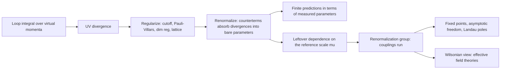

## Renormalization & the Renormalization Group

[Quantum Field Theory](quantum-field-theory.html) &raquo; Renormalization &amp; the Renormalization Group

**Renormalization** is the procedure that turns the divergent loop integrals of quantum field theory into finite predictions. The key point is that the masses and couplings written in a Lagrangian are not the quantities experiments measure. Measured values include the effects of virtual particles and depend on the energy scale at which they are probed. Once the theory is written in terms of measured quantities, the infinities cancel. What remains is the **renormalization group** (RG): the scale dependence ("running") of couplings, which accounts for asymptotic freedom in QCD, the growth of the fine-structure constant at high energy, and the universality of critical phenomena. In Wilson's formulation, renormalizability stops being a requirement placed on fundamental theories. It becomes a statement about which interactions survive at low energies, and this is the basis of [effective field theory](#effective-field-theory-the-modern-viewpoint). This page assumes the Feynman-diagram machinery of [Path Integrals & Methods](qft-methods.html).

## Where the Divergences Come From

A loop in a Feynman diagram integrates over the momentum of a virtual particle, and nothing in the theory bounds that momentum. The simplest case is the one-loop "tadpole" correction to the scalar propagator in $\phi^4$ theory with $\mathcal{L}_{\text{int}} = -\tfrac{\lambda}{4!}\phi^4$:

$$-iM^2_{\text{1-loop}} = \frac{-i\lambda}{2}\int\frac{d^4k}{(2\pi)^4}\,\frac{i}{k^2 - m^2 + i\varepsilon} \quad\xrightarrow{\text{Wick rotate}}\quad M^2_{\text{1-loop}} = \frac{\lambda}{2}\int\frac{d^4k_E}{(2\pi)^4}\,\frac{1}{k_E^2 + m^2}.$$

At large $k_E$ the integrand falls as $1/k_E^2$ while the measure grows as $k_E^3\,dk_E$. With a cutoff $\Lambda$ on $k_E$, the integral grows as $\Lambda^2$: the correction to the mass is **quadratically divergent**.

**UV and IR divergences are different problems.** Ultraviolet divergences come from large loop momenta and are dealt with by renormalization. **Infrared** divergences arise in theories with massless particles, from soft (low-energy) or collinear emissions. They are not removed by renormalization. They cancel in any physically measurable quantity once real emission of unresolved soft photons or gluons is included together with the virtual corrections (the Bloch-Nordsieck and Kinoshita-Lee-Nauenberg theorems). The rest of this page is about UV divergences.

### Power counting

The **superficial degree of divergence** $D$ of a diagram is the number of powers of loop momentum in the numerator minus the number in the denominator. The integral goes as $\Lambda^D$ for $D > 0$, as $\ln\Lambda$ for $D = 0$, and converges superficially for $D < 0$. Dimensional analysis gives $D$ without drawing the diagram. In $d$ spacetime dimensions, a diagram with external fields of mass dimensions $[\phi_e]$ and vertices with couplings $g_v$ has

$$D = d - \sum_{\text{external}}[\phi_e] - \sum_{\text{vertices}}[g_v].$$

For $\phi^4$ theory in four dimensions ($[\phi] = 1$, $[\lambda] = 0$) this gives $D = 4 - E$. Only the 2-point function (quadratic) and the 4-point function (logarithmic) diverge. For QED ($[\psi] = 3/2$, $[A] = 1$, $[e] = 0$), $D = 4 - \tfrac{3}{2}E_\psi - E_\gamma$. Symmetries reduce the actual divergence below the superficial one:

| QED amplitude | External legs | $D$ | Actual behaviour | Reason |
|---------------|---------------|-----|------------------|--------|
| Electron self-energy | $2\psi$ | 1 | logarithmic | chiral symmetry: $\delta m \propto m$ |
| Photon self-energy (vacuum polarization) | $2\gamma$ | 2 | logarithmic | Ward identity forces $\Pi^{\mu\nu} \propto q^2g^{\mu\nu} - q^\mu q^\nu$ |
| Electron-photon vertex | $2\psi + 1\gamma$ | 0 | logarithmic | none |
| Three-photon amplitude | $3\gamma$ | 1 | vanishes | Furry's theorem (charge conjugation) |
| Light-by-light scattering | $4\gamma$ | 0 | finite | gauge invariance |

So QED has three independent divergent quantities. They are absorbed into three renormalization constants, fixing the mass, the charge and the field normalization.

### Renormalizability and the dimension of couplings

Power counting also classifies theories. If every coupling has mass dimension $[g] \ge 0$, only finitely many amplitudes diverge, and a finite set of counterterms absorbs all divergences to all orders: the theory is **renormalizable**. A coupling with $[g] < 0$ makes $D$ grow with the number of vertices. New divergent amplitudes then appear at every order, and each needs a new parameter, which in the old terminology makes the theory **non-renormalizable**. The Wilsonian terms for the same classification are:

| Class | Coupling dimension in $d = 4$ | Operator dimension | Low-energy behaviour | Examples |
|-------|-------------------------------|--------------------|----------------------|----------|
| Relevant | $[g] > 0$ | $< 4$ | grows toward the IR | mass terms $m^2\phi^2$, the cosmological constant |
| Marginal | $[g] = 0$ | $= 4$ | runs logarithmically | gauge couplings, Yukawa couplings, $\lambda\phi^4$ |
| Irrelevant | $[g] < 0$ | $> 4$ | suppressed by $(E/\Lambda)^{\dim - 4}$ | Fermi's $G_F$, Newton's $G_N$, the Weinberg operator |

Every coupling in the Standard Model Lagrangian is relevant or marginal. The [Wilsonian section](#the-wilsonian-renormalization-group) below explains why this is to be expected and is not a coincidence.

## Regularization

Before a divergence can be subtracted it has to be made finite in a controlled way. A **regulator** introduces a parameter that makes every integral finite. Physical predictions must not depend on it once renormalization is complete.

| Scheme | Prescription | Preserves | Breaks or obscures | Typical use |
|--------|--------------|-----------|--------------------|-------------|
| Momentum cutoff | restrict $\lvert k_E\rvert < \Lambda$ | intuition: $\Lambda$ is where the theory stops being trusted | Lorentz and gauge invariance | Wilsonian RG, condensed matter |
| Pauli-Villars | $\dfrac{1}{k^2 - m^2} \to \dfrac{1}{k^2 - m^2} - \dfrac{1}{k^2 - M^2}$, then $M \to \infty$ | Lorentz invariance; gauge invariance in QED | non-abelian gauge invariance | QED, anomaly calculations |
| Dimensional regularization | continue to $d = 4 - \epsilon$ dimensions | Lorentz and gauge invariance | power divergences are invisible; $\gamma^5$ is ambiguous | essentially all Standard Model loop calculations |
| Lattice | discretize spacetime with spacing $a$, so $\Lambda \sim \pi/a$ | gauge invariance (Wilson's formulation), non-perturbative | Lorentz invariance (recovered as $a \to 0$); chiral fermions need special care | lattice QCD |

### Dimensional regularization

Loop integrals converge in low enough dimension. Evaluate them for general $d$ and continue analytically to $d = 4 - \epsilon$. The basic one-loop integral in Minkowski signature is

$$\int\frac{d^d\ell}{(2\pi)^d}\,\frac{1}{(\ell^2 - \Delta + i\varepsilon)^n} = \frac{(-1)^n\,i}{(4\pi)^{d/2}}\,\frac{\Gamma\!\left(n - \frac{d}{2}\right)}{\Gamma(n)}\left(\frac{1}{\Delta}\right)^{n - d/2}.$$

For $n = 2$, which is the log-divergent case in four dimensions, the divergence shows up as a pole of the Gamma function:

$$\Gamma\!\left(\frac{\epsilon}{2}\right)\left(\frac{4\pi}{\Delta}\right)^{\epsilon/2} = \frac{2}{\epsilon} - \gamma_E + \ln 4\pi - \ln\Delta + O(\epsilon).$$

In $d$ dimensions a four-dimensional coupling acquires a mass dimension. To keep it dimensionless one writes $\lambda \to \lambda\,\mu^{\epsilon}$, which introduces an arbitrary **renormalization scale** $\mu$. Physical results cannot depend on $\mu$, and that requirement is the origin of the renormalization group. Dimensional regularization sets scaleless integrals such as $\int d^d\ell/\ell^2$ to zero, so power divergences never appear. This is technically convenient. It also hides the sensitivity of scalar masses to heavy scales that underlies the [hierarchy problem](#open-problems).

## Renormalized Perturbation Theory

The *bare* parameters in the Lagrangian are never measured directly. Rewrite them as *renormalized* (finite, measured) parameters plus **counterterms**, and fix the counterterms order by order so that divergences cancel.

### Counterterms

For $\phi^4$ theory, rescale the bare field and parameters (subscript 0) by renormalization constants:

$$\phi_0 = \sqrt{Z_\phi}\,\phi, \qquad Z_\phi m_0^2 = m^2 + \delta_m, \qquad Z_\phi^2\lambda_0 = \lambda\mu^{\epsilon} + \delta_\lambda\mu^{\epsilon}, \qquad Z_\phi = 1 + \delta_Z.$$

The bare Lagrangian then splits into the original form with renormalized parameters plus a counterterm Lagrangian:

$$\mathcal{L} = \frac{1}{2}(\partial_\mu\phi)^2 - \frac{1}{2}m^2\phi^2 - \frac{\lambda\mu^{\epsilon}}{4!}\phi^4 + \frac{1}{2}\delta_Z(\partial_\mu\phi)^2 - \frac{1}{2}\delta_m\phi^2 - \frac{\delta_\lambda\mu^{\epsilon}}{4!}\phi^4.$$

The counterterms are treated as additional vertices. For example, $\delta_\lambda$ gives a vertex $-i\delta_\lambda$. A theory is renormalizable when a finite set of such terms (three in this case) is enough at every order.

### Worked example: the one-loop beta function of $\phi^4$

At one loop the four-point amplitude receives the "fish" diagram in the $s$, $t$ and $u$ channels. Each has symmetry factor $\tfrac12$. With Feynman parameters and the master integral above,

$$\frac{(-i\lambda)^2}{2}\int\frac{d^d\ell}{(2\pi)^d}\,\frac{i}{\ell^2 - m^2}\,\frac{i}{(\ell + p)^2 - m^2} = \frac{i\lambda^2}{32\pi^2}\int_0^1 dx\left[\frac{2}{\epsilon} - \gamma_E + \ln 4\pi - \ln\frac{m^2 - x(1-x)p^2}{\mu^2}\right].$$

The full amplitude at this order is $i\mathcal{M} = -i\lambda - i\delta_\lambda + (\text{fish})_s + (\text{fish})_t + (\text{fish})_u$. In the $\overline{\text{MS}}$ scheme the counterterm removes exactly the pole together with its $-\gamma_E + \ln 4\pi$ companion:

$$\delta_\lambda = \frac{3\lambda^2}{32\pi^2}\left(\frac{2}{\epsilon} - \gamma_E + \ln 4\pi\right), \qquad \mathcal{M} = -\lambda - \frac{\lambda^2}{32\pi^2}\sum_{p^2 = s,t,u}\int_0^1 dx\,\ln\frac{m^2 - x(1-x)p^2}{\mu^2}.$$

$\mathcal{M}$ is finite and is a physical amplitude, so it cannot depend on the arbitrary $\mu$. Its explicit $\ln\mu^2$ dependence must be cancelled by $\mu$-dependence of $\lambda$. Setting $\mu\,d\mathcal{M}/d\mu = 0$ at this order gives

$$\beta(\lambda) \equiv \mu\frac{d\lambda}{d\mu} = \frac{3\lambda^2}{16\pi^2} + O(\lambda^3).$$

The coupling grows at high energy. At one loop the tadpole does not depend on momentum, so $\delta_Z = 0$ at this order and wavefunction renormalization first appears at two loops.

### Renormalization schemes

The divergent part of each counterterm is fixed, but its finite part is a convention. The choice of convention is the **scheme**. Different schemes give different values for "the mass" or "the coupling", but relations between physical observables are the same in all of them (up to higher-order terms not yet computed).

| Scheme | Definition | Pros | Cons |
|--------|------------|------|------|
| On-shell (physical) | pole of the propagator at the physical mass with unit residue; coupling fixed by an amplitude at a physical point (e.g. Thomson scattering, $q^2 = 0$, for $\alpha$) | parameters are directly measurable | awkward for quarks (no physical pole mass for confined particles) and at high energy (large logarithms) |
| MS | subtract only the $1/\epsilon$ poles | simplest algebra | leaves $\ln 4\pi - \gamma_E$ everywhere |
| $\overline{\text{MS}}$ | subtract $\frac{2}{\epsilon} - \gamma_E + \ln 4\pi$ | standard for QCD and electroweak; mass-independent RG | parameters such as $\alpha_s(\mu)$ and $\overline{m}_t(\mu)$ depend on $\mu$ and are not directly observable |
| Momentum subtraction (MOM) | conditions imposed at a Euclidean point $p^2 = -\mu^2$ | natural for the lattice and Wilsonian intuition | gauge dependent |

Top-quark mass determinations illustrate the point: the $\overline{\text{MS}}$ mass $\overline{m}_t(\overline{m}_t)$ and the pole mass differ by roughly 10 GeV, so a quoted top mass is only meaningful together with its scheme.

## QED at One Loop

The three primitively divergent QED amplitudes are the standard textbook calculations. The counterterms $\delta_2$ (electron field), $\delta_m$ (mass), $\delta_3$ (photon field) and $\delta_1$ (vertex) absorb their divergences.

**Electron self-energy.**

$$-i\Sigma_2(p) = (-ie)^2\int\frac{d^4k}{(2\pi)^4}\,\gamma^\mu\,\frac{i(\not{p} - \not{k} + m)}{(p - k)^2 - m^2 + i\varepsilon}\,\gamma_\mu\,\frac{-i}{k^2 + i\varepsilon}.$$

The resulting mass shift is proportional to $m$ itself, $\delta m \approx \frac{3\alpha}{4\pi}\,m\ln(\Lambda^2/m^2)$. A massless electron would have an extra chiral symmetry that forbids a mass from being generated, so fermion masses are *technically natural*. Scalar masses have no such protection.

**Vacuum polarization.** The Ward identity forces $\Pi^{\mu\nu}(q) = (q^2g^{\mu\nu} - q^\mu q^\nu)\,\Pi(q^2)$, so the photon remains massless. In dimensional regularization,

$$\Pi_2(q^2) = -\frac{2\alpha}{\pi}\int_0^1 dx\;x(1-x)\left[\frac{2}{\epsilon} - \gamma_E + \ln 4\pi - \ln\frac{m^2 - x(1-x)q^2}{\mu^2}\right].$$

After on-shell subtraction ($\hat\Pi_2(q^2) = \Pi_2(q^2) - \Pi_2(0)$) the effective coupling is $\alpha_{\text{eff}}(q^2) = \alpha/[1 - \hat\Pi_2(q^2)]$. At large spacelike momentum transfer this becomes

$$\alpha_{\text{eff}}(q^2) \approx \frac{\alpha}{1 - \dfrac{\alpha}{3\pi}\ln\dfrac{-q^2}{A\,m^2}}, \qquad A = e^{5/3}, \qquad -q^2 \gg m^2.$$

Virtual pairs screen the bare charge, so the effective charge increases as the probe gets closer. At atomic distances the same effect gives the Uehling potential, which contributes about $-27$ MHz to the hydrogen $2S_{1/2}$-$2P_{1/2}$ Lamb shift of about 1058 MHz.

**Vertex correction and $g-2$.** The one-loop vertex gives a finite correction to the magnetic form factor, $F_2(0) = \alpha/2\pi$ (Schwinger, 1948). This is the leading term of the anomalous magnetic moment $a = (g-2)/2$. The Ward-Takahashi identity implies $\delta_1 = \delta_2$, so charge renormalization comes only from $\delta_3$ (vacuum polarization). That is why electrons, muons and protons, despite very different interactions, carry exactly the same renormalized charge.

### Precision status (2026)

| Quantity | Experiment | Theory | Status |
|----------|------------|--------|--------|
| Electron $a_e$ | $g/2 = 1.001\,159\,652\,180\,59(13)$, 0.13 ppt (Northwestern, 2023) | QED through five loops (12,672 five-loop diagrams), plus small hadronic and electroweak terms | Agreement, limited by the input value of $\alpha$. The Cs (2018) and Rb (2020) atom-recoil measurements of $\alpha$ disagree by more than $5\sigma$. |
| Fine-structure constant | $\alpha^{-1} = 137.035\,999\,166(15)$ inferred from $a_e$ (2023) | not applicable | The most precise determination of $\alpha$, obtained by assuming QED is correct. |
| Muon $a_\mu$ | 127 ppb, Fermilab final result (June 2025) | $116\,592\,033(62)\times 10^{-11}$, Theory Initiative 2025 (lattice hadronic vacuum polarization) | Difference $38(63)\times 10^{-11}$: no significant tension. The lattice and $e^+e^-$ data-driven hadronic evaluations still disagree with each other. |

## The Renormalization Group Equation

Because bare quantities do not know about $\mu$, renormalized Green's functions must change with $\mu$ in a compensating way. For $G^{(n)} = \langle\phi\cdots\phi\rangle$ with $n$ renormalized fields, this is expressed by the **renormalization group equation** (the Callan-Symanzik equation in its modern, mass-independent form):

$$\left[\mu\frac{\partial}{\partial\mu} + \beta(g)\frac{\partial}{\partial g} + \gamma_m\,m\frac{\partial}{\partial m} + n\,\gamma_\phi\right]G^{(n)}(x_i;\,g, m, \mu) = 0,$$

with

$$\beta(g) = \mu\frac{dg}{d\mu}, \qquad \gamma_m = \frac{\mu}{m}\frac{dm}{d\mu}, \qquad \gamma_\phi = \frac{1}{2}\,\mu\frac{d\ln Z_\phi}{d\mu},$$

where all derivatives are taken at fixed bare parameters. The **beta function** gives the running of the coupling. The **anomalous dimension** $\gamma_\phi$ shifts the scaling dimension of the field away from its classical value, so that at a fixed point $\langle\phi(x)\phi(0)\rangle \propto 1/\lvert x\rvert^{2(\Delta_0 + \gamma_\phi)}$. (Sign conventions for $\gamma_\phi$ and $\gamma_m$ differ between textbooks.)

Solving the equation replaces $g$ by the **running coupling** $\bar g(\mu)$, defined by $d\bar g/d\ln\mu = \beta(\bar g)$. In practice this means choosing $\mu$ close to the physical scale $Q$ of the process, which prevents large logarithms $\ln(Q/\mu_0)$ from spoiling perturbation theory. For a gauge coupling at one loop, $\mu\,d\alpha/d\mu = -\frac{b_0}{2\pi}\alpha^2$, and the solution resums all leading logarithms:

$$\alpha(\mu) = \frac{\alpha(\mu_0)}{1 + \dfrac{b_0}{2\pi}\,\alpha(\mu_0)\ln\dfrac{\mu}{\mu_0}}, \qquad b_0 = \frac{11}{3}C_A - \frac{4}{3}\sum_{\text{Dirac}}T_F - \frac{1}{3}\sum_{\text{complex scalars}}T_S.$$

Here $C_A$ is the adjoint Casimir ($N$ for $SU(N)$, 0 for $U(1)$) and $T$ is the index of each matter representation ($\tfrac{1}{2}$ for the fundamental of $SU(N)$, $Q^2$ for a $U(1)$ charge $Q$). The $\tfrac{11}{3}C_A$ term comes from gauge-boson self-interactions and is anti-screening. Matter fields screen.

### One-loop beta functions

| Theory | $\beta$ at one loop | Sign | Consequence |
|--------|---------------------|------|-------------|
| $\phi^4$ in $d = 4$ | $\dfrac{3\lambda^2}{16\pi^2}$ | $+$ | Landau pole; "trivial" as a continuum theory |
| QED (one Dirac fermion) | $\beta(e) = \dfrac{e^3}{12\pi^2}$, i.e. $b_0 = -\tfrac{4}{3}$ | $+$ | screening; Landau pole near $10^{277}$ GeV |
| $SU(N)$ Yang-Mills with $n_f$ fundamental Dirac fermions | $b_0 = \tfrac{11}{3}N - \tfrac{2}{3}n_f$ | $-$ for $n_f < \tfrac{11}{2}N$ | asymptotic freedom |
| QCD ($N = 3$) | $b_0 = 11 - \tfrac{2}{3}n_f$ | $-$ for $n_f \le 16$ | asymptotic freedom, confinement in the IR |
| $\mathcal{N} = 4$ super-Yang-Mills | $\beta = 0$ to all orders | none | exactly conformal |

### Fixed points and flows

Zeros of the beta function, $\beta(g_\ast) = 0$, are **fixed points**, where the theory is scale invariant (and in practice conformally invariant). The sign of $\beta$ nearby determines the direction of the flow:

- **Asymptotic freedom.** $g_\ast = 0$ is approached in the UV ($\beta < 0$ near zero). This is the behaviour of QCD and of non-abelian theories with few enough fermions.
- **IR freedom, or triviality.** $\beta > 0$ near zero. The coupling vanishes in the IR and grows in the UV toward a Landau pole. This is the behaviour of QED and $\phi^4$ in four dimensions.
- **Interacting fixed points.** $g_\ast \ne 0$. In the IR, these are the critical points of statistical mechanics, such as the Wilson-Fisher point below, and the conformal window of gauge theories with many flavours (Banks-Zaks). In the UV, a non-trivial fixed point gives **asymptotic safety**, proposed as a UV completion of [gravity](qft-frontiers.html#candidate-completions-and-constraints).

## Running Couplings in Practice

### QED

From $1/\alpha(Q) = 1/\alpha(\mu) - \frac{2}{3\pi}\sum_f Q_f^2 N_c^f\ln(Q/\mu)$, including every charged fermion lighter than $Q$, the fine-structure constant rises from $\alpha(0) \approx 1/137.036$ to $\alpha(M_Z) \approx 1/128$. This rise was measured at LEP. The hadronic part of the running cannot be computed perturbatively. It is taken from $e^+e^- \to$ hadrons data, the same input that enters the muon $g-2$. For a single electron the one-loop Landau pole lies at $m_e\,e^{3\pi/2\alpha} \sim 10^{277}$ GeV. That is far beyond the Planck scale, so in practice QED is part of the electroweak theory long before the pole matters.

### QCD

$$\alpha_s(Q^2) = \frac{\alpha_s(\mu^2)}{1 + \dfrac{b_0}{4\pi}\,\alpha_s(\mu^2)\ln\dfrac{Q^2}{\mu^2}} = \frac{4\pi}{b_0\ln\left(Q^2/\Lambda_{\text{QCD}}^2\right)}, \qquad b_0 = 11 - \frac{2}{3}n_f.$$

The second form shows **dimensional transmutation**. Classical massless QCD has no scale, but the quantum theory generates one, $\Lambda_{\text{QCD}}$, which is a few hundred MeV (about 0.2 GeV for five flavours in $\overline{\text{MS}}$). Almost all of the mass of ordinary matter (proton and neutron masses) comes from this scale and not from the Higgs mechanism. At short distances $\alpha_s \to 0$. This **asymptotic freedom** (Gross, Wilczek and Politzer, 1973; Nobel Prize 2004) explains the nearly free quarks seen in deep inelastic scattering. At long distances the coupling becomes strong and quarks are confined. Confinement shows up as a linear potential $V(r) \approx \sigma r$, with string tension $\sigma \approx (0.44\ \text{GeV})^2$ from lattice QCD. It has not been derived analytically; proving a mass gap in Yang-Mills theory is one of the Clay Millennium Prize problems.

The QCD beta function is known to five loops (2016-2017). The world average in the 2025 PDG review is $\alpha_s(M_Z) = 0.1180 \pm 0.0009$, with lattice QCD the single most precise input.

### Coupling unification

With the three gauge couplings in GUT normalization, running them upward brings them close together near $10^{15}$-$10^{16}$ GeV. In the Standard Model alone they do not meet at a single point. In the minimal supersymmetric Standard Model they meet near $2\times 10^{16}$ GeV to within uncertainties. This near-meeting is a quantitative hint of grand unification. Current proton-decay limits and the LHC's failure so far to find superpartners constrain the simplest versions.

## The Wilsonian Renormalization Group

Wilson (Nobel Prize 1982) gave renormalization a physical interpretation that does not rely on infinities. Suppose the theory is defined with a cutoff $\Lambda$. To describe physics at lower energies:

1. **Coarse-grain.** Split the field into slow and fast modes, $\phi = \phi_< + \phi_>$, where $\phi_>$ contains the momenta $\Lambda/b < \lvert k\rvert < \Lambda$. Integrate out $\phi_>$ in the path integral. The result is a new action for $\phi_<$ that contains every interaction allowed by symmetry.
2. **Rescale.** Rescale momenta by $k \to bk$ and the fields to restore the original cutoff and kinetic term.
3. **Repeat.** Each step maps the couplings to new values, $\{g_i\} \to \{g_i'\}$. Repeating the step generates a flow in the space of all possible theories.

Near a fixed point, an operator with scaling dimension $\Delta_i$ has a coupling that scales as $g_i \to b^{\,d - \Delta_i}\,g_i$. **Relevant** operators ($\Delta_i < d$) grow under the flow, and a finite number of them must be tuned to reach the critical point. **Irrelevant** operators ($\Delta_i > d$) shrink and are forgotten. Many different microscopic theories therefore flow to the same long-distance theory. This is **universality**: water at its critical point and a uniaxial magnet have the same critical exponents because they flow to the same fixed point.

<figure class="diagram">
<svg viewBox="0 0 520 250" role="img" aria-labelledby="renorm-wf-title" style="max-width:520px;width:100%;color:inherit;">
<title id="renorm-wf-title">Beta function of phi^4 theory in 4 - epsilon dimensions: negative between the Gaussian fixed point at zero and the Wilson-Fisher fixed point, positive beyond it. Flow toward the infrared converges on the Wilson-Fisher point from both sides.</title>
<defs><marker id="renorm-arr" markerWidth="8" markerHeight="8" refX="6" refY="3" orient="auto"><path d="M0,0 L0,6 L8,3 z" fill="currentColor"/></marker></defs>
<g stroke="currentColor" fill="none">
<line x1="40" y1="130" x2="470" y2="130" stroke-width="1" opacity="0.6" marker-end="url(#renorm-arr)"/>
<line x1="60" y1="235" x2="60" y2="15" stroke-width="1" opacity="0.6" marker-end="url(#renorm-arr)"/>
<path d="M60,130 Q220,290 380,23.3" stroke-width="2.2"/>
<line x1="95" y1="150" x2="245" y2="150" stroke-width="1.6" stroke-dasharray="4 3" marker-end="url(#renorm-arr)"/>
<line x1="440" y1="150" x2="330" y2="150" stroke-width="1.6" stroke-dasharray="4 3" marker-end="url(#renorm-arr)"/>
</g>
<circle cx="60" cy="130" r="5" fill="none" stroke="currentColor" stroke-width="2"/>
<circle cx="300" cy="130" r="5" fill="currentColor"/>
<g fill="currentColor" font-size="13" font-family="sans-serif">
<text x="470" y="122" text-anchor="end">λ</text>
<text x="68" y="24">β(λ)</text>
<text x="66" y="118">Gaussian</text>
<text x="300" y="118" text-anchor="middle">Wilson–Fisher λ*</text>
<text x="170" y="170" text-anchor="middle" font-size="12">IR flow</text>
<text x="390" y="170" text-anchor="middle" font-size="12">IR flow</text>
<text x="250" y="232" text-anchor="middle" font-size="12">β(λ) = −ελ + 3λ²/16π²  in d = 4 − ε</text>
</g>
</svg>
<figcaption>In $d = 4 - \epsilon$ dimensions the $\phi^4$ beta function acquires a classical term $-\epsilon\lambda$. The Gaussian fixed point $\lambda = 0$ becomes IR-unstable, and couplings flow at long distances to the interacting Wilson-Fisher fixed point, which describes the Ising critical point.</figcaption>
</figure>

**The Wilson-Fisher fixed point.** Below four dimensions $\lambda$ has positive mass dimension, and the dimensionless coupling obeys $\beta = -\epsilon\lambda + 3\lambda^2/16\pi^2$. This has a non-trivial IR fixed point at $\lambda_\ast = 16\pi^2\epsilon/3$. Expanding around it gives critical exponents as series in $\epsilon$, for example $\nu = \tfrac12 + \tfrac{\epsilon}{12} + O(\epsilon^2)$ for the Ising class. The $\epsilon$-expansion is now known to high order. Setting $\epsilon = 1$ and resumming gives $\nu \approx 0.630$ for the 3D Ising model, which agrees with Monte Carlo and with the numerical conformal bootstrap. The bootstrap currently gives the most precise values ($\nu = 0.62997$, $\eta = 0.0363$).

**Exact (functional) RG.** Polchinski's equation (1984) and Wetterich's equation (1993) turn Wilson's step into a differential equation for the full effective action. Wetterich's version for the scale-dependent effective action $\Gamma_k$, with infrared regulator $R_k$, is

$$\partial_t\Gamma_k = \frac{1}{2}\,\mathrm{Tr}\left[\left(\Gamma_k^{(2)} + R_k\right)^{-1}\partial_t R_k\right], \qquad t = \ln k.$$

It is exact but has to be truncated in practice. It is the main tool of the asymptotic-safety program and is widely used in condensed matter.

In this language, the continuum limit of a QFT is a flow that starts arbitrarily close to a UV fixed point, and "renormalizable" means the flow is controlled by a fixed point with finitely many relevant directions. The same mathematics governs [phase transitions and critical phenomena](statistical-mechanics/phase-transitions-and-advanced.html) and [condensed-matter systems](condensed-matter/), where Wilson first developed it.

## Effective Field Theory: The Modern Viewpoint

The Wilsonian flow shows that a quantum field theory never has to be valid at arbitrarily high energy. It only has to describe physics below some scale $\Lambda$ where new degrees of freedom appear. Integrating out everything above $\Lambda$ leaves

$$\mathcal{L}_{\text{eff}} = \mathcal{L}_{d \le 4} + \sum_i\frac{c_i}{\Lambda^{d_i - 4}}\,\mathcal{O}_i,$$

an infinite set of operators $\mathcal{O}_i$ of dimension $d_i$ with dimensionless Wilson coefficients $c_i$.

**Why nature looks renormalizable.** At energy $E \ll \Lambda$, an operator of dimension $d_i > 4$ contributes at relative order $(E/\Lambda)^{d_i - 4}$. At low energies only the relevant and marginal interactions are visible, and these are exactly the renormalizable ones. Renormalizability is therefore not a law of nature. It is what any theory looks like when observed far below the scale of its UV completion. The **decoupling theorem** (Appelquist-Carazzone, 1975) makes this precise for heavy particles: their effects are either absorbed into renormalized low-energy couplings or suppressed by powers of $1/M$.

**Non-renormalizable interactions point to new scales.** Fermi's $G_F \approx 1.17\times 10^{-5}\ \text{GeV}^{-2}$ pointed to $m_W$. Newton's $G_N = 1/M_{\text{Pl}}^2$ points to quantum gravity near $10^{19}$ GeV. The Weinberg operator $(LH)(LH)/\Lambda$, the leading dimension-5 correction to the Standard Model, gives neutrino masses $m_\nu \sim v^2/\Lambda$. Observed masses below about 0.1 eV correspond to $\Lambda \sim 10^{14}$-$10^{15}$ GeV, a hint of a seesaw scale. Dimension-6 operators mediate proton decay and are probed in SMEFT fits at the LHC.

**Non-renormalizable theories are predictive at low energy.** General relativity quantized as an EFT gives a calculable, finite one-loop quantum correction to the Newtonian potential. It is a genuine prediction, although far too small to measure. The practical steps (matching, running and power counting), the worked Fermi-theory example, and a catalogue of the effective theories in use are on the [methods page](qft-methods.html#effective-field-theory-in-practice).

## Open Problems

- **Hierarchy problem.** Scalar masses are not protected by any symmetry, so the Higgs mass parameter receives corrections of order the heaviest scale it couples to. With a cutoff, the top-quark loop alone gives $\delta m_H^2 \approx -\frac{3y_t^2}{8\pi^2}\Lambda^2$. If $\Lambda$ is near the Planck or GUT scale, a Higgs at 125 GeV requires tuning to many decimal places. Proposed solutions include supersymmetry, compositeness, extra dimensions, and cosmological relaxation of the Higgs mass. Anthropic selection is also invoked. None has been confirmed, and LHC null results have pushed natural solutions into increasingly tuned corners.
- **Cosmological constant problem.** Vacuum energy is the most relevant operator of all, of dimension 0. Naive estimates of its size exceed the observed dark-energy density by roughly 60 to 120 orders of magnitude, depending on the cutoff assumed.
- **Triviality.** $\phi^4$ theory in four dimensions has no interacting continuum limit. Aizenman and Duminil-Copin proved this rigorously for the Ising-type lattice scalar field in 2021. QED is expected to behave the same way. Both make sense only as effective theories with a finite cutoff. The Higgs sector inherits this, which gives upper bounds on the Higgs mass as a function of the cutoff.
- **Asymptotic safety of gravity.** Functional RG truncations consistently find a non-trivial UV fixed point for gravity, but control of the truncations and unitarity in Lorentzian signature are still open questions.
- **Mathematical foundations.** No interacting QFT in four dimensions has been constructed rigorously. The Yang-Mills existence and mass-gap problem remains open.

## See Also

- [Quantum Field Theory](quantum-field-theory.html): the overview hub and reading order.
- [Path Integrals & Methods](qft-methods.html): Feynman rules, loop techniques and EFT matching in practice.
- [Gauge Theories & the Standard Model](gauge-and-standard-model.html): the theories whose couplings run, including asymptotic freedom in QCD.
- [QFT: Modern Frontiers](qft-frontiers.html): anomalies, asymptotic safety and gravity as an EFT.
- [Statistical Mechanics: Phase Transitions](statistical-mechanics/phase-transitions-and-advanced.html): critical phenomena and universality, where Wilson's RG began.
- [Condensed Matter Physics](condensed-matter/): RG flows in many-body systems.
- [String Theory](string-theory/): a UV completion in which the loop divergences of gravity do not arise.
- [Physics Hub](index.html): all physics topics.
