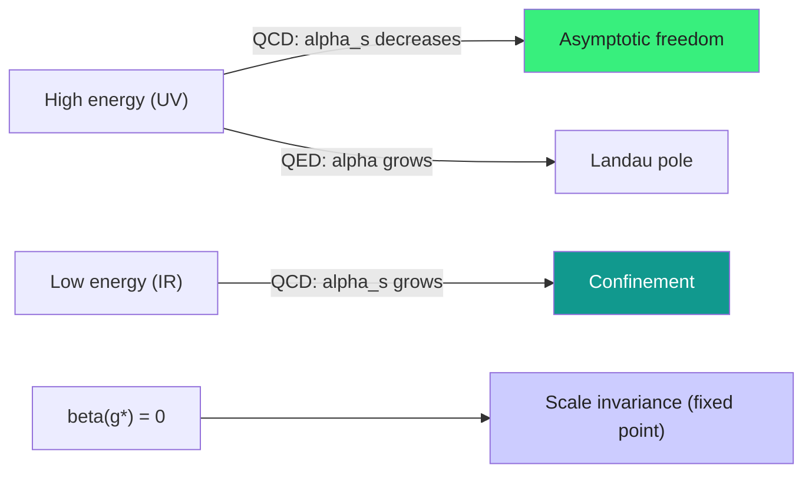

  <h1 style="color: white; margin: 0; font-size: 2.5rem;">Renormalization &amp; the Renormalization Group</h1>
  
Why loop integrals diverge, how regularization and renormalization extract finite physics, and how the renormalization group reveals that physics depends on the scale you probe.

[Quantum Field Theory](quantum-field-theory.html) &raquo; Renormalization &amp; the Renormalization Group

  <h4>The physical idea behind renormalization</h4>
  
Early QFT calculations produced infinite answers, which nearly killed the theory. The resolution is profound: the "constants" in the Lagrangian (mass, charge) are not what we measure. What we measure depends on the <strong>energy scale</strong> at which we probe — a bare electron is dressed by a cloud of virtual particles. Renormalization systematically separates the unmeasurable bare quantities from finite, measured ones. The result is not a trick but a deep statement: physics looks different at different scales, encoded by the <em>running</em> of couplings. The modern, Wilsonian view goes further still — renormalizability is not a fundamental requirement but a statement about which interactions survive when you zoom out to low energy.

This page develops, in full, the renormalization story that the [Quantum Field Theory](quantum-field-theory.html) overview only sketches: where the divergences come from, the regularization schemes that tame them, the renormalization procedure and its conditions, the renormalization group and running couplings, and the Wilsonian/effective-field-theory picture that ties it all together.

## Why Loop Integrals Diverge

A free quantum field is a collection of harmonic oscillators, one per momentum mode, and a propagator is just a correlator of those oscillators. Interactions force us to integrate over the momenta of *virtual* particles running around closed loops — and there is no upper limit on how energetic those virtual particles can be. The integration over arbitrarily large loop momentum $k$ is where the infinities live.

Consider the simplest example, the one-loop self-energy of a scalar in $\phi^4$ theory (interaction $-\tfrac{\lambda}{4!}\phi^4$). The "tadpole" correction to the propagator is

$$\Sigma = \frac{\lambda}{2} \int \frac{d^4k}{(2\pi)^4} \frac{i}{k^2 - m^2 + i\varepsilon}.$$

For large $|k|$ the integrand falls only as $1/k^2$, while the measure grows as $d^4k \sim k^3\,dk$, so the integral behaves like $\int^\Lambda k\,dk \sim \Lambda^2$. It diverges *quadratically* in the ultraviolet (UV).

### Power counting: which diagrams diverge

Whether a diagram diverges, and how badly, is fixed by simple dimensional bookkeeping. The **superficial degree of divergence** $D$ of a diagram in $d$ spacetime dimensions counts powers of loop momentum in the numerator minus the denominator:

$$D = d L - \sum_i (\text{powers of } k \text{ in denominator of propagator } i),$$

where $L$ is the number of independent loops. The integral diverges as $\Lambda^D$ ($\Lambda^0$ meaning a logarithm). For a scalar diagram with $L$ loops and $I$ internal lines, $L = I - V + 1$ ($V$ vertices), and each scalar propagator contributes $k^{-2}$, giving

$$D = 4L - 2I \quad (\text{in } d=4).$$

The three qualitative outcomes:

| $D$ | Behavior as $\Lambda \to \infty$ | Name |
|-----|----------------------------------|------|
| $D > 0$ | $\sim \Lambda^D$ | power divergence (quadratic, quartic, ...) |
| $D = 0$ | $\sim \ln \Lambda$ | logarithmic |
| $D < 0$ | finite (superficially) | convergent |

The qualitative menu of UV behaviors:

- **Logarithmic:** $\displaystyle \int^{\Lambda} \frac{d^4k}{k^4} \sim \ln\Lambda$
- **Quadratic:** $\displaystyle \int^{\Lambda} \frac{d^4k}{k^2} \sim \Lambda^2$
- **Quartic:** $\displaystyle \int^{\Lambda} d^4k \sim \Lambda^4$

### Renormalizability from power counting

The same counting tells you *which theories are renormalizable*. Write the coupling's mass dimension $[g]$. In $d = 4$ a coupling with $[g] \ge 0$ generates only a finite set of divergent amplitude types — the theory is **renormalizable** (or super-renormalizable). A coupling with $[g] < 0$ (e.g. a four-fermion contact term, or Newton's constant $G_N$) generates divergences in ever more amplitudes as the loop order grows: **non-renormalizable** in the old language. Classifying interactions by the dimension of their couplings:

- **Relevant** ($[g] > 0$): grow in importance toward low energy (e.g. a mass term).
- **Marginal** ($[g] = 0$): the gauge and Yukawa couplings of the Standard Model.
- **Irrelevant** ($[g] < 0$): die off as a power of $E/\Lambda$ at low energy — the hallmark of an [effective field theory](#effective-field-theory-the-modern-viewpoint).

This relevant/marginal/irrelevant language is the Wilsonian reorganization of "renormalizable," and we return to it below.

## Regularization

Before we can subtract an infinity we must first make it finite and bookkeep it. **Regularization** introduces a parameter that renders every integral finite; physical answers must be independent of that parameter once renormalization is done. Several schemes are in common use, each with different virtues.

### Momentum cutoff

The most intuitive: simply forbid loop momenta above a scale $\Lambda$,

$$\int d^4k \;\to\; \int_{|k| < \Lambda} d^4k.$$

This makes the Wilsonian picture transparent — $\Lambda$ is literally "the energy above which we stop trusting the theory" — but it breaks Lorentz invariance and gauge invariance, which makes it awkward for gauge theories.

### Pauli–Villars

Subtract a heavy fictitious partner from each propagator,

$$\frac{1}{k^2 - m^2} \;\to\; \frac{1}{k^2 - m^2} - \frac{1}{k^2 - \Lambda^2}.$$

At large $k$ the two terms cancel the leading $1/k^2$, softening the UV behavior; the regulator mass $\Lambda \to \infty$ at the end. It preserves Lorentz invariance and is convenient for QED.

### Dimensional regularization

By far the most widely used in modern work. Analytically continue the loop integrals to $d = 4 - \varepsilon$ spacetime dimensions, where they converge, and expose the divergence as a pole in $\varepsilon$. The master one-loop integral is

$$\int \frac{d^d k}{(2\pi)^d} \frac{1}{(k^2 - m^2)^n} = \frac{i(-1)^n}{(4\pi)^{d/2}} \frac{\Gamma\!\left(n - d/2\right)}{\Gamma(n)} \, (m^2)^{d/2 - n}.$$

A logarithmic divergence ($n = 2$, $d = 4$) appears as a pole of the Gamma function:

$$\Gamma\!\left(\frac{\varepsilon}{2}\right) = \frac{2}{\varepsilon} - \gamma_E + O(\varepsilon),$$

so divergences show up as $1/\varepsilon$ terms rather than powers of $\Lambda$. Dimensional regularization's great advantage is that it **respects Lorentz and gauge invariance automatically**, which is why it dominates Standard Model calculations. Its subtlety is that it sets power divergences to zero (a scaleless integral vanishes), so quadratic divergences are invisible — fine for renormalization, but it obscures the [hierarchy problem](#open-questions-and-connections).

Because $d$ is no longer $4$, the coupling acquires a mass dimension; one introduces an arbitrary mass scale $\mu$ to keep the renormalized coupling dimensionless, e.g. $\lambda \to \lambda\,\mu^{\varepsilon}$. **This arbitrary $\mu$ is the seed of the entire renormalization group** — the physics cannot depend on it, and demanding so is the Callan–Symanzik equation below.

## The Renormalization Procedure

The key conceptual move: split every parameter in the Lagrangian into a *bare* piece (formally infinite, never measured) and a *renormalized* piece (finite, measured), arranged so the divergences cancel order by order.

### Multiplicative renormalization and counterterms

Rescale the field and parameters by renormalization constants $Z$:

$$\phi = \sqrt{Z_\phi}\,\phi_r, \qquad m^2 = \frac{Z_m\,m_r^2}{Z_\phi}, \qquad \lambda = \frac{Z_\lambda\,\lambda_r}{Z_\phi^2}.$$

Substituting into the bare Lagrangian splits it into a renormalized Lagrangian (same form, finite parameters) plus a **counterterm Lagrangian** whose job is to cancel loop divergences:

$$\mathcal{L}_{ct} = (Z_\phi - 1)\tfrac{1}{2}(\partial_\mu\phi)^2 - (Z_m - 1)\tfrac{1}{2}m^2\phi^2 - (Z_\lambda - 1)\tfrac{\lambda}{4!}\phi^4.$$

Each $Z_i = 1 + \delta_i$ with a divergent $\delta_i$ chosen, order by order in perturbation theory, to absorb the corresponding loop divergence. A theory is renormalizable precisely when a *finite* set of such counterterms — here three — suffices to all orders.

### Renormalization conditions and schemes

The finite part left after subtraction is a matter of convention. Different **schemes** define the renormalized parameters differently; all give identical predictions for physical observables, but intermediate quantities (and the meaning of "the mass" or "the coupling") differ.

**On-shell scheme.** Define parameters by physical, measurable conditions:

1. The propagator has its pole at the physical mass: $\Sigma(m^2) = 0$.
2. The pole has unit residue: $\dfrac{d\Sigma}{dp^2}\bigg|_{p^2 = m^2} = 0$.
3. The coupling is fixed by a scattering amplitude at a chosen kinematic point.

This is the most physical scheme — $m$ really is the particle's rest mass — and is natural in QED.

**Minimal Subtraction (MS).** In dimensional regularization, simply drop the pole pieces:

$$Z = 1 + \sum_n \frac{a_n}{\varepsilon^n}.$$

**Modified Minimal Subtraction ($\overline{\text{MS}}$).** Also remove the ubiquitous $\ln(4\pi) - \gamma_E$ that always rides along with the $1/\varepsilon$ pole. The $\overline{\text{MS}}$ scheme is the standard for QCD and the Standard Model; the famous "$\overline{\text{MS}}$ mass" of the top quark or the strong coupling $\alpha_s(M_Z)$ are quoted in it.

The price of the mathematically clean MS/$\overline{\text{MS}}$ schemes is that the renormalized mass and coupling become $\mu$-dependent — they *run*. That running is the renormalization group.

### One-loop QED examples

The three primitive one-loop divergences of QED, the textbook worked examples:

**Electron self-energy** (correction to the propagator):

$$\Sigma(p) = -ie^2 \int \frac{d^4k}{(2\pi)^4} \frac{\gamma^\mu(\not{p}-\not{k}+m)\gamma_\mu}{[(p-k)^2 - m^2 + i\varepsilon]\,[k^2 + i\varepsilon]}.$$

**Vacuum polarization** (correction to the photon propagator) — this is what makes the electric charge run.

**Vertex correction** (correction to the electron–photon vertex):

$$\Lambda^\mu(p',p) = -ie^2 \int \frac{d^4k}{(2\pi)^4} \frac{\gamma^\nu(\not{p}'-\not{k}+m)\gamma^\mu(\not{p}-\not{k}+m)\gamma_\nu}{[(p'-k)^2 - m^2]\,[(p-k)^2 - m^2]\,[k^2]}.$$

The finite remainder of the vertex correction is one of the triumphs of QFT: it predicts the electron's anomalous magnetic moment, the celebrated $g-2 = \alpha/\pi + \cdots$, now confirmed to better than 12 significant figures. The Ward identity $Z_1 = Z_2$ guarantees the self-energy and vertex divergences conspire so that charge renormalization comes *only* from vacuum polarization — which is why charge universality survives.

## The Renormalization Group

The renormalization group (RG) is the statement that physics is invariant under changing the arbitrary reference scale $\mu$, plus the machinery that turns that invariance into predictive *running*.

### The Callan–Symanzik equation

A bare $n$-point Green's function cannot know about the arbitrary scale $\mu$ we introduced. The renormalized Green's function $G^{(n)}$ therefore obeys

$$\left[\mu\frac{\partial}{\partial\mu} + \beta(g)\frac{\partial}{\partial g} + \gamma_m\, m\frac{\partial}{\partial m} - n\,\gamma_\phi\right] G^{(n)}(x_i;\, g, m, \mu) = 0.$$

This says: any explicit $\mu$-dependence must be compensated by the implicit $\mu$-dependence of the running coupling $g(\mu)$, running mass, and field rescaling. The three RG functions encode that compensation.

### Beta function and anomalous dimensions

The **beta function** governs how the coupling runs with scale:

$$\beta(g) = \mu \frac{dg}{d\mu}\bigg|_{g_0, m_0 \text{ fixed}}.$$

The **anomalous dimension** of the field tracks how its normalization runs:

$$\gamma_\phi = \frac{\mu}{2 Z_\phi}\frac{dZ_\phi}{d\mu},$$

with an analogous $\gamma_m$ for the mass. Integrating the beta function gives the running coupling:

$$g(\mu) = g(\mu_0) + \int_{\mu_0}^{\mu} \frac{\beta(g)}{\mu'}\, d\mu'.$$

### Fixed points and the flow

The sign of $\beta$ is everything. Zeros of the beta function, $\beta(g_*) = 0$, are **fixed points** where the theory becomes scale-invariant:

- $\beta < 0$ at small $g$ &rArr; the coupling shrinks at high energy &rArr; **asymptotic freedom** (QCD).
- $\beta > 0$ &rArr; the coupling grows at high energy, possibly hitting a **Landau pole** (QED, $\phi^4$).
- A nontrivial UV fixed point $g_* \ne 0$ &rArr; **asymptotic safety**, a candidate UV completion (conjectured for gravity).

## Running Couplings in Practice

### QED: charge that grows with energy

Vacuum polarization screens charge: virtual $e^+e^-$ pairs polarize the vacuum around a bare charge, so the effective charge you see *increases* as you probe closer (higher energy). The one-loop QED beta function is positive,

$$\beta(e) = \frac{e^3}{12\pi^2} + O(e^5),$$

equivalently for $\alpha = e^2/4\pi$,

$$\frac{1}{\alpha(Q)} = \frac{1}{\alpha(\mu)} - \frac{1}{3\pi}\ln\frac{Q^2}{\mu^2}.$$

So $\alpha \approx 1/137$ at low energy grows to $\approx 1/128$ at the $Z$ pole ($Q = M_Z$), a measured effect. Extrapolated naively, $1/\alpha$ hits zero at the **Landau pole** — a sign QED is incomplete in isolation (it is, of course, embedded in the electroweak theory long before then).

### QCD: asymptotic freedom and confinement

Non-abelian gauge theories have an extra ingredient: gluons carry color and *anti*-screen the charge. When anti-screening wins, the beta function turns negative. The running of the strong coupling is

$$\alpha_s(Q^2) = \frac{\alpha_s(\mu^2)}{1 + \dfrac{\alpha_s(\mu^2)}{4\pi}\,\beta_0 \ln\!\big(Q^2/\mu^2\big)},$$

with one-loop coefficient

$$\beta_0 = 11 - \frac{2}{3}\,n_f,$$

where $n_f$ is the number of active quark flavors. For $n_f \le 16$ we have $\beta_0 > 0$, so $\alpha_s \to 0$ as $Q \to \infty$: **asymptotic freedom**, the 2004 Nobel discovery of Gross, Wilczek, and Politzer. Quarks behave almost freely at short distances (deep inelastic scattering) but the coupling blows up at low energy near the scale $\Lambda_{\text{QCD}} \approx 0.2$ GeV, driving **confinement** — the potential between a quark and antiquark grows linearly,

$$V(r) \approx k\,r,$$

so an infinite energy would be needed to separate them. The "11" comes from the gluon self-interaction (the non-abelian heart of QCD); the "$-2n_f/3$" is ordinary fermion screening as in QED. Anti-screening wins.

### Coupling unification

Run all three Standard Model gauge couplings up together and the screening/anti-screening rates make them converge toward a common value near $10^{16}$ GeV — strikingly close in the supersymmetric Standard Model. This near-meeting is one of the central hints for **grand unification** and is a direct, quantitative payoff of the renormalization group.

## Effective Field Theory: The Modern Viewpoint

Wilson's reframing turned renormalization from an embarrassing infinity-removal trick into the organizing principle of physics. The idea: you never need the theory at infinitely high energy. You need it only up to some cutoff $\Lambda$, above which new physics (heavier particles, finer structure) takes over. **Integrate out** everything heavier than $\Lambda$ and you are left with an effective Lagrangian for the light fields,

$$\mathcal{L}_{\text{eff}} = \mathcal{L}_{\text{renormalizable}} + \sum_i \frac{c_i}{\Lambda^{n_i}}\, \mathcal{O}_i,$$

an infinite tower of operators $\mathcal{O}_i$ of increasing mass dimension, suppressed by powers of $1/\Lambda$.

  <h4>Why nature looks renormalizable</h4>
  
At an energy $E \ll \Lambda$, each higher-dimension operator contributes a factor $(E/\Lambda)^{n_i}$ — these are the <em>irrelevant</em> operators, and they are tiny. What survives at low energy are precisely the relevant and marginal operators: the renormalizable interactions. So renormalizability is not a deep law imposed on nature; it is an automatic consequence of looking at physics from far below the scale of whatever completes it. The Standard Model is best read this way: a renormalizable EFT whose tiny non-renormalizable corrections (neutrino masses via the dimension-5 Weinberg operator, proton decay via dimension-6 operators) are our windows onto the next scale $\Lambda$.

### The EFT recipe

1. **Identify the scales.** Light fields below $\Lambda$, heavy physics above.
2. **Write every operator** consistent with the symmetries, organized by mass dimension.
3. **Match** the Wilson coefficients $c_i$ to the full theory (or measure them).
4. **Run** them with the RG down to the energy of interest, resumming large logarithms.
5. **Predict**, with errors controlled by the neglected $(E/\Lambda)^{n}$ terms.

### Worked examples of EFTs

- **Fermi theory of weak decays.** Before the $W$ boson was known, $\beta$ decay was described by a four-fermion contact interaction with coupling $G_F \sim 1/\Lambda^2$. The non-renormalizable $G_F$ was a *signal*: $\Lambda \sim m_W$ was the scale of the missing physics. Integrating out the heavy $W$ from the Standard Model reproduces Fermi theory exactly, with $G_F/\sqrt{2} = g^2/(8 m_W^2)$.
- **Chiral perturbation theory.** The EFT of pions as the (pseudo-)Goldstone bosons of broken chiral symmetry, valid below $\Lambda_\chi \sim 1$ GeV — QCD's low-energy face.
- **Heavy quark effective theory (HQET).** Expands in $1/m_Q$ for $b$ and $c$ quarks, exploiting their near-static heavy core.
- **The Standard Model itself**, viewed as an EFT whose leading irrelevant operators (Weinberg dimension-5 for neutrino mass) point toward new high-scale physics.

## Open Questions and Connections

1. **Hierarchy problem.** The Higgs mass receives quadratically divergent corrections $\sim \Lambda^2$. If $\Lambda$ is near the Planck scale, why is the Higgs so light? Supersymmetry, compositeness, and naturalness arguments all respond to this RG puzzle.
2. **Triviality.** Pure $\phi^4$ and QED appear to have Landau poles, suggesting they may only exist as effective theories with a finite cutoff.
3. **Asymptotic safety.** Could gravity be UV-complete via a nontrivial fixed point of the gravitational RG flow?
4. **Strong CP and the running $\theta$ angle**, and the precise value of $\alpha_s(M_Z)$ from multi-loop QCD.

The renormalization group also reaches far beyond particle physics: it is the same mathematics that governs critical phenomena and phase transitions in [statistical mechanics](statistical-mechanics/) and [condensed matter](condensed-matter/), where Wilson's ideas were forged. Universality — the fact that wildly different microscopic systems share critical exponents — is RG fixed-point physics.

## Key Takeaways

  

    <h4>Divergences are about high energy</h4>
    
Loop integrals over arbitrarily energetic virtual particles produce UV infinities; power counting predicts which diagrams diverge and how badly.

  

  

    <h4>Regularization, then renormalization</h4>
    
A regulator (cutoff, Pauli–Villars, or dimensional) makes integrals finite; counterterms absorb the divergences into bare parameters we never measure.

  

  

    <h4>Schemes differ, physics doesn't</h4>
    
On-shell, MS, and $\overline{\text{MS}}$ define renormalized parameters differently but agree on every observable.

  

  

    <h4>Couplings run</h4>
    
The beta function makes couplings scale-dependent: QED grows toward the UV (Landau pole), QCD shrinks (asymptotic freedom) and confines in the IR.

  

  

    <h4>The RG is invariance under rescaling</h4>
    
The Callan–Symanzik equation enforces independence from the arbitrary scale $\mu$; fixed points are scale-invariant theories.

  

  

    <h4>Renormalizability is emergent</h4>
    
In the Wilsonian/EFT picture, irrelevant operators die as $(E/\Lambda)^n$ — so low-energy physics automatically looks renormalizable.

  

## See Also

  <h4>Where to go next</h4>
  <ul>
    <li><a href="quantum-field-theory.html">Quantum Field Theory</a> — the full framework: fields, gauge symmetry, the Standard Model, and path integrals.</li>
    <li><a href="quantum-mechanics/">Quantum Mechanics</a> — the non-relativistic foundation that QFT generalizes.</li>
    <li><a href="statistical-mechanics/">Statistical Mechanics</a> — critical phenomena and the origin of Wilson's renormalization group.</li>
    <li><a href="condensed-matter/">Condensed Matter Physics</a> — universality and RG flows in many-body systems.</li>
    <li><a href="string-theory/">String Theory</a> — one proposed UV completion that sidesteps QFT's infinities.</li>
    <li><a href="index.html">Physics Hub</a> — browse all physics topics.</li>
  </ul>

