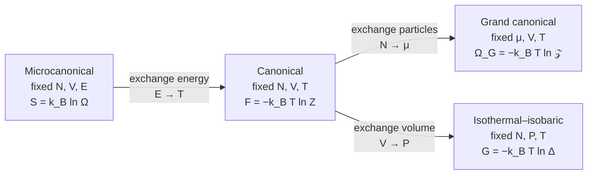

  <h1 style="color: white; margin: 0; font-size: 2.5rem;">Statistical Mechanics</h1>
  
Bridging the Microscopic and Macroscopic Worlds

**Statistical mechanics** derives the macroscopic behaviour of matter — temperature, pressure, heat capacity, phase transitions — from the laws obeyed by its microscopic constituents. It does so without solving the equations of motion for $10^{23}$ particles: instead it assigns probabilities to microscopic states and computes averages. This page sets out the foundations (microstates, the fundamental postulate, entropy, the ensembles and the partition function). The two sub-pages build on them.

| Page | Covers |
|---|---|
| [Classical & Quantum Statistical Mechanics](classical-and-quantum.html) | Phase space and Liouville's theorem, equipartition, the density operator, Fermi–Dirac and Bose–Einstein statistics, ideal classical/Fermi/Bose gases, blackbody radiation, virial expansion, mean-field theory |
| [Phase Transitions & Graduate Formalism](phase-transitions-and-advanced.html) | Classification of transitions, Landau theory, critical exponents and universality, the renormalization group, exact solutions, fluctuation–dissipation, stochastic thermodynamics, quantum thermalization, computational methods, and a field-theory reference block |

## Microstates and macrostates

A **microstate** is a complete specification of the system: the positions and momenta of every classical particle, or the quantum state (for example, the occupation of every single-particle level) of the whole system. A **macrostate** is specified by a handful of measurable quantities: energy $E$, volume $V$, particle number $N$, and derived quantities such as temperature $T$ and pressure $P$.

A single macrostate corresponds to an enormous number $\Omega$ of microstates. The simplest example is $N$ spin-$\tfrac12$ particles, where the macrostate is fixed by the number of up spins $n_\uparrow$ and the number of microstates is the binomial coefficient:

| $N = 4$: up spins $n_\uparrow$ | 0 | 1 | 2 | 3 | 4 |
|---|---|---|---|---|---|
| Microstates $\Omega = \binom{4}{n_\uparrow}$ | 1 | 4 | 6 | 4 | 1 |

For $N = 4$ the distribution is broad. For large $N$, $\binom{N}{n}$ is sharply peaked at $n = N/2$ with relative width $\sim 1/\sqrt{N}$; for $N \sim 10^{23}$ essentially every microstate looks macroscopically identical. This concentration of measure is why thermodynamic quantities are sharp even though they are averages, and why the Second Law is overwhelmingly probable rather than merely likely: an isolated system evolves toward the macrostate compatible with the most microstates, because almost all microstates belong to it.

## The fundamental postulate and entropy

Statistical mechanics rests on the **postulate of equal a priori probabilities**:

> For an isolated system in equilibrium, every accessible microstate — every microstate consistent with the fixed $E$, $V$ and $N$ — is equally probable.

The postulate is usually motivated by the **ergodic hypothesis** (a trajectory eventually explores the whole energy surface, so time averages equal ensemble averages) or, following Jaynes, as the least-biased probability assignment consistent with the known constraints. Neither motivation is a proof for realistic systems, but the predictions it produces are among the best-tested in physics. For quantum many-body systems the modern justification is the eigenstate thermalization hypothesis, discussed on the [advanced page](phase-transitions-and-advanced.html#quantum-thermalization).

With $\Omega$ equally likely microstates, the entropy is given by **Boltzmann's formula**

$$S = k_B \ln \Omega .$$

For a general probability distribution $p_i$ over microstates, it becomes the **Gibbs entropy**

$$S = -k_B \sum_i p_i \ln p_i ,$$

which reduces to Boltzmann's form when $p_i = 1/\Omega$. Its quantum counterpart is the von Neumann entropy $S = -k_B\,\mathrm{Tr}(\hat\rho \ln \hat\rho)$. Temperature, pressure and chemical potential then follow from derivatives of $S(E, V, N)$:

$$\frac{1}{T} = \left(\frac{\partial S}{\partial E}\right)_{V,N}, \qquad \frac{P}{T} = \left(\frac{\partial S}{\partial V}\right)_{E,N}, \qquad \frac{\mu}{T} = -\left(\frac{\partial S}{\partial N}\right)_{E,V}.$$

## Statistical ensembles

An **ensemble** is a probability distribution over microstates. The ensemble is chosen by the physical boundary conditions: which conserved quantities the system can exchange with its surroundings.

| Ensemble | Physical situation | Fixed | Fluctuates | Weight of microstate $i$ | Normalization | Thermodynamic potential |
|---|---|---|---|---|---|---|
| Microcanonical | Isolated | $N, V, E$ | — | $1/\Omega$ | $\Omega(N,V,E)$ | $S = k_B \ln \Omega$ |
| Canonical | Closed, in a heat bath | $N, V, T$ | $E$ | $e^{-\beta E_i}/Z$ | $Z = \sum_i e^{-\beta E_i}$ | $F = -k_B T \ln Z$ |
| Grand canonical | Open to a particle reservoir | $\mu, V, T$ | $E, N$ | $e^{-\beta(E_i - \mu N_i)}/\mathcal{Z}$ | $\mathcal{Z} = \sum_{N}\sum_i e^{-\beta(E_i - \mu N)}$ | $\Omega_G = -k_B T \ln \mathcal{Z} = -PV$ |
| Isothermal–isobaric | Heat bath and movable piston | $N, P, T$ | $E, V$ | $e^{-\beta(E_i + PV)}/\Delta$ | $\Delta = \int dV\, e^{-\beta P V} Z(N,V,T)$ | $G = -k_B T \ln \Delta$ |

Here $\beta = 1/(k_B T)$. (The grand potential is written $\Omega_G$ to avoid a clash with the microstate count $\Omega$.)

Each arrow relaxes a constraint: a conserved extensive quantity ($E$, $N$ or $V$) is allowed to fluctuate and is replaced by its conjugate intensive variable ($T$, $\mu$ or $P$) set by a reservoir. In thermodynamics the same step is a Legendre transform: $S(E) \to F(T) = E - TS$, $F(N) \to \Omega_G(\mu) = F - \mu N$, $F(V) \to G(P) = F + PV$.

### Deriving the Boltzmann factor

The canonical weight follows from the fundamental postulate applied to a system $S$ in contact with a much larger reservoir $R$, the pair being isolated with total energy $E_{\text{tot}}$. The probability of finding $S$ in a particular microstate $i$ is proportional to the number of reservoir microstates compatible with it:

$$p_i \propto \Omega_R(E_{\text{tot}} - E_i) = \exp\!\left[\frac{S_R(E_{\text{tot}} - E_i)}{k_B}\right] \approx \exp\!\left[\frac{S_R(E_{\text{tot}})}{k_B} - \frac{E_i}{k_B}\frac{\partial S_R}{\partial E}\right] \propto e^{-E_i / k_B T}.$$

The expansion is justified because $E_i \ll E_{\text{tot}}$, and $\partial S_R / \partial E = 1/T$ defines the reservoir temperature. Letting particles cross the boundary as well adds the term $+\mu N_i / k_B T$ in the exponent, giving the grand canonical weight.

## The partition function generates thermodynamics

Once $Z(N, V, T)$ is known, every equilibrium property follows by differentiation:

| Quantity | Expression |
|---|---|
| Helmholtz free energy | $F = -k_B T \ln Z$ |
| Mean energy | $U = \langle E \rangle = -\dfrac{\partial \ln Z}{\partial \beta}$ |
| Entropy | $S = -\left(\dfrac{\partial F}{\partial T}\right)_{V,N} = k_B(\ln Z + \beta U)$ |
| Pressure | $P = -\left(\dfrac{\partial F}{\partial V}\right)_{T,N} = k_B T \dfrac{\partial \ln Z}{\partial V}$ |
| Chemical potential | $\mu = \left(\dfrac{\partial F}{\partial N}\right)_{T,V}$ |
| Heat capacity | $C_V = \dfrac{\partial U}{\partial T} = k_B \beta^2 \dfrac{\partial^2 \ln Z}{\partial \beta^2}$ |

Two structural facts make $Z$ practical. For **independent subsystems** the partition function factorizes, $Z = Z_1 Z_2$, so $F$ is additive. For $N$ non-interacting **identical particles** in the classical limit, $Z = z^N / N!$, where $z$ is the single-particle partition function and $1/N!$ is the Gibbs correction for indistinguishability.

### Worked example: the two-level system

$N$ independent particles, each with levels $0$ and $\varepsilon$, have $z = 1 + e^{-\beta\varepsilon}$ and therefore

$$U = \frac{N\varepsilon}{e^{\beta\varepsilon} + 1}, \qquad C_V = N k_B \,(\beta\varepsilon)^2 \frac{e^{\beta\varepsilon}}{\left(e^{\beta\varepsilon} + 1\right)^2}.$$

The heat capacity has a peak at $k_B T \approx 0.42\,\varepsilon$, the **Schottky anomaly**. It is seen experimentally in paramagnetic salts and in materials with low-lying crystal-field levels. It illustrates a general rule: a degree of freedom contributes to the heat capacity only when $k_B T$ is comparable to its level spacing.

## Fluctuations and ensemble equivalence

The ensembles are different probability distributions, but in the **thermodynamic limit** ($N \to \infty$ at fixed density) they give the same predictions for macroscopic observables. In the canonical ensemble the energy fluctuates with variance

$$\langle (\Delta E)^2 \rangle = \langle E^2 \rangle - \langle E \rangle^2 = \frac{\partial^2 \ln Z}{\partial \beta^2} = k_B T^2 C_V .$$

Because both $\langle E \rangle$ and $C_V$ are extensive, the relative fluctuation $\sqrt{\langle (\Delta E)^2 \rangle}/\langle E \rangle$ scales as $N^{-1/2}$, about $10^{-11}$ for a macroscopic sample. Fixing $T$ is then effectively the same as fixing $E$. In practice this lets you pick whichever ensemble is easiest to compute with: usually the canonical ensemble for classical systems, and the grand canonical ensemble for quantum gases, where the constraint of fixed $N$ is awkward.

Equivalence can fail. Near a first-order transition, fluctuations are not small. In systems with **long-range interactions**, such as self-gravitating systems, energy is not additive and the microcanonical heat capacity can be negative, which the canonical ensemble cannot reproduce. Small systems, such as single molecules and nanoscale devices, also sit outside the limit. They are the domain of [stochastic thermodynamics](phase-transitions-and-advanced.html#stochastic-thermodynamics-and-fluctuation-theorems).

## Historical milestones

| Year | Development |
|---|---|
| 1860s–1870s | Maxwell's velocity distribution; Boltzmann's transport equation and H-theorem (1872) |
| 1877 | Boltzmann relates entropy to the number of microstates |
| 1902 | Gibbs, *Elementary Principles in Statistical Mechanics*: ensembles and the partition function |
| 1924–1926 | Bose–Einstein and Fermi–Dirac statistics |
| 1944 | Onsager's exact solution of the 2D Ising model |
| 1957 | BCS theory of superconductivity; Jaynes' maximum-entropy formulation; Kubo's linear-response formulas |
| 1971–1972 | Wilson's renormalization group and the $\varepsilon$ expansion (Nobel Prize 1982) |
| 1973 | Berezinskii–Kosterlitz–Thouless transition (Nobel Prize 2016) |
| 1995 | Bose–Einstein condensation in dilute atomic gases (Nobel Prize 2001) |
| 1997–1999 | Jarzynski equality and Crooks fluctuation theorem |
| 2010s–2020s | Conformal bootstrap determination of 3D critical exponents; eigenstate thermalization and many-body localization in quantum simulators |

## See also

- [Thermodynamics](../thermodynamics.html) — the macroscopic laws that statistical mechanics derives.
- [Advanced Thermodynamics](../thermodynamics-advanced.html) — potentials, stability and non-equilibrium thermodynamics.
- [Quantum Mechanics](../quantum-mechanics/) — the foundation behind quantum statistics.
- [Condensed Matter Physics](../condensed-matter/) — many-body applications to solids, magnets and superconductors.
- [Renormalization](../renormalization.html) — the renormalization group in field theory.
- [Quantum Field Theory](../quantum-field-theory.html) — finite-temperature field theory and the path-integral link.
- [Classical Mechanics](../classical-mechanics/) — the Hamiltonian dynamics that ensembles average over.
- [Computational Physics: Monte Carlo and MD](../computational-physics/monte-carlo-and-md.html) — simulation methods for statistical systems.
- [Physics Hub](../) — browse all physics topics.
