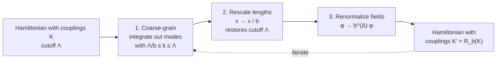

[Statistical Mechanics](./)

This page covers the collective behaviour of interacting systems and statistical mechanics away from equilibrium. The first half treats phase transitions: classification, Landau theory, critical exponents, universality and the renormalization group, with the exactly solved models that anchor them. The second half covers fluctuations and linear response, non-equilibrium and stochastic thermodynamics, quantum thermalization, and computational methods. The page ends with a terse reference block of field-theoretic techniques. It assumes the ensembles from the [hub](./) and the mean-field and correlation-function material from [Classical & Quantum Statistical Mechanics](classical-and-quantum.html).

## Phase transitions

### Singularities need the thermodynamic limit

A **phase transition** is a point where the free energy is non-analytic as a function of its control parameters. For any finite system the partition function is a finite sum of positive analytic terms, so $F = -k_B T \ln Z$ is analytic. Singularities appear only in the limit $N \to \infty$. Lee and Yang (1952) made this precise. The zeros of $Z$ in the complex plane of the magnetic field (or fugacity) never lie on the physical real axis for finite $N$. As $N \to \infty$ they accumulate and pinch the real axis at the transition point. For the Ising ferromagnet the zeros lie exactly on the unit circle in the complex fugacity $e^{-2\beta h}$ (the Lee–Yang circle theorem). Lee–Yang zeros were observed experimentally in 2015, through the coherence of a probe spin coupled to an Ising-type spin bath.

### Classification

The modern classification distinguishes transitions by whether a latent heat is present and whether the correlation length diverges. Ehrenfest's older scheme, based on which derivative of $F$ is discontinuous, fails for transitions such as the λ point of helium, where $C_P$ diverges instead of jumping.

| | First-order (discontinuous) | Continuous (critical) |
|---|---|---|
| Order parameter | Jumps at the transition | Goes to zero continuously |
| Latent heat | Yes, $L = T \Delta S$ | No |
| Correlation length $\xi$ | Finite | Diverges, $\xi \sim \lvert t\rvert^{-\nu}$ |
| Coexistence, metastability, hysteresis | Yes (supercooling, superheating, nucleation) | No |
| Behaviour near $T_c$ | Non-universal | Universal power laws |
| Examples | Melting, boiling below $T_c$, most structural transitions | Liquid–gas critical point, Curie point of a ferromagnet, superfluid λ transition, superconducting transition |

A third type, the **infinite-order** Berezinskii–Kosterlitz–Thouless transition, has an essential singularity in which every derivative of $F$ is continuous (see [below](#low-dimensional-systems)). **Quantum phase transitions** occur at $T = 0$ as a non-thermal parameter, such as pressure, field or doping, is tuned. They are driven by quantum rather than thermal fluctuations and are treated in [Condensed Matter: Advanced Formalism](../condensed-matter/advanced-formalism.html).

### Phase diagrams and coexistence

<figure class="svg-figure">
<svg viewBox="0 0 500 280" role="img" aria-label="Schematic pressure-temperature phase diagram with solid, liquid and gas regions, a triple point and a critical point" style="max-width: 520px; width: 100%; color: inherit;">
<g fill="none" stroke="currentColor">
<line x1="50" y1="240" x2="480" y2="240" stroke-width="1.5"/>
<line x1="50" y1="240" x2="50" y2="15" stroke-width="1.5"/>
<path stroke-width="2.5" d="M70 236 C110 230 140 215 170 185"/>
<path stroke-width="2.5" d="M170 185 C200 150 300 105 390 70"/>
<path stroke-width="2.5" d="M170 185 C178 140 186 80 192 20"/>
<path stroke-width="1" stroke-dasharray="4 4" d="M390 70 L470 40"/>
</g>
<g fill="currentColor">
<circle cx="170" cy="185" r="5"/>
<circle cx="390" cy="70" r="5"/>
</g>
<g fill="currentColor" font-size="13">
<text x="265" y="272" text-anchor="middle">temperature T</text>
<text x="22" y="130" text-anchor="middle" transform="rotate(-90 22 130)">pressure P</text>
<text x="95" y="120">Solid</text>
<text x="255" y="60">Liquid</text>
<text x="300" y="190">Gas</text>
<text x="176" y="206">triple point</text>
<text x="360" y="95">critical point</text>
<text x="400" y="30">supercritical fluid</text>
<text x="200" y="138" font-size="11">vaporization</text>
<text x="196" y="40" font-size="11">melting</text>
<text x="72" y="222" font-size="11">sublimation</text>
</g>
</svg>
<figcaption>Schematic $P$–$T$ phase diagram. Coexistence lines are first-order transitions. The liquid–gas line ends at a critical point, beyond which liquid and gas are not distinct phases. The critical point is a continuous transition in the 3D Ising universality class. For water the melting line slopes the other way, because ice is less dense than liquid water.</figcaption>
</figure>

Along a coexistence line the two phases have equal chemical potentials. Differentiating $\mu_1(T,P) = \mu_2(T,P)$ along the line gives the **Clausius–Clapeyron equation**

$$\frac{dP}{dT} = \frac{L}{T\,\Delta v},$$

where $L$ is the latent heat and $\Delta v$ the change of volume, both per particle. The Gibbs phase rule, $f = c - p + 2$ degrees of freedom for $c$ components and $p$ coexisting phases, explains why a pure substance has coexistence *lines* and isolated triple *points*.

## Landau theory

Landau (1937) proposed that near a continuous transition the free-energy density can be expanded in powers of a small **order parameter** $m$: magnetization, density difference, superfluid amplitude, and so on. Only terms allowed by the symmetry of the disordered phase appear. For an Ising-like ($m \to -m$) symmetry:

$$f(m) = f_0 + a\, t\, m^2 + b\, m^4 - h\, m, \qquad t = \frac{T - T_c}{T_c}, \quad a, b > 0 .$$

<figure class="svg-figure">
<svg viewBox="0 0 530 200" role="img" aria-label="Landau free energy f(m) above, at and below Tc: single minimum at zero, flat quartic, and double well" style="max-width: 540px; width: 100%; color: inherit;">
<g fill="none" stroke="currentColor">
<line x1="20" y1="150" x2="170" y2="150" stroke-width="1" opacity="0.5"/>
<line x1="190" y1="150" x2="340" y2="150" stroke-width="1" opacity="0.5"/>
<line x1="360" y1="150" x2="510" y2="150" stroke-width="1" opacity="0.5"/>
<line x1="95" y1="30" x2="95" y2="185" stroke-width="1" opacity="0.5"/>
<line x1="265" y1="30" x2="265" y2="185" stroke-width="1" opacity="0.5"/>
<line x1="435" y1="30" x2="435" y2="185" stroke-width="1" opacity="0.5"/>
<path stroke-width="2.5" d="M46.3 40.1 L50.3 63.3 L54.4 82.6 L58.5 98.5 L62.5 111.5 L66.6 122.0 L70.6 130.4 L74.7 136.9 L78.8 141.9 L82.8 145.6 L86.9 148.1 L90.9 149.5 L95.0 150.0 L99.1 149.5 L103.1 148.1 L107.2 145.6 L111.2 141.9 L115.3 136.9 L119.4 130.4 L123.4 122.0 L127.5 111.5 L131.5 98.5 L135.6 82.6 L139.7 63.3 L143.7 40.1"/>
<path stroke-width="2.5" d="M203.1 40.4 L208.2 72.6 L213.4 97.2 L218.5 115.3 L223.7 128.4 L228.9 137.3 L234.0 143.2 L239.2 146.7 L244.4 148.6 L249.5 149.6 L254.7 149.9 L259.8 150.0 L265.0 150.0 L270.2 150.0 L275.3 149.9 L280.5 149.6 L285.6 148.6 L290.8 146.7 L296.0 143.2 L301.1 137.3 L306.3 128.4 L311.5 115.3 L316.6 97.2 L321.8 72.6 L326.9 40.4"/>
<path stroke-width="2.5" d="M360.6 80.3 L363.7 103.1 L366.8 122.0 L369.9 137.6 L373.0 150.0 L376.1 159.7 L379.2 166.9 L382.3 172.1 L385.4 175.3 L388.5 177.1 L391.6 177.5 L394.7 176.8 L397.8 175.3 L400.9 173.2 L404.0 170.6 L407.1 167.8 L410.2 164.8 L413.3 161.8 L416.4 159.0 L419.5 156.4 L422.6 154.2 L425.7 152.4 L428.8 151.1 L431.9 150.3 L435.0 150.0 L438.1 150.3 L441.2 151.1 L444.3 152.4 L447.4 154.2 L450.5 156.4 L453.6 159.0 L456.7 161.8 L459.8 164.8 L462.9 167.8 L466.0 170.6 L469.1 173.2 L472.2 175.3 L475.3 176.8 L478.4 177.5 L481.5 177.1 L484.6 175.3 L487.7 172.1 L490.8 166.9 L493.9 159.7 L497.0 150.0 L500.1 137.6 L503.2 122.0 L506.3 103.1 L509.4 80.3"/>
</g>
<g fill="currentColor">
<circle cx="391.2" cy="177.5" r="4"/>
<circle cx="478.8" cy="177.5" r="4"/>
</g>
<g fill="currentColor" font-size="13" text-anchor="middle">
<text x="95" y="20">T &gt; T_c</text>
<text x="265" y="20">T = T_c</text>
<text x="435" y="20">T &lt; T_c</text>
<text x="165" y="165" font-size="11">m</text>
<text x="335" y="165" font-size="11">m</text>
<text x="505" y="195" font-size="11">m</text>
<text x="435" y="197" font-size="11">±m₀</text>
</g>
</svg>
<figcaption>Landau free energy at $h = 0$. Above $T_c$ the only minimum is $m = 0$. At $T_c$ the curvature vanishes: the quartic well is flat, and this is why fluctuations become large. Below $T_c$ the symmetric point becomes a maximum and the system picks one of two equivalent minima $\pm m_0$, spontaneously breaking the $m \to -m$ symmetry.</figcaption>
</figure>

Minimizing $f$ gives the **mean-field (Landau) exponents**. These are the same as those of Weiss mean-field theory:

| Quantity | Landau result | Exponent |
|---|---|---|
| Order parameter, $t < 0$ | $m_0 = \sqrt{a\lvert t\rvert / 2b}$ | $\beta = 1/2$ |
| Susceptibility | $\chi = \partial m / \partial h \propto \lvert t\rvert^{-1}$ | $\gamma = 1$ |
| Critical isotherm, $t = 0$ | $m = (h/4b)^{1/3}$ | $\delta = 3$ |
| Specific heat | Finite jump $\Delta C = a^2 / (2b\,T_c)$ per unit volume | $\alpha = 0$ (discontinuity) |

**First-order transitions** in Landau theory arise in two ways:

- **A cubic invariant.** Symmetry may allow a term $c\,m^3$, as for the three-state Potts model, the nematic–isotropic transition of liquid crystals, or crystallization. The minimum then jumps discontinuously.
- **A negative quartic coefficient.** If $b < 0$, a stabilizing $m^6$ term is required and the transition is first order. The point where $b$ changes sign is a **tricritical point**. An example is the $^3$He–$^4$He mixture.

**Ginzburg–Landau theory** makes $m$ a field $m(\mathbf{r})$ and adds a gradient term $\tfrac{\kappa}{2}(\nabla m)^2$. This gives the Ornstein–Zernike correlations and a correlation length $\xi \propto \lvert t\rvert^{-1/2}$, so $\nu = 1/2$ and $\eta = 0$.

### When mean-field theory fails: the Ginzburg criterion

Landau theory neglects fluctuations. It is self-consistent only if fluctuations of $m$ within a correlation volume are small compared with $m$ itself. Comparing $\langle \delta m^2 \rangle$ over a volume $\xi^d$ with $m_0^2$ gives the **Ginzburg criterion**. Mean-field theory holds for

$$\lvert t \rvert^{(4-d)/2} \gg \text{Gi}, \qquad \text{Gi} \sim \left(\frac{k_B}{\Delta C\, \xi_0^d}\right)^{2/(4-d)}$$

where $\xi_0$ is the microscopic correlation length. Two conclusions follow:

- **Upper critical dimension.** Above $d_c = 4$ (for $\phi^4$-type theories), fluctuations are irrelevant close to $T_c$ and mean-field exponents are exact. Exactly at $d = 4$ there are logarithmic corrections.
- **Width of the critical region.** In $d = 3$ the critical region has width $\text{Gi}$. For conventional superconductors $\xi_0$ is very large (hundreds of nanometres), so $\text{Gi} \sim (T_c/T_F)^4$ is typically below $10^{-12}$ and BCS mean-field theory is essentially exact. For liquid–gas critical points and magnets $\xi_0$ is atomic, $\text{Gi}$ is of order 0.01–1, and non-classical exponents are observed.

## Critical phenomena and universality

### Critical exponents

Near a continuous transition, observables follow power laws in $t = (T - T_c)/T_c$ and in the conjugate field $h$:

| Exponent | Definition | Condition |
|---|---|---|
| $\alpha$ | $C \sim \lvert t\rvert^{-\alpha}$ | $h = 0$ |
| $\beta$ | $m \sim (-t)^{\beta}$ | $h = 0$, $t < 0$ |
| $\gamma$ | $\chi \sim \lvert t\rvert^{-\gamma}$ | $h = 0$ |
| $\delta$ | $m \sim h^{1/\delta}$ | $t = 0$ |
| $\nu$ | $\xi \sim \lvert t\rvert^{-\nu}$ | $h = 0$ |
| $\eta$ | $G(r) \sim r^{-(d-2+\eta)}$ | $t = 0$ |
| $z$ | relaxation time $\tau \sim \xi^{z}$ | dynamics |

### Values for the main universality classes

| Class | $\alpha$ | $\beta$ | $\gamma$ | $\delta$ | $\nu$ | $\eta$ |
|---|---|---|---|---|---|---|
| Mean field ($d \geq 4$) | 0 (jump) | 1/2 | 1 | 3 | 1/2 | 0 |
| 2D Ising (exact) | 0 (log) | 1/8 | 7/4 | 15 | 1 | 1/4 |
| 3D Ising | 0.11009 | 0.32642 | 1.23708 | 4.7898 | 0.62997 | 0.03630 |
| 3D XY, $n = 2$ | −0.0153 | 0.3487 | 1.3179 | 4.779 | 0.6718 | 0.0382 |

The 3D values come from the **conformal bootstrap**. For 3D Ising they follow from the scaling dimensions $\Delta_\sigma = 0.5181489(10)$ and $\Delta_\epsilon = 1.412625(10)$ (Kos, Poland, Simmons-Duffin and Vichi, 2016), via $\nu = 1/(3 - \Delta_\epsilon)$ and $\eta = 2\Delta_\sigma - 1$. The 3D XY values are from Chester *et al.* (2019), and agree with the best Monte Carlo simulations.

**The λ-point puzzle.** The superfluid transition of $^4$He is the best experimental realization of the 3D XY class. A 1992 microgravity measurement aboard the Space Shuttle (Lipa *et al.*, reanalysed in 2003) found $\alpha = -0.0127(3)$. Bootstrap and Monte Carlo agree on $\alpha \approx -0.0153$. The resulting roughly 8σ discrepancy between theory and experiment remains unresolved.

### Scaling relations

The six static exponents are not independent. The **scaling hypothesis** below implies that only two are, subject to these relations:

| Relation | Name |
|---|---|
| $\alpha + 2\beta + \gamma = 2$ | Rushbrooke |
| $\gamma = \beta(\delta - 1)$ | Widom |
| $\gamma = \nu(2 - \eta)$ | Fisher |
| $d\nu = 2 - \alpha$ | Josephson (hyperscaling) |

Hyperscaling, the only relation involving $d$, fails above the upper critical dimension, where mean-field exponents hold for every $d$.

### Universality

Critical exponents do not depend on microscopic details. They depend only on:

1. the spatial dimension $d$;
2. the symmetry of the order parameter, for example the number of components $n$ of an $O(n)$ vector;
3. whether the interactions are short- or long-range.

| Universality class | Order parameter | Physical realizations |
|---|---|---|
| Ising, $n = 1$ | Scalar, $\mathbb{Z}_2$ | Uniaxial magnets, liquid–gas critical points, binary-liquid demixing |
| XY, $n = 2$ | Planar vector, $O(2)$ | Superfluid $^4$He, easy-plane magnets, (with caveats) superconductors |
| Heisenberg, $n = 3$ | 3-vector, $O(3)$ | Isotropic ferromagnets such as EuO and Ni |
| Percolation | Connectivity (geometric) | Conductor–insulator networks, porous media, epidemic thresholds |
| Directed percolation | Absorbing-state density | Non-equilibrium absorbing-state transitions, turbulent spots in liquid crystals |

That a boiling fluid near its critical point has the same exponents as a uniaxial magnet is the central empirical fact that the renormalization group explains.

### Low-dimensional systems

The **Mermin–Wagner theorem** (1966) states that a continuous symmetry cannot be spontaneously broken at $T > 0$ in $d \leq 2$ with short-range interactions: long-wavelength Goldstone fluctuations destroy long-range order. Discrete symmetries can still break in 2D, as the 2D Ising model shows. The **lower critical dimension** is therefore 1 for discrete symmetries and 2 for continuous ones.

The 2D XY model nevertheless has a transition. The **Berezinskii–Kosterlitz–Thouless** transition separates a low-temperature phase with algebraic ("quasi-long-range") order, in which vortex–antivortex pairs are bound, from a high-temperature phase with free vortices. It has three distinctive features:

- the correlation length diverges as $\xi \sim \exp\left(b/\sqrt{T - T_{\text{BKT}}}\right)$;
- the free energy has an essential singularity;
- the superfluid stiffness jumps universally, $\rho_s(T_{\text{BKT}}^-) = 2 m^2 k_B T_{\text{BKT}} / (\pi \hbar^2)$ (Nelson–Kosterlitz).

The BKT transition has been observed in helium films, Josephson-junction arrays and 2D atomic gases. It was recognized by the 2016 Nobel Prize (Kosterlitz, Thouless and Haldane).

## The renormalization group

### Kadanoff's scaling picture

Near $T_c$ the only relevant length is $\xi$. Kadanoff (1966) argued that grouping spins into blocks of size $b$ produces a similar model with a rescaled reduced temperature $t' = b^{y_t} t$ and field $h' = b^{y_h} h$. The singular part of the free energy per unit volume must therefore satisfy the **homogeneity relation**

$$f_s(t, h) = b^{-d} f_s\!\left(b^{y_t} t,\; b^{y_h} h\right) .$$

Choosing $b = \lvert t\rvert^{-1/y_t}$ gives $f_s = \lvert t\rvert^{d/y_t}\, \Phi\!\left(h / \lvert t\rvert^{y_h/y_t}\right)$. All exponents then follow from the two eigenvalues $y_t$ and $y_h$:

$$\nu = \frac{1}{y_t}, \quad \alpha = 2 - \frac{d}{y_t}, \quad \beta = \frac{d - y_h}{y_t}, \quad \gamma = \frac{2y_h - d}{y_t}, \quad \delta = \frac{y_h}{d - y_h}, \quad \eta = d + 2 - 2y_h .$$

These relations imply all four scaling laws above. Experimentally, the homogeneity relation shows up as **data collapse**: plotting $m / \lvert t\rvert^{\beta}$ against $h / \lvert t\rvert^{\beta\delta}$ puts measurements at different temperatures onto a single curve on each side of $T_c$.

### Wilson's renormalization group

Wilson (1971) turned Kadanoff's picture into a calculational method. One RG step maps the set of couplings $K = (K_1, K_2, \dots)$ of a Hamiltonian to new couplings $K' = R_b(K)$:



Under repeated steps the couplings flow. The correlation length shrinks, $\xi' = \xi / b$, so a **fixed point** $K^\ast = R_b(K^\ast)$ has $\xi = 0$ or $\xi = \infty$. Critical points correspond to the second case. Linearizing the flow about $K^\ast$ gives scaling eigenvalues $y_i$. The corresponding scaling fields fall into three classes:

| Eigenvalue | Classification | Meaning |
|---|---|---|
| $y_i > 0$ | Relevant | Grows under RG; must be tuned to zero to reach the critical point (e.g. $t$, $h$) |
| $y_i < 0$ | Irrelevant | Shrinks; produces only corrections to scaling. This is why microscopic details do not matter |
| $y_i = 0$ | Marginal | Gives logarithmic corrections (e.g. $\phi^4$ at $d = 4$) |

Universality follows directly. All Hamiltonians in the basin of attraction of the same fixed point share its relevant eigenvalues, and hence its exponents.

### The $\varepsilon$ expansion

For the $O(n)$ Landau–Ginzburg–Wilson action

$$S[\boldsymbol\phi] = \int d^d x \left[\frac12 (\nabla\boldsymbol\phi)^2 + \frac{r}{2}\boldsymbol\phi^2 + \frac{u}{4!}(\boldsymbol\phi^2)^2\right],$$

a momentum-shell RG in $d = 4 - \varepsilon$ gives, at one loop and in units where the cutoff is 1 and $u$ has absorbed a geometric factor,

$$\frac{dr}{d\ell} = 2r + \frac{n+2}{6}\,\frac{u}{1+r}, \qquad \frac{du}{d\ell} = \varepsilon u - \frac{n+8}{6}\,\frac{u^2}{(1+r)^2} .$$

There are two fixed points:

- the **Gaussian** fixed point $(r^\ast, u^\ast) = (0, 0)$, stable for $d > 4$;
- the **Wilson–Fisher** fixed point $u^\ast = 6\varepsilon/(n+8)$, $r^\ast = -\tfrac{n+2}{2(n+8)}\varepsilon$, stable for $d < 4$.

Linearizing about Wilson–Fisher gives

$$\nu = \frac12 + \frac{n+2}{4(n+8)}\,\varepsilon + O(\varepsilon^2), \qquad \eta = \frac{n+2}{2(n+8)^2}\,\varepsilon^2 + O(\varepsilon^3) .$$

For the Ising case ($n = 1$) these are $\nu = \tfrac12 + \tfrac{\varepsilon}{12}$ and $\eta = \tfrac{\varepsilon^2}{54}$. The series is asymptotic. Resummed expansions to five and six loops, combined with the fixed-dimension $d = 3$ perturbation series, agree with the bootstrap values to about three significant figures. The **functional renormalization group** (the Wetterich equation) is a non-perturbative alternative widely used for systems without a small parameter. The RG in quantum field theory is covered on the [Renormalization](../renormalization.html) page.

### Conformal field theory and the bootstrap

At a critical point, scale invariance together with locality and rotation invariance generally enhances to **conformal invariance**. In 2D the conformal algebra is infinite-dimensional. Its central extension is the Virasoro algebra

$$[L_m, L_n] = (m - n) L_{m+n} + \frac{c}{12}\, m(m^2 - 1)\, \delta_{m+n,0} .$$

The unitary **minimal models** have central charge $c = 1 - \frac{6}{m(m+1)}$, $m = 3, 4, \dots$ Their operator content is finite and exactly solvable.

| 2D critical point | Central charge $c$ | Notes |
|---|---|---|
| Ising | 1/2 | $m = 3$; $\Delta_\sigma = 1/8$ and $\Delta_\epsilon = 1$ give $\eta = 1/4$ and $\nu = 1$ |
| Tricritical Ising | 7/10 | $m = 4$ |
| 3-state Potts | 4/5 | $m = 5$ (non-diagonal modular invariant) |
| XY (BKT line), free boson | 1 | Continuously varying exponents |

In higher dimensions the conformal algebra is finite, but the **conformal bootstrap** still constrains critical points strongly. Crossing symmetry of four-point functions, combined with unitarity, carves out allowed regions of scaling dimensions and OPE coefficients. Numerical bootstrap studies using semidefinite programming (the SDPB solver) have produced the most precise 3D Ising and $O(n)$ exponents known, quoted in the table above. The central charge also controls entanglement: for a 1D critical chain, a block of length $\ell$ has entanglement entropy $S = \frac{c}{3}\ln(\ell/a)$ (Calabrese–Cardy).

## Exactly solved models

### 1D Ising model and the transfer matrix

For $H = -J\sum_i s_i s_{i+1} - h\sum_i s_i$ with periodic boundary conditions, $Z = \mathrm{Tr}\, T^N$ with the transfer matrix

$$T = \begin{pmatrix} e^{\beta(J + h)} & e^{-\beta J} \\ e^{-\beta J} & e^{\beta(J - h)} \end{pmatrix}, \qquad \lambda_\pm = e^{\beta J}\cosh\beta h \pm \sqrt{e^{2\beta J}\sinh^2\beta h + e^{-2\beta J}} .$$

In the thermodynamic limit $f = -k_B T \ln \lambda_+$, which is analytic for all $T > 0$, so there is no transition. The correlation length at $h = 0$ is $\xi^{-1} = \ln(\lambda_+ / \lambda_-) = \ln\coth\beta J$, which diverges only as $T \to 0$. The same technique maps any $d$-dimensional classical model to a $(d-1)$-dimensional quantum problem.

### 2D Ising model (Onsager)

Onsager (1944) diagonalized the transfer matrix of the square-lattice Ising model. The critical point is fixed by Kramers–Wannier duality:

$$\sinh\left(\frac{2J}{k_B T_c}\right) = 1 \quad\Longrightarrow\quad \frac{k_B T_c}{J} = \frac{2}{\ln\left(1 + \sqrt 2\right)} \approx 2.269 .$$

The free energy per site is

$$-\beta f = \ln\left(2\cosh 2\beta J\right) + \frac{1}{2\pi}\int_0^\pi d\theta\, \ln\left[\frac{1 + \sqrt{1 - \kappa^2 \sin^2\theta}}{2}\right], \qquad \kappa = \frac{2\sinh 2\beta J}{\cosh^2 2\beta J},$$

and the spontaneous magnetization, announced by Onsager and first derived by Yang (1952), is

$$m = \left[1 - \sinh^{-4}(2\beta J)\right]^{1/8} \qquad (T < T_c) .$$

The specific heat diverges logarithmically ($\alpha = 0$) and $\beta = 1/8$. Both disagree sharply with mean-field theory. Historically, this was the first proof that mean-field exponents can be wrong. The 3D Ising model has no known exact solution.

### Bethe ansatz

The spin-½ Heisenberg chain $H = J\sum_i \mathbf{S}_i \cdot \mathbf{S}_{i+1}$ is solved by Bethe's ansatz (1931). Eigenstates with $M$ flipped spins are superpositions of plane waves with quasi-momenta $k_j$, fixed on a ring of $N$ sites by the **Bethe equations**

$$N k_j = 2\pi I_j + \sum_{l \neq j} \theta_{jl}, \qquad 2\cot\frac{\theta_{jl}}{2} = \cot\frac{k_j}{2} - \cot\frac{k_l}{2},$$

with integer or half-integer quantum numbers $I_j$. For the antiferromagnet ($J > 0$), Hulthén (1938) obtained the ground-state energy per site

$$\frac{E_0}{N} = J\left(\frac14 - \ln 2\right) \approx -0.4431\, J .$$

The elementary excitations are spin-½ **spinons**, not spin-1 magnons, as confirmed by neutron scattering on quasi-1D magnets such as KCuF$_3$. Integrable models of this kind do not thermalize to a Gibbs state. They relax instead to a **generalized Gibbs ensemble** (see [Quantum thermalization](#quantum-thermalization)), whose large-scale dynamics is described by *generalized hydrodynamics* (2016 onward).

## Fluctuations and linear response

### Equilibrium fluctuations

Second derivatives of the thermodynamic potentials are variances of the fluctuating quantities:

$$\langle (\Delta E)^2 \rangle = k_B T^2 C_V, \qquad \langle (\Delta N)^2 \rangle = k_B T \left(\frac{\partial N}{\partial \mu}\right)_{T,V} = \frac{\langle N \rangle^2 k_B T}{V}\,\kappa_T, \qquad \langle (\Delta M)^2 \rangle = k_B T\, \chi .$$

Response functions are therefore non-negative, which is thermodynamic stability. They diverge at a critical point exactly where fluctuations become macroscopic.

### Linear response and the fluctuation–dissipation theorem

Perturb a system by $H \to H - F(t)\, B$. To first order the response of an observable $A$ is

$$\delta\langle A(t) \rangle = \int_{-\infty}^{t} \chi_{AB}(t - t')\, F(t')\, dt', \qquad \chi_{AB}(t) = \frac{i}{\hbar}\,\theta(t)\,\langle [A(t), B(0)] \rangle_0 ,$$

which is the **Kubo formula**. Causality ($\chi(t) = 0$ for $t < 0$) makes $\chi(\omega)$ analytic in the upper half-plane and links its real and imaginary parts through the Kramers–Kronig relations.

The **fluctuation–dissipation theorem** (Callen and Welton, 1951) relates the dissipative part $\chi''(\omega)$ to the equilibrium fluctuation spectrum $S_{AA}(\omega) = \int dt\, e^{i\omega t}\langle A(t) A(0) \rangle$:

$$S_{AA}(\omega) = \frac{2\hbar}{1 - e^{-\beta\hbar\omega}}\, \chi''_{AA}(\omega) \;\xrightarrow{\;\hbar\omega \ll k_B T\;}\; \frac{2 k_B T}{\omega}\, \chi''_{AA}(\omega) .$$

The classical limit contains **Johnson–Nyquist noise**: the voltage noise of a resistor is $S_V = 4 k_B T R$ per unit bandwidth in the one-sided convention. The same relation underlies Einstein's analysis of Brownian motion.

### Transport coefficients: Green–Kubo and Einstein relations

Transport coefficients are time integrals of equilibrium current autocorrelation functions:

$$D = \frac{1}{3}\int_0^\infty \langle \mathbf{v}(t) \cdot \mathbf{v}(0) \rangle\, dt, \qquad \sigma = \frac{1}{3 V k_B T}\int_0^\infty \langle \mathbf{J}(t) \cdot \mathbf{J}(0) \rangle\, dt ,$$

where $\mathbf{J}$ is the total electric current. These are the classical DC limits; shear viscosity and thermal conductivity have analogous forms. Comparing diffusion with drift in a force field gives the **Einstein relation** $D = \mu_m k_B T$, where $\mu_m$ is the mobility (velocity per unit force). For a sphere in a viscous fluid, $\mu_m = 1/(6\pi\eta_s a)$, giving the Stokes–Einstein relation. **Onsager's reciprocal relations** state that the matrix of transport coefficients $L_{ij}$ coupling fluxes to thermodynamic forces is symmetric, $L_{ij} = L_{ji}$ (in the absence of magnetic fields). This follows from microscopic time-reversal symmetry.

## Non-equilibrium statistical mechanics

### Kinetic theory and the Boltzmann equation

For a dilute gas the one-particle distribution $f(\mathbf{r}, \mathbf{v}, t)$ obeys

$$\frac{\partial f}{\partial t} + \mathbf{v}\cdot\nabla_{\mathbf{r}} f + \frac{\mathbf{F}}{m}\cdot\nabla_{\mathbf{v}} f = \left(\frac{\partial f}{\partial t}\right)_{\text{coll}} .$$

The collision integral assumes **molecular chaos**: the velocities of colliding particles are uncorrelated before they collide. That assumption is where time asymmetry enters. From it Boltzmann's **H-theorem** follows:

$$H(t) = \int f \ln f \, d^3 v, \qquad \frac{dH}{dt} \leq 0,$$

with equality only for the Maxwell–Boltzmann distribution. In practice the collision term is often replaced by the **relaxation-time approximation**, $-(f - f_0)/\tau$. This yields the Drude conductivity $\sigma = n e^2 \tau / m$ and the kinetic-theory transport coefficients. The Chapman–Enskog expansion derives the Navier–Stokes equations from the Boltzmann equation. The quantum version for electrons and phonons is the basis of semiclassical transport theory.

### Langevin and Fokker–Planck descriptions

A mesoscopic degree of freedom coupled to a heat bath obeys a **Langevin equation**, with a friction term and a random force whose strength is fixed by fluctuation–dissipation:

$$m\ddot{x} = -\gamma \dot{x} - U'(x) + \xi(t), \qquad \langle \xi(t)\,\xi(t') \rangle = 2\gamma k_B T\, \delta(t - t') .$$

The probability density evolves by the equivalent **Fokker–Planck equation**. In the overdamped limit it reads

$$\partial_t P = \frac{1}{\gamma}\,\partial_x\!\left[U'(x)\, P\right] + D\, \partial_x^2 P, \qquad D = \frac{k_B T}{\gamma},$$

and its stationary solution is the Boltzmann distribution $P \propto e^{-\beta U}$. Escape over a barrier $\Delta U$ occurs at the **Kramers rate** $\propto e^{-\beta\Delta U}$. The same structure, applied to a field $\phi(\mathbf{r}, t)$ with $\partial_t\phi = -\Gamma\, \delta F/\delta\phi + \eta$, defines the Hohenberg–Halperin models of critical dynamics (model A for a non-conserved order parameter, model B for a conserved one).

### Stochastic thermodynamics and fluctuation theorems

For small systems such as molecular motors, colloids and nanoscale circuits, work, heat and entropy production are themselves fluctuating quantities along individual trajectories. Since the late 1990s, exact **fluctuation theorems** have been found. They hold arbitrarily far from equilibrium:

| Result | Statement | Meaning |
|---|---|---|
| Jarzynski equality (1997) | $\left\langle e^{-\beta W} \right\rangle = e^{-\beta \Delta F}$ | Equilibrium free-energy differences from non-equilibrium work measurements |
| Crooks theorem (1999) | $\dfrac{P_F(W)}{P_R(-W)} = e^{\beta(W - \Delta F)}$ | Forward and reverse work distributions cross at $W = \Delta F$ |
| Second law (from Jensen's inequality) | $\langle W \rangle \geq \Delta F$ | Recovered as an average statement; individual trajectories may violate it |
| Thermodynamic uncertainty relation (Barato and Seifert, 2015) | $\dfrac{\mathrm{Var}(J)}{\langle J \rangle^2} \geq \dfrac{2 k_B}{\Sigma}$ | Precision of any current $J$ costs total entropy production $\Sigma$ |
| Landauer bound (1961) | Erasing one bit dissipates at least $k_B T \ln 2$ of heat | The thermodynamic cost of information, which resolves Maxwell's demon |

These results have been confirmed experimentally. Examples include Crooks' theorem in RNA hairpin unfolding with optical tweezers (Collin *et al.*, 2005) and Landauer's bound in a colloidal particle in a double-well trap (Bérut *et al.*, 2012). The TUR is now used to bound the efficiency of molecular motors and to infer hidden dissipation from measured fluctuations.

### Active matter

**Active matter** consists of self-propelled units that consume energy locally: bacteria, bird flocks, cytoskeletal filaments, Janus colloids. Because detailed balance is broken at the microscopic scale, equilibrium theorems such as Mermin–Wagner need not apply.

The **Toner–Tu** hydrodynamic theory of flocking couples a density $\rho$ to a velocity field $\mathbf{v}$:

$$\partial_t \rho + \nabla\cdot(\rho\mathbf{v}) = 0, \qquad \partial_t\mathbf{v} + \lambda(\mathbf{v}\cdot\nabla)\mathbf{v} = \alpha\mathbf{v} - \beta\lvert\mathbf{v}\rvert^2\mathbf{v} - \nabla P(\rho) + \nu\nabla^2\mathbf{v} + \mathbf{f} .$$

It predicts true long-range orientational order in 2D, which is forbidden for equilibrium systems with a continuous symmetry.

**Motility-induced phase separation** (MIPS) occurs in self-propelled particles whose speed $v(\rho)$ falls with density. Particles slow down where they accumulate, which makes them accumulate further. Coarse-grained, the density obeys an effective diffusion equation that becomes unstable (negative effective diffusivity) when $d\ln v / d\ln\rho < -1$. The system then separates into dense and dilute phases without any attractive interaction (Cates and Tailleur).

## Quantum statistical mechanics out of equilibrium

### Quantum thermalization

An isolated quantum system evolves unitarily and remains in a pure state. How, then, does it come to look thermal? The answer is that small subsystems become entangled with the rest, which acts as their bath. The **eigenstate thermalization hypothesis** (ETH; Deutsch 1991, Srednicki 1994) says that for chaotic systems, matrix elements of local observables in the energy eigenbasis take the form

$$\langle E_n \vert \hat O \vert E_m \rangle = O(\bar E)\, \delta_{nm} + e^{-S(\bar E)/2} f_O(\bar E, \omega)\, R_{nm}, \qquad \bar E = \frac{E_n + E_m}{2}, \quad \omega = E_n - E_m ,$$

where $O(\bar E)$ is the microcanonical value, $S$ the thermodynamic entropy and $R_{nm}$ an erratic variable of unit variance. Each individual eigenstate then already looks thermal to local measurements. Systems that escape ETH include:

- **Integrable systems.** Extensively many conserved quantities $\hat Q_k$ constrain the dynamics, and the system relaxes to a **generalized Gibbs ensemble** $\hat\rho \propto \exp\left(-\sum_k \lambda_k \hat Q_k\right)$. Absence of thermalization in nearly integrable 1D Bose gases was seen in the "quantum Newton's cradle" experiment (2006), and a GGE was observed directly in 2015.
- **Many-body localization (MBL).** Strong disorder can produce emergent local integrals of motion (l-bits), area-law eigenstates and logarithmic entanglement growth. Whether MBL survives as a true phase in the thermodynamic limit is actively debated. Numerical work since 2019–2020 suggests that the critical disorder drifts upward with system size, and "avalanche" instabilities, seeded by rare thermal regions, are expected to destabilize MBL in $d > 1$. What experiments on trapped ions and cold atoms observe is at least long-lived, finite-size or prethermal localization.
- **Quantum many-body scars.** Special non-thermal eigenstates embedded in an otherwise thermal spectrum. They were discovered through persistent revivals in a 51-atom Rydberg-array quantum simulator (Bernien *et al.*, 2017).
- **Hilbert-space fragmentation.** Kinetic constraints, such as dipole conservation, split the Hilbert space into exponentially many disconnected sectors.

Periodically driven (**Floquet**) systems generically heat to infinite temperature. At high drive frequency, however, heating is exponentially slow, giving a long **prethermal** regime. This regime, often stabilized by disorder, has hosted **discrete time crystals**: states that respond at a multiple of the drive period. They were observed in trapped ions and NV centres (2017) and on superconducting-qubit processors (2021 onward).

### Entanglement scaling

The entanglement entropy of a region $A$ of linear size $L$ distinguishes kinds of states:

| State | Scaling of $S_A$ |
|---|---|
| Thermal or typical excited state | Volume law, $S \propto L^d$ (equal to the thermodynamic entropy) |
| Gapped ground state | Area law, $S \propto L^{d-1}$ (proved for 1D gapped systems by Hastings, 2007) |
| 1D critical ground state | $S = \frac{c}{3}\ln L$ |
| Topologically ordered ground state | $S = \alpha L - \gamma$, where the topological entanglement entropy $\gamma$ identifies the anyon content |

The area law is why tensor networks (below) work so well for ground states.

## Computational methods

| Method | Samples or solves | Typical use | Key limitation |
|---|---|---|---|
| Metropolis Monte Carlo | Canonical distribution via a Markov chain | Lattice models, classical fluids | Critical slowing down, $\tau \sim \xi^{z}$ with $z \approx 2$ |
| Cluster algorithms (Swendsen–Wang, Wolff) | Same, with non-local cluster flips | Ising, Potts and $O(n)$ models near $T_c$ | Model-specific; greatly reduced $z$ |
| Parallel tempering, Wang–Landau | Rugged landscapes, density of states | Spin glasses, proteins, first-order transitions | Cost grows with system size and barrier height |
| Molecular dynamics with thermostats (Nosé–Hoover, Langevin, stochastic velocity rescaling) and barostats (Parrinello–Rahman) | Canonical or isothermal–isobaric trajectories | Liquids, biomolecules, materials | Time-step and force-field accuracy |
| Quantum Monte Carlo (path-integral, stochastic series expansion, worm, determinant QMC) | Quantum partition functions | Bosons, unfrustrated magnets, Hubbard model at half filling | **Sign problem** for fermions and frustrated magnets; NP-hard in general (Troyer and Wiese, 2005) |
| Tensor networks (DMRG/MPS, PEPS, MERA, TRG) | Ground states and thermal states with bounded entanglement | 1D and quasi-2D quantum systems; classical 2D partition functions | Entanglement growth in time; cost in 2D |
| Neural quantum states and generative models | Variational wavefunctions; direct sampling | Frustrated magnets, molecules; Boltzmann generators and normalizing flows for rare-event sampling | Optimization stability; lack of guarantees |

### Example: Metropolis sampling of the 2D Ising model

The Metropolis algorithm builds a Markov chain whose stationary distribution is $e^{-\beta E}/Z$. It enforces detailed balance by accepting a proposed flip with probability $\min(1, e^{-\beta\Delta E})$. On a bipartite lattice, all spins of one checkerboard colour can be updated at once, because they do not interact with each other:

```python
import numpy as np

def ising_metropolis(L=64, T=2.269, sweeps=2000, J=1.0, seed=None):
    """Checkerboard Metropolis for the 2D Ising model (k_B = 1, periodic, L even)."""
    rng = np.random.default_rng(seed)
    s = rng.choice(np.array([-1, 1]), size=(L, L))
    ii, jj = np.indices((L, L))
    sublattices = [(ii + jj) % 2 == 0, (ii + jj) % 2 == 1]
    mag = np.empty(sweeps)
    for n in range(sweeps):
        for mask in sublattices:
            nn = (np.roll(s, 1, 0) + np.roll(s, -1, 0)
                  + np.roll(s, 1, 1) + np.roll(s, -1, 1))
            dE = 2.0 * J * s * nn                     # energy cost of flipping each spin
            accept = rng.random((L, L)) < np.exp(-dE / T)
            s = np.where(mask & accept, -s, s)
        mag[n] = abs(s.mean())
    return s, mag

spins, m = ising_metropolis(T=2.0)
print(f"<|m|> = {m[500:].mean():.3f}")   # Onsager: m = 0.911 at T = 2.0
```

Near $T_c$, successive configurations become strongly correlated. Error bars must account for the integrated autocorrelation time, and the Wolff cluster algorithm is far more efficient there. Finite-size scaling of quantities such as the Binder cumulant $U_4 = 1 - \langle m^4 \rangle / (3\langle m^2 \rangle^2)$ locates $T_c$ and the exponents. For more on simulation practice, see [Monte Carlo and Molecular Dynamics](../computational-physics/monte-carlo-and-md.html) and [Machine Learning for Physics](../computational-physics/ml-for-physics.html).

## Graduate-level reference

The sections below collect standard field-theoretic and many-body machinery in a terse reference format. Units with $\hbar = k_B = 1$ are used where noted.

### Maximum entropy (Jaynes)

Maximize the Gibbs–Shannon entropy $S = -\sum_i p_i \ln p_i$ subject to normalization and constraints $\sum_i p_i A_k(i) = \langle A_k \rangle$. The method of Lagrange multipliers gives

$$p_i = \frac{1}{Z}\exp\left(-\sum_k \lambda_k A_k(i)\right) .$$

With energy as the only constraint, this is the canonical ensemble with $\lambda = \beta$. On this view statistical mechanics is inference from incomplete information. The relative entropy $D_{\mathrm{KL}}(p \Vert q) = \sum_i p_i \ln(p_i / q_i) \geq 0$ measures distinguishability from equilibrium, and the free-energy excess of a non-equilibrium state is $F[p] - F_{\text{eq}} = k_B T\, D_{\mathrm{KL}}(p \Vert p_{\text{eq}})$. Non-extensive generalizations such as Tsallis entropy $S_q = (1 - \sum_i p_i^q)/(q - 1)$ are used phenomenologically, but they lack the additivity that underlies standard thermodynamics.

### Imaginary-time path integral

For a particle with $H = p^2/2m + V(q)$, the thermal density matrix is a path integral over imaginary time $\tau \in [0, \beta\hbar]$:

$$\langle q_f \vert e^{-\beta H} \vert q_i \rangle = \int_{q(0) = q_i}^{q(\beta\hbar) = q_f} \mathcal{D}[q]\; e^{-S_E[q]/\hbar}, \qquad S_E[q] = \int_0^{\beta\hbar} d\tau \left[\frac{m}{2}\left(\frac{dq}{d\tau}\right)^2 + V(q)\right] .$$

Taking the trace imposes periodic paths, $q(\beta\hbar) = q(0)$. For many-body systems, bosonic fields are periodic and fermionic fields antiperiodic in $\tau$, which gives the Matsubara frequencies $\omega_n = 2\pi n/\beta\hbar$ and $(2n+1)\pi/\beta\hbar$. A quantum system in $d$ dimensions at temperature $T$ thus maps to a classical system in $d + 1$ dimensions with finite extent $\beta\hbar$. Path-integral Monte Carlo and the theory of quantum phase transitions both rest on this mapping.

### Coherent-state functional integral

For interacting bosons ($\hbar = 1$), the grand partition function is

$$\mathcal{Z} = \int \mathcal{D}[\bar\psi, \psi]\, e^{-S[\bar\psi, \psi]}, \qquad S = \int_0^\beta d\tau \int d^d r \left[\bar\psi\left(\partial_\tau - \frac{\nabla^2}{2m} - \mu\right)\psi + \frac{g}{2}(\bar\psi\psi)^2\right] .$$

The saddle point gives the Gross–Pitaevskii equation, and Gaussian fluctuations give the Bogoliubov spectrum. For fermions the fields are Grassmann-valued.

### Hubbard–Stratonovich transformation

For a positive-definite coupling matrix $J$, a pairwise interaction is decoupled by an auxiliary field:

$$\exp\left(\frac{\beta}{2}\sum_{ij} J_{ij} s_i s_j\right) = \mathcal{N}\int \prod_i d\phi_i\, \exp\left(-\frac{\beta}{2}\sum_{ij} \phi_i (J^{-1})_{ij} \phi_j + \beta \sum_i \phi_i s_i\right) .$$

The spins are then summed independently in the field $\phi$. The saddle point reproduces mean-field theory, and fluctuations of $\phi$ lead to the $\phi^4$ field theory. The same trick decouples fermion interactions into pairing (BCS) or magnetic channels. It is the starting point of determinant quantum Monte Carlo.

### Replica method

For quenched disorder the physical free energy is the disorder average of $\ln Z$, computed with the identity

$$\overline{\ln Z} = \lim_{n \to 0} \frac{\overline{Z^n} - 1}{n} .$$

Averaging $n$ coupled replicas introduces an overlap matrix $q_{ab}$. For the Sherrington–Kirkpatrick spin glass, Parisi's **replica-symmetry-breaking** solution (1979), proved rigorous by Guerra and Talagrand in the 2000s, describes a hierarchically organized landscape of states. The same ideas now underpin analyses of constraint-satisfaction problems, neural-network learning and inference. They were recognized in Parisi's 2021 Nobel Prize.

### Keldysh formalism

Non-equilibrium quantum dynamics uses a closed time contour: forward ($+$) and backward ($-$) branches. Defining the greater and lesser functions for bosons as $G^{>}(t, t') = -i\langle \phi(t)\phi(t') \rangle$ and $G^{<}(t, t') = -i\langle \phi(t')\phi(t) \rangle$, the contour-ordered components are

$$G^{++} = \theta(t - t')\,G^{>} + \theta(t' - t)\,G^{<}, \qquad G^{--} = \theta(t' - t)\,G^{>} + \theta(t - t')\,G^{<}, \qquad G^{+-} = G^{<}, \qquad G^{-+} = G^{>} .$$

Only three combinations are independent, because $G^{++} + G^{--} = G^{+-} + G^{-+}$. After the Keldysh rotation, the physical combinations are

$$G^{R} = \theta(t - t')\left(G^{>} - G^{<}\right), \qquad G^{A} = -\theta(t' - t)\left(G^{>} - G^{<}\right), \qquad G^{K} = G^{>} + G^{<} .$$

In equilibrium, $G^K(\omega) = \coth(\beta\omega/2)\,\left[G^R(\omega) - G^A(\omega)\right]$ for bosons, with $\tanh$ in place of $\coth$ for fermions. This is the fluctuation–dissipation theorem in Keldysh language.

### Response-field formalisms: MSR and Doi–Peliti

A Langevin equation $\partial_t\phi = -\Gamma\,\delta F/\delta\phi + \eta$ with $\langle\eta\eta\rangle = 2\Gamma T\,\delta\delta$ can be written as a path integral by introducing a response field $\tilde\phi$ (Martin–Siggia–Rose, Janssen, De Dominicis):

$$\mathcal{Z} = \int \mathcal{D}[\phi, \tilde\phi]\, e^{-S}, \qquad S = \int d^d x\, dt \left[\tilde\phi\left(\partial_t\phi + \Gamma\frac{\delta F}{\delta\phi}\right) - \Gamma T\, \tilde\phi^2\right] .$$

Here $\tilde\phi$ is integrated along the imaginary axis. The **Doi–Peliti** formalism does the same for reaction–diffusion master equations. Occupation numbers are represented with bosonic ladder operators ($a^\dagger\vert n\rangle = \vert n+1\rangle$, $a\vert n\rangle = n\vert n-1\rangle$), and the master equation becomes $\partial_t\vert\Psi\rangle = -\hat L\vert\Psi\rangle$, which has a coherent-state path integral. It is the standard route to the field theory of directed percolation and other absorbing-state transitions.

### Landau Fermi-liquid theory

Low-energy excitations of an interacting Fermi system are long-lived **quasiparticles**, adiabatically connected to free fermions. Their interactions are parametrized by the dimensionless Landau parameters $F_\ell^{s,a}$. In 3D:

$$\frac{m^{\ast}}{m} = 1 + \frac{F_1^s}{3}, \qquad \frac{\kappa}{\kappa_0} = \frac{m^{\ast}/m}{1 + F_0^s}, \qquad \frac{\chi}{\chi_0} = \frac{m^{\ast}/m}{1 + F_0^a} .$$

The quasiparticle decay rate scales as $(\varepsilon - E_F)^2$, which gives the $T^2$ resistivity of clean metals. Collisionless **zero sound**, a collective oscillation of the Fermi surface, was observed in $^3$He. Pomeranchuk instabilities occur when $F_\ell^{s,a} < -(2\ell + 1)$.

### BCS theory

For an attraction $g$ acting within a shell of width $\hbar\omega_D$ about the Fermi surface, the reduced Hamiltonian

$$H = \sum_{\mathbf{k}\sigma} \varepsilon_{\mathbf{k}}\, c^\dagger_{\mathbf{k}\sigma} c_{\mathbf{k}\sigma} - g\sum_{\mathbf{k}\mathbf{k}'} c^\dagger_{\mathbf{k}\uparrow} c^\dagger_{-\mathbf{k}\downarrow} c_{-\mathbf{k}'\downarrow} c_{\mathbf{k}'\uparrow}$$

has the gap equation

$$1 = g\sum_{\mathbf{k}} \frac{\tanh(\beta E_{\mathbf{k}}/2)}{2E_{\mathbf{k}}}, \qquad E_{\mathbf{k}} = \sqrt{\varepsilon_{\mathbf{k}}^2 + \lvert\Delta\rvert^2} .$$

At weak coupling, with $N(0)$ the density of states per spin at the Fermi level:

$$k_B T_c \approx 1.13\,\hbar\omega_D\, e^{-1/N(0)g}, \qquad \Delta(0) \approx 2\hbar\omega_D\, e^{-1/N(0)g}, \qquad \frac{2\Delta(0)}{k_B T_c} \approx 3.53 .$$

The small Ginzburg number of conventional superconductors makes this mean-field result essentially exact. See [Condensed Matter: Emergent Phases](../condensed-matter/emergent-phases.html) for unconventional pairing.

### Luttinger liquids

In one dimension, Fermi-liquid theory breaks down. The low-energy theory of interacting spinless fermions is a free boson (bosonization):

$$H = \frac{\hbar u}{2\pi}\int dx \left[K\, (\partial_x\theta)^2 + \frac{1}{K}(\partial_x\phi)^2\right],$$

with velocity $u$ and **Luttinger parameter** $K$. $K < 1$ for repulsive interactions, $K > 1$ for attractive ones and $K = 1$ for free fermions. Correlations decay as power laws with interaction-dependent exponents:

$$\langle \psi^\dagger(x)\psi(0) \rangle \sim \frac{\cos(k_F x)}{\lvert x\rvert^{(K + K^{-1})/2}}, \qquad \langle \rho(x)\rho(0) \rangle_{2k_F} \sim \frac{\cos(2k_F x)}{\lvert x\rvert^{2K}} .$$

There is no quasiparticle pole and no jump in the momentum distribution at $k_F$. With spin included, spin and charge propagate at different velocities (**spin–charge separation**). Luttinger-liquid behaviour has been observed in carbon nanotubes, quantum wires, edge states and 1D cold-atom gases.

### Tensor networks and neural quantum states

A **matrix product state** writes a 1D many-body wavefunction as

$$\lvert\psi\rangle = \sum_{s_1 \dots s_N} \mathrm{Tr}\left(A^{s_1} A^{s_2} \cdots A^{s_N}\right) \lvert s_1 s_2 \dots s_N\rangle ,$$

with bond dimension $D$. An MPS can carry at most $\ln D$ of entanglement across any cut, which matches the area law of gapped 1D ground states. DMRG is variational optimization within this class. PEPS generalize it to 2D, and MERA captures the logarithmic entanglement of critical states.

**Neural quantum states** (Carleo and Troyer, 2017) use a neural network as a variational ansatz. The original restricted-Boltzmann-machine form, after summing out the hidden units, is

$$\psi(\mathbf{s}) = e^{\sum_i a_i s_i} \prod_{j} 2\cosh\left(b_j + \sum_i W_{ji} s_i\right) ,$$

optimized by variational Monte Carlo. Current practice uses deeper architectures, including convolutional networks and transformers, which are now competitive with the best tensor-network and quantum Monte Carlo results on benchmark frustrated 2D magnets.

## References and further reading

**Textbooks**

- R. K. Pathria and P. D. Beale, *Statistical Mechanics*, 4th ed. (Academic Press, 2021).
- M. Kardar, *Statistical Physics of Particles* and *Statistical Physics of Fields* (Cambridge, 2007).
- J. P. Sethna, *Statistical Mechanics: Entropy, Order Parameters, and Complexity*, 2nd ed. (Oxford, 2021).
- L. D. Landau and E. M. Lifshitz, *Statistical Physics*, Parts 1 and 2.
- N. Goldenfeld, *Lectures on Phase Transitions and the Renormalization Group* (Addison-Wesley, 1992).

**Advanced monographs**

- A. Altland and B. Simons, *Condensed Matter Field Theory* (Cambridge).
- S. Sachdev, *Quantum Phase Transitions*, 2nd ed. (Cambridge, 2011).
- A. Kamenev, *Field Theory of Non-Equilibrium Systems* (Cambridge, 2011).
- U. C. Täuber, *Critical Dynamics* (Cambridge, 2014).
- T. Giamarchi, *Quantum Physics in One Dimension* (Oxford, 2003).

**Reviews**

- U. Seifert, "Stochastic thermodynamics, fluctuation theorems and molecular machines," *Rep. Prog. Phys.* **75**, 126001 (2012).
- L. D'Alessio, Y. Kafri, A. Polkovnikov and M. Rigol, "From quantum chaos and eigenstate thermalization to statistical mechanics and thermodynamics," *Adv. Phys.* **65**, 239 (2016).
- D. Poland, S. Rychkov and A. Vichi, "The conformal bootstrap: Theory, numerical techniques, and applications," *Rev. Mod. Phys.* **91**, 015002 (2019).
- D. A. Abanin, E. Altman, I. Bloch and M. Serbyn, "Colloquium: Many-body localization, thermalization, and entanglement," *Rev. Mod. Phys.* **91**, 021001 (2019).
- G. Carleo *et al.*, "Machine learning and the physical sciences," *Rev. Mod. Phys.* **91**, 045002 (2019).
- U. Schollwöck, "The density-matrix renormalization group in the age of matrix product states," *Ann. Phys.* **326**, 96 (2011).

**Key results cited**

- F. Kos, D. Poland, D. Simmons-Duffin and A. Vichi, "Precision islands in the Ising and O(N) models," *JHEP* 08 (2016) 036.
- S. M. Chester *et al.*, "Carving out OPE space and precise O(2) model critical exponents," *JHEP* 06 (2020) 142.

## See also

- [Statistical Mechanics Hub](./) — microstates, entropy, ensembles and the partition function.
- [Classical & Quantum Statistical Mechanics](classical-and-quantum.html) — quantum statistics, ideal gases and mean-field theory.
- [Renormalization](../renormalization.html) — the renormalization group in quantum field theory.
- [Condensed Matter Physics](../condensed-matter/) — magnetism, superconductivity and topological phases.
- [Condensed Matter: Disorder and Localization](../condensed-matter/disorder-and-localization.html) — Anderson localization and disordered systems.
- [Quantum Field Theory](../quantum-field-theory.html) — finite-temperature field theory and the path-integral link.
- [Computational Physics](../computational-physics/) — simulation methods in practice.

**Previous:** ← [Classical & Quantum Statistical Mechanics](classical-and-quantum.html)
