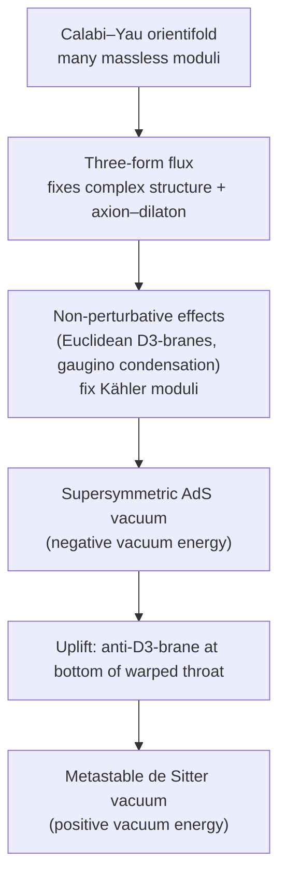
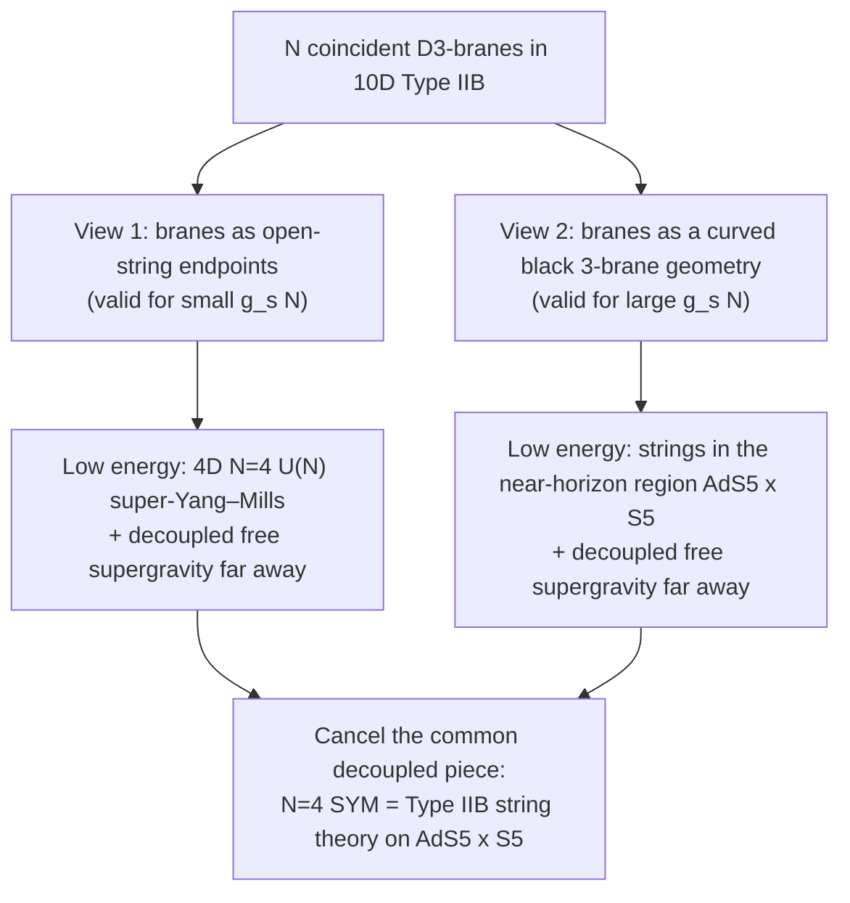

[String Theory](./) › D-Branes, Dualities & M-Theory

## D-Branes, Dualities & M-Theory

The [five superstring theories](./#the-five-superstring-theories) are defined perturbatively, as expansions in the string coupling $g_s$ around a fixed background. Beginning in 1995 it became clear that their non-perturbative physics ties them together. This page covers the ingredients of that picture: **D-branes**, the extended objects on which open strings end; **T-duality** and **S-duality**, which identify apparently different theories; **M-theory** and **F-theory**, which geometrize the strong-coupling limits; **compactification** to four dimensions; the **AdS/CFT correspondence**; and the **microscopic counting of black-hole entropy**. The equations here are stated rather than derived; derivations are on the [Graduate Formalism](string-theory-formalism.html) page.

## D-Branes

### Definition

A **D$p$-brane** ("D" for Dirichlet) is a $p$-dimensional extended object — a hypersurface with $p$ spatial dimensions plus time — on which open strings can end. An open string ending on it obeys Neumann boundary conditions in the $p+1$ directions along the brane and Dirichlet conditions in the $9-p$ transverse directions. A D0-brane is a particle, a D1-brane a string, a D3-brane a membrane with three spatial dimensions, and so on.

Polchinski's 1995 insight was that D-branes are not fixed backgrounds but **dynamical, charged objects** of the theory:

- A D$p$-brane is the source of a Ramond–Ramond $(p+1)$-form gauge field $C_{p+1}$, just as a charged particle sources a one-form (the electromagnetic potential). Type IIA has RR forms of odd degree and therefore stable D-branes with even $p$; Type IIB has even-degree forms and odd $p$.
- D-branes are **BPS states**: they preserve half of the supersymmetry, their tension equals their RR charge in natural units, and parallel D-branes of the same type exert no net force on each other (gravitational attraction cancels RR repulsion).
- Their tension is

$$\tau_p = \frac{1}{g_s \, (2\pi)^p \, \alpha'^{(p+1)/2}}.$$

The factor $1/g_s$ is the key point. Fundamental strings have tension independent of $g_s$, and ordinary solitons of a field theory have mass $\propto 1/g^2$. D-branes sit in between: invisible in string perturbation theory, heavy but not infinitely so at weak coupling, and light at strong coupling — which is why they drive the dualities below.

### Open strings and gauge theory on branes

The massless states of open strings with both ends on a single D$p$-brane form a $U(1)$ gauge field living on the brane's $(p+1)$-dimensional worldvolume, plus $9-p$ scalars describing the brane's transverse position, plus their superpartners.

<figure>
<svg viewBox="0 0 600 250" role="img" aria-label="Two parallel D-branes drawn as vertical slabs. A short open string loops from brane A back to brane A and another from brane B to itself; these are massless. A third string stretches across the gap from A to B; its mass is proportional to the separation." style="max-width: 600px; width: 100%; height: auto;" fill="none" stroke="currentColor" font-family="inherit">
  <path d="M 120 30 L 180 60 L 180 220 L 120 190 Z" fill="currentColor" fill-opacity="0.08" stroke-width="2"/>
  <path d="M 400 30 L 460 60 L 460 220 L 400 190 Z" fill="currentColor" fill-opacity="0.08" stroke-width="2"/>
  <text x="150" y="245" text-anchor="middle" fill="currentColor" stroke="none" font-size="14" font-weight="bold">brane A</text>
  <text x="430" y="245" text-anchor="middle" fill="currentColor" stroke="none" font-size="14" font-weight="bold">brane B</text>
  <!-- A-A string -->
  <path d="M 158 80 C 70 70, 70 130, 158 120" stroke-width="2.5"/>
  <circle cx="158" cy="80" r="3.5" fill="currentColor" stroke="none"/>
  <circle cx="158" cy="120" r="3.5" fill="currentColor" stroke="none"/>
  <text x="18" y="65" fill="currentColor" stroke="none" font-size="12">A–A: massless</text>
  <text x="18" y="80" fill="currentColor" stroke="none" font-size="12">U(1) gauge field</text>
  <!-- B-B string -->
  <path d="M 440 110 C 540 100, 540 160, 440 150" stroke-width="2.5"/>
  <circle cx="440" cy="110" r="3.5" fill="currentColor" stroke="none"/>
  <circle cx="440" cy="150" r="3.5" fill="currentColor" stroke="none"/>
  <text x="498" y="185" fill="currentColor" stroke="none" font-size="12">B–B: massless</text>
  <!-- A-B string -->
  <path d="M 165 160 C 230 140, 300 185, 420 160" stroke-width="2.5"/>
  <circle cx="165" cy="160" r="3.5" fill="currentColor" stroke="none"/>
  <circle cx="420" cy="160" r="3.5" fill="currentColor" stroke="none"/>
  <text x="290" y="140" text-anchor="middle" fill="currentColor" stroke="none" font-size="12">A–B: stretched string</text>
  <!-- distance arrow -->
  <line x1="180" y1="210" x2="400" y2="210" stroke-width="1" stroke-dasharray="4,3"/>
  <path d="M 188 205 L 180 210 L 188 215" stroke-width="1"/>
  <path d="M 392 205 L 400 210 L 392 215" stroke-width="1"/>
  <text x="290" y="203" text-anchor="middle" fill="currentColor" stroke="none" font-size="12" font-style="italic">separation d</text>
</svg>
<figcaption>Open strings between branes. Strings stretched across a gap $d$ have mass $M = d/(2\pi\alpha')$ (tension times length). As the branes coincide these become massless and the gauge symmetry enhances from $U(1) \times U(1)$ to $U(2)$.</figcaption>
</figure>

With $N$ branes, a string can start on brane $i$ and end on brane $j$, giving $N^2$ gauge fields: the Chan–Paton labels $(i,j)$ fill out the adjoint of $U(N)$. Moving branes apart is the **Higgs mechanism**: the transverse-position scalars acquire expectation values and the off-diagonal gauge bosons become massive. At low energy, $N$ coincident D$p$-branes carry maximally supersymmetric $U(N)$ Yang–Mills theory in $p+1$ dimensions. This geometric realization of gauge theory is the basis of brane-world model building, of the AdS/CFT correspondence, and of brane constructions of supersymmetric field theories.

### Worldvolume action

The low-energy dynamics of a single D-brane is governed by the **Dirac–Born–Infeld** (DBI) action plus a **Wess–Zumino** (Chern–Simons) coupling to the RR fields:

$$S = -T_p \int d^{p+1}\xi \; e^{-\phi} \sqrt{-\det\left(G_{ab} + B_{ab} + 2\pi\alpha' F_{ab}\right)} \; + \; \mu_p \int C \wedge e^{B + 2\pi\alpha' F},$$

where $T_p = (2\pi)^{-p} \alpha'^{-(p+1)/2}$ (so that $T_p e^{-\phi} = \tau_p$), $G_{ab}$ and $B_{ab}$ are the pullbacks of the spacetime metric and Kalb–Ramond field to the worldvolume, $F_{ab}$ is the worldvolume gauge field strength, $C = \sum_q C_q$ is the formal sum of RR potentials, and the Wess–Zumino integral picks out the $(p+1)$-form part. Expanding the DBI term to quadratic order in $F$ reproduces Maxwell (or, for $N$ branes, Yang–Mills) theory; the Wess–Zumino term shows that worldvolume flux carries the charge of lower-dimensional branes.

## T-Duality

### Closed strings on a circle

Compactify one direction on a circle of radius $R$. A closed string then has two quantum numbers in that direction: quantized **momentum** $n/R$ and **winding number** $w$, the number of times it wraps the circle (winding costs energy $wR/\alpha'$ because the string has tension). The mass spectrum is

$$M^2 = \frac{n^2}{R^2} + \frac{w^2 R^2}{\alpha'^2} + \frac{2}{\alpha'}\left(N + \tilde{N} - 2\right), \qquad N - \tilde{N} = n w.$$

This spectrum is invariant under

$$R \;\longleftrightarrow\; \frac{\alpha'}{R}, \qquad n \;\longleftrightarrow\; w.$$

A string cannot distinguish a circle of radius $R$ from one of radius $\alpha'/R$: momentum modes on one are winding modes on the other. The transformation extends to interactions, making it an exact equivalence of the full perturbative theory. One consequence is a **minimum length**: shrinking a circle below the self-dual radius $R = \sqrt{\alpha'}$ is physically the same as growing it, so there is no meaningful notion of distance much shorter than $\ell_s$ as probed by strings. At the self-dual radius, extra massless states appear and the $U(1) \times U(1)$ gauge symmetry from the circle enhances to $SU(2) \times SU(2)$.

### Action on the five theories and on branes

T-duality acts on the right-movers only, as a reflection $X_R \to -X_R$. For superstrings this flips the chirality of the right-moving Ramond ground state, so:

| Theory on radius $R$ | T-dual theory on radius $\alpha'/R$ |
|---|---|
| Type IIA | Type IIB |
| Type IIB | Type IIA |
| Heterotic $SO(32)$ (with Wilson line) | Heterotic $E_8 \times E_8$ (with Wilson line) |
| Type I | Type I′: Type IIA on an interval with two O8-planes and 16 D8-branes |

For open strings, T-duality exchanges Neumann and Dirichlet conditions in the dualized direction. A D$p$-brane **wrapping** the circle becomes a D$(p-1)$-brane localized on the dual circle; a D$p$-brane **transverse** to the circle becomes a D$(p+1)$-brane. Wilson lines of the worldvolume gauge field on the original circle become the positions of the branes on the dual circle. This is how the even-$p$ branes of IIA and odd-$p$ branes of IIB map into each other.

More generally, compactification on a $d$-torus has the T-duality group $O(d,d;\mathbb{Z})$, which mixes the metric and $B$-field on the torus. **Mirror symmetry** of Calabi–Yau manifolds can be understood as T-duality applied fibrewise to a torus fibration (the Strominger–Yau–Zaslow picture).

## S-Duality

S-duality relates a theory at coupling $g_s$ to a theory at coupling $1/g_s$. Unlike T-duality, it cannot be checked in perturbation theory; the evidence comes from matching BPS spectra, supergravity solutions, and protected quantities such as anomalies and certain effective couplings.

### Type IIB self-duality

Type IIB combines the RR scalar $C_0$ and the dilaton into the complex **axion–dilaton**

$$\tau = C_0 + i e^{-\phi}, \qquad g_s = e^{\phi}.$$

The low-energy supergravity is invariant under $SL(2,\mathbb{R})$; in the full string theory this is broken to the discrete **$SL(2,\mathbb{Z})$ duality group**:

$$\tau \;\to\; \frac{a\tau + b}{c\tau + d}, \qquad a, b, c, d \in \mathbb{Z}, \quad ad - bc = 1.$$

At $C_0 = 0$, the element $\tau \to -1/\tau$ maps $g_s \to 1/g_s$. The transformation acts on the extended objects of the theory:

| Object | S-dual image |
|---|---|
| Fundamental string (F1) | D1-brane (D-string) |
| NS5-brane | D5-brane |
| D3-brane | D3-brane (self-dual) |
| $(p,q)$ string: bound state of $p$ F1 and $q$ D1 | $(-q,p)$ string (sign convention-dependent); general $SL(2,\mathbb{Z})$ elements act linearly on $(p,q)$ |

On the worldvolume of $N$ D3-branes, this self-duality becomes the **Montonen–Olive** electric–magnetic duality of $\mathcal{N} = 4$ super-Yang–Mills, $g_{\text{YM}} \to 4\pi/g_{\text{YM}}$ (at zero theta angle).

### Type I and heterotic SO(32)

Type I and heterotic $SO(32)$ string theory have the same low-energy supergravity, related by $g_s^{\text{I}} = 1/g_s^{\text{het}}$. The D1-brane of Type I, whose worldvolume carries the right fermions, is identified with the heterotic fundamental string at strong Type I coupling.

## M-Theory

### The eleventh dimension

What is the strong-coupling limit of Type IIA? Type IIA contains D0-branes with mass $1/(g_s \ell_s)$, and $n$ of them form bound states with mass $n/(g_s \ell_s)$. As $g_s \to \infty$ this becomes an evenly spaced tower of arbitrarily light particles — exactly the signature of **Kaluza–Klein momentum on a circle** that is growing large. Witten (1995) proposed that strongly coupled IIA is an eleven-dimensional theory, **M-theory**, compactified on a circle of radius

$$R_{11} = g_s \, \ell_s, \qquad \ell_{11} = g_s^{1/3} \, \ell_s,$$

where $\ell_{11}$ is the eleven-dimensional Planck length. Perturbative IIA is M-theory on a circle much smaller than $\ell_{11}$; at large $g_s$ the circle decompactifies. The low-energy limit of M-theory is **eleven-dimensional supergravity** (Cremmer, Julia, Scherk, 1978), the maximal dimension in which a supergravity theory exists; its fields are the metric, a gravitino, and a three-form potential $C_3$. M-theory contains no strings and no dilaton, hence no dimensionless coupling at all.

### M-branes and the IIA dictionary

$C_3$ couples electrically to the **M2-brane** and magnetically to the **M5-brane**. Reducing on the M-theory circle reproduces every object of Type IIA:

| M-theory object | Wrapped on the circle? | Type IIA object |
|---|---|---|
| Momentum (KK mode) | — | D0-brane |
| M2-brane | Yes | Fundamental string F1 |
| M2-brane | No | D2-brane |
| M5-brane | Yes | D4-brane |
| M5-brane | No | NS5-brane |
| KK monopole | — | D6-brane |

Tension relations such as $T_{\text{F1}} = 2\pi R_{11} \, T_{\text{M2}}$ are consistent with all the formulas above, a nontrivial check.

### Hořava–Witten and the heterotic string

Compactifying M-theory on an **interval** $S^1/\mathbb{Z}_2$ rather than a circle gives two ten-dimensional boundary walls. Anomaly cancellation requires one $E_8$ gauge multiplet on each wall. The result (Hořava and Witten, 1996) is the strong-coupling limit of heterotic $E_8 \times E_8$ string theory, whose coupling again sets the interval length. The picture is attractive phenomenologically: the Standard Model can live on one wall and a hidden sector on the other, and choosing the interval somewhat larger than the eleven-dimensional Planck length lets the gravitational and gauge couplings unify at a common scale — a mismatch in weakly coupled heterotic models that Witten pointed out this setup removes.

### The duality web

<figure>
<svg viewBox="0 0 600 290" role="img" aria-label="A six-pointed star-shaped region representing the single moduli space of M-theory. Its six cusps are labelled M-theory, Type IIA, Type IIB, Type I, Heterotic SO(32), and Heterotic E8 x E8." style="max-width: 600px; width: 100%; height: auto;" fill="none" stroke="currentColor" font-family="inherit">
  <path d="M 300 40 Q 320 110, 391 92 Q 341 145, 391 198 Q 320 180, 300 250 Q 280 180, 209 198 Q 259 145, 209 92 Q 280 110, 300 40 Z" fill="currentColor" fill-opacity="0.08" stroke-width="2"/>
  <g fill="currentColor" stroke="none" font-size="14" font-weight="bold">
    <text x="300" y="28" text-anchor="middle">M-theory (11D supergravity)</text>
    <text x="400" y="88">Type IIA</text>
    <text x="400" y="208">Type IIB</text>
    <text x="300" y="272" text-anchor="middle">Type I</text>
    <text x="200" y="208" text-anchor="end">Heterotic SO(32)</text>
    <text x="200" y="88" text-anchor="end">Heterotic E8 x E8</text>
  </g>
  <g fill="currentColor" stroke="none" font-size="11" font-style="italic">
    <text x="370" y="60">circle</text>
    <text x="410" y="150">T-duality</text>
    <text x="360" y="245">orientifold</text>
    <text x="240" y="245" text-anchor="end">S-duality</text>
    <text x="190" y="150" text-anchor="end">T-duality</text>
    <text x="230" y="60" text-anchor="end">interval</text>
  </g>
  <circle cx="300" cy="145" r="3" fill="currentColor" stroke="none"/>
  <text x="300" y="165" text-anchor="middle" fill="currentColor" stroke="none" font-size="11">generic point: no weakly</text>
  <text x="300" y="178" text-anchor="middle" fill="currentColor" stroke="none" font-size="11">coupled description</text>
</svg>
<figcaption>The standard cartoon of the moduli space of M-theory (with enough supersymmetry). Each cusp is a limit where one description is weakly coupled and perturbatively useful; the labels between cusps are the dualities or compactifications that connect neighbouring limits. The interior has no known perturbative description.</figcaption>
</figure>

Combining T- and S-dualities on tori generates larger discrete **U-duality** groups (Hull and Townsend, 1995), which mix perturbative and non-perturbative states. For Type II string theory on $T^6$ — equivalently M-theory on $T^7$ — the U-duality group is $E_{7(7)}(\mathbb{Z})$.

M-theory is known through its limits: 11D supergravity at low energy, the string theories in various corners, and a handful of non-perturbative formulations valid in special backgrounds — the **BFSS matrix model** (M-theory in light-cone frame as quantum mechanics of $N \to \infty$ D0-branes) and holographic duals such as ABJM theory for M2-branes. A complete definition valid in all backgrounds is not known.

## F-Theory

Type IIB's $SL(2,\mathbb{Z})$ acts on $\tau$ exactly as the modular group acts on the shape parameter of a two-torus. **F-theory** (Vafa, 1996) takes this literally: a Type IIB background in which $\tau$ varies over spacetime is described as a compactification on an **elliptically fibred** manifold, where a torus with modular parameter $\tau$ sits over each point. Places where the torus degenerates mark the positions of **7-branes**, around which $\tau$ undergoes $SL(2,\mathbb{Z})$ monodromy. Because both D-branes and their S-duals appear, F-theory captures strongly coupled IIB configurations and non-perturbative gauge groups, including exceptional groups ($E_6$, $E_7$, $E_8$) that perturbative IIB cannot produce.

F-theory is defined through M-theory: M-theory on a torus $T^2$, in the limit where the torus area shrinks to zero, is Type IIB on a circle that decompactifies. F-theory on elliptically fibred Calabi–Yau fourfolds is one of the main arenas for four-dimensional model building, including GUT models on 7-branes, and it holds the largest known collections of flux vacua.

## Compactification

A ten-dimensional theory must hide six dimensions to describe a four-dimensional world. The standard approach is **compactification** on a small compact six-manifold $X$: spacetime is locally $\mathbb{R}^{1,3} \times X$. The geometry and topology of $X$ are not cosmetic — they determine the gauge group, the number of particle generations, the Yukawa couplings, and the amount of supersymmetry of the four-dimensional theory. The massless four-dimensional fields are zero modes of ten-dimensional fields on $X$, counted by its cohomology.

### Calabi–Yau manifolds

Requiring that some supersymmetry survive in four dimensions (at the compactification scale, to keep quantum corrections controlled) requires a covariantly constant spinor on $X$. For a six-manifold this means **$SU(3)$ holonomy**, i.e. a **Calabi–Yau threefold**: a compact Kähler manifold with vanishing first Chern class, which by Yau's theorem admits a Ricci-flat metric, $R_{mn} = 0$.

A Calabi–Yau threefold preserves one quarter of the ten-dimensional supersymmetry:

| Theory | 10D supercharges | 4D supersymmetry on a Calabi–Yau |
|---|---|---|
| Heterotic, Type I | 16 | $\mathcal{N} = 1$ (chiral; phenomenologically viable) |
| Type IIA, IIB | 32 | $\mathcal{N} = 2$; reduced to $\mathcal{N} = 1$ by orientifolds and D-branes |

The topology is summarized by the Hodge numbers $h^{1,1}$ and $h^{2,1}$, with Euler characteristic $\chi = 2(h^{1,1} - h^{2,1})$. In the simplest heterotic construction (the "standard embedding" of the gauge connection in the spin connection), the number of chiral generations is $|\chi|/2$. The quintic hypersurface in $\mathbb{CP}^4$, the textbook example, has $h^{1,1} = 1$, $h^{2,1} = 101$, $\chi = -200$. The number of distinct Calabi–Yau threefolds is unknown and possibly infinite; the Kreuzer–Skarke list of 473,800,776 reflexive four-dimensional polytopes alone yields an enormous number of them as toric hypersurfaces.

**Mirror symmetry** pairs Calabi–Yau manifolds $X$ and $\tilde{X}$ with $h^{1,1}$ and $h^{2,1}$ exchanged, such that Type IIA on $X$ is equivalent to Type IIB on $\tilde{X}$. Its prediction of the number of rational curves on the quintic (Candelas, de la Ossa, Green, Parkes, 1991) launched a large body of work in enumerative geometry.

### Moduli

A Calabi–Yau solution comes in continuous families. The parameters of the family appear in four dimensions as massless scalar fields, **moduli**:

| Moduli | Count | Controls |
|---|---|---|
| Kähler moduli (complexified with $B$ or $C_4$) | $h^{1,1}$ | Sizes of 2- and 4-cycles, overall volume |
| Complex-structure moduli | $h^{2,1}$ | Shape of the manifold |
| Axion–dilaton / dilaton | 1 | String coupling |

Massless scalars coupled with gravitational strength would mediate unobserved long-range forces, and their values set the couplings of the low-energy theory. Giving them masses — **moduli stabilization** — is a prerequisite for any realistic vacuum.

### Flux compactification

In Type IIB, turning on quantized RR and NS–NS three-form fluxes through the three-cycles of $X$,

$$\frac{1}{(2\pi)^2 \alpha'} \int_{\Sigma_3} F_3 \in \mathbb{Z}, \qquad \frac{1}{(2\pi)^2 \alpha'} \int_{\Sigma_3} H_3 \in \mathbb{Z},$$

generates the Gukov–Vafa–Witten superpotential

$$W = \int_X G_3 \wedge \Omega, \qquad G_3 = F_3 - \tau H_3,$$

where $\Omega$ is the holomorphic three-form. This fixes the complex-structure moduli and the axion–dilaton (Giddings, Kachru, Polchinski, 2002). Flux also warps the geometry, producing long **throats** in which energies are redshifted. Fluxes carry D3-brane charge, and the total must cancel against orientifold planes and curvature on a compact space (the **tadpole condition**), which bounds how much flux can be turned on. The Kähler moduli are not fixed by flux and require further ingredients:

This is the **KKLT** scenario (Kachru, Kallosh, Linde, Trivedi, 2003). The **Large Volume Scenario** (Balasubramanian, Berglund, Conlon, Quevedo, 2005) instead uses perturbative $\alpha'$ corrections to fix the volume at exponentially large values. Whether each step is under parametric control — particularly the anti-brane uplift — has been disputed at length; in 2024 McAllister, Moritz, Nally, and Schachner presented explicit candidate KKLT de Sitter vacua in specific Calabi–Yau orientifolds with all moduli stabilized, sharpening but not ending the debate. The large number of flux choices is the origin of the **landscape** of vacua; see [The Landscape and the Swampland](frontiers-and-formalism.html#the-landscape-and-the-swampland).

## AdS/CFT Correspondence

**Holography** is the proposal that a quantum theory of gravity in a region of spacetime is exactly equivalent to a non-gravitational quantum field theory on its boundary, with one fewer dimension. Maldacena's 1997 **AdS/CFT correspondence** is the precise and best-tested example, and it is now one of the most widely used tools in theoretical physics.

### Maldacena's argument

Consider $N$ coincident D3-branes in Type IIB string theory and take the low-energy limit $\alpha' \to 0$ in two ways:

The conjecture is that the two descriptions agree for all values of the parameters, not just where both are computable.

### Dictionary

The parameters on the two sides are related by (in the most common convention)

$$g_{\text{YM}}^2 = 4\pi g_s, \qquad \lambda \equiv g_{\text{YM}}^2 N = \frac{R^4}{\alpha'^2},$$

where $R$ is the common radius of $AdS_5$ and $S^5$ and $\lambda$ is the 't Hooft coupling. The $SO(4,2)$ isometry of $AdS_5$ is the conformal group of four-dimensional Minkowski space, and the $SO(6)$ isometry of $S^5$ is the R-symmetry of $\mathcal{N} = 4$ SYM. Each bulk field $\phi$ is dual to a boundary operator $\mathcal{O}$; the boundary value $\phi_0$ of the field acts as a source (Gubser–Klebanov–Polyakov, Witten):

$$Z_{\text{string}}\left[\phi \to \phi_0\right] = \left\langle \exp\left( \int d^4x \, \phi_0 \, \mathcal{O} \right) \right\rangle_{\text{CFT}}, \qquad \Delta(\Delta - 4) = m^2 R^2,$$

where the second relation fixes the scaling dimension $\Delta$ of $\mathcal{O}$ in terms of the mass $m$ of a bulk scalar.

The power of the correspondence is that it is a **strong–weak duality**:

| Regime | Boundary gauge theory | Bulk string theory |
|---|---|---|
| $\lambda \ll 1$ | Weakly coupled; perturbation theory works | Highly curved, stringy; hard |
| $\lambda \gg 1$, $N \to \infty$ | Strongly coupled; hard | Classical supergravity; tractable |
| $1/N$ corrections | Non-planar diagrams | String loops, quantum gravity ($G_N \propto 1/N^2$) |

Integrability of planar $\mathcal{N} = 4$ SYM allows some quantities, such as the spectrum of operator dimensions, to be computed at all $\lambda$, interpolating between the two regimes and providing the most detailed checks of the conjecture.

### Other examples and generalizations

| Branes | Bulk geometry | Boundary theory |
|---|---|---|
| $N$ D3-branes | $AdS_5 \times S^5$ | $\mathcal{N} = 4$ $SU(N)$ SYM in 4D |
| $N$ M2-branes | $AdS_4 \times S^7/\mathbb{Z}_k$ | ABJM Chern–Simons-matter theory in 3D |
| $N$ M5-branes | $AdS_7 \times S^4$ | 6D $\mathcal{N} = (2,0)$ superconformal theory |
| D1–D5 system | $AdS_3 \times S^3 \times T^4$ | 2D CFT related to the symmetric orbifold $\mathrm{Sym}^N(T^4)$ |

For the $AdS_3$ case with one unit of NS–NS flux, Eberhardt, Gaberdiel, and Gopakumar (2018–2019) showed that the worldsheet theory is exactly dual to the free symmetric-product CFT — one of the few settings in which the correspondence has been derived rather than conjectured. Non-conformal and non-supersymmetric generalizations (holographic QCD models, black-brane plasma) and non-AdS proposals (dS/CFT, flat-space and celestial holography) are covered on [Criticisms & Research Frontiers](frontiers-and-formalism.html#holography-and-quantum-information).

### Applications

- **Strongly coupled plasmas.** The ratio of shear viscosity to entropy density is $\eta/s = 1/(4\pi)$ for any gauge theory with a classical Einstein-gravity dual (Kovtun, Son, Starinets, 2005) — close to values inferred for the quark–gluon plasma at RHIC and the LHC.
- **Condensed matter.** Holographic models of non-Fermi liquids, strange metals, and superconductors ("AdS/CMT") give qualitative insight into strongly coupled systems without quasiparticles.
- **Quantum gravity.** Black holes in AdS are dual to thermal states of an ordinary unitary quantum system, so black-hole evaporation must preserve information — the context of the entanglement and Page-curve results.
- **Quantum information.** Entanglement entropy, error correction, and complexity have precise bulk duals (see [Holography and Quantum Information](frontiers-and-formalism.html#holography-and-quantum-information)).

## Black Holes in String Theory

### Microscopic entropy

A black hole has **Bekenstein–Hawking entropy** proportional to its horizon area,

$$S_{\text{BH}} = \frac{A}{4 G_N} \quad \left(\text{with } \hbar = c = k_B = 1\right).$$

Statistical mechanics says entropy counts microstates, but classical general relativity offers no microstates to count. In 1996 **Strominger and Vafa** computed this entropy microscopically for a class of supersymmetric, extremal five-dimensional black holes. The black hole is built from $Q_1$ D1-branes and $Q_5$ D5-branes wrapped on a compact space, carrying $N$ units of momentum along the D1 direction. At weak coupling the bound states are described by a two-dimensional CFT, whose asymptotic density of states (Cardy's formula) gives

$$S_{\text{micro}} = 2\pi \sqrt{Q_1 Q_5 N}.$$

At strong coupling the same charges form a black hole whose horizon area yields exactly the same result, including the factor $1/4$. Supersymmetry protects the count as the coupling is varied. The agreement has since been extended to near-extremal, rotating, and four-dimensional black holes, and to subleading corrections in the charges — the most quantitatively precise statement that string theory captures correct quantum-gravity degrees of freedom. Extending it to realistic, non-supersymmetric black holes such as Schwarzschild or Kerr remains open.

### Fuzzballs and microstate geometries

The **fuzzball proposal** (Mathur and collaborators) holds that individual microstates of a black hole are horizonless, smooth geometries that differ from the classical solution out to the horizon scale; the classical black hole is a coarse-grained average. Large families of such supergravity solutions ("microstate geometries", including superstrata) have been constructed for supersymmetric black holes, though they account for only part of the entropy. The proposal would resolve the information paradox by removing the horizon, and it competes with the island/QES picture, in which semiclassical geometry is retained but the entropy of radiation is computed differently.

### Correspondence principle

As a Schwarzschild black hole shrinks, its horizon eventually reaches the string length. At that point, the black hole's entropy matches, up to factors of order one, the entropy of a highly excited string state of the same mass (Horowitz and Polchinski, 1996). This suggests that black holes and long string states are two ends of a single continuum, with no discontinuity at the transition.

## Cosmological Applications

String theory enters cosmology mainly through inflation, dark energy, and relics:

- **Brane worlds.** If Standard Model fields live on D-branes, gravity alone propagates in the extra dimensions. This allows millimetre-scale (ADD, 1998) or strongly warped (Randall–Sundrum, 1999) extra dimensions and motivates the low-string-scale scenarios tested at colliders.
- **String inflation.** Brane–antibrane inflation (KKLMMT, 2003), DBI inflation, axion monodromy, and inflation driven by Kähler moduli are the principal constructions. All require stabilized moduli, which is the main technical obstacle.
- **Dark energy.** Whether string theory has long-lived de Sitter vacua, or instead requires dynamical dark energy, is one of the field's central open questions — sharpened by the 2025 DESI results favouring evolving dark energy.
- **Relics.** Cosmic superstrings, light axions, and moduli are generic outputs of compactifications.

Their observational status is discussed on [Criticisms & Research Frontiers](frontiers-and-formalism.html#experimental-signatures-and-phenomenology).

## See Also

- [String Theory (Overview)](./) — strings, quantization, and the five theories.
- [Criticisms & Research Frontiers](frontiers-and-formalism.html) — the landscape, the Swampland, holography and quantum information, experimental prospects.
- [Graduate Formalism](string-theory-formalism.html) — derivations of the D-brane action, duality web, and AdS/CFT dictionary.
- [QFT Frontiers](../qft-frontiers.html) — AdS/CFT, the conformal bootstrap, and the Page curve from the field-theory side.
- [Black Holes](../relativity/black-holes.html) — the classical geometry whose entropy string theory counts.
- [Cosmology](../relativity/cosmology.html) — inflation and dark energy.
- [Condensed Matter Physics](../condensed-matter/) — strongly correlated systems where holographic models are applied.
