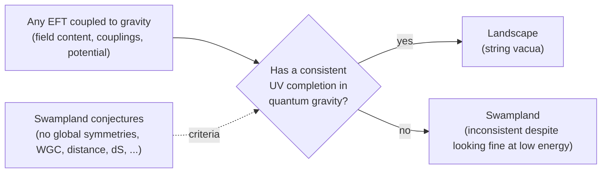

[String Theory](./) › Criticisms & Research Frontiers

## Criticisms & Research Frontiers

String theory is unfinished, contested, and influential out of proportion to its experimental support. This page covers the **criticisms** of its scientific status, the tension between the **landscape** of vacua and the **Swampland** program that constrains it, the most active research directions — **holography and quantum information** and the **scattering-amplitudes** program — and the **experimental status** of string phenomenology as of 2026: what colliders, gravitational-wave detectors, cosmological surveys, and precision tests could observe, and what they have ruled out. The mathematical machinery (worldsheet CFT, superstring quantization, the AdS/CFT dictionary) is on the separate [Graduate Formalism](string-theory-formalism.html) page; the physical background is in [D-Branes, Dualities & M-Theory](dualities-and-branes.html).

## Criticisms and Challenges

### Lack of uniqueness

String theory was once hoped to be **unique**: a single consistent quantum gravity with no free parameters, from which the Standard Model would follow. Compactification ended that hope. The choice of internal manifold, of quantized fluxes through its cycles, and of wrapped branes produces an enormous number of consistent vacua. The often-quoted figure $\sim 10^{500}$ comes from early Type IIB flux counts; Taylor and Wang (2015) estimated that a single F-theory geometry supports on the order of $10^{272{,}000}$ flux vacua. No known dynamical principle selects the vacuum describing our universe.

### Predictivity and falsifiability

With so many vacua, critics argue that the framework can accommodate almost any low-energy observation after the fact. The sharpest version, associated with Lee Smolin and Peter Woit, is that a theory able to fit any data is not making risky predictions in Popper's sense. Appeals to **anthropic selection** — we observe a small cosmological constant because only such vacua contain observers — are to critics an admission that the parameters of nature cannot be predicted. Defenders reply that a multiverse makes statistical predictions, that the Swampland supplies falsifiable constraints, and that the framework has already been predictive in the sense of producing correct, checkable results in black-hole physics and quantum field theory. Philosophers of science (notably Richard Dawid) have framed the dispute as one over "non-empirical theory assessment". It remains unresolved and is as much about what counts as evidence as about physics.

### No non-perturbative definition

String theory is mostly defined **perturbatively**, as an asymptotic expansion in $g_s$ over worldsheet topologies around a fixed background. There is no complete **background-independent, non-perturbative** definition. M-theory, matrix models (BFSS, IKKT), string field theory, and AdS/CFT each provide non-perturbative definitions in special settings — AdS/CFT in fact defines quantum gravity with AdS asymptotics through a boundary field theory — but none covers cosmological spacetimes like ours. This is a foundational gap, not merely unfinished computation.

### Distance from experiment

The conventional string scale is within a few orders of magnitude of the Planck scale, roughly $10^{15}$ times beyond LHC energies, and characteristic stringy effects are suppressed by powers of $E/M_s$. The [experimental section](#experimental-signatures-and-phenomenology) below describes the loopholes — lowered string scales, cosmic strings, primordial gravitational waves, light axions — but no string-specific signal has been observed, and most well-motivated scenarios put such signals out of current reach.

### Common misconceptions

| Claim | Status |
|---|---|
| "String theory has been proven." | False. It has no confirmed experimental prediction. It is a mathematically consistent framework, not an established theory of nature. |
| "String theory has been ruled out." | Also false. Non-observation of supersymmetry at the LHC disfavours specific low-energy models but not the framework, whose supersymmetry-breaking scale is model-dependent. |
| "The extra dimensions are a mathematical trick." | They are physical but compact, and their geometry determines the observed particle physics. |
| "$10^{500}$ vacua means it predicts nothing." | The landscape is a genuine problem, but the Swampland program shows that many low-energy theories cannot arise, which yields constraints. |
| "Strings are made of something." | Strings are fundamental in the framework; different vibrational states of one string *are* different particles. At strong coupling, strings are not even the fundamental degrees of freedom (branes and M-theory are). |
| "It has had no impact." | AdS/CFT is standard in quantum field theory and quantum-information approaches to gravity; microstate counting gave the first statistical derivation of black-hole entropy; mirror symmetry and related ideas reshaped parts of geometry. |

## The Landscape and the Swampland

The structural question of modern string theory is: *which low-energy effective field theories (EFTs) coupled to gravity can come from a consistent quantum gravity?*

### The landscape

Distinct compactifications and flux choices produce distinct four-dimensional EFTs, each with its own gauge group, spectrum, and couplings. The **flux compactification** program (GKP 2002, KKLT 2003, the Large Volume Scenario 2005, and successors; see [Flux compactification](dualities-and-branes.html#flux-compactification)) shows how fluxes and non-perturbative effects stabilize moduli and, in some constructions, lift the vacuum energy to a small positive value. Whether such de Sitter vacua are under full parametric control has been contested since 2018. In 2024 McAllister, Moritz, Nally, and Schachner presented explicit candidate KKLT-type de Sitter vacua in specific Type IIB Calabi–Yau orientifolds with all moduli stabilized — the most concrete constructions to date — while critics continue to scrutinize the control of corrections in the warped throat.

### The Swampland program

The Swampland program (Vafa, 2005, and a large literature since) asks which EFTs can *never* be completed into quantum gravity. Its conjectures vary widely in how well they are supported:

| Conjecture | Statement (schematic) | Support / status |
|---|---|---|
| No global symmetries | Every exact symmetry in quantum gravity is gauged or broken | Strong: black-hole arguments; proved in AdS/CFT (Harlow–Ooguri, 2018) |
| Completeness | Every gauge charge allowed by the theory is carried by some state | Strong; closely tied to the above |
| Weak Gravity Conjecture | A $U(1)$ with coupling $g$ has a state with $q/m \geq$ that of an extremal black hole; in Planck units $m \lesssim g \, q \, M_{\text{Pl}}$ | Well supported in string examples; lattice and tower refinements |
| Distance Conjecture | A proper distance $d$ in moduli space brings down a tower with $m \sim m_0 \, e^{-\alpha d}$ | Holds in all known string examples; limits EFT validity at large field excursions |
| Emergent String Conjecture | Every infinite-distance limit is either a decompactification or a weakly coupled string limit | Supported by extensive checks in string compactifications |
| de Sitter Conjecture | $\lvert \nabla V \rvert / V \geq c / M_{\text{Pl}}$, $c = \mathcal{O}(1)$; refined versions allow unstable maxima | Speculative; in tension with KKLT-type constructions |
| Trans-Planckian Censorship | Modes that started below the Planck length never cross the Hubble horizon | Speculative; would forbid long-lived dS and strongly constrain inflation |

In display form, the de Sitter conjecture reads

$$\frac{\lvert \nabla V \rvert}{V} \geq \frac{c}{M_{\text{Pl}}} \qquad \text{or} \qquad \min \nabla_i \nabla_j V \leq -\frac{c'}{M_{\text{Pl}}^2} V.$$

If correct, the observed dark energy cannot be a cosmological constant in a stable vacuum and must instead be a slowly rolling field (quintessence) whose energy density decreases over time.

### Observational pressure

The Swampland program is the field's strongest bid to be falsifiable, and two recent developments give it contact with data:

- **Evolving dark energy.** DESI's 2025 second data release (DR2) baryon-acoustic-oscillation analysis, combined with CMB and supernova data, prefers time-evolving dark energy with $w_0 > -1$, $w_a < 0$ over a cosmological constant at 2.8–4.2$\sigma$, depending on the supernova sample. A decreasing dark-energy density is qualitatively what the de Sitter conjecture predicts, but the best fits cross into $w < -1$ at earlier times, which simple quintessence cannot produce. The result is not yet at discovery significance, and its interpretation is actively debated.
- **The dark dimension.** Montero, Vafa, and Valenzuela (2022) combined the Distance Conjecture with the observed dark-energy scale to argue for a single extra dimension of size $\ell \sim \Lambda^{-1/4} \sim 10^{-6}$ m (the "dark dimension"), with a higher-dimensional gravity scale around $10^9$–$10^{10}$ GeV. It predicts deviations from Newton's inverse-square law at micron scales, just below the reach of current torsion-balance experiments, and a tower of Kaluza–Klein gravitons as a dark-matter candidate.

## Holography and Quantum Information

The most productive frontier grows out of the [AdS/CFT correspondence](dualities-and-branes.html#adscft-correspondence) (the precise dictionary is on the [Graduate Formalism](string-theory-formalism.html#adscft-correspondence) page). Its main lesson is that bulk geometry is encoded in the entanglement structure of the boundary theory.

### Spacetime from entanglement

The **Ryu–Takayanagi** formula (2006) computes the entanglement entropy of a boundary region $A$ from the area of the minimal bulk surface $\gamma_A$ anchored on its boundary:

$$S_A = \frac{\text{Area}(\gamma_A)}{4 G_N}.$$

Van Raamsdonk's "building spacetime with quantum entanglement" (2010) and Maldacena–Susskind's **ER = EPR** (2013) develop the picture: reducing entanglement between boundary regions disconnects the corresponding bulk regions, and entangled black holes are connected by wormholes. The quantum-corrected version replaces the minimal surface with a **quantum extremal surface** (QES) that extremizes area plus bulk entanglement entropy.

### The Page curve and islands

If black-hole evaporation is unitary, the entropy of the Hawking radiation must rise and then fall back to zero (the **Page curve**); Hawking's semiclassical calculation instead gives monotonic growth. In 2019 two groups (Penington; Almheiri, Engelhardt, Marolf, Maxfield) showed that the QES prescription, applied to an evaporating black hole, produces a new extremal surface after the Page time. The resulting **island formula**,

$$S(R) = \min_I \, \text{ext}_I \left[ \frac{\text{Area}(\partial I)}{4 G_N} + S_{\text{bulk}}(R \cup I) \right],$$

includes an "island" $I$ inside the black hole as part of the radiation $R$ and reproduces the Page curve. Gravitational path-integral derivations via **replica wormholes** followed. The calculation shows that semiclassical gravity knows about unitarity, but not *how* information gets out in terms of microscopic dynamics, which remains open.

### Operator algebras

Since 2022, work by Witten, Chandrasekaran, Longo, Penington, and others has recast these results in the language of **von Neumann algebras**. In quantum field theory the algebra of observables in a region is of Type III, which has no well-defined entropy; including gravitational dressing turns it into a Type II algebra that does. Chandrasekaran, Penington, and Witten (2022) showed that the entropy of semiclassical states in this algebra equals the **generalized entropy** of the horizon, giving a derivation of the QES prescription and the generalized second law without replica tricks; later work extended this to general Killing horizons including de Sitter space.

### Error correction, tensor networks, and complexity

- **Holographic quantum error correction.** Bulk operators in the interior can be reconstructed from several different boundary regions, exactly as a logical qubit is protected in an error-correcting code (Almheiri, Dong, Harlow, 2015). Toy models such as the HaPPY code realize this with tensor networks.
- **Tensor networks.** MERA and related networks give discrete models of bulk geometry emerging from boundary entanglement.
- **Complexity.** The growth of the black-hole interior long after thermalization is proposed to be dual to the growth of the quantum computational complexity of the boundary state ("complexity = volume", "complexity = action"); the "complexity = anything" proposals (2021–22) showed that a broad class of bulk observables share this behaviour.
- **Low-dimensional models.** The SYK model and Jackiw–Teitelboim gravity provide solvable settings where many of these ideas can be checked exactly.

### Beyond AdS

Our universe is not asymptotically anti-de Sitter, so extending holography is a major program:

- **dS/CFT** proposes a dual for de Sitter space as a non-unitary Euclidean CFT at future infinity; it is far less developed than AdS/CFT.
- **Flat-space and celestial holography** recast four-dimensional scattering amplitudes as correlators of a two-dimensional **celestial CFT** on the celestial sphere, organized by the infinite-dimensional BMS asymptotic symmetries of flat spacetime; Carrollian holography is a related approach at null infinity.

## The Amplitudes Program

String theory began as a formula for a scattering amplitude (Veneziano, 1968), and the modern **amplitudes program** has made the computation of amplitudes a frontier in its own right. Its central discovery is that gauge-theory and gravity amplitudes have structure invisible in Feynman-diagram expansions. The field-theory side is covered on [QFT Frontiers](../qft-frontiers.html#the-modern-amplitudes-program); the string-related threads are:

- **Positive geometry.** For planar $\mathcal{N} = 4$ SYM, amplitudes are computed by the **amplituhedron** (Arkani-Hamed and Trnka, 2013), a generalized polytope in which locality and unitarity follow from positivity. Since 2023, "surfaceology" (Arkani-Hamed, Frost, Salvatori, Plamondon, Thomas) has extended this to non-supersymmetric colored scalar theories at all loop orders via curve integrals on surfaces, and the discovery of **hidden zeros** (2023) showed that amplitudes of colored scalars, pions, and gluons are the same function evaluated at shifted kinematics.
- **The double copy.** Gravity amplitudes are, schematically, the square of gauge-theory amplitudes,

  $$\text{gravity} \sim (\text{gauge theory}) \otimes (\text{gauge theory}),$$

  made precise at tree level by the KLT relations — the field-theory limit of the factorization of closed-string amplitudes into pairs of open-string amplitudes — and at loop level by the BCJ color–kinematics duality.
- **Scattering equations and ambitwistor strings.** The CHY formulas express tree amplitudes as integrals localized on solutions of the scattering equations in any dimension; ambitwistor strings give these a worldsheet origin.
- **Rigidity of string amplitudes.** Bootstrap studies ask whether string amplitudes are the unique consistent deformation of field theory with an infinite tower of higher-spin states. Arkani-Hamed, Cheung, Figueiredo, and Remmen (2024) showed that multiparticle factorization excludes several proposed deformations of string amplitudes while string theory satisfies all constraints.
- **Gravitational-wave physics.** Amplitude and worldline-QFT methods now compute the post-Minkowskian expansion of black-hole scattering to high order for comparison with numerical relativity and detector templates. A 2025 *Nature* paper by Driesse, Jakobsen, Klemm, Mogull, Nega, Plefka, Sauer, and Usovitsch reached fifth post-Minkowskian order including radiation and found that periods of Calabi–Yau threefolds — the same geometry used in string compactification — appear in the radiated energy and recoil.

## Experimental Signatures and Phenomenology

The honest summary is that direct production of strings or their excited states requires energies near $M_s$, which is expected to be far beyond any accelerator. **String phenomenology** looks instead for low-energy fingerprints of specific constructions and for scenarios in which the relevant scale is lowered.

| Channel | What would be seen | Requires | Status (2026) |
|---|---|---|---|
| Collider resonances | Kaluza–Klein gravitons, string Regge excitations, microscopic black holes | String or higher-dimensional Planck scale near a TeV | Not seen at the LHC; TeV-scale scenarios pushed to several TeV |
| Supersymmetry | Superpartners with missing-energy signatures | Low-scale SUSY breaking | Not seen; natural weak-scale SUSY strongly constrained |
| Cosmic superstrings | Gravitational-wave bursts and background, lensing | Brane inflation or similar | Bounded by CMB, LIGO–Virgo–KAGRA, pulsar timing |
| Primordial gravitational waves | CMB B-mode polarization, tensor-to-scalar ratio $r$ | High-scale / large-field inflation | $r < 0.036$ (95%, BICEP/Keck 2021) |
| Non-Gaussianity | Equilateral bispectrum | DBI-type inflation | Constrained by Planck; no detection |
| Axions and moduli | Axion-like particles, fifth forces, dark matter | Light fields from compactification | Active searches; no detection |
| Short-range gravity | Deviations from inverse-square law | Large or "dark" extra dimension | Newtonian gravity confirmed down to tens of micrometres |
| Dark energy evolution | $w(z) \neq -1$ | Quintessence-like vacuum (Swampland) | DESI DR2: 2.8–4.2$\sigma$ hint (2025) |

### Collider signatures

Direct collider tests rely on lowering the fundamental scale:

- **Large extra dimensions (ADD)** and **warped extra dimensions (Randall–Sundrum)** can bring the higher-dimensional gravity scale toward the TeV range. The LHC could then produce **Kaluza–Klein resonances** — towers of massive copies of the graviton and other fields, spaced by the inverse compactification radius. A KK graviton would appear as a spin-2 resonance in dilepton or diphoton spectra.
- **String Regge excitations** would appear as resonances with

  $$M_n^2 = \frac{n}{\alpha'} = n \, M_s^2, \qquad n = 1, 2, 3, \dots,$$

  observable only if $M_s$ is near the TeV scale.
- **Microscopic black holes** could form if the true Planck scale were at TeV energies, decaying into high-multiplicity final states.

ATLAS and CMS have seen none of these through LHC Run 3. This constrains low-string-scale scenarios but says nothing about Planck-scale string physics. The High-Luminosity LHC, scheduled to begin operation around 2030, will extend the mass reach modestly.

### Supersymmetry

Realistic string compactifications usually contain supersymmetry at some scale, and low-scale supersymmetry was long regarded as the most likely link to experiment. Its classic signature is missing transverse momentum carried away by a stable lightest superpartner (also a dark-matter candidate), together with jets or leptons. LHC limits push gluino and squark masses into the multi-TeV range, strongly constraining "natural" weak-scale supersymmetry. Split or high-scale supersymmetry remains viable, and string theory does not predict the breaking scale, so the null results neither support nor falsify the framework.

### Cosmic superstrings

Fundamental strings and D-strings stretched to cosmological size at the end of brane inflation could survive as a network of **cosmic superstrings**. Their gravitational effects are set by the dimensionless tension $G\mu$, typically in the range

$$G\mu \sim 10^{-12} - 10^{-6}$$

in brane-inflation models (Copeland, Myers, Polchinski, 2004). They differ from field-theory cosmic strings by a **reconnection probability** $p < 1$ and by $(p,q)$ junctions, which increase the density of the network. Signatures include lensing, CMB discontinuities, and gravitational waves from cusps and kinks on loops — a stochastic background plus bursts. CMB data bound $G\mu \lesssim 10^{-7}$, and LIGO–Virgo–KAGRA and pulsar-timing searches constrain large parts of the remaining range, with limits that depend on the loop-distribution model. In 2023, pulsar-timing arrays (NANOGrav 15-year data, with EPTA, PPTA, and CPTA) reported evidence at roughly 3–4$\sigma$ for a nanohertz gravitational-wave background. It is consistent with a population of supermassive black-hole binaries, the leading interpretation; cosmic-string networks (notably metastable strings) can also fit the spectrum, so future pulsar-timing and space-based detectors (LISA) are a realistic, if uncertain, discovery channel.

### Primordial gravitational waves and inflation

Inflation is the natural meeting point of string theory and cosmology. A string inflation model must stabilize the moduli while supporting a long slow-roll phase, a stringent requirement that the Swampland conjectures sharpen. Leading constructions:

- **Brane inflation** — the inflaton is the distance between a brane and an antibrane, and inflation ends in their annihilation (often producing cosmic superstrings).
- **DBI inflation** — a non-canonical kinetic term inherited from brane dynamics produces large **equilateral non-Gaussianity**, which CMB data constrain.
- **Axion monodromy** — a mechanism for large-field inflation that predicts an observable tensor-to-scalar ratio $r$ and possibly oscillations in the primordial spectrum.
- **Kähler-moduli (fibre) inflation** — inflation along a stabilized volume direction in the Large Volume Scenario, typically with small to intermediate $r$.

The cleanest observable is $r$, the amplitude of primordial gravitational waves imprinted as B-mode polarization of the CMB. The **Lyth bound** ties an observable $r$ to a super-Planckian inflaton excursion,

$$\frac{\Delta\phi}{M_{\text{Pl}}} \gtrsim \left( \frac{r}{0.01} \right)^{1/2},$$

exactly the regime restricted by the Distance Conjecture, so a detection of $r \gtrsim 0.01$ would put pressure on the Swampland program while being compatible with axion monodromy. The current bound is $r < 0.036$ at 95% confidence (BICEP/Keck, 2021). The Simons Observatory, now observing, aims for $\sigma(r) \sim 0.003$; the Japanese-led LiteBIRD satellite is planned for the 2030s. CMB-S4, long planned as the definitive ground-based experiment, lost its DOE and NSF support in July 2025, and the agencies instead plan to support upgrades to existing experiments.

### Indirect and low-energy predictions

String constructions also make qualitative claims that low-energy experiments can probe:

- **Gauge-coupling unification** from embedding the Standard Model in a larger structure, shared with (and sharpened by) supersymmetric GUTs.
- **Patterns of Yukawa couplings** determined by the geometry of the internal manifold and brane intersections.
- **The axiverse** — compactifications generically contain many axion-like particles over a wide mass range (Arvanitaki et al., 2010), targets for haloscopes, black-hole superradiance, and CMB birefringence searches.
- **Light moduli** that could mediate fifth forces or violate the equivalence principle, constrained by torsion-balance and satellite tests.

None is uniquely stringy, but together they form the realistic interface between the framework and experiment.

## Open Problems

| Problem | Why it matters | Current approaches |
|---|---|---|
| Non-perturbative, background-independent definition | Needed to answer "what is string theory?" outside special backgrounds | Matrix models, string field theory, holography |
| Microscopic mechanism of information release | Islands reproduce the Page curve but do not explain the dynamics | Replica wormholes, operator algebras, fuzzballs, SYK and JT models |
| de Sitter space and dark energy | Our universe is accelerating; controlled dS vacua are contested | Explicit KKLT/LVS constructions, Swampland conjectures, dS holography, DESI and Euclid data |
| Holography for our universe | AdS/CFT does not apply to cosmology | dS/CFT, celestial and Carrollian holography |
| Realistic, fully stabilized vacua reproducing the Standard Model | The link between the framework and observed physics | F-theory GUTs, heterotic and intersecting-brane models, machine-learning searches of the landscape |
| Mathematical structure | String theory repeatedly predicts deep results in mathematics | Topological modular forms and anomalies, derived categories and D-brane stability, moonshine |

## References and Further Reading

### Criticisms and philosophy
1. Smolin — *The Trouble with Physics* (2006)
2. Woit — *Not Even Wrong* (2006)
3. Dawid — *String Theory and the Scientific Method* (2013)
4. Conlon — *Why String Theory?* (2015)

### Landscape and Swampland
1. Susskind — *The Anthropic Landscape of String Theory* (2003)
2. Vafa — *The String Landscape and the Swampland* (2005)
3. Taylor & Wang — *The F-theory Geometry with Most Flux Vacua* (2015)
4. Palti — *The Swampland: Introduction and Review* (2019)
5. Montero, Vafa & Valenzuela — *The Dark Dimension and the Swampland* (2022)
6. McAllister, Moritz, Nally & Schachner — *Candidate de Sitter Vacua* (2024)

### Holography and quantum information
1. Ryu & Takayanagi — *Holographic Derivation of Entanglement Entropy from AdS/CFT* (2006)
2. Van Raamsdonk — *Building up Spacetime with Quantum Entanglement* (2010)
3. Harlow — *TASI Lectures on the Emergence of Bulk Physics in AdS/CFT* (2018)
4. Almheiri, Hartman, Maldacena, Shaghoulian & Tajdini — *The Entropy of Hawking Radiation* (review, 2020)
5. Chandrasekaran, Penington & Witten — *Large N Algebras and Generalized Entropy* (2022)

### Amplitudes
1. Elvang & Huang — *Scattering Amplitudes in Gauge Theory and Gravity* (2015)
2. Arkani-Hamed & Trnka — *The Amplituhedron* (2013)
3. Bern, Carrasco, Chiodaroli, Johansson & Roiban — *The Duality Between Color and Kinematics and its Applications* (review, 2019)
4. Arkani-Hamed, Cheung, Figueiredo & Remmen — *Multiparticle Factorization and the Rigidity of String Theory* (2024)
5. Driesse et al. — *Emergence of Calabi–Yau Manifolds in High-Precision Black-Hole Scattering* (2025)

### Phenomenology and cosmology
1. Ibáñez & Uranga — *String Theory and Particle Physics* (2012)
2. Baumann & McAllister — *Inflation and String Theory* (2015)
3. Copeland, Myers & Polchinski — *Cosmic F- and D-strings* (2004)
4. Arvanitaki et al. — *String Axiverse* (2010)
5. DESI Collaboration — *DESI DR2 Results II: Measurements of Baryon Acoustic Oscillations and Cosmological Constraints* (2025)

## See Also

- [String Theory (Overview)](./) — strings, quantization, and the five theories.
- [D-Branes, Dualities & M-Theory](dualities-and-branes.html) — branes, dualities, compactification, and holography.
- [Graduate Formalism](string-theory-formalism.html) — the mathematical machinery this page does not duplicate.
- [QFT Frontiers](../qft-frontiers.html) — amplitudes, the conformal bootstrap, and the Page curve from the field-theory side.
- [Quantum Gravity](../relativity/quantum-gravity.html) — string theory alongside other approaches.
- [Cosmology](../relativity/cosmology.html) — inflation, dark energy, and the CMB.
- [Condensed Matter Physics](../condensed-matter/) — strongly correlated systems where holographic models are applied.
