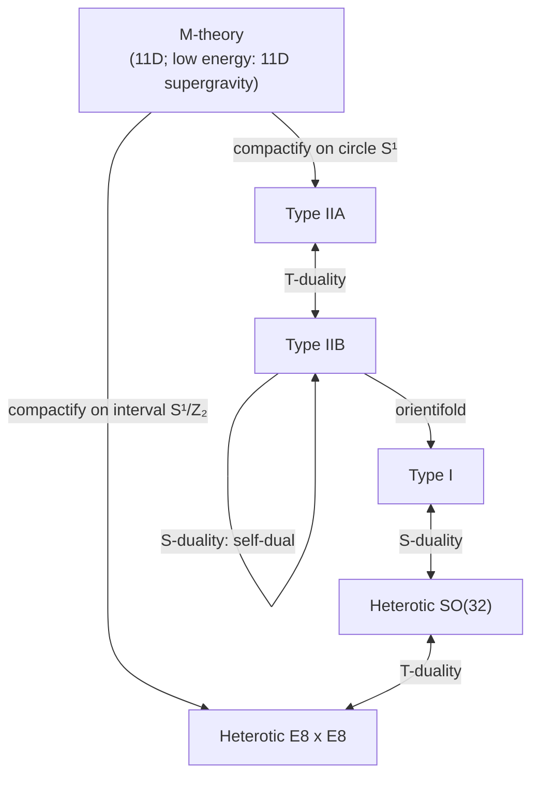

  <h1 style="color: white; margin: 0; font-size: 2rem;">String Theory</h1>
  
Quantum gravity from one-dimensional objects

**String theory** is a framework in which the point-like particles of quantum field theory are replaced by one-dimensional extended objects, **strings**, whose different vibrational states appear as different particles. Its defining feature is that a massless spin-2 state — the **graviton** — appears automatically in the spectrum of the closed string, so the theory is a candidate for a consistent quantum theory of gravity unified with gauge forces and matter. Quantum consistency fixes the spacetime dimension (26 for the bosonic string, 10 for the superstring) and, at weak coupling, allows exactly five supersymmetric theories, now understood as limits of a single framework often called **M-theory**. No experiment has yet tested a prediction specific to string theory; its established impact so far is on mathematics, black-hole physics, and quantum field theory (notably through holography).

This hub covers the foundations: the motivation, the classical and quantum theory of a single string, the superstring, and the five theories. Three companion pages continue:

| Page | Covers |
|---|---|
| [D-Branes, Dualities & M-Theory](dualities-and-branes.html) | D-branes, T- and S-duality, M-theory and F-theory, Calabi–Yau and flux compactification, AdS/CFT, black-hole microstates |
| [Criticisms & Research Frontiers](frontiers-and-formalism.html) | The landscape and the Swampland, holography and quantum information, amplitudes, experimental status and phenomenology, the scientific-status debate |
| [Graduate Formalism](string-theory-formalism.html) | Worldsheet CFT, BRST quantization, RNS and Green–Schwarz superstrings, D-brane actions, the AdS/CFT dictionary, topological strings |

## Motivation

General relativity and quantum field theory are each extremely well tested, but they do not combine naively. Quantizing the metric as a field around flat space gives a theory whose coupling, Newton's constant $G$, has mass dimension $-2$ in four dimensions; each additional loop brings more powers of energy, and the divergences cannot be absorbed into finitely many parameters. Perturbative quantum gravity is therefore **non-renormalizable**: it works as an effective field theory below the Planck scale $M_{\text{Pl}} \approx 1.2 \times 10^{19}$ GeV but says nothing about what happens above it.

String theory addresses this by changing the objects that interact. A point particle traces a **worldline**; a string traces a two-dimensional **worldsheet**. In a Feynman diagram, particles meet at a vertex — a sharp point where the short-distance divergences originate. A string interaction is a smooth surface (the "pair of pants" below) with no distinguished point at which the interaction happens, and the ultraviolet behaviour of string amplitudes is soft: in perturbation theory, string amplitudes are free of the ultraviolet divergences of point-particle gravity.

<figure>
<svg viewBox="0 0 600 230" role="img" aria-label="Left: a Feynman vertex where three particle worldlines meet at a point. Right: the corresponding closed-string diagram, a smooth pair-of-pants surface where two tubes merge into one." style="max-width: 600px; width: 100%; height: auto;" fill="none" stroke="currentColor" font-family="inherit">
  <!-- Feynman vertex -->
  <g stroke-width="2.5">
    <line x1="70" y1="190" x2="150" y2="110"/>
    <line x1="230" y1="190" x2="150" y2="110"/>
    <line x1="150" y1="110" x2="150" y2="30"/>
  </g>
  <circle cx="150" cy="110" r="6" fill="currentColor" stroke="none"/>
  <text x="162" y="114" fill="currentColor" stroke="none" font-size="13">vertex: a single point</text>
  <text x="150" y="222" text-anchor="middle" fill="currentColor" stroke="none" font-size="14" font-weight="bold">Particles: worldlines meet at a point</text>
  <!-- Pair of pants -->
  <g stroke-width="2">
    <ellipse cx="400" cy="30" rx="32" ry="8"/>
    <ellipse cx="345" cy="190" rx="32" ry="8"/>
    <ellipse cx="505" cy="190" rx="32" ry="8"/>
    <path d="M 313 190 C 313 120, 368 100, 368 30"/>
    <path d="M 537 190 C 537 120, 432 100, 432 30"/>
    <path d="M 377 190 C 377 130, 473 130, 473 190"/>
  </g>
  <path d="M 313 190 C 313 120, 368 100, 368 30 L 432 30 C 432 100, 537 120, 537 190 L 473 190 C 473 130, 377 130, 377 190 Z" fill="currentColor" fill-opacity="0.08" stroke="none"/>
  <text x="425" y="222" text-anchor="middle" fill="currentColor" stroke="none" font-size="14" font-weight="bold">Strings: a smooth worldsheet, no vertex</text>
  <text x="20" y="20" fill="currentColor" stroke="none" font-size="12" font-style="italic">time</text>
  <line x1="30" y1="200" x2="30" y2="30" stroke-width="1.2" stroke-dasharray="3,3"/>
</svg>
<figcaption>Two strings joining into one. Slicing the pants at different times gives different "moments of interaction" depending on the observer's time coordinate, so there is no invariant interaction point — the origin of the soft short-distance behaviour.</figcaption>
</figure>

The second reason string theory is taken seriously is that gravity is not put in by hand. The closed string always contains a massless symmetric spin-2 state, and consistency of the string propagating in a curved background requires, at leading order in $\alpha'$, that the background obey Einstein's equations. Gauge fields, chiral fermions, and supersymmetry arise from the same structure.

### Historical development

| Year | Development |
|---|---|
| 1968 | Veneziano writes a scattering amplitude with the Regge behaviour seen in hadron physics |
| 1970 | Nambu, Nielsen, and Susskind interpret it as the scattering of relativistic strings |
| 1971 | Ramond, Neveu, and Schwarz add worldsheet fermions — the precursor of the superstring |
| 1974 | Scherk–Schwarz and Yoneya identify the massless spin-2 state as the graviton; strings are recast as a theory of gravity. QCD displaces string models of hadrons |
| 1984 | Green and Schwarz show anomaly cancellation for gauge group $SO(32)$ ("first superstring revolution") |
| 1985 | Heterotic string (Gross, Harvey, Martinec, Rohm); Calabi–Yau compactification (Candelas, Horowitz, Strominger, Witten) |
| 1995 | Witten proposes M-theory; Polchinski identifies D-branes as carriers of Ramond–Ramond charge ("second revolution") |
| 1996 | Strominger and Vafa count black-hole microstates with D-branes |
| 1997 | Maldacena proposes the AdS/CFT correspondence |
| 2003 | KKLT construction of de Sitter vacua; the "landscape" enters the debate |
| 2006 | Ryu–Takayanagi formula ties entanglement entropy to bulk geometry |
| 2019 | Island / quantum-extremal-surface computations reproduce the Page curve of an evaporating black hole |

## Strings and Scales

A string is characterized by a single dimensionful parameter, the **Regge slope** $\alpha'$, equivalently the **string tension** $T$ or the **string length** $\ell_s$ (natural units, $\hbar = c = 1$):

$$T = \frac{1}{2\pi\alpha'}, \qquad \ell_s = \sqrt{\alpha'}, \qquad M_s = \frac{1}{\sqrt{\alpha'}}.$$

A second parameter, the **string coupling** $g_s$, controls interactions. It is not a free input: it is the expectation value of a dynamical scalar, the dilaton, $g_s = e^{\langle \phi \rangle}$.

Strings come in two topologies:

- **Closed strings** are loops. Their spectrum always contains the graviton.
- **Open strings** have two endpoints. Their massless states include gauge bosons, and the endpoints may be confined to hypersurfaces called **D-branes**.

Every consistent string theory contains closed strings, because two open-string endpoints can join.

### How large is a string?

The string scale is often quoted as "about the Planck length, $10^{-35}$ m", but the two are related through the coupling and the volume of any extra dimensions. For a ten-dimensional theory compactified on a six-dimensional space of volume $V_6$, the four-dimensional Planck mass satisfies, up to numerical factors,

$$M_{\text{Pl}}^2 \sim \frac{M_s^8 \, V_6}{g_s^2}.$$

With $g_s \lesssim 1$ and $V_6 \sim \ell_s^6$ this gives $M_s$ within one or two orders of magnitude of $M_{\text{Pl}}$ — the conventional expectation. Large volumes, strongly warped geometries, or very small $g_s$ can lower $M_s$ substantially, in principle as far as the TeV scale; collider and gravity experiments constrain those scenarios (see [experimental signatures](frontiers-and-formalism.html#experimental-signatures-and-phenomenology)).

| Scale | Length | Energy |
|---|---|---|
| Planck length $\ell_P = \sqrt{\hbar G / c^3}$ | $1.6 \times 10^{-35}$ m | $1.2 \times 10^{19}$ GeV |
| String length $\ell_s$ (conventional) | $\sim 10^{-34}$ – $10^{-32}$ m | $\sim 10^{16}$ – $10^{18}$ GeV |
| LHC resolution | $\sim 10^{-20}$ m | $\sim 10^{4}$ GeV |
| Proton radius | $0.84 \times 10^{-15}$ m | — |

## Classical String Theory

### Worldsheets

As it moves, a string sweeps out a worldsheet parametrized by a time-like coordinate $\tau$ and a space-like coordinate $\sigma$. The embedding functions $X^\mu(\tau, \sigma)$ describe where each point of the string sits in $D$-dimensional spacetime.

<figure>
<svg viewBox="0 0 600 250" role="img" aria-label="Three spacetime diagrams: a point particle traces a curved worldline; an open string traces a strip bounded by the paths of its two endpoints; a closed string traces a tube." style="max-width: 600px; width: 100%; height: auto;" fill="none" stroke="currentColor" font-family="inherit">
  <!-- time axis -->
  <line x1="18" y1="205" x2="18" y2="30" stroke-width="1.2"/>
  <path d="M 13 38 L 18 28 L 23 38" stroke-width="1.2"/>
  <text x="10" y="20" fill="currentColor" stroke="none" font-size="12" font-style="italic">t</text>
  <!-- Worldline -->
  <path d="M 100 200 C 80 160, 125 110, 100 70 S 110 40, 105 35" stroke-width="2.5"/>
  <circle cx="100" cy="200" r="4" fill="currentColor" stroke="none"/>
  <text x="100" y="228" text-anchor="middle" fill="currentColor" stroke="none" font-size="13" font-weight="bold">Point particle</text>
  <text x="100" y="244" text-anchor="middle" fill="currentColor" stroke="none" font-size="12">worldline (1D)</text>
  <!-- Open string strip -->
  <path d="M 230 200 C 215 150, 250 100, 240 40 L 340 40 C 355 100, 320 150, 350 200 Z" fill="currentColor" fill-opacity="0.08" stroke="none"/>
  <path d="M 230 200 C 215 150, 250 100, 240 40" stroke-width="2.5"/>
  <path d="M 350 200 C 320 150, 355 100, 340 40" stroke-width="2.5"/>
  <path d="M 230 200 Q 290 180, 350 200" stroke-width="2"/>
  <path d="M 234 140 Q 290 118, 334 140" stroke-width="1" stroke-dasharray="4,3"/>
  <path d="M 243 90 Q 290 70, 340 90" stroke-width="1" stroke-dasharray="4,3"/>
  <circle cx="230" cy="200" r="4" fill="currentColor" stroke="none"/>
  <circle cx="350" cy="200" r="4" fill="currentColor" stroke="none"/>
  <text x="290" y="228" text-anchor="middle" fill="currentColor" stroke="none" font-size="13" font-weight="bold">Open string</text>
  <text x="290" y="244" text-anchor="middle" fill="currentColor" stroke="none" font-size="12">strip with two boundaries</text>
  <!-- Closed string tube -->
  <path d="M 440 195 C 430 150, 470 100, 460 45 L 530 45 C 540 100, 560 150, 540 195 Z" fill="currentColor" fill-opacity="0.08" stroke="none"/>
  <ellipse cx="490" cy="195" rx="50" ry="10" stroke-width="2.5"/>
  <ellipse cx="495" cy="45" rx="35" ry="7" stroke-width="2"/>
  <path d="M 440 195 C 430 150, 470 100, 460 45" stroke-width="2"/>
  <path d="M 540 195 C 560 150, 540 100, 530 45" stroke-width="2"/>
  <ellipse cx="490" cy="120" rx="45" ry="8" stroke-width="1" stroke-dasharray="4,3"/>
  <text x="490" y="228" text-anchor="middle" fill="currentColor" stroke="none" font-size="13" font-weight="bold">Closed string</text>
  <text x="490" y="244" text-anchor="middle" fill="currentColor" stroke="none" font-size="12">tube (cylinder)</text>
</svg>
<figcaption>Dashed curves are constant-$\tau$ slices: the string at one instant. The boundaries of the open-string strip are the histories of its endpoints.</figcaption>
</figure>

### Nambu–Goto and Polyakov actions

The natural action for a relativistic string is proportional to the area of its worldsheet — the direct analogue of a point particle's action being proportional to proper time. This is the **Nambu–Goto action**:

$$S_{\text{NG}} = -T \int d\tau \, d\sigma \, \sqrt{-\det h_{ab}}, \qquad h_{ab} = \partial_a X^\mu \, \partial_b X^\nu \, \eta_{\mu\nu},$$

where $h_{ab}$ is the metric induced on the worldsheet. Classical strings therefore sweep out surfaces of extremal area.

The square root makes quantization awkward. The **Polyakov action** introduces an independent worldsheet metric $\gamma_{ab}$ and is classically equivalent (eliminating $\gamma_{ab}$ by its equation of motion returns $S_{\text{NG}}$):

$$S_{\text{P}} = -\frac{T}{2} \int d^2\sigma \, \sqrt{-\gamma} \, \gamma^{ab} \, \partial_a X^\mu \, \partial_b X^\nu \, \eta_{\mu\nu}.$$

$S_{\text{P}}$ is a two-dimensional field theory of $D$ free scalars $X^\mu$ coupled to 2D gravity. It has three symmetries:

| Symmetry | Acts on | Role |
|---|---|---|
| Spacetime Poincaré | $X^\mu$ | Global symmetry of the target space |
| Worldsheet diffeomorphisms | $\sigma^a$ | Reparametrization gauge redundancy |
| Weyl rescaling $\gamma_{ab} \to e^{2\omega} \gamma_{ab}$ | $\gamma_{ab}$ | Special to strings; makes the worldsheet theory conformal |

Diffeomorphisms and Weyl invariance together allow the **conformal gauge** $\gamma_{ab} = \eta_{ab}$. The equations of motion then become the free wave equation, supplemented by constraints from the $\gamma_{ab}$ equation of motion (the vanishing of the worldsheet stress tensor):

$$\left(\partial_\tau^2 - \partial_\sigma^2\right) X^\mu = 0, \qquad \left(\partial_\tau X \pm \partial_\sigma X\right)^2 = 0.$$

The general solution splits into left- and right-moving waves, $X^\mu = X_L^\mu(\tau + \sigma) + X_R^\mu(\tau - \sigma)$. That the two sectors are independent is what later allows the heterotic string to treat them differently.

### Boundary conditions

| String | Condition | Meaning |
|---|---|---|
| Closed | $X^\mu(\tau, \sigma + 2\pi) = X^\mu(\tau, \sigma)$ | Periodic; left- and right-movers independent |
| Open, Neumann | $\partial_\sigma X^\mu = 0$ at the ends | No momentum flows off the end; endpoints move freely at the speed of light |
| Open, Dirichlet | $X^\mu = \text{const}$ at the ends | Endpoint fixed in direction $\mu$; momentum is absorbed by a **D-brane** |

A string with Neumann conditions in $p+1$ directions (including time) and Dirichlet conditions in the rest ends on a **D$p$-brane**. For many years Dirichlet conditions were treated as a curiosity because they break translation invariance; in 1995 Polchinski showed that D-branes are dynamical objects of the theory itself (see [D-branes](dualities-and-branes.html#d-branes)).

### Mode expansion

For the closed string, with $\sigma \in [0, 2\pi)$,

$$X^\mu(\tau,\sigma) = x^\mu + \alpha' p^\mu \tau + i\sqrt{\frac{\alpha'}{2}} \sum_{n \neq 0} \frac{1}{n} \left( \alpha_n^\mu \, e^{-in(\tau - \sigma)} + \tilde{\alpha}_n^\mu \, e^{-in(\tau + \sigma)} \right).$$

The zero modes $x^\mu, p^\mu$ describe the centre-of-mass motion; the oscillators $\alpha_n^\mu$ (right-moving) and $\tilde{\alpha}_n^\mu$ (left-moving) describe vibrations. The open string has a single set of oscillators, because the boundary conditions reflect left-movers into right-movers.

## Quantum String Theory

### Oscillators and the Virasoro algebra

Quantization promotes the modes to operators obeying

$$[\alpha_m^\mu, \alpha_n^\nu] = m \, \delta_{m+n,0} \, \eta^{\mu\nu},$$

so each $\alpha_{-n}^\mu$ ($n > 0$) is a creation operator for a vibration with frequency $n$. The Fourier modes $L_n$ of the worldsheet stress tensor generate the **Virasoro algebra**:

$$[L_m, L_n] = (m-n) L_{m+n} + \frac{c}{12} \, m(m^2 - 1) \, \delta_{m+n,0}.$$

The classical constraints become conditions on physical states, $L_n |\text{phys}\rangle = 0$ for $n > 0$ and $(L_0 - a)|\text{phys}\rangle = 0$, where $a$ is a normal-ordering constant.

### The critical dimension

The number of spacetime dimensions is an *output* of the quantum theory. In the covariant (BRST) treatment, each free boson $X^\mu$ contributes $c = 1$ to the central charge and the Faddeev–Popov ghosts from gauge-fixing contribute $c = -26$. The Weyl symmetry survives quantization only if the total vanishes:

$$c_{\text{total}} = D - 26 = 0 \quad \Longrightarrow \quad D = 26.$$

In light-cone gauge the same result appears differently: only the $D-2$ transverse oscillators are physical, the normal-ordering constant is $a = (D-2)/24$ (from the regularized sum $\sum n = -1/12$), and Lorentz invariance of the quantum theory requires $a = 1$, hence $D = 26$. If $D \neq 26$ the theory either loses Lorentz symmetry or contains negative-norm states. For the superstring, worldsheet fermions add $c = D/2$ and superconformal ghosts contribute $+11$ (for a total ghost contribution of $-15$), giving $\tfrac{3}{2}D = 15$, i.e. **$D = 10$**.

The mismatch with four observed dimensions is the origin of **compactification**: the extra dimensions must be small, curved, or otherwise hidden, and their geometry determines the four-dimensional physics (see [Compactification](dualities-and-branes.html#compactification)).

### Bosonic string spectrum

With $N = \sum_{n>0} \alpha_{-n} \cdot \alpha_n$ the oscillator level, the mass-shell conditions are

$$\text{open:} \quad \alpha' M^2 = N - 1, \qquad \text{closed:} \quad \frac{\alpha'}{4} M^2 = N - 1 = \tilde{N} - 1.$$

The closed-string condition $N = \tilde{N}$ is **level matching**.

| Level | Open string | Closed string |
|---|---|---|
| $N = 0$ | Tachyon, $\alpha' M^2 = -1$ | Tachyon, $\alpha' M^2 = -4$ |
| $N = 1$ | Massless vector $\alpha_{-1}^i \lvert 0 \rangle$ — a gauge boson | Massless $\alpha_{-1}^i \tilde{\alpha}_{-1}^j \lvert 0 \rangle$: graviton $G_{\mu\nu}$, antisymmetric tensor $B_{\mu\nu}$, dilaton $\phi$ |
| $N \geq 2$ | Massive tower, $M^2 \propto N/\alpha'$, increasing maximum spin | Massive tower |

The massive states lie on linear **Regge trajectories**, $J_{\max} = \alpha' M^2 + 1$ for the open string — the feature that originally connected strings to hadron physics. The tachyon signals that the bosonic string's flat vacuum is unstable, and the theory has no fermions; it is a laboratory, not a candidate description of nature.

### The superstring

Adding worldsheet fermions $\psi^\mu$, superpartners of $X^\mu$ under two-dimensional supersymmetry, gives the **RNS superstring**. Fermions on the closed string can be periodic or antiperiodic, giving two sectors:

| Sector | Fermion periodicity | Ground state | Spacetime statistics |
|---|---|---|---|
| Neveu–Schwarz (NS) | Antiperiodic | Tachyon (removed by GSO) | Bosons |
| Ramond (R) | Periodic | Massless spinor | Fermions |

The **GSO projection** keeps states of definite worldsheet fermion parity. It removes the tachyon, makes the numbers of bosonic and fermionic states match at every level, and yields **spacetime supersymmetry**. The open superstring's lightest states are a massless vector and a massless Majorana–Weyl spinor — the ten-dimensional super-Yang–Mills multiplet — followed by a massive tower with $\alpha' M^2 = N$ for positive integer $N$. The alternative **Green–Schwarz formalism** makes spacetime supersymmetry manifest instead. Details of both are on the [Graduate Formalism](string-theory-formalism.html) page.

## The Five Superstring Theories

Quantum consistency — cancellation of gravitational and gauge anomalies, modular invariance, and tadpole cancellation — leaves exactly five supersymmetric string theories in ten flat dimensions:

| Theory | Strings | 10D supersymmetry (supercharges) | Chiral? | Gauge group (perturbative) | BPS D-branes |
|---|---|---|---|---|---|
| Type I | Open + closed, unoriented | $\mathcal{N} = (1,0)$ (16) | Yes | $SO(32)$ | D1, D5, D9 |
| Type IIA | Closed, oriented | $\mathcal{N} = (1,1)$ (32) | No | $U(1)$ from RR sector only | D0, D2, D4, D6, D8 |
| Type IIB | Closed, oriented | $\mathcal{N} = (2,0)$ (32) | Yes | None from perturbative strings | D(−1), D1, D3, D5, D7, D9 |
| Heterotic $SO(32)$ | Closed, oriented | $\mathcal{N} = (1,0)$ (16) | Yes | $\mathrm{Spin}(32)/\mathbb{Z}_2$ | None |
| Heterotic $E_8 \times E_8$ | Closed, oriented | $\mathcal{N} = (1,0)$ (16) | Yes | $E_8 \times E_8$ | None |

A few structural points explain the table:

- **Type II** theories apply the GSO projection to left- and right-movers independently. Choosing opposite chiralities on the two sides gives the non-chiral IIA; the same chirality gives the chiral IIB, whose Ramond–Ramond sector includes a four-form with self-dual field strength.
- **Type I** is obtained from IIB by gauging worldsheet orientation reversal (an orientifold). Consistency then requires 32 D9-branes, which supply the $SO(32)$ gauge group; Green and Schwarz's 1984 anomaly-cancellation argument singled out exactly this group.
- **Heterotic** strings combine a ten-dimensional superstring in one chiral sector with a 26-dimensional bosonic string in the other. The 16 surplus bosonic dimensions are compactified on an even self-dual lattice; the only two such lattices in 16 dimensions give $\mathrm{Spin}(32)/\mathbb{Z}_2$ and $E_8 \times E_8$.

The low-energy limit of each theory is the corresponding ten-dimensional supergravity. Their perturbative spectra differ — but in the mid-1990s it became clear that all five, together with eleven-dimensional supergravity, are **limits of one theory**, connected by dualities:

**T-duality** relates a theory on a circle of radius $R$ to another on radius $\alpha'/R$; **S-duality** relates strong coupling $g_s$ to weak coupling $1/g_s$; and the strong-coupling limits of Type IIA and heterotic $E_8 \times E_8$ each grow an eleventh dimension. These dualities, the D-branes that make them possible, and the compactifications and holographic dualities built on them are developed in [D-Branes, Dualities & M-Theory](dualities-and-branes.html).

## Current Status

As of 2026, string theory is best described as a mathematically consistent framework for perturbative quantum gravity with a rich but incompletely understood non-perturbative structure. Its main established results are internal and theoretical: finite perturbative graviton scattering, the microscopic counting of entropy for supersymmetric black holes, and the AdS/CFT correspondence, which is now a standard tool in quantum field theory and quantum-information approaches to gravity. Its main open problems are the absence of a complete non-perturbative definition, the enormous number of candidate vacua and the question of whether any describe our accelerating universe, and the lack of experimental signatures at accessible energies. These are discussed in [Criticisms & Research Frontiers](frontiers-and-formalism.html).

## See Also

- [D-Branes, Dualities & M-Theory](dualities-and-branes.html) — the non-perturbative structure connecting the five theories.
- [Criticisms & Research Frontiers](frontiers-and-formalism.html) — the landscape, the Swampland, holography, and experimental prospects.
- [Graduate Formalism](string-theory-formalism.html) — worldsheet CFT, BRST quantization, and the full mathematical treatment.
- [Quantum Field Theory](../quantum-field-theory.html) — the point-particle framework that string theory extends.
- [Gauge Theory and the Standard Model](../gauge-and-standard-model.html) — the low-energy physics string compactifications must reproduce.
- [Quantum Gravity](../relativity/quantum-gravity.html) — string theory in the context of other approaches.
- [Black Holes](../relativity/black-holes.html) — the geometry whose entropy string theory accounts for microscopically.
- [Statistical Mechanics](../statistical-mechanics/) — the entropy counting behind black-hole thermodynamics.
- [Physics Hub](../) — all physics topics.
