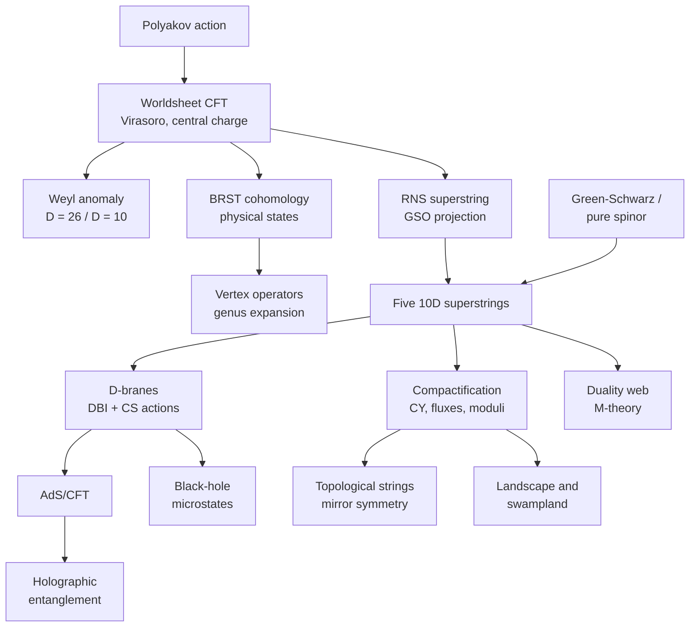
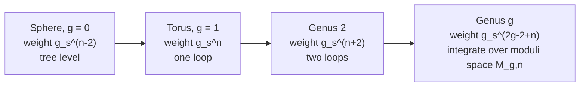
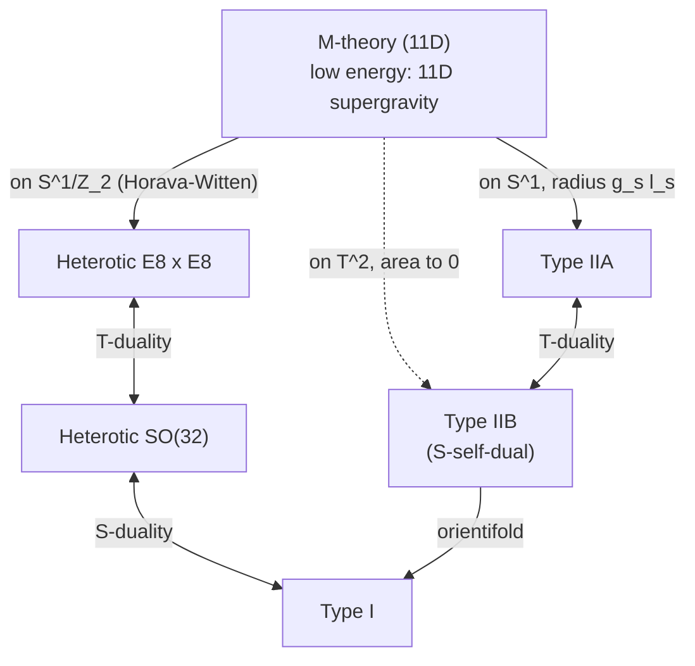
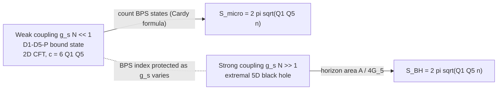

<!-- Custom styles for string theory visualizations -->
<link rel="stylesheet" href="{{ '/assets/css/physics-string-theory.css' | relative_url }}">

[String Theory](./) &raquo; Graduate Formalism

This page is a compact, graduate-level reference for the formal machinery of string theory. It assumes quantum field theory, Lie groups, and basic differential geometry. It covers the **worldsheet conformal field theory** and its quantization (covariant, light-cone, and BRST), the **RNS** and **Green-Schwarz** superstrings, **D-branes** and their effective actions, **Calabi-Yau** and **flux compactification**, the **duality web** and **M-theory**, the **AdS/CFT** dictionary, **black-hole microstate counting**, **topological strings**, **modern amplitude methods**, holographic entanglement, and the **swampland** program. Conventions follow Polchinski: mostly-plus metric, $\alpha' = \ell_s^2$, and closed-string oscillators $\alpha_n, \tilde\alpha_n$. The narrative treatment of the same material lives on the sibling pages linked at the foot.

The logical dependencies of the sections below:



## Worldsheet Conformal Field Theory

A string sweeps out a two-dimensional **worldsheet** $\Sigma$, embedded in $D$-dimensional spacetime by the maps $X^{\mu}(\sigma^0,\sigma^1)$. After gauge fixing, quantizing the string is exactly the problem of a two-dimensional **conformal field theory** on $\Sigma$: the spectrum, interactions, and consistency conditions of the string are all properties of this CFT.

### Polyakov Action and Its Symmetries

The **Polyakov action** introduces an independent worldsheet metric $h_{ab}$:

$$S_P = -\frac{1}{4\pi\alpha'} \int d^2\sigma \, \sqrt{-h} \, h^{ab} \partial_a X^{\mu} \partial_b X^{\nu} G_{\mu\nu}(X)$$

Here $\alpha' = \ell_s^2$ is the **Regge slope**, related to the string tension by $T = 1/(2\pi\alpha')$, and $G_{\mu\nu}$ is the spacetime metric. Eliminating $h_{ab}$ through its equation of motion, $T_{ab}=0$, recovers the Nambu-Goto area action. The action has three symmetries:

| Symmetry | Transformation | Type |
|---|---|---|
| Spacetime Poincaré (flat $G_{\mu\nu}=\eta_{\mu\nu}$) | $X^\mu \to \Lambda^\mu{}_\nu X^\nu + a^\mu$ | Global (worldsheet view) |
| Worldsheet diffeomorphisms | $\sigma^a \to \sigma'^a(\sigma)$ | Local |
| Weyl rescaling | $h_{ab}\to e^{2\omega(\sigma)}h_{ab}$ | Local |

Diffeomorphisms and Weyl rescalings together have three gauge parameters, matching the three components of the symmetric $h_{ab}$, so the metric is locally pure gauge. **Conformal gauge** sets $h_{ab} = e^{2\omega}\eta_{ab}$. After a Wick rotation, and in complex coordinates $z = e^{\tau_E - i\sigma^1}$ that map the Euclidean cylinder to the plane, the action for flat target space becomes

$$S = \frac{1}{2\pi\alpha'} \int d^2z \, \partial X^{\mu}\,\bar{\partial}X_{\mu}, \qquad d^2z = 2\,d\sigma^1 d\sigma^2,$$

with $\partial \equiv \partial_z$ and $\bar{\partial} \equiv \partial_{\bar z}$. The equation of motion $\partial\bar{\partial}X^{\mu}=0$ splits each field into independent **holomorphic** (left-moving) and **antiholomorphic** (right-moving) parts. Conformal gauge leaves a residual symmetry, the infinite-dimensional group of conformal transformations $z \to f(z)$. That symmetry is what makes the worldsheet theory a CFT.

### Mode Expansion and the OPE

For the closed string,

$$X^{\mu}(z,\bar{z}) = x^{\mu} - \frac{i\alpha'}{2} p^{\mu} \ln|z|^2 + i\sqrt{\frac{\alpha'}{2}} \sum_{n\neq 0} \frac{1}{n}\left(\alpha^{\mu}_n z^{-n} + \tilde{\alpha}^{\mu}_n \bar{z}^{-n}\right),$$

and canonical quantization gives

$$[\alpha^{\mu}_m, \alpha^{\nu}_n] = m\,\delta_{m+n,0}\,\eta^{\mu\nu}, \qquad [\tilde{\alpha}^{\mu}_m, \tilde{\alpha}^{\nu}_n] = m\,\delta_{m+n,0}\,\eta^{\mu\nu}, \qquad [x^{\mu},p^{\nu}]=i\eta^{\mu\nu}.$$

Because $\eta^{00}=-1$, timelike oscillators $\alpha^0_{-n}$ create **negative-norm states**. Removing them is the job of the gauge constraints, imposed in one of the three ways described below. The basic **operator product expansion** of the free boson is

$$X^{\mu}(z,\bar{z})\,X^{\nu}(0,0) \sim -\frac{\alpha'}{2}\eta^{\mu\nu}\ln|z|^2,$$

and every free-field correlator follows from it by Wick contraction.

### Stress Tensor and the Virasoro Algebra

The holomorphic **stress tensor** and its modes are

$$T(z) = -\frac{1}{\alpha'}:\partial X^{\mu}\partial X_{\mu}:, \qquad T(z) = \sum_n \frac{L_n}{z^{n+2}}, \qquad L_n = \frac{1}{2}\sum_m :\alpha_{n-m}\cdot\alpha_m:,$$

with $\alpha^\mu_0 = \sqrt{\alpha'/2}\,p^\mu$. The $TT$ OPE defines the **central charge** $c$:

$$T(z)\,T(w) \sim \frac{c/2}{(z-w)^4} + \frac{2T(w)}{(z-w)^2} + \frac{\partial T(w)}{z-w},$$

which is equivalent to the **Virasoro algebra**

$$[L_m, L_n] = (m-n)L_{m+n} + \frac{c}{12} m(m^2-1)\delta_{m+n,0}.$$

Each free boson contributes $c=1$, so $D$ bosons give $c = D$. A **primary field** of weight $(h,\tilde h)$ satisfies

$$T(z)\,\mathcal{O}(w,\bar w) \sim \frac{h\,\mathcal{O}(w,\bar w)}{(z-w)^2} + \frac{\partial\mathcal{O}(w,\bar w)}{z-w}.$$

$L_0 + \tilde L_0$ generates dilations, which play the role of the worldsheet Hamiltonian in radial quantization, and $L_0 - \tilde L_0$ generates rotations. Invariance under $\sigma^1\to\sigma^1+2\pi$ imposes **level matching**, $L_0 = \tilde L_0$, on physical closed-string states.

### Critical Dimension and the Weyl Anomaly

Weyl invariance is a gauge symmetry, so it has to survive quantization. If it does not, the conformal factor $\omega$ becomes dynamical and the theory is inconsistent. In a curved worldsheet metric the quantum trace of the stress tensor is

$$T^a{}_a = -\frac{c_{\text{tot}}}{12}R^{(2)},$$

where $R^{(2)}$ is the worldsheet Ricci scalar and $c_{\text{tot}} = c_{\text{matter}} + c_{\text{gh}}$. The reparametrization ghosts contribute $c_{\text{gh}}=-26$ (see [BRST Quantization](#brst-quantization)), so the anomaly cancels only when

$$c_{\text{matter}} = 26 \quad\Longrightarrow\quad D = 26 \quad(\text{bosonic string}).$$

**Light-cone gauge** gives the same answer another way. Only the $D-2$ transverse oscillators remain, and the normal-ordering constant is a zeta-regularized zero-point energy:

$$a = -\frac{D-2}{2}\sum_{n=1}^{\infty} n = -\frac{D-2}{2}\,\zeta(-1) = \frac{D-2}{24}.$$

Closure of the Lorentz algebra, specifically $[J^{i-},J^{j-}]=0$, requires $a=1$ and hence $D=26$. The resulting mass formulas are

$$\text{open:}\quad \alpha' M^2 = N - 1, \qquad \text{closed:}\quad \alpha' M^2 = 2\left(N + \tilde N - 2\right) = 4(N-1), \quad N = \tilde N,$$

with $N = \sum_{n>0}\alpha_{-n}\cdot\alpha_n$. The ground state has $M^2<0$: this is the bosonic-string **tachyon**, a sign that the perturbative vacuum is unstable. At the first excited level the open string gives a massless vector with $D-2 = 24$ transverse polarizations, and the closed string gives the massless $g_{\mu\nu}$, $B_{\mu\nu}$, and $\Phi$.

More generally, in a curved background the Weyl anomaly becomes a set of **beta functions** for the spacetime fields. At leading order in $\alpha'$,

$$\beta^G_{\mu\nu} = \alpha' R_{\mu\nu} + 2\alpha'\nabla_\mu\nabla_\nu\Phi - \frac{\alpha'}{4}H_{\mu\lambda\omega}H_\nu{}^{\lambda\omega} + O(\alpha'^2),$$

together with analogous equations for $B$ and $\Phi$. Setting all of them to zero reproduces the equations of motion of $D$-dimensional supergravity: **Einstein's equations follow from worldsheet conformal invariance**.

### Vertex Operators and the Genus Expansion

The **state-operator correspondence** of radial quantization maps each asymptotic string state to a local operator on $\Sigma$. Emitting or absorbing a string corresponds to integrating a **vertex operator** of weight $(1,1)$, which makes the integral Weyl-invariant.

The **tachyon** vertex operator is

$$V_T = g_s \int d^2z \, :e^{ik\cdot X}:, \qquad \alpha' k^2 = 4,$$

and $e^{ik\cdot X}$ has weight $(\alpha'k^2/4,\ \alpha'k^2/4)$. The massless closed-string states come from

$$V = \frac{2 g_s}{\alpha'}\,\zeta_{\mu\nu} \int d^2z \, :\partial X^{\mu}\,\bar{\partial}X^{\nu}\,e^{ik\cdot X}:, \qquad k^2 = 0, \quad k^{\mu}\zeta_{\mu\nu}=k^{\nu}\zeta_{\mu\nu}=0.$$

The symmetric traceless part of $\zeta_{\mu\nu}$ is the graviton, the antisymmetric part is the Kalb-Ramond field $B_{\mu\nu}$, and the trace is the dilaton $\Phi$. In the superstring, the zero-picture vertex operator adds fermion bilinears, schematically

$$V^{(0,0)} \propto \zeta_{\mu\nu} \int d^2z \, :\left(i\partial X^{\mu} + \frac{\alpha'}{2}\,k\cdot\psi\,\psi^{\mu}\right)\left(i\bar\partial X^{\nu} + \frac{\alpha'}{2}\,k\cdot\tilde\psi\,\tilde\psi^{\nu}\right)e^{ik\cdot X}:.$$

On the sphere, three vertex operators are fixed to absorb the volume of the conformal Killing group $SL(2,\mathbb{C})$, and the remaining $n-3$ are integrated:

$$A_n \sim g_s^{n-2}\int \prod_{i=4}^{n} d^2z_i \, \big\langle\, c\tilde c V_1(z_1)\;c\tilde c V_2(z_2)\;c\tilde c V_3(z_3)\prod_{i\ge 4} V_i(z_i)\,\big\rangle_{S^2}.$$

Because the Euler characteristic of a genus-$g$ surface is $\chi = 2-2g$, the full perturbative S-matrix is a sum over topologies weighted by $g_s^{-\chi}$:



Each topology contributes exactly one term, with no separate diagrams to sum. The ultraviolet region of field-theory loop integrals is excluded by **modular invariance**. On the torus, the modular parameter $\tau$ is integrated over the fundamental domain $\mathcal{F}$ of $SL(2,\mathbb{Z})$ instead of the full upper half-plane:

$$Z_{T^2} \propto V_{26}\int_{\mathcal{F}} \frac{d^2\tau}{\tau_2^{2}}\;\tau_2^{-12}\,\big|\eta(\tau)\big|^{-48},$$

where $\eta$ is the Dedekind eta function. For the bosonic string this integral diverges because of the tachyon. For the type-II superstring it vanishes identically, as described in [Spectrum and Spacetime Supersymmetry](#spectrum-and-spacetime-supersymmetry).

### BRST Quantization

Covariant quantization with manifest Lorentz invariance uses the **Faddeev-Popov** procedure, which introduces anticommuting **ghosts** $(b,c)$ of weights $(2,-1)$:

$$b(z)\,c(w) \sim \frac{1}{z-w}, \qquad T_{\text{gh}} = -2\,b\,\partial c - (\partial b)\,c, \qquad c_{\text{gh}} = -26.$$

The **BRST current** and charge are

$$j_B = c\,T_{\text{m}} + \,:b\,c\,\partial c: + \frac{3}{2}\partial^2 c, \qquad Q_B = \oint \frac{dz}{2\pi i}\,j_B,$$

with an antiholomorphic copy for the closed string. **Nilpotency** $Q_B^2=0$ holds if and only if $c_{\text{m}}=26$, which is the critical-dimension condition in cohomological form. Physical states are the **BRST cohomology**:

$$Q_B\lvert\psi\rangle = 0, \qquad \lvert\psi\rangle \sim \lvert\psi\rangle + Q_B\lvert\chi\rangle.$$

For the closed string one also imposes $b_0^- \lvert\psi\rangle = L_0^-\lvert\psi\rangle = 0$, where $b_0^- = b_0-\tilde b_0$ and $L_0^- = L_0 - \tilde L_0$; this is where level matching enters. The **no-ghost theorem** states that the cohomology at the appropriate ghost number has a positive-definite inner product and is isomorphic to the light-cone Hilbert space. Unintegrated vertex operators have the form $c\tilde c\,V$ with $V$ a weight-$(1,1)$ matter primary. At higher genus, $b$-ghost insertions contracted with Beltrami differentials supply the measure on moduli space. The same structure extended off-shell underlies **string field theory**, whose Batalin-Vilkovisky formulation (Zwiebach; Sen and Zwiebach) has been used since the late 2010s to settle subtle issues in the D-instanton and unitarity analysis of perturbative string amplitudes.

The three quantization schemes compared:

| Scheme | Manifest Lorentz? | Ghosts? | How negative norms are removed | Best for |
|---|---|---|---|---|
| Old covariant (OCQ) | Yes | No | Virasoro constraints $L_{n>0}\lvert\psi\rangle=0$, $(L_0-1)\lvert\psi\rangle=0$ | Historical; quick spectrum checks |
| Light-cone gauge | No | No | Solve constraints; keep only $D-2$ transverse oscillators | Spectrum, critical dimension, GS superstring |
| BRST | Yes | $b,c$ (and $\beta,\gamma$) | $Q_B$ cohomology | Amplitudes, string field theory, curved backgrounds |

## Superstring Theory: RNS Formalism

The bosonic string has a tachyon and no spacetime fermions. Both problems are fixed by **worldsheet supersymmetry**, which pairs each $X^{\mu}$ with a Majorana fermion $\psi^{\mu}$. The **Ramond-Neveu-Schwarz (RNS)** formalism makes worldsheet supersymmetry manifest. Spacetime supersymmetry only appears after the **GSO projection**.

### Worldsheet Supersymmetry

In superconformal gauge the RNS action is

$$S = \frac{1}{4\pi\alpha'} \int d^2\sigma \left(\partial_{\alpha}X^{\mu}\partial^{\alpha}X_{\mu} - i\,\bar\psi^{\mu}\rho^{\alpha}\partial_{\alpha}\psi_{\mu}\right),$$

with two-dimensional Dirac matrices $\{\rho^{\alpha},\rho^{\beta}\}=2\eta^{\alpha\beta}$. It is invariant under

$$\delta X^{\mu} = \bar\epsilon\,\psi^{\mu}, \qquad \delta\psi^{\mu} = -i\,\rho^{\alpha}\partial_{\alpha}X^{\mu}\,\epsilon.$$

Besides $T(z)$, the theory has a fermionic **supercurrent**

$$G(z) = i\sqrt{\frac{2}{\alpha'}}\,\psi^{\mu}\partial X_{\mu} = \sum_r \frac{G_r}{z^{r+3/2}},$$

and together they generate the $\mathcal{N}=1$ **superconformal algebra**:

$$[L_m, G_r] = \left(\frac{m}{2} - r\right)G_{m+r}, \qquad \{G_r, G_s\} = 2L_{r+s} + \frac{c}{12}\left(4r^2 - 1\right)\delta_{r+s,0},$$

plus the Virasoro algebra for the $L_m$. Each $(X,\psi)$ pair contributes $c = 1 + \tfrac{1}{2} = \tfrac{3}{2}$, so $c_{\text{m}} = \tfrac{3D}{2}$. The superconformal ghosts $(b,c)$ and $(\beta,\gamma)$ contribute $c_{\text{gh}} = -26 + 11 = -15$, and anomaly cancellation, $\tfrac{3D}{2}=15$, gives the **superstring critical dimension**

$$D = 10.$$

### NS and R Sectors

The worldsheet fermions can be periodic or antiperiodic around the closed string. This gives two **sectors**:

| Sector | Boundary condition | Modes | Ground state | Normal-ordering constant (open string) |
|---|---|---|---|---|
| Neveu-Schwarz (NS) | $\psi^{\mu}(\sigma+2\pi)=-\psi^{\mu}(\sigma)$ | $\psi_r,\ r\in\mathbb{Z}+\tfrac{1}{2}$ | Spacetime scalar (tachyonic) | $a_{\text{NS}} = \tfrac{1}{2}$ |
| Ramond (R) | $\psi^{\mu}(\sigma+2\pi)=+\psi^{\mu}(\sigma)$ | $\psi_n,\ n\in\mathbb{Z}$ | Spacetime spinor | $a_{\text{R}} = 0$ |

In the R sector the zero modes satisfy $\{\psi^{\mu}_0,\psi^{\nu}_0\}=\eta^{\mu\nu}$. This is a $D$-dimensional **Clifford algebra**, so the ground state must be a spacetime spinor, and this is where spacetime fermions come from. The open-string mass formula is $\alpha' M^2 = N - a$. In the NS sector the ground state is a tachyon, and the first excited state $\psi^{\mu}_{-1/2}\lvert 0\rangle_{\text{NS}}$ is a massless vector.

### GSO Projection

Consistency (modular invariance of the one-loop amplitude, mutual locality of vertex operators, and absence of the tachyon) requires the **Gliozzi-Scherk-Olive projection** onto definite worldsheet fermion parity $(-1)^F$. In the NS sector,

$$F = \sum_{r>0} \psi_{-r}\cdot\psi_r,$$

and $(-1)^F$ is defined to be $-1$ on the NS ground state. Keeping the states with $(-1)^F = +1$ removes the tachyon and keeps $\psi^{\mu}_{-1/2}\lvert 0\rangle$. In the R sector $(-1)^F$ acts on the zero modes as the chirality operator $\Gamma_{11}=\Gamma^0\Gamma^1\cdots\Gamma^9$, so the projection picks one ten-dimensional chirality, $\mathbf{8_s}$ or $\mathbf{8_c}$ of the little group $SO(8)$. For the closed string, the left and right GSO projections can be chosen independently. Opposite R-sector chiralities give **type IIA** (non-chiral), and the same chirality gives **type IIB** (chiral). The massless sectors are:

| Sector | IIA content | IIB content |
|---|---|---|
| NS-NS | $g_{\mu\nu}$, $B_{\mu\nu}$, $\Phi$ | $g_{\mu\nu}$, $B_{\mu\nu}$, $\Phi$ |
| R-R | $C_1$, $C_3$ | $C_0$, $C_2$, $C_4$ (self-dual $F_5$) |
| NS-R, R-NS | Two gravitini and dilatini, opposite chirality | Two gravitini and dilatini, same chirality |

### Spectrum and Spacetime Supersymmetry

After the GSO projection, the NS and R sectors contain equal numbers of bosonic and fermionic states at every mass level, so the spectrum is spacetime supersymmetric. In partition-function language this is Jacobi's *abstruse identity*,

$$\vartheta_3(0|\tau)^4 - \vartheta_4(0|\tau)^4 - \vartheta_2(0|\tau)^4 = 0,$$

which makes the one-loop vacuum amplitude and cosmological constant of the type-II strings vanish.

### The Five Superstring Theories

The five consistent ten-dimensional theories with spacetime supersymmetry:

| Theory | Supersymmetry | Chiral? | Gauge group | Open strings? | Construction |
|---|---|---|---|---|---|
| Type IIA | $\mathcal{N}=(1,1)$, 32 supercharges | No | None perturbatively ($U(1)$ from $C_1$) | Only on D-branes | Opposite-chirality GSO |
| Type IIB | $\mathcal{N}=(2,0)$, 32 supercharges | Yes | None perturbatively | Only on D-branes | Same-chirality GSO |
| Type I | $\mathcal{N}=1$, 16 supercharges | Yes | $SO(32)$ | Yes (unoriented) | Orientifold of IIB with 32 D9-branes (tadpole cancellation) |
| Heterotic $SO(32)$ | $\mathcal{N}=1$, 16 supercharges | Yes | $Spin(32)/\mathbb{Z}_2$ | No | Left: 26D bosonic; right: 10D superstring |
| Heterotic $E_8\times E_8$ | $\mathcal{N}=1$, 16 supercharges | Yes | $E_8\times E_8$ | No | As above, different 16D even self-dual lattice |

The heterotic strings are not projections of type II. They glue a left-moving bosonic string, with its extra 16 dimensions compactified on an even self-dual lattice, to a right-moving superstring. The two allowed lattices, $\Gamma_{16}$ and $\Gamma_8\oplus\Gamma_8$, give the two gauge groups. Green and Schwarz (1984) showed that the gravitational and gauge anomalies of the chiral $\mathcal{N}=1$ theories cancel only for $SO(32)$ or $E_8\times E_8$.

## Green-Schwarz and Pure-Spinor Formalisms

In the RNS formalism spacetime supersymmetry only appears after the GSO projection, and Ramond-sector amplitudes need spin fields and picture-changing. The **Green-Schwarz (GS)** formalism makes spacetime supersymmetry manifest from the start by promoting the superspace Grassmann coordinates $\theta^A$ ($A=1,2$) to worldsheet fields.

The GS action is

$$S = -\frac{1}{4\pi\alpha'} \int d^2\sigma \left[\sqrt{-h}\, h^{ab}\,\Pi_a\cdot\Pi_{b} - 2i\,\varepsilon^{ab}\,\partial_a X^{\mu}\left(\bar\theta^1\Gamma_{\mu}\partial_b\theta^1 - \bar\theta^2\Gamma_{\mu}\partial_b\theta^2\right) + \cdots\right], \qquad \Pi_a^{\mu} = \partial_a X^{\mu} - i\,\bar\theta^A\Gamma^{\mu}\partial_a\theta^A.$$

The Wess-Zumino term is supersymmetric only if a Fierz identity holds, which restricts the classical theory to $D\in\{3,4,6,10\}$. Only $D=10$ survives quantization. A local fermionic **kappa symmetry** removes half the components of $\theta^A$. In light-cone gauge the theory becomes free, with 8 transverse bosons $X^i$ in the $\mathbf{8_v}$ of $SO(8)$ and 8 transverse spinors $S^a$ in the $\mathbf{8_s}$, so both spacetime supersymmetry and the absence of a tachyon are manifest. The cost is that covariant quantization of kappa symmetry is not possible in any straightforward way.

Berkovits's **pure-spinor formalism** (2000) addresses this. It replaces kappa symmetry with the BRST operator

$$Q = \oint \lambda^{\alpha} d_{\alpha}, \qquad \lambda\,\Gamma^{\mu}\lambda = 0,$$

where $\lambda^\alpha$ is a bosonic ghost constrained to be a pure spinor. The formalism keeps both super-Poincaré covariance and a free-field worldsheet, and it has produced multi-loop amplitudes, such as low-energy two- and three-loop terms, that are much harder to obtain in RNS.

## D-Brane Physics

A **Dp-brane** is a $(p+1)$-dimensional hypersurface on which open strings can end. It is two things at once: a solitonic supergravity solution carrying **Ramond-Ramond charge**, and a dynamical object with a gauge theory on its worldvolume.

### Boundary Conditions and T-Duality

Open-string endpoints obey **Neumann** conditions along the brane and **Dirichlet** conditions transverse to it:

$$\text{Neumann:}\quad \partial_n X^{\mu}\big|_{\partial\Sigma} = 0 \ \ (\mu \parallel \text{brane}), \qquad \text{Dirichlet:}\quad \partial_t X^{\mu}\big|_{\partial\Sigma} = 0 \ \ (\mu \perp \text{brane}).$$

**T-duality** on a circle acts as $X = X_L + X_R \to X' = X_L - X_R$, which swaps Neumann and Dirichlet conditions. T-dualizing along a direction the brane wraps turns a Dp-brane into a D$(p-1)$-brane, and T-dualizing along a transverse direction turns it into a D$(p+1)$-brane. D-branes are therefore unavoidable once T-duality is taken seriously. Since type IIA has stable D-branes with even $p$ and type IIB has them with odd $p$, T-duality maps the two theories into each other.

### Effective Actions

At low energy the dynamics of a single Dp-brane is governed by the **Dirac-Born-Infeld** action plus a topological **Chern-Simons** (Wess-Zumino) coupling:

$$S_{\text{DBI}} = -\mu_p \int d^{p+1}\xi \, e^{-\Phi}\sqrt{-\det\left(g_{ab} + B_{ab} + 2\pi\alpha' F_{ab}\right)},$$

$$S_{\text{CS}} = \mu_p \int_{\text{worldvolume}} \sum_q C_q \wedge e^{\,B + 2\pi\alpha' F} \wedge \sqrt{\frac{\hat{A}(R_T)}{\hat{A}(R_N)}}.$$

Here $g_{ab}$ and $B_{ab}$ are pullbacks of the spacetime fields, $F_{ab}$ is the worldvolume $U(1)$ field strength, and $\hat A$ is the A-roof genus of the tangent ($T$) and normal ($N$) bundles. The CS term is a formal sum; only the $(p+1)$-form part is integrated. Its leading piece, $\mu_p\int C_{p+1}$, shows that the brane is an electric source for $C_{p+1}$. Expanding the DBI action gives Maxwell theory plus higher-order corrections:

$$S_{\text{DBI}} = -\frac{\mu_p}{g_s}\int d^{p+1}\xi \left[1 + \frac{(2\pi\alpha')^2}{4} F_{ab}F^{ab} + O(F^4)\right].$$

The same $\mu_p$ appears in both terms, which is the **BPS** condition that tension equals charge. With the dilaton vacuum value $e^{\Phi_0}=g_s$ pulled out, the physical tension is

$$T_p = \frac{\mu_p}{g_s}, \qquad \mu_p = \frac{1}{(2\pi)^p\,\alpha'^{(p+1)/2}}.$$

The $1/g_s$ in $T_p$ is the signature of a non-perturbative object. D-branes are heavier than fundamental strings, whose tension carries no power of $g_s$, and lighter than NS5-branes and ordinary solitons, which scale as $1/g_s^2$.

### Gauge Theory on Branes and Tachyon Condensation

On a stack of $N$ coincident Dp-branes, **Chan-Paton** labels at the open-string endpoints organize the massless vectors into the adjoint of $U(N)$. The worldvolume theory is $(p+1)$-dimensional **maximally supersymmetric $U(N)$ Yang-Mills**, the dimensional reduction of 10D $\mathcal{N}=1$ SYM. The transverse positions become adjoint scalars $\Phi^i$. Separating the branes gives these scalars vacuum values and Higgses $U(N)\to U(1)^N$; the W-bosons are strings stretched between branes, with mass equal to tension times length. Non-commuting $[\Phi^i,\Phi^j]\neq 0$ describes bound states and Myers's dielectric effect.

A coincident **brane-antibrane** pair carries an open-string **tachyon** $T$. **Sen's conjectures** say that at the minimum of the tachyon potential, the energy of the minimum exactly cancels the pair's tension, and that topological defects of $T$ are lower-dimensional stable branes. Numerical and analytic open string field theory work confirmed the conjectures; Schnabl's 2005 analytic solution is the landmark result. As a consequence, D-brane charges are classified by **K-theory** $K(X)$ of spacetime rather than by ordinary cohomology.

## Compactification

Connecting the ten-dimensional superstring to four-dimensional physics requires compactifying six dimensions on a small internal manifold $M_6$. The geometry and topology of $M_6$, along with any fluxes and branes, set the 4D gauge group, matter content, and couplings. String **phenomenology** is the search for choices of $M_6$ that reproduce the Standard Model and cosmology.

### Calabi-Yau Manifolds

Preserving 4D $\mathcal{N}=1$ supersymmetry in the heterotic string, or $\mathcal{N}=2$ in type II, requires a covariantly constant spinor on $M_6$. That forces **$SU(3)$ holonomy**, which defines a **Calabi-Yau threefold**. Equivalently, $M_6$ is a compact Kähler manifold with vanishing first Chern class. By Yau's theorem such a manifold admits a unique Ricci-flat Kähler metric in each Kähler class:

$$c_1(M) = 0 \quad\Longleftrightarrow\quad \exists\ \text{Ricci-flat Kahler metric},\quad R_{i\bar j} = 0.$$

It also carries a nowhere-vanishing holomorphic $(3,0)$-form $\Omega$. Its topology is fixed by the **Hodge diamond**. For a CY threefold the only independent Hodge numbers are

$$h^{1,1} = \text{number of Kahler moduli}, \qquad h^{2,1} = \text{number of complex-structure moduli}, \qquad \chi = 2\left(h^{1,1}-h^{2,1}\right).$$

In the simplest heterotic compactification (the standard embedding), the net number of chiral generations is $\tfrac{1}{2}|\chi|$. **Mirror symmetry** pairs CY manifolds $X$ and $Y$ with $h^{1,1}(X)=h^{2,1}(Y)$ and $h^{2,1}(X)=h^{1,1}(Y)$, and type IIA on $X$ is equivalent to type IIB on $Y$. The Kreuzer-Skarke list of 473,800,776 four-dimensional reflexive polytopes, whose toric hypersurfaces give CY threefolds, is the standard dataset for systematic scans.

### Flux Compactification and Moduli Stabilization

The massless moduli are the Kähler moduli $T^i$, the complex-structure moduli $U^a$, and the axio-dilaton $\tau$. They are flat directions of the potential. If left unfixed they would mediate unobserved fifth forces and leave couplings undetermined. **Flux compactifications** of type IIB, and their F-theory generalization, lift many of them. Quantized three-form fluxes $F_3$ and $H_3$ produce the **Gukov-Vafa-Witten superpotential**

$$W = \int_M G_3 \wedge \Omega, \qquad G_3 = F_3 - \tau H_3, \qquad \tau = C_0 + i e^{-\Phi},$$

and the F-term conditions $D_a W = \partial_a W + (\partial_a K)\,W = 0$ fix the complex-structure moduli and the dilaton. The fluxes contribute D3-brane charge, which the tadpole condition must balance against O-planes and D7-branes. Two approaches then stabilize the Kähler moduli:

| Scenario | Ingredients | Resulting vacuum |
|---|---|---|
| **KKLT** (2003) | Small flux superpotential $W_0$ plus non-perturbative term, $W = W_0 + A e^{-aT}$, then an anti-D3 uplift | Supersymmetric AdS, uplifted to metastable de Sitter |
| **Large Volume Scenario** (2005) | $\alpha'^3$ correction to $K$ balanced against non-perturbative terms | Non-supersymmetric AdS at exponentially large volume, then uplift |

Each consistent choice of flux gives a vacuum, and the number of choices is enormous: $\sim 10^{500}$ is the classic type-IIB estimate, and F-theory counts reach far higher. This collection of vacua is the string **landscape**. Whether controlled metastable de Sitter vacua exist at all is one of the central open questions. Explicit supersymmetric AdS vacua with exponentially small $W_0$ were built from Kreuzer-Skarke Calabi-Yaus by Demirtas, Kim, McAllister, Moritz, and Rios-Tascon (2020-2021), and candidate KKLT de Sitter vacua with all ingredients computed explicitly were presented by McAllister, Moritz, Nally, and Schachner (2024). The robustness of these constructions against $\alpha'$ and $g_s$ corrections is still being debated.

## M-Theory and the Duality Web

The five ten-dimensional superstring theories are different limits of a single underlying theory. Dualities connect them, and eleven-dimensional **M-theory** unifies them.



### M-Theory and 11D Supergravity

As the type IIA coupling grows, an **eleventh dimension** opens up with radius $R_{11} = g_s\ell_s$. At low energies the dynamics is the unique **eleven-dimensional supergravity**:

$$S_{11} = \frac{1}{2\kappa_{11}^2}\int d^{11}x\,\sqrt{-g}\left(R - \frac{1}{2}|F_4|^2\right) - \frac{1}{12\kappa_{11}^2}\int C_3\wedge F_4\wedge F_4, \qquad F_4 = dC_3.$$

The charged objects are the **M2-brane**, an electric source for $C_3$, and the **M5-brane**, a magnetic source whose worldvolume carries a self-dual three-form. Reducing on the M-theory circle gives the IIA spectrum:

| M-theory object | Wrapped on $S^1$? | Type IIA object |
|---|---|---|
| Momentum mode (KK) | along the circle | D0-brane |
| M2-brane | yes | Fundamental string F1 |
| M2-brane | no | D2-brane |
| M5-brane | yes | D4-brane |
| M5-brane | no | NS5-brane |
| KK monopole | circle is the Taub-NUT fiber | D6-brane |

### S-, T-, and U-Duality

- **T-duality** is perturbative. It relates compactification on a circle of radius $R$ to one of radius $\alpha'/R$ by exchanging momentum $n/R$ with winding $wR/\alpha'$. It maps IIA to IIB and the two heterotic strings to each other. On $T^d$ it extends to $O(d,d;\mathbb{Z})$.
- **S-duality** is non-perturbative and inverts the coupling, $g_s \to 1/g_s$. **Type IIB is self-dual**: the axio-dilaton transforms under $SL(2,\mathbb{Z})$ as $\tau\to(a\tau+b)/(c\tau+d)$, and the doublet $(F1, D1)$ rotates into $(p,q)$-strings. Type I is S-dual to heterotic $SO(32)$.
- **U-duality** is the discrete group generated by S and T together. For example, it is $E_{7(7)}(\mathbb{Z})$ for type II on $T^6$ and $E_{d(d)}(\mathbb{Z})$ for M-theory on $T^d$.

Geometrizing the IIB $SL(2,\mathbb{Z})$ as the modular group of an auxiliary torus leads to **F-theory**, in which the axio-dilaton varies over the base of an elliptically fibered Calabi-Yau. F-theory is the most flexible framework for non-perturbative model building.

## AdS/CFT Correspondence

The **anti-de Sitter / conformal field theory** correspondence is a precise, non-perturbative equivalence between quantum gravity in asymptotically AdS spacetime and an ordinary quantum field theory without gravity on its conformal boundary. It is the sharpest realization of **holography**.

### The Canonical Duality and Dictionary

Maldacena's original example (1997) comes from the near-horizon limit of $N$ D3-branes:

$$\text{Type IIB on } AdS_5\times S^5 \;\;\longleftrightarrow\;\; \mathcal{N}=4 \ SU(N) \text{ super Yang-Mills in 4D}.$$

The parameters match as

$$g_{\text{YM}}^2 = 4\pi g_s, \qquad \lambda \equiv g_{\text{YM}}^2 N = \frac{L^4}{\alpha'^2}, \qquad \frac{L^4}{\ell_{P}^4} \propto N,$$

where $L$ is the common radius of $AdS_5$ and $S^5$. Classical supergravity is valid when $N\to\infty$ (so $g_s\to0$ at fixed $\lambda$) and $\lambda\gg1$ (so $L\gg\ell_s$). Perturbative gauge theory needs $\lambda\ll1$. The duality is therefore **strong-weak**: each side is computable where the other is not.

| Bulk (gravity) | Boundary (CFT) |
|---|---|
| Field $\phi$ with mass $m$ | Operator $\mathcal{O}$ with dimension $\Delta$, where $\Delta(\Delta-d) = m^2L^2$ |
| Boundary value $\phi_0$ of $\phi$ | Source for $\mathcal{O}$ |
| Gauge field $A_\mu$ | Conserved global current $J^\mu$ |
| Metric $g_{\mu\nu}$ | Stress tensor $T^{\mu\nu}$ |
| Radial direction | Renormalization-group scale |
| Black hole | Thermal state |
| IR divergences near the boundary | UV divergences (holographic renormalization) |
| $1/N$ corrections | String loops $g_s$ |
| $1/\sqrt\lambda$ corrections | $\alpha'$ corrections |

The **GKP-Witten prescription** identifies the bulk partition function, with boundary condition $\phi\to\phi_0$, with the CFT generating functional:

$$Z_{\text{bulk}}\big[\phi\to\phi_0\big] = \left\langle\, \exp\int_{\partial} d^dx\,\phi_0\,\mathcal{O}\,\right\rangle_{\text{CFT}}.$$

In the classical limit $Z_{\text{bulk}}\approx e^{-S_{\text{on-shell}}}$ (Euclidean), so connected correlators are functional derivatives of the renormalized on-shell action:

$$\langle \mathcal{O}(x_1)\cdots\mathcal{O}(x_n)\rangle_{\text{conn}} = -\frac{\delta^n S^{\text{ren}}_{\text{on-shell}}[\phi_0]}{\delta\phi_0(x_1)\cdots\delta\phi_0(x_n)}\bigg|_{\phi_0=0}.$$

Planar $\mathcal{N}=4$ SYM is **integrable**. Anomalous dimensions at any $\lambda$ follow from the quantum spectral curve, and they interpolate smoothly between weak-coupling perturbation theory and the strong-coupling string spectrum. This is one of the strongest quantitative checks of the correspondence.

### Generalizations

- **$AdS_4/CFT_3$:** M-theory on $AdS_4\times S^7/\mathbb{Z}_k$ is dual to the $\mathcal{N}=6$ $U(N)_k\times U(N)_{-k}$ Chern-Simons-matter theory **ABJM**. Its free energy scales as $N^{3/2}$, matching the M2-brane count.
- **$AdS_3/CFT_2$:** Type IIB on $AdS_3\times S^3\times M_4$ with $M_4 = T^4$ or $K3$ is dual to the D1-D5 CFT. The Brown-Henneaux central charge $c = 3L/(2G_3)$ and the Cardy formula reproduce black-hole entropy.
- **$AdS_2/CFT_1$:** Describes the near-horizon throats of extremal black holes. It connects to the **SYK** model and **JT gravity**, where the Schwarzian mode governs the low-temperature dynamics.
- **Non-conformal and applied holography:** Dp-branes with $p\neq3$, confining backgrounds (Klebanov-Strassler, Witten's thermal $AdS_5$), and holographic models of the quark-gluon plasma (for example the bound $\eta/s = 1/4\pi$), superconductors, and strange metals.
- **Flat-space and de Sitter holography:** Celestial and Carrollian holography for asymptotically flat spacetimes, and dS/CFT proposals, are active areas without an established top-down example.

## Black Holes and Microstate Counting

One of the main successes of the formalism is a **statistical** derivation of black-hole entropy. Counting the quantum microstates of a D-brane bound state reproduces the Bekenstein-Hawking area law exactly.

### The Strominger-Vafa Calculation

Strominger and Vafa (1996) studied type IIB on $K3\times S^1$. Callan and Maldacena gave the $T^4\times S^1$ version soon after. The setup has $Q_1$ D1-branes wrapping $S^1$, $Q_5$ D5-branes wrapping $K3\times S^1$ (or $T^4\times S^1$), and $n$ units of momentum along $S^1$. At large $g_s$ this configuration is a five-dimensional extremal **BPS black hole** with three charges. At small $g_s$ it is a bound state whose low-energy excitations form a 2D CFT with central charge $c = 6Q_1Q_5$. BPS states carry left-moving momentum $L_0 = n$, and Cardy's formula gives the degeneracy

$$S_{\text{micro}} = 2\pi\sqrt{\frac{c\,n}{6}} = 2\pi\sqrt{Q_1 Q_5 n}.$$

The black-hole horizon area gives

$$S_{\text{BH}} = \frac{A}{4G_5} = 2\pi\sqrt{Q_1 Q_5 n}.$$

The two agree exactly, including the factor of $1/4$. The count is valid at weak coupling and the geometry at strong coupling, and supersymmetric protection of the BPS index justifies comparing them. For 4D $\mathcal{N}=4$ and $\mathcal{N}=8$ black holes, exact degeneracy formulas built from Siegel modular forms also reproduce the subleading corrections, including the Wald-entropy corrections and the logarithmic terms computed by Sen.



### Attractor Mechanism

In extremal black holes of 4D $\mathcal{N}=2$ supergravity, the scalar moduli $z^i$ flow radially inward to fixed values at the horizon that depend only on the charges $(p,q)$, not on their asymptotic values. The near-horizon geometry is $AdS_2\times S^2$, and the attractor values extremize the black-hole potential

$$V_{\text{BH}} = |Z|^2 + g^{i\bar j}\,D_i Z\,\overline{D_j Z}, \qquad \partial_i V_{\text{BH}}\big|_{\text{horizon}} = 0,$$

where $Z(p,q;z)$ is the central charge. The entropy is $S = \pi\,|Z_*|^2/G_4$ evaluated at the attractor point. This explains why the entropy depends only on quantized charges, as a microstate count requires. The Ooguri-Strominger-Vafa conjecture, $Z_{\text{BH}} = |Z_{\text{top}}|^2$, connects the attractor mechanism to topological strings.

## Topological String Theory

**Topological strings** twist the worldsheet $\mathcal{N}=(2,2)$ superconformal algebra so that the path integral localizes on holomorphic or constant maps. They compute protected, BPS-type quantities exactly.

### A-Model and B-Model

| | A-model | B-model |
|---|---|---|
| Depends on | Kähler moduli $t$ | Complex-structure moduli |
| Localizes on | Holomorphic curves | Constant maps |
| Computes | Gromov-Witten invariants | Periods of $\Omega$ (variations of Hodge structure) |
| Target-space theory | Kähler gravity; Chern-Simons on branes | Kodaira-Spencer gravity; holomorphic CS |

The A-model free energy generates **Gromov-Witten invariants** $N_{g,\beta}$, which count holomorphic curves of genus $g$ in class $\beta$:

$$F_A(t) = \sum_{g\ge0}\sum_{\beta} N_{g,\beta}\,g_s^{2g-2}\,e^{-\beta\cdot t}.$$

**Mirror symmetry** equates the A-model on $X$ with the B-model on its mirror $Y$, $F_A(X) = F_B(Y)$. Hard curve counts on $X$ become period integrals on $Y$; this is how Candelas, de la Ossa, Green, and Parkes predicted the number of rational curves on the quintic threefold in 1991. Higher-genus free energies obey the **BCOV holomorphic anomaly equation**:

$$\bar\partial_{\bar i} F^{(g)} = \frac{1}{2}\,\bar{C}_{\bar i}^{\,jk}\left(D_j D_k F^{(g-1)} + \sum_{h=1}^{g-1} D_j F^{(h)}\,D_k F^{(g-h)}\right), \qquad g\ge2.$$

This fixes $F^{(g)}$ recursively up to a holomorphic ambiguity, which is determined by boundary conditions (gap conditions at conifold points, regularity at orbifold points). Physically, $F^{(g)}$ computes F-terms such as $R^2 F^{2g-2}$ in the 4D type-II effective action. The Gopakumar-Vafa formula rewrites $F_A$ in terms of integer **BPS invariants**. Large-$N$ Chern-Simons theory on $S^3$ is dual to the A-model on the resolved conifold, a result known as geometric transition.

## Amplitudes and Modern Methods

Modern reformulations reorganize both string and field-theory amplitudes into compact forms that go well beyond the direct evaluation of worldsheet correlators genus by genus.

### Scattering Equations and CHY

The **Cachazo-He-Yuan (CHY)** formalism writes tree-level $n$-point massless amplitudes as integrals over the moduli space of $n$ punctures on the sphere. The integrals localize on solutions of the **scattering equations**:

$$E_i \equiv \sum_{j\neq i} \frac{k_i\cdot k_j}{\sigma_i - \sigma_j} = 0, \qquad i = 1,\dots,n.$$

These have $(n-3)!$ solutions. The amplitude is a measure times two half-integrands,

$$A_n = \int d\mu_n \; I_L(\sigma)\,I_R(\sigma), \qquad d\mu_n = \frac{\prod_i d\sigma_i}{\text{vol}\,SL(2,\mathbb{C})}\prod_{i}{}'\,\delta\!\left(E_i\right),$$

and the choice of half-integrands selects the theory:

| $I_L$ | $I_R$ | Theory |
|---|---|---|
| Parke-Taylor (color) | Parke-Taylor (color) | Bi-adjoint scalar |
| Parke-Taylor | Reduced Pfaffian $\text{Pf}'\Psi$ | Yang-Mills |
| $\text{Pf}'\Psi$ | $\text{Pf}'\Psi$ | Einstein gravity (plus $B$, dilaton) |

The last row is the **double copy**, gravity $=$ (gauge theory)$^2$, which here appears as the tree-level form of Bern-Carrasco-Johansson color-kinematics duality. In string theory, the low-energy limit of the KLT relations gives the same statement.

### Ambitwistor Strings and Positive Geometry

The CHY formulas come from an actual worldsheet model, the **ambitwistor string** of Mason and Skinner:

$$S = \frac{1}{2\pi}\int_{\Sigma} \left(P_{\mu}\,\bar\partial X^{\mu} - \frac{e}{2}P^2\right).$$

This is a chiral theory, effectively at infinite tension, and its path integral localizes exactly on the scattering equations. Like ordinary strings it has anomalies. The type-II ambitwistor string is critical in $D=10$ and the bosonic one in $D=26$, even though the tree-level CHY formulas it produces hold in any dimension. Its loop extensions produce field-theory loop integrands supported on nodal Riemann spheres. Related constructions include Witten's **twistor string** for $\mathcal{N}=4$ SYM and **positive geometries**: the **amplituhedron** of Arkani-Hamed and Trnka, whose canonical form gives planar $\mathcal{N}=4$ SYM integrands, and the **associahedron** for bi-adjoint scalars. The 2023-2025 "surfaceology" program extends the positive-geometry approach to non-supersymmetric theories through curve integrals on surfaces.

## Holographic Entanglement and Complexity

AdS/CFT maps quantum-information quantities of the boundary theory to geometric quantities in the bulk. This set of ideas is at the center of current quantum-gravity research.

### Ryu-Takayanagi and Quantum Extremal Surfaces

The entanglement entropy of a boundary region $A$ equals the area of the minimal bulk surface $\gamma_A$ homologous to $A$ (Ryu-Takayanagi, 2006). The quantum-corrected version (FLM; Engelhardt-Wall) extremizes the **generalized entropy**:

$$S_A = \min\,\underset{\gamma_A}{\text{ext}}\left[\frac{\text{Area}(\gamma_A)}{4 G_N} + S_{\text{bulk}}(\Sigma_A)\right],$$

where $\gamma_A$ is the **quantum extremal surface** and $\Sigma_A$ the bulk region between it and $A$. This ties the emergence of the bulk to the **entanglement structure** of the boundary state, and underlies entanglement-wedge reconstruction and the interpretation of holography as a quantum error-correcting code. Applied to an evaporating black hole coupled to a bath (2019), the same formula produces **islands**: after the Page time the entanglement wedge of the radiation includes part of the interior. The resulting entropy follows the unitary **Page curve**, and replica-wormhole saddles explain the result from the gravitational path integral.

### Holographic Complexity

Two conjectures relate the **computational complexity** of the boundary state to bulk quantities:

$$\text{Complexity = Volume:}\quad \mathcal{C}_V = \frac{V(\Sigma_{\max})}{G_N\,\ell}, \qquad \text{Complexity = Action:}\quad \mathcal{C}_A = \frac{S_{\text{WdW}}}{\pi\hbar}.$$

Here $\Sigma_{\max}$ is a maximal-volume bulk slice, $\ell$ a length scale (typically $L$), and $S_{\text{WdW}}$ the action of the Wheeler-DeWitt patch. Both reproduce the linear growth of the Einstein-Rosen bridge at late times. The "complexity = anything" proposals (2021-2022) showed that a large class of geometric functionals share these properties, so the precise boundary dual is still open.

## The Swampland Program

The **swampland** is the set of low-energy effective field theories that look consistent but cannot be completed in quantum gravity. The program collects conjectured criteria that separate these from the landscape of genuine string vacua. The conjectures have very different levels of support:

| Conjecture | Statement (schematic, Planck units) | Status |
|---|---|---|
| No global symmetries | Exact global symmetries are forbidden | Proven in AdS/CFT (Harlow-Ooguri) |
| Completeness | Every gauge charge allowed by Dirac quantization is realized by some state | Strong evidence |
| Weak gravity (WGC) | Some state has $q/m \ge$ the extremal black-hole value, so extremal black holes can decay | Strong evidence; tower and sublattice versions |
| Distance | At infinite distance $d$ in moduli space a tower becomes light, $m \sim e^{-\alpha d}$ | Strong evidence; refined by the **emergent string conjecture** |
| Species scale | Gravity becomes strong at $\Lambda_{\text{sp}} \sim M_P/\sqrt{N_{\text{sp}}}$ when $N_{\text{sp}}$ light species exist | Widely used bound on EFT cutoffs |
| de Sitter | $\lvert\nabla V\rvert \ge c\,V$, or the refined $\min\nabla^2 V \le -c'\,V$ | Contested; conflicts with KKLT-type constructions |
| AdS distance | $m_{\text{tower}} \sim \lvert\Lambda\rvert^{\alpha}$ as $\Lambda\to0$ | Conjectural |

The de Sitter conjectures would rule out a true cosmological constant in favor of slowly rolling **quintessence**. That gives the program an observational target. In 2025 the DESI collaboration's second data release, combined with CMB and supernova data, showed a 2.8 to 4.2 sigma preference, depending on the supernova sample, for dark energy that evolves in time. This has renewed interest in string-motivated quintessence models, although the evidence is not yet decisive.

## Computational Tools

Most of the formalism above reduces to concrete computations: Kähler metrics from potentials, identities among modular forms, periods and Gromov-Witten invariants, and bulk equations of motion for holographic correlators. The snippet below checks two statements from this page symbolically and numerically.

```python
import sympy as sp
import mpmath as mp

# 1. Kahler metric g_{z zbar} = d_z d_zbar K from a Kahler potential.
#    For K = log(1 + |z|^2) this is the Fubini-Study metric on CP^1.
z, zb = sp.symbols("z zbar")
K = sp.log(1 + z * zb)
g = sp.simplify(sp.diff(K, z, zb))
print(g)  # 1/(z*zbar + 1)**2

# 2. Jacobi's abstruse identity: theta3^4 - theta4^4 - theta2^4 = 0,
#    the statement that the GSO-projected type-II one-loop amplitude vanishes.
mp.mp.dps = 30
q = mp.mpf("0.3")  # nome q = exp(i pi tau), |q| < 1
lhs = mp.jtheta(3, 0, q)**4 - mp.jtheta(4, 0, q)**4 - mp.jtheta(2, 0, q)**4
print(mp.nstr(lhs, 5))  # ~1e-30 (zero to working precision)
```

Research-grade tools include **CYTools**, which triangulates Kreuzer-Skarke polytopes and computes Calabi-Yau topology and intersection numbers and was used in the explicit flux-vacuum constructions above. Numerical Ricci-flat CY metrics are computed with Donaldson's balanced-metric algorithm or with neural-network approaches such as the **cymetric** package. Symbolic computation of periods and mirror maps uses Picard-Fuchs equations and GKZ systems. For more on the numerical side, see [Computational Physics](../computational-physics/).

## References and Further Reading

### Textbooks
1. **Polchinski**: *String Theory*, Vols. I-II (1998), the standard graduate reference, whose conventions this page follows.
2. **Green, Schwarz & Witten**: *Superstring Theory*, Vols. 1-2 (1987; 25th-anniversary edition 2012).
3. **Becker, Becker & Schwarz**: *String Theory and M-Theory: A Modern Introduction* (2007).
4. **Kiritsis**: *String Theory in a Nutshell* (2nd ed., 2019).
5. **Blumenhagen, Lüst & Theisen**: *Basic Concepts of String Theory* (2013).
6. **Tong**: *Lectures on String Theory* (arXiv:0908.0333), a free and concise introduction.

### Monographs
1. **Hori et al.**: *Mirror Symmetry* (Clay Mathematics Monographs, 2003).
2. **Ammon & Erdmenger**: *Gauge/Gravity Duality* (2015).
3. **Ibáñez & Uranga**: *String Theory and Particle Physics* (2012), on compactification and phenomenology.
4. **Nakahara**: *Geometry, Topology and Physics*, for the differential geometry.

### Reviews
1. **Aharony, Gubser, Maldacena, Ooguri & Oz**: *Large N field theories, string theory and gravity* (1999).
2. **Douglas & Kachru**: *Flux compactification* (2007).
3. **Harlow**: *TASI lectures on the emergence of bulk physics in AdS/CFT* (2018).
4. **Almheiri, Hartman, Maldacena, Shaghoulian & Tajdini**: *The entropy of Hawking radiation* (2021).
5. **Palti**: *The Swampland: Introduction and Review* (2019); **Agmon, Bedroya, Kang & Vafa**: *Lectures on the string landscape and the Swampland* (2022).
6. **Mizera**: *Aspects of scattering amplitudes and moduli space localization* (2019), on CHY and intersection theory.
7. **Berkovits**: *ICTP lectures on covariant quantization of the superstring* (2002), on the pure-spinor formalism.

---

**Previous:** [Criticisms & Research Frontiers](frontiers-and-formalism.html): open problems, current research, and the debate over the theory's scientific status. **Up:** [String Theory (Overview)](./): strings, quantization, and the five superstring theories.

## See Also

- [String Theory (Overview)](./): strings, quantization, and the five superstring theories.
- [D-Branes, Dualities &amp; M-Theory](dualities-and-branes.html): the narrative treatment of branes, dualities, and holography.
- [Criticisms &amp; Research Frontiers](frontiers-and-formalism.html): open problems, current research, and experimental prospects.
- [Quantum Field Theory](../quantum-field-theory.html): BRST quantization and the field-theory side of AdS/CFT.
- [Toward Quantum Gravity](../relativity/quantum-gravity.html): other approaches to quantum gravity for comparison.
- [Black Holes](../relativity/black-holes.html): the classical geometry whose entropy string theory reproduces.
- [Computational Physics](../computational-physics/): numerical and symbolic methods.
