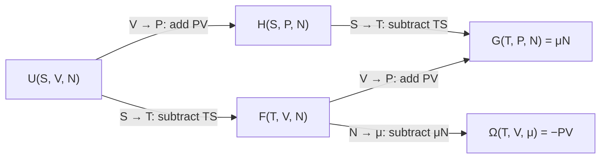
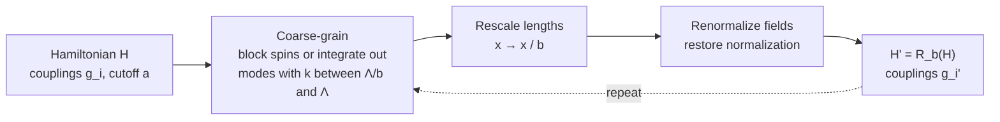

[Thermodynamics](./thermodynamics.html) &raquo; Advanced Topics

This page continues [Thermodynamics](./thermodynamics.html) at graduate level. It assumes the four laws, the potentials $U, H, F, G$, and the engine cycles, and covers: the Legendre-transform structure of equilibrium thermodynamics, with the Maxwell relations, Jacobian methods, and stability conditions; the link to statistical ensembles and equilibrium fluctuations; continuous phase transitions, critical exponents, and the renormalization group; and thermodynamics away from equilibrium, from Onsager's linear response to the fluctuation theorems, stochastic thermodynamics, the thermodynamics of information, and quantum thermodynamics. For microscopic derivations see [Statistical Mechanics](statistical-mechanics/) and [Phase Transitions and Advanced Topics](statistical-mechanics/phase-transitions-and-advanced.html).

## Formal Structure of Equilibrium Thermodynamics

### The fundamental relation

Equilibrium thermodynamics of a simple system is fully specified by one **fundamental relation**, either $S(U, V, N)$ (entropy representation) or $U(S, V, N)$ (energy representation). Callen's postulates make this precise: $S$ is a continuous, differentiable, monotonically increasing function of $U$; it is additive over subsystems; and an unconstrained composite system settles into the state that maximizes total entropy. The first derivatives of $U$ are the intensive variables,

$$T = \left(\frac{\partial U}{\partial S}\right)_{V,N}, \qquad P = -\left(\frac{\partial U}{\partial V}\right)_{S,N}, \qquad \mu = \left(\frac{\partial U}{\partial N}\right)_{S,V},$$

and each such derivative, expressed in terms of the natural variables, is an **equation of state**. Any one equation of state loses information; all of them together (or the fundamental relation) contain everything.

### Legendre transformations

A Legendre transform replaces a convex function of a variable with an equivalent function of that variable's slope, without loss of information. For convex $f(x)$ with slope $p = df/dx$,

$$g(p) = px - f(x), \qquad dg = x\,dp,$$

where $x$ is evaluated at the point where $df/dx = p$. The transform is an involution: transforming $g$ recovers $f$. Thermodynamics uses the convention $\mathcal{L}[f] = f - px$ (the negative of the mathematical definition), which trades an extensive natural variable for its intensive conjugate:



| Potential | Definition | Differential | Natural variables | Statistical ensemble |
|-----------|------------|--------------|-------------------|----------------------|
| Internal energy $U$ | — | $T\,dS - P\,dV + \mu\,dN$ | $S, V, N$ | Microcanonical (via $S = k_B\ln\Omega$) |
| Enthalpy $H$ | $U + PV$ | $T\,dS + V\,dP + \mu\,dN$ | $S, P, N$ | Isoenthalpic–isobaric |
| Helmholtz $F$ | $U - TS$ | $-S\,dT - P\,dV + \mu\,dN$ | $T, V, N$ | Canonical |
| Gibbs $G$ | $U - TS + PV$ | $-S\,dT + V\,dP + \mu\,dN$ | $T, P, N$ | Isothermal–isobaric |
| Grand potential $\Omega$ | $U - TS - \mu N$ | $-S\,dT - P\,dV - N\,d\mu$ | $T, V, \mu$ | Grand canonical |

The natural variables of a potential are the quantities an experiment controls, and at fixed natural variables the potential is minimized in equilibrium. A reaction in an open beaker is described by $G$, a gas in a rigid thermostatted box by $F$, and a system exchanging particles with a reservoir (an adsorbed layer, electrons in a metal contacted to leads) by $\Omega$. Because each is a Legendre transform of $U$, all carry the same information.

### Euler and Gibbs–Duhem relations

$U$ is a first-order homogeneous function of its extensive arguments, $U(\lambda S, \lambda V, \lambda N) = \lambda U(S, V, N)$. Euler's theorem then gives the integrated form

$$U = TS - PV + \mu N,$$

from which $G = \mu N$ and $\Omega = -PV$ follow immediately. Differentiating the Euler relation and subtracting the fundamental differential gives the **Gibbs–Duhem relation**

$$S\,dT - V\,dP + N\,d\mu = 0,$$

so the intensive variables of a single phase are not independent: for a one-component system, fixing two fixes the third. For a multicomponent system, $\sum_i N_i\,d\mu_i = 0$ at fixed $T$ and $P$; this constraint underlies activity-coefficient consistency tests and, together with equality of chemical potentials between phases, the Gibbs phase rule.

### Maxwell relations and the thermodynamic square

Each potential is a state function, so its mixed second derivatives commute. This gives one Maxwell relation for each pair of natural variables; the four most used (fixed $N$) are:

| Potential | Maxwell relation |
|-----------|------------------|
| $U(S, V)$ | $\left(\dfrac{\partial T}{\partial V}\right)_{S} = -\left(\dfrac{\partial P}{\partial S}\right)_{V}$ |
| $H(S, P)$ | $\left(\dfrac{\partial T}{\partial P}\right)_{S} = \left(\dfrac{\partial V}{\partial S}\right)_{P}$ |
| $F(T, V)$ | $\left(\dfrac{\partial S}{\partial V}\right)_{T} = \left(\dfrac{\partial P}{\partial T}\right)_{V}$ |
| $G(T, P)$ | $\left(\dfrac{\partial S}{\partial P}\right)_{T} = -\left(\dfrac{\partial V}{\partial T}\right)_{P}$ |

Including $N$ adds relations such as $(\partial \mu/\partial P)_{T,N} = (\partial V/\partial N)_{T,P}$, the partial molar volume.

The **thermodynamic square** (Born square) encodes all four differentials. The natural variables sit at the corners and each potential sits on the edge between its two natural variables. The diagonal arrows run from $S$ to $T$ and from $P$ to $V$.

<div style="overflow-x:auto; text-align:center;">
<svg viewBox="0 0 320 260" style="max-width:320px; width:100%; color:inherit;" role="img" aria-label="Thermodynamic square: corners V (top left), T (top right), S (bottom left), P (bottom right); edges F (top), G (right), H (bottom), U (left); diagonal arrows from S to T and from P to V">
<defs>
<marker id="thermo-sq-arrow" markerWidth="10" markerHeight="10" refX="8" refY="3" orient="auto" markerUnits="strokeWidth">
<path d="M0,0 L0,6 L9,3 z" fill="currentColor"/>
</marker>
</defs>
<g stroke="currentColor" stroke-width="1.5" fill="none">
<path d="M86,40 L146,40 M174,40 L234,40"/>
<path d="M70,56 L70,114 M70,146 L70,204"/>
<path d="M250,56 L250,114 M250,146 L250,204"/>
<path d="M86,220 L146,220 M174,220 L234,220"/>
<path d="M84,206 L234,56" stroke-width="2" marker-end="url(#thermo-sq-arrow)"/>
<path d="M236,206 L86,56" stroke-width="2" marker-end="url(#thermo-sq-arrow)"/>
</g>
<g fill="currentColor" font-family="sans-serif" text-anchor="middle">
<text x="70" y="46" font-size="18" font-style="italic">V</text>
<text x="250" y="46" font-size="18" font-style="italic">T</text>
<text x="70" y="226" font-size="18" font-style="italic">S</text>
<text x="250" y="226" font-size="18" font-style="italic">P</text>
<text x="160" y="46" font-size="18" font-weight="bold">F</text>
<text x="70" y="136" font-size="18" font-weight="bold">U</text>
<text x="250" y="136" font-size="18" font-weight="bold">G</text>
<text x="160" y="226" font-size="18" font-weight="bold">H</text>
</g>
</svg>
</div>

To read a differential, take the potential's two adjacent corners as the differentials; each is multiplied by the variable at the diagonally opposite corner. The sign is $+$ if the diagonal arrow points from the differential's corner toward its coefficient and $-$ if it points the other way. For $U$ (corners $V$ and $S$): $dS$ takes coefficient $T$ with the arrow running $S \to T$, giving $+T\,dS$; $dV$ takes coefficient $P$ with the arrow running $P \to V$, giving $-P\,dV$. Hence $dU = T\,dS - P\,dV$, and likewise $dG = -S\,dT + V\,dP$. Maxwell relations come from the three corners along each side of the square. The mnemonic "**V**alid **F**acts and **T**heoretical **U**nderstanding **G**enerate **S**olutions to **H**ard **P**roblems" recovers the layout reading row by row.

**Why Maxwell relations matter.** They convert entropy derivatives, which cannot be measured directly, into slopes of the equation of state. The $F$ relation gives the **energy equation** $(\partial U/\partial V)_T = T(\partial P/\partial T)_V - P$, which vanishes for an ideal gas and equals $an^2/V^2$ for a van der Waals gas; the $G$ relation gives $(\partial H/\partial P)_T = V - T(\partial V/\partial T)_P$, and hence the Joule–Thomson coefficient.

### Jacobian methods

Jacobians turn the manipulation of thermodynamic derivatives into routine algebra. Define

$$\frac{\partial(u,v)}{\partial(x,y)} = \det\begin{pmatrix} \partial u/\partial x & \partial u/\partial y \\ \partial v/\partial x & \partial v/\partial y \end{pmatrix}, \qquad \left(\frac{\partial u}{\partial x}\right)_y = \frac{\partial(u,y)}{\partial(x,y)}.$$

Jacobians obey the chain rule $\frac{\partial(u,v)}{\partial(x,y)} = \frac{\partial(u,v)}{\partial(s,t)}\,\frac{\partial(s,t)}{\partial(x,y)}$ and change sign when two entries are swapped. All four Maxwell relations collapse to the single identity

$$\frac{\partial(T,S)}{\partial(P,V)} = 1,$$

which expresses that a reversible cycle encloses equal areas in the $T$–$S$ and $P$–$V$ planes (net heat equals net work). A standard application is the general relation between heat capacities,

$$C_P - C_V = \frac{TV\alpha^2}{\kappa_T}, \qquad \frac{C_P}{C_V} = \frac{\kappa_T}{\kappa_S},$$

with thermal expansion coefficient $\alpha = V^{-1}(\partial V/\partial T)_P$, isothermal compressibility $\kappa_T = -V^{-1}(\partial V/\partial P)_T$, and adiabatic compressibility $\kappa_S = -V^{-1}(\partial V/\partial P)_S$. Since $\kappa_T > 0$ in a stable system, $C_P \geq C_V$ always.

### Stability and convexity

Equilibrium requires a minimum of the relevant potential, not merely a stationary point. Local stability requires positive response functions:

| Condition | Name | Meaning |
|-----------|------|---------|
| $C_V > 0$ | Thermal stability | Adding heat raises the temperature |
| $\kappa_T > 0$ | Mechanical stability | Compressing raises the pressure |
| $(\partial\mu/\partial N)_{T,V} > 0$ | Diffusive (chemical) stability | Adding particles raises the chemical potential |

These follow from the curvature of the potentials. $S(U, V, N)$ is concave; $U(S, V, N)$ is convex. A Legendre transform flips curvature in the transformed variable only, so $F(T, V)$ is concave in $T$ and convex in $V$, and $G(T, P)$ is concave in both $T$ and $P$.

When a model violates these conditions, for example a van der Waals isotherm with $(\partial P/\partial V)_T > 0$ below $T_c$, the homogeneous state is unstable and the system separates into coexisting phases. The Maxwell equal-area construction replaces the non-convex part of $F(V)$ by its convex hull (a common tangent), which is the thermodynamic statement of phase coexistence. The boundary of the unstable region is the **spinodal**; between spinodal and coexistence curve lie metastable states (superheated liquid, supercooled vapor).

## Statistical Foundations

### Ensembles and potentials

Each thermodynamic potential is, up to a factor of $-k_BT$, the logarithm of the partition function of the ensemble whose control variables match its natural variables. (The symbol $\Omega$ is used both for the microcanonical state count and for the grand potential; context distinguishes them.)

| Ensemble | Fixed | Partition function | Potential |
|----------|-------|--------------------|-----------|
| Microcanonical | $E, V, N$ | $\Omega(E,V,N) = \int d\Gamma\,\delta(H - E)$ | $S = k_B\ln\Omega$ |
| Canonical | $T, V, N$ | $Z = \int d\Gamma\,e^{-\beta H}$ | $F = -k_BT\ln Z$ |
| Isothermal–isobaric | $T, P, N$ | $\Delta = \int dV\,e^{-\beta PV} Z(V)$ | $G = -k_BT\ln\Delta$ |
| Grand canonical | $T, V, \mu$ | $\Xi = \sum_N e^{\beta\mu N} Z_N$ | $\Omega = -k_BT\ln\Xi = -PV$ |

Here $\beta = 1/k_BT$ and $d\Gamma$ is the phase-space measure, including the $1/(N!\,h^{3N})$ factor for identical classical particles. In the thermodynamic limit the relative fluctuations of extensive quantities scale as $N^{-1/2}$, so the ensembles give identical thermodynamics away from phase transitions and the choice is a matter of convenience. Ensemble equivalence can fail for systems with long-range interactions (self-gravitating systems, where the microcanonical heat capacity can be negative) and at first-order transitions.

### Fluctuations and response

Equilibrium fluctuations are tied to static response functions. If the Hamiltonian contains a term $-hA$ coupling an observable $A$ to a field $h$, then

$$\langle(\delta A)^2\rangle = k_BT\left(\frac{\partial\langle A\rangle}{\partial h}\right)_T.$$

Special cases:

$$\langle(\delta E)^2\rangle = k_BT^2 C_V, \qquad \langle(\delta M)^2\rangle = k_BT\,\chi, \qquad \langle(\delta V)^2\rangle_{NPT} = k_BT\,V\kappa_T, \qquad \frac{\langle(\delta N)^2\rangle_{\mu VT}}{\langle N\rangle^2} = \frac{k_BT\,\kappa_T}{V}.$$

The last relation connects compressibility to density fluctuations, and via the structure factor $S(k \to 0) = \rho k_BT\kappa_T$ to scattering experiments. Because response functions are proportional to fluctuation variances, and the variances diverge as the correlation length $\xi \to \infty$, susceptibilities and compressibilities diverge at critical points; near the liquid–gas critical point this appears as **critical opalescence**. The dynamical generalization, which relates the time-dependent response to equilibrium time correlations, is the fluctuation–dissipation theorem of Callen and Welton (1951) and Kubo.

## Critical Phenomena and Phase Transitions

### Classification and order parameters

In the modern classification, a transition is **first order** if the first derivatives of the free energy (entropy, volume, magnetization) jump, with a latent heat, and **continuous** otherwise. Ehrenfest's older scheme of "$n$th-order" transitions is rarely used. A continuous transition is characterized by an **order parameter**, a quantity that vanishes in the disordered phase and becomes nonzero in the ordered phase, usually reflecting a broken symmetry.

| System | Order parameter | Broken symmetry | Universality class (3D) |
|--------|-----------------|-----------------|--------------------------|
| Uniaxial ferromagnet | Magnetization $m$ | $\mathbb{Z}_2$ (up/down) | Ising |
| Liquid–gas critical point | $\rho_{\text{liquid}} - \rho_{\text{gas}}$ | Emergent $\mathbb{Z}_2$ | Ising |
| Binary liquid mixture | Concentration difference | Emergent $\mathbb{Z}_2$ | Ising |
| Planar magnet, superfluid $^4$He | Complex amplitude $\psi$ | $U(1)$ | XY, $O(2)$ |
| Isotropic ferromagnet | Magnetization vector | $O(3)$ | Heisenberg |

### Critical exponents

Near a continuous transition, with reduced temperature $t = (T - T_c)/T_c$ and conjugate field $h$, thermodynamic quantities follow power laws:

| Quantity | Power law | Exponent |
|----------|-----------|----------|
| Specific heat | $C \sim \lvert t\rvert^{-\alpha}$ | $\alpha$ |
| Order parameter ($t < 0$) | $m \sim (-t)^{\beta}$ | $\beta$ |
| Susceptibility | $\chi \sim \lvert t\rvert^{-\gamma}$ | $\gamma$ |
| Critical isotherm ($t = 0$) | $m \sim h^{1/\delta}$ | $\delta$ |
| Correlation length | $\xi \sim \lvert t\rvert^{-\nu}$ | $\nu$ |
| Correlation function at $T_c$ | $G(r) \sim r^{-(d-2+\eta)}$ | $\eta$ |

The exponents are **universal**: they depend only on dimensionality, the symmetry of the order parameter, and the range of interactions, not on microscopic details.

| Exponent | Mean field | 2D Ising (exact, Onsager/CFT) | 3D Ising (conformal bootstrap) |
|----------|------------|-------------------------------|-------------------------------|
| $\alpha$ | $0$ (discontinuity) | $0$ (logarithmic) | $0.11009$ |
| $\beta$ | $1/2$ | $1/8$ | $0.32642$ |
| $\gamma$ | $1$ | $7/4$ | $1.23708$ |
| $\delta$ | $3$ | $15$ | $4.78984$ |
| $\nu$ | $1/2$ | $1$ | $0.62997$ |
| $\eta$ | $0$ | $1/4$ | $0.03630$ |

The 3D Ising values come from the numerical conformal bootstrap (Kos, Poland, Simmons-Duffin, Vichi and collaborators, 2014–2017), which bounds the operator dimensions of the critical theory and now gives the most precise determination, ahead of Monte Carlo and the $\epsilon$-expansion. The same values describe the critical point of water, carbon dioxide, and binary mixtures.

### Scaling relations

The exponents are linked by scaling laws that hold in every universality class:

$$\begin{aligned}
&\text{Rushbrooke:} && \alpha + 2\beta + \gamma = 2 \\
&\text{Griffiths:} && \alpha + \beta(1 + \delta) = 2 \\
&\text{Widom:} && \gamma = \beta(\delta - 1) \\
&\text{Fisher:} && \gamma = \nu(2 - \eta) \\
&\text{Josephson (hyperscaling):} && d\nu = 2 - \alpha
\end{aligned}$$

They follow from the **scaling hypothesis**: under a change of length scale by a factor $b$, the singular part of the free-energy density transforms as

$$f_s(t, h) = b^{-d} f_s\!\left(b^{y_t} t,\; b^{y_h} h\right),$$

with two independent eigenvalues $y_t = 1/\nu$ and $y_h = (d + 2 - \eta)/2$. All six exponents are functions of $y_t$, $y_h$, and $d$, so only two are independent. Hyperscaling, the one relation containing $d$, holds below the upper critical dimension and fails above it, where mean-field exponents apply in every $d$.

### Landau theory

Landau theory expands the free-energy density in powers of the order parameter, keeping the terms allowed by symmetry. For a scalar order parameter with $m \to -m$ symmetry in a field $h$:

$$f(m) = f_0 + a\,t\,m^2 + b\,m^4 - h\,m, \qquad a, b > 0.$$

Minimizing at $h = 0$ gives $m = 0$ for $t > 0$ and $m = \pm\sqrt{-at/2b}$ for $t < 0$, so $\beta = 1/2$. At $t = 0$, $h = 4bm^3$ gives $\delta = 3$; the susceptibility $\chi = (\partial m/\partial h) \propto \lvert t\rvert^{-1}$ gives $\gamma = 1$; and the free energy $-a^2t^2/4b$ below $T_c$ produces a finite jump in the specific heat ($\alpha = 0$). Adding a gradient term $c\,(\nabla m)^2$ gives Ornstein–Zernike correlations with $\nu = 1/2$ and $\eta = 0$. If $b < 0$, a positive $m^6$ term is needed and the transition becomes first order; the point where $b$ changes sign is a **tricritical point**.

Mean-field theory neglects fluctuations. The **Ginzburg criterion** compares the fluctuations of $m$ over a correlation volume with $m^2$ itself; the fluctuations grow as $\lvert t\rvert^{(d-4)/2}$ relative to the mean, so they dominate near $T_c$ for $d < 4$. The **upper critical dimension** is therefore $d_c = 4$ for short-range interactions: above it mean-field exponents are exact, at $d = 4$ they acquire logarithmic corrections, and below it the renormalization group is needed.

### Renormalization group

The renormalization group (RG) turns "looking at the system on coarser scales" into a transformation on the space of Hamiltonians. One RG step integrates out short-wavelength fluctuations and rescales, producing a new effective Hamiltonian with the same long-distance physics:



**Fixed points.** A critical point corresponds to a fixed point $H^* = \mathcal{R}_b(H^*)$. At the fixed point the correlation length is infinite (or zero, for trivial fixed points), and the system is statistically self-similar.

**Scaling fields.** Linearizing the flow near a fixed point, perturbations with eigenvalues $y_i$ scale as $g_i' = b^{y_i} g_i$:

| Eigenvalue | Type | Behavior under coarse-graining | Examples |
|------------|------|---------------------------------|----------|
| $y_i > 0$ | Relevant | Grows; drives the system away from criticality | Reduced temperature $t$, field $h$ |
| $y_i = 0$ | Marginal | Neither grows nor shrinks at linear order; often logarithmic corrections | $\phi^4$ coupling at $d = 4$ |
| $y_i < 0$ | Irrelevant | Shrinks; microscopic details that do not affect critical behavior | Lattice structure, higher-order couplings |

The thermal and field eigenvalues are the $y_t$ and $y_h$ of the scaling hypothesis, so the RG derives the scaling form rather than postulating it. **Universality** follows: all Hamiltonians in the basin of attraction of the same fixed point share its exponents, and they differ only through irrelevant variables that die away.

**Wilson–Fisher fixed point.** For the $\phi^4$ theory in $d = 4 - \epsilon$ dimensions, the one-loop flow of the quartic coupling $u$ is

$$\frac{du}{d\ell} = \epsilon\,u - C\,u^2, \qquad \ell = \ln b,$$

with $C > 0$. For $\epsilon > 0$ the Gaussian fixed point $u = 0$ is unstable, and the flow ends at the nontrivial **Wilson–Fisher fixed point** $u^* = \epsilon/C$. Expanding exponents in $\epsilon$ (for the $O(n)$ model, $\nu = \tfrac{1}{2} + \tfrac{n+2}{4(n+8)}\epsilon + O(\epsilon^2)$, which gives $\nu = \tfrac12 + \tfrac{\epsilon}{12}$ for Ising) and resumming the series at $\epsilon = 1$ gives good 3D estimates. Kenneth Wilson received the 1982 Nobel Prize in Physics for this theory. The field-theory side of the RG is covered in [Renormalization](renormalization.html).

### Kosterlitz–Thouless transition

In two dimensions, the Mermin–Wagner theorem forbids spontaneous breaking of a continuous symmetry at $T > 0$, so the 2D XY model has no long-range order. It nevertheless has a sharp **topological** transition, driven by vortices:

- Below $T_{KT}$, vortices and antivortices are bound in neutral pairs, and correlations decay as a power law (quasi-long-range order): $G(r) \sim r^{-\eta(T)}$, with $\eta(T_{KT}) = 1/4$.
- Above $T_{KT}$, free vortices proliferate and correlations decay exponentially: $G(r) \sim e^{-r/\xi}$.
- The correlation length diverges with an essential singularity, $\xi \sim \exp\!\left(b/\sqrt{T - T_{KT}}\right)$, and all derivatives of the free energy are continuous.
- The superfluid stiffness jumps to zero at $T_{KT}$ with a universal value, $\rho_s(T_{KT}^-) = 2m^2k_BT_{KT}/(\pi\hbar^2)$ (Nelson–Kosterlitz), confirmed in helium-4 films.

Kosterlitz, Thouless, and Haldane shared the 2016 Nobel Prize in Physics for topological phase transitions and topological phases of matter.

### Quantum phase transitions

A quantum phase transition occurs at $T = 0$ as a non-thermal parameter $g$ (pressure, doping, magnetic field) passes a critical value $g_c$, driven by quantum rather than thermal fluctuations. Imaginary time acts as an extra dimension that scales with the **dynamical critical exponent** $z$, $\xi_\tau \sim \xi^z$, so a $d$-dimensional quantum critical point is related to a $(d + z)$-dimensional classical one. The singular free-energy density scales as

$$f(g, T) = b^{-(d+z)} f\!\left((g - g_c)\,b^{1/\nu},\; T\,b^{z}\right).$$

At finite temperature the critical point opens into a **quantum critical fan** in the $(g, T)$ plane where the only energy scale is $k_BT$. Transport there is governed by "Planckian" relaxation times $\tau \sim \hbar/k_BT$, which has been connected to the linear-in-$T$ resistivity of strange metals such as the cuprates. See [Emergent Phases](condensed-matter/emergent-phases.html).

### The glass transition

The glass transition is a kinetic arrest rather than an equilibrium phase transition: the viscosity of a supercooled liquid rises by many orders of magnitude over a narrow range, and the glass temperature $T_g$ (conventionally where viscosity reaches about $10^{12}$ Pa·s) depends on the cooling rate.

- **Vogel–Fulcher–Tammann law.** Relaxation times in "fragile" liquids grow faster than Arrhenius, $\tau = \tau_0\exp\!\left[DT_0/(T - T_0)\right]$, extrapolating to a divergence at $T_0 < T_g$.
- **Kauzmann paradox.** Extrapolated below $T_g$, the supercooled liquid's entropy would fall below the crystal's at a temperature $T_K$, usually close to $T_0$. Real liquids avoid this by falling out of equilibrium first.
- **Adam–Gibbs theory** links the two: $\tau \sim \exp\!\left[A/(TS_c)\right]$, with $S_c$ the configurational entropy, so a vanishing $S_c$ at $T_K$ implies diverging relaxation.
- **Random first-order transition theory** and mean-field spin-glass analogies predict an ideal glass transition at $T_K$; whether one exists in finite dimensions remains open.

## Non-equilibrium Thermodynamics

### Local equilibrium and entropy production

Classical irreversible thermodynamics assumes **local equilibrium**: each small volume element has well-defined $T$, $P$, $\mu$ that vary slowly in space and time. Entropy then obeys a local balance equation with a source term, the entropy production density $\sigma$, which is a sum of fluxes $J_i$ times their conjugate thermodynamic forces $X_i$:

$$\sigma = \sum_i J_i X_i \geq 0.$$

| Flux $J_i$ | Force $X_i$ | Linear law |
|------------|-------------|------------|
| Heat flux $\mathbf{J}_q$ | $\nabla(1/T)$ | Fourier's law |
| Particle flux $\mathbf{J}_k$ | $-\nabla(\mu_k/T)$ | Fick's law |
| Electric current $\mathbf{J}_e$ | $\mathbf{E}/T$ | Ohm's law |
| Reaction rate $v_r$ | Affinity $A_r/T$ | Linearized mass action |

### Linear response and Onsager reciprocity

Near equilibrium, fluxes are linear in forces, $J_i = \sum_j L_{ij} X_j$, and positive entropy production requires the symmetric part of $L$ to be positive semidefinite. Onsager (1931) showed, from time-reversal invariance of the microscopic dynamics and the **regression hypothesis** (spontaneous fluctuations decay by the same laws as imposed perturbations), that

$$L_{ij} = L_{ji}, \qquad L_{ij}(\mathbf{B}) = L_{ji}(-\mathbf{B})\ \text{in a magnetic field}.$$

Reciprocity links cross-effects that look unrelated. In thermoelectricity, the Peltier coefficient $\Pi$ and the Seebeck coefficient $S$ satisfy the Kelvin relation $\Pi = TS$; in the Soret and Dufour effects, heat driving mass flow and mass flow driving heat are governed by the same coefficient.

**Green–Kubo relations** express the transport coefficients as time integrals of equilibrium correlation functions. For example, the self-diffusion coefficient and shear viscosity are

$$D = \frac{1}{3}\int_0^\infty \langle \mathbf{v}(0)\cdot\mathbf{v}(t)\rangle\,dt, \qquad \eta = \frac{V}{k_BT}\int_0^\infty \langle P_{xy}(0)\,P_{xy}(t)\rangle\,dt,$$

which is how molecular dynamics simulations compute transport coefficients.

**Minimum entropy production.** Prigogine's theorem states that in the linear regime with constant, symmetric $L_{ij}$ and some forces held fixed, the steady state minimizes total entropy production. It is a genuine variational principle only under those conditions; there is no general extremum principle far from equilibrium, where structure formation (convection rolls, chemical oscillations, Turing patterns) is described instead by instability and bifurcation theory of **dissipative structures**.

## Stochastic Thermodynamics

Stochastic thermodynamics defines heat, work, and entropy along *individual* fluctuating trajectories of small systems (colloids in optical traps, biomolecules, molecular motors, nanoelectronic circuits), where thermal fluctuations are comparable to the energies involved.

### Trajectory-level energetics

An overdamped colloidal particle in a potential $V(x, \lambda)$, controlled by an externally varied parameter $\lambda(t)$ and immersed in a bath at temperature $T$, obeys the Langevin equation

$$\gamma\,\dot{x} = -\frac{\partial V(x,\lambda)}{\partial x} + \sqrt{2\gamma k_BT}\,\xi(t), \qquad \langle \xi(t)\xi(t')\rangle = \delta(t - t').$$

Following Sekimoto, the First Law holds along each trajectory: the work done by the controller is $w = \int \frac{\partial V}{\partial\lambda}\dot{\lambda}\,dt$, the heat released to the bath is $q = w - \Delta V$, and the total entropy production combines the bath entropy $q/T$ with the change in the trajectory's stochastic (Shannon) entropy $s = -k_B\ln p(x,t)$. The Second Law becomes a statement about averages: individual trajectories can have negative entropy production.

### Fluctuation theorems

The fluctuation theorems are exact relations valid arbitrarily far from equilibrium. They quantify how improbable Second-Law-violating trajectories are.

| Relation | Statement | Setting |
|----------|-----------|---------|
| Evans–Searles / Gallavotti–Cohen (1993–1995) | $\dfrac{P(\Sigma_\tau = A)}{P(\Sigma_\tau = -A)} = e^{\tau A/k_B}$ | Entropy production rate averaged over time $\tau$ (transient, or asymptotic in steady state) |
| Jarzynski equality (1997) | $\langle e^{-\beta W}\rangle = e^{-\beta\Delta F}$ | Driving from equilibrium; any speed |
| Crooks relation (1999) | $\dfrac{P_F(W)}{P_R(-W)} = e^{\beta(W - \Delta F)}$ | Forward vs. time-reversed protocol |
| Integral fluctuation theorem (Seifert 2005) | $\langle e^{-\Delta s_{\text{tot}}/k_B}\rangle = 1$ | Any Markovian dynamics, any initial state |
| Hatano–Sasa (2001) | $\langle e^{-Y}\rangle = 1$ for excess entropy | Transitions between non-equilibrium steady states |

Jarzynski's equality is the exponential average of the *total* work $W$, not of the dissipated work. Jensen's inequality ($\langle e^{x}\rangle \geq e^{\langle x\rangle}$) gives $\langle W\rangle \geq \Delta F$, the Second Law for work. The Crooks work distributions cross at $W = \Delta F$, so free energies can be extracted from irreversible experiments. Experimental tests include mechanical unfolding of single RNA hairpins with optical tweezers (Liphardt et al., *Science* 2002, for Jarzynski; Collin et al., *Nature* 2005, for Crooks). In practice the Jarzynski average is dominated by rare low-work trajectories, so the number of samples needed grows exponentially with the dissipated work.

### Thermodynamic uncertainty relations and speed limits

The **thermodynamic uncertainty relation** (TUR), proposed by Barato and Seifert (2015) and proved for Markov jump processes in steady state by Gingrich, Horowitz, and collaborators (2016), bounds the precision of any time-integrated current $J$ (number of steps of a motor, charge transferred, product molecules made) by the total entropy production $\Sigma$ over the same interval:

$$\frac{\mathrm{Var}(J)}{\langle J\rangle^2} \geq \frac{2k_B}{\langle\Sigma\rangle}.$$

Precision costs dissipation: halving the relative uncertainty of a molecular clock or motor requires at least four times the entropy production. The TUR is used to infer lower bounds on the dissipation of biological machines from measured fluctuations. It can be violated in underdamped dynamics, with time-dependent driving, and in coherent quantum transport, which has motivated generalized versions.

**Thermodynamic speed limits** give a related trade-off in time: transforming one probability distribution into another in time $\tau$ produces entropy that grows as the transformation is made faster, with lower bounds set by a distance between the initial and final distributions (for overdamped dynamics, the $L^2$-Wasserstein distance of optimal transport). Finite-time protocols that minimize dissipation follow geodesics of a **thermodynamic metric**, a framework used to design optimal driving in experiments and in free-energy calculations.

### Thermodynamics of information

**Landauer's principle.** Erasing one bit of information, a logically irreversible operation, in contact with a bath at temperature $T$ dissipates on average at least

$$Q_{\text{erase}} \geq k_BT\ln 2 \approx 2.9 \times 10^{-21}\ \text{J at } 300\ \text{K}.$$

Bérut et al. (*Nature*, 2012) measured the bound approached in the slow-erasure limit using a colloidal particle in a double-well optical trap, and later experiments have tested it in nanomagnets and quantum systems. Present-day CMOS logic dissipates several orders of magnitude more energy per operation than this limit.

**Maxwell's demon and feedback.** A demon that measures a system and acts on the result can extract work, as in the Szilard engine, which extracts $k_BT\ln 2$ per cycle from a single-molecule gas. Sagawa and Ueda (2008–2010) generalized the Second Law to feedback control,

$$\langle W_{\text{ext}}\rangle \leq -\Delta F + k_BT\,I, \qquad \langle e^{-\beta(W - \Delta F) - I}\rangle = 1,$$

where $I$ is the mutual information (in nats) acquired by measurement. Information is a thermodynamic resource, and the demon's apparent violation is repaid when its memory is erased (the Landauer cost) or reset.

## Quantum Thermodynamics

Quantum thermodynamics extends the laws to working media that are small quantum systems, where discreteness, coherence, entanglement, and measurement back-action matter.

**Work and heat.** For a system with Hamiltonian $H(\lambda) = \sum_n E_n(\lambda)\,|n\rangle\langle n|$ and state $\rho = \sum_n p_n |n\rangle\langle n|$, the change in mean energy splits as (Alicki, 1979)

$$d\langle E\rangle = \underbrace{\sum_n p_n\,dE_n}_{\delta W\ \text{(level shifts)}} + \underbrace{\sum_n E_n\,dp_n}_{\delta Q\ \text{(population changes)}}.$$

Work is not an observable in the quantum case; it is defined through a **two-point measurement** of energy before and after the driving unitary $U$. The work distribution is

$$P(w) = \sum_{m,n} p_n^{(0)}\,\bigl|\langle m_f|U|n_i\rangle\bigr|^2\,\delta\!\left(w - (E_m^f - E_n^i)\right),$$

and with this definition the Jarzynski equality and Crooks relation hold unchanged (Kurchan 2000; Tasaki 2000). The two-point scheme destroys initial coherences, and several alternative definitions of quantum work are still under study.

**Resource theories and many second laws.** Treating thermal states as free and energy-preserving unitaries with a bath as free operations gives a resource theory of athermality. For single-shot (small-system) transitions the ordinary free energy is replaced by a family of conditions: Brandão, Horodecki, Ng, Oppenheim, and Wehner (*PNAS*, 2015) showed that a whole family of Rényi-divergence free energies must all decrease, recovering the single standard second law only in the thermodynamic limit. The same framework gives a quantitative third law (Masanes and Oppenheim, 2017): the time needed to cool toward $T = 0$ diverges, with explicit bounds.

**Quantum heat engines and refrigerators.** Otto, Carnot, and absorption cycles have been realized with single trapped ions (Roßnagel et al., *Science*, 2016), NV centers, superconducting qubits, and spin ensembles. Their efficiency is bounded by Carnot when the baths are thermal; apparent excesses reported for "squeezed" or coherent baths come from counting the non-thermal resource as free. Autonomous quantum absorption refrigerators and thermal machines are studied as benchmarks for heat management in quantum processors.

## Other Regimes and Frontiers

### Active matter

Active systems (bacterial suspensions, self-propelled colloids, flocks, the cytoskeleton) consume energy at the level of each constituent and are permanently out of equilibrium. Characteristic effects:

- **Motility-induced phase separation**: self-propelled particles with purely repulsive interactions separate into dense and dilute phases because they slow down where crowded.
- **No equation of state for pressure**: the mechanical pressure on a wall can depend on the wall's details (Solon et al., *Nature Physics*, 2015), unlike equilibrium pressure.
- **Broken fluctuation–dissipation**: effective temperatures inferred from different observables disagree; the degree of violation (Harada–Sasa relation) measures the dissipation rate.
- Entropy production splits into a **housekeeping** part that maintains the steady state and an **excess** part associated with transitions between steady states.

### Biological and chemical machines

Molecular motors (kinesin, myosin), ion pumps, and the rotary ATP synthase operate in an overdamped, noisy environment, converting free energy from ATP hydrolysis ($\Delta G \approx -50$ kJ/mol under cellular conditions) into work, often with high efficiency at low speed. Stochastic thermodynamics provides the tools for their analysis: TURs bound their precision, and kinetic proofreading illustrates the trade-off between dissipation and accuracy in copying information (DNA replication, translation). England (2013) derived bounds relating the heat dissipated by self-replicators to their growth and decay rates. Living systems maintain low internal entropy by continuously exporting entropy to their environment.

### Negative absolute temperature

When a system's energy spectrum is bounded above, a population inversion gives $\partial S/\partial U < 0$ and hence $T < 0$. Such states are *hotter* than any positive temperature: in contact, heat flows from them to any positive-temperature system. They were first realized in nuclear spin systems (Purcell and Pound, 1951), and for motional degrees of freedom of ultracold atoms in optical lattices (Braun et al., *Science*, 2013). Whether a "Carnot efficiency above 1" follows is a matter of definition; it does not survive a careful accounting of the work needed to prepare and maintain the inverted state.

### Black-hole thermodynamics

Black holes obey laws formally identical to the four laws of thermodynamics, with surface gravity as temperature and horizon area as entropy. The Bekenstein–Hawking entropy and Hawking temperature of a Schwarzschild black hole are

$$S_{BH} = \frac{k_B A}{4\ell_P^2}, \qquad T_H = \frac{\hbar c^3}{8\pi G M k_B}, \qquad \ell_P^2 = \frac{G\hbar}{c^3}.$$

Entropy scaling with area rather than volume underlies the holographic principle. A black hole has negative heat capacity, so it heats as it radiates. See [Black Holes](relativity/black-holes.html) and [Quantum Gravity](relativity/quantum-gravity.html).

## Computational Methods

### Monte Carlo sampling

Markov-chain Monte Carlo samples configurations with Boltzmann weight $e^{-\beta H}$, so thermal averages can be computed without enumerating states. The Metropolis algorithm accepts a proposed move with probability $\min(1, e^{-\beta\Delta E})$, which satisfies detailed balance. Near criticality local updates suffer **critical slowing down**: the autocorrelation time grows as $\tau \sim \xi^{z}$ with $z \approx 2$. Cluster algorithms (Swendsen–Wang, Wolff) flip correlated clusters in one move and reduce $z$ substantially for Ising and $O(n)$ models.

The example simulates the 2D Ising model ($J = 1$, periodic boundaries) with a vectorized checkerboard Metropolis sweep and a Wolff cluster update. Sites of one checkerboard color share no bonds, so they can be updated simultaneously.

```python
import numpy as np

rng = np.random.default_rng(0)

def energy(s):
    """Total energy of a periodic 2D Ising lattice, J = 1, h = 0."""
    return -np.sum(s * (np.roll(s, 1, axis=0) + np.roll(s, 1, axis=1)))

def metropolis_sweep(s, beta):
    """One checkerboard sweep: update all 'black' sites, then all 'white' sites."""
    L = s.shape[0]
    parity = np.add.outer(np.arange(L), np.arange(L)) % 2
    for colour in (0, 1):
        nn = (np.roll(s, 1, 0) + np.roll(s, -1, 0) +
              np.roll(s, 1, 1) + np.roll(s, -1, 1))
        dE = 2 * s * nn                                  # energy cost of flipping each spin
        accept = rng.random(s.shape) < np.exp(-beta * dE)
        s[accept & (parity == colour)] *= -1
    return s

def wolff_step(s, beta):
    """Flip one Wolff cluster; returns the cluster size."""
    L = s.shape[0]
    p_add = 1.0 - np.exp(-2.0 * beta)
    i, j = rng.integers(L, size=2)
    seed = s[i, j]
    stack, cluster = [(i, j)], {(i, j)}
    while stack:
        i, j = stack.pop()
        for ni, nj in (((i + 1) % L, j), ((i - 1) % L, j), (i, (j + 1) % L), (i, (j - 1) % L)):
            if (ni, nj) not in cluster and s[ni, nj] == seed and rng.random() < p_add:
                cluster.add((ni, nj))
                stack.append((ni, nj))
    for i, j in cluster:
        s[i, j] = -seed
    return len(cluster)

L = 32
T_c = 2.0 / np.log(1.0 + np.sqrt(2.0))                 # Onsager: 2.269...
for T in (1.5, T_c, 3.5):
    s = rng.choice([-1, 1], size=(L, L))
    for _ in range(2000):
        metropolis_sweep(s, 1.0 / T)
    print(f"T = {T:.3f}  |m| = {abs(s.mean()):.3f}  E/N = {energy(s) / L**2:.3f}")

s = np.ones((L, L), dtype=int)
sizes = [wolff_step(s, 1.0 / T_c) for _ in range(200)]
print(f"mean Wolff cluster size at T_c: {np.mean(sizes):.0f} spins")
```

A representative run shows the ordered phase ($\lvert m\rvert \approx 0.99$ at $T = 1.5$), the disordered phase ($\lvert m\rvert \approx 0$ at $T = 3.5$), and a finite-size magnetization near $T_c$; the Wolff clusters at $T_c$ span a large fraction of the lattice. Production studies add equilibration checks, autocorrelation analysis, and finite-size scaling across several $L$. For molecular dynamics, thermostats, and larger-scale methods see [Monte Carlo and Molecular Dynamics](computational-physics/monte-carlo-and-md.html).

### Free-energy calculation

Free energies are not averages of a mechanical observable, so they need special estimators:

| Method | Estimator | Notes |
|--------|-----------|-------|
| Free-energy perturbation (Zwanzig, 1954) | $\Delta F = -k_BT\ln\langle e^{-\beta\Delta U}\rangle_0$ | Requires overlap between end states; usually staged through intermediates |
| Thermodynamic integration | $\Delta F = \int_0^1 \left\langle \partial U/\partial\lambda\right\rangle_\lambda d\lambda$ | Robust; many $\lambda$ windows |
| Bennett acceptance ratio / MBAR (Shirts and Chodera, 2008) | Optimal combination of samples from all states | Statistically optimal; implemented in `pymbar` |
| Umbrella sampling, metadynamics | Bias along a collective variable, then reweight | Free-energy profiles and barriers |
| Nonequilibrium work (Jarzynski, Crooks) | Exponential or bidirectional work averages | Uses fast switching; bidirectional estimates are far better conditioned |

These methods underpin binding-affinity prediction in drug discovery and phase-equilibrium calculations in materials science.

### Classical density functional theory

Classical DFT casts inhomogeneous equilibrium as minimization of a grand-potential functional of the one-body density $\rho(\mathbf{r})$:

$$\Omega[\rho] = \mathcal{F}[\rho] + \int d\mathbf{r}\,\rho(\mathbf{r})\left[V_{\text{ext}}(\mathbf{r}) - \mu\right], \qquad \frac{\delta\mathcal{F}}{\delta\rho(\mathbf{r})} + V_{\text{ext}}(\mathbf{r}) = \mu.$$

The intrinsic free energy splits into an exact ideal-gas part and an excess part that must be approximated:

$$\mathcal{F}[\rho] = k_BT\int d\mathbf{r}\,\rho(\mathbf{r})\left[\ln\!\left(\rho(\mathbf{r})\Lambda^3\right) - 1\right] + \mathcal{F}_{\text{ex}}[\rho],$$

where $\Lambda$ is the thermal de Broglie wavelength. Mean-field treatments of attractions combined with fundamental-measure theory (Rosenfeld, 1989) for hard-core repulsion give accurate results for interfaces, wetting, adsorption in pores, and confined fluids. Recent work trains neural-network approximations to $\mathcal{F}_{\text{ex}}$ directly from simulation data.

### Machine learning

Machine learning now appears throughout computational statistical physics:

- **Phase classification.** Convolutional networks trained on raw spin configurations locate phase transitions without being given an order parameter (Carrasquilla and Melko, *Nature Physics*, 2017); unsupervised variants find order parameters from data.
- **Generative samplers.** Normalizing flows and autoregressive networks give exact-likelihood samples that can be reweighted to the Boltzmann distribution: Boltzmann generators for molecular systems (Noé et al., *Science*, 2019) and variational autoregressive networks for lattice models (Wu, Wang, and Zhang, *Physical Review Letters*, 2019), which minimize a variational free energy directly. Diffusion-model samplers extend this approach.
- **Machine-learned interatomic potentials** give near-quantum accuracy in molecular dynamics at a fraction of the cost, enabling free-energy and phase-diagram calculations for realistic materials.

See [Machine Learning for Physics](computational-physics/ml-for-physics.html).

## References and Further Reading

### Textbooks

- H. B. Callen, *Thermodynamics and an Introduction to Thermostatistics*, 2nd ed. (Wiley, 1985) — the postulational approach used above.
- L. E. Reichl, *A Modern Course in Statistical Physics*, 4th ed. (Wiley, 2016).
- D. Chandler, *Introduction to Modern Statistical Mechanics* (Oxford, 1987).
- M. Kardar, *Statistical Physics of Particles* and *Statistical Physics of Fields* (Cambridge, 2007).
- N. Goldenfeld, *Lectures on Phase Transitions and the Renormalization Group* (Addison-Wesley, 1992).
- P. M. Chaikin and T. C. Lubensky, *Principles of Condensed Matter Physics* (Cambridge, 1995).
- S. R. de Groot and P. Mazur, *Non-Equilibrium Thermodynamics* (Dover reprint).

### Reviews

- U. Seifert, "Stochastic thermodynamics, fluctuation theorems and molecular machines," *Rep. Prog. Phys.* 75, 126001 (2012).
- C. Jarzynski, "Nonequilibrium work relations: foundations and applications," *Eur. Phys. J. B* 64, 331 (2008).
- J. M. R. Parrondo, J. M. Horowitz, and T. Sagawa, "Thermodynamics of information," *Nat. Phys.* 11, 131 (2015).
- J. M. Horowitz and T. R. Gingrich, "Thermodynamic uncertainty relations constrain non-equilibrium fluctuations," *Nat. Phys.* 16, 15 (2020).
- S. Vinjanampathy and J. Anders, "Quantum thermodynamics," *Contemp. Phys.* 57, 545 (2016).
- M. C. Marchetti et al., "Hydrodynamics of soft active matter," *Rev. Mod. Phys.* 85, 1143 (2013).
- D. Poland, S. Rychkov, and A. Vichi, "The conformal bootstrap: theory, numerical techniques, and applications," *Rev. Mod. Phys.* 91, 015002 (2019).

### Software

| Tool | Use |
|------|-----|
| LAMMPS, GROMACS, OpenMM | Molecular dynamics, including free-energy methods |
| pymbar | MBAR and related free-energy estimators |
| ALPS (ALPSCore) | Lattice Monte Carlo and related methods for quantum and classical spin models |
| Thermo-Calc, pycalphad | CALPHAD phase-diagram modelling |
| CoolProp, thermo, Cantera | Fluid properties, chemical equilibrium, and reacting-flow thermodynamics |

## See Also

- [Thermodynamics](./thermodynamics.html) — the laws, processes, potentials, and cycles this page builds on.
- [Statistical Mechanics](statistical-mechanics/) — the microscopic foundation of the ensembles used here.
- [Phase Transitions and Advanced Statistical Mechanics](statistical-mechanics/phase-transitions-and-advanced.html) — Ising model solutions, mean-field theory, and critical phenomena in more depth.
- [Renormalization](renormalization.html) — the renormalization group from the quantum-field-theory side.
- [Condensed Matter Physics](condensed-matter/) — phase transitions, criticality, and emergent order in materials.
- [Black Holes](relativity/black-holes.html) — Hawking radiation and black-hole entropy.
- [Computational Physics](computational-physics/) — Monte Carlo, molecular dynamics, and machine learning for thermal systems.
