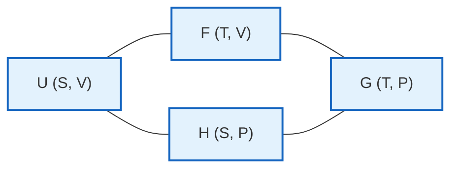

[Thermodynamics](./thermodynamics.html) &raquo; Advanced Topics

This page is the denser, formula-forward continuation of [Thermodynamics](./thermodynamics.html). It assumes the four laws, the four potentials, and the engine cycles, and builds the formal machinery on top: the Legendre-transform structure that relates the potentials, the complete set of Maxwell relations, the theory of continuous phase transitions and the renormalization group, and the modern extensions to systems far from equilibrium — Onsager's reciprocity, the fluctuation theorems, and stochastic and quantum thermodynamics. For the microscopic story behind the statistical sections, see [Statistical Mechanics](statistical-mechanics/).

## Legendre Transformations and Thermodynamic Potentials

### Mathematical Framework

A Legendre transformation replaces a function of a variable by an equivalent function of that variable's *conjugate slope*, with no loss of information. Given a convex function $f(x)$, define the conjugate variable $p = df/dx$. The Legendre transform is

$$
g(p) = px - f(x),
$$

where $x$ is understood as the value at which $df/dx = p$. Differentiating, $dg = x\,dp$, so $x = dg/dp$: the transform is an involution that swaps the roles of the variable and its slope. In thermodynamics this is exactly how one trades an *extensive* natural variable (such as $S$ or $V$) for its *intensive* conjugate ($T$ or $-P$), generating the family of potentials from a single fundamental relation $U(S,V,N)$.

### The Thermodynamic Potentials

Each potential is obtained from $U$ by Legendre-transforming away one or more extensive variables. The fundamental differentials encode the equations of state as first derivatives.

**Internal Energy:** $U(S,V,N)$
$$
dU = T\,dS - P\,dV + \mu\,dN
$$

**Enthalpy:** $H(S,P,N) = U + PV$
$$
dH = T\,dS + V\,dP + \mu\,dN
$$

**Helmholtz Free Energy:** $F(T,V,N) = U - TS$
$$
dF = -S\,dT - P\,dV + \mu\,dN
$$

**Gibbs Free Energy:** $G(T,P,N) = U - TS + PV$
$$
dG = -S\,dT + V\,dP + \mu\,dN
$$

**Grand Potential:** $\Omega(T,V,\mu) = U - TS - \mu N$
$$
d\Omega = -S\,dT - P\,dV - N\,d\mu
$$

From these, every first-order equation of state is a partial derivative — for example $T = (\partial U/\partial S)_{V,N}$, $P = -(\partial F/\partial V)_{T,N}$, and $N = -(\partial \Omega/\partial \mu)_{T,V}$.

**Why the transform matters physically.** The natural variables of a potential are precisely the quantities an experiment controls. A reaction in an open beaker is held at fixed $T$ and $P$, so the relevant potential is $G$; a gas sealed in a rigid box at fixed temperature is governed by $F$; a system exchanging particles with a reservoir (an adsorbed monolayer, an electron gas) is governed by $\Omega$. In each case *minimizing the matching potential* identifies equilibrium, and the Legendre transform guarantees these descriptions all carry the same physical content.

### The Euler Relation and Gibbs–Duhem

Because $U$ is a first-order homogeneous function of its extensive variables ($U(\lambda S, \lambda V, \lambda N) = \lambda U$), Euler's theorem gives the integrated form

$$
U = TS - PV + \mu N.
$$

Differentiating this and subtracting the fundamental differential $dU = T\,dS - P\,dV + \mu\,dN$ yields the **Gibbs–Duhem relation**,

$$
S\,dT - V\,dP + N\,d\mu = 0,
$$

which states that the intensive variables $T, P, \mu$ are not independent: in a single-phase system, fixing two determines the third. Gibbs–Duhem is the backbone of phase-coexistence arguments and of the phase rule.

### Maxwell Relations

Each potential is an exact differential, so its mixed second partials are equal. Reading off the equality for every potential gives the full set of Maxwell relations — note the sign flips, which track whether the conjugate pair appears with a $+$ or $-$ in the differential.

| Potential | Natural variables | Maxwell relation |
|-----------|-------------------|------------------|
| $U$ | $S, V, N$ | $\left(\dfrac{\partial T}{\partial V}\right)_{S,N} = -\left(\dfrac{\partial P}{\partial S}\right)_{V,N}$ |
| $H$ | $S, P, N$ | $\left(\dfrac{\partial T}{\partial P}\right)_{S,N} = \left(\dfrac{\partial V}{\partial S}\right)_{P,N}$ |
| $F$ | $T, V, N$ | $\left(\dfrac{\partial S}{\partial V}\right)_{T,N} = \left(\dfrac{\partial P}{\partial T}\right)_{V,N}$ |
| $G$ | $T, P, N$ | $\left(\dfrac{\partial S}{\partial P}\right)_{T,N} = -\left(\dfrac{\partial V}{\partial T}\right)_{P,N}$ |

**What Maxwell relations are for.** They convert quantities you cannot easily measure into quantities you can. The entropy change of a gas with volume, $(\partial S/\partial V)_T$, is not directly accessible, but the Maxwell relation equates it to $(\partial P/\partial T)_V$ — a slope read straight off the equation of state. The same trick yields the energy equation $(\partial U/\partial V)_T = T(\partial P/\partial T)_V - P$, which vanishes for an ideal gas and is nonzero (and computable) for a van der Waals gas.

### The Thermodynamic Square

A classic mnemonic packs all four potentials and their natural variables into a single square. Each potential sits between its two natural variables, and the Maxwell relations are read off the corners.



The two diagonals of the square satisfy

$$U + G = H + F = TS + \mu N,$$

which is just the Euler relation re-expressed through the four potentials.

## Critical Phenomena and Phase Transitions

### Critical Exponents

Approaching a continuous (second-order) phase transition, thermodynamic quantities diverge or vanish as power laws in the reduced temperature $t = (T - T_c)/T_c$. The exponents are remarkably *universal*: wildly different systems sharing the same dimensionality and symmetry collapse onto the same set of values.

| Quantity | Power law | Exponent |
|----------|-----------|----------|
| Specific heat | $C \sim \lvert t \rvert^{-\alpha}$ | $\alpha$ |
| Order parameter | $m \sim \lvert t \rvert^{\beta}$ | $\beta$ |
| Susceptibility | $\chi \sim \lvert t \rvert^{-\gamma}$ | $\gamma$ |
| Correlation length | $\xi \sim \lvert t \rvert^{-\nu}$ | $\nu$ |
| Critical isotherm | $m \sim H^{1/\delta}$ | $\delta$ |
| Correlation function | $G(r) \sim r^{-(d-2+\eta)}$ | $\eta$ |

The divergence of the correlation length $\xi$ is the physical heart of criticality: as $\xi \to \infty$, fluctuations on *every* length scale become important simultaneously, the system loses any characteristic scale, and microscopic details wash out. This is why universality exists at all.

### Scaling Relations

The six exponents are not independent — scaling theory links them through equalities that hold across all universality classes:

$$\begin{aligned}
&\text{Rushbrooke:} && \alpha + 2\beta + \gamma = 2 \\
&\text{Griffiths:} && \alpha + \beta(1 + \delta) = 2 \\
&\text{Widom:} && \gamma = \beta(\delta - 1) \\
&\text{Fisher:} && \gamma = \nu(2 - \eta) \\
&\text{Josephson (hyperscaling):} && d\nu = 2 - \alpha
\end{aligned}$$

These follow from the **scaling hypothesis** for the singular part of the free energy density: under a change of length scale by a factor $b$,

$$
f_s(t, H) = b^{-d} f_s\!\left(b^{y_t} t,\; b^{y_h} H\right),
$$

with two independent exponents $y_t$ and $y_h$. All six thermodynamic exponents are algebraic combinations of $y_t$, $y_h$, and the dimension $d$, which is why only two are independent and why hyperscaling involves $d$ explicitly.

### Landau Theory

Landau theory expands the free energy in powers of the order parameter $m$, keeping only terms allowed by symmetry. Near a critical point in a field $H$,

$$
F = F_0 + a\,t\,m^2 + b\,m^4 + c\,m^6 + \ldots - Hm,
$$

with $a, b, c > 0$ and $t = (T-T_c)/T_c$. Minimizing $\partial F/\partial m = 0$ gives $m = 0$ for $t > 0$ and $m \sim (-t)^{1/2}$ for $t < 0$ (when the quartic term controls the transition), reproducing the mean-field exponents directly.

**Mean-field critical exponents:**

| Exponent | Value |
|----------|-------|
| $\alpha$ | $0$ (jump/logarithmic) |
| $\beta$ | $1/2$ |
| $\gamma$ | $1$ |
| $\delta$ | $3$ |
| $\nu$ | $1/2$ |
| $\eta$ | $0$ |

Mean-field theory is exact above the **upper critical dimension** $d_c = 4$, where fluctuations are too weak to matter. Below $d_c$, the Ginzburg criterion shows fluctuations dominate near $T_c$ and the true exponents deviate from these values — which is exactly the problem the renormalization group solves.

### Renormalization Group Theory

The renormalization group (RG) makes the idea of "looking at the system on coarser and coarser scales" into a precise transformation on the space of Hamiltonians. A single RG step thins out short-wavelength degrees of freedom (for example by a real-space block-spin average or a momentum-shell integration) and rescales lengths, producing a *new* effective Hamiltonian for the remaining long-wavelength physics.

**RG transformation:** A coarse-graining map $\mathcal{R}_b$ that rescales lengths by a factor $b$ takes a Hamiltonian (a set of couplings) to a new one,

$$
H' = \mathcal{R}_b(H),
$$

so the partition function and long-distance physics are preserved while short-distance detail is integrated out.

**Fixed points:** A scale-invariant theory is a fixed point of the flow,

$$
H^* = \mathcal{R}_b(H^*).
$$

Critical points correspond to fixed points: there the correlation length is infinite, so the system looks the same at every magnification.

**Scaling dimensions:** Linearizing the flow about a fixed point, the couplings $\{g_i\}$ evolve as $g_i' = b^{\,y_i} g_i$, where the eigenvalues $y_i$ classify each perturbation:

- **Relevant** ($y_i > 0$): grows under coarse-graining and drives the system away from the fixed point — these are the parameters (like $t$ and $H$) you must tune to reach criticality.
- **Marginal** ($y_i = 0$): requires higher-order analysis; often produces logarithmic corrections.
- **Irrelevant** ($y_i < 0$): shrinks under coarse-graining — microscopic details that do *not* affect critical behavior.

The thermal and field eigenvalues are exactly the $y_t$ and $y_h$ of the scaling hypothesis, which is how RG *derives* the scaling form (and hence all the scaling relations) rather than postulating it.

**Universality:** Because only the relevant couplings survive coarse-graining, every microscopic model that flows to the same fixed point shares the same critical exponents. Systems are grouped into **universality classes** set by dimensionality $d$, the symmetry of the order parameter, and the range of interactions — which is why a uniaxial ferromagnet and the liquid–gas critical point of a simple fluid share the 3D Ising exponents.

**Worked sketch — the Gaussian fixed point and $\epsilon$-expansion.** For the $\phi^4$ field theory, a momentum-shell RG step generates the flow of the quartic coupling $u$. In $d = 4 - \epsilon$ dimensions the one-loop recursion is

$$
\frac{du}{d\ell} = \epsilon\, u - C\, u^2,
$$

with $C > 0$ a geometric constant and $\ell = \ln b$. For $\epsilon > 0$ this has a nontrivial stable fixed point $u^* = \epsilon / C$ — the **Wilson-Fisher fixed point** — which controls criticality below four dimensions. Expanding the exponents in powers of $\epsilon$ (e.g. $\nu = 1/2 + \epsilon/12 + \ldots$) and extrapolating to $\epsilon = 1$ gives strikingly good estimates for the 3D Ising exponents, the calculation for which Wilson received the 1982 Nobel Prize.

## Statistical Foundations

### Ensemble Theory

The thermodynamic potentials are the logarithms of partition functions in the matching statistical ensemble — the bridge between counting microstates and the macroscopic relations above.

**Microcanonical (NVE):** fixed energy, the bare statement $S = k_B \ln \Omega$.
$$
S = k_B \ln \Omega(E,V,N), \qquad \Omega(E,V,N) = \int \delta(H - E)\, d\Gamma
$$

**Canonical (NVT):** fixed temperature; the Helmholtz free energy is the log partition function.
$$
Z = \int e^{-\beta H}\, d\Gamma, \qquad F = -k_B T \ln Z
$$

**Grand Canonical (μVT):** fixed temperature and chemical potential; the grand potential is the log grand partition function.
$$
\Xi = \sum_N e^{\beta\mu N} Z_N, \qquad \Omega = -k_B T \ln \Xi
$$

In the thermodynamic limit these ensembles are equivalent (away from phase transitions): the relative fluctuations of extensive quantities scale as $1/\sqrt{N}$, so the choice of ensemble is a matter of calculational convenience.

### Fluctuations and Response Functions

A central result of statistical mechanics is that *equilibrium fluctuations* of a quantity are tied to the *response* of its mean to the conjugate field — the fluctuation–dissipation theorem. The variance of an observable is a curvature of the relevant free energy.

**Fluctuation–dissipation theorem:**
$$
\langle(\delta A)^2\rangle = k_B T^2 \left(\frac{\partial\langle A\rangle}{\partial T}\right)_X
$$

**Specific heat** ties to energy fluctuations:
$$
C_V = \left(\frac{\partial U}{\partial T}\right)_V = \frac{\langle(\delta E)^2\rangle}{k_B T^2}
$$

**Compressibility** ties to volume (or density) fluctuations:
$$
\kappa_T = -\frac{1}{V}\left(\frac{\partial V}{\partial P}\right)_T = \frac{\langle(\delta V)^2\rangle}{k_B T V}
$$

**Magnetic susceptibility** ties to magnetization fluctuations:
$$
\chi = \left(\frac{\partial M}{\partial H}\right)_T = \beta\langle(\delta M)^2\rangle
$$

Because response functions like $\chi$ and $C$ are proportional to fluctuation variances, and those variances diverge as $\xi \to \infty$, this is the microscopic reason susceptibilities and specific heats blow up at a critical point.

## Non-equilibrium Thermodynamics

### Linear Response Theory

Close to equilibrium, thermodynamic fluxes are *linear* in the driving forces, and the response is governed by symmetric transport coefficients.

**Onsager regression hypothesis:** the spontaneous decay of an equilibrium fluctuation follows the same macroscopic relaxation law as a small externally imposed perturbation. This is the principle that lets equilibrium correlation functions predict transport coefficients (Green–Kubo relations).

**Transport coefficients:** writing the fluxes $J_i$ (of heat, charge, particles) as linear functions of the thermodynamic forces $X_j$ (gradients of $1/T$, $-\mu/T$, etc.):
$$
J_i = \sum_j L_{ij} X_j
$$

**Onsager reciprocity:** for forces and fluxes defined so that the entropy production is $\sigma = \sum_i J_i X_i$, the kinetic matrix is symmetric,
$$
L_{ij} = L_{ji}.
$$

This symmetry is a deep consequence of the *time-reversal invariance* of the underlying microscopic dynamics, and it ties together superficially unrelated cross-effects — the thermoelectric Seebeck and Peltier coefficients, for example, are forced to be equal (in appropriate units) by $L_{12} = L_{21}$. In a magnetic field $B$, the relation generalizes to $L_{ij}(B) = L_{ji}(-B)$.

### Entropy Production

The Second Law in its local form states that the entropy generated per unit volume and time is nonnegative:

$$
\sigma = \sum_i J_i X_i \geq 0.
$$

In the linear regime $\sigma = \sum_{ij} L_{ij} X_i X_j \geq 0$ requires the symmetric part of $L$ to be positive semidefinite — a stronger statement than the global Second Law.

**Minimum entropy production (Prigogine):** for a system held near equilibrium with some forces fixed, the *steady state* is the one that minimizes the total entropy production subject to the constraints. This provides a variational characterization of near-equilibrium steady states, the closest non-equilibrium analogue of the equilibrium minimum-free-energy principle.

### Fluctuation Theorems

Far from equilibrium the Second Law becomes a statement about *probabilities*: entropy-decreasing trajectories are not forbidden, merely exponentially unlikely, and the precise ratio is fixed. These exact relations hold arbitrarily far from equilibrium and have been confirmed in single-molecule experiments.

**Crooks fluctuation relation** compares the work distribution $P_F(W)$ of a forward driving protocol with that of its time-reverse $P_R(-W)$:
$$
\frac{P_F(W)}{P_R(-W)} = e^{\beta (W - \Delta F)}.
$$
The two distributions cross at $W = \Delta F$, giving a model-free way to extract the free-energy difference from non-equilibrium pulls.

**Jarzynski equality** follows by integrating Crooks: the exponential average of the dissipated work equals the equilibrium free-energy difference *exactly*, even for arbitrarily fast (irreversible) processes,
$$
\langle e^{-\beta W}\rangle = e^{-\beta\Delta F}.
$$
By Jensen's inequality this implies $\langle W \rangle \geq \Delta F$, recovering the familiar Second-Law bound while sharpening it into an equality over fluctuations.

**Gallavotti–Cohen theorem** is the steady-state analogue for the time-averaged entropy production rate $\Sigma_\tau$ over a window of duration $\tau$:
$$
\frac{P(\Sigma_\tau = A)}{P(\Sigma_\tau = -A)} = e^{\tau A / k_B}.
$$
It quantifies how the probability of a transient Second-Law "violation" decays exponentially with the observation time and the system size.

## Advanced Phase Transitions

### Kosterlitz–Thouless Transition

Some transitions have no local order parameter at all. The 2D XY model undergoes a *topological* transition driven by the binding and unbinding of vortices:

- **No true long-range order** at any $T > 0$, by the Mermin–Wagner theorem (continuous symmetries cannot be spontaneously broken in $d \le 2$ at finite temperature).
- **Quasi-long-range order** below $T_{KT}$: correlations decay as a power law rather than to a constant.
- **Vortex–antivortex unbinding** at $T_{KT}$: below the transition vortices are bound in neutral pairs; above it free vortices proliferate and destroy the quasi-order.

**Correlation function** changes character across $T_{KT}$:
$$
G(r) \sim r^{-\eta(T)} \quad (T < T_{KT}), \qquad G(r) \sim e^{-r/\xi} \quad (T > T_{KT}).
$$
The transition is of infinite order (all derivatives of the free energy are continuous), and the correlation length diverges with an essential singularity $\xi \sim \exp(b/\sqrt{T - T_{KT}})$ rather than a power law. Kosterlitz and Thouless shared the 2016 Nobel Prize for this analysis.

### Quantum Phase Transitions

A quantum phase transition occurs at $T = 0$ as a non-thermal parameter $g$ (pressure, doping, magnetic field) is tuned through a critical value $g_c$, driven by quantum rather than thermal fluctuations. Space and (imaginary) time scale differently, controlled by the **dynamical critical exponent** $z$: $\xi_\tau \sim \xi^z$.

**Scaling ansatz** for the singular free energy density:
$$
F(g,T) = b^{-(d+z)} F\!\left(g\, b^{1/\nu},\; T\, b^{z}\right).
$$
A quantum critical point at $T = 0$ broadens at finite temperature into a **quantum critical fan** in the $(g, T)$ plane, where unusual "strange-metal" transport and the absence of well-defined quasiparticles are observed — a central theme of modern condensed-matter physics.

### Glass Transitions

The glass transition is not a sharp thermodynamic transition but a dramatic dynamical arrest, with several deep puzzles:

**Kauzmann paradox:** extrapolating the excess entropy of a supercooled liquid below the experimental glass temperature, it would become *less* than the crystal's at a finite Kauzmann temperature $T_K$ — an apparent entropy crisis that real systems avoid by falling out of equilibrium first.

**Vogel–Fulcher–Tammann law** for the structural relaxation time:
$$
\tau = \tau_0 \exp\!\left[\frac{D\,T_0}{T - T_0}\right],
$$
which diverges at a finite temperature $T_0$ (often close to $T_K$), far stronger than ordinary Arrhenius behavior.

**Adam–Gibbs theory** rationalizes the connection by relating the relaxation time to a vanishing *configurational entropy* $S_c$ via $\tau \sim \exp(A/T S_c)$, linking the dynamical slowdown to the thermodynamic entropy crisis.

## Computational Methods

### Monte Carlo Methods

Markov-chain Monte Carlo samples configurations with the Boltzmann weight $e^{-\beta H}$, making thermal averages computable without enumerating the exponentially many states. The Metropolis algorithm uses local single-spin updates; near criticality these suffer from *critical slowing down* (the autocorrelation time diverges as $\xi^z$), which cluster algorithms like Wolff's defeat by flipping correlated clusters in one move.

```python
def metropolis_ising_2d(L, T, n_steps):
    """Metropolis algorithm for 2D Ising model"""
    # Initialize random spin configuration
    spins = 2*np.random.randint(2, size=(L, L)) - 1
    beta = 1.0/T

    # Precompute Boltzmann factors
    w = {}
    for dE in [-8, -4, 0, 4, 8]:
        w[dE] = np.exp(-beta * dE)

    magnetization = []
    energy = []

    for step in range(n_steps):
        # Choose random spin
        i = np.random.randint(L)
        j = np.random.randint(L)

        # Calculate energy change
        s = spins[i, j]
        neighbors = spins[(i+1)%L, j] + spins[i, (j+1)%L] + \
                   spins[(i-1)%L, j] + spins[i, (j-1)%L]
        dE = 2 * s * neighbors

        # Metropolis acceptance
        if dE <= 0 or np.random.random() < w[dE]:
            spins[i, j] = -s

        # Measure observables
        if step % 10 == 0:
            magnetization.append(np.mean(spins))
            energy.append(calculate_energy(spins))

    return magnetization, energy, spins

def wolff_cluster_algorithm(spins, T):
    """Wolff cluster algorithm for reduced critical slowing"""
    L = len(spins)
    p_add = 1 - np.exp(-2.0/T)

    # Choose random spin
    i0, j0 = np.random.randint(L, size=2)
    cluster_spin = spins[i0, j0]

    # Build cluster
    cluster = {(i0, j0)}
    boundary = {(i0, j0)}

    while boundary:
        i, j = boundary.pop()

        # Check neighbors
        for di, dj in [(1,0), (-1,0), (0,1), (0,-1)]:
            ni, nj = (i+di)%L, (j+dj)%L

            if (ni, nj) not in cluster and \
               spins[ni, nj] == cluster_spin and \
               np.random.random() < p_add:
                cluster.add((ni, nj))
                boundary.add((ni, nj))

    # Flip cluster
    for i, j in cluster:
        spins[i, j] = -spins[i, j]

    return len(cluster)
```

### Density Functional Theory

Classical density functional theory casts equilibrium as a variational problem for the one-body density $\rho(r)$, with the grand potential as the functional to minimize.

**Grand potential functional:**
$$
\Omega[\rho] = F[\rho] + \int dr\, \rho(r)\,[V_{\text{ext}}(r) - \mu]
$$

**Euler–Lagrange equation** (stationarity of $\Omega$):
$$
\frac{\delta F}{\delta\rho(r)} + V_{\text{ext}}(r) = \mu
$$

**Mean-field approximation** splits $F$ into an ideal-gas entropy term plus a mean-field interaction:
$$
F[\rho] = k_B T \int dr\, \rho(r)\,[\ln(\rho(r)\Lambda^3) - 1] + \frac{1}{2} \iint dr\, dr'\, \rho(r)\rho(r')\,V(|r - r'|)
$$

DFT is the workhorse for inhomogeneous fluids — interfaces, wetting, adsorption, and confinement — where the density varies strongly in space.

## Modern Research Topics

### Active Matter Thermodynamics

Active systems (bacterial suspensions, self-propelled colloids, the cytoskeleton) consume energy locally and operate permanently out of equilibrium, breaking the usual thermodynamic relations.

**Entropy production** splits into a maintenance ("housekeeping") part that sustains the non-equilibrium steady state and an excess part associated with relaxation:
$$
\Pi = \Pi_{\text{housekeeping}} + \Pi_{\text{excess}}.
$$

**Pressure in active fluids** generally violates an equation of state — the mechanical pressure can depend on the details of the confining wall, unlike equilibrium pressure. **Effective temperatures** measured from different observables (diffusion vs. response) need not agree, signaling the breakdown of fluctuation–dissipation.

### Stochastic Thermodynamics

Stochastic thermodynamics extends heat, work, and entropy to *individual fluctuating trajectories* of small systems, where thermal noise is not negligible.

**Langevin equation** for an overdamped or underdamped particle in a potential $U$ coupled to a bath at temperature $T$:
$$
m\ddot{x} = -\gamma\dot{x} - \frac{\partial U}{\partial x} + \sqrt{2\gamma k_B T}\, \xi(t),
$$
with $\xi(t)$ unit white noise. Heat is identified with the work done by the friction and noise forces, and the fluctuation theorems above (Jarzynski, Crooks) are theorems about functionals of these trajectories.

**Information thermodynamics:** feedback control converts information into work, formalizing Maxwell's demon and the Szilard engine. The generalized Second Law $\langle W_{\text{ext}}\rangle \le -\Delta F + k_B T\, I$ shows that the *mutual information* $I$ acquired by measurement is a genuine thermodynamic resource — and Landauer's principle (below) accounts for its eventual cost.

### Quantum Thermodynamics

Quantum thermodynamics asks how the laws change when the working medium is a quantum system with discrete levels and coherence.

**Quantum work** is defined through a two-point energy measurement; for a driven Hamiltonian with eigenenergies $E_n(\lambda)$ and occupations $p_n(\lambda)$,
$$
W = \sum_n E_n(\lambda_f)\,[p_n(\lambda_f) - p_n(\lambda_i)].
$$

**Quantum heat engines** implement cycles such as the quantum Otto cycle with a few-level or harmonic working medium; coherence and degeneracy can shift performance relative to the classical bound.

**Thermodynamic uncertainty relations** bound the precision of any current $J$ in a non-equilibrium steady state by the entropy production $\langle\Sigma\rangle$:
$$
\frac{(\Delta J)^2}{\langle J\rangle^2} \geq \frac{2 k_B}{\langle\Sigma\rangle}.
$$
More precision demands more dissipation — a sharp, universal trade-off with no classical-equilibrium analogue.

### Machine Learning Applications

Neural networks can classify phases directly from raw configurations, learning order parameters without being told what to look for.

```python
def build_phase_classifier():
    model = tf.keras.Sequential([
        tf.keras.layers.Conv2D(32, (3,3), activation='relu'),
        tf.keras.layers.MaxPooling2D(2,2),
        tf.keras.layers.Conv2D(64, (3,3), activation='relu'),
        tf.keras.layers.Flatten(),
        tf.keras.layers.Dense(128, activation='relu'),
        tf.keras.layers.Dense(1, activation='sigmoid')
    ])
    return model
```

**Variational free-energy calculations** use neural-network ansätze for wavefunctions and density matrices, minimizing a variational free energy to study many-body and finite-temperature quantum systems.

## Research Frontiers

### Thermodynamics of Information

**Landauer's principle:** erasing one bit of information in contact with a bath at temperature $T$ dissipates at least $k_B T \ln 2$ of heat. This places a fundamental thermodynamic cost on irreversible computation and closes the loop on Maxwell's demon: the demon must eventually erase its memory, paying back exactly the work it extracted.

**Information engines** extract work by exploiting measured information; **quantum information thermodynamics** treats entanglement as a consumable resource for work extraction and refrigeration.

### Extreme Conditions

**Negative temperature systems:** when a system has a bounded energy spectrum and a population inversion, $\partial S/\partial U$ can be negative, giving a formally negative absolute temperature — *hotter* than any positive temperature, since energy flows from it to any ordinary system on contact.

**Black hole thermodynamics:** a black hole behaves as a thermal object — it carries entropy proportional to its horizon *area* (not its volume) and radiates at a temperature inversely proportional to its mass:

$$S_{BH} = \frac{k_B A}{4 \ell_P^2}, \qquad T_H = \frac{\hbar c^3}{8\pi G M k_B}.$$

The area law underlies the holographic principle and remains a central clue in the search for quantum gravity.

### Biological Systems

**Efficiency of molecular motors:** kinesin, myosin, and ATP synthase often operate remarkably close to their thermodynamic limits, converting chemical free energy to mechanical work with high efficiency in a noisy, overdamped environment.

**Thermodynamics of self-replication:** general bounds (England and others) relate the minimum heat dissipated during self-copying to the irreversibility of the process, connecting non-equilibrium thermodynamics to the physics of living matter.

**Non-equilibrium steady states:** life is sustained by a continuous through-flow of energy and matter, maintaining a low-entropy state by exporting entropy to the environment — the organism is a paradigmatic dissipative structure.

## Advanced Mathematical Methods

### Jacobians and Thermodynamic Derivatives

Jacobian algebra is the most systematic way to manipulate the dozens of partial derivatives that appear in thermodynamics, turning identities into routine determinant manipulations.

**Jacobian notation:**
$$
\frac{\partial(u,v)}{\partial(x,y)} = \begin{vmatrix} \dfrac{\partial u}{\partial x} & \dfrac{\partial u}{\partial y} \\[1ex] \dfrac{\partial v}{\partial x} & \dfrac{\partial v}{\partial y} \end{vmatrix}
$$

**Chain rule** (composition of Jacobians):
$$
\frac{\partial(u,v)}{\partial(x,y)} = \frac{\partial(u,v)}{\partial(s,t)} \cdot \frac{\partial(s,t)}{\partial(x,y)}
$$

**Thermodynamic identities** become transparent — for instance a partial derivative at fixed entropy is just a ratio of Jacobians:
$$
\left(\frac{\partial T}{\partial P}\right)_S = \frac{\partial(T,S)}{\partial(P,S)}.
$$
The antisymmetry $\partial(u,v)/\partial(x,y) = -\partial(v,u)/\partial(x,y)$ and the invariance $\partial(T,S)/\partial(P,V) = 1$ (from the area-preserving structure of reversible cycles) reproduce the Maxwell relations mechanically.

### Stability Conditions

Equilibrium must be a *minimum* of the relevant potential, not merely a stationary point. Local stability requires that the second-order response functions be positive:

1. $C_V > 0$ — **thermal stability**: adding heat raises the temperature.
2. $\kappa_T > 0$ — **mechanical stability**: compressing raises the pressure.
3. $(\partial \mu / \partial N)_{T,V} > 0$ — **diffusive stability**: adding particles raises the chemical potential.

These follow from the **convexity/concavity of the potentials**:

- $S(U,V,N)$ is **concave** in its arguments.
- $U(S,V,N)$ is **convex** in its arguments.
- $F(T,V,N)$ is **convex** in $V$ (and concave in $T$).
- $G(T,P,N)$ is concave in $T$ and $P$.

When these conditions fail — for example when $\kappa_T < 0$ on a van der Waals loop — the homogeneous state is unstable and the system phase-separates, the Maxwell equal-area construction restoring a convex free energy.

## References and Further Reading

### Graduate Textbooks
1. **Callen** — *Thermodynamics and an Introduction to Thermostatistics*
2. **Reichl** — *A Modern Course in Statistical Physics*
3. **Chandler** — *Introduction to Modern Statistical Mechanics*
4. **Kardar** — *Statistical Physics of Particles* and *Statistical Physics of Fields*

### Research Monographs
1. **Goldenfeld** — *Lectures on Phase Transitions and the Renormalization Group*
2. **Chaikin & Lubensky** — *Principles of Condensed Matter Physics*
3. **Seifert** — *Stochastic Thermodynamics* (Rep. Prog. Phys. 2012)
4. **Jarzynski** — *Nonequilibrium Work Relations* (C. R. Physique 2007)

### Recent Reviews
1. **Active Matter:** Marchetti et al., Rev. Mod. Phys. 85, 1143 (2013)
2. **Fluctuation Theorems:** Sevick et al., Annu. Rev. Phys. Chem. 59, 603 (2008)
3. **Quantum Thermodynamics:** Vinjanampathy & Anders, Contemp. Phys. 57, 545 (2016)
4. **Information Thermodynamics:** Parrondo et al., Nat. Phys. 11, 131 (2015)

### Computational Resources
1. **LAMMPS:** Large-scale MD simulations
2. **Monte Carlo codes:** ALPS, SpinMC
3. **Phase diagram software:** CALPHAD, Thermo-Calc
4. **Python libraries:** pyro, emcee, thermopy

## See Also

- [Thermodynamics](./thermodynamics.html) — the foundational laws, processes, potentials, and engine cycles this page builds on.
- [Statistical Mechanics](statistical-mechanics/) — the microscopic foundation that *derives* thermodynamics from counting microstates.
- [Condensed Matter Physics](condensed-matter/) — phase transitions, criticality, and the renormalization group in real materials.
- [Quantum Mechanics](quantum-mechanics/) — quantized energy levels underlying quantum statistical and quantum thermodynamics.
- [Relativity](relativity/) — black-hole thermodynamics and the Bekenstein-Hawking entropy.
- [Computational Physics](computational-physics/) — Monte Carlo and molecular dynamics for thermal systems.
