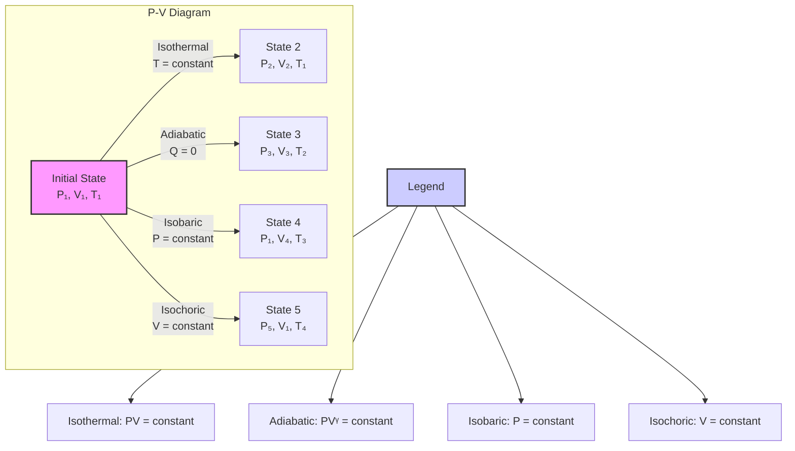

<div class="hero-section" style="background: linear-gradient(135deg, #11998e 0%, #38ef7d 100%); color: white; padding: 3rem 2rem; margin: -2rem -3rem 2rem -3rem; text-align: center;">
  <h1 style="color: white; margin: 0; font-size: 2.5rem;">Thermodynamics</h1>
  <p style="font-size: 1.25rem; margin-top: 1rem; opacity: 0.9;">The science of heat, energy, and work, governing everything from steam engines to the fate of the universe.</p>
</div>

<!-- Custom styles are now loaded via main.scss -->

## Overview

**Fundamental Laws**
- [The Laws of Thermodynamics](#the-laws-of-thermodynamics)
- [Thermodynamic Processes](#thermodynamic-processes)
- [State Functions and Properties](#state-functions-and-properties)

**Applications**
- [Heat Engines](#heat-engines)
- [Refrigerators and Heat Pumps](#refrigerators-and-heat-pumps)
- [Phase Transitions](#phase-transitions)

**Advanced Topics**
- [Maxwell Relations](#maxwell-relations)
- [Chemical Thermodynamics](#chemical-thermodynamics)
- [Non-equilibrium Thermodynamics](#non-equilibrium-thermodynamics)

---

## Fundamental Concepts

### The Laws of Thermodynamics
<p class="referenceBoxes type3"><a href="https://www.gutenberg.org/files/33229/33229-pdf.pdf"> Paper: <b><i>Reflections on the Motive Power of Fire</i></b> - Sadi Carnot</a></p>
<p class="referenceBoxes type3"><a href="https://www.youtube.com/watch?v=Xb05CaG7TsQ"> Video: <b><i>The Laws of Thermodynamics Explained</i></b></a></p>

<p class="referenceBoxes type3"><a href="https://en.wikipedia.org/wiki/Laws_of_thermodynamics"> Article: <b><i>Laws of Thermodynamics - Wikipedia</i></b></a></p>

#### Zeroth Law
If two systems are in thermal equilibrium with a third system, they are in thermal equilibrium with each other. This law establishes temperature as a fundamental thermodynamic property.

$$T_A = T_C \text{ and } T_B = T_C \Rightarrow T_A = T_B$$

#### First Law (Conservation of Energy)
Energy cannot be created or destroyed, only transformed from one form to another. For a closed system:

$$dU = \delta Q - \delta W$$

Where:
- $dU$ is the change in internal energy
- $\delta Q$ is the heat added to the system
- $\delta W$ is the work done by the system

For a cyclic process: $\oint \delta Q = \oint \delta W$

#### Second Law
The entropy of an isolated system never decreases. There are several equivalent formulations:

**Clausius Statement**: Heat cannot spontaneously flow from cold to hot.

**Kelvin-Planck Statement**: No engine can convert all heat into work.

**Entropy Statement**: For an isolated system:
$$dS \geq 0$$

For a reversible process: $dS = \frac{\delta Q_{rev}}{T}$

#### Third Law
As temperature approaches absolute zero, the entropy of a perfect crystal approaches zero:

$$\lim_{T \to 0} S = 0$$

## Thermodynamic Processes

<details>
<summary><b>Interactive P-V Diagram: Thermodynamic Processes</b></summary>
<br>



</details>

<p class="referenceBoxes type3"><a href="https://phet.colorado.edu/en/simulation/gas-properties"> Interactive: <b><i>Gas Properties Simulation</i></b></a></p>

### Isothermal Process
Temperature remains constant: $T = \text{constant}$

For an ideal gas:
- $PV = nRT = \text{constant}$
- Work done: $W = nRT \ln\left(\frac{V_f}{V_i}\right)$
- Internal energy change: $\Delta U = 0$

### Adiabatic Process
No heat exchange: $\delta Q = 0$

For an ideal gas:
- $PV^\gamma = \text{constant}$
- $TV^{\gamma-1} = \text{constant}$
- Where $\gamma = \frac{C_P}{C_V}$ is the heat capacity ratio

### Isobaric Process
Pressure remains constant: $P = \text{constant}$

Work done: $W = P(V_f - V_i)$

### Isochoric Process
Volume remains constant: $V = \text{constant}$

Work done: $W = 0$

## State Functions and Properties
<p class="referenceBoxes type3"><a href="https://www.feynmanlectures.caltech.edu/I_44.html"> Lecture: <b><i>The Laws of Thermodynamics - Feynman Lectures</i></b></a></p>


### Internal Energy (U)
Total energy contained within a system, excluding kinetic and potential energy of the system as a whole.

For an ideal gas: $U = nC_VT$

### Enthalpy (H)
$$H = U + PV$$

Useful for processes at constant pressure:
$$dH = dU + PdV + VdP$$

At constant pressure: $dH = \delta Q_P$

### Entropy (S)
Measure of disorder or number of accessible microstates:

$$S = k_B \ln \Omega$$

Where $\Omega$ is the number of microstates and $k_B$ is Boltzmann's constant.

### Gibbs Free Energy (G)
$$G = H - TS$$

Determines spontaneity at constant temperature and pressure:
- $\Delta G < 0$: Spontaneous process
- $\Delta G = 0$: Equilibrium
- $\Delta G > 0$: Non-spontaneous

### Helmholtz Free Energy (F)
$$F = U - TS$$

Useful for processes at constant temperature and volume.

## Maxwell Relations

Derived from the equality of mixed partial derivatives:

$$\left(\frac{\partial T}{\partial V}\right)_S = -\left(\frac{\partial P}{\partial S}\right)_V$$

$$\left(\frac{\partial T}{\partial P}\right)_S = \left(\frac{\partial V}{\partial S}\right)_P$$

$$\left(\frac{\partial S}{\partial V}\right)_T = \left(\frac{\partial P}{\partial T}\right)_V$$

$$\left(\frac{\partial S}{\partial P}\right)_T = -\left(\frac{\partial V}{\partial T}\right)_P$$

## Phase Transitions

### Clausius-Clapeyron Equation
Describes the phase boundary between two phases:

$$\frac{dP}{dT} = \frac{L}{T\Delta V}$$

Where $L$ is the latent heat and $\Delta V$ is the volume change.

For vapor-liquid equilibrium:
$$\ln\left(\frac{P_2}{P_1}\right) = -\frac{\Delta H_{vap}}{R}\left(\frac{1}{T_2} - \frac{1}{T_1}\right)$$

### Critical Point
Where liquid and gas phases become indistinguishable:
- Critical temperature $T_c$
- Critical pressure $P_c$
- Critical volume $V_c$

## Heat Engines and Refrigerators

### Carnot Engine
The most efficient heat engine operating between two temperatures:

Efficiency: $\eta = 1 - \frac{T_C}{T_H}$

Where $T_H$ is the hot reservoir temperature and $T_C$ is the cold reservoir temperature.

### Carnot Refrigerator
Coefficient of Performance (COP):
$$\text{COP} = \frac{T_C}{T_H - T_C}$$

### Otto Cycle
Models the idealized gasoline engine:
1. Adiabatic compression
2. Isochoric heat addition
3. Adiabatic expansion
4. Isochoric heat rejection

Efficiency: $\eta = 1 - \frac{1}{r^{\gamma-1}}$

Where $r$ is the compression ratio.

## Real Gases

### Van der Waals Equation
Accounts for molecular size and intermolecular forces:

$$\left(P + \frac{an^2}{V^2}\right)(V - nb) = nRT$$

Where:
- $a$ accounts for attractive forces
- $b$ accounts for molecular volume

### Virial Expansion
$$\frac{PV}{nRT} = 1 + \frac{B(T)}{V} + \frac{C(T)}{V^2} + ...$$

Where $B(T)$, $C(T)$ are virial coefficients.

## Chemical Thermodynamics

### Chemical Potential
For species $i$ in a mixture:
$$\mu_i = \left(\frac{\partial G}{\partial n_i}\right)_{T,P,n_{j\neq i}}$$

### Reaction Equilibrium
At equilibrium:
$$\sum_i \nu_i \mu_i = 0$$

Where $\nu_i$ are stoichiometric coefficients.

### Equilibrium Constant
$$K = \exp\left(-\frac{\Delta G^\circ}{RT}\right)$$

## Code Examples

### Carnot Engine Simulation

```python
import numpy as np
import matplotlib.pyplot as plt
from matplotlib.patches import Rectangle
import matplotlib.patches as mpatches

def carnot_cycle(T_hot=600, T_cold=300, V1=1.0, V2=2.0):
    """
    Simulate a Carnot cycle and calculate efficiency
    """
    gamma = 1.4  # Heat capacity ratio for diatomic gas
    
    # State points
    # 1->2: Isothermal expansion at T_hot
    # 2->3: Adiabatic expansion
    # 3->4: Isothermal compression at T_cold
    # 4->1: Adiabatic compression
    
    # Calculate V3 and V4 using adiabatic relations
    # For adiabatic process: TV^(γ-1) = constant
    # From state 2 to 3: T_hot * V2^(γ-1) = T_cold * V3^(γ-1)
    V3 = V2 * (T_hot/T_cold)**(1/(gamma-1))
    V4 = V1 * (T_hot/T_cold)**(1/(gamma-1))
    
    # Generate P-V diagram
    fig, (ax1, ax2) = plt.subplots(1, 2, figsize=(12, 5))
    
    # Process 1->2: Isothermal expansion
    V_12 = np.linspace(V1, V2, 100)
    P_12 = T_hot / V_12  # Using PV = nRT (normalized)
    
    # Process 2->3: Adiabatic expansion
    V_23 = np.linspace(V2, V3, 100)
    P_23 = P_12[-1] * (V2/V_23)**gamma
    
    # Process 3->4: Isothermal compression
    V_34 = np.linspace(V3, V4, 100)
    P_34 = T_cold / V_34
    
    # Process 4->1: Adiabatic compression
    V_41 = np.linspace(V4, V1, 100)
    P_41 = P_34[-1] * (V4/V_41)**gamma
    
    # Plot P-V diagram
    ax1.plot(V_12, P_12, 'r-', linewidth=2, label='1→2: Isothermal (T_hot)')
    ax1.plot(V_23, P_23, 'b-', linewidth=2, label='2→3: Adiabatic')
    ax1.plot(V_34, P_34, 'g-', linewidth=2, label='3→4: Isothermal (T_cold)')
    ax1.plot(V_41, P_41, 'm-', linewidth=2, label='4→1: Adiabatic')
    
    # Mark state points
    states = [(V1, T_hot/V1, '1'), (V2, T_hot/V2, '2'), 
              (V3, T_cold/V3, '3'), (V4, T_cold/V4, '4')]
    for V, P, label in states:
        ax1.plot(V, P, 'ko', markersize=8)
        ax1.annotate(label, (V, P), xytext=(5, 5), textcoords='offset points')
    
    ax1.fill([V1] + list(V_12) + list(V_23) + list(V_34) + list(V_41), 
             [P_12[0]] + list(P_12) + list(P_23) + list(P_34) + list(P_41), 
             alpha=0.3, color='yellow')
    
    ax1.set_xlabel('Volume (V)')
    ax1.set_ylabel('Pressure (P)')
    ax1.set_title('Carnot Cycle P-V Diagram')
    ax1.grid(True, alpha=0.3)
    ax1.legend()
    
    # Calculate and display efficiency
    efficiency = 1 - T_cold/T_hot
    work = T_hot * np.log(V2/V1) - T_cold * np.log(V3/V4)
    
    # Energy flow diagram
    ax2.set_xlim(0, 10)
    ax2.set_ylim(0, 10)
    ax2.axis('off')
    
    # Hot reservoir
    hot_rect = Rectangle((1, 7), 3, 2, facecolor='red', alpha=0.5)
    ax2.add_patch(hot_rect)
    ax2.text(2.5, 8, f'T_hot = {T_hot}K', ha='center', va='center', fontsize=12)
    
    # Engine
    engine_rect = Rectangle((2, 4), 2, 2, facecolor='gray', alpha=0.5)
    ax2.add_patch(engine_rect)
    ax2.text(3, 5, 'Carnot\nEngine', ha='center', va='center', fontsize=10)
    
    # Cold reservoir
    cold_rect = Rectangle((1, 1), 3, 2, facecolor='blue', alpha=0.5)
    ax2.add_patch(cold_rect)
    ax2.text(2.5, 2, f'T_cold = {T_cold}K', ha='center', va='center', fontsize=12)
    
    # Energy arrows
    ax2.arrow(3, 7, 0, -0.8, head_width=0.2, head_length=0.1, fc='red', ec='red')
    ax2.text(3.5, 6.5, 'Q_hot', fontsize=10)
    
    ax2.arrow(4, 5, 1, 0, head_width=0.2, head_length=0.1, fc='green', ec='green')
    ax2.text(5.5, 5, f'W = {work:.2f}', fontsize=10)
    
    ax2.arrow(3, 4, 0, -0.8, head_width=0.2, head_length=0.1, fc='blue', ec='blue')
    ax2.text(3.5, 3.5, 'Q_cold', fontsize=10)
    
    ax2.text(7, 8, f'Efficiency = {efficiency:.1%}', fontsize=14, 
             bbox=dict(boxstyle='round', facecolor='yellow', alpha=0.5))
    ax2.text(7, 7, f'η = 1 - T_cold/T_hot', fontsize=10)
    
    ax2.set_title('Carnot Engine Energy Flow')
    
    plt.tight_layout()
    plt.show()
    
    return efficiency, work

# Run simulation
eff, work = carnot_cycle(T_hot=600, T_cold=300)
print(f"Carnot efficiency: {eff:.1%}")
print(f"Work output (normalized): {work:.2f}")
```

<details>
<summary><b>Expected Output</b></summary>
<br>
The code produces two visualizations:
<ol>
<li>Left: P-V diagram showing the four processes of the Carnot cycle with the enclosed area representing work done</li>
<li>Right: Energy flow diagram showing heat flow from hot to cold reservoir and work output</li>
</ol>
Console output shows:
<ul>
<li>Carnot efficiency: 50.0%</li>
<li>Work output (normalized): 0.69</li>
</ul>
</details>

<p class="referenceBoxes type3"><a href="https://github.com/scipy/scipy/blob/main/scipy/constants/constants.py"> Library: <b><i>SciPy Constants - Thermodynamic Constants</i></b></a></p>

## Applications

### Power Generation
- Steam turbines using Rankine cycle
- Gas turbines using Brayton cycle
- Combined cycle power plants

### Refrigeration and Air Conditioning
- Vapor compression cycle
- Absorption refrigeration
- Heat pumps

### Chemical Engineering
- Distillation column design
- Reaction engineering
- Process optimization

### Materials Science
- Phase diagram analysis
- Crystal growth
- Heat treatment of materials

## Legendre Transformations and Thermodynamic Potentials

### Mathematical Framework

Legendre transformations connect different thermodynamic potentials:

**General Legendre transformation:**
$$
F(p) = px - f(x)
$$
where $p = df/dx$

### Thermodynamic Potentials

**Internal Energy:** $U(S,V,N)$
$$
dU = TdS - PdV + \mu dN
$$

**Enthalpy:** $H(S,P,N) = U + PV$
$$
dH = TdS + VdP + \mu dN
$$

**Helmholtz Free Energy:** $F(T,V,N) = U - TS$
$$
dF = -SdT - PdV + \mu dN
$$

**Gibbs Free Energy:** $G(T,P,N) = U - TS + PV$
$$
dG = -SdT + VdP + \mu dN
$$

**Grand Potential:** $\Omega(T,V,\mu) = U - TS - \mu N$
$$
d\Omega = -SdT - PdV - Nd\mu
$$

### Maxwell Relations Extended

From the exactness of differentials:

| Potential | Variables | Maxwell Relations |
|-----------|-----------|------------------|
| U | S,V,N | (∂T/∂V)_{S,N} = -(∂P/∂S)_{V,N} |
| H | S,P,N | (∂T/∂P)_{S,N} = (∂V/∂S)_{P,N} |
| F | T,V,N | (∂S/∂V)_{T,N} = (∂P/∂T)_{V,N} |
| G | T,P,N | (∂S/∂P)_{T,N} = -(∂V/∂T)_{P,N} |

### Thermodynamic Square

```
    U -------- H
    |          |
    |          |
    F -------- G
```

Diagonal relationships:
- U + G = H + F = TS + μN

## Critical Phenomena and Phase Transitions

### Critical Exponents

Near the critical point (T_c), thermodynamic quantities follow power laws:

| Quantity | Definition | Exponent |
|----------|------------|----------|
| Specific heat | C ∼ |t|^{-α} | α |
| Order parameter | m ∼ |t|^β | β |
| Susceptibility | χ ∼ |t|^{-γ} | γ |
| Correlation length | ξ ∼ |t|^{-ν} | ν |
| Critical isotherm | m ∼ H^{1/δ} | δ |
| Correlation function | G(r) ∼ r^{-(d-2+η)} | η |

Where t = (T - T_c)/T_c is the reduced temperature.

### Scaling Relations

**Rushbrooke:** α + 2β + γ = 2
**Griffiths:** α + β(1 + δ) = 2
**Widom:** γ = β(δ - 1)
**Fisher:** γ = ν(2 - η)
**Josephson:** dν = 2 - α (hyperscaling)

### Landau Theory

Free energy expansion near critical point:
$$
F = F_0 + at^2m^2 + bm^4 + cm^6 + \ldots - Hm
$$

**Mean-field critical exponents:**
- α = 0 (logarithmic)
- β = 1/2
- γ = 1
- δ = 3
- ν = 1/2
- η = 0

### Renormalization Group Theory

**RG transformation:** R maps Hamiltonian H → H'

**Fixed points:** H* = R(H*)

**Scaling dimensions:** y_i eigenvalues of linearized RG
- Relevant: y_i > 0
- Marginal: y_i = 0  
- Irrelevant: y_i < 0

**Universality:** Systems with same symmetry and dimensionality have same critical exponents

## Statistical Foundations

### Ensemble Theory

**Microcanonical (NVE):**
$$
S = k_B \ln \Omega(E,V,N), \quad \Omega(E,V,N) = \int \delta(H - E) \, d\Gamma
$$

**Canonical (NVT):**
$$
Z = \int e^{-\beta H} \, d\Gamma, \quad F = -k_B T \ln Z
$$

**Grand Canonical (μVT):**
$$
\Xi = \sum_N e^{\beta\mu N} Z_N, \quad \Omega = -k_B T \ln \Xi
$$

### Fluctuations and Response Functions

**Fluctuation-dissipation theorem:**
$$
\langle(\delta A)^2\rangle = k_B T^2 \left(\frac{\partial\langle A\rangle}{\partial T}\right)_X
$$

**Specific heat:**
$$
C_V = \left(\frac{\partial U}{\partial T}\right)_V = \frac{\langle(\delta E)^2\rangle}{k_B T^2}
$$

**Compressibility:**
$$
\kappa_T = -\frac{1}{V}\left(\frac{\partial V}{\partial P}\right)_T = \frac{\langle(\delta V)^2\rangle}{k_B T V}
$$

**Magnetic susceptibility:**
$$
\chi = \left(\frac{\partial M}{\partial H}\right)_T = \beta\langle(\delta M)^2\rangle
$$

## Non-equilibrium Thermodynamics

### Linear Response Theory

**Onsager regression hypothesis:**
Fluctuations decay like macroscopic perturbations

**Transport coefficients:**
$$
J_i = \sum_j L_{ij} X_j
$$
Where $J_i$ are fluxes and $X_j$ are thermodynamic forces.

**Onsager reciprocity:**
$$
L_{ij} = L_{ji}
$$

### Entropy Production

**Local entropy production:**
$$
\sigma = \sum_i J_i X_i \geq 0
$$

**Minimum entropy production:** For steady states near equilibrium

### Fluctuation Theorems

**Crooks relation:**
$$
\frac{P_F(W)}{P_R(-W)} = e^{\beta W - \beta\Delta F}
$$

**Jarzynski equality:**
$$
\langle e^{-\beta W}\rangle = e^{-\beta\Delta F}
$$

**Gallavotti-Cohen theorem:** For entropy production
$$
\frac{P(\Sigma_\tau = A)}{P(\Sigma_\tau = -A)} = e^{\tau A/k_B}
$$

## Advanced Phase Transitions

### Kosterlitz-Thouless Transition

Topological phase transition in 2D:
- No true long-range order (Mermin-Wagner)
- Quasi-long-range order below T_KT
- Vortex-antivortex unbinding

**Correlation function:**
$$
G(r) \sim r^{-\eta(T)} \text{ for } T < T_{KT}, \quad G(r) \sim e^{-r/\xi} \text{ for } T > T_{KT}
$$

### Quantum Phase Transitions

Phase transitions at T = 0 driven by quantum fluctuations:

**Scaling ansatz:**
$$
F(g,T) = b^{-(d+z)}F(gb^{1/\nu}, Tb^z)
$$

Where z is dynamical critical exponent.

### Glass Transitions

**Kauzmann paradox:** Extrapolated entropy becomes negative

**Vogel-Fulcher law:**
$$
\tau = \tau_0 \exp\left[\frac{DT_0}{T - T_0}\right]
$$

**Adam-Gibbs theory:** Relates relaxation to configurational entropy

## Computational Methods

### Monte Carlo Methods

```python
def metropolis_ising_2d(L, T, n_steps):
    """Metropolis algorithm for 2D Ising model"""
    # Initialize random spin configuration
    spins = 2*np.random.randint(2, size=(L, L)) - 1
    beta = 1.0/T
    
    # Precompute Boltzmann factors
    w = {}
    for dE in [-8, -4, 0, 4, 8]:
        w[dE] = np.exp(-beta * dE)
    
    magnetization = []
    energy = []
    
    for step in range(n_steps):
        # Choose random spin
        i = np.random.randint(L)
        j = np.random.randint(L)
        
        # Calculate energy change
        s = spins[i, j]
        neighbors = spins[(i+1)%L, j] + spins[i, (j+1)%L] + \
                   spins[(i-1)%L, j] + spins[i, (j-1)%L]
        dE = 2 * s * neighbors
        
        # Metropolis acceptance
        if dE <= 0 or np.random.random() < w[dE]:
            spins[i, j] = -s
        
        # Measure observables
        if step % 10 == 0:
            magnetization.append(np.mean(spins))
            energy.append(calculate_energy(spins))
    
    return magnetization, energy, spins

def wolff_cluster_algorithm(spins, T):
    """Wolff cluster algorithm for reduced critical slowing"""
    L = len(spins)
    p_add = 1 - np.exp(-2.0/T)
    
    # Choose random spin
    i0, j0 = np.random.randint(L, size=2)
    cluster_spin = spins[i0, j0]
    
    # Build cluster
    cluster = {(i0, j0)}
    boundary = {(i0, j0)}
    
    while boundary:
        i, j = boundary.pop()
        
        # Check neighbors
        for di, dj in [(1,0), (-1,0), (0,1), (0,-1)]:
            ni, nj = (i+di)%L, (j+dj)%L
            
            if (ni, nj) not in cluster and \
               spins[ni, nj] == cluster_spin and \
               np.random.random() < p_add:
                cluster.add((ni, nj))
                boundary.add((ni, nj))
    
    # Flip cluster
    for i, j in cluster:
        spins[i, j] = -spins[i, j]
    
    return len(cluster)
```

### Density Functional Theory

**Grand potential functional:**
$$
\Omega[\rho] = F[\rho] + \int dr \, \rho(r)[V_{\text{ext}}(r) - \mu]
$$

**Euler-Lagrange equation:**
$$
\frac{\delta F}{\delta\rho(r)} + V_{\text{ext}}(r) = \mu
$$

**Mean-field approximation:**
$$
F[\rho] = k_B T \int dr \, \rho(r)[\ln(\rho(r)\Lambda^3) - 1] + \frac{1}{2} \iint dr \, dr' \, \rho(r)\rho(r')V(|r-r'|)
$$

## Modern Research Topics

### Active Matter Thermodynamics

**Entropy production in active systems:**
$$
\Pi = \Pi_{\text{housekeeping}} + \Pi_{\text{excess}}
$$

**Pressure in active fluids:** Violates equation of state

**Effective temperature:** Different for different degrees of freedom

### Stochastic Thermodynamics

**Langevin equation:**
$$
m\ddot{x} = -\gamma\dot{x} - \frac{\partial U}{\partial x} + \sqrt{2\gamma k_B T} \, \xi(t)
$$

**Work fluctuations:** $\langle e^{-\beta W}\rangle = e^{-\beta\Delta F}$

**Information thermodynamics:** 
Maxwell's demon, Szilard engine, feedback control

### Quantum Thermodynamics

**Quantum work:**
$$
W = \sum_n E_n(\lambda_f)[p_n(\lambda_f) - p_n(\lambda_i)]
$$

**Quantum heat engines:** Otto cycle with quantum working medium

**Thermodynamic uncertainty relations:**
$$
\frac{(\Delta J)^2}{\langle J\rangle^2} \geq \frac{2k_B T}{\langle\Sigma\rangle}
$$

### Machine Learning Applications

**Neural networks for phase classification:**
```python
def build_phase_classifier():
    model = tf.keras.Sequential([
        tf.keras.layers.Conv2D(32, (3,3), activation='relu'),
        tf.keras.layers.MaxPooling2D(2,2),
        tf.keras.layers.Conv2D(64, (3,3), activation='relu'),
        tf.keras.layers.Flatten(),
        tf.keras.layers.Dense(128, activation='relu'),
        tf.keras.layers.Dense(1, activation='sigmoid')
    ])
    return model
```

**Variational free energy calculations:** Neural network ansatz for density matrices

## Research Frontiers

### Thermodynamics of Information

**Landauer's principle:** Erasing one bit costs k_B T ln 2

**Information engines:** Extract work from information

**Quantum information thermodynamics:** Entanglement as resource

### Extreme Conditions

**Negative temperature systems:** Population inversion

**Black hole thermodynamics:** 
- Bekenstein-Hawking entropy: S = k_B A/(4l_P²)
- Hawking temperature: T = ℏc³/(8πGMk_B)

### Biological Systems

**Efficiency of molecular motors:** Often near theoretical limits

**Thermodynamics of self-replication:** Minimum dissipation requirements

**Non-equilibrium steady states:** Maintenance of life

## References and Further Reading

### Graduate Textbooks
1. **Callen** - *Thermodynamics and an Introduction to Thermostatistics*
2. **Reichl** - *A Modern Course in Statistical Physics*
3. **Chandler** - *Introduction to Modern Statistical Mechanics*
4. **Kardar** - *Statistical Physics of Particles* and *Statistical Physics of Fields*

### Research Monographs  
1. **Goldenfeld** - *Lectures on Phase Transitions and the Renormalization Group*
2. **Chaikin & Lubensky** - *Principles of Condensed Matter Physics*
3. **Seifert** - *Stochastic Thermodynamics* (Rep. Prog. Phys. 2012)
4. **Jarzynski** - *Nonequilibrium Work Relations* (C. R. Physique 2007)

### Recent Reviews
1. **Active Matter:** Marchetti et al., Rev. Mod. Phys. 85, 1143 (2013)
2. **Fluctuation Theorems:** Sevick et al., Annu. Rev. Phys. Chem. 59, 603 (2008)  
3. **Quantum Thermodynamics:** Vinjanampathy & Anders, Contemp. Phys. 57, 545 (2016)
4. **Information Thermodynamics:** Parrondo et al., Nat. Phys. 11, 131 (2015)

### Computational Resources
1. **LAMMPS:** Large-scale MD simulations
2. **Monte Carlo codes:** ALPS, SpinMC
3. **Phase diagram software:** CALPHAD, Thermo-Calc
4. **Python libraries:** pyro, emcee, thermopy

## Advanced Mathematical Methods

### Jacobians and Thermodynamic Derivatives

**Jacobian notation:**
$$
\frac{\partial(u,v)}{\partial(x,y)} = \begin{vmatrix} \frac{\partial u}{\partial x} & \frac{\partial u}{\partial y} \\ \frac{\partial v}{\partial x} & \frac{\partial v}{\partial y} \end{vmatrix}
$$

**Chain rule:**
$$
\frac{\partial(u,v)}{\partial(x,y)} = \frac{\partial(u,v)}{\partial(s,t)} \times \frac{\partial(s,t)}{\partial(x,y)}
$$

**Thermodynamic identities:**
$$
\left(\frac{\partial T}{\partial P}\right)_S = \frac{\partial(T,S)}{\partial(P,S)}
$$

### Stability Conditions

**Thermodynamic stability requires:**
1. C_V > 0 (thermal stability)
2. κ_T > 0 (mechanical stability)
3. (∂μ/∂N)_{T,V} > 0 (diffusive stability)

**Convexity of thermodynamic potentials:**
- S(U,V,N) is concave
- U(S,V,N) is convex
- F(T,V,N) is convex in V
- G(T,P,N) is convex in N

---

## Essential Resources

<p class="referenceBoxes type3"><a href="https://www.feynmanlectures.caltech.edu/I_44.html"> Book: <b><i>The Feynman Lectures on Physics - Thermodynamics</i></b></a></p>
<p class="referenceBoxes type3"><a href="https://ocw.mit.edu/courses/chemistry/5-60-thermodynamics-kinetics-spring-2008/"> Course: <b><i>MIT 5.60 Thermodynamics & Kinetics</i></b></a></p>
<p class="referenceBoxes type3"><a href="https://youtube.com/playlist?list=PLA62087102CC93765"> Video Series: <b><i>Thermodynamics - MIT OpenCourseWare</i></b></a></p>
<p class="referenceBoxes type3"><a href="https://github.com/CalebBell/thermo"> Library: <b><i>Thermo - Chemical Engineering Thermodynamics in Python</i></b></a></p>

---

## See Also
- [Statistical Mechanics](statistical-mechanics.html) - Microscopic foundation of thermodynamics
- [Classical Mechanics](classical-mechanics.html) - For understanding work and energy
- [Quantum Mechanics](quantum-mechanics.html) - For quantum statistical mechanics