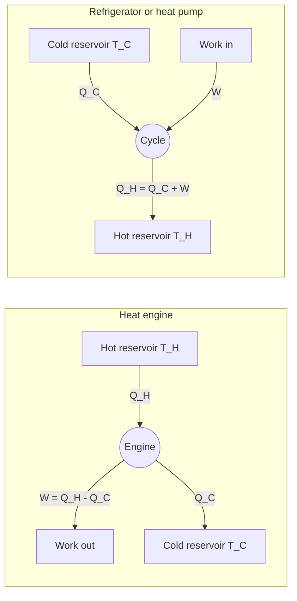
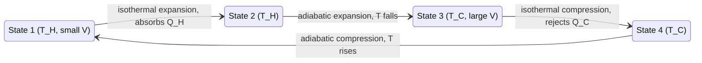

[Physics](./) &raquo; Thermodynamics

**Thermodynamics** is the theory of energy, heat, and work in macroscopic systems. It describes a system with a handful of bulk variables (pressure, volume, temperature, energy, entropy) and a few universal laws that constrain how those variables can change, without reference to what the system is made of. The same laws govern steam, magnets, chemical reactions, radiation, and black holes. This page covers the classical, equilibrium theory: systems and state variables, the four laws, entropy, ideal-gas processes, the thermodynamic potentials, phase equilibrium, and the engine and refrigeration cycles bounded by the Carnot limit. The formal and modern extensions (Legendre structure, critical phenomena, non-equilibrium, stochastic, and quantum thermodynamics) are on [Thermodynamics: Advanced Topics](thermodynamics-advanced.html); the microscopic derivation is in [Statistical Mechanics](statistical-mechanics/).

## Overview

A gas contains roughly $10^{23}$ molecules obeying reversible mechanical laws, yet experiments measure only a few averaged quantities and find relations among them that hold regardless of microscopic detail. Thermodynamics is the framework for those relations. It replaces $10^{23}$ coordinates with a few **state variables** and adds one ingredient that mechanics lacks: a direction for spontaneous change. Newton's and Schrödinger's equations run equally well backwards, but heat never flows unaided from cold to hot and a broken glass never reassembles. That asymmetry is captured by entropy and the Second Law.

The subject grew out of engineering. In 1824 Sadi Carnot asked what fraction of the heat drawn from a furnace any engine could turn into work, and found that the ceiling depends only on the reservoir temperatures:

$$\eta_{\max} = 1 - \frac{T_C}{T_H}.$$

The working fluid and the mechanism do not enter. Work can be converted entirely into heat (friction does it), but heat can never be converted entirely into work in a cycle. Clausius (1850s–1865) turned this into the Second Law and defined entropy; Kelvin fixed the absolute temperature scale; Gibbs (1870s) built the theory of potentials and phase equilibrium; Boltzmann connected entropy to the counting of microstates.

| Law | Statement | Consequence | Key relation |
|-----|-----------|-------------|--------------|
| Zeroth | Thermal equilibrium is transitive | Temperature exists and can be measured | $A \sim C,\ B \sim C \Rightarrow A \sim B$ |
| First | Energy is conserved; heat is a form of energy transfer | No perpetual motion of the first kind | $dU = \delta Q - \delta W$ |
| Second | Entropy of an isolated system never decreases | No perpetual motion of the second kind; Carnot bound | $dS \geq \delta Q / T$ |
| Third | Entropy tends to a constant as $T \to 0$ | Absolute zero is unattainable in finitely many steps | $\lim_{T \to 0} \Delta S = 0$ |

## Systems, States, and Variables

### Types of system

| System | Exchanges energy? | Exchanges matter? | Example |
|--------|-------------------|-------------------|---------|
| Isolated | No | No | Gas in a sealed, insulated rigid box |
| Closed | Yes (heat and work) | No | Gas in a piston–cylinder |
| Open | Yes | Yes | Turbine, compressor, living cell |

Walls are classified by what they transmit: **adiabatic** walls block heat, **diathermal** walls pass it, **rigid** walls block work by volume change, and **permeable** walls pass particles.

### State variables and equilibrium

A system is in **thermodynamic equilibrium** when its macroscopic variables do not change in time and there are no net internal flows of heat, matter, or momentum. In equilibrium a small set of variables fixes the state completely; for a simple one-component fluid, any two of $(P, V, T)$ plus the amount $n$ suffice.

- **Extensive** variables scale with system size: $V$, $U$, $S$, $N$, $H$, $F$, $G$.
- **Intensive** variables do not: $T$, $P$, $\mu$, density. The ratio of two extensive variables is intensive.
- **State functions** ($U$, $S$, $H$, $F$, $G$) depend only on the current state; their change between two states is path-independent, and $\oint dU = 0$ around any cycle.
- **Path functions** — heat $Q$ and work $W$ — are not properties of a state but amounts transferred along a process. Their infinitesimal forms are written $\delta Q$, $\delta W$ (inexact differentials).

A **quasi-static** process passes through a continuous sequence of equilibrium states, so it can be drawn as a curve on a state diagram. A **reversible** process is quasi-static *and* free of dissipation (friction, finite-temperature-difference heat flow, unrestrained expansion); it can be run backwards leaving no trace in the surroundings. Reversible processes are idealizations, but they set the limits every real process is measured against.

### Equations of state

An **equation of state** relates the state variables of a particular substance. It is empirical input: the laws of thermodynamics do not supply it.

**Ideal gas** — point particles with no interactions, accurate for dilute gases:

$$PV = nRT = N k_B T.$$

**Van der Waals gas** — adds a finite molecular volume $b$ and a mean attraction $a$, and qualitatively captures condensation and a critical point:

$$\left(P + \frac{a n^2}{V^2}\right)(V - nb) = nRT, \qquad T_c = \frac{8a}{27Rb},\quad P_c = \frac{a}{27b^2},\quad V_c = 3nb.$$

Real-fluid engineering calculations use multiparameter reference equations (for example the IAPWS-95 formulation for water) implemented in libraries such as CoolProp and NIST REFPROP.

## The Laws of Thermodynamics

<p class="referenceBoxes type3"><a href="https://www.gutenberg.org/files/33229/33229-pdf.pdf"> Paper: <b><i>Reflections on the Motive Power of Fire</i></b> - Sadi Carnot</a></p>

### Zeroth law and temperature

If systems $A$ and $B$ are each in thermal equilibrium with a third system $C$, they are in thermal equilibrium with each other. Transitivity lets $C$ serve as a thermometer: all systems in mutual equilibrium share one value of an intensive property, the **temperature**.

The absolute (thermodynamic) temperature scale is defined independently of any substance through the Carnot efficiency, $T_C/T_H = Q_C/Q_H$ for a reversible engine. Since the 2019 redefinition of the SI base units, the kelvin is fixed by assigning the Boltzmann constant the exact value $k_B = 1.380649 \times 10^{-23}\ \text{J/K}$; the triple point of water (273.16 K) is now a measured quantity rather than the definition. Practical thermometry still uses the ITS-90 scale of fixed points.

### First law: energy conservation

For a closed system, the change in internal energy equals the heat added minus the work done *by* the system:

$$dU = \delta Q - \delta W, \qquad \Delta U = Q - W.$$

For quasi-static expansion work, $\delta W = P\,dV$. Around a complete cycle $\Delta U = 0$, so the net work output equals the net heat input: $\oint \delta Q = \oint \delta W$.

| Convention | First law | $W$ means | Common in |
|------------|-----------|-----------|-----------|
| Clausius / engineering | $\Delta U = Q - W$ | Work done **by** the system | Physics, mechanical engineering (used on this page) |
| IUPAC / chemistry | $\Delta U = Q + W$ | Work done **on** the system | Chemistry, many modern textbooks |

Both conventions describe the same physics; only the sign of $W$ differs. Check which one a source uses before combining formulas.

For an **open system** in steady flow (turbine, nozzle, compressor), the natural energy variable is the enthalpy $H = U + PV$, which absorbs the "flow work" needed to push fluid in and out:

$$\dot{Q} - \dot{W}_{\text{shaft}} = \dot{m}\left[(h_2 - h_1) + \tfrac{1}{2}(v_2^2 - v_1^2) + g(z_2 - z_1)\right],$$

where $h$ is specific enthalpy. This steady-flow energy equation is the working form of the First Law for power plants and refrigeration.

### Second law: direction and limits

The Second Law has several equivalent classical statements:

- **Clausius**: no process whose *sole* result is the transfer of heat from a colder body to a hotter one.
- **Kelvin–Planck**: no cyclic process whose *sole* result is the absorption of heat from a single reservoir and its complete conversion into work.
- **Carathéodory**: in every neighbourhood of any equilibrium state there are states that cannot be reached from it by an adiabatic process.

The Clausius and Kelvin–Planck statements are equivalent: a device violating one can be combined with an ordinary engine or refrigerator to violate the other. From them follows the **Clausius inequality** for any cycle,

$$\oint \frac{\delta Q}{T} \leq 0,$$

with equality only for reversible cycles. Equality means $\delta Q_{\text{rev}}/T$ is an exact differential, which defines the **entropy**:

$$dS = \frac{\delta Q_{\text{rev}}}{T}, \qquad dS \geq \frac{\delta Q}{T}\ \text{(any process)}.$$

For an isolated system $\delta Q = 0$, so $\Delta S \geq 0$: entropy increases in every spontaneous process and is constant only in reversible ones. Section [Entropy](#entropy) develops this further.

### Third law: the approach to absolute zero

The Third Law has three related forms:

- **Nernst heat theorem** (1906): the entropy change of any isothermal process between equilibrium states of a condensed system tends to zero as $T \to 0$.
- **Planck statement** (1911): the entropy of a perfect crystal of a pure substance tends to zero as $T \to 0$, which fixes an absolute zero for entropy.
- **Unattainability principle**: no process can cool a system to $T = 0$ in a finite number of steps.

Consequences include the vanishing of heat capacities, of thermal expansion, and of the slope of the melting curve of helium as $T \to 0$. Glasses and some crystals (CO, ice) retain a **residual entropy** at low temperature because they freeze into one of many disordered configurations, which is why the Planck form specifies perfect crystals. Masanes and Oppenheim (*Nature Communications*, 2017) derived the unattainability principle from quantum-information arguments and quantified it, bounding the time needed to cool a system toward absolute zero.

## Heat Capacity and the Ideal Gas

The heat capacity measures how much heat a system absorbs per unit temperature rise, and depends on what is held fixed:

$$C_V = \left(\frac{\partial U}{\partial T}\right)_V, \qquad C_P = \left(\frac{\partial H}{\partial T}\right)_P.$$

For an ideal gas $U$ depends only on $T$, and the two capacities differ by **Mayer's relation**:

$$C_P - C_V = nR, \qquad \gamma \equiv \frac{C_P}{C_V} > 1.$$

By equipartition, each quadratic degree of freedom that is thermally active contributes $\tfrac{1}{2}R$ per mole to $C_V$:

| Gas | Active degrees of freedom (near room temperature) | $C_V$ per mole | $C_P$ per mole | $\gamma$ |
|-----|---------------------------------------------------|----------------|----------------|----------|
| Monatomic (He, Ar) | 3 translational | $\tfrac{3}{2}R$ | $\tfrac{5}{2}R$ | $5/3 \approx 1.67$ |
| Diatomic (N$_2$, O$_2$, air) | 3 translational + 2 rotational | $\tfrac{5}{2}R$ | $\tfrac{7}{2}R$ | $7/5 = 1.40$ |
| Nonlinear polyatomic (CH$_4$) | 3 translational + 3 rotational (+ vibrations when hot) | $\geq 3R$ | $\geq 4R$ | $\leq 1.33$ |

Vibrational modes freeze out at room temperature because their quantum spacing exceeds $k_B T$; this failure of classical equipartition was one of the early clues to quantum mechanics. For general substances, $C_P - C_V = TV\alpha^2/\kappa_T$, where $\alpha$ is the thermal expansion coefficient and $\kappa_T$ the isothermal compressibility (derived from the Maxwell relations below).

The entropy change of an ideal gas between any two states follows from integrating $dS = (dU + P\,dV)/T$:

$$\Delta S = n C_{V,m} \ln\frac{T_2}{T_1} + nR \ln\frac{V_2}{V_1}.$$

## Thermodynamic Processes

<p class="referenceBoxes type3"><a href="https://phet.colorado.edu/en/simulation/gas-properties"> Interactive: <b><i>Gas Properties Simulation</i></b></a></p>

Four idealized quasi-static processes each hold one quantity fixed. Starting from a common state $A$, they trace distinct curves on a $P$–$V$ diagram:

<div style="overflow-x:auto; text-align:center;">
<svg viewBox="0 0 560 290" style="max-width:560px; width:100%; color:inherit;" role="img" aria-label="P-V diagram of the four ideal-gas processes through a common state A: horizontal isobar, vertical isochore, isotherm hyperbola, and the steeper adiabat">
<g fill="none" stroke="currentColor">
<path d="M60,250 L480,250" stroke-width="1.5"/>
<path d="M60,250 L60,20" stroke-width="1.5"/>
<path d="M82.2,165.4 L445.2,165.4" stroke-width="2"/>
<path d="M163.7,239.8 L163.7,38.5" stroke-width="2" stroke-dasharray="2 4"/>
<path d="M82.2,62.0 L94.7,91.7 L107.3,113.3 L119.8,129.7 L132.3,142.6 L144.8,153.0 L157.3,161.6 L169.8,168.7 L182.3,174.8 L194.9,180.1 L207.4,184.7 L219.9,188.7 L232.4,192.2 L244.9,195.3 L257.4,198.2 L270.0,200.7 L282.5,203.0 L295.0,205.1 L307.5,207.1 L320.0,208.8 L332.5,210.5 L345.1,212.0 L357.6,213.3 L370.1,214.6 L382.6,215.8 L395.1,217.0 L407.6,218.0 L420.2,219.0 L432.7,219.9 L445.2,220.8" stroke-width="2" stroke-dasharray="8 4"/>
<path d="M92.6,38.6 L104.8,77.8 L116.9,106.0 L129.1,127.2 L141.2,143.5 L153.4,156.4 L165.5,166.8 L177.7,175.4 L189.9,182.6 L202.0,188.7 L214.2,193.9 L226.3,198.4 L238.5,202.3 L250.7,205.7 L262.8,208.7 L275.0,211.4 L287.1,213.8 L299.3,215.9 L311.4,217.9 L323.6,219.6 L335.8,221.2 L347.9,222.7 L360.1,224.0 L372.2,225.3 L384.4,226.4 L396.6,227.5 L408.7,228.4 L420.9,229.3 L433.0,230.2 L445.2,230.9" stroke-width="2.5"/>
</g>
<circle cx="163.7" cy="165.4" r="5" fill="currentColor"/>
<g fill="currentColor" font-size="14" font-family="sans-serif">
<text x="172" y="158">A</text>
<text x="470" y="270" text-anchor="middle">V</text>
<text x="45" y="30" text-anchor="middle">P</text>
<text x="452" y="169">isobaric (P const)</text>
<text x="452" y="216">isothermal (PV const)</text>
<text x="452" y="236">adiabatic (PV&#947; const)</text>
<text x="172" y="36">isochoric (V const)</text>
</g>
</svg>
</div>

The adiabat is steeper than the isotherm through the same point by a factor $\gamma$ in slope. Expanding adiabatically, the gas does work at the expense of its internal energy and cools, so its pressure falls faster than $PV = \text{const}$ would allow. That difference in slope is what lets a cycle of isotherms and adiabats enclose area and produce net work.

| Process | Held fixed | Path equation (ideal gas) | Work by gas $W$ | Heat in $Q$ | $\Delta U$ |
|---------|------------|---------------------------|-----------------|-------------|------------|
| Isothermal | $T$ | $PV = \text{const}$ | $nRT\ln(V_f/V_i)$ | $= W$ | $0$ |
| Adiabatic (reversible) | $Q = 0$, $S$ | $PV^{\gamma} = \text{const}$, $TV^{\gamma-1} = \text{const}$ | $\dfrac{P_iV_i - P_fV_f}{\gamma - 1} = -nC_V\Delta T$ | $0$ | $nC_V\Delta T$ |
| Isobaric | $P$ | $V/T = \text{const}$ | $P(V_f - V_i)$ | $nC_P\Delta T$ | $nC_V\Delta T$ |
| Isochoric | $V$ | $P/T = \text{const}$ | $0$ | $nC_V\Delta T$ | $nC_V\Delta T$ |

Two further processes matter in practice:

- **Free (Joule) expansion** into vacuum: $Q = 0$ and $W = 0$, so $\Delta U = 0$ and an ideal gas keeps its temperature. The process is irreversible; the entropy still rises by $nR\ln(V_f/V_i)$, computed along any reversible path between the same end states.
- **Throttling (Joule–Thomson)** through a valve or porous plug is isenthalpic ($H_1 = H_2$). A real gas cools on throttling when the Joule–Thomson coefficient $\mu_{JT} = (\partial T/\partial P)_H = \frac{V}{C_P}(T\alpha - 1)$ is positive, which is true below the gas's inversion temperature. This is the basis of the Linde–Hampson liquefaction process and of every vapor-compression refrigerator's expansion valve.

## Entropy

Entropy has two complementary definitions that agree wherever both apply.

- **Thermodynamic (Clausius)**: $dS = \delta Q_{\text{rev}}/T$. Only differences are defined, until the Third Law fixes the zero.
- **Statistical (Boltzmann)**: $S = k_B \ln \Omega$, where $\Omega$ is the number of microstates consistent with the macrostate. The more general Gibbs form is $S = -k_B \sum_i p_i \ln p_i$ over microstate probabilities $p_i$.

"Disorder" is a loose gloss. Entropy measures how many microscopic arrangements are compatible with what is known macroscopically, which is why it connects directly to information theory: Shannon entropy is the same formula without $k_B$. The Second Law is then a statement of overwhelming probability. For a macroscopic system, macrostates of higher entropy correspond to exponentially more microstates, so a system starting in a low-entropy state is carried toward higher entropy by its dynamics. The time-reversal asymmetry comes from the low-entropy initial condition, not from the microscopic laws.

**Entropy generation.** Every irreversibility produces entropy, $S_{\text{gen}} = \Delta S_{\text{system}} + \Delta S_{\text{surroundings}} \geq 0$. Two standard cases:

- *Heat flow across a finite temperature difference.* Heat $Q$ passing from a body at $T_H$ to one at $T_C$ generates $S_{\text{gen}} = Q\left(\frac{1}{T_C} - \frac{1}{T_H}\right) > 0$.
- *Mixing of two different ideal gases*, each initially occupying part of a container: $\Delta S_{\text{mix}} = -nR\sum_i x_i \ln x_i > 0$. Mixing identical gases produces no entropy (the Gibbs paradox, resolved by the indistinguishability of identical particles).

The work that could have been extracted but was not is the **lost work** $W_{\text{lost}} = T_0 S_{\text{gen}}$ (the Gouy–Stodola theorem, with $T_0$ the environment temperature). Engineers use this to locate the largest losses in a plant through **exergy** analysis.

## Thermodynamic Potentials

<p class="referenceBoxes type3"><a href="https://www.feynmanlectures.caltech.edu/I_44.html"> Lecture: <b><i>The Laws of Thermodynamics - Feynman Lectures</i></b></a></p>

Combining the First and Second Laws for a reversible change in a simple system with a variable particle number gives the **fundamental thermodynamic relation**:

$$dU = T\,dS - P\,dV + \mu\,dN.$$

It contains everything about the equilibrium thermodynamics of the system once $U(S, V, N)$ is known. The **chemical potential** $\mu = (\partial U/\partial N)_{S,V}$ is the energy cost of adding one particle; particles flow from high $\mu$ to low $\mu$, as heat flows from high $T$ to low $T$.

Because $S$ is hard to control in the laboratory, it is convenient to define other energy-like functions whose natural variables are the ones actually held fixed. They are related by Legendre transforms (see [Advanced Topics](thermodynamics-advanced.html)):

| Potential | Definition | Differential | Natural variables | Minimized at equilibrium when | Typical use |
|-----------|------------|--------------|-------------------|-------------------------------|-------------|
| Internal energy $U$ | — | $T\,dS - P\,dV + \mu\,dN$ | $S, V, N$ | $S, V$ fixed | Isentropic processes; foundations |
| Enthalpy $H$ | $U + PV$ | $T\,dS + V\,dP + \mu\,dN$ | $S, P, N$ | $S, P$ fixed | Flow processes, heats of reaction |
| Helmholtz $F$ | $U - TS$ | $-S\,dT - P\,dV + \mu\,dN$ | $T, V, N$ | $T, V$ fixed | Rigid vessels; statistical mechanics ($F = -k_BT\ln Z$) |
| Gibbs $G$ | $H - TS$ | $-S\,dT + V\,dP + \mu\,dN$ | $T, P, N$ | $T, P$ fixed | Chemistry, phase equilibrium, electrochemistry |

Some useful interpretations:

- At constant pressure, $\Delta H = Q_P$: enthalpy change is the heat measured in an open-to-atmosphere calorimeter.
- At constant temperature, $-\Delta F$ is the maximum total work a system can deliver.
- At constant temperature and pressure, $-\Delta G$ is the maximum **non-expansion** work (for example electrical work in a battery or fuel cell: $\Delta G = -nFE_{\text{cell}}$ with Faraday's constant $F$).

**Spontaneity.** At fixed $T$ and $P$, a process proceeds spontaneously if $\Delta G < 0$, is at equilibrium if $\Delta G = 0$, and does not proceed if $\Delta G > 0$. Writing $\Delta G = \Delta H - T\Delta S$ shows the competition between lowering energy and raising entropy:

| $\Delta H$ | $\Delta S$ | Spontaneous? | Example |
|------------|------------|--------------|---------|
| $< 0$ | $> 0$ | At all temperatures | Combustion |
| $< 0$ | $< 0$ | Below $T = \Delta H/\Delta S$ | Freezing of water below 0 °C |
| $> 0$ | $> 0$ | Above $T = \Delta H/\Delta S$ | Melting of ice above 0 °C |
| $> 0$ | $< 0$ | Never | — |

A system held at fixed $T$ does not minimize its energy; it exchanges heat with its surroundings, and the quantity that reaches a minimum is the free energy. $\Delta G < 0$ says nothing about *rate*: diamond is thermodynamically unstable relative to graphite at room conditions but converts immeasurably slowly. Thermodynamics tells which way a process can go; kinetics tells how fast.

### Maxwell relations

Each potential is a state function, so its mixed second partial derivatives are equal. Applied to the four differentials above (at fixed $N$), this gives the Maxwell relations:

$$\left(\frac{\partial T}{\partial V}\right)_S = -\left(\frac{\partial P}{\partial S}\right)_V, \qquad \left(\frac{\partial T}{\partial P}\right)_S = \left(\frac{\partial V}{\partial S}\right)_P,$$

$$\left(\frac{\partial S}{\partial V}\right)_T = \left(\frac{\partial P}{\partial T}\right)_V, \qquad \left(\frac{\partial S}{\partial P}\right)_T = -\left(\frac{\partial V}{\partial T}\right)_P.$$

Their practical value is that they convert derivatives involving entropy, which cannot be measured directly, into derivatives of the equation of state. For example, the third relation yields the **energy equation**

$$\left(\frac{\partial U}{\partial V}\right)_T = T\left(\frac{\partial P}{\partial T}\right)_V - P,$$

which is zero for an ideal gas (so $U = U(T)$) and equals $an^2/V^2$ for a van der Waals gas. The [advanced page](thermodynamics-advanced.html) gives the Legendre-transform derivation, the thermodynamic square mnemonic, and the Jacobian method.

## Phase Equilibrium

Two phases of a substance coexist in equilibrium when they share the same temperature, pressure, and chemical potential. Per mole of a pure substance $\mu = G_m$, so the phase with the lowest molar Gibbs energy is the stable one, and phase boundaries are where two such curves cross.

**Gibbs phase rule.** For $C$ independent components in $\Pi$ coexisting phases, the number of intensive variables that can be varied independently is

$$\mathcal{F} = C - \Pi + 2.$$

For pure water ($C = 1$): a single phase has $\mathcal{F} = 2$ (a region of the $P$–$T$ diagram), two coexisting phases have $\mathcal{F} = 1$ (a coexistence line), and three phases coexist only at an isolated **triple point** ($\mathcal{F} = 0$). The liquid–vapor line ends at the **critical point** (647.096 K, 22.064 MPa for water), beyond which liquid and gas are indistinguishable.

**Clausius–Clapeyron relation.** Equating $d\mu$ on both sides of a coexistence line gives its slope in terms of the latent heat $L$ and the volume change $\Delta V$ of the transition:

$$\frac{dP}{dT} = \frac{L}{T\,\Delta V}.$$

For liquid–vapor coexistence far below the critical point, neglecting the liquid volume and treating the vapor as ideal, this integrates to $\ln P \approx -L_m/(RT) + \text{const}$, the familiar exponential rise of vapor pressure with temperature. Water's solid–liquid line has negative slope because ice is less dense than liquid water ($\Delta V < 0$ on melting).

**Classification.** Transitions with a latent heat and a jump in density or entropy (melting, boiling) are **first order**: the first derivatives of $G$ are discontinuous. Transitions where these are continuous but response functions diverge (the Curie point of a ferromagnet, the liquid–gas critical point, the superfluid transition of helium-4) are **continuous** or critical. Their theory, including critical exponents, universality, and the renormalization group, is on the [advanced page](thermodynamics-advanced.html).

## Heat Engines, Refrigerators, and Heat Pumps

A **heat engine** takes heat $Q_H$ from a hot reservoir, rejects $Q_C$ to a cold reservoir, and delivers work $W = Q_H - Q_C$. A **refrigerator** or **heat pump** runs the same cycle backwards, using work to move heat from cold to hot.


```mermaid
flowchart LR
    subgraph ENG["Heat engine"]
        H1["Hot reservoir T_H"] -->|"Q_H"| E(("Engine"))
        E -->|"W = Q_H - Q_C"| W1["Work out"]
        E -->|"Q_C"| C1["Cold reservoir T_C"]
    end
    subgraph REF["Refrigerator or heat pump"]
        C2["Cold reservoir T_C"] -->|"Q_C"| R(("Cycle"))
        W2["Work in"] -->|"W"| R
        R -->|"Q_H = Q_C + W"| H2["Hot reservoir T_H"]
    end
```

| Device | Figure of merit | Carnot (reversible) limit |
|--------|-----------------|---------------------------|
| Heat engine | $\eta = W/Q_H$ | $1 - T_C/T_H$ |
| Refrigerator / air conditioner | $\text{COP}_R = Q_C/W$ | $T_C/(T_H - T_C)$ |
| Heat pump (heating) | $\text{COP}_{HP} = Q_H/W$ | $T_H/(T_H - T_C)$ |

$\text{COP}_{HP} = \text{COP}_R + 1$, and both can exceed 1 because the work only *moves* heat rather than producing it.

### The Carnot cycle

The Carnot cycle consists of two reversible isotherms joined by two reversible adiabats:


```mermaid
stateDiagram-v2
    direction LR
    S1: State 1 (T_H, small V)
    S2: State 2 (T_H)
    S3: State 3 (T_C, large V)
    S4: State 4 (T_C)
    S1 --> S2: isothermal expansion, absorbs Q_H
    S2 --> S3: adiabatic expansion, T falls
    S3 --> S4: isothermal compression, rejects Q_C
    S4 --> S1: adiabatic compression, T rises
```

For an ideal gas, $Q_H = nRT_H\ln(V_2/V_1)$ and $Q_C = nRT_C\ln(V_3/V_4)$. The adiabat relations $T_HV_2^{\gamma-1} = T_CV_3^{\gamma-1}$ and $T_HV_1^{\gamma-1} = T_CV_4^{\gamma-1}$ give $V_3/V_4 = V_2/V_1$, so

$$\frac{Q_C}{Q_H} = \frac{T_C}{T_H}, \qquad \eta_{\text{Carnot}} = 1 - \frac{T_C}{T_H}.$$

**Carnot's theorem.** No engine operating between two reservoirs is more efficient than a reversible one, and all reversible engines between the same reservoirs have the same efficiency. If a more efficient engine existed, it could drive a reversed Carnot engine to move heat from cold to hot with no other effect, violating the Clausius statement. Because the result is independent of the working substance, it defines the thermodynamic temperature scale.

A reversible engine is infinitely slow and produces zero power. For an engine limited by finite-rate heat transfer and run at maximum power, the Curzon–Ahlborn (Novikov) efficiency $\eta_{CA} = 1 - \sqrt{T_C/T_H}$ is a better guide to what real plants achieve.

### Practical cycles

| Cycle | Idealized processes | Ideal efficiency | Application |
|-------|---------------------|------------------|-------------|
| Carnot | 2 isotherms + 2 adiabats | $1 - T_C/T_H$ | Theoretical upper bound |
| Otto | 2 adiabats + 2 isochores | $1 - r^{1-\gamma}$ ($r$ = compression ratio) | Spark-ignition (gasoline) engines |
| Diesel | 2 adiabats + isobaric heat addition + isochoric rejection | $1 - \dfrac{1}{r^{\gamma-1}}\dfrac{r_c^{\gamma} - 1}{\gamma(r_c - 1)}$ ($r_c$ = cutoff ratio) | Compression-ignition engines |
| Brayton (Joule) | 2 adiabats + 2 isobars | $1 - r_p^{-(\gamma-1)/\gamma}$ ($r_p$ = pressure ratio) | Gas turbines, jet engines |
| Rankine | Pump, boiler, turbine, condenser (liquid–vapor phase change) | From steam tables | Steam power plants, nuclear, solar thermal |
| Stirling / Ericsson | 2 isotherms + 2 isochores / isobars, with regenerator | $1 - T_C/T_H$ with an ideal regenerator | Stirling engines, cryocoolers |
| Vapor compression | Compressor, condenser, expansion valve, evaporator | $\text{COP}$ from refrigerant tables | Refrigerators, air conditioners, heat pumps |

For the same compression ratio the Otto cycle is more efficient than the Diesel cycle, but diesel engines tolerate much higher compression ratios (roughly 15–22 versus 8–13 for gasoline engines, where knock limits compression), and so achieve higher efficiency in practice. A **combined-cycle** plant feeds the hot exhaust of a Brayton gas turbine into a Rankine steam cycle, so the gas turbine's "waste" heat drives a second engine.

### Worked examples

**Steam power plant.** A turbine receives steam at $T_H = 810$ K and condenses it against river water at $T_C = 300$ K. The Carnot limit is

$$\eta_{\max} = 1 - \frac{300}{810} \approx 0.63.$$

Subcritical coal plants reach about 33–38%, and supercritical and ultra-supercritical units about 42–47%, because of irreversibilities (finite-rate heat transfer, friction, throttling) and because heat is not all added at the peak temperature. The rejected heat is not a design failure; the Second Law requires it. Raising $T_H$, the reason for ever-hotter turbine materials, is the main route to higher efficiency. Combined-cycle gas plants exceed 60%: EDF's Bouchain plant (GE 9HA turbine) was certified at 62.22% net efficiency in 2016.

**Otto engine.** For $r = 10$ and $\gamma = 1.4$, $\eta_{\text{Otto}} = 1 - 10^{-0.4} \approx 0.60$. Real spark-ignition engines achieve roughly 25–40% brake efficiency, the gap coming from heat loss to the cylinder walls, finite combustion time, pumping losses, friction, and a working fluid whose $\gamma$ falls at high temperature.

**Heat pump.** Heating a house to $T_H = 293$ K from outdoor air at $T_C = 273$ K has a Carnot limit of $\text{COP}_{HP} = 293/20 \approx 14.7$. Real air-source heat pumps achieve a COP of roughly 2–5, lower in cold weather because the temperature lift grows; ground-source units, drawing on a steadier ground temperature, typically reach 3–6. Even a COP of 3 delivers three times more heat than resistive heating for the same electricity, which is why heat pumps are central to building decarbonization.

## Code Example: Carnot Cycle

The script traces an ideal-gas Carnot cycle on the $P$–$V$ plane, integrates $\oint P\,dV$ numerically, and checks the result against the analytic work $(T_H - T_C)\,nR\ln(V_2/V_1)$ and the Carnot efficiency. Units are normalized so that $nR = 1$. It requires NumPy 2.0 or later (`np.trapezoid`; use `np.trapz` on older versions).

```python
import numpy as np

def carnot_cycle(T_hot=600.0, T_cold=300.0, V1=1.0, V2=2.0, gamma=1.4, nR=1.0, n=400):
    """Trace an ideal-gas Carnot cycle; return the P-V path, net work, and efficiency."""
    k = 1.0 / (gamma - 1.0)                      # from T V^(gamma-1) = const
    V3 = V2 * (T_hot / T_cold) ** k              # end of adiabatic expansion
    V4 = V1 * (T_hot / T_cold) ** k              # start of adiabatic compression

    def isotherm(T, Va, Vb):
        V = np.linspace(Va, Vb, n)
        return V, nR * T / V

    def adiabat(Va, Vb, Pa):
        V = np.linspace(Va, Vb, n)
        return V, Pa * (Va / V) ** gamma

    legs = [isotherm(T_hot, V1, V2)]                       # 1 -> 2
    legs.append(adiabat(V2, V3, legs[-1][1][-1]))          # 2 -> 3
    legs.append(isotherm(T_cold, V3, V4))                  # 3 -> 4
    legs.append(adiabat(V4, V1, legs[-1][1][-1]))          # 4 -> 1

    W_net = sum(np.trapezoid(P, V) for V, P in legs)       # closed-loop integral of P dV
    Q_hot = nR * T_hot * np.log(V2 / V1)                   # heat absorbed on 1 -> 2
    return legs, W_net, W_net / Q_hot

legs, W, eta = carnot_cycle()
print(f"net work      W   = {W:.2f}  (exact: {(600 - 300) * np.log(2):.2f})")
print(f"efficiency    eta = {eta:.4f}  (Carnot: {1 - 300 / 600:.4f})")

# Optional plot:
# import matplotlib.pyplot as plt
# for V, P in legs: plt.plot(V, P)
# plt.xlabel("V"); plt.ylabel("P"); plt.title("Carnot cycle"); plt.show()
```

Output:

```text
net work      W   = 207.94  (exact: 207.94)
efficiency    eta = 0.5000  (Carnot: 0.5000)
```

The adiabatic legs contribute equal and opposite work, so the net work comes entirely from the two isotherms, as the analytic derivation predicts.

## Applications

| Field | Thermodynamic content |
|-------|-----------------------|
| Power generation | Rankine (steam), Brayton (gas turbine), and combined cycles; exergy analysis; cooling-water and cooling-tower design |
| Refrigeration, HVAC, heat pumps | Vapor-compression and absorption cycles; refrigerant selection under the Kigali Amendment's phase-down of high-GWP HFCs, with a shift toward low-GWP working fluids such as R-290 (propane), CO$_2$ (R-744), and HFOs |
| Chemical engineering | Reaction equilibria from $\Delta G^\circ = -RT\ln K$; vapor–liquid equilibrium for distillation; equations of state for process simulation |
| Materials science | Phase diagrams and CALPHAD modelling; heat treatment; solidification |
| Electrochemistry | Cell voltages and battery limits from $\Delta G = -nFE$; fuel-cell efficiency bounds |
| Atmosphere and climate | Adiabatic lapse rate, latent heat in convection, Clausius–Clapeyron scaling of water vapor (about 7% per kelvin of warming) |
| Computing | Heat dissipation limits; Landauer's bound on the energy cost of erasing information (see [Advanced Topics](thermodynamics-advanced.html#thermodynamics-of-information)) |

## Further Reading

<p class="referenceBoxes type3"><a href="https://www.feynmanlectures.caltech.edu/I_44.html"> Book: <b><i>The Feynman Lectures on Physics - Thermodynamics</i></b></a></p>
<p class="referenceBoxes type3"><a href="https://en.wikipedia.org/wiki/Laws_of_thermodynamics"> Article: <b><i>Laws of Thermodynamics - Wikipedia</i></b></a></p>
<p class="referenceBoxes type3"><a href="https://ocw.mit.edu/courses/chemistry/5-60-thermodynamics-kinetics-spring-2008/"> Course: <b><i>MIT 5.60 Thermodynamics & Kinetics</i></b></a></p>
<p class="referenceBoxes type3"><a href="https://www.youtube.com/watch?v=Xb05CaG7TsQ"> Video: <b><i>The Laws of Thermodynamics Explained</i></b></a></p>
<p class="referenceBoxes type3"><a href="https://github.com/CalebBell/thermo"> Library: <b><i>thermo - Chemical engineering thermodynamics in Python</i></b></a></p>
<p class="referenceBoxes type3"><a href="https://github.com/CoolProp/CoolProp"> Library: <b><i>CoolProp - Thermophysical properties of fluids</i></b></a></p>

Standard textbooks: Callen, *Thermodynamics and an Introduction to Thermostatistics*; Fermi, *Thermodynamics* (short and classic); Schroeder, *An Introduction to Thermal Physics*; Çengel and Boles, *Thermodynamics: An Engineering Approach*.

## See Also

- [Thermodynamics: Advanced Topics](thermodynamics-advanced.html) — Legendre structure, critical phenomena and the renormalization group, non-equilibrium, stochastic, and quantum thermodynamics.
- [Statistical Mechanics](statistical-mechanics/) — the microscopic foundation that derives thermodynamics from counting microstates.
- [Fluid Mechanics](fluid-mechanics.html) — compressible flow and energy transport in moving fluids.
- [Classical Mechanics](classical-mechanics/) — work, energy, and the mechanical origin of the First Law.
- [Quantum Mechanics](quantum-mechanics/) — quantized energy levels and the freezing out of degrees of freedom.
- [Black Holes](relativity/black-holes.html) — black-hole thermodynamics and Bekenstein–Hawking entropy.
- [Computational Physics](computational-physics/) — Monte Carlo and molecular dynamics for thermal systems.
