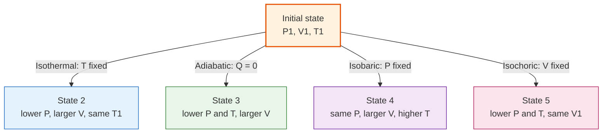

<div class="hero-section" style="background: linear-gradient(135deg, #11998e 0%, #38ef7d 100%); color: white; padding: 3rem 2rem; margin: -2rem -3rem 2rem -3rem; text-align: center;">
  <h1 style="color: white; margin: 0; font-size: 2.5rem;">Thermodynamics</h1>
  <p style="font-size: 1.25rem; margin-top: 1rem; opacity: 0.9;">The science of heat, energy, and work, governing everything from steam engines to the fate of the universe.</p>
</div>

[Physics](./) &raquo; Thermodynamics

<!-- Custom styles are now loaded via main.scss -->

<div class="intro-card">
  <p class="lead-text">Thermodynamics is the physics of energy in transit. It does not care what a system is made of — atoms, photons, or black holes obey the same four laws. Born from the practical question "how much work can I get from heat?", it grew into one of the most universal frameworks in science, constraining everything from chemical reactions to the arrow of time itself.</p>
</div>

<div class="key-insights">
  <div class="insight-card">
    <i class="fas fa-balance-scale"></i>
    <h4>Energy is conserved</h4>
    <p>The First Law: you can't get something for nothing — energy only changes form.</p>
  </div>
  <div class="insight-card">
    <i class="fas fa-arrow-trend-up"></i>
    <h4>Entropy increases</h4>
    <p>The Second Law: isolated systems run downhill toward disorder, defining time's direction.</p>
  </div>
  <div class="insight-card">
    <i class="fas fa-snowflake"></i>
    <h4>Absolute zero is unreachable</h4>
    <p>The Third Law: entropy approaches a constant as $T \to 0$, and you can never quite get there.</p>
  </div>
  <div class="insight-card">
    <i class="fas fa-cogs"></i>
    <h4>Efficiency has a ceiling</h4>
    <p>No engine beats Carnot: $\eta_{\max} = 1 - T_C/T_H$, set purely by the two temperatures.</p>
  </div>
</div>

## Why Thermodynamics?

In principle, a gas is just $10^{23}$ molecules obeying Newton's laws, so why not simply integrate the equations of motion? Because that program is hopeless and, more deeply, beside the point. No experiment ever measures the position of an individual molecule; what we measure are a handful of bulk quantities — pressure, temperature, volume, energy — and what we want to predict are *relations* between them. Thermodynamics is the framework that delivers those relations directly, without ever solving the microscopic dynamics, by replacing $10^{23}$ coordinates with a few **state variables** and a small set of universal laws constraining them.

The subject was not invented by philosophers contemplating the universe — it was forced into existence by engineers trying to build better steam engines. In 1824 Sadi Carnot asked a sharply practical question: given a furnace and a cold river, what is the *maximum* fraction of the heat that any engine, no matter how cleverly designed, can turn into useful work? His answer was startling. The ceiling depends only on the two temperatures,

$$\eta_{\max} = 1 - \frac{T_C}{T_H},$$

and on nothing else — not the working fluid, not the mechanism, not the engineer's ingenuity. This was the first hint that heat obeys a law of its own, one that *forbids* certain processes that energy conservation alone would happily allow. You can build a machine that turns work entirely into heat (friction does it for free), but you can never build one that turns heat entirely into work. That asymmetry is invisible at the level of Newton's reversible equations and only emerges from statistics — there are simply overwhelmingly more disordered microstates than ordered ones.

<div class="principle-card">
  <h4>Why microscopic mechanics alone is not enough</h4>
  <p>Newton's laws are perfectly time-reversible: run a film of two colliding billiard balls backward and it still looks physical. Yet a dropped glass never spontaneously reassembles, and heat never flows on its own from cold to hot. Nothing in the microscopic equations singles out a direction for time — that arrow is a <em>thermodynamic</em> statement about entropy, a property of the ensemble of microstates, not of any single trajectory. Thermodynamics adds exactly the ingredient mechanics lacks: a direction for spontaneous change and a hard ceiling on what energy conversions are possible. This is why it is sometimes called the most portable theory in physics — its laws hold whether the working substance is steam, a magnet, light, or a black hole.</p>
</div>

The rest of this page builds that framework from the ground up: the four laws that fix the rules, the state functions that summarize a system's condition, the idealized processes that connect states, the engine cycles that turn the Carnot bound into hardware, and the free energies that predict which way a process will run. For the graduate-level machinery built on top of these foundations — the Legendre structure of the potentials, critical phenomena and the renormalization group, and non-equilibrium, stochastic, and quantum thermodynamics — see [Thermodynamics: Advanced Topics](thermodynamics-advanced.html).

## Fundamental Concepts

### The Laws of Thermodynamics
<p class="referenceBoxes type3"><a href="https://www.gutenberg.org/files/33229/33229-pdf.pdf"> Paper: <b><i>Reflections on the Motive Power of Fire</i></b> - Sadi Carnot</a></p>
<p class="referenceBoxes type3"><a href="https://www.youtube.com/watch?v=Xb05CaG7TsQ"> Video: <b><i>The Laws of Thermodynamics Explained</i></b></a></p>

<p class="referenceBoxes type3"><a href="https://en.wikipedia.org/wiki/Laws_of_thermodynamics"> Article: <b><i>Laws of Thermodynamics - Wikipedia</i></b></a></p>

#### Zeroth Law
If two systems are in thermal equilibrium with a third system, they are in thermal equilibrium with each other. This law establishes temperature as a fundamental thermodynamic property.

$$T_A = T_C \text{ and } T_B = T_C \Rightarrow T_A = T_B$$

#### First Law (Conservation of Energy)
Energy cannot be created or destroyed, only transformed from one form to another. For a closed system:

$$dU = \delta Q - \delta W$$

Where:
- $dU$ is the change in internal energy
- $\delta Q$ is the heat added to the system
- $\delta W$ is the work done by the system

For a cyclic process: $\oint \delta Q = \oint \delta W$

#### Second Law
The entropy of an isolated system never decreases. There are several equivalent formulations:

**Clausius Statement**: Heat cannot spontaneously flow from cold to hot.

**Kelvin-Planck Statement**: No engine can convert all heat into work.

**Entropy Statement**: For an isolated system:
$$dS \geq 0$$

For a reversible process: $dS = \frac{\delta Q_{rev}}{T}$

<div class="principle-card">
  <h4>Intuition: entropy and the arrow of time</h4>
  <p>The microscopic laws of physics are time-reversible — a film of two billiard balls colliding looks fine played backward. Yet a shattered glass never reassembles. The Second Law explains why: there are vastly more disordered microstates than ordered ones, so an isolated system overwhelmingly evolves toward higher entropy simply by probability. Entropy thus gives time a direction, distinguishing past from future even though the underlying equations do not.</p>
</div>

#### Third Law
As temperature approaches absolute zero, the entropy approaches a constant $S_0$ (zero for a perfect crystal, per the Nernst statement):

$$\lim_{T \to 0} S = S_0$$

### The Four Laws at a Glance

The four laws were discovered out of order — the First and Second came first in the 19th century, the Zeroth and Third were recognized later as logically prior or complementary. Read together they form a complete grammar for energy and disorder.

| Law | One-line statement | Defines / forbids | Key equation |
|-----|--------------------|-------------------|--------------|
| Zeroth | Equilibrium is transitive | *Defines* temperature as a measurable property | $T_A = T_C,\ T_B = T_C \Rightarrow T_A = T_B$ |
| First | Energy is conserved | *Forbids* perpetual motion of the first kind (energy from nothing) | $dU = \delta Q - \delta W$ |
| Second | Entropy of an isolated system never decreases | *Forbids* perpetual motion of the second kind (100% heat-to-work) | $dS \geq 0$ |
| Third | Entropy approaches a constant as $T \to 0$ | *Forbids* reaching absolute zero in finite steps | $\lim_{T \to 0} S = S_0$ |

<div class="tip-card">
  <h4>Why four laws are enough</h4>
  <p>The Zeroth gives you a thermometer, the First a ledger for energy, the Second a direction for time and a ceiling on efficiency, and the Third a fixed reference point for entropy. Everything else on this page — enthalpy, free energies, Maxwell relations, engine cycles — is bookkeeping built on top of these four statements. They hold whether the working substance is steam, a magnet, light, or a black hole, which is why thermodynamics is often called the most portable theory in physics.</p>
</div>

## Thermodynamic Processes

Starting from one initial state, the four idealized processes each travel to a different end state by holding a single variable fixed. The diagram below shows the four "exit routes" and the constraint each one imposes.


```mermaid
graph TD
    A["Initial state<br/>P1, V1, T1"] -->|"Isothermal: T fixed"| B["State 2<br/>lower P, larger V, same T1"]
    A -->|"Adiabatic: Q = 0"| C["State 3<br/>lower P and T, larger V"]
    A -->|"Isobaric: P fixed"| D["State 4<br/>same P, larger V, higher T"]
    A -->|"Isochoric: V fixed"| E["State 5<br/>lower P and T, same V1"]

    A:::start
    B:::iso
    C:::adi
    D:::isob
    E:::isoc

    classDef start fill:#fff3e0,stroke:#e65100,stroke-width:2px;
    classDef iso fill:#e3f2fd,stroke:#1565c0,stroke-width:1px;
    classDef adi fill:#e8f5e9,stroke:#2e7d32,stroke-width:1px;
    classDef isob fill:#f3e5f5,stroke:#6a1b9a,stroke-width:1px;
    classDef isoc fill:#fce4ec,stroke:#ad1457,stroke-width:1px;
```

| Process | Constraint | Curve on a $P$-$V$ diagram |
|---------|------------|----------------------------|
| Isothermal | $T$ constant | $PV = \text{const}$ (hyperbola) |
| Adiabatic | $Q = 0$ | $PV^{\gamma} = \text{const}$ (steeper hyperbola) |
| Isobaric | $P$ constant | horizontal line |
| Isochoric | $V$ constant | vertical line |

<p class="referenceBoxes type3"><a href="https://phet.colorado.edu/en/simulation/gas-properties"> Interactive: <b><i>Gas Properties Simulation</i></b></a></p>

### Isothermal Process
Temperature remains constant: $T = \text{constant}$

For an ideal gas:
- $PV = nRT = \text{constant}$
- Work done: $W = nRT \ln\left(\frac{V_f}{V_i}\right)$
- Internal energy change: $\Delta U = 0$

### Adiabatic Process
No heat exchange: $\delta Q = 0$

For an ideal gas:
- $PV^\gamma = \text{constant}$
- $TV^{\gamma-1} = \text{constant}$
- Where $\gamma = \frac{C_P}{C_V}$ is the heat capacity ratio

### Isobaric Process
Pressure remains constant: $P = \text{constant}$

Work done: $W = P(V_f - V_i)$

### Isochoric Process
Volume remains constant: $V = \text{constant}$

Work done: $W = 0$

### Comparing the Four Processes

Each idealized process holds one quantity fixed, and that single constraint determines everything else through the First Law $dU = \delta Q - \delta W$. The table summarizes the ideal-gas results so you can see the pattern at a glance.

| Process | Held constant | First Law reduces to | Work $W$ | Heat $Q$ |
|---------|---------------|----------------------|----------|----------|
| Isothermal | $T$ | $\delta Q = \delta W$ (since $\Delta U = 0$) | $nRT\ln(V_f/V_i)$ | $= W$ |
| Adiabatic | $Q$ | $\Delta U = -W$ | $-\Delta U = -nC_V\Delta T$ | $0$ |
| Isobaric | $P$ | $\Delta U = Q - P\Delta V$ | $P(V_f - V_i)$ | $nC_P\Delta T$ |
| Isochoric | $V$ | $\Delta U = Q$ | $0$ | $nC_V\Delta T$ |

The adiabat is always steeper than the isotherm on a $P$-$V$ diagram (because $\gamma > 1$): an adiabatically compressed gas heats up, so its pressure rises faster than the isothermal $PV = \text{const}$ would predict. This single fact is what makes the Carnot and Otto cycles enclose area — and therefore do net work.

## State Functions and Properties
<p class="referenceBoxes type3"><a href="https://www.feynmanlectures.caltech.edu/I_44.html"> Lecture: <b><i>The Laws of Thermodynamics - Feynman Lectures</i></b></a></p>


### Internal Energy (U)
Total energy contained within a system, excluding kinetic and potential energy of the system as a whole.

For an ideal gas: $U = nC_VT$

### Enthalpy (H)
$$H = U + PV$$

Useful for processes at constant pressure:
$$dH = dU + PdV + VdP$$

At constant pressure: $dH = \delta Q_P$

### Entropy (S)
Measure of disorder or number of accessible microstates:

$$S = k_B \ln \Omega$$

Where $\Omega$ is the number of microstates and $k_B$ is Boltzmann's constant.

### Gibbs Free Energy (G)
$$G = H - TS$$

Determines spontaneity at constant temperature and pressure:
- $\Delta G < 0$: Spontaneous process
- $\Delta G = 0$: Equilibrium
- $\Delta G > 0$: Non-spontaneous

### Helmholtz Free Energy (F)
$$F = U - TS$$

Useful for processes at constant temperature and volume.

### Choosing the Right Potential

The four potentials $U, H, F, G$ are not different physics — they are the *same* energy budget viewed through different "natural variables," obtained from one another by Legendre transforms (swapping a variable for its conjugate, e.g. $V \leftrightarrow P$ or $S \leftrightarrow T$). You pick the one whose natural variables match what your experiment actually holds fixed, and minimizing it predicts equilibrium.

| Potential | Definition | Natural variables | Minimized (equilibrium) when held fixed | Typical use |
|-----------|------------|-------------------|------------------------------------------|-------------|
| Internal energy $U$ | — | $S, V$ | isolated system | Foundational; isentropic processes |
| Enthalpy $H$ | $U + PV$ | $S, P$ | constant pressure | Flow processes, heats of reaction |
| Helmholtz $F$ | $U - TS$ | $T, V$ | constant $T, V$ | Statistical mechanics, sealed rigid container |
| Gibbs $G$ | $U - TS + PV$ | $T, P$ | constant $T, P$ | Chemistry, phase equilibria (lab conditions) |

<div class="tip-card">
  <h4>Why free energy, not energy?</h4>
  <p>A hot cup of coffee cooling in a room does not minimize its energy — it dumps energy to the room. What the combined system minimizes is the <em>free</em> energy, which balances the system's drive toward lower energy against the universe's drive toward higher entropy ($F = U - TS$ trades off the two). Because most lab and biological processes happen at fixed temperature and pressure, the Gibbs free energy $G$ is the single most useful quantity in chemistry: $\Delta G < 0$ is the universal criterion for "this will happen on its own."</p>
</div>

## Maxwell Relations

Derived from the equality of mixed partial derivatives:

$$\left(\frac{\partial T}{\partial V}\right)_S = -\left(\frac{\partial P}{\partial S}\right)_V$$

$$\left(\frac{\partial T}{\partial P}\right)_S = \left(\frac{\partial V}{\partial S}\right)_P$$

$$\left(\frac{\partial S}{\partial V}\right)_T = \left(\frac{\partial P}{\partial T}\right)_V$$

$$\left(\frac{\partial S}{\partial P}\right)_T = -\left(\frac{\partial V}{\partial T}\right)_P$$

These four relations turn quantities you cannot easily measure (like $(\partial S/\partial V)_T$) into slopes you can read straight off an equation of state (like $(\partial P/\partial T)_V$). The [advanced page](thermodynamics-advanced.html) derives the complete set from the Legendre structure of the potentials and packs them into the thermodynamic-square mnemonic.

## Heat Engines and Refrigerators

### Carnot Engine
The most efficient heat engine operating between two temperatures:

Efficiency: $\eta = 1 - \frac{T_C}{T_H}$

Where $T_H$ is the hot reservoir temperature and $T_C$ is the cold reservoir temperature.

<div class="example-card">
  <h4>Worked Example: Why power plants "waste" heat</h4>
  <p>A steam turbine takes in superheated steam at $T_H = 810\ \text{K}$ and rejects heat to a river at $T_C = 300\ \text{K}$. The <em>maximum</em> efficiency any engine could achieve between these reservoirs is:</p>
  $$\eta_{\max} = 1 - \frac{T_C}{T_H} = 1 - \frac{300}{810} \approx 0.63 = 63\%$$
  <p>Real plants reach ~40% because of friction, finite-rate heat transfer, and other irreversibilities. The remaining ~60% of the input energy is <strong>not lost to bad engineering</strong> — the Second Law forbids converting it all to work. To improve efficiency you must raise $T_H$ (hotter steam, better materials) or lower $T_C$ (colder cooling water). This single inequality explains why every thermal power station on Earth dumps heat into a river, cooling tower, or the sky.</p>
</div>

### Carnot Refrigerator
Coefficient of Performance (COP):
$$\text{COP} = \frac{T_C}{T_H - T_C}$$

### Otto Cycle
Models the idealized gasoline engine:
1. Adiabatic compression
2. Isochoric heat addition
3. Adiabatic expansion
4. Isochoric heat rejection

Efficiency: $\eta = 1 - \frac{1}{r^{\gamma-1}}$

Where $r$ is the compression ratio.

## Code Examples

### Carnot Engine Simulation

```python
import numpy as np
import matplotlib.pyplot as plt
from matplotlib.patches import Rectangle
import matplotlib.patches as mpatches

def carnot_cycle(T_hot=600, T_cold=300, V1=1.0, V2=2.0):
    """
    Simulate a Carnot cycle and calculate efficiency
    """
    gamma = 1.4  # Heat capacity ratio for diatomic gas
    
    # State points
    # 1->2: Isothermal expansion at T_hot
    # 2->3: Adiabatic expansion
    # 3->4: Isothermal compression at T_cold
    # 4->1: Adiabatic compression
    
    # Calculate V3 and V4 using adiabatic relations
    # For adiabatic process: TV^(γ-1) = constant
    # From state 2 to 3: T_hot * V2^(γ-1) = T_cold * V3^(γ-1)
    V3 = V2 * (T_hot/T_cold)**(1/(gamma-1))
    V4 = V1 * (T_hot/T_cold)**(1/(gamma-1))
    
    # Generate P-V diagram
    fig, (ax1, ax2) = plt.subplots(1, 2, figsize=(12, 5))
    
    # Process 1->2: Isothermal expansion
    V_12 = np.linspace(V1, V2, 100)
    P_12 = T_hot / V_12  # Using PV = nRT (normalized)
    
    # Process 2->3: Adiabatic expansion
    V_23 = np.linspace(V2, V3, 100)
    P_23 = P_12[-1] * (V2/V_23)**gamma
    
    # Process 3->4: Isothermal compression
    V_34 = np.linspace(V3, V4, 100)
    P_34 = T_cold / V_34
    
    # Process 4->1: Adiabatic compression
    V_41 = np.linspace(V4, V1, 100)
    P_41 = P_34[-1] * (V4/V_41)**gamma
    
    # Plot P-V diagram
    ax1.plot(V_12, P_12, 'r-', linewidth=2, label='1→2: Isothermal (T_hot)')
    ax1.plot(V_23, P_23, 'b-', linewidth=2, label='2→3: Adiabatic')
    ax1.plot(V_34, P_34, 'g-', linewidth=2, label='3→4: Isothermal (T_cold)')
    ax1.plot(V_41, P_41, 'm-', linewidth=2, label='4→1: Adiabatic')
    
    # Mark state points
    states = [(V1, T_hot/V1, '1'), (V2, T_hot/V2, '2'), 
              (V3, T_cold/V3, '3'), (V4, T_cold/V4, '4')]
    for V, P, label in states:
        ax1.plot(V, P, 'ko', markersize=8)
        ax1.annotate(label, (V, P), xytext=(5, 5), textcoords='offset points')
    
    ax1.fill([V1] + list(V_12) + list(V_23) + list(V_34) + list(V_41), 
             [P_12[0]] + list(P_12) + list(P_23) + list(P_34) + list(P_41), 
             alpha=0.3, color='yellow')
    
    ax1.set_xlabel('Volume (V)')
    ax1.set_ylabel('Pressure (P)')
    ax1.set_title('Carnot Cycle P-V Diagram')
    ax1.grid(True, alpha=0.3)
    ax1.legend()
    
    # Calculate and display efficiency
    efficiency = 1 - T_cold/T_hot
    work = T_hot * np.log(V2/V1) - T_cold * np.log(V3/V4)
    
    # Energy flow diagram
    ax2.set_xlim(0, 10)
    ax2.set_ylim(0, 10)
    ax2.axis('off')
    
    # Hot reservoir
    hot_rect = Rectangle((1, 7), 3, 2, facecolor='red', alpha=0.5)
    ax2.add_patch(hot_rect)
    ax2.text(2.5, 8, f'T_hot = {T_hot}K', ha='center', va='center', fontsize=12)
    
    # Engine
    engine_rect = Rectangle((2, 4), 2, 2, facecolor='gray', alpha=0.5)
    ax2.add_patch(engine_rect)
    ax2.text(3, 5, 'Carnot\nEngine', ha='center', va='center', fontsize=10)
    
    # Cold reservoir
    cold_rect = Rectangle((1, 1), 3, 2, facecolor='blue', alpha=0.5)
    ax2.add_patch(cold_rect)
    ax2.text(2.5, 2, f'T_cold = {T_cold}K', ha='center', va='center', fontsize=12)
    
    # Energy arrows
    ax2.arrow(3, 7, 0, -0.8, head_width=0.2, head_length=0.1, fc='red', ec='red')
    ax2.text(3.5, 6.5, 'Q_hot', fontsize=10)
    
    ax2.arrow(4, 5, 1, 0, head_width=0.2, head_length=0.1, fc='green', ec='green')
    ax2.text(5.5, 5, f'W = {work:.2f}', fontsize=10)
    
    ax2.arrow(3, 4, 0, -0.8, head_width=0.2, head_length=0.1, fc='blue', ec='blue')
    ax2.text(3.5, 3.5, 'Q_cold', fontsize=10)
    
    ax2.text(7, 8, f'Efficiency = {efficiency:.1%}', fontsize=14, 
             bbox=dict(boxstyle='round', facecolor='yellow', alpha=0.5))
    ax2.text(7, 7, f'η = 1 - T_cold/T_hot', fontsize=10)
    
    ax2.set_title('Carnot Engine Energy Flow')
    
    plt.tight_layout()
    plt.show()
    
    return efficiency, work

# Run simulation
eff, work = carnot_cycle(T_hot=600, T_cold=300)
print(f"Carnot efficiency: {eff:.1%}")
print(f"Work output (normalized): {work:.2f}")
```

<details>
<summary><b>Expected Output</b></summary>
<br>
The code produces two visualizations:
<ol>
<li>Left: P-V diagram showing the four processes of the Carnot cycle with the enclosed area representing work done</li>
<li>Right: Energy flow diagram showing heat flow from hot to cold reservoir and work output</li>
</ol>
Console output shows:
<ul>
<li>Carnot efficiency: 50.0%</li>
<li>Work output (normalized): 0.69</li>
</ul>
</details>

<p class="referenceBoxes type3"><a href="https://github.com/scipy/scipy/blob/main/scipy/constants/constants.py"> Library: <b><i>SciPy Constants - Thermodynamic Constants</i></b></a></p>

## Applications

### Power Generation
- Steam turbines using Rankine cycle
- Gas turbines using Brayton cycle
- Combined cycle power plants

### Refrigeration and Air Conditioning
- Vapor compression cycle
- Absorption refrigeration
- Heat pumps

### Chemical Engineering
- Distillation column design
- Reaction engineering
- Process optimization

### Materials Science
- Phase diagram analysis
- Crystal growth
- Heat treatment of materials

## Where to Go Next

<div class="tip-card">
  <h4>Beyond the fundamentals</h4>
  <p>Everything above is the working core of classical thermodynamics — the four laws, the state functions, the idealized processes, the engine cycles, and the free energies. The graduate-level machinery built on these foundations lives on its own page: the formal Legendre-transform structure relating the potentials, the Euler and Gibbs–Duhem relations, the full set of Maxwell relations and the thermodynamic square, critical phenomena and the renormalization group, and the modern non-equilibrium, stochastic, quantum, and information-theoretic extensions. See <a href="thermodynamics-advanced.html">Thermodynamics: Advanced Topics</a>. For the microscopic story that <em>derives</em> these laws from counting microstates, see <a href="statistical-mechanics/">Statistical Mechanics</a>.</p>
</div>

---

## Essential Resources

<p class="referenceBoxes type3"><a href="https://www.feynmanlectures.caltech.edu/I_44.html"> Book: <b><i>The Feynman Lectures on Physics - Thermodynamics</i></b></a></p>
<p class="referenceBoxes type3"><a href="https://ocw.mit.edu/courses/chemistry/5-60-thermodynamics-kinetics-spring-2008/"> Course: <b><i>MIT 5.60 Thermodynamics & Kinetics</i></b></a></p>
<p class="referenceBoxes type3"><a href="https://youtube.com/playlist?list=PLA62087102CC93765"> Video Series: <b><i>Thermodynamics - MIT OpenCourseWare</i></b></a></p>
<p class="referenceBoxes type3"><a href="https://github.com/CalebBell/thermo"> Library: <b><i>Thermo - Chemical Engineering Thermodynamics in Python</i></b></a></p>

---

## Key Takeaways

<div class="takeaway-grid">
  <div class="takeaway-card">
    <h4>Four laws, no exceptions</h4>
    <p>Zeroth defines temperature, First conserves energy, Second drives entropy upward, Third sets the zero of entropy at $T=0$.</p>
  </div>
  <div class="takeaway-card">
    <h4>State functions vs. path functions</h4>
    <p>$U, H, S, G, F$ depend only on the state; heat $Q$ and work $W$ depend on the path taken between states.</p>
  </div>
  <div class="takeaway-card">
    <h4>Free energy predicts spontaneity</h4>
    <p>At constant $T,P$ a process runs forward when $\Delta G < 0$; the system seeks minimum free energy, not minimum energy.</p>
  </div>
  <div class="takeaway-card">
    <h4>Carnot bounds every engine</h4>
    <p>$\eta_{\max} = 1 - T_C/T_H$ caps all heat engines; refrigerators are bounded by the analogous COP.</p>
  </div>
  <div class="takeaway-card">
    <h4>Maxwell relations link the unmeasurable</h4>
    <p>Equality of mixed partials turns hard-to-measure quantities like $(\partial S/\partial V)_T$ into easy ones like $(\partial P/\partial T)_V$.</p>
  </div>
  <div class="takeaway-card">
    <h4>It bridges to the microscopic</h4>
    <p>Statistical mechanics derives every thermodynamic law from counting microstates: $S = k_B \ln \Omega$.</p>
  </div>
</div>

## See Also

<div class="see-also-card">
  <h4>See Also</h4>
  <ul>
    <li><a href="thermodynamics-advanced.html">Thermodynamics: Advanced Topics</a> — the Legendre structure of the potentials, critical phenomena and the renormalization group, and non-equilibrium, stochastic, and quantum thermodynamics.</li>
    <li><a href="statistical-mechanics/">Statistical Mechanics</a> — the microscopic foundation that <em>derives</em> thermodynamics from counting microstates.</li>
    <li><a href="classical-mechanics/">Classical Mechanics</a> — work, energy, and the mechanical origin of the First Law.</li>
    <li><a href="quantum-mechanics/">Quantum Mechanics</a> — quantized energy levels underlying quantum statistical mechanics.</li>
    <li><a href="relativity/">Relativity</a> — black-hole thermodynamics and the Bekenstein–Hawking entropy.</li>
    <li><a href="computational-physics/">Computational Physics</a> — Monte Carlo and molecular dynamics for thermal systems.</li>
  </ul>
</div>
