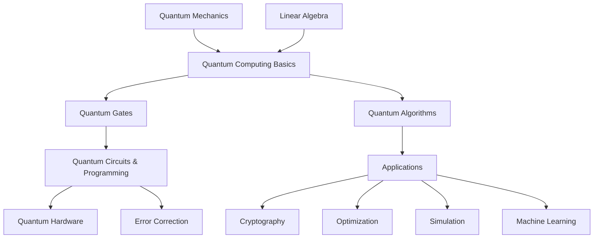

<div class="hero-section" style="background: linear-gradient(135deg, #0f2027 0%, #2c5364 50%, #00c6ff 100%); color: white; padding: 3rem 2rem; margin: -2rem -3rem 2rem -3rem; text-align: center;">
  <h1 style="color: white; margin: 0; font-size: 2.5rem;">Quantum Computing</h1>
  <p style="font-size: 1.25rem; margin-top: 1rem; opacity: 0.9;">Harness quantum mechanics for computation beyond classical limits</p>
</div>

Quantum computing harnesses the bizarre phenomena of quantum mechanics to perform computations impossible for classical computers. From cryptography-breaking algorithms to molecular simulation and optimization, quantum computers promise to revolutionize how we solve complex problems across science, finance, and technology.

<div class="code-example" markdown="1">
**Ready to explore quantum computing?** Whether you're a curious beginner wondering how qubits work, a developer ready to write quantum circuits, or a researcher pushing the boundaries of quantum algorithms, this hub provides comprehensive resources to guide your quantum journey.
</div>

## Table of contents
{: .no_toc .text-delta }

1. TOC
{:toc}

---

## How Quantum Computing Topics Connect

Understanding the relationships between quantum computing concepts helps navigate this complex field:



## Overview

This comprehensive documentation hub covers quantum computing from foundational principles to cutting-edge research. Quantum computing represents a fundamental shift in how we process information, harnessing quantum mechanical phenomena like superposition and entanglement to solve problems that are intractable for classical computers.

Whether you're exploring quantum concepts for the first time, writing your first quantum circuit, or researching novel quantum algorithms, this documentation provides the theory, practice, and context you need.

## Quick Navigation

### Fundamentals
- [**Introduction to Quantum Computing**](../technology/quantumcomputing.html) - Comprehensive introduction covering all aspects
- [**Quantum Mechanics Basics**](../physics/quantum-mechanics.html) - Fundamental quantum principles
- [**Bits to Qubits**](../technology/quantumcomputing.html#building-blocks-from-bits-to-qubits) - How quantum mechanics enables computation

### Quantum Algorithms
- [**Advanced Quantum Algorithms Research**](../advanced/quantum-algorithms-research/) - Rigorous theoretical foundations
- [**Classical Quantum Algorithms**](../technology/quantumcomputing.html#classical-quantum-algorithms-the-foundations) - Shor's, Grover's, and foundational algorithms
- [**Modern Quantum Algorithms**](../technology/quantumcomputing.html#modern-quantum-algorithms-beyond-the-classics) - Phase estimation, HHL, quantum walks

### Quantum Programming
- [**Getting Started with Qiskit**](#hello-quantum-a-bell-state) - IBM's quantum development kit
- [**Quantum Gates & Circuits**](../technology/quantumcomputing.html#quantum-gates-programming-the-quantum-world) - Building quantum algorithms
- [**Quick Start Below**](#step-by-step-quick-start) - Install a framework and run your first circuit

### Quantum Hardware
- [**Quantum Computing Platforms**](../technology/quantumcomputing.html#building-quantum-computers-from-theory-to-hardware) - Superconducting, ion trap, and other implementations
- [**Cloud Quantum Services**](#step-by-step-quick-start) - Access quantum computers online
- [**Quantum Error Correction**](../technology/quantumcomputing.html#quantum-error-correction-protecting-quantum-information) - Protecting quantum information

### Applications
- [**Quantum Cryptography**](#quantum-cryptography) - Secure communication and post-quantum security
- [**Quantum Machine Learning**](#quantum-machine-learning) - AI meets quantum computing
- [**Quantum Simulation**](#quantum-simulation) - Modeling quantum systems

## Learning Paths

Choose your quantum journey based on your background and goals:

### Quantum Curious Path (Conceptual Understanding)

**For:** Science enthusiasts, managers, decision-makers wanting to understand quantum potential

**Journey:**
1. Start with [Introduction to Quantum Computing](../technology/quantumcomputing.html) - Get the big picture
2. Learn about [qubits and superposition](../technology/quantumcomputing.html#building-blocks-from-bits-to-qubits) - The quantum difference
3. Explore [quantum algorithms](../technology/quantumcomputing.html#classical-quantum-algorithms-the-foundations) - See what's possible
4. Understand [applications](#applications-and-use-cases) - Real-world impact
5. Follow [quantum computing news](#communities) - Stay informed

**Time Investment:** 4-8 hours to grasp core concepts

**Prerequisites:** High school math, curiosity about technology

### Quantum Programmer Path (Hands-On with Qiskit/Cirq)

**For:** Software developers, data scientists wanting to program quantum computers

**Journey:**
1. Review [quantum mechanics basics](../physics/quantum-mechanics.html) - Essential physics
2. Learn [quantum gates and circuits](../technology/quantumcomputing.html#quantum-gates-programming-the-quantum-world) - Building blocks
3. Choose a framework: Qiskit, Cirq, or Q# (see [Quick Start](#step-by-step-quick-start))
4. Build your first [Bell state circuit](#hello-quantum-a-bell-state)
5. Implement [Grover's algorithm](../technology/quantumcomputing.html#grovers-algorithm-searching-the-unsearchable) - Classic quantum speedup
6. Try NISQ algorithms (VQE, QAOA) - Near-term practical
7. Run on [real quantum hardware](#step-by-step-quick-start) - Beyond simulation

**Time Investment:** 20-40 hours for proficiency

**Prerequisites:** Programming experience (Python recommended), linear algebra basics

### Quantum Researcher Path (Algorithms and Theory)

**For:** Graduate students, researchers exploring quantum algorithm design

**Journey:**
1. Master [quantum mechanics](../physics/quantum-mechanics.html) - Deep foundation
2. Study quantum information theory - Formal framework
3. Analyze [classical quantum algorithms](../technology/quantumcomputing.html#classical-quantum-algorithms-the-foundations) - Shor's, Grover's, QFT
4. Dive into [Advanced Quantum Algorithms Research](../advanced/quantum-algorithms-research/) - Rigorous theory
5. Explore [quantum complexity theory](../technology/quantumcomputing.html#the-deeper-theory-quantum-complexity-and-fundamental-limits) - Computational limits
6. Investigate [error correction](../technology/quantumcomputing.html#quantum-error-correction-protecting-quantum-information) - Fault tolerance
7. Contribute to current research areas - Push boundaries

**Time Investment:** Ongoing research commitment

**Prerequisites:** Strong linear algebra, quantum mechanics, complexity theory

### Physicist Path (Quantum Mechanics to Quantum Computing)

**For:** Physics students/professionals transitioning to quantum computing

**Journey:**
1. Apply your [quantum mechanics](../physics/quantum-mechanics.html) knowledge - You have a head start
2. Learn quantum information theory - New perspective
3. Understand [quantum gates](../technology/quantumcomputing.html#quantum-gates-programming-the-quantum-world) - Physics to computation
4. Study [quantum hardware platforms](../technology/quantumcomputing.html#building-quantum-computers-from-theory-to-hardware) - Physical implementations
5. Explore [quantum simulation](#quantum-simulation) applications - Natural fit
6. Investigate [error correction](../technology/quantumcomputing.html#quantum-error-correction-protecting-quantum-information) - Physics of noise
7. Try programming frameworks (see [Quick Start](#step-by-step-quick-start)) - Hands-on practice

**Time Investment:** 10-20 hours to transition knowledge

**Prerequisites:** Undergraduate quantum mechanics, linear algebra

## Key Topics

### Foundational Concepts

**Essential Reading:**
- [Introduction to Quantum Computing](../technology/quantumcomputing.html) - Comprehensive overview
- [Quantum Mechanics](../physics/quantum-mechanics.html) - Physical principles
- Interactive demos and visualizations

**Core Algorithms:**
- Quantum teleportation
- Quantum random number generators
- Grover's search algorithm

### Quantum Programming

**Development Frameworks:**
- Qiskit (IBM) - Full-featured quantum SDK
- Cirq (Google) - Python framework for NISQ algorithms
- Q# (Microsoft) - Domain-specific quantum language

**Implementation Topics:**
- Quantum gates and circuits
- Quantum state manipulation
- Measurement and post-processing
- Variational Quantum Eigensolver (VQE)
- Quantum Approximate Optimization (QAOA)
- Quantum machine learning models

**Technical Considerations:**
- Circuit optimization techniques
- Error mitigation strategies
- Performance benchmarking

### Research Topics

**Theoretical Foundations:**
- [Advanced Quantum Algorithms Research](../advanced/quantum-algorithms-research/)
- Quantum complexity theory
- Quantum information theory

**Advanced Algorithms:**
- Quantum walks and search
- Topological quantum computing
- Quantum error correction codes

**Current Research Areas:**
- Quantum advantage demonstrations
- Fault-tolerant quantum computing
- Quantum-classical hybrid algorithms

## Core Concepts at a Glance

This hub links out to the in-depth material. The table below is a fast orientation; for full
explanations, worked math, and circuit examples see
[Introduction to Quantum Computing](../technology/quantumcomputing.html).

A single qubit lives in a superposition

$$|\psi\rangle = \alpha|0\rangle + \beta|1\rangle, \qquad |\alpha|^2 + |\beta|^2 = 1$$

and $n$ qubits span a $2^n$-dimensional state space — the root of quantum computing's power.

| Concept | One-line meaning | Where to go deep |
|---------|------------------|------------------|
| Superposition | A qubit is a weighted blend of $\lvert0\rangle$ and $\lvert1\rangle$ until measured | [Bits to Qubits](../technology/quantumcomputing.html#building-blocks-from-bits-to-qubits) |
| Entanglement | Correlated qubits whose joint state can't be factored | [Entanglement](../technology/quantumcomputing.html#from-one-qubit-to-many-the-magic-of-entanglement) |
| Quantum gates | Reversible unitary operations (H, X, CNOT, …) | [Quantum Gates](../technology/quantumcomputing.html#quantum-gates-programming-the-quantum-world) |
| Algorithms | Shor's, Grover's, QFT, VQE, QAOA | [Algorithms](../technology/quantumcomputing.html#classical-quantum-algorithms-the-foundations) |
| Error correction | Surface codes turn noisy physical qubits into reliable logical ones | [QEC](../technology/quantumcomputing.html#quantum-error-correction-protecting-quantum-information) |
| Hardware | Superconducting, trapped-ion, photonic, neutral-atom | [Building QCs](../technology/quantumcomputing.html#building-quantum-computers-from-theory-to-hardware) |

### Quantum vs Classical Speedups

| Algorithm | Problem | Classical | Quantum | Status |
|-----------|---------|-----------|---------|--------|
| Grover's | Unstructured search | $O(N)$ | $O(\sqrt{N})$ | Proven quadratic |
| Shor's | Integer factoring | super-polynomial | polynomial | Needs fault tolerance |
| QFT / phase estimation | Period finding | exponential | polynomial | Core subroutine |
| VQE / QAOA | Chemistry, optimization | varies | heuristic | NISQ-era, hybrid |

### Hello Quantum: a Bell State

The canonical first program: a Hadamard creates superposition, a CNOT entangles the pair.

```python
from qiskit import QuantumCircuit, transpile
from qiskit_aer import AerSimulator

qc = QuantumCircuit(2, 2)
qc.h(0)           # superposition on qubit 0
qc.cx(0, 1)       # entangle qubit 1 with qubit 0
qc.measure_all()

result = AerSimulator().run(transpile(qc, AerSimulator()), shots=1000).result()
print(result.get_counts())   # ~50% '00', ~50% '11'
```

The output state is the Bell state $|\Phi^+\rangle = \tfrac{1}{\sqrt{2}}(|00\rangle + |11\rangle)$ —
measuring one qubit instantly determines the other. Equivalent Cirq and Q# versions and a
full gate walkthrough are in the [detailed guide](../technology/quantumcomputing.html#quantum-gates-programming-the-quantum-world).

## Applications and Use Cases

### Quantum Cryptography
- **Quantum Key Distribution**: Provably secure communication
- **Post-Quantum Cryptography**: Classical algorithms resistant to quantum attacks
- **Quantum Digital Signatures**: Unforgeable quantum signatures

### Quantum Machine Learning
- **Quantum Neural Networks**: Parameterized quantum circuits
- **Quantum Support Vector Machines**: Kernel methods in Hilbert space
- **Quantum Boltzmann Machines**: Sampling from complex distributions

### Quantum Simulation
- **Molecular Dynamics**: Drug discovery, catalyst design
- **Materials Science**: Superconductors, novel materials
- **Many-Body Physics**: Strongly correlated systems
- **Quantum Chemistry**: Reaction pathways, spectroscopy

### Optimization Problems
- **Portfolio Optimization**: Financial modeling
- **Route Optimization**: Logistics and supply chain
- **Scheduling**: Resource allocation
- **Machine Learning**: Training optimization

## Resources and Further Learning

### Online Courses
- [IBM Qiskit Textbook](https://qiskit.org/textbook/) - Comprehensive quantum computing course
- [Microsoft Quantum Development Kit](https://azure.microsoft.com/en-us/products/quantum) - Learn Q# and quantum concepts
- [Quantum Algorithm Zoo](https://quantumalgorithmzoo.org/) - Comprehensive list of quantum algorithms
- [Quantum Computing Playground](http://www.quantumplayground.net/) - Visual quantum circuit simulator

### Books
- "Quantum Computing: An Applied Approach" by Hidary
- "Quantum Computation and Quantum Information" by Nielsen & Chuang
- "Quantum Computing Since Democritus" by Aaronson

### Research Papers
- [arXiv Quantum Physics](https://arxiv.org/list/quant-ph/recent) - Latest research
- [Nature Quantum Information](https://www.nature.com/npjqi/) - Peer-reviewed journal
- [Quantum Journal](https://quantum-journal.org/) - Open-access quantum science

### Communities
- [Quantum Computing Stack Exchange](https://quantumcomputing.stackexchange.com/)
- [r/QuantumComputing](https://www.reddit.com/r/QuantumComputing/)
- [Qiskit Community](https://qiskit.org/community)
- [Quantum Computing Hub](.) - This documentation hub

## Recent Updates (2025)

**Latest Developments:**
- **IBM Quantum**: 1000+ qubit systems now available with improved error rates
- **Google Willow**: New quantum chip demonstrating exponential error reduction with increased qubits
- **NISQ Algorithms**: Enhanced VQE and QAOA implementations showing practical advantages in chemistry
- **Quantum Networking**: Progress toward quantum internet with entanglement distribution over 100+ km
- **Error Correction**: New surface code implementations approaching fault-tolerant threshold
- **Cloud Access**: Expanded availability through IBM, Amazon Braket, Azure, and IonQ platforms
- **Framework Updates**: Qiskit 1.0 release, Cirq 2.0 features, and improved Q# integration

**New Research Areas:**
- Quantum machine learning with demonstrated speedups
- Hybrid quantum-classical algorithms for optimization
- Quantum advantage demonstrations in sampling and optimization
- Practical error mitigation techniques for NISQ devices

## Future Directions

### Near-Term Goals (2025-2030)
- Demonstrate quantum advantage for practical problems
- Scale to thousands of physical qubits
- Develop better error mitigation techniques
- Create quantum software tools and languages

### Long-Term Vision (2030+)
- Fault-tolerant quantum computers
- Quantum internet and distributed computing
- Revolutionary applications in science and technology
- Integration with classical computing infrastructure

## Getting Started Today

Ready to begin? Follow these steps to start your quantum computing journey:

### Prerequisites

**Essential Knowledge:**
- **Mathematics**: Linear algebra (vectors, matrices, complex numbers)
- **Programming**: Python basics (if taking the programming path)
- **Physics**: Basic quantum mechanics concepts (helpful but not required)

**Tools You'll Need:**
- Python 3.8+ installed
- A code editor (VS Code, PyCharm, or Jupyter)
- Internet connection for cloud quantum access

### Step-by-Step Quick Start

**1. Install Your Quantum Framework (15 minutes)**

Choose one and install it:

```bash
# IBM Qiskit (Most beginner-friendly)
pip install qiskit qiskit-aer qiskit-ibm-runtime

# Google Cirq (Great for research)
pip install cirq

# Microsoft Q# (Unique language approach)
# Install .NET SDK first, then:
dotnet tool install -g Microsoft.Quantum.IQSharp
```

**2. Create Your First Quantum Circuit (30 minutes)**

Try the classic "Hello Quantum" - a Bell state:

```python
from qiskit import QuantumCircuit, transpile
from qiskit_aer import AerSimulator

# Create a 2-qubit circuit
qc = QuantumCircuit(2, 2)
qc.h(0)           # Superposition
qc.cx(0, 1)       # Entanglement
qc.measure_all()  # Measure

# Simulate
simulator = AerSimulator()
compiled = transpile(qc, simulator)
job = simulator.run(compiled, shots=1000)
result = job.result()
counts = result.get_counts()

print("Bell state results:", counts)
# Expected: ~50% |00⟩ and ~50% |11⟩
```

**3. Understand What Just Happened (20 minutes)**

Your circuit:
- Created **superposition** with the Hadamard gate (H)
- Created **entanglement** with the CNOT gate (CX)
- Showed **quantum correlation** - both qubits always match!

Learn more about these concepts in the [quantum gates section](../technology/quantumcomputing.html#quantum-gates-programming-the-quantum-world).

**4. Run on Real Quantum Hardware (1 hour)**

Sign up for free cloud access:

- [IBM Quantum](https://quantum-computing.ibm.com/) - Free 5-qubit devices
- [Amazon Braket](https://aws.amazon.com/braket/) - Free tier available
- [Azure Quantum](https://azure.microsoft.com/en-us/products/quantum) - Credits for new users

Submit your Bell state circuit to a real quantum computer!

**5. Build Your First Quantum Algorithm (2-4 hours)**

Try implementing:
- **Quantum Random Number Generator** - True randomness from superposition
- **Deutsch-Jozsa Algorithm** - Demonstrates quantum advantage
- **Grover's Search** - Quadratic speedup for searching

Tutorials available in the [Qiskit Textbook](https://qiskit.org/textbook/).

**6. Choose Your Learning Path (Ongoing)**

Based on your background, select a [learning path](#learning-paths):
- **Quantum Curious** - Conceptual understanding
- **Quantum Programmer** - Hands-on development
- **Quantum Researcher** - Algorithm design
- **Physicist** - From QM to QC

### First Project Suggestions

**Beginner Projects:**
1. **Quantum Coin Flip** - Visualize superposition and measurement
2. **Bell State Analysis** - Explore entanglement correlations
3. **Quantum Teleportation** - Classic QC demo (no faster-than-light!)
4. **Simple Quantum Game** - Quantum advantage in game theory

**Intermediate Projects:**
1. **Grover's Search Implementation** - Find a marked item
2. **VQE for H2 Molecule** - Calculate molecular ground state
3. **QAOA for Max-Cut** - Solve optimization problems
4. **Quantum Machine Learning Classifier** - Hybrid quantum-classical ML

**Advanced Projects:**
1. **Shor's Algorithm** - Factor small numbers
2. **Quantum Error Correction Code** - Implement surface code
3. **Novel Algorithm Design** - Create your own quantum algorithm
4. **Hardware Benchmarking** - Compare quantum devices

### Next Steps

- Join the [Qiskit Community](https://qiskit.org/community) Slack
- Participate in quantum hackathons ([Quantum Coalition Hack](https://www.quantumcoalition.io/))
- Follow research on [arXiv quant-ph](https://arxiv.org/list/quant-ph/recent)
- Contribute to open-source quantum projects

---

Ready to begin your quantum journey? Start with our [Introduction to Quantum Computing](../technology/quantumcomputing.html) or dive into [hands-on programming](#step-by-step-quick-start). The quantum future is being built today, and you can be part of it!

## Key Takeaways

<div class="takeaway-card" markdown="1">
- **Qubits are not just faster bits.** Superposition ($|\psi\rangle = \alpha|0\rangle + \beta|1\rangle$) and entanglement give access to a $2^n$-dimensional state space, but measurement collapses it — algorithms must steer probability toward the right answer via interference.
- **Speedups are problem-specific.** Grover's gives a quadratic edge for search; Shor's threatens RSA but needs fault-tolerant hardware; VQE/QAOA are heuristic NISQ-era tools today.
- **We are in the NISQ era.** Real machines (IBM, Google Willow, IonQ) have hundreds to ~1000+ noisy qubits; surface-code error correction is the bridge to fault tolerance.
- **You can start now.** A free cloud account plus Qiskit lets you run a Bell state on real hardware in an afternoon.
</div>

<div class="see-also-card" markdown="1">
#### See Also
- [Introduction to Quantum Computing](../technology/quantumcomputing.html) - The full deep-dive (gates, algorithms, error correction, hardware)
- [Quantum Mechanics](../physics/quantum-mechanics.html) - The physics underpinning qubits
- [Advanced Quantum Algorithms Research](../advanced/quantum-algorithms-research/) - Rigorous theory and complexity
- [AI/ML Documentation](../ai-ml/) - Where quantum machine learning connects to classical ML
- [Artificial Intelligence Hub](../artificial-intelligence/) - Quantum ML in context
</div>