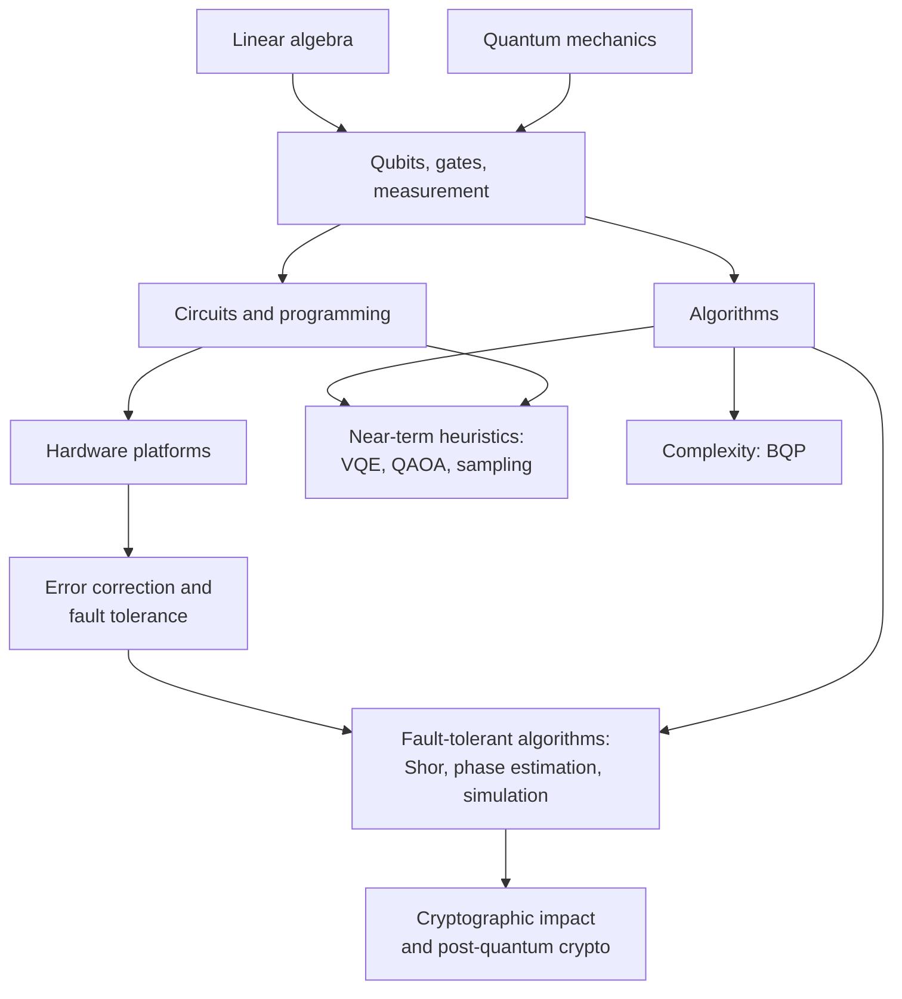
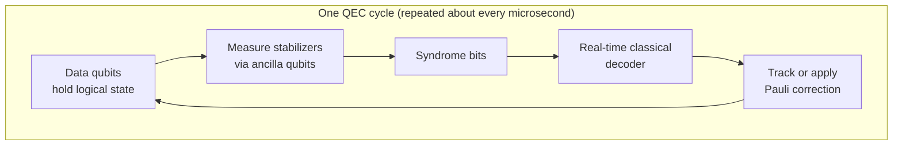
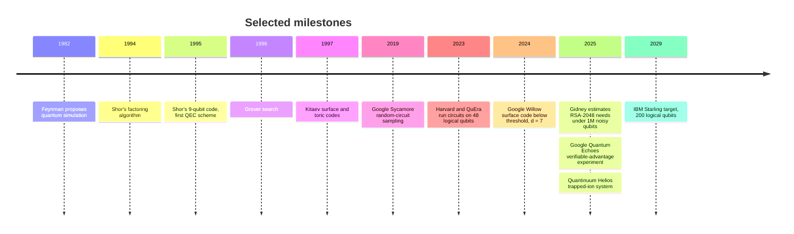
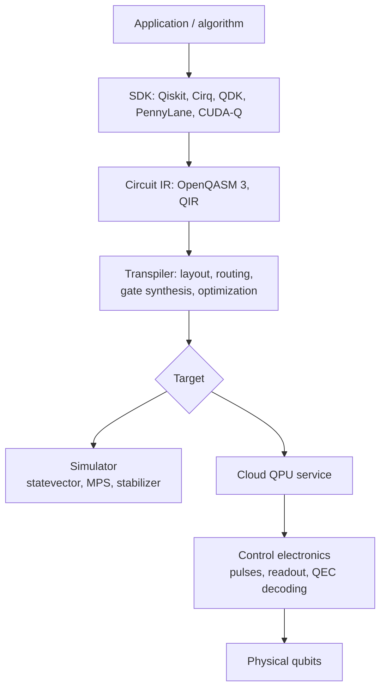

<div class="hero-section" style="background: linear-gradient(135deg, #0f2027 0%, #2c5364 50%, #00c6ff 100%); color: white; padding: 3rem 2rem; margin: -2rem -3rem 2rem -3rem; text-align: center;">
  <h1 style="color: white; margin: 0; font-size: 2.5rem;">Quantum Computing</h1>
  <p style="font-size: 1.25rem; margin-top: 1rem; opacity: 0.9;">Computation with superposition, entanglement, and interference</p>
</div>

**Quantum computing** processes information stored in quantum states. A register of $n$ qubits is described by $2^n$ complex amplitudes. Gates manipulate the amplitudes, and quantum algorithms arrange for **interference** to concentrate probability on correct answers before measurement. For certain problems this gives provable speedups: exponential for factoring and for simulating quantum systems, and quadratic for unstructured search. For most everyday workloads it offers nothing. This hub summarizes the field as of late 2026 and points to the detailed pages on this site.

## Table of contents
{: .no_toc .text-delta }

1. TOC
{:toc}

---

## Pages in This Section

| Page | Covers | Level |
|---|---|---|
| [Introduction to Quantum Computing](../technology/quantumcomputing.html) | Qubits, gates, circuits, the standard algorithms, error correction, hardware, and programming | Introductory to intermediate |
| [Quantum Mechanics: Quantum Computing](../physics/quantum-mechanics/qm-computing.html) | The physics of qubits and gates from the quantum-mechanics side | Intermediate |
| [Bell's Theorem & Experimental Tests](../physics/quantum-mechanics/bell-inequalities-and-tests.html) | Entanglement, nonlocality, and the experiments behind them | Intermediate |
| [Quantum Algorithms Research](../advanced/quantum-algorithms-research/) | Rigorous algorithm design and analysis, query and circuit complexity | Graduate |
| [Computational Complexity Theory](../advanced/complexity-theory/) | BQP and its relationship to P, NP, and PH | Graduate |
| [Information & Coding Theory](../advanced/information-coding-theory/) | Classical and quantum channels and codes | Graduate |
| [Cryptography: Foundations & Post-Quantum](../advanced/cryptography/) | Shor's threat to RSA/ECC and the lattice- and hash-based replacements | Graduate |
| [Quantum Computational Methods](../physics/computational-physics/quantum-methods.html) | Classical simulation of quantum systems, the benchmark quantum hardware must beat | Graduate |

How the topics depend on one another:



## Core Concepts

A **qubit** is a unit vector in $\mathbb{C}^2$:

$$\lvert\psi\rangle = \alpha\lvert 0\rangle + \beta\lvert 1\rangle, \qquad \lvert\alpha\rvert^2 + \lvert\beta\rvert^2 = 1.$$

An $n$-qubit state lives in the tensor product $(\mathbb{C}^2)^{\otimes n}$, which has dimension $2^n$. A computation applies a unitary $U$, built from a small set of one- and two-qubit gates, and then measures. Measuring in the computational basis returns bitstring $x$ with probability $\lvert\langle x\rvert U\lvert\psi_0\rangle\rvert^2$ (the **Born rule**).

| Concept | Meaning | Why it matters |
|---|---|---|
| Superposition | A state is a linear combination of basis states | The state space grows as $2^n$. Measurement returns only $n$ bits, so a superposition is not free parallelism. |
| Entanglement | A joint state that cannot be factored, e.g. $\tfrac{1}{\sqrt2}(\lvert00\rangle+\lvert11\rangle)$ | Needed for any exponential speedup, since weakly entangled circuits can be simulated efficiently |
| Interference | Amplitudes add with phases and can cancel | The mechanism every quantum algorithm relies on |
| Unitary gates | Reversible operations: $H$, $S$, $T$, $X$, CNOT, ... | $\{H, T, \text{CNOT}\}$ is universal. The Clifford gates alone ($H$, $S$, CNOT) are classically simulable (Gottesman-Knill theorem). |
| Measurement | Projects onto a basis and destroys superposition | Algorithms must end in a state where the answer has high probability |
| Decoherence | Uncontrolled coupling to the environment | Limits circuit depth, which is why error correction is needed |
| No-cloning | Unknown states cannot be copied | Rules out classical-style redundancy; QEC has to work differently |

Gates are unitary matrices. The two workhorses are

$$H = \frac{1}{\sqrt{2}}\begin{pmatrix} 1 & 1 \\ 1 & -1 \end{pmatrix}, \qquad \text{CNOT} = \begin{pmatrix} 1 & 0 & 0 & 0 \\ 0 & 1 & 0 & 0 \\ 0 & 0 & 0 & 1 \\ 0 & 0 & 1 & 0 \end{pmatrix}.$$

Applying $H$ to the first qubit of $\lvert00\rangle$ and then CNOT produces the Bell state

$$\lvert\Phi^+\rangle = \frac{1}{\sqrt{2}}\left(\lvert 00\rangle + \lvert 11\rangle\right).$$

## Algorithm Landscape

Quantum speedups are problem-specific. Speedups also differ in how firmly they are established: some are proven in the query model, some depend on unproven complexity assumptions, and some are heuristic.

| Algorithm | Problem | Best classical | Quantum | Notes |
|---|---|---|---|---|
| Shor (1994) | Factoring, discrete log | $\exp\!\left(O(n^{1/3}\log^{2/3} n)\right)$ (number field sieve) | Polynomial, roughly $O(n^2\log n)$ to $O(n^3)$ gates | Breaks RSA, Diffie-Hellman, and ECC; needs fault tolerance |
| Grover (1996) | Unstructured search over $N$ items | $O(N)$ | $O(\sqrt N)$ | Provably optimal. The quadratic gain is often eaten by error-correction overhead. |
| Quantum phase estimation | Eigenvalues of a unitary | Varies | $O(1/\epsilon)$ uses of $U$ (Heisenberg limit) | Core subroutine of Shor, chemistry, and HHL |
| Hamiltonian simulation | Time evolution $e^{-iHt}$ | Exponential in general | Polynomial (Trotter, qubitization, QSP) | Feynman's original motivation; the likeliest first useful application |
| HHL (2009) | Sample from solution of $Ax=b$ | $\text{poly}(N)$ | $\text{poly}(\log N,\kappa)$ | Needs efficient state preparation and readout; many proposed uses were "dequantized" (Tang, 2018 onward) |
| Quantum walks | Graph search, element distinctness | Varies | Polynomial speedups, e.g. $O(N^{2/3})$ for element distinctness | Also give an exponential separation for the glued-trees problem |
| VQE, QAOA | Ground states, combinatorial optimization | Heuristics | Heuristic, no proven speedup | Hybrid quantum-classical; limited by barren plateaus and noise |
| Random-circuit sampling | Sample a random circuit's output distribution | Believed exponential | Polynomial | Used for "beyond-classical" demonstrations; no practical use |

**Quantum singular value transformation (QSVT)**, introduced in 2019, gives one framework that covers amplitude amplification, Hamiltonian simulation, and linear-systems solvers. Most modern fault-tolerant algorithms are expressed in it. For derivations, see [Quantum Algorithms Research](../advanced/quantum-algorithms-research/).

## Hardware Platforms

Several physical platforms compete, and none has won. They differ in speed, connectivity, coherence, and how they scale.

| Platform | Qubit | Strengths | Weaknesses | Notable players |
|---|---|---|---|---|
| Superconducting | Transmon (Josephson-junction circuit) at ~10 mK | Fast gates (tens of ns), mature fabrication | Short coherence, nearest-neighbor wiring, cryogenic I/O | Google (Willow), IBM (Heron, Nighthawk), Rigetti |
| Trapped ion | Hyperfine levels of Yb$^+$, Ba$^+$, Ca$^+$ | Highest two-qubit fidelities (>99.9%), all-to-all connectivity | Slow gates (tens to hundreds of µs); scaling needs ion shuttling or photonic links | Quantinuum (H2, Helios), IonQ |
| Neutral atom | Rydberg-excited atoms (Rb, Cs, Sr, Yb) in optical tweezers | Thousands of qubits, reconfigurable connectivity, native multi-qubit gates | Slow cycle time, atom loss and reloading | QuEra, Atom Computing, Pasqal, Infleqtion |
| Photonic | Photon modes (dual-rail or GKP) | Room-temperature components, natural networking | Probabilistic gates, photon loss | PsiQuantum, Xanadu |
| Spin qubits | Electron or nuclear spins in Si/SiGe quantum dots | Small qubits, compatible with CMOS fabrication | Device variability, early scale | Intel, Diraq, Quantum Motion |
| Topological | Majorana zero modes in superconductor-semiconductor nanowires | Intrinsic protection from errors, in principle | Existence of a working topological qubit is still disputed | Microsoft (Majorana 1, 2025) |

Headline qubit counts say little about capability on their own. The more useful measures are two-qubit gate error, coherence relative to gate time, connectivity, measurement and reset speed, and, increasingly, the **number and error rate of logical qubits**.

## Error Correction and the Road to Fault Tolerance

Physical error rates of around $10^{-3}$ limit uncorrected circuits to a few thousand gates. Useful fault-tolerant algorithms need $10^{9}$ or more gates at logical error rates of $10^{-10}$ or lower. **Quantum error correction (QEC)** closes this gap by encoding each logical qubit in many physical qubits and repeatedly measuring **stabilizers**, which reveal errors without disturbing the encoded information.



The **threshold theorem** says that when physical error rates are below a threshold $p_{\text{th}}$, logical errors can be made arbitrarily small at polylogarithmic overhead. For the **surface code** of distance $d$,

$$p_L \approx A\left(\frac{p}{p_{\text{th}}}\right)^{\lfloor (d+1)/2 \rfloor},$$

with $p_{\text{th}} \approx 1\%$ under circuit-level noise. The ratio $\Lambda = p_L(d)/p_L(d+2)$ measures how much each increase in distance helps. Below threshold, $\Lambda > 1$.

| Code family | Encoding rate | Connectivity needed | Status |
|---|---|---|---|
| Surface code | 1 logical per $\sim 2d^2$ physical | 2D nearest-neighbor | Below-threshold operation demonstrated (Google, 2024) |
| Color codes | Similar to surface code | 2D, higher-weight checks | Transversal Clifford gates; demonstrated on superconducting and neutral-atom hardware |
| qLDPC codes (e.g. IBM's bivariate bicycle "gross" code) | Much higher; the $[[144,12,12]]$ code stores 12 logical qubits in 144 data qubits | Long-range couplers | Basis of IBM's fault-tolerance roadmap |
| Bosonic codes (cat, GKP) | Encoded in an oscillator | Cavities or photonics | Cat qubits give biased noise (AWS, Alice & Bob) |

Magic-state distillation or cultivation supplies the non-Clifford $T$ gates needed for universality. These factories often dominate resource estimates.

### Milestones



- **Google Willow (Nature, Dec 2024):** a 105-qubit superconducting chip ran surface-code memories at distances 3, 5, and 7. The logical error rate fell by a factor of about 2.14 with each step in distance, reaching roughly 0.14% per cycle at $d=7$. This was the first clear demonstration of below-threshold scaling.
- **Resource estimates for breaking RSA:** Gidney (2025) estimated that 2048-bit RSA could be factored in under a week with fewer than one million noisy qubits, down from the roughly 20 million estimated in 2019. The machines that exist today are still orders of magnitude short of this.
- **Verifiable advantage:** in 2025 Google reported its "Quantum Echoes" out-of-time-order-correlator experiment on Willow (Nature). Its output can be checked, unlike random-circuit sampling. The practical relevance of such demonstrations is still debated.
- **Roadmaps:** IBM's published roadmap targets a fault-tolerant machine, **Starling**, for 2029, running about $10^8$ gates on 200 logical qubits with qLDPC codes. Other vendors, including Quantinuum, QuEra, and PsiQuantum, have announced fault-tolerance targets for the late 2020s. Treat all such dates as goals, not guarantees.

The industry usually divides progress into three eras:

| Era | Characteristics | Typical workloads |
|---|---|---|
| NISQ (roughly 2018-2024) | 50 to 1,000 noisy physical qubits, no error correction | Error-mitigated variational algorithms, sampling experiments |
| Early fault tolerance (mid-2020s onward) | Tens to hundreds of logical qubits, limited $T$-gate budget | Small-scale simulation, QEC research, logical-level benchmarks |
| Fault-tolerant (FTQC) | Thousands of logical qubits, $10^{9}$ or more gates | Chemistry, materials, cryptanalysis |

**Error mitigation** techniques such as zero-noise extrapolation, probabilistic error cancellation, and readout correction reduce bias in expectation values without encoding. Their sampling cost grows exponentially with circuit size, so they serve as a bridge to error correction, not a replacement for it.

## Cryptographic Impact and Post-Quantum Cryptography

A large enough fault-tolerant machine running Shor's algorithm would break RSA, finite-field Diffie-Hellman, and elliptic-curve cryptography. Grover's algorithm only halves the effective key length of symmetric ciphers and hashes, so AES-256 and SHA-384 remain adequate. The immediate concern is **"harvest now, decrypt later"**: adversaries can record encrypted traffic today and decrypt it once quantum computers become capable enough.

In August 2024, NIST published the first post-quantum standards:

| Standard | Algorithm | Based on | Use |
|---|---|---|---|
| FIPS 203 | ML-KEM (Kyber) | Module lattices | Key encapsulation |
| FIPS 204 | ML-DSA (Dilithium) | Module lattices | Signatures |
| FIPS 205 | SLH-DSA (SPHINCS+) | Hash functions | Conservative stateless signatures |
| FIPS 206 (draft) | FN-DSA (Falcon) | NTRU lattices | Compact signatures |
| Selected 2025 | HQC | Codes | Backup KEM with a non-lattice assumption |

NIST's transition guidance (IR 8547) proposes deprecating quantum-vulnerable public-key algorithms after 2030 and disallowing them after 2035. Hybrid key exchange (X25519 combined with ML-KEM-768) is already the default in current major browsers and in OpenSSH. **Quantum key distribution (QKD)** takes a different approach, deriving security from physics rather than computational hardness, but it requires dedicated hardware and authenticated channels. National security agencies generally recommend PQC over QKD for most uses. For details, see [Cryptography: Foundations & Post-Quantum](../advanced/cryptography/).

## Applications

Realistic expectations, ordered from most to least established:

| Area | Why quantum could help | Current assessment |
|---|---|---|
| Quantum simulation (chemistry, materials, high-energy physics) | Nature is quantum, and phase estimation gives exponential speedups for suitable Hamiltonians | Strongest case. Needs fault tolerance for industrially relevant molecules such as FeMoco and P450. |
| Cryptanalysis | Shor's algorithm | Certain in principle; drives PQC migration now |
| Certified randomness, verifiable sampling | Outputs that are classically hard to spoof | Demonstrated; niche applications |
| Optimization (logistics, finance) | Grover-type and heuristic speedups | At most quadratic speedups, largely consumed by overhead; no demonstrated practical advantage |
| Quantum machine learning | High-dimensional feature spaces | Many claimed speedups were dequantized or require quantum data; still at the research stage |
| Sensing and networking | Entanglement-enhanced metrology, distributed entanglement | Separate from computing; some sensing is already deployed |

## Programming and Tools

Most quantum software is Python-based. It is usually written at the circuit level and compiled ("transpiled") to each device's native gates and qubit connectivity.



| Framework | Maintainer | Current line (Sept 2026) | Notes |
|---|---|---|---|
| **Qiskit** | IBM | 2.x (2.5) | Primitives-based API (`Sampler`, `Estimator`). The Rust core also has a C API. `execute()` and BackendV1 have been removed. |
| **Cirq** | Google | 1.x (1.7) | Low-level control, noise modeling, Google hardware access; requires Python 3.11 or later |
| **Microsoft QDK** | Microsoft | `qdk` Python package (1.32) | Q# and OpenQASM, resource estimator, Azure Quantum; replaces the retired .NET-based IQ# kernel |
| **PennyLane** | Xanadu | 0.x | Differentiable programming and variational algorithms |
| **CUDA-Q** | NVIDIA | — | GPU-accelerated simulation and hybrid CPU-GPU-QPU workflows |
| **Amazon Braket SDK** | AWS | — | Single API for IonQ, Rigetti, QuEra, IQM, and other devices |

### Quick Start

Install Qiskit into a virtual environment. Qiskit 2.x requires Python 3.10 or later and a 64-bit platform.

```bash
python3 -m venv .venv && source .venv/bin/activate
pip install qiskit qiskit-ibm-runtime   # IBM SDK + cloud runtime client
pip install cirq                        # Google Cirq (optional)
pip install qdk                         # Microsoft QDK: Q#, OpenQASM, resource estimation (optional)
```

A Bell state, simulated locally with Qiskit's reference `StatevectorSampler`:

```python
from qiskit import QuantumCircuit
from qiskit.primitives import StatevectorSampler

qc = QuantumCircuit(2)
qc.h(0)          # superposition on qubit 0
qc.cx(0, 1)      # entangle qubit 1 with qubit 0
qc.measure_all() # adds a classical register named "meas"

result = StatevectorSampler().run([qc], shots=1000).result()
print(result[0].data.meas.get_counts())   # about 500 '00' and 500 '11', never '01' or '10'
```

The same circuit in Cirq:

```python
import cirq

q0, q1 = cirq.LineQubit.range(2)
circuit = cirq.Circuit(cirq.H(q0), cirq.CNOT(q0, q1), cirq.measure(q0, q1, key="m"))
result = cirq.Simulator().run(circuit, repetitions=1000)
print(result.histogram(key="m"))   # Counter({0: ~500, 3: ~500})
```

To run on IBM hardware, create an account on the [IBM Quantum Platform](https://quantum.cloud.ibm.com/), which includes a free Open Plan with a monthly allocation of QPU time. Save the API key once with `QiskitRuntimeService.save_account(...)`, then transpile the circuit to the device's native instruction set architecture (ISA) and submit it:

```python
from qiskit.transpiler import generate_preset_pass_manager
from qiskit_ibm_runtime import QiskitRuntimeService, SamplerV2 as Sampler

service = QiskitRuntimeService()
backend = service.least_busy(operational=True, simulator=False)

isa_circuit = generate_preset_pass_manager(backend=backend, optimization_level=1).run(qc)
job = Sampler(mode=backend).run([isa_circuit], shots=1000)
print(job.result()[0].data.meas.get_counts())   # mostly '00' and '11', plus some hardware noise
```

On real hardware, a few percent of shots will land on `01` and `10` because of gate and readout errors. Measuring that noise is a useful first exercise.

### Cloud Access

| Service | Hardware available | Entry point |
|---|---|---|
| IBM Quantum Platform | IBM superconducting (Heron, Nighthawk) | Free Open Plan; paid plans |
| Amazon Braket | IonQ, Rigetti, IQM, QuEra, and others | Pay per task and shot; simulators included |
| Azure Quantum | Quantinuum, IonQ, Pasqal, Rigetti, and others | Credits programs; QDK integration |
| Google Quantum AI | Willow-class devices | Research access by proposal |

## Further Reading

**Textbooks**
- Nielsen & Chuang, *Quantum Computation and Quantum Information* (10th anniversary ed., 2010). This is the standard reference.
- Aaronson, *Quantum Computing Since Democritus* (2013), on complexity-theoretic perspectives.
- Preskill, *Lecture Notes for Physics 219* (Caltech), free online, especially the chapters on error correction and fault tolerance.
- Preskill, "Quantum Computing in the NISQ era and beyond," *Quantum* 2, 79 (2018), the paper that named the NISQ era.

**Online**
- [IBM Quantum Learning](https://quantum.cloud.ibm.com/learning): courses and tutorials that replace the retired Qiskit Textbook.
- [Qiskit documentation](https://quantum.cloud.ibm.com/docs) and [Cirq documentation](https://quantumai.google/cirq).
- [Quantum Algorithm Zoo](https://quantumalgorithmzoo.org/): a catalog of known quantum algorithms and their speedups.
- [Error Correction Zoo](https://errorcorrectionzoo.org/): a catalog of classical and quantum codes.
- [arXiv quant-ph](https://arxiv.org/list/quant-ph/recent), [*Quantum*](https://quantum-journal.org/) (open access), [*npj Quantum Information*](https://www.nature.com/npjqi/).
- [Quantum Computing Stack Exchange](https://quantumcomputing.stackexchange.com/).

## See Also

- [Introduction to Quantum Computing](../technology/quantumcomputing.html): the full walkthrough of gates, algorithms, error correction, and hardware.
- [Quantum Mechanics](../physics/quantum-mechanics/): the physics underlying qubits.
- [Quantum Algorithms Research](../advanced/quantum-algorithms-research/): rigorous theory and complexity.
- [Cryptography: Foundations & Post-Quantum](../advanced/cryptography/): lattice cryptography and migration.
- [AI/ML Documentation](../ai-ml/) and the [Artificial Intelligence Hub](../artificial-intelligence/): where quantum machine learning connects to classical ML.
