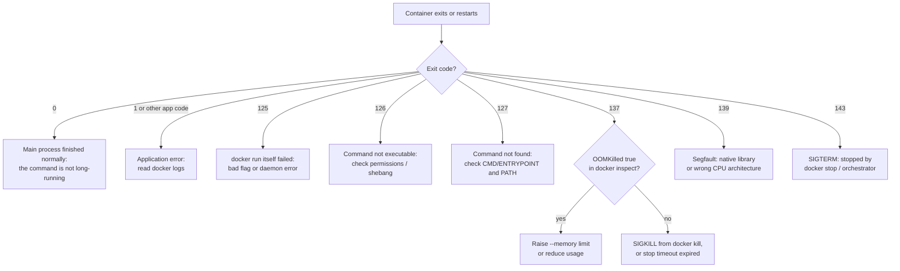
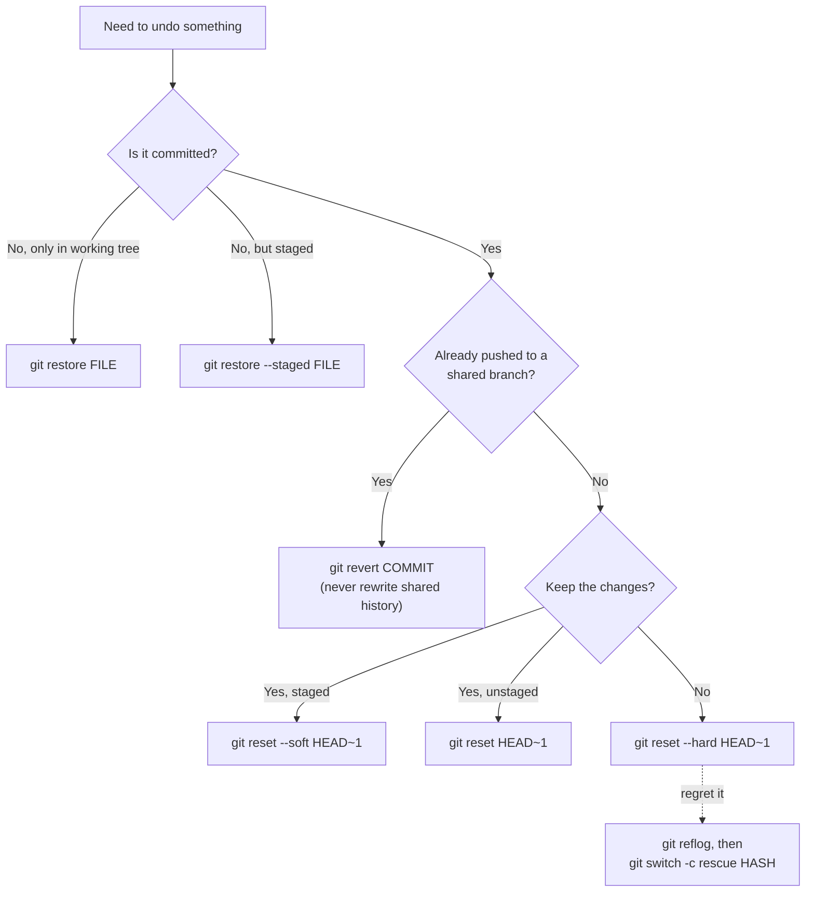

<div class="hero-section" style="background: linear-gradient(135deg, #667eea 0%, #764ba2 100%); color: white; padding: 3rem 2rem; margin: -2rem -3rem 2rem -3rem; text-align: center;">
  <h1 style="color: white; margin: 0; font-size: 2.5rem;">Quick Reference Guide</h1>
  <p style="font-size: 1.25rem; margin-top: 1rem; opacity: 0.9;">Commands, constants, formulas, complexity tables, and checklists on one page</p>
</div>

This page collects the lookup material that comes up constantly: day-to-day CLI commands, physical constants and core equations, algorithmic complexity, HTTP and networking conventions, regular expressions, and pre-flight checklists. Every section is a condensed extract; each links to the full article on the topic. Use <kbd>Ctrl</kbd>+<kbd>F</kbd> (<kbd>Cmd</kbd>+<kbd>F</kbd> on macOS) to search the page.

| Section | Contents | Full article |
|---------|----------|--------------|
| [Command line](#command-line-references) | Git, Docker, kubectl, AWS CLI, Terraform/OpenTofu | [Git reference](../technology/git-reference.html), [Docker essentials](../technology/docker-essentials.html), [Kubernetes](../technology/kubernetes/), [AWS](../technology/aws/), [Terraform](../technology/terraform/) |
| [Physics](#physics-formulas--constants) | CODATA 2022 constants, unit conversions, mechanics, QM, EM, thermodynamics | [Physics hub](../physics/) |
| [Mathematics](#mathematical-reference) | Calculus, linear algebra, probability | [AI Mathematics](../advanced/ai-mathematics/) |
| [Algorithms](#algorithms--data-structures) | Big-O tables, graph algorithms, code templates | [Complexity theory](../advanced/complexity-theory/) |
| [APIs](#api-reference-patterns) | REST conventions, status codes, error format | [API design](../api-design/) |
| [Networking](#network-protocols) | Well-known ports | [Networking](../technology/networking/) |
| [Regex](#regular-expressions) | Syntax and common patterns | — |
| [Troubleshooting](#troubleshooting-flowcharts) | Container and Git decision trees | [CI/CD](../technology/ci-cd/) |
| [Checklists](#best-practices-checklists) | Code review, deployment | — |

---

## Command Line References

Placeholders are shown as `<name>`. Commands reflect current stable tooling as of 2026: `git switch`/`git restore` (Git 2.23+), the `docker compose` plugin (Compose v1's `docker-compose` binary reached end of life in 2023), and Terraform's `-replace` / `-refresh-only` flags, which superseded `taint` and `refresh`.

### Git

```bash
# Setup and remotes
git init                              # new repository
git clone <url>                       # copy a remote repository
git remote -v                         # list remotes
git remote add origin <url>           # add a remote

# Everyday work
git status                            # working-tree status
git add <path>                        # stage a file (git add -p: stage hunks interactively)
git commit -m "message"               # commit staged changes
git commit --amend                    # rewrite the last (unpushed) commit
git fetch --prune                     # update remote-tracking refs, drop deleted ones
git pull --rebase                     # fetch + rebase local commits on top
git push -u origin <branch>           # push and set upstream

# Branches
git branch                            # list local branches (-a: include remote)
git switch <branch>                   # change branch
git switch -c <branch>                # create and switch
git merge <branch>                    # merge into current branch
git rebase <branch>                   # replay current branch onto <branch>
git branch -d <branch>                # delete a merged branch (-D: force)
git push origin --delete <branch>     # delete a remote branch

# Inspecting history
git log --oneline --graph --all       # compact history graph
git diff                              # unstaged changes
git diff --staged                     # staged changes
git show <commit>                     # one commit's diff and metadata
git blame <file>                      # last change per line
git log -S "<text>"                   # commits that added/removed <text>

# Undoing
git restore <file>                    # discard unstaged changes to a file
git restore --staged <file>           # unstage, keep changes
git reset --soft HEAD~1               # undo last commit, keep changes staged
git reset HEAD~1                      # undo last commit, keep changes unstaged
git reset --hard HEAD~1               # undo last commit, discard changes (destructive)
git revert <commit>                   # new commit that inverts <commit> (safe on shared branches)
git push --force-with-lease           # force-push only if the remote hasn't moved
git stash / git stash pop             # shelve and restore uncommitted work

# Power tools
git cherry-pick <commit>              # apply one commit onto the current branch
git bisect start <bad> <good>         # binary-search for a regression
git reflog                            # every position HEAD has held (recovery)
git worktree add ../<dir> <branch>    # second working tree on another branch
```

### Docker

```bash
# Containers
docker run -d --name <n> -p 8080:80 <image>   # detached, publish port
docker run --rm -it <image> sh                # throwaway interactive shell
docker ps / docker ps -a                      # running / all containers
docker logs -f <container>                    # follow logs
docker exec -it <container> sh                # shell into a running container
docker stop <container> && docker rm <container>
docker inspect <container>                    # full JSON config and state
docker stats                                  # live CPU/memory usage

# Images
docker build -t <name>:<tag> .                # build from ./Dockerfile (BuildKit)
docker buildx build --platform linux/amd64,linux/arm64 -t <name>:<tag> --push .
docker images                                 # list images
docker pull <image> / docker push <image>
docker tag <source> <target>
docker rmi <image>

# Compose (v2 plugin syntax)
docker compose up -d                          # start services detached
docker compose up -d --build                  # rebuild then start
docker compose ps                             # service status
docker compose logs -f <service>              # follow a service's logs
docker compose exec <service> sh              # shell into a service
docker compose down                           # stop and remove (add -v to drop volumes)

# Housekeeping
docker system df                              # disk usage by type
docker system prune                           # remove stopped containers, dangling images, unused networks
docker volume ls / docker network ls
```

### Kubernetes (kubectl)

```bash
# Context and cluster
kubectl config get-contexts                   # available clusters/users
kubectl config use-context <ctx>              # switch cluster
kubectl config set-context --current --namespace=<ns>
kubectl get nodes -o wide                     # nodes with IPs and versions

# Reading resources
kubectl get pods -A                           # all namespaces
kubectl get deploy,svc,ingress -n <ns>
kubectl describe pod <pod>                    # events, probes, scheduling
kubectl get pod <pod> -o yaml                 # live spec and status
kubectl get events --sort-by=.lastTimestamp
kubectl explain deployment.spec.strategy      # built-in schema docs

# Changing resources
kubectl apply -f <file-or-dir>                # declarative create/update
kubectl diff -f <file>                        # preview what apply would change
kubectl delete -f <file>
kubectl scale deploy/<name> --replicas=3
kubectl set image deploy/<name> <container>=<image>:<tag>
kubectl rollout status deploy/<name>
kubectl rollout undo deploy/<name>
kubectl rollout restart deploy/<name>         # re-create pods with the same spec

# Debugging
kubectl logs <pod> [-c <container>] [-f] [--previous]
kubectl exec -it <pod> -- sh
kubectl debug -it <pod> --image=busybox --target=<container>   # ephemeral debug container
kubectl port-forward svc/<name> 8080:80
kubectl top pod                               # requires metrics-server
```

### AWS CLI (v2)

```bash
# Identity and auth
aws configure sso                             # set up an IAM Identity Center profile
aws sso login --profile <p>
aws sts get-caller-identity                   # who am I? (first thing to check)

# S3
aws s3 ls s3://<bucket>/<prefix>/
aws s3 cp <file> s3://<bucket>/<key>
aws s3 sync ./dir s3://<bucket>/dir --delete  # mirror a directory
aws s3 rm s3://<bucket>/<key> [--recursive]
aws s3 presign s3://<bucket>/<key> --expires-in 3600

# EC2
aws ec2 describe-instances \
  --filters Name=instance-state-name,Values=running \
  --query 'Reservations[].Instances[].[InstanceId,InstanceType,PrivateIpAddress]' \
  --output table
aws ec2 start-instances --instance-ids <id>
aws ec2 stop-instances --instance-ids <id>
aws ssm start-session --target <instance-id>  # shell without SSH keys or open ports

# IAM
aws iam list-roles --query 'Roles[].RoleName'
aws iam get-role --role-name <name>

# Lambda
aws lambda list-functions
aws lambda invoke --function-name <name> --payload '{}' \
  --cli-binary-format raw-in-base64-out out.json
aws lambda update-function-code --function-name <name> --zip-file fileb://function.zip

# CloudFormation
aws cloudformation deploy --stack-name <name> --template-file template.yaml \
  --capabilities CAPABILITY_IAM              # create or update via change set
aws cloudformation describe-stack-events --stack-name <name>
aws cloudformation delete-stack --stack-name <name>

# Logs
aws logs tail /aws/lambda/<name> --follow
```

`--query` takes a JMESPath expression and `--output` accepts `json`, `yaml`, `text`, or `table`.

### Terraform / OpenTofu

The same commands work with OpenTofu by substituting `tofu` for `terraform`.

```bash
# Setup
terraform init                         # download providers/modules, configure backend
terraform init -upgrade                # upgrade within version constraints
terraform fmt -recursive               # canonical formatting (-check in CI)
terraform validate                     # static validation

# Plan and apply
terraform plan -out=tfplan             # preview and save the plan
terraform apply tfplan                 # apply exactly the saved plan
terraform plan -var-file=prod.tfvars
terraform apply -replace=<addr>        # force re-creation (replaces "taint")
terraform apply -refresh-only          # reconcile state with reality (replaces "refresh")
terraform plan -target=<addr>          # limit scope (exceptional use only)
terraform destroy

# State
terraform state list
terraform state show <addr>
terraform state mv <src> <dst>         # prefer a `moved` block in code
terraform state rm <addr>              # prefer a `removed` block in code
terraform force-unlock <lock-id>

# Import (prefer config-driven `import` blocks, Terraform 1.5+)
terraform import <addr> <id>
terraform plan -generate-config-out=generated.tf

# Inspection
terraform output [-json] [<name>]
terraform console                      # evaluate expressions
terraform graph | dot -Tsvg > graph.svg
terraform providers
terraform test                         # run *.tftest.hcl tests (1.6+)

# Environment variables
export TF_LOG=DEBUG TF_LOG_PATH=tf.log
export TF_VAR_region=us-east-1         # sets var.region
```

---

## Physics Formulas & Constants

### Fundamental Constants

Values are from the [CODATA 2022 adjustment](https://physics.nist.gov/cuu/Constants/) published by NIST. Since the 2019 SI redefinition, $c$, $h$, $e$, $k_B$ and $N_A$ are **exact by definition**; as a consequence $\mu_0$ is no longer exactly $4\pi\times10^{-7}$ H/m but a measured quantity (equal to it within about 1 part in $10^{10}$).

| Constant | Symbol | Value | Units | Status |
|----------|--------|-------|-------|--------|
| Speed of light in vacuum | $c$ | $299\,792\,458$ | m/s | exact |
| Planck constant | $h$ | $6.626\,070\,15 \times 10^{-34}$ | J·s | exact |
| Reduced Planck constant | $\hbar = h/2\pi$ | $1.054\,571\,817 \times 10^{-34}$ | J·s | exact (truncated) |
| Elementary charge | $e$ | $1.602\,176\,634 \times 10^{-19}$ | C | exact |
| Boltzmann constant | $k_B$ | $1.380\,649 \times 10^{-23}$ | J/K | exact |
| Avogadro constant | $N_A$ | $6.022\,140\,76 \times 10^{23}$ | mol⁻¹ | exact |
| Gravitational constant | $G$ | $6.674\,30(15) \times 10^{-11}$ | m³·kg⁻¹·s⁻² | measured |
| Electron mass | $m_e$ | $9.109\,383\,7139(28) \times 10^{-31}$ | kg | measured |
| Proton mass | $m_p$ | $1.672\,621\,925\,95(52) \times 10^{-27}$ | kg | measured |
| Atomic mass constant | $m_u$ | $1.660\,539\,068\,92(52) \times 10^{-27}$ | kg | measured |
| Fine-structure constant | $\alpha^{-1}$ | $137.035\,999\,177(21)$ | — | measured |
| Vacuum permittivity | $\varepsilon_0$ | $8.854\,187\,8188(14) \times 10^{-12}$ | F/m | measured |
| Vacuum permeability | $\mu_0$ | $1.256\,637\,061\,27(20) \times 10^{-6}$ | N/A² | measured |
| Bohr radius | $a_0$ | $5.291\,772\,105\,44(82) \times 10^{-11}$ | m | measured |
| Rydberg energy | $R_\infty hc$ | $13.605\,693\,122\,990(15)$ | eV | measured |
| Stefan–Boltzmann constant | $\sigma$ | $5.670\,374\,419 \times 10^{-8}$ | W·m⁻²·K⁻⁴ | exact (truncated) |

Digits in parentheses are the standard uncertainty in the last digits. Useful derived values: $\hbar c \approx 197.327$ MeV·fm, $k_B T \approx 25.7$ meV at 298 K, $R = N_A k_B \approx 8.314$ J·mol⁻¹·K⁻¹.

### Unit Conversions

| Quantity | Conversion |
|----------|------------|
| Energy | 1 eV = $1.602\,176\,634 \times 10^{-19}$ J (exact); 1 cal = 4.184 J; 1 kWh = $3.6 \times 10^{6}$ J |
| Length | 1 Å = $10^{-10}$ m = 0.1 nm; 1 fm = $10^{-15}$ m; 1 AU = $1.495\,978\,707 \times 10^{11}$ m (exact); 1 ly ≈ $9.461 \times 10^{15}$ m; 1 pc ≈ 3.086 × 10¹⁶ m |
| Mass | 1 u ≈ 931.494 MeV/$c^2$; $m_e c^2$ ≈ 0.510 999 MeV; $m_p c^2$ ≈ 938.272 MeV |
| Pressure | 1 atm = 101 325 Pa (exact); 1 bar = $10^{5}$ Pa; 1 torr = 1/760 atm |
| Temperature | $T[\mathrm{K}] = T[^\circ\mathrm{C}] + 273.15$; $T[^\circ\mathrm{F}] = \tfrac{9}{5}T[^\circ\mathrm{C}] + 32$ |
| Photon energy | $E\,[\mathrm{eV}] \approx 1239.84 / \lambda\,[\mathrm{nm}]$ |
| Angle | 1 rad = $180/\pi$ ≈ 57.2958° |

### Classical Mechanics

| Quantity | Equation |
|----------|----------|
| Newton's second law | $\vec{F} = \dfrac{d\vec{p}}{dt} = m\vec{a}$ (constant mass) |
| Newton's third law | $\vec{F}_{12} = -\vec{F}_{21}$ |
| Constant-acceleration kinematics | $v = v_0 + at$, $\;x = x_0 + v_0 t + \tfrac{1}{2}at^2$, $\;v^2 = v_0^2 + 2a(x - x_0)$ |
| Kinetic energy | $K = \tfrac{1}{2}mv^2 = \dfrac{p^2}{2m}$ |
| Potential energy | $U = mgh$ (near surface), $\;U = \tfrac{1}{2}kx^2$ (spring), $\;U = -\dfrac{GMm}{r}$ (gravity) |
| Work–energy theorem | $W = \displaystyle\int \vec{F}\cdot d\vec{r} = \Delta K$ |
| Momentum, angular momentum, torque | $\vec{p} = m\vec{v}$, $\;\vec{L} = \vec{r}\times\vec{p}$, $\;\vec{\tau} = \vec{r}\times\vec{F} = \dfrac{d\vec{L}}{dt}$ |
| Rotational dynamics | $\tau = I\alpha$, $\;K_\text{rot} = \tfrac{1}{2}I\omega^2$, $\;L = I\omega$ |
| Uniform circular motion | $a_c = \dfrac{v^2}{r} = \omega^2 r$ |
| Simple harmonic oscillator | $\omega = \sqrt{k/m}$, $\;T = 2\pi\sqrt{m/k}$; pendulum $T \approx 2\pi\sqrt{L/g}$ |

**Lagrangian and Hamiltonian mechanics**

$$L = T - V, \qquad \frac{d}{dt}\frac{\partial L}{\partial \dot{q}_i} - \frac{\partial L}{\partial q_i} = 0$$

$$H = \sum_i p_i \dot{q}_i - L, \qquad \dot{q}_i = \frac{\partial H}{\partial p_i}, \qquad \dot{p}_i = -\frac{\partial H}{\partial q_i}$$

### Special Relativity

$$\gamma = \frac{1}{\sqrt{1 - v^2/c^2}}, \qquad \Delta t = \gamma\,\Delta\tau, \qquad L = \frac{L_0}{\gamma}$$

$$E^2 = (pc)^2 + (mc^2)^2, \qquad E = \gamma mc^2, \qquad \vec{p} = \gamma m\vec{v}$$

### Quantum Mechanics

$$i\hbar\,\frac{\partial \psi}{\partial t} = \hat{H}\psi, \qquad \hat{H} = -\frac{\hbar^2}{2m}\nabla^2 + V(\vec{r})$$

$$[\hat{x}, \hat{p}] = i\hbar, \qquad \sigma_x\,\sigma_p \geq \frac{\hbar}{2}, \qquad E = h\nu = \hbar\omega, \qquad \lambda = \frac{h}{p}$$

$$|\psi\rangle = \sum_i c_i |i\rangle, \qquad \langle\psi|\psi\rangle = \sum_i |c_i|^2 = 1, \qquad P(\phi) = |\langle\phi|\psi\rangle|^2$$

**Standard solutions**

| System | Energy levels |
|--------|---------------|
| Infinite square well (width $L$) | $E_n = \dfrac{n^2\pi^2\hbar^2}{2mL^2}$, $\;n = 1, 2, \dots$ |
| Harmonic oscillator | $E_n = \hbar\omega\left(n + \tfrac{1}{2}\right)$, $\;n = 0, 1, \dots$ |
| Hydrogen atom (Bohr) | $E_n = -\dfrac{13.6\ \text{eV}}{n^2}$, $\;r_n = n^2 a_0$, $\;a_0 \approx 0.0529$ nm |

### Electromagnetism

**Maxwell's equations** (SI, differential form)

$$\nabla\cdot\vec{E} = \frac{\rho}{\varepsilon_0}, \qquad \nabla\cdot\vec{B} = 0$$

$$\nabla\times\vec{E} = -\frac{\partial \vec{B}}{\partial t}, \qquad \nabla\times\vec{B} = \mu_0\vec{J} + \mu_0\varepsilon_0\frac{\partial \vec{E}}{\partial t}$$

These are Gauss's law, the absence of magnetic monopoles, Faraday's law, and the Ampère–Maxwell law.

**Forces, potentials, and waves**

$$\vec{F} = q(\vec{E} + \vec{v}\times\vec{B}), \qquad \vec{E} = -\nabla\phi - \frac{\partial \vec{A}}{\partial t}, \qquad \vec{B} = \nabla\times\vec{A}$$

$$\nabla^2\vec{E} - \frac{1}{c^2}\frac{\partial^2 \vec{E}}{\partial t^2} = 0, \qquad c = \frac{1}{\sqrt{\mu_0\varepsilon_0}}$$

| Quantity | Equation |
|----------|----------|
| Coulomb's law | $F = \dfrac{1}{4\pi\varepsilon_0}\dfrac{q_1 q_2}{r^2}$ |
| Ohm's law, power | $V = IR$, $\;P = IV = I^2R$ |
| Capacitor, inductor energy | $U_C = \tfrac{1}{2}CV^2$, $\;U_L = \tfrac{1}{2}LI^2$ |
| Energy density of fields | $u = \tfrac{1}{2}\varepsilon_0 E^2 + \dfrac{B^2}{2\mu_0}$ |
| Poynting vector | $\vec{S} = \dfrac{1}{\mu_0}\vec{E}\times\vec{B}$ |

### Thermodynamics and Statistical Mechanics

| Quantity | Equation |
|----------|----------|
| First law | $dU = \delta Q - \delta W$ |
| Second law (entropy) | $dS \geq \dfrac{\delta Q}{T}$ |
| Ideal gas | $pV = nRT = Nk_BT$ |
| Boltzmann entropy | $S = k_B \ln \Omega$ |
| Carnot efficiency | $\eta = 1 - \dfrac{T_C}{T_H}$ |
| Stefan–Boltzmann law | $j = \sigma T^4$ |
| Equipartition | $\tfrac{1}{2}k_BT$ per quadratic degree of freedom |

$$Z = \sum_i e^{-E_i/k_BT}, \qquad P_i = \frac{e^{-E_i/k_BT}}{Z}, \qquad F = -k_BT\ln Z$$

---

## Mathematical Reference

### Calculus

**Derivatives**

$$\frac{d}{dx}x^n = nx^{n-1}, \quad \frac{d}{dx}e^x = e^x, \quad \frac{d}{dx}\ln x = \frac{1}{x}, \quad \frac{d}{dx}\sin x = \cos x, \quad \frac{d}{dx}\cos x = -\sin x, \quad \frac{d}{dx}\tan x = \sec^2 x$$

**Rules**

$$\underbrace{(uv)' = u'v + uv'}_{\text{product}}, \quad \underbrace{\left(\frac{u}{v}\right)' = \frac{u'v - uv'}{v^2}}_{\text{quotient}}, \quad \underbrace{\frac{d}{dx}f(g(x)) = f'(g(x))\,g'(x)}_{\text{chain}}$$

**Integrals**

$$\int x^n\,dx = \frac{x^{n+1}}{n+1} + C \;\; (n \neq -1), \quad \int \frac{dx}{x} = \ln|x| + C, \quad \int e^{ax}\,dx = \frac{e^{ax}}{a} + C$$

$$\int \sin x\,dx = -\cos x + C, \quad \int \cos x\,dx = \sin x + C, \quad \int u\,dv = uv - \int v\,du$$

$$\int_{-\infty}^{\infty} e^{-ax^2}\,dx = \sqrt{\frac{\pi}{a}} \quad (a > 0)$$

**Taylor series**

$$f(x) = \sum_{n=0}^{\infty} \frac{f^{(n)}(a)}{n!}(x-a)^n, \qquad e^{x} = \sum_{n=0}^{\infty}\frac{x^n}{n!}, \qquad e^{i\theta} = \cos\theta + i\sin\theta$$

### Linear Algebra

$$(AB)_{ij} = \sum_k A_{ik}B_{kj}, \qquad (AB)^\mathsf{T} = B^\mathsf{T}A^\mathsf{T}, \qquad (AB)^{-1} = B^{-1}A^{-1}$$

$$\det\begin{pmatrix} a & b \\ c & d \end{pmatrix} = ad - bc, \qquad \begin{pmatrix} a & b \\ c & d \end{pmatrix}^{-1} = \frac{1}{ad - bc}\begin{pmatrix} d & -b \\ -c & a \end{pmatrix}$$

$$\det\begin{pmatrix} a & b & c \\ d & e & f \\ g & h & i \end{pmatrix} = a(ei - fh) - b(di - fg) + c(dh - eg)$$

$$A\vec{v} = \lambda\vec{v} \;\Leftrightarrow\; \det(A - \lambda I) = 0, \qquad \operatorname{tr}(A) = \sum_i \lambda_i, \qquad \det(A) = \prod_i \lambda_i$$

| Matrix type | Defining property |
|-------------|-------------------|
| Symmetric | $A^\mathsf{T} = A$ (real eigenvalues, orthogonal eigenvectors) |
| Orthogonal | $Q^\mathsf{T}Q = QQ^\mathsf{T} = I$ |
| Hermitian | $A^\dagger = A$ |
| Unitary | $U^\dagger U = UU^\dagger = I$ |
| Positive definite | $\vec{x}^\mathsf{T}A\vec{x} > 0$ for all $\vec{x} \neq 0$ |
| SVD (any $m \times n$) | $A = U\Sigma V^\dagger$ |

### Probability and Statistics

| Quantity | Equation |
|----------|----------|
| Bayes' theorem | $P(A \mid B) = \dfrac{P(B \mid A)\,P(A)}{P(B)}$ |
| Expectation, variance | $E[X] = \sum_x x\,p(x)$, $\;\operatorname{Var}(X) = E[X^2] - E[X]^2$ |
| Normal density | $f(x) = \dfrac{1}{\sigma\sqrt{2\pi}}\,e^{-(x-\mu)^2/2\sigma^2}$ |
| Binomial | $P(k) = \binom{n}{k}p^k(1-p)^{n-k}$, mean $np$, variance $np(1-p)$ |
| Poisson | $P(k) = \dfrac{\lambda^k e^{-\lambda}}{k!}$, mean and variance $\lambda$ |
| Standard error of the mean | $\sigma / \sqrt{n}$ |

---

## Algorithms & Data Structures

### Big O Complexity Reference

**Sorting**

| Algorithm | Best | Average | Worst | Extra space | Stable |
|-----------|------|---------|-------|-------------|--------|
| Insertion sort | $O(n)$ | $O(n^2)$ | $O(n^2)$ | $O(1)$ | yes |
| Selection sort | $O(n^2)$ | $O(n^2)$ | $O(n^2)$ | $O(1)$ | no |
| Bubble sort | $O(n)$ | $O(n^2)$ | $O(n^2)$ | $O(1)$ | yes |
| Merge sort | $O(n \log n)$ | $O(n \log n)$ | $O(n \log n)$ | $O(n)$ | yes |
| Quicksort | $O(n \log n)$ | $O(n \log n)$ | $O(n^2)$ | $O(\log n)$ | no |
| Heapsort | $O(n \log n)$ | $O(n \log n)$ | $O(n \log n)$ | $O(1)$ | no |
| Timsort (Python, Java objects) | $O(n)$ | $O(n \log n)$ | $O(n \log n)$ | $O(n)$ | yes |
| Counting / radix sort | $O(n + k)$ | $O(n + k)$ | $O(n + k)$ | $O(n + k)$ | yes |

Comparison sorts cannot beat $\Omega(n \log n)$ in the worst case; counting and radix sort avoid the bound by exploiting a bounded key range $k$.

**Data structures** (average case; worst case in parentheses where it differs)

| Structure | Access | Search | Insert | Delete | Notes |
|-----------|--------|--------|--------|--------|-------|
| Dynamic array | $O(1)$ | $O(n)$ | $O(1)$ amortized at end, $O(n)$ elsewhere | $O(n)$ | cache-friendly |
| Linked list | $O(n)$ | $O(n)$ | $O(1)$ at a known node | $O(1)$ at a known node | |
| Hash table | — | $O(1)$ ($O(n)$) | $O(1)$ ($O(n)$) | $O(1)$ ($O(n)$) | worst case on heavy collisions |
| Binary search tree | $O(\log n)$ ($O(n)$) | $O(\log n)$ ($O(n)$) | $O(\log n)$ ($O(n)$) | $O(\log n)$ ($O(n)$) | degenerates when unbalanced |
| Balanced BST (AVL, red–black) | $O(\log n)$ | $O(\log n)$ | $O(\log n)$ | $O(\log n)$ | ordered iteration |
| B-tree / B+ tree | $O(\log n)$ | $O(\log n)$ | $O(\log n)$ | $O(\log n)$ | database indexes |
| Binary heap | $O(1)$ min/max | $O(n)$ | $O(\log n)$ | $O(\log n)$ extract | priority queues |
| Trie | — | $O(m)$ | $O(m)$ | $O(m)$ | $m$ = key length |

**Graph algorithms** ($V$ vertices, $E$ edges)

| Problem | Algorithm | Time |
|---------|-----------|------|
| Traversal, unweighted shortest path | BFS / DFS | $O(V + E)$ |
| Shortest path, non-negative weights | Dijkstra (binary heap) | $O((V + E)\log V)$ |
| Shortest path, negative weights | Bellman–Ford | $O(VE)$ |
| All-pairs shortest paths | Floyd–Warshall | $O(V^3)$ |
| Minimum spanning tree | Kruskal / Prim (heap) | $O(E \log V)$ |
| Topological sort (DAG) | Kahn / DFS | $O(V + E)$ |
| Strongly connected components | Tarjan / Kosaraju | $O(V + E)$ |

**Searching**: linear search $O(n)$; binary search on a sorted array $O(\log n)$.

### Common Algorithm Patterns

```python
from collections import deque
from functools import cache
import bisect

# Two pointers on a sorted array: find a pair summing to target
def pair_with_sum(arr, target):
    lo, hi = 0, len(arr) - 1
    while lo < hi:
        s = arr[lo] + arr[hi]
        if s == target:
            return lo, hi
        if s < target:
            lo += 1
        else:
            hi -= 1
    return None

# Fixed-size sliding window: maximum sum of k consecutive elements
def max_window_sum(arr, k):
    window = best = sum(arr[:k])
    for i in range(k, len(arr)):
        window += arr[i] - arr[i - k]
        best = max(best, window)
    return best

# Binary search (or use bisect.bisect_left from the standard library)
def binary_search(arr, target):
    lo, hi = 0, len(arr) - 1
    while lo <= hi:
        mid = (lo + hi) // 2
        if arr[mid] == target:
            return mid
        if arr[mid] < target:
            lo = mid + 1
        else:
            hi = mid - 1
    return -1

# BFS on an adjacency dict: shortest hop count from start
def bfs(graph, start):
    dist = {start: 0}
    queue = deque([start])
    while queue:
        node = queue.popleft()
        for nxt in graph[node]:
            if nxt not in dist:
                dist[nxt] = dist[node] + 1
                queue.append(nxt)
    return dist

# Iterative DFS (avoids Python's recursion limit on deep graphs)
def dfs(graph, start):
    seen, stack = set(), [start]
    while stack:
        node = stack.pop()
        if node in seen:
            continue
        seen.add(node)
        stack.extend(n for n in graph[node] if n not in seen)
    return seen

# Dynamic programming: top-down memoization
@cache
def fib(n):
    return n if n < 2 else fib(n - 1) + fib(n - 2)
```

---

## API Reference Patterns

### RESTful API Conventions

| Method | Path | Meaning | Typical success code | Idempotent |
|--------|------|---------|----------------------|------------|
| `GET` | `/users` | List (paginated) | 200 | yes |
| `GET` | `/users/{id}` | Fetch one | 200 | yes |
| `POST` | `/users` | Create | 201 + `Location` header | no |
| `PUT` | `/users/{id}` | Replace | 200 or 204 | yes |
| `PATCH` | `/users/{id}` | Partial update | 200 or 204 | not guaranteed |
| `DELETE` | `/users/{id}` | Remove | 204 | yes |
| `GET` | `/users/{id}/posts` | Nested collection | 200 | yes |

Query-string conventions: `?limit=20&cursor=<opaque>` (cursor pagination scales better than `?page=`), `?sort=-created_at`, `?status=active`, `?fields=id,name`. For retry-safe `POST`, accept an `Idempotency-Key` header.

### HTTP Status Codes

| Code | Name | Use |
|------|------|-----|
| 200 | OK | Successful read or update with a body |
| 201 | Created | Resource created; return `Location` |
| 202 | Accepted | Queued for asynchronous processing |
| 204 | No Content | Success with no body (typical for `DELETE`) |
| 301 / 308 | Moved Permanently / Permanent Redirect | 308 preserves the method |
| 304 | Not Modified | Conditional `GET` hit (`ETag`/`If-None-Match`) |
| 400 | Bad Request | Malformed syntax |
| 401 | Unauthorized | Missing or invalid credentials |
| 403 | Forbidden | Authenticated but not permitted |
| 404 | Not Found | No such resource |
| 409 | Conflict | State conflict (duplicate, version mismatch) |
| 412 | Precondition Failed | `If-Match` mismatch (optimistic concurrency) |
| 422 | Unprocessable Content | Well-formed but semantically invalid |
| 429 | Too Many Requests | Rate limited; send `Retry-After` |
| 500 | Internal Server Error | Unhandled server fault |
| 502 / 503 / 504 | Bad Gateway / Service Unavailable / Gateway Timeout | Upstream or capacity failure; 503 may send `Retry-After` |

### Common API Response Formats

For errors, prefer the IETF standard **Problem Details** format ([RFC 9457](https://www.rfc-editor.org/rfc/rfc9457), which obsoletes RFC 7807), served as `application/problem+json`:

```json
{
  "type": "https://example.com/problems/validation-error",
  "title": "Your request is not valid.",
  "status": 422,
  "detail": "The email field is not a valid address.",
  "instance": "/users",
  "errors": [
    { "pointer": "#/email", "detail": "must be a valid email address" }
  ]
}
```

A cursor-paginated collection:

```json
{
  "data": [
    { "id": "u_123", "name": "Ada Lovelace" }
  ],
  "next_cursor": "eyJpZCI6InVfMTIzIn0",
  "has_more": true
}
```

Common request headers: `Content-Type: application/json`, `Accept: application/json`, `Authorization: Bearer <token>`, `Idempotency-Key: <uuid>`, and a request/trace ID (`traceparent` for W3C Trace Context). See [REST API design](../api-design/rest.html) for versioning, pagination, and caching in depth.

---

## Network Protocols

### Common Port Numbers

| Service | Port | Transport | Notes |
|---------|------|-----------|-------|
| FTP | 20–21 | TCP | Legacy; use SFTP (over SSH) |
| SSH / SFTP | 22 | TCP | |
| Telnet | 23 | TCP | Unencrypted; avoid |
| SMTP | 25 / 587 | TCP | 587 for authenticated submission (STARTTLS); 465 implicit TLS |
| DNS | 53 | UDP/TCP | TCP for large responses and zone transfers |
| DHCP | 67–68 | UDP | |
| HTTP | 80 | TCP | |
| NTP | 123 | UDP | |
| LDAP / LDAPS | 389 / 636 | TCP | |
| HTTPS | 443 | TCP; UDP for HTTP/3 (QUIC) | |
| DNS over TLS | 853 | TCP | |
| MySQL | 3306 | TCP | |
| RDP | 3389 | TCP/UDP | |
| PostgreSQL | 5432 | TCP | |
| AMQP (RabbitMQ) | 5672 | TCP | |
| Redis | 6379 | TCP | |
| Kubernetes API server | 6443 | TCP | |
| etcd | 2379–2380 | TCP | client / peer |
| kubelet API | 10250 | TCP | |
| Elasticsearch / OpenSearch | 9200 | TCP | REST API |
| Kafka | 9092 | TCP | |
| Prometheus | 9090 | TCP | |
| MongoDB | 27017 | TCP | |

---

## Regular Expressions

Syntax below is common to PCRE, Python `re`, JavaScript, Java, and .NET. POSIX ERE (`grep -E`) lacks `\d`, lookarounds, and non-greedy quantifiers; RE2 (Go) lacks lookarounds and backreferences.

| Syntax | Meaning |
|--------|---------|
| `.` | Any character except newline |
| `\d` `\w` `\s` | Digit, word character `[A-Za-z0-9_]`, whitespace (uppercase negates) |
| `[abc]` `[^abc]` `[a-z]` | Set, negated set, range |
| `*` `+` `?` | 0+, 1+, 0 or 1 (greedy) |
| `*?` `+?` `??` | Lazy (non-greedy) versions |
| `{n}` `{n,}` `{n,m}` | Exactly $n$, at least $n$, between $n$ and $m$ |
| `^` `$` | Start / end of string (of line with multiline flag) |
| `\b` `\B` | Word boundary / non-boundary |
| `(...)` `(?:...)` `(?<name>...)` | Capturing, non-capturing, named group |
| `\1` | Backreference to group 1 |
| `(?=...)` `(?!...)` | Positive / negative lookahead |
| `(?<=...)` `(?<!...)` | Positive / negative lookbehind |

Alternation is written with a vertical bar: `cat|dog` matches either word; group it, as in `(?:cat|dog)s`, to limit its scope.

**Common patterns**, pragmatic rather than fully standards-compliant:

```text
Email (loose)   ^[^\s@]+@[^\s@]+\.[^\s@]+$
URL             https?://[^\s/$.?#].[^\s]*
IPv4 (strict)   ^((25[0-5]|2[0-4]\d|1\d\d|[1-9]?\d)\.){3}(25[0-5]|2[0-4]\d|1\d\d|[1-9]?\d)$
ISO 8601 date   ^\d{4}-(0[1-9]|1[0-2])-(0[1-9]|[12]\d|3[01])$
Semver          ^(0|[1-9]\d*)\.(0|[1-9]\d*)\.(0|[1-9]\d*)(?:-[\w.-]+)?(?:\+[\w.-]+)?$
UUID            ^[0-9a-fA-F]{8}-([0-9a-fA-F]{4}-){3}[0-9a-fA-F]{12}$
E.164 phone     ^\+[1-9]\d{1,14}$
```

Validate email addresses by sending a confirmation message, not by regex. Nested quantifiers such as `(a+)+` can backtrack exponentially (ReDoS) on backtracking engines; avoid them on untrusted input or use a linear-time engine such as RE2.

---

## Troubleshooting Flowcharts

### Docker Troubleshooting

A container that exits immediately usually reports why in its exit code (`docker ps -a` or `docker inspect -f '{{.State.ExitCode}}' <container>`) and its last log lines (`docker logs <container>`).



| Symptom | First checks |
|---------|--------------|
| Build fails | `docker build --progress=plain --no-cache .` for full output; check `.dockerignore` and build-context size; confirm the base image tag exists for your platform |
| `exec format error` | Image built for another CPU architecture; rebuild with `docker buildx build --platform` |
| Cannot reach a service | Containers on the same user-defined network resolve each other by service name; `localhost` inside a container is the container itself; check `-p host:container` mapping |
| Permission denied on a volume | UID/GID mismatch between container user and host files; run with `--user $(id -u):$(id -g)` or fix ownership; on SELinux hosts append `:z` to the mount |
| Disk full | `docker system df`, then `docker system prune` (add `-a --volumes` only if you mean it) |

### Git Troubleshooting



| Situation | Fix |
|-----------|-----|
| Merge conflict | `git status` lists conflicted files; edit, `git add` each, then `git commit` (or `git rebase --continue`); `git merge --abort` / `git rebase --abort` to back out |
| Committed on the wrong branch | `git switch -c <right-branch>` (keeps the commit), then on the wrong branch `git reset --hard HEAD~1`; or `git cherry-pick` onto the right one |
| Uncommitted work on wrong branch | `git stash`, `git switch <right-branch>`, `git stash pop` (or `git switch` directly if there are no conflicts) |
| Lost commits after reset or rebase | `git reflog` shows every former HEAD; `git switch -c recovered <hash>` |
| Rejected push (non-fast-forward) | `git pull --rebase`, resolve, push; use `--force-with-lease` only on your own branches |
| Secret committed | Rotate the secret first; then purge history with `git filter-repo` and force-push |

---

## Best Practices Checklists

### Code Review Checklist

| Area | Check |
|------|-------|
| Correctness | Does what the description says; edge cases (empty, null, boundary, concurrency) handled; errors surfaced, not swallowed |
| Design | Change sits at the right layer; no speculative abstraction; public interfaces are minimal and named clearly |
| Tests | New behaviour is covered; tests fail without the change; no flaky timing or network dependence |
| Security | Untrusted input validated; queries parameterized; output encoded; no secrets in code or logs; authorization checked server-side |
| Dependencies | New packages justified, pinned, licence-compatible, and scanned |
| Performance | No accidental $O(n^2)$ loops, N+1 queries, or unbounded memory; hot paths measured if touched |
| Operability | Meaningful logs and metrics; feature flag or safe rollback path for risky changes |
| Docs | README, API docs, and changelog updated where behaviour changed |

### Deployment Checklist

| Phase | Check |
|-------|-------|
| Before | CI green on the exact commit being shipped; artifact built once and promoted, not rebuilt; version tagged; migrations backward-compatible with the running version (expand, then contract) |
| Config | Secrets in a secret manager, not in images or repos; environment differences captured in code |
| Observability | Dashboards and alerts exist for the new behaviour; health and readiness probes reflect real dependencies |
| Rollout | Progressive (canary or blue–green) with automated rollback on error-rate or latency SLO breach |
| Rollback | Previous artifact still deployable; rollback procedure rehearsed; data migrations reversible or forward-fixable |
| After | Smoke tests pass; error budget and latency checked; stakeholders notified; follow-up issues filed |

---

## See Also

- [Git Command Reference](../technology/git-reference.html) — complete Git command guide
- [Docker Essentials](../technology/docker-essentials.html) — Docker commands and concepts
- [Kubernetes](../technology/kubernetes/) — cluster architecture and operations
- [AWS](../technology/aws/) — services, IAM, and cost
- [Terraform](../technology/terraform/) — infrastructure as code
- [API Design](../api-design/) — REST, GraphQL, gRPC, and asynchronous APIs
- [Networking](../technology/networking/) — protocols from the link layer to HTTP/3
- [Physics](../physics/) — full treatments of the equations above
- [AI Mathematics](../advanced/ai-mathematics/) — graduate-level probability, optimization, and learning theory

### External References

- [NIST CODATA fundamental constants](https://physics.nist.gov/cuu/Constants/)
- [Git documentation](https://git-scm.com/doc), [Docker docs](https://docs.docker.com/), [Kubernetes docs](https://kubernetes.io/docs/), [AWS CLI reference](https://docs.aws.amazon.com/cli/latest/), [Terraform docs](https://developer.hashicorp.com/terraform/docs)
- [MDN HTTP reference](https://developer.mozilla.org/en-US/docs/Web/HTTP) and [IANA port registry](https://www.iana.org/assignments/service-names-port-numbers/service-names-port-numbers.xhtml)
- [regex101](https://regex101.com/) (regex tester), [crontab.guru](https://crontab.guru/) (cron expressions), [jwt.io](https://jwt.io/) (JWT decoder)
