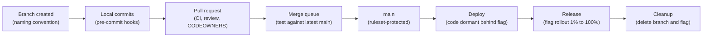
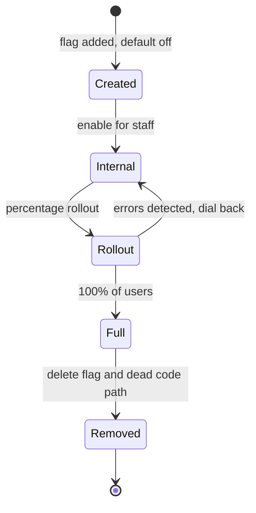
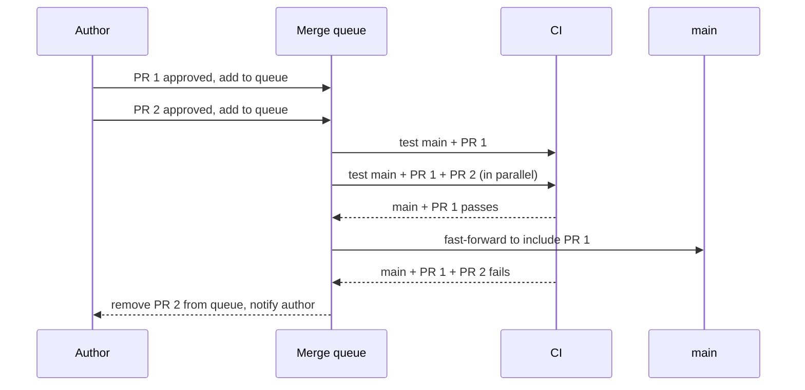
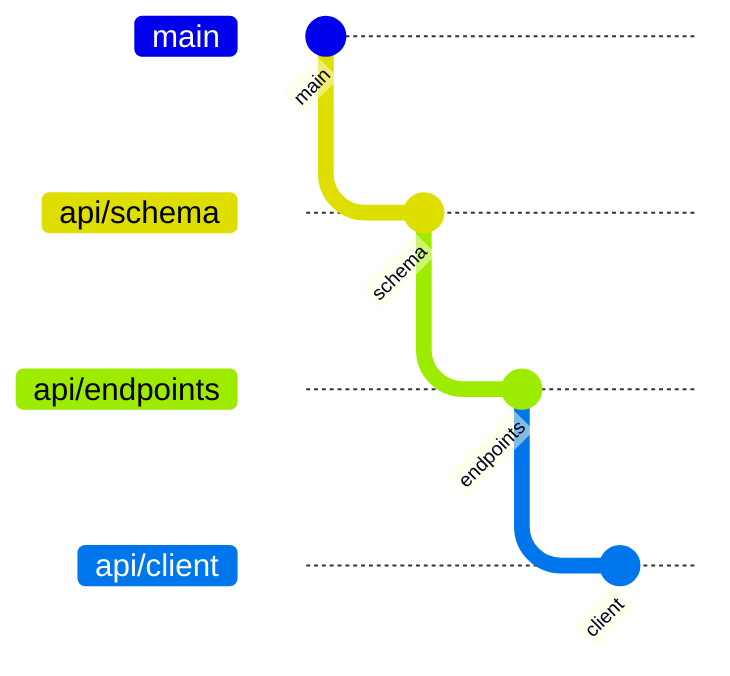
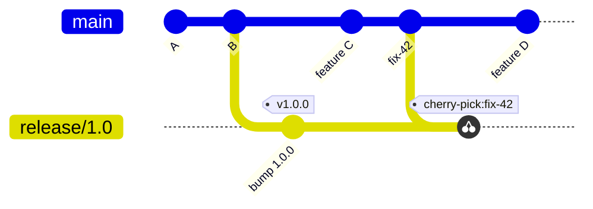

[Technology](./) &raquo; [Git Branching Strategies](branching.html) &raquo; Advanced Branching Techniques

A branching strategy (GitHub Flow, GitLab Flow, Git Flow, or trunk-based development) says *which* branches exist. This page covers the techniques that make a strategy work on a real team: naming conventions, feature flags that separate deploying from releasing, server-side rulesets and merge queues that enforce review and CI, stacked pull requests for large changes, release and hotfix branches for versioned products, and the automation that keeps all of it honest.

It is the companion to [Git Branching Strategies](branching.html), which compares the core workflows. For command syntax see the [Git Command Reference](git-reference.html); for pipeline wiring see [CI/CD](ci-cd/).

## How the Pieces Fit

The techniques on this page act at different points in a change's life. Local hooks give fast feedback, server-side rules are the authoritative gate, and feature flags control exposure after the code is already in production.



## Feature Branch Workflow

Every strategy builds on the same unit of work: a short-lived branch, isolated from `main` until it is reviewed. The shorter the branch lives, the smaller the merge; most teams practicing continuous delivery aim to merge within a day or two.

```bash
git switch main
git pull --ff-only                          # refuse to create a merge commit locally
git switch -c feature/PROJ-123-shopping-cart

# ...work, commit in small logical steps...
git add -p                                  # stage hunks deliberately
git commit -m "Add cart line-item model"

git push -u origin HEAD                     # push the current branch and track it
gh pr create --fill                         # open a PR (GitHub CLI), or use the web UI
```

`git switch` and `git restore` (Git 2.23+) replace the overloaded `git checkout` for changing branches and discarding changes, and are what current Git documentation uses.

### Naming Conventions

Consistent prefixes make a branch's purpose obvious and let automation act on it, for example deploying `feature/*` to preview environments or skipping heavy test suites on `docs/*`.

| Prefix | Purpose | Example |
|--------|---------|---------|
| `feature/` (or `feat/`) | New functionality | `feature/PROJ-123-user-auth` |
| `fix/` (or `bugfix/`) | Non-urgent bug fix | `fix/PROJ-456-null-cart-total` |
| `hotfix/` | Urgent fix to a released version | `hotfix/2.3.1-payment-timeout` |
| `release/` | Stabilizing a versioned release | `release/2.4` |
| `chore/` | Build, dependencies, tooling | `chore/bump-node-22` |
| `docs/` | Documentation only | `docs/api-pagination` |
| `refactor/` | Behaviour-preserving restructuring | `refactor/extract-pricing` |
| `test/` | Tests only | `test/cart-edge-cases` |

Keep names lowercase and hyphen-separated, and embed the issue key (`PROJ-123`) so platforms such as Jira and Linear link the branch to its ticket automatically. Teams that use [Conventional Commits](https://www.conventionalcommits.org/) often reuse the same type vocabulary (`feat`, `fix`, `chore`, `docs`, `refactor`, `test`) for branch prefixes so that branches, commit messages, and changelogs agree.

## Feature Flags with Branching

Feature flags (feature toggles) decouple **deploy** from **release**. Unfinished or risky code merges to `main` and ships to production switched off; it is then enabled for a subset of users, and eventually everyone, without another deploy. Flags are what make trunk-based development workable: the long-lived branch that would otherwise hold an unfinished feature becomes a short-lived branch plus a flag.

```javascript
// OpenFeature JavaScript server SDK; the provider (LaunchDarkly, Unleash,
// flagd, ...) is configured once at startup and can be swapped without
// changing call sites.
import { OpenFeature } from '@openfeature/server-sdk';

const client = OpenFeature.getClient();

const useNewCheckout = await client.getBooleanValue(
  'new-checkout-flow',       // flag key
  false,                     // default if the flag service is unreachable
  { targetingKey: user.id }  // evaluation context used for targeting and % rollouts
);

return useNewCheckout ? newCheckout(cart) : legacyCheckout(cart);
```

What flags buy you:

- **Merge incomplete work safely.** The unfinished path is dead code until the flag turns on.
- **Progressive delivery.** Roll out to internal users, then 1%, 10%, 50%, 100%, watching error rates at each step.
- **Instant rollback.** Turning a flag off is faster and less risky than reverting and redeploying.
- **Experimentation.** A/B tests use the same targeting machinery.

### Flag lifecycle

Every flag is a conditional branch in runtime code, and stale flags accumulate the same kind of complexity that long-lived Git branches do. Treat release flags as temporary, and distinguish them from flags that are meant to stay:

| Flag type | Lifetime | Example |
|-----------|----------|---------|
| Release toggle | Days to weeks; delete after 100% rollout | `new-checkout-flow` |
| Experiment toggle | Duration of the experiment | `pricing-page-variant-b` |
| Ops toggle / kill switch | Long-lived | `disable-recommendations-under-load` |
| Permission toggle | Long-lived | `beta-features-enabled` for a customer tier |



Give each release flag an owner and an expiry date, and open the cleanup ticket when the flag is created.

### Tooling

[OpenFeature](https://openfeature.dev/), a CNCF incubating project, defines a vendor-neutral evaluation API with SDKs for most major languages, so application code does not bind to one vendor. Common backends:

| Tool | Model | Notes |
|------|-------|-------|
| LaunchDarkly | Commercial SaaS | Mature targeting, experimentation, and flag-lifecycle tooling |
| Unleash | Open source, self-hosted or SaaS | |
| Flagsmith | Open source, self-hosted or SaaS | |
| GrowthBook | Open source | Emphasis on experimentation and statistics |
| flagd | Open source (OpenFeature project) | Lightweight flag daemon driven by files or Kubernetes resources |
| AWS AppConfig | Managed AWS service | Feature flags plus validated configuration rollout |

## Branch Protection and Rulesets

Protection turns a workflow from a convention into an enforced rule: protected branches cannot be pushed to directly, deleted, or force-pushed, and merges require review and passing checks.

On GitHub, **repository rulesets** are the current mechanism and are generally preferred over classic branch protection rules. Unlike classic rules, several rulesets can apply to the same branch and their rules are layered; rulesets can target branches or tags by pattern, can be set to *evaluate* mode to see what they would block before enforcing, are visible to anyone with read access, and can be defined once at the organization level. They can be exported and imported as JSON, which makes them easy to keep in version control:

```json
{
  "name": "protect-main",
  "target": "branch",
  "enforcement": "active",
  "conditions": {
    "ref_name": { "include": ["~DEFAULT_BRANCH"], "exclude": [] }
  },
  "bypass_actors": [
    { "actor_id": 123456, "actor_type": "Team", "bypass_mode": "pull_request" }
  ],
  "rules": [
    { "type": "deletion" },
    { "type": "non_fast_forward" },
    { "type": "required_linear_history" },
    {
      "type": "pull_request",
      "parameters": {
        "required_approving_review_count": 1,
        "dismiss_stale_reviews_on_push": true,
        "require_code_owner_review": true,
        "require_last_push_approval": true,
        "required_review_thread_resolution": true
      }
    },
    {
      "type": "required_status_checks",
      "parameters": {
        "strict_required_status_checks_policy": false,
        "required_status_checks": [
          { "context": "build" },
          { "context": "test" }
        ]
      }
    }
  ]
}
```

Apply it with `gh api --method POST repos/OWNER/REPO/rulesets --input protect-main.json`, or manage it with the Terraform GitHub provider's `github_repository_ruleset` resource.

| Rule | Effect |
|------|--------|
| `deletion`, `non_fast_forward` | Block deleting the branch and force-pushing to it |
| `pull_request` | All changes arrive through a PR with the required approvals |
| `dismiss_stale_reviews_on_push` | New commits invalidate earlier approvals, so approval always covers the final diff |
| `require_code_owner_review` | Owners listed in `CODEOWNERS` for the touched paths must approve |
| `require_last_push_approval` | Someone other than the last pusher must approve, closing the "push after approval" gap |
| `required_status_checks` | Named CI jobs must pass; `strict_required_status_checks_policy` also requires the branch to be up to date with the base |
| `required_linear_history` | Only squash or rebase merges, no merge commits |
| `bypass_actors` | Explicit, audited exceptions instead of blanket admin bypass |

GitLab offers the equivalent through **protected branches**, **approval rules**, and **push rules**; Bitbucket through **branch restrictions** and **merge checks**.

### Merge Queues

Required status checks prove that a PR passed against the base it was tested on, not against `main` as it will be after the PRs ahead of it land. On a busy repository, two PRs that each pass independently can break `main` together. Requiring branches to be up to date (`strict` mode) fixes this but forces every author to rebase and re-run CI after each merge.

A **merge queue** automates that: approved PRs enter a queue, the platform builds a temporary branch containing `main` plus every PR ahead in the queue, runs CI on it, and fast-forwards `main` only if it passes.



GitHub's merge queue is enabled with a `merge_queue` ruleset rule (CI workflows must also trigger on the `merge_group` event); GitLab calls the feature **merge trains**. Queues let you drop `strict` mode while still guaranteeing that `main` is always green.

## Stacked Pull Requests

A large change reviewed as a single PR is slow to review and slow to merge. **Stacking** splits it into a chain of small, dependent branches, each reviewed separately, while the author keeps working on the next layer:



Each PR targets the branch below it (`api/endpoints` into `api/schema`), so reviewers see only one layer's diff. The difficulty is keeping the stack consistent when a lower branch changes; Git 2.38 added `--update-refs`, which moves every branch in the stack during a single rebase:

```bash
git switch api/client                     # top of the stack
git rebase --update-refs origin/main      # rebases all three branches at once
git push --force-with-lease origin api/schema api/endpoints api/client

# make it the default
git config --global rebase.updateRefs true
```

Dedicated tools (Graphite, `ghstack`, `spr`, git-town, Sapling) automate creating, syncing, and landing stacks. When the bottom PR merges (particularly as a squash), the next PR must be retargeted to `main` and rebased; these tools handle that step.

## Release Branching Strategy

For products that ship numbered versions and support more than one of them (installed software, SDKs, mobile apps), a release branch lets a version stabilize while development continues on the mainline. Web services deployed continuously from `main` usually do not need release branches.

### Release Branch Workflow

A release branch is cut from the mainline, receives only fixes, and is tagged at release. Fixes flow back to the mainline so they are not lost.



The diagram shows the upstream-first variant: `fix-42` lands on `main`, is cherry-picked onto `release/1.0`, and the cherry-picked commit is tagged `v1.0.1`. Features C and D never reach the release branch.

There are two ways to keep fixes consistent between a release branch and the mainline:

| Approach | How | Used by |
|----------|-----|---------|
| **Upstream first** | Fix lands on `main` first, then is cherry-picked to each supported release branch | Trunk-based teams, Chromium, the Linux kernel stable trees |
| **Merge back** | Fix lands on the release branch, which is later merged into `main` (and `develop`) | Git Flow |

Upstream-first is harder to get wrong: a fix can never be lost by forgetting to merge back, and the cherry-pick (`git cherry-pick -x <sha>` records the source commit) is easy to audit.

### Managing Releases

Git Flow style, with `develop` as the integration branch:

```bash
git switch -c release/2.0 develop

# only release preparation: version bump, changelog, fixes
git commit -am "Bump version to 2.0.0"

git switch main
git merge --no-ff release/2.0
git tag -a v2.0.0 -m "Release 2.0.0"
git push origin main v2.0.0

git switch develop
git merge --no-ff release/2.0             # carry stabilization fixes back
git branch -d release/2.0
```

Trunk-based style, cutting from `main` and patching upstream first:

```bash
git switch -c release/2.0 main && git push -u origin release/2.0
git tag -a v2.0.0 -m "Release 2.0.0" && git push origin v2.0.0

# later: a fix merged to main as abc1234 is back-ported
git switch release/2.0
git cherry-pick -x abc1234
git tag -a v2.0.1 -m "Release 2.0.1" && git push origin release/2.0 v2.0.1
```

Annotated tags (`-a`) carry an author, date, and message and are what `git describe` uses; sign them (`-s`) if consumers verify releases.

### Semantic Versioning with Branches

[Semantic Versioning](https://semver.org/) (`MAJOR.MINOR.PATCH`) maps naturally onto branch and tag names:

| Change | Version bump | Where it happens |
|--------|--------------|------------------|
| Breaking API change | MAJOR (`1.4.2` to `2.0.0`) | New `release/2.0` branch |
| Backward-compatible feature | MINOR (`1.4.2` to `1.5.0`) | New `release/1.5` branch |
| Backward-compatible fix | PATCH (`1.4.2` to `1.4.3`) | Commit or cherry-pick on existing `release/1.4`; tag `v1.4.3` |

Name release branches by `MAJOR.MINOR` (`release/1.4`) and let tags carry the patch number; one branch then serves every patch release in that line. Tools such as semantic-release, release-please, and changesets derive the next version and changelog from Conventional Commit messages, removing manual version bumps.

## Common Pitfalls and Solutions

| Problem | Cause | Remedy |
|---------|-------|--------|
| Frequent, painful merge conflicts | Long-lived branches drifting from `main` | Merge small PRs daily; hide unfinished work behind flags; sync often (below) |
| Re-resolving the same conflict repeatedly | Repeated rebases of a long branch | Enable `rerere` (`git config --global rerere.enabled true`) to replay recorded resolutions |
| Hundreds of stale branches | No cleanup after merge | Turn on "automatically delete head branches"; prune locally (below) |
| `main` broken by two individually green PRs | Semantic conflict between PRs tested in isolation | Merge queue |
| Teammate's commits overwritten | Plain `git push --force` on a shared branch | Use `--force-with-lease`; forbid force-push on shared branches by rule |
| Team members following different workflows | Undocumented or unenforced conventions | Document the strategy in `CONTRIBUTING.md`; enforce with rulesets and CI |

Keeping a feature branch current:

```bash
git fetch origin
git rebase origin/main          # your own branch only; merge origin/main if others share it
git push --force-with-lease
```

Only rebase branches that nobody else has based work on; see the [golden rule of rebasing](branching.html#integrating-merge-vs-rebase).

Cleaning up local branches:

```bash
git config --global fetch.prune true      # drop deleted remote-tracking refs on every fetch

# delete local branches already merged into main
git branch --merged main | grep -vE '^\*|^\+|\bmain$|\bdevelop$' | xargs -r git branch -d

# list local branches whose upstream was deleted (typical after a squash merge,
# which "git branch --merged" cannot detect)
git for-each-ref --format='%(refname:short) %(upstream:track)' refs/heads \
  | awk '$2 == "[gone]" {print $1}'
```

## Tools and Automation

Documentation alone does not enforce a workflow. Local hooks provide fast feedback but are optional (any developer can skip them with `--no-verify`); server-side rules and CI are the authoritative gate.

### Git Hooks

A `pre-push` hook receives each ref being pushed on standard input, so it can check the *destination* branch rather than whichever branch happens to be checked out:

```bash
#!/usr/bin/env bash
# .git/hooks/pre-push  (chmod +x)
# Refuse direct pushes to protected branches.
protected='^refs/heads/(main|develop)$'

while read -r local_ref local_sha remote_ref remote_sha; do
  if [[ "$remote_ref" =~ $protected ]]; then
    echo "pre-push: direct push to ${remote_ref#refs/heads/} is not allowed; open a pull request." >&2
    exit 1
  fi
done
exit 0
```

Hooks in `.git/hooks` are not version controlled. To share them, either commit a directory and point Git at it (`git config core.hooksPath .githooks`), or use the [pre-commit](https://pre-commit.com/) framework, which installs pinned hook versions from a checked-in config:

```yaml
# .pre-commit-config.yaml
repos:
  - repo: https://github.com/pre-commit/pre-commit-hooks
    rev: v6.0.0
    hooks:
      - id: no-commit-to-branch
        args: ['--branch', 'main', '--branch', 'develop']
      - id: check-merge-conflict
      - id: check-added-large-files
```

Run `pre-commit install` once per clone, and `pre-commit autoupdate` to bump the pinned `rev` values.

### CI/CD Integration

Server-side checks cannot be skipped. This GitHub Actions workflow rejects PRs whose branch names do not follow the convention. It needs no checkout, and it passes the branch name through an environment variable rather than interpolating it into the script, because branch names are attacker-controlled input and expressions interpolated directly into a `run:` block are expanded into the script text before the shell parses it, which is a known script-injection vector.


```yaml
name: Branch name
on:
  pull_request:
    branches: [main, develop]

permissions: {}

jobs:
  validate:
    runs-on: ubuntu-latest
    steps:
      - name: Validate branch name
        env:
          BRANCH: ${{ github.head_ref }}
        run: |
          if [[ ! "$BRANCH" =~ ^(feature|fix|bugfix|hotfix|release|chore|docs|refactor|test)/[a-z0-9._-]+$ ]]; then
            echo "::error::Branch '$BRANCH' must match <type>/<lowercase-name>"
            exit 1
          fi
```


Add the job's check name (`validate`) to the ruleset's required status checks so it gates merges. A workflow that must also run inside a merge queue additionally needs `merge_group:` in its `on:` triggers.

## See Also

- [Git Branching Strategies](branching.html) — the core workflows and how to choose between them
- [Git Command Reference](git-reference.html) — command syntax for branch, merge, rebase, and tag
- [Git Version Control](git/) — internals, object model, and distributed VCS fundamentals
- [Git Conflict Resolution and Recovery](git/conflict-and-recovery.html) — resolving conflicts and recovering lost work
- [CI/CD](ci-cd/) — wiring branching strategies into continuous integration and delivery

## References

- [Git documentation](https://git-scm.com/doc) — including `git-rebase` (`--update-refs`) and `githooks`
- [GitHub Docs: About rulesets](https://docs.github.com/en/repositories/configuring-branches-and-merges-in-your-repository/managing-rulesets/about-rulesets)
- [GitHub Docs: Managing a merge queue](https://docs.github.com/en/repositories/configuring-branches-and-merges-in-your-repository/configuring-pull-request-merges/managing-a-merge-queue)
- [GitHub Docs: Secure use reference for GitHub Actions](https://docs.github.com/en/actions/security-for-github-actions/security-guides/security-hardening-for-github-actions) — script injection
- [GitLab Docs: Merge trains](https://docs.gitlab.com/ci/pipelines/merge_trains/)
- [OpenFeature](https://openfeature.dev/) — vendor-neutral feature flag specification
- [Martin Fowler / Pete Hodgson: Feature Toggles](https://martinfowler.com/articles/feature-toggles.html) — toggle categories and lifecycle
- [Martin Fowler / Rouan Wilsenach: Ship / Show / Ask](https://martinfowler.com/articles/ship-show-ask.html)
- [Semantic Versioning](https://semver.org/) and [Conventional Commits](https://www.conventionalcommits.org/)
- [pre-commit framework](https://pre-commit.com/)
