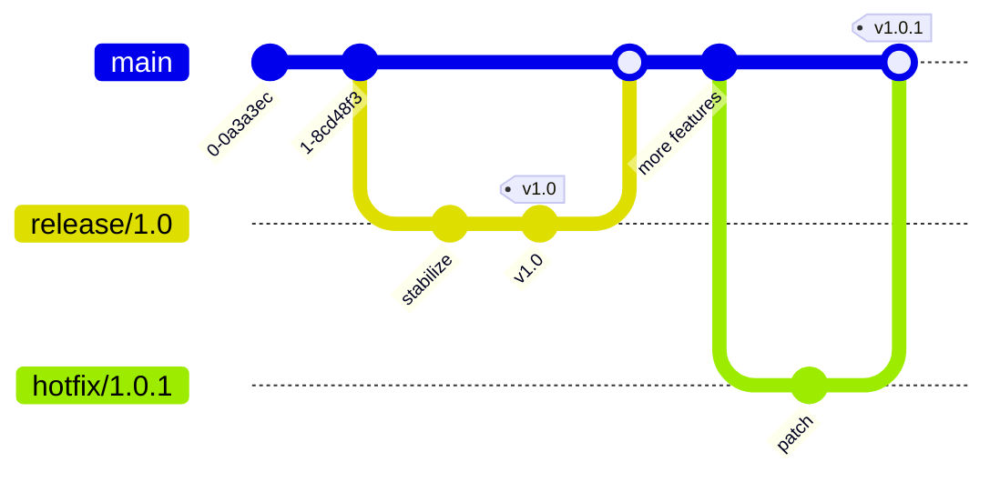

[Technology](./) &raquo; [Git Branching Strategies](branching.html) &raquo; Advanced Branching Techniques

Once you have picked a [branching strategy](branching.html), the day-to-day quality of life on a team comes from the patterns layered on top of it: feature flags that decouple deploy from release, branch protection rules that enforce review and CI, consistent naming so branches are self-documenting, a disciplined release-branch flow for versioned products, and automation that stops bad practices before they reach the remote. This page collects those production techniques and the common pitfalls they solve.

This is the companion to [Git Branching Strategies](branching.html), which compares the four core workflows. Start there to choose a model; come here for the tooling that makes it work in practice. For command syntax see the [Git Command Reference](git-reference.html); for pipeline wiring see [CI/CD](ci-cd/).

## Feature Branch Workflow

The Feature Branch Workflow is the foundation that every strategy on the <a href="branching.html">strategies page</a> builds upon. Every feature is developed in a dedicated branch, isolated from `main` until it is reviewed and ready.

### Basic Workflow

```bash
# Start from main
git checkout main
git pull origin main

# Create feature branch
git checkout -b feature/shopping-cart

# Make changes
git add .
git commit -m "Add shopping cart functionality"

# Push to remote
git push -u origin feature/shopping-cart

# Create pull request and merge after review
```

### Naming Conventions

Consistent prefixes make a branch's purpose obvious at a glance and let automation route branches (for example, deploying `feature/*` to ephemeral preview environments). Common prefixes:

- `feature/` — New features
- `bugfix/` — Bug fixes
- `hotfix/` — Urgent production fixes
- `chore/` — Maintenance tasks
- `docs/` — Documentation updates
- `test/` — Test additions or modifications
- `refactor/` — Code refactoring

A widely used pattern embeds the issue tracker ID so the branch links back to its ticket: `feature/JIRA-123-user-authentication`. Keep names lowercase and hyphen-separated for shell- and URL-friendliness.

## Feature Flags with Branching

Feature flags (a.k.a. feature toggles) decouple **deploy** from **release**: code can ship to production dormant, then be turned on for some or all users by flipping a switch — no redeploy required. Combined with short-lived branches, they are what make trunk-based development and continuous delivery viable even when a feature is not finished.

```javascript
if (featureFlags.isEnabled('new-checkout-flow')) {
    // New implementation
} else {
    // Existing implementation
}
```

This allows:

- Deploying incomplete features safely (the unfinished path stays behind an off flag)
- A/B testing in production
- Gradual rollouts (1% → 10% → 100%)
- Quick rollbacks without redeployment — just flip the flag off

**Flags are not free:** every flag is a branch in your runtime code, and stale flags accumulate into the same kind of complexity that long-lived Git branches create. Treat flags as temporary — track them, set a removal date, and delete the dead code path once a feature is fully rolled out.

**Popular Feature Flag Services:**

- **LaunchDarkly** — Enterprise-grade feature management
- **Unleash** — Open-source feature toggle service
- **Split.io** — Feature flags with built-in experimentation
- **Flipper** — Simple, open-source feature flipping (Ruby/Rails ecosystem)
- **AWS AppConfig** — Native AWS feature flag service

## Branch Protection Rules

Branch protection turns your chosen workflow from a convention into an enforced rule. Configure it in your Git platform so that the protected branches (typically `main`, and `develop`/`production` where they exist) cannot be pushed to directly and cannot be merged into without passing review and CI.

```yaml
# Example GitHub branch protection
main:
  required_reviews: 2
  dismiss_stale_reviews: true
  require_code_owner_reviews: true
  required_status_checks:
    - continuous-integration/travis-ci
    - security/snyk
  enforce_admins: true
  restrictions:
    users: []
    teams: ["release-managers"]
```

Key settings and what they buy you:

- **`required_reviews`** — minimum approvals before merge; `require_code_owner_reviews` additionally demands sign-off from the owners of the touched files.
- **`dismiss_stale_reviews`** — re-requires approval when new commits land, so a review always reflects the final diff.
- **`required_status_checks`** — the merge button stays disabled until named CI/security checks are green.
- **`enforce_admins`** — applies the rules to admins too, closing the "I'll just bypass it" loophole.
- **`restrictions`** — limits who may push to or merge into the branch.

For high-traffic repositories, pair this with a **merge queue** (see references) so that PRs are tested against the exact state of `main` they will land on, eliminating the "passed in isolation, broke on merge" race.

## Release Branching Strategy

For projects with scheduled, versioned releases (the Git Flow case), a dedicated release branch lets you stabilize a release while new feature work continues on the mainline.

### Release Branch Workflow

A release branch is cut from the mainline, stabilized with only fixes (no new features), tagged at release, then merged back so those fixes are not lost:



### Managing Releases

```bash
# Create release branch
git checkout -b release/2.0 develop

# Make release-specific changes (version bumps, changelog — no new features)
git commit -m "Bump version to 2.0"
git commit -m "Update changelog"

# Merge to main and tag the release
git checkout main
git merge --no-ff release/2.0
git tag -a v2.0 -m "Version 2.0"

# Merge back to develop so stabilization fixes are not lost
git checkout develop
git merge --no-ff release/2.0
```

### Semantic Versioning with Branches

Align your branching with [semantic versioning](https://semver.org/) (`MAJOR.MINOR.PATCH`) so a branch name signals the kind of change it carries:

```bash
# Major version (breaking changes)
release/2.0.0

# Minor version (new, backward-compatible features)
release/1.1.0

# Patch version (backward-compatible bug fixes)
hotfix/1.0.1
```

This makes the impact of a release legible from the branch name alone and lets automation derive the next version and changelog from merged branch prefixes.

## Common Pitfalls and Solutions

### Merge Conflicts

**Problem:** Frequent conflicts when merging long-lived branches.

**Solutions:**

- Keep branches short-lived.
- Regularly sync with the base branch.
- Use smaller, focused commits.

```bash
# Regularly update feature branch onto the latest main
git checkout feature/my-feature
git fetch origin
git rebase origin/main
```

(Only rebase branches that are exclusively yours — see the [golden rule of rebasing](branching.html#integrating-merge-vs-rebase).)

### Branch Proliferation

**Problem:** Too many stale branches cluttering the repository.

**Solutions:**

- Automated branch deletion after merge (most platforms offer a "delete branch on merge" toggle).
- Regular branch cleanup scripts.
- Clear branch lifecycle policies.

```bash
# Delete local branches already merged into the current branch
git branch --merged | grep -v "\*\|main\|develop" | xargs -n 1 git branch -d

# Prune remote-tracking branches that no longer exist on the remote
git remote prune origin
```

### Inconsistent Practices

**Problem:** Team members using different workflows.

**Solutions:**

- Document your chosen strategy (and link it from the repo README).
- Provide team training.
- Use automation to enforce practices.
- Hold regular team reviews of the workflow itself.

## Tools and Automation

Documentation alone does not enforce a workflow — automation does. The two most effective layers are local Git hooks (fast feedback before a push) and CI checks (the authoritative gate).

### Git Hooks

Enforce branching rules with Git hooks:

```bash
#!/bin/bash
# .git/hooks/pre-push
# Prevent direct pushes to main

protected_branch='main'
current_branch=$(git symbolic-ref HEAD | sed -e 's,.*/\(.*\),\1,')

if [ $protected_branch = $current_branch ]; then
    echo "Direct push to $protected_branch branch is not allowed"
    exit 1
fi
```

Local hooks are easy to bypass (`--no-verify`) and live only on each developer's machine, so treat them as convenience, not enforcement. For a shareable, version-controlled version, use the **pre-commit framework**:

```yaml
# .pre-commit-config.yaml
repos:
  - repo: https://github.com/pre-commit/pre-commit-hooks
    rev: v4.5.0
    hooks:
      - id: no-commit-to-branch
        args: ['--branch', 'main', '--branch', 'production']
```

### CI/CD Integration

The authoritative gate runs server-side in CI, where it cannot be skipped. This example rejects any PR whose branch name does not match the agreed prefixes:


```yaml
name: Branch Protection
on:
  pull_request:
    branches: [main, develop]

jobs:
  validate:
    runs-on: ubuntu-latest
    steps:
      - uses: actions/checkout@v2
      - name: Validate branch name
        run: |
          if [[ ! "${{ github.head_ref }}" =~ ^(feature|bugfix|hotfix|chore)/.+ ]]; then
            echo "Branch name must start with feature/, bugfix/, hotfix/, or chore/"
            exit 1
          fi
```


## Key Takeaways

- **Feature flags decouple deploy from release,** enabling continuous delivery even with incomplete features — but track and retire flags like any other technical debt.
- **Enforce the workflow with automation** — branch protection rules, naming checks, and required CI status checks beat documentation alone.
- **Server-side checks are authoritative;** local hooks are convenience that developers can bypass.
- **Short-lived branches** and frequent integration remain the single biggest lever against merge conflicts.
- **Align release branches with semantic versioning** so a branch's name signals the impact of its change.

## See Also

- [Git Branching Strategies](branching.html) — the four core workflows and how to choose between them
- [Git Command Reference](git-reference.html) — command syntax for branch, merge, and rebase operations
- [Git Version Control](git/) — internals, architecture, and distributed VCS fundamentals
- [CI/CD](ci-cd/) — wiring branching strategies into continuous integration pipelines

## References

### Essential Documentation
- [Git Documentation](https://git-scm.com/doc)
- [Atlassian Git Tutorials](https://www.atlassian.com/git/tutorials/comparing-workflows)
- [Semantic Versioning](https://semver.org/)
- [pre-commit framework](https://pre-commit.com/)

### Recent Developments
- [GitHub's Merge Queue](https://docs.github.com/en/repositories/configuring-branches-and-merges-in-your-repository/configuring-pull-request-merges/managing-a-merge-queue) — Automated merging at scale
- [Stacked Diffs/PRs](https://graphite.dev/blog/stacked-prs) — Managing dependent changes
- [Ship/Show/Ask](https://martinfowler.com/articles/ship-show-ask.html) — Branching strategy for continuous delivery
- [GitOps with ArgoCD](https://argo-cd.readthedocs.io/en/stable/) — Git as single source of truth
