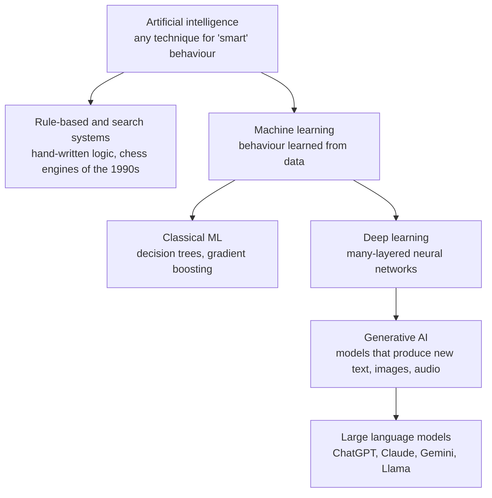
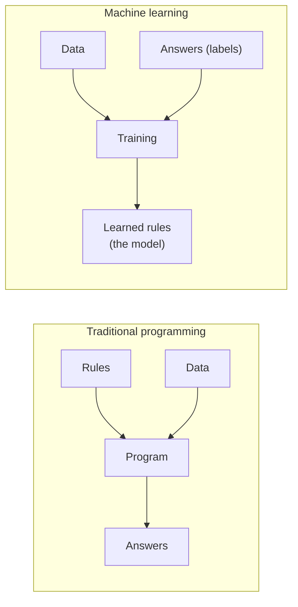
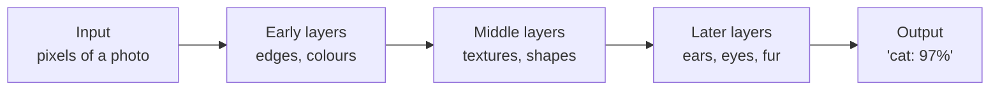
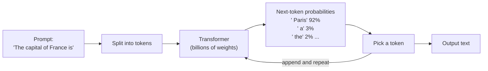
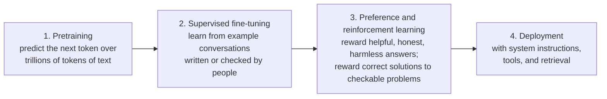
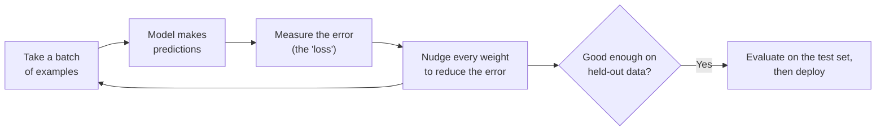

This page is a non-mathematical introduction to artificial intelligence. It explains what the main terms mean, how a machine "learns" from examples, how the large language models behind today's chatbots work, how models are built and evaluated, and where the technology's limits are. No equations or code are required to follow it. For the mathematics and architecture details, continue to [Artificial Intelligence (Complete)](ai/) and the [AI Deep Dive](ai-lecture-2023.html).

## Overview

**Artificial intelligence (AI)** is the broad field of building computer systems that perform tasks normally associated with human intelligence: recognizing images and speech, understanding and producing language, making decisions, and planning. The term covers very different techniques, from hand-written rules to systems that learn their behaviour from data.

The terms in the news are nested inside one another:

Deep learning is one kind of machine learning, which is one approach to AI. Almost every system making headlines since about 2012, and especially since the launch of ChatGPT in November 2022, is a deep-learning system.

### A short history

| Period | Development |
|--------|-------------|
| 1950s | Alan Turing asks whether machines can think (1950); the term "artificial intelligence" is coined for the 1956 Dartmouth workshop |
| 1960s–1980s | Rule-based "expert systems"; early neural networks; two "AI winters" when funding collapsed after results fell short of promises |
| 1997 | IBM's Deep Blue defeats world chess champion Garry Kasparov, using search rather than learning |
| 2012 | A deep neural network (AlexNet) wins the ImageNet image-recognition contest by a wide margin, starting the deep-learning boom |
| 2016 | DeepMind's AlphaGo defeats Go champion Lee Sedol |
| 2017 | Google researchers publish the **Transformer** architecture ("Attention Is All You Need"), the basis of modern language models |
| 2020–2021 | GPT-3 shows that very large language models can perform many tasks from a few examples; AlphaFold 2 predicts protein structures with near-experimental accuracy |
| 2022 | ChatGPT brings conversational AI to the general public; image generators (Stable Diffusion, Midjourney, DALL-E 2) go mainstream |
| 2024 | Nobel Prizes recognize AI: Physics (Hopfield and Hinton, for foundational neural-network work) and Chemistry (Hassabis and Jumper, for AlphaFold, shared with David Baker); the EU AI Act enters into force; OpenAI's o1 introduces "reasoning" models that think before answering |
| 2025–2026 | Open-weight reasoning models (DeepSeek-R1), AI agents that use tools and operate software, and coding assistants that carry out multi-step programming tasks become widespread |

## How Machines Learn

### Machine learning

In traditional programming a person writes the rules. In **machine learning (ML)** a person supplies examples, and the system finds the rules itself. Show a model thousands of photos labeled "cat" or "dog" and it learns to tell them apart, without anyone defining what a whisker is.

The main styles of machine learning differ in what they learn from:

| Style | Learns from | Analogy | Examples |
|-------|-------------|---------|----------|
| **Supervised** | Examples paired with correct answers (labels) | A student with an answer key | Spam filters, medical-image diagnosis, price prediction |
| **Unsupervised** | Unlabeled data; finds structure on its own | Sorting a pile of photos into groups without being told the categories | Customer segmentation, anomaly detection |
| **Self-supervised** | Unlabeled data, turned into a quiz by hiding part of it and predicting the missing piece | Filling in the blanks of millions of sentences | Pretraining of language and image models |
| **Reinforcement** | Trial and error, with rewards for good outcomes | Training a dog with treats | Game-playing AI, robotics, tuning chatbots toward helpful answers |

Self-supervised learning deserves emphasis: it is how modern models learn from enormous amounts of text and images without anyone labeling them. A language model is trained simply to predict the next word of real text, and the "correct answer" is always the word that actually came next.

### Neural networks and deep learning

A **neural network** is a mathematical function loosely inspired by the brain. It is built from many simple units ("neurons") arranged in layers. Each connection has a **weight**, a number saying how strongly one unit influences the next. **Deep learning** means using networks with many layers.

- **Weights** are the adjustable dials. Training is the process of setting them; they *are* what the model learns. Large models have billions of them, often called **parameters**.
- **Layers** progressively transform the input. In an image model, early layers respond to simple patterns like edges and later layers to whole objects. Nobody programs these features; they emerge from training.
- **Activation functions** are small non-linear steps between layers that let the network represent curved, complicated relationships rather than only straight lines.

### Common model families

| Family | Good at | Everyday examples |
|--------|---------|-------------------|
| Decision trees and gradient boosting | Tables of numbers and categories | Credit scoring, fraud detection, demand forecasting |
| Convolutional neural networks (CNNs) | Images | Photo tagging, defect detection in factories |
| Transformers | Sequences: text, code, audio, and increasingly images and video | Chatbots, translation, speech recognition, coding assistants |
| Diffusion models | Generating images, video, and audio by gradually removing noise | Stable Diffusion, Midjourney, video generators |
| Mixture of experts (MoE) | Making very large models cheaper to run by activating only part of the network for each word | Many recent large language models |

For tabular business data, classical methods such as gradient-boosted trees remain hard to beat; deep learning dominates for images, audio, and language.

## How Language Models Work

A **large language model (LLM)** is a Transformer network trained on a vast amount of text (and often code, images, and audio) to predict what comes next. Everything a chatbot does, from answering questions to writing programs, is built on that one skill.

### Tokens and next-token prediction

Text is split into **tokens**: whole words, word pieces, or punctuation. In English a token averages roughly three-quarters of a word. The model reads the tokens so far and outputs a probability for every possible next token; one is chosen, appended, and the process repeats.

The Transformer's key ingredient is **attention**: when processing each token, the model weighs how relevant every other token in the input is. That lets it connect a pronoun to the noun it refers to many sentences earlier, or a function call to its definition far up in a file.

The amount of text a model can consider at once is its **context window**. Early ChatGPT handled a few thousand tokens; current frontier models handle hundreds of thousands, and some a million or more, enough for whole books or codebases.

### From text predictor to assistant

A model that only predicts internet text is not yet a helpful assistant. Chatbots are built in stages:

- **Pretraining** is where nearly all of the model's knowledge and language ability comes from, and where nearly all of the computing cost is spent.
- **Fine-tuning** teaches the format and manners of an assistant.
- **Reinforcement learning from human feedback (RLHF)** and related methods, such as Anthropic's Constitutional AI, steer the model toward answers people prefer. Training with rewards on problems whose answers can be checked automatically (maths, code that must pass tests) is what produced the **reasoning models** introduced from late 2024 onward.

### Reasoning models

A reasoning model is trained to work through a problem step by step, in a hidden or visible "chain of thought", before giving its final answer. Spending more computation at answer time (often called **test-time compute**) substantially improves results on maths, science, and programming problems. The trade-off is that answers take longer and cost more to produce.

### Retrieval, tools, and agents

On its own, a model knows only what was in its training data, which stops at a **knowledge cutoff** date. Three techniques extend it:

| Technique | What it does | Example |
|-----------|--------------|---------|
| **Retrieval-augmented generation (RAG)** | Searches a document collection and places relevant passages in the prompt, so answers are grounded in specific sources | A support bot answering from a company's own manuals |
| **Tool use** | The model can request actions (a web search, a calculation, a database query) and read the results | A chatbot that checks today's weather rather than guessing |
| **Agents** | A model runs in a loop: plan, call tools, observe results, repeat until the task is done | Coding assistants that edit files, run tests, and fix failures on their own |

The **Model Context Protocol (MCP)**, introduced by Anthropic in late 2024 and since adopted widely across the industry, is an open standard for connecting models to tools and data sources, so that a tool integration written once can work with many AI applications.

## AI Categories

AI is often discussed as if it were one thing, but there is a large gap between today's systems and the science-fiction version.

| Category | Meaning | Status |
|----------|---------|--------|
| **Narrow AI** | Systems built for a specific task or range of tasks | Everything deployed today |
| **General-purpose AI** | Single models (LLMs) that handle a very wide range of language, coding, and reasoning tasks | Today's frontier models; still uneven, with surprising failures on tasks humans find easy |
| **Artificial general intelligence (AGI)** | AI that matches human flexibility across essentially all cognitive tasks, including learning new ones as efficiently as people do | Not achieved; timelines are actively disputed among researchers |
| **Artificial superintelligence (ASI)** | AI that greatly exceeds human ability in every domain | Speculative |

The line between the first two rows has blurred. A classic narrow system, such as a chess engine or a spam filter, does exactly one job. A modern LLM can translate, summarise, write code, and tutor, but it still lacks reliable long-term memory, can make confident errors, and does not learn from experience after training the way a person does. Whether scaling up current methods leads to AGI is one of the central open questions in the field.

## Common Applications

| Area | What AI does | Examples |
|------|--------------|----------|
| **Language** | Understands, translates, summarises, and generates text | Chat assistants, translation services, meeting summaries, writing aids |
| **Software development** | Writes, explains, reviews, and tests code | Coding assistants in editors and terminals |
| **Vision** | Recognizes and locates objects, reads text in images | Phone photo search, manufacturing inspection, driver-assistance systems |
| **Speech and audio** | Transcribes speech, synthesises natural voices, separates sounds | Voice assistants, live captions, dubbing |
| **Image and video generation** | Creates or edits images and video from text descriptions | Stable Diffusion, Midjourney, video generation models |
| **Recommendation** | Predicts what a person will want next | Streaming, shopping, and social-media feeds |
| **Science and medicine** | Predicts protein structures, screens drug candidates, reads medical scans, forecasts weather | AlphaFold, AI weather models, radiology support tools |
| **Robotics and autonomy** | Perceives surroundings and plans movement | Warehouse robots, robotaxis operating in several cities |

## How AI Models Are Built

Training is how a model goes from random weights to useful behaviour. The core loop is simple: the model makes a guess, the guess is compared with the right answer, and every weight is nudged slightly in the direction that would have made the guess better. The calculation of which direction to nudge each weight is called **backpropagation**; repeating it over millions of examples is **gradient descent**.

### Step 1: prepare the data

1. **Collect** examples that represent the real situations the model will face.
2. **Clean** them: remove duplicates, errors, and junk; handle missing values.
3. **Label** them if the task is supervised.
4. **Split** them into three sets: a **training set** the model learns from, a **validation set** used to tune choices during development, and a **test set** kept untouched until the end, so the final score reflects data the model has never seen.

Data quality usually matters more than the choice of algorithm. A model can only be as good, and as fair, as the data it learned from.

### Step 2: train

The model repeatedly passes over the training set, adjusting its weights. Small models train in minutes on a laptop; frontier language models train for months on tens of thousands of specialised chips (GPUs or TPUs), at costs in the hundreds of millions of dollars.

Two failure modes bracket good training:

| Problem | What happens | Everyday analogy | Typical fix |
|---------|--------------|------------------|-------------|
| **Underfitting** | Model is too simple or undertrained; poor on both training and new data | Skimming the textbook once | Larger model, more training, better features |
| **Overfitting** | Model memorises the training examples; excellent on them, poor on new data | Memorising the practice exam's answers instead of the subject | More data, simpler model, regularisation, stopping training earlier |

Many practitioners do not train from scratch at all. **Fine-tuning** adapts an existing pretrained model to a new task with far less data and computing power, and techniques such as **LoRA** make it cheap enough to do on a single GPU.

### Step 3: evaluate

"Is it accurate?" is rarely the right question on its own. Consider a screening test for a disease that affects 20 out of 1,000 people. The test flags 30 people, of whom 18 actually have the disease.

| Metric | Question it answers | Value in the example |
|--------|---------------------|----------------------|
| **Accuracy** | What fraction of all predictions were correct? | 98.6% (986 of 1,000) |
| **Precision** | When it says "yes", how often is it right? | 60% (18 of 30 flagged) |
| **Recall** (sensitivity) | Of the real "yes" cases, how many did it catch? | 90% (18 of 20 sick) |
| **F1 score** | A single number balancing precision and recall | 72% |

A useless test that declares *everyone* healthy would score 98% accuracy while catching no cases at all, which is why precision and recall matter when one outcome is rare. Which metric to prioritise depends on the cost of each mistake: a spam filter should favour precision (do not bin real email), a cancer screen should favour recall (do not miss a case).

Language models are evaluated differently: on **benchmarks** (standardised sets of exam questions, coding problems, or tasks), on head-to-head human preference comparisons, and on task-specific tests built by the teams deploying them. Public benchmarks saturate quickly and can leak into training data, so a high score is evidence, not proof, of real-world ability.

## Key Challenges

### Technical limitations

- **Hallucination.** Language models can state false information fluently and confidently, including invented citations. Retrieval, tool use, and asking for sources reduce but do not eliminate this.
- **Knowledge cutoff.** Without search or retrieval, a model knows nothing after its training data ends.
- **Brittleness.** Performance can drop sharply on inputs unlike the training data, or on tasks that look simple to people.
- **Opacity.** Even the builders cannot fully explain why a large network produces a particular output. **Mechanistic interpretability** research tries to reverse-engineer what networks compute internally.
- **Cost and energy.** Training and serving large models requires substantial computing hardware and electricity, and data-centre growth has become a significant factor in electricity demand planning.

### Security

- **Prompt injection.** Text hidden in a web page, document, or email can carry instructions that a model mistakes for its user's, which is a serious risk for agents that read untrusted content and can take actions.
- **Data leakage.** Confidential information pasted into a prompt or included in training data may resurface.
- **Misuse.** Generated text, images, voice, and video enable more convincing fraud, impersonation, and disinformation.

### Ethics and society

- **Bias.** Models learn patterns from historical data, including unfair ones, and can reproduce or amplify them in hiring, lending, or policing.
- **Privacy and consent.** Training data often includes personal information and copyrighted works gathered without explicit permission; several lawsuits over training on copyrighted material are working through the courts.
- **Accountability.** When an automated decision causes harm, responsibility can be unclear.
- **Labour.** AI automates some tasks and changes many jobs; its net effect on employment is still debated.
- **Safety and alignment.** As systems become more capable and autonomous, ensuring they reliably do what their operators intend, and nothing harmful, is an active research field.

**Regulation.** The EU AI Act, in force since August 2024, is the first comprehensive AI law; it bans some uses outright, imposes obligations on providers of general-purpose models, and phases in requirements for "high-risk" systems over several years. Other jurisdictions rely on a mix of existing law, sector rules, voluntary commitments, and national AI safety institutes.

## Tools and Frameworks

These are the names a newcomer is most likely to encounter; each links onward in the rest of the site.

| Purpose | Common choices |
|---------|----------------|
| Deep-learning frameworks | **PyTorch** (dominant in research and increasingly in production), JAX (Google), TensorFlow/Keras |
| Classical machine learning | scikit-learn, XGBoost, LightGBM |
| Pretrained models and datasets | Hugging Face Hub and the Transformers library |
| Running open-weight models locally | llama.cpp, Ollama, LM Studio, MLX (Apple silicon) |
| Serving models at scale | vLLM, SGLang, NVIDIA TensorRT-LLM |
| Experiment tracking and lifecycle | Weights & Biases, MLflow |
| Notebooks and demos | Jupyter, Google Colab, Gradio, Streamlit |

**Open-weight** models (for example the Llama, Qwen, DeepSeek, Mistral, and Gemma families) publish their trained weights so anyone can run and fine-tune them; **closed** models (for example GPT, Claude, and Gemini) are available only through their providers' apps and APIs.

## Glossary

| Term | Meaning |
|------|---------|
| Model | The trained artefact: an architecture plus its learned weights |
| Parameters / weights | The numbers adjusted during training |
| Training / inference | Learning the weights / using the trained model to make predictions |
| Token | A unit of text (word or word piece) that a language model reads and writes |
| Context window | How many tokens a model can consider at once |
| Prompt | The input text or instructions given to a model |
| Fine-tuning | Further training of a pretrained model for a specific task or style |
| Embedding | A list of numbers representing the meaning of a word, sentence, or image, so similar meanings are numerically close |
| Hallucination | Fluent but false model output |
| Foundation model | A large model trained on broad data and adapted to many tasks |
| Multimodal | Handling more than one kind of data, such as text, images, and audio |
| Agent | A model that plans and takes actions with tools in a loop to complete a goal |

## Next Steps

| If you want to... | Read |
|-------------------|------|
| Learn the mathematics behind training | [Artificial Intelligence (Complete)](ai/) and [ML Foundations](ai/ml-foundations.html) |
| Understand Transformers and LLM internals | [AI Deep Dive](ai-lecture-2023.html) |
| Explore image generation hands-on | [Stable Diffusion Fundamentals](../ai-ml/stable-diffusion-fundamentals.html), [ComfyUI Guide](../ai-ml/comfyui-guide.html) |
| Adapt a model to your own data | [LoRA Training](../ai-ml/lora-training.html) |
| Study the theory rigorously | [AI Mathematics](../advanced/ai-mathematics/) |
| See everything AI-related on the site | [AI Documentation Hub](../artificial-intelligence/) |

## See Also

- [Artificial Intelligence (Complete)](ai/) — technical overview with the core mathematics
- [AI Deep Dive](ai-lecture-2023.html) — Transformers, LLM internals, and current research
- [AI Frontier and Ethics](ai/frontier-and-ethics.html) — current research directions and societal questions
- [AI/ML Documentation Hub](../ai-ml/) — hands-on generative AI tools and guides

## References

### Books

- [Understanding Deep Learning](https://udlbook.github.io/udlbook/) — Simon J. D. Prince (MIT Press, 2023); free PDF
- [Dive into Deep Learning](https://d2l.ai/) — interactive book with runnable code
- [The Little Book of Deep Learning](https://fleuret.org/francois/lbdl.html) — François Fleuret; a short, dense overview
- [Deep Learning](https://www.deeplearningbook.org/) — Goodfellow, Bengio, and Courville (2016); foundational, predates Transformers

### Courses and resources

- [Google Machine Learning Crash Course](https://developers.google.com/machine-learning/crash-course)
- [fast.ai](https://www.fast.ai/) — practical deep learning courses
- [Hugging Face Learn](https://huggingface.co/learn) — courses on LLMs, agents, and diffusion models
- [Hugging Face Papers](https://huggingface.co/papers/trending) — trending research papers (the successor to Papers with Code, which now redirects there)
