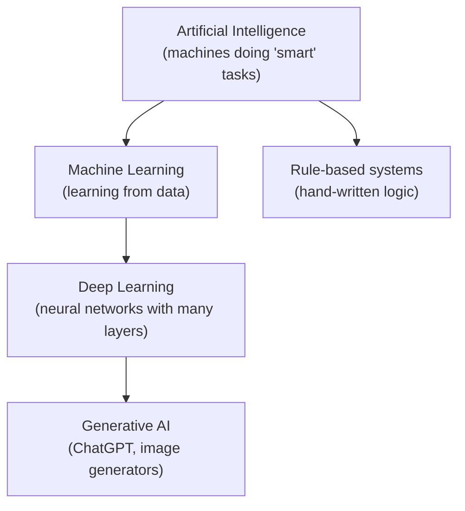
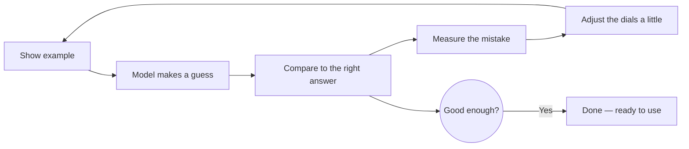

This is the friendly, no-math introduction to artificial intelligence. It builds intuition for what AI is, how machines "learn," and where the technology shows up in everyday life — plain-language concepts and real-world examples, the "why" before the "how." When you're ready for equations and architecture details, the [Complete](ai/) and [Deep Dive](ai-lecture-2023.html) versions are waiting.

## What You'll Learn

| Section | Question it answers |
|---------|---------------------|
| [Overview](#overview) | What does "AI" actually mean? |
| [How Machines Learn](#how-machines-learn) | How can a computer learn from examples? |
| [AI Categories](#ai-categories) | Narrow AI vs. the AGI you hear about in the news |
| [Common Applications](#common-applications) | Where is AI used today? |
| [How Models Are Built](#how-ai-models-are-built) | The training process, step by step |
| [Key Challenges](#key-challenges) | What can go wrong, and the ethics |

## Overview

Artificial Intelligence (AI) refers to computer systems capable of performing tasks that typically require human intelligence, including visual perception, speech recognition, decision-making, and language translation. AI encompasses various approaches and techniques for creating intelligent systems.

The simplest way to picture how the major ideas fit together:



Think of these as nested ideas: deep learning is a kind of machine learning, which is a kind of AI. The chatbots and image generators making headlines are mostly built on deep learning.

## How Machines Learn

### Machine Learning
Machine Learning (ML) is a subset of AI where systems learn from data without explicit programming. Instead of a human writing down every rule, the system studies many examples and figures out the patterns on its own. Show it thousands of photos labeled "cat" or "dog," and it learns the difference — without anyone defining what a whisker is.

The three main styles of machine learning differ in *what kind of data they learn from*:

| Style | How it learns | Analogy | Examples |
|-------|---------------|---------|----------|
| **Supervised** | From **labeled** examples — data with the right answers attached | A student with an answer key | Spam filters, photo tagging, price prediction |
| **Unsupervised** | Finds hidden structure in **unlabeled** data — no answers provided | Sorting a pile of photos into groups without being told the categories | Customer segmentation, anomaly detection |
| **Reinforcement** | By **trial and error**, earning rewards for good actions | Training a dog with treats | Game-playing AI, robotics, self-driving cars |

### Deep Learning
Deep Learning uses artificial neural networks with multiple layers to progressively extract higher-level features from raw input. It has revolutionized fields like computer vision and natural language processing.

A neural network is loosely inspired by the brain: many simple units ("neurons") connected in layers. Early layers spot simple things (edges, colors); later layers combine those into complex ideas (a face, a word, a melody).

**Neural Network Components (the plain-English version):**
- **Input Layer**: Where the raw data comes in (the pixels of a photo, the words of a sentence)
- **Hidden Layers**: The "thinking" layers that progressively find patterns
- **Output Layer**: The final answer (e.g., "this is a cat, 97% sure")
- **Activation Functions**: Tiny decision-makers that let the network learn curvy, complex patterns instead of just straight lines
- **Weights and Biases**: The dials the network tunes during training — these *are* what the model "learns"

## AI Categories

People often lump all AI together, but there's a huge gap between today's reality and the science-fiction vision. Here's how researchers categorize it:

**Narrow AI (today's reality)** — systems designed for one specific task, astonishingly good at it (often better than humans) but unable to do anything else. **Every AI you've ever used is narrow AI:**

- Image recognition (YOLO, ResNet, Vision Transformers)
- Translation services (Google Translate, DeepL)
- Recommendation engines (Netflix, YouTube, TikTok)
- Game-playing AI (AlphaGo, AlphaStar, OpenAI Five)
- Virtual assistants (Siri, Alexa, Google Assistant)
- Code helpers (GitHub Copilot)
- Generative AI (ChatGPT, Claude, DALL-E, Midjourney)

**General AI (still hypothetical)** — **AGI** would match human flexibility across *all* domains, learning any task a person can. It does not exist yet; rapid progress in large language models has intensified debate over how close we are, but there is no consensus. **Superintelligence (ASI)** — AI that surpasses humans at everything — is further out still and purely speculative.

> **Quick reality check:** When the news says "AI," it almost always means a *narrow* system that's great at one thing. ChatGPT can write essays but can't drive a car; a chess engine can crush a grandmaster but can't hold a conversation.

## Key Algorithms and Techniques

### Classification Algorithms
- **Decision Trees**: Tree-like model of decisions
- **Random Forests**: Ensemble of decision trees
- **Support Vector Machines (SVM)**: Finds optimal decision boundaries
- **Naive Bayes**: Probabilistic classifier
- **k-Nearest Neighbors (k-NN)**: Instance-based learning

### Regression Algorithms
- **Linear Regression**: Models linear relationships
- **Polynomial Regression**: Captures non-linear patterns
- **Ridge/Lasso Regression**: Regularized linear models

### Neural Network Architectures
- **Feedforward Networks**: Information flows in one direction
- **Convolutional Neural Networks (CNN)**: Specialized for image processing
- **Recurrent Neural Networks (RNN)**: Process sequential data (mostly replaced by Transformers)
- **Transformers**: State-of-the-art for NLP and increasingly for vision tasks
- **Generative Adversarial Networks (GAN)**: Generate new data samples
- **Diffusion Models**: Current state-of-the-art for image generation (Stable Diffusion, DALL-E)
- **Mixture of Experts (MoE)**: Efficient scaling approach (Mixtral, DeepSeek-V3)

## Common Applications

### Computer Vision
- **Object Detection**: Identify and locate objects in images
- **Image Classification**: Categorize images
- **Facial Recognition**: Identify individuals
- **Medical Imaging**: Diagnose diseases from scans
- **Autonomous Vehicles**: Interpret visual environment

### Natural Language Processing (NLP)
- **Text Classification**: Spam detection, sentiment analysis
- **Machine Translation**: Convert between languages
- **Named Entity Recognition**: Extract entities from text
- **Question Answering**: Understand and respond to queries
- **Text Generation**: Create human-like text

### Recommendation Systems
- **Collaborative Filtering**: Based on user behavior patterns
- **Content-Based Filtering**: Based on item characteristics
- **Hybrid Systems**: Combine multiple approaches

## How AI Models Are Built

"Training" is how a model goes from knowing nothing to being useful. The core idea is simple: the model makes a guess, sees how wrong it was, and nudges its internal dials to do better next time — repeated millions of times.



### Step 1 — Prepare the Data
1. **Collect** relevant examples (the more, the better)
2. **Clean** them — fix errors, remove junk, handle gaps
3. **Engineer features** — highlight the parts that matter
4. **Split** into training, validation, and test sets so you can fairly judge the result on data the model has never seen

### Step 2 — Train the Model
The conceptual loop, in pseudocode:

```python
# Conceptual example — repeated many times
for batch in training_data:
    guess = model.predict(batch.inputs)        # make a guess
    mistake = compare(guess, batch.answers)     # how wrong was it?
    model.adjust_to_reduce(mistake)             # nudge the dials
```

That's the whole secret. There's no magic — just guess, measure, adjust, repeat.

### Step 3 — Measure How Good It Is
We don't just ask "is it right?" — context matters. Common scorecards:

| Metric | Plain-English meaning | When you care |
|--------|----------------------|---------------|
| **Accuracy** | Fraction of predictions that were correct | Balanced, everyday tasks |
| **Precision** | When it says "yes," how often is it right? | Avoiding false alarms (e.g., spam filters) |
| **Recall** | Of all the real "yes" cases, how many did it catch? | Not missing things (e.g., disease screening) |
| **F1 Score** | A balance of precision and recall | When you need both |

(There are fancier ones like AUC-ROC, but these four cover most of what you'll hear about.)

## Key Challenges

### Technical Challenges
- **Overfitting**: Model performs well on training data but poorly on new data
- **Underfitting**: Model fails to capture underlying patterns
- **Computational Requirements**: Large models require significant resources
- **Data Quality**: Performance depends on quality and quantity of data

### Ethical Considerations
- **Bias**: AI systems can perpetuate or amplify existing biases
- **Privacy**: Data collection and usage concerns
- **Transparency**: Understanding how AI makes decisions
- **Accountability**: Responsibility for AI decisions
- **Job Displacement**: Impact on employment

## Popular Frameworks and Tools

### Deep Learning Frameworks
- **PyTorch**: Meta's dynamic neural network library (most popular for research)
- **TensorFlow**: Google's open-source framework (popular in production)
- **JAX**: Google's high-performance ML research framework (growing rapidly)
- **Hugging Face Transformers**: De facto standard for NLP models
- **Lightning**: High-level wrapper for PyTorch
- **MLX**: Apple's framework for Apple Silicon

### Traditional ML Libraries
- **scikit-learn**: Comprehensive machine learning library
- **XGBoost**: Gradient boosting framework
- **LightGBM**: Fast gradient boosting
- **CatBoost**: Gradient boosting with categorical features

### Development Tools
- **Jupyter Notebooks/JupyterLab**: Interactive development environment
- **Google Colab**: Free cloud-based notebook platform with GPU
- **Weights & Biases**: Experiment tracking and model monitoring
- **MLflow**: ML lifecycle management
- **Hugging Face Hub**: Model and dataset repository
- **Gradio/Streamlit**: Quick ML demo creation
- **LangChain/LlamaIndex**: LLM application frameworks
- **Modal/Replicate**: Serverless ML deployment

## Future Directions

### Emerging Trends
- **Multimodal Models**: AI that processes text, images, audio, and video together
- **Small Language Models (SLMs)**: Efficient models for edge deployment (Phi-4, Gemma 2/3)
- **AI Agents**: Autonomous systems that can use tools and complete tasks
- **Retrieval Augmented Generation (RAG)**: Combining LLMs with external knowledge
- **Constitutional AI**: Training AI systems to be helpful, harmless, and honest
- **Mixture of Experts**: Efficient scaling through specialized sub-networks
- **Long Context Windows**: Models handling 100K+ tokens (Claude 4, Gemini 2.x)
- **Open Source AI**: Rapid progress in open models (Llama 4, Mistral)

### Active Research Areas
- **Reasoning and Planning**: Teaching AI to solve complex multi-step problems
- **Hallucination Reduction**: Making LLMs more factual and reliable
- **Efficient Fine-tuning**: LoRA, QLoRA, and other parameter-efficient methods
- **AI Safety and Alignment**: Ensuring AI systems behave as intended
- **Mechanistic Interpretability**: Understanding how neural networks work internally
- **Synthetic Data Generation**: Using AI to create training data
- **Embodied AI**: Connecting AI to robotics and physical interaction
- **Continuous Learning**: AI that learns and adapts over time

## References

### Classic Texts
- [Deep Learning Book](https://www.deeplearningbook.org/) - Goodfellow, Bengio, and Courville
- [Pattern Recognition and Machine Learning](https://www.microsoft.com/en-us/research/people/cmbishop/prml-book/) - Christopher Bishop
- [The Elements of Statistical Learning](https://hastie.su.domains/ElemStatLearn/) - Hastie, Tibshirani, and Friedman

### Modern Resources
- [Understanding Deep Learning](https://udlbook.github.io/udlbook/) - Simon J.D. Prince (2023)
- [The Little Book of Deep Learning](https://fleuret.org/francois/lbdl.html) - François Fleuret
- [Dive into Deep Learning](https://d2l.ai/) - Interactive deep learning book

### Online Platforms
- [Papers with Code](https://paperswithcode.com/) - ML papers with implementations
- [Hugging Face](https://huggingface.co/) - Models, datasets, and demos
- [Fast.ai](https://www.fast.ai/) - Practical deep learning courses
- [Google AI](https://ai.google/education/) - Free ML courses and resources
- [OpenAI Cookbook](https://cookbook.openai.com/) - Practical LLM examples

## Key Takeaways

- **AI is an umbrella term.** Machine learning is AI that learns from data; deep learning is ML using many-layered neural networks; generative AI (ChatGPT, image makers) is the headline-grabbing branch of deep learning.
- **Learning = guess, measure, adjust, repeat.** No magic — just a feedback loop run millions of times until the model is good enough.
- **Three learning styles:** supervised (with answer keys), unsupervised (find your own patterns), reinforcement (trial and error with rewards).
- **Everything today is narrow AI** — superhuman at one task, helpless at others. General AI (AGI) does not yet exist.
- **Quality depends on data and honest evaluation** — biased or messy data leads to biased, unreliable models.

## Next Steps

Ready to go deeper? Here's your learning path:

### Level Up Your Knowledge
- [AI Fundamentals - Complete](ai/) - Technical details with mathematical foundations
- [AI Deep Dive](ai-lecture-2023.html) - Research-level content on transformers and LLMs
- [AI Mathematics](../advanced/ai-mathematics/) - Statistical learning theory and proofs

### Build Something
- [Stable Diffusion Fundamentals](../ai-ml/stable-diffusion-fundamentals.html) - Generate images with AI
- [ComfyUI Guide](../ai-ml/comfyui-guide.html) - Visual workflow interface
- [LoRA Training](../ai-ml/lora-training.html) - Train your own AI models

### Explore the Hub
- [AI Documentation Hub](../artificial-intelligence/) - Complete navigation for all AI resources

---

## See Also

- [Artificial Intelligence (Complete)](ai/) — the technical overview with the core mathematics
- [AI Deep Dive](ai-lecture-2023.html) — transformers, LLM internals, and current research
- [AI/ML Documentation Hub](../ai-ml/) — hands-on generative AI tools and guides
- [AI Mathematics](../advanced/ai-mathematics/) — when you're ready for the proofs
