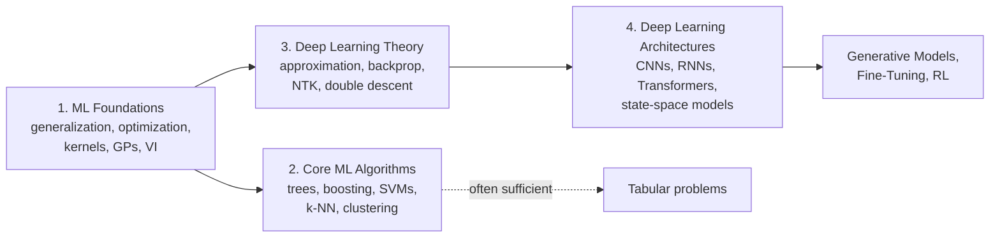

[AI & Machine Learning](./) › ML & Deep Learning

This is the entry point for the site's core machine-learning and deep-learning track. The track is four pages, meant to be read in order: the mathematics that makes learning from data possible, the classical algorithms that still win most tabular problems, the theory of why deep networks train and generalize, and the deep architectures themselves, from the multilayer perceptron to Transformers and state-space models. Each page stands alone, so you can also go straight to the one you need; the [topic index](#topic-index) below says where each concept lives.

## The four pages

| # | Page | What it covers |
|---|------|----------------|
| 1 | [Machine Learning Foundations](ml-foundations.html) | Statistical learning theory, the bias–variance tradeoff, generalization bounds, gradient descent, SGD and Adam, regularization, the kernel trick and SVMs, Gaussian processes, and variational inference. |
| 2 | [Core ML Algorithms](core-ml-algorithms.html) | Linear and logistic regression, decision trees, random forests, gradient boosting (XGBoost, LightGBM, CatBoost), SVMs, k-NN, clustering, dimensionality reduction, evaluation pitfalls, and tabular foundation models, with runnable scikit-learn code. |
| 3 | [Deep Learning Theory](deep-learning-theory.html) | Universal approximation, backpropagation, initialization, normalization and residual connections, the neural tangent kernel and feature learning, the optimization landscape, double descent and grokking, generalization, and scaling laws. |
| 4 | [Deep Learning Architectures](deep-learning-architectures.html) | The MLP, convolutional networks, RNNs, LSTMs and GRUs, attention and the Transformer, mixture of experts, Vision Transformers, CLIP and multimodal LLMs, and subquadratic sequence models such as Mamba and hybrid architectures. |

## How the pages depend on each other

1. **[Machine Learning Foundations](ml-foundations.html)** explains why learning from finite data works at all. It sets up generalization, overfitting, and the bias–variance tradeoff, the optimization methods every later page uses, and the classical tools (kernels, Gaussian processes, variational inference) that reappear inside deep learning.
2. **[Core ML Algorithms](core-ml-algorithms.html)** is the practical toolbox built on those ideas. For data that fits in a table with named columns, a tuned gradient-boosted tree ensemble is the baseline a neural network must beat, and for many problems the track ends here.
3. **[Deep Learning Theory](deep-learning-theory.html)** covers what is known, and what is still open, about deep networks: what they can represent, how gradients flow through them, why gradient descent finds good solutions in a non-convex landscape, and why models with more parameters than data points still generalize. The neural tangent kernel links wide networks back to the kernel methods of page 1.
4. **[Deep Learning Architectures](deep-learning-architectures.html)** tours the model families themselves, with the core equations for each and the inductive bias that makes it suit its data.

## Choosing between classical ML and deep learning

The deciding factor is usually the structure of the input, not the size of the dataset.

| Data | Typical first choice | Why |
|------|----------------------|-----|
| Tabular, with meaningful columns | Gradient-boosted trees; a tabular foundation model such as TabPFN on small datasets | Trees exploit per-column thresholds and interactions directly; neural nets rarely beat them here |
| Images, video | Pretrained CNN or Vision Transformer, fine-tuned | Convolution and patch attention exploit spatial structure |
| Text, code | Pretrained Transformer language model | Attention models long-range dependencies; pretraining supplies most of the knowledge |
| Audio, time series with long context | Transformer or state-space model; gradient boosting on engineered features for short, tabular-like series | Depends on whether raw-signal representation learning is needed |
| Paired modalities (image and text) | Contrastive or multimodal pretrained model (CLIP-style) | A shared embedding space enables retrieval and zero-shot classification |

In most applied work today the starting point for unstructured data is a pretrained model that is fine-tuned or prompted, not one trained from scratch; see [Fine-Tuning & Transfer Learning](fine-tuning.html).

## Topic index

Where to find each concept in the track:

| Concept | Page and section |
|---------|------------------|
| Empirical risk minimization | [ML Foundations](ml-foundations.html#the-learning-problem) |
| Bias–variance decomposition | [ML Foundations](ml-foundations.html#biasvariance-decomposition); applied to ensembles in [Core ML Algorithms](core-ml-algorithms.html#ensemble-methods-the-big-idea) |
| PAC learning, VC dimension, Rademacher complexity | [ML Foundations](ml-foundations.html#generalization-theory) |
| Cross-validation and data leakage | [ML Foundations](ml-foundations.html#model-selection-and-validation); [Core ML Algorithms](core-ml-algorithms.html#evaluation-and-common-pitfalls) |
| Gradient descent, SGD, Adam and AdamW | [ML Foundations](ml-foundations.html#optimization) |
| Kernel trick and SVMs | [ML Foundations](ml-foundations.html#the-kernel-trick-making-linear-methods-powerful); [Core ML Algorithms](core-ml-algorithms.html#support-vector-machines) |
| Gaussian processes | [ML Foundations](ml-foundations.html#gaussian-processes) |
| Variational inference, reparameterization trick | [ML Foundations](ml-foundations.html#variational-inference) |
| Random forests, gradient boosting | [Core ML Algorithms](core-ml-algorithms.html#random-forests), [gradient boosting](core-ml-algorithms.html#gradient-boosting) |
| Universal approximation, depth separation | [Deep Learning Theory](deep-learning-theory.html#universal-approximation) |
| Backpropagation, vanishing gradients | [Deep Learning Theory](deep-learning-theory.html#backpropagation) |
| Initialization, normalization, residual connections | [Deep Learning Theory](deep-learning-theory.html#signal-propagation-initialization-normalization-and-residuals) |
| Neural tangent kernel, feature learning | [Deep Learning Theory](deep-learning-theory.html#training-dynamics-lazy-and-feature-learning-regimes) |
| Optimization landscape, saddle points | [Deep Learning Theory](deep-learning-theory.html#the-optimization-landscape) |
| Double descent, benign overfitting, grokking | [Deep Learning Theory](deep-learning-theory.html#double-descent-benign-overfitting-and-grokking) |
| Scaling laws | [Deep Learning Theory](deep-learning-theory.html#scaling-laws) |
| Convolutional networks | [Deep Learning Architectures](deep-learning-architectures.html#convolutional-neural-networks) |
| RNNs, LSTMs, GRUs | [Deep Learning Architectures](deep-learning-architectures.html#recurrent-networks) |
| Attention and the Transformer | [Deep Learning Architectures](deep-learning-architectures.html#attention-and-the-transformer) |
| Mixture of experts | [Deep Learning Architectures](deep-learning-architectures.html#mixture-of-experts) |
| Vision Transformers | [Deep Learning Architectures](deep-learning-architectures.html#vision-transformers) |
| CLIP and multimodal LLMs | [Deep Learning Architectures](deep-learning-architectures.html#contrastive-imagetext-models-and-multimodal-llms) |
| State-space models, Mamba, linear attention, hybrids | [Deep Learning Architectures](deep-learning-architectures.html#beyond-transformers-subquadratic-sequence-models) |

## See also

- [Loss Functions](loss-functions.html) — the objectives these models are trained against
- [Fine-Tuning & Transfer Learning](fine-tuning.html) — adapting pretrained models with full fine-tuning, LoRA, and preference optimization
- [Generative Models](generative-models.html) — diffusion, GANs, VAEs, and autoregressive generation built on these architectures
- [Reinforcement Learning](reinforcement-learning.html) — learning from interaction rather than labeled data
- [Frontier Research & Ethics](frontier-and-ethics.html) — scaling laws, interpretability, and alignment of large models
- [AI Mathematics](../../advanced/ai-mathematics/) — formal proofs for the theory above
