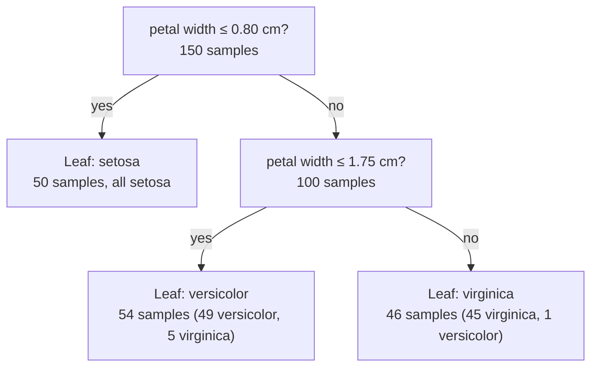
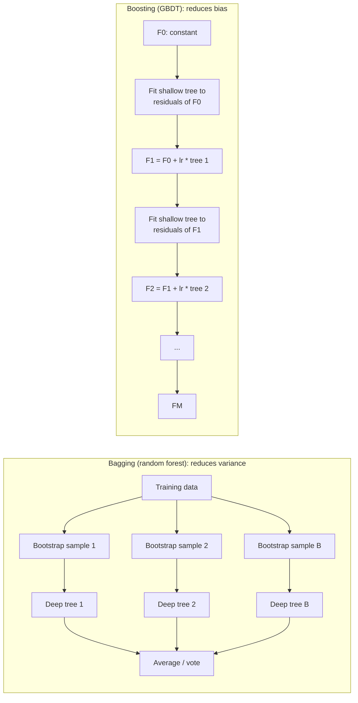
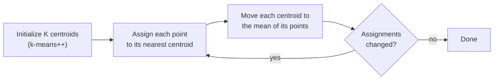
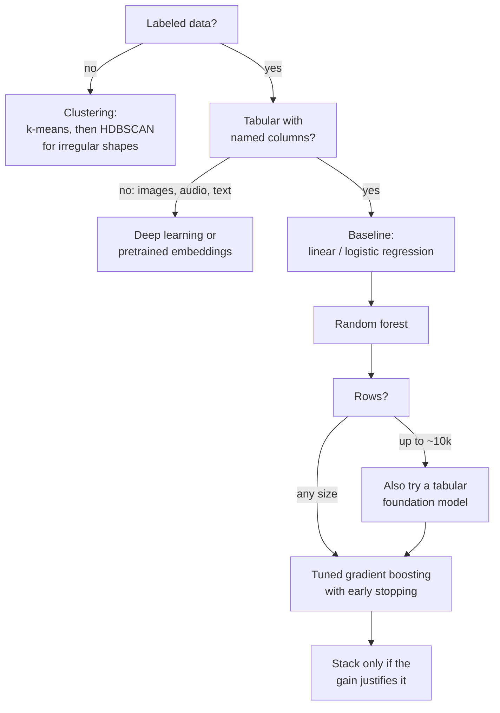

[AI & Machine Learning](./) › Core ML Algorithms

This page is a reference to the classical machine-learning algorithms: linear and logistic regression, decision trees, random forests, gradient boosting (XGBoost, LightGBM, CatBoost, and scikit-learn's histogram booster), support vector machines, k-nearest neighbors, clustering, and dimensionality reduction. Each section gives the model's form, how it is fitted, the knobs that matter, and a short, runnable example. The last sections cover how to combine models, how to avoid the evaluation mistakes that invalidate most tabular results, and where the newer tabular foundation models fit.

On structured (tabular) data these methods remain the default choice. They train in seconds to minutes, need little tuning, can be inspected, and a tuned gradient-boosted tree ensemble is still the strongest general-purpose baseline on spreadsheet-shaped data. Deep networks earn their place on images, audio, text, and other high-dimensional signals without named columns; see [Deep Learning Architectures](deep-learning-architectures.html). The theory underneath this page (generalization bounds, convexity, the kernel trick in depth) is in [Machine Learning Foundations](ml-foundations.html).

<div class="notice--info" markdown="1">
**Versions.** Code targets **scikit-learn 1.9**, **XGBoost 3.4**, and **LightGBM 4.7** (current as of September 2026). Two recent scikit-learn API changes affect older tutorials: `LogisticRegression(penalty=...)` is deprecated since 1.8 in favor of `l1_ratio`, and `SVC(probability=True)` is deprecated since 1.9 in favor of wrapping the model in `CalibratedClassifierCV`.
</div>

## The supervised learning setup

A supervised algorithm learns a function $f$ that maps an input $\mathbf{x} \in \mathbb{R}^d$ to an output $y$, using $n$ labeled examples $\{(\mathbf{x}_i, y_i)\}_{i=1}^n$. Almost every method on this page is an instance of **regularized empirical risk minimization**: pick $f$ from a hypothesis class $\mathcal{F}$ to minimize average training loss plus a complexity penalty.

$$\hat{f} = \arg\min_{f \in \mathcal{F}}\; \frac{1}{n}\sum_{i=1}^{n} L\bigl(y_i,\, f(\mathbf{x}_i)\bigr) + \lambda\, \Omega(f)$$

**Regression** predicts a continuous $y$ (usually squared-error loss); **classification** predicts a discrete $y$ (usually log-loss, also called cross-entropy). The penalty $\Omega$ and its weight $\lambda$ set the bias–variance tradeoff: too little regularization overfits, too much underfits, and $\lambda$ is chosen by cross-validation. The algorithms differ in the shape of $f$ they can represent and in how they search for it:

| Family | Shape of $f$ | How it is fitted | Needs feature scaling |
|--------|--------------|------------------|-----------------------|
| Linear / logistic | Hyperplane (optionally on engineered features) | Closed form or convex optimization | Yes, when regularized |
| Trees and tree ensembles | Piecewise-constant, axis-aligned regions | Greedy recursive splitting; averaging or boosting | No |
| SVM | Maximum-margin hyperplane in a kernel feature space | Convex quadratic program | Yes |
| k-NN | Local average of stored examples | None (lazy) | Yes |

The code examples share one synthetic classification dataset:

```python
import numpy as np
from sklearn.datasets import make_classification
from sklearn.model_selection import train_test_split
from sklearn.pipeline import make_pipeline
from sklearn.preprocessing import StandardScaler

X, y = make_classification(n_samples=2000, n_features=20, n_informative=8,
                           random_state=0)
Xtr, Xte, ytr, yte = train_test_split(X, y, test_size=0.25, stratify=y,
                                      random_state=0)
```

## Linear regression

Linear regression assumes the target is an affine function of the features plus noise:

$$\hat{y} = \mathbf{w}^\top \mathbf{x} + b = b + \sum_{j=1}^{d} w_j x_j$$

The weights are fitted by minimizing mean squared error, which is the maximum-likelihood estimate under Gaussian noise:

$$L(\mathbf{w}, b) = \frac{1}{n}\sum_{i=1}^{n}\bigl(y_i - \mathbf{w}^\top \mathbf{x}_i - b\bigr)^2$$

### Closed-form solution

With the data stacked into a design matrix $X \in \mathbb{R}^{n \times d}$ (including a column of ones for the intercept) and a target vector $\mathbf{y}$, the loss is convex. When $X$ has full column rank its unique minimizer is given by the **normal equations**:

$$\hat{\mathbf{w}} = (X^\top X)^{-1} X^\top \mathbf{y}$$

Geometrically, $X\hat{\mathbf{w}}$ is the orthogonal projection of $\mathbf{y}$ onto the column space of $X$. Libraries solve the system with a QR or SVD factorization rather than forming $(X^\top X)^{-1}$, because squaring the matrix squares its condition number and becomes unstable when features are nearly collinear.

### Regularization: ridge, lasso, elastic net

When features are correlated, or $d$ is large relative to $n$, least squares overfits and individual weights become large and unstable. A penalty on the weights fixes this:

| Method | Penalty | Effect | Closed form |
|--------|---------|--------|-------------|
| Ridge | $\lambda \lVert \mathbf{w}\rVert_2^2$ | Shrinks all weights smoothly; stabilizes collinear features | $(X^\top X + \lambda I)^{-1} X^\top \mathbf{y}$ |
| Lasso | $\lambda \lVert \mathbf{w}\rVert_1$ | Drives some weights exactly to zero (feature selection) | No; coordinate descent |
| Elastic net | $\lambda\bigl(\alpha\lVert \mathbf{w}\rVert_1 + \tfrac{1-\alpha}{2}\lVert \mathbf{w}\rVert_2^2\bigr)$ | Sparse like lasso, but keeps groups of correlated features together | No |

$$L_{\text{ridge}} = \lVert \mathbf{y} - X\mathbf{w}\rVert_2^2 + \lambda\lVert \mathbf{w}\rVert_2^2, \qquad L_{\text{lasso}} = \lVert \mathbf{y} - X\mathbf{w}\rVert_2^2 + \lambda\lVert \mathbf{w}\rVert_1$$

The intercept is not penalized. Because the penalty treats all weights alike, features must be on comparable scales, so standardize them first. In scikit-learn, $\lambda$ is called `alpha` for the regression models; `RidgeCV`, `LassoCV`, and `ElasticNetCV` choose it by cross-validation.

```python
from sklearn.linear_model import LinearRegression, Ridge, LassoCV
from sklearn.model_selection import cross_val_score

rng = np.random.default_rng(0)
Xr = rng.standard_normal((500, 10))
true_w = np.array([3, 0, -2, 0, 0, 1.5, 0, 0, 0, 0.0])
yr = Xr @ true_w + 0.5 * rng.standard_normal(500)

models = {
    "OLS":   make_pipeline(StandardScaler(), LinearRegression()),
    "Ridge": make_pipeline(StandardScaler(), Ridge(alpha=1.0)),
    "Lasso": make_pipeline(StandardScaler(), LassoCV(cv=5)),  # picks alpha by CV
}
for name, model in models.items():
    r2 = cross_val_score(model, Xr, yr, cv=5, scoring="r2").mean()
    print(f"{name:6s} CV R^2 = {r2:.3f}")

lasso = models["Lasso"].fit(Xr, yr)
print("Lasso coefficients:", np.round(lasso[-1].coef_, 2))  # zeros = dropped features
```

**Assumptions and diagnostics.** The model assumes a linear relationship, errors with constant variance, and limited multicollinearity. Plot residuals against fitted values: a funnel shape suggests transforming the target (for example, $\log y$), and curvature suggests adding polynomial, spline (`SplineTransformer`), or interaction features. Each coefficient is the change in $\hat{y}$ per unit change in $x_j$ with the other features held fixed, which is only a causal statement if the data were collected to support one.

## Logistic regression

Logistic regression is a **classification** model. It passes a linear score through the sigmoid to produce a probability:

$$p(y = 1 \mid \mathbf{x}) = \sigma(\mathbf{w}^\top \mathbf{x} + b), \qquad \sigma(z) = \frac{1}{1 + e^{-z}}$$

Equivalently, the log-odds $\log\frac{p}{1-p}$ is linear in $\mathbf{x}$, so $e^{w_j}$ is the multiplicative change in the odds per unit increase of $x_j$ (an **odds ratio**). The decision boundary $\mathbf{w}^\top \mathbf{x} + b = 0$ is a hyperplane. The weights minimize binary cross-entropy (the negative log-likelihood), which is convex:

$$L(\mathbf{w}, b) = -\frac{1}{n}\sum_{i=1}^{n}\Bigl[\,y_i \log \hat{p}_i + (1 - y_i)\log(1 - \hat{p}_i)\,\Bigr]$$

There is no closed form, but the gradient has the same shape as in linear regression, with the prediction passed through the sigmoid, so second-order solvers such as L-BFGS and Newton-CG converge quickly:

$$\nabla_{\mathbf{w}} L = \frac{1}{n}\sum_{i=1}^{n}(\hat{p}_i - y_i)\,\mathbf{x}_i$$

### Multiclass and regularization

For $K > 2$ classes, **softmax (multinomial) regression** gives each class its own weight vector:

$$p(y = k \mid \mathbf{x}) = \frac{\exp(\mathbf{w}_k^\top \mathbf{x})}{\sum_{j=1}^{K} \exp(\mathbf{w}_j^\top \mathbf{x})}$$

This is also the output layer of nearly every neural-network classifier. scikit-learn's `LogisticRegression` fits the multinomial model for multiclass targets and is $\ell_2$-regularized by default, with strength set by `C` $= 1/\lambda$ (smaller `C` means stronger regularization). Since scikit-learn 1.8 the penalty type is chosen with `l1_ratio` (0 for $\ell_2$, 1 for $\ell_1$, in between for elastic net); the older `penalty=` argument is deprecated and will be removed in 1.10.

```python
from sklearn.linear_model import LogisticRegression
from sklearn.metrics import classification_report, roc_auc_score

clf = make_pipeline(StandardScaler(),
                    LogisticRegression(C=1.0, l1_ratio=0.0, max_iter=1000))
clf.fit(Xtr, ytr)

proba = clf.predict_proba(Xte)[:, 1]
print(classification_report(yte, clf.predict(Xte)))
print(f"ROC-AUC: {roc_auc_score(yte, proba):.3f}")
```

Logistic regression is fast, convex (so results are reproducible), usually well calibrated out of the box, and interpretable. It is the standard first model for binary classification and a strong baseline for high-dimensional sparse data such as bag-of-words text.

## Decision trees

A decision tree partitions the feature space into axis-aligned boxes by asking a sequence of threshold questions. Each internal node tests one feature against a threshold; each leaf predicts a constant (the mean target for regression, the class distribution for classification). The diagram shows the depth-2 tree that the code below fits to the iris dataset:



Trees handle mixed feature types and nonlinear interactions, need no feature scaling, are invariant to monotone transformations of a feature, and can be read as rules.

### Choosing splits

Trees are grown greedily: at each node the algorithm tries every feature and candidate threshold and keeps the split that most reduces **impurity**. For class proportions $p_k$ in a node, the two standard impurity measures are:

$$\text{Gini} = 1 - \sum_{k=1}^{K} p_k^2, \qquad \text{Entropy} = -\sum_{k=1}^{K} p_k \log_2 p_k$$

A split sending $n_L$ of a node's $n$ samples left and $n_R$ right is scored by the impurity decrease (called **information gain** when $I$ is entropy):

$$\Delta = I(\text{parent}) - \frac{n_L}{n}I(\text{left}) - \frac{n_R}{n}I(\text{right})$$

For regression the impurity is the variance of the targets in the node. Growth stops when a limit is hit (maximum depth, minimum samples per leaf) or no split helps. This greedy procedure is the CART algorithm; finding the globally optimal tree is NP-hard.

### Controlling overfitting

A fully grown tree memorizes the training set: near-zero bias, very high variance. Two remedies:

- **Pre-pruning** caps growth with `max_depth`, `min_samples_leaf`, or `min_samples_split`.
- **Cost-complexity pruning** grows a full tree and then removes branches whose impurity reduction does not justify their size, controlled by `ccp_alpha` (the candidate values come from `cost_complexity_pruning_path`).

Recent scikit-learn trees also accept missing values (`NaN`) directly and learn which branch they should follow.

```python
from sklearn.datasets import load_iris
from sklearn.tree import DecisionTreeClassifier, export_text

iris = load_iris()
tree = DecisionTreeClassifier(max_depth=2, random_state=0).fit(iris.data, iris.target)
print(export_text(tree, feature_names=iris.feature_names, show_weights=True))
```

The weakness of a single tree is instability: a small change in the data can produce a very different tree. Random forests and gradient boosting both fix this by combining many trees.

## Ensembles: bagging, boosting, and stacking {#ensemble-methods-the-big-idea}

An **ensemble** combines many base models into one predictor. For squared error, expected test error decomposes into squared bias, variance, and irreducible noise:

$$\mathbb{E}\bigl[(y - \hat{f}(\mathbf{x}))^2\bigr] = \bigl(\text{Bias}[\hat{f}(\mathbf{x})]\bigr)^2 + \text{Var}[\hat{f}(\mathbf{x})] + \sigma^2$$

The two dominant ensemble strategies attack different terms:



| | Bagging | Boosting | Stacking |
|---|---------|----------|----------|
| Base learners | Deep, low-bias trees | Shallow, high-bias trees | Diverse model types |
| Training | Independent, parallel | Sequential; each corrects the last | Base models, then a meta-model on their out-of-fold predictions |
| Mainly reduces | Variance | Bias | Both, by exploiting uncorrelated errors |
| Canonical example | Random forest | XGBoost, LightGBM, CatBoost | `StackingClassifier` |
| Overfits as members are added? | No | Yes, without early stopping | Only if the meta-model sees in-sample predictions |

## Random forests

A random forest (Breiman, 2001) is bagging applied to decision trees with one addition. It grows $B$ deep trees, each on a bootstrap sample of the rows, and at every split each tree considers only a **random subset of features** (scikit-learn defaults to $\sqrt{d}$ for classification and all $d$ for regression; $d/3$ is the classic regression recommendation). The forest averages the trees (regression) or their class probabilities (classification):

$$\hat{f}_{\text{RF}}(\mathbf{x}) = \frac{1}{B}\sum_{b=1}^{B} T_b(\mathbf{x})$$

### Why decorrelation matters

If each tree has variance $\sigma^2$ and trees have pairwise correlation $\rho$, the variance of their average is:

$$\operatorname{Var}\Bigl[\frac{1}{B}\sum_{b=1}^{B} T_b\Bigr] = \rho\,\sigma^2 + \frac{1 - \rho}{B}\,\sigma^2$$

More trees drive the second term to zero, but the first term $\rho\sigma^2$ is a floor. Random feature subsampling lowers $\rho$, which is why a random forest beats plain bagged trees. It also explains why adding trees never causes overfitting: it only removes the second term.

### Out-of-bag error and feature importance

The chance that a given row is left out of a bootstrap sample is $(1 - 1/n)^n \to e^{-1} \approx 0.368$, so each tree never sees about 37% of the rows. Those **out-of-bag (OOB)** rows give a free estimate of generalization error without a separate validation set.

Forests report **impurity-based importance** (mean decrease in impurity), but it is computed on training data and inflated for high-cardinality and continuous features. **Permutation importance** on held-out data, which measures how much the score drops when one feature's values are shuffled, is more trustworthy. Neither is causal, and both split credit arbitrarily between correlated features. For per-prediction explanations, SHAP's `TreeExplainer` computes exact Shapley values for tree ensembles efficiently.

```python
from sklearn.ensemble import RandomForestClassifier
from sklearn.inspection import permutation_importance

rf = RandomForestClassifier(
    n_estimators=300,
    max_features="sqrt",   # the decorrelation knob
    oob_score=True,        # free generalization estimate
    n_jobs=-1,
    random_state=0,
).fit(Xtr, ytr)
print(f"OOB accuracy:  {rf.oob_score_:.3f}")
print(f"Test accuracy: {rf.score(Xte, yte):.3f}")

perm = permutation_importance(rf, Xte, yte, n_repeats=10, random_state=0, n_jobs=-1)
for i in perm.importances_mean.argsort()[::-1][:5]:
    print(f"feature {i}: {perm.importances_mean[i]:.3f} +/- {perm.importances_std[i]:.3f}")
```

Random forests are robust to outliers and irrelevant features, parallelize trivially, and work well with default settings, which makes them a good first nonlinear model. The main knobs are `n_estimators` (more is better, with diminishing returns), `max_features`, and `min_samples_leaf`. **Extremely randomized trees** (`ExtraTreesClassifier`) also randomize the split thresholds, trading a little bias for lower variance and faster training.

## Gradient boosting

Gradient boosting (Friedman, 2001) builds an additive model one tree at a time, each tree fitted to the **negative gradient** of the loss with respect to the current predictions. It is gradient descent in function space. Starting from a constant $F_0$ (for example, the mean target or the log-odds of the base rate), stage $m$ computes:

$$r_{im} = -\left.\frac{\partial L\bigl(y_i, F(\mathbf{x}_i)\bigr)}{\partial F(\mathbf{x}_i)}\right|_{F = F_{m-1}}, \qquad F_m(\mathbf{x}) = F_{m-1}(\mathbf{x}) + \nu\, h_m(\mathbf{x})$$

where $h_m$ is a shallow regression tree fitted to the **pseudo-residuals** $r_{im}$ and $\nu \in (0, 1]$ is the **learning rate** (shrinkage). For squared-error loss the pseudo-residuals are the ordinary residuals $y_i - F_{m-1}(\mathbf{x}_i)$, hence the description "each tree fits the leftover error." For log-loss they are $y_i - \hat{p}_i$.

Because each tree depends on the previous ones, boosting keeps reducing bias and will eventually overfit. The standard regularizers are:

- a small learning rate (0.01 to 0.1) with many trees, stopped by **early stopping** on a validation set;
- shallow trees (depth 3 to 8, or a cap on leaves);
- row and column subsampling (stochastic gradient boosting);
- $\ell_1$/$\ell_2$ penalties on leaf values and a minimum gain or minimum samples per leaf.

### The main implementations

All modern implementations bin continuous features into histograms (typically 255 bins), which makes split finding fast, and all handle missing values natively.

| | XGBoost | LightGBM | CatBoost | scikit-learn `HistGradientBoosting*` |
|---|---------|----------|----------|--------------------------------------|
| Origin | Chen and Guestrin, 2016 | Microsoft, 2017 | Yandex, 2017 | scikit-learn, stable since 1.0 |
| Tree growth | Depth-wise by default (`grow_policy="lossguide"` available) | Leaf-wise (best-first) | Symmetric (oblivious) trees | Leaf-wise, capped by `max_leaf_nodes` |
| Categorical features | Native (`enable_categorical=True`) | Native | Native, with ordered target statistics | Native (`categorical_features="from_dtype"`) |
| Distinctive ideas | Second-order objective with explicit tree penalty; sparsity-aware splits | GOSS row sampling, exclusive feature bundling | Ordered boosting to avoid target leakage | No extra dependency; integrates with pipelines |
| GPU training | `device="cuda"` | `device_type="cuda"` (build-dependent) | `task_type="GPU"` | No |
| Typical strength | Robust default; mature distributed and GPU support | Fastest on large and wide data | Strong defaults with many categoricals | Good default when you want to stay in scikit-learn |

Differences in accuracy between the four are usually small once each is tuned; choose by data size, the number of categorical columns, deployment constraints, and familiarity.

### XGBoost

XGBoost made boosting the dominant method in tabular competitions. It approximates the loss to second order, so each tree uses both the gradient $g_i$ and the Hessian $h_i$ of the loss at each point, and adds an explicit penalty on tree complexity:

$$\mathcal{L}^{(m)} \approx \sum_{i=1}^{n}\Bigl[g_i\, h_m(\mathbf{x}_i) + \tfrac{1}{2} h_i\, h_m(\mathbf{x}_i)^2\Bigr] + \gamma\, T + \tfrac{1}{2}\lambda \sum_{j=1}^{T} w_j^2$$

where $T$ is the number of leaves and $w_j$ the leaf values. Minimizing this gives each leaf the closed-form value $w_j^\ast = -G_j / (H_j + \lambda)$, where $G_j$ and $H_j$ sum $g_i$ and $h_i$ over the samples in leaf $j$; a split is kept only if its gain exceeds $\gamma$.

```python
import xgboost as xgb

Xfit, Xval, yfit, yval = train_test_split(Xtr, ytr, test_size=0.2,
                                          stratify=ytr, random_state=0)
model = xgb.XGBClassifier(
    n_estimators=2000,         # upper bound; early stopping picks the real number
    learning_rate=0.05,
    max_depth=4,
    subsample=0.8,
    colsample_bytree=0.8,
    reg_lambda=1.0,
    tree_method="hist",        # the default in XGBoost 2+
    early_stopping_rounds=50,
    eval_metric="logloss",
    n_jobs=-1,
    random_state=0,
)
model.fit(Xfit, yfit, eval_set=[(Xval, yval)], verbose=False)
print("Best iteration:", model.best_iteration)
print("Test accuracy:", model.score(Xte, yte))
```

Early stopping uses a validation split carved out of the training data. Stopping on the test set, as many tutorials do, leaks test information into model selection and inflates the reported score.

### LightGBM

LightGBM grows trees **leaf-wise**: it always splits the leaf with the largest loss reduction, producing deeper, lopsided trees that reach a given loss with fewer leaves than level-wise growth. `num_leaves` is therefore the main capacity knob, and on small datasets it should be kept low (and `min_child_samples` raised) to avoid overfitting. Two further optimizations target large data: **gradient-based one-side sampling** (GOSS) keeps rows with large gradients and subsamples the rest, and **exclusive feature bundling** packs sparse features that are rarely nonzero together into one.

```python
import lightgbm as lgb

model = lgb.LGBMClassifier(
    n_estimators=2000,
    learning_rate=0.05,
    num_leaves=31,             # main capacity knob for leaf-wise growth
    min_child_samples=20,
    subsample=0.8, subsample_freq=1,   # row bagging needs a nonzero frequency
    colsample_bytree=0.8,
    reg_lambda=1.0,
    n_jobs=-1,
    random_state=0,
    verbose=-1,
)
model.fit(Xfit, yfit, eval_X=(Xval,), eval_y=(yval,),   # LightGBM 4.7+; older: eval_set=[(Xval, yval)]
          callbacks=[lgb.early_stopping(50, verbose=False)])
print("Trees used:", model.best_iteration_, " Test accuracy:", model.score(Xte, yte))
```

### scikit-learn's histogram booster

`HistGradientBoostingClassifier` and `HistGradientBoostingRegressor` implement the same histogram and leaf-wise ideas inside scikit-learn. They support missing values, native categorical features, monotonic and interaction constraints, and built-in early stopping, and they fit into `Pipeline` and `GridSearchCV` without an extra dependency.

```python
from sklearn.ensemble import HistGradientBoostingClassifier

hgb = HistGradientBoostingClassifier(
    learning_rate=0.05,
    max_iter=2000,
    max_leaf_nodes=31,
    l2_regularization=1.0,
    early_stopping=True,       # holds out validation_fraction=0.1 internally
    random_state=0,
).fit(Xtr, ytr)
print("Iterations:", hgb.n_iter_, " Test accuracy:", hgb.score(Xte, yte))
```

## Support vector machines

A support vector machine (Cortes and Vapnik, 1995) separates two classes with the hyperplane that has the **maximum margin**, the largest gap to the nearest training points of either class. With labels $y_i \in \{-1, +1\}$ and classifier $\hat{y} = \operatorname{sign}(\mathbf{w}^\top \mathbf{x} + b)$, the hard-margin problem is:

$$\min_{\mathbf{w}, b}\; \tfrac{1}{2}\lVert \mathbf{w}\rVert^2 \quad \text{s.t.} \quad y_i(\mathbf{w}^\top \mathbf{x}_i + b) \ge 1 \;\;\text{for all } i$$

The margin width is $2 / \lVert \mathbf{w}\rVert$, so minimizing $\lVert \mathbf{w}\rVert$ maximizes it. Only the points on or inside the margin, the **support vectors**, determine the solution; removing any other point leaves the classifier unchanged.

### Soft margin and C

Real data is rarely separable, so the soft-margin SVM adds slack variables $\xi_i \ge 0$ that allow violations at a cost set by $C$:

$$\min_{\mathbf{w}, b, \boldsymbol{\xi}}\; \tfrac{1}{2}\lVert \mathbf{w}\rVert^2 + C\sum_{i=1}^{n}\xi_i \quad \text{s.t.}\quad y_i(\mathbf{w}^\top \mathbf{x}_i + b) \ge 1 - \xi_i,\; \xi_i \ge 0$$

This is the same as minimizing the **hinge loss** $\sum_i \max\bigl(0,\, 1 - y_i(\mathbf{w}^\top\mathbf{x}_i + b)\bigr)$ plus the penalty $\tfrac{1}{2C}\lVert\mathbf{w}\rVert^2$. A large $C$ tolerates few violations (low bias, high variance); a small $C$ gives a wider, softer margin (stronger regularization).

### The kernel trick

The dual of the SVM problem uses the data only through inner products $\mathbf{x}_i^\top \mathbf{x}_j$. Replacing them with a kernel $k(\mathbf{x}_i, \mathbf{x}_j) = \langle \phi(\mathbf{x}_i), \phi(\mathbf{x}_j)\rangle$ fits a linear separator in a high- or infinite-dimensional feature space without ever computing $\phi$. The decision function becomes:

$$f(\mathbf{x}) = \operatorname{sign}\!\left(\sum_{i \in \text{SV}} \alpha_i\, y_i\, k(\mathbf{x}_i, \mathbf{x}) + b\right)$$

| Kernel | $k(\mathbf{x}, \mathbf{x}')$ | Use |
|--------|------------------------------|-----|
| Linear | $\mathbf{x}^\top \mathbf{x}'$ | High-dimensional sparse data such as text; use `LinearSVC`, which scales far better |
| RBF (Gaussian) | $\exp(-\gamma\lVert \mathbf{x} - \mathbf{x}'\rVert^2)$ | Default nonlinear choice; $\gamma$ sets how far each point's influence reaches |
| Polynomial | $(\gamma\,\mathbf{x}^\top \mathbf{x}' + r)^p$ | Fixed-degree feature interactions |

[Machine Learning Foundations](ml-foundations.html#the-kernel-trick-making-linear-methods-powerful) develops the kernel trick and the SVM dual in more depth.

```python
from sklearn.svm import SVC
from sklearn.model_selection import GridSearchCV

svm = make_pipeline(StandardScaler(), SVC(kernel="rbf"))   # always scale for SVMs
grid = GridSearchCV(
    svm,
    param_grid={"svc__C": [0.1, 1, 10, 100],
                "svc__gamma": ["scale", 0.01, 0.1, 1.0]},
    cv=5, n_jobs=-1,
).fit(Xtr, ytr)
print("Best params:", grid.best_params_)
print("Test accuracy:", grid.score(Xte, yte))
```

SVMs output a signed distance from the boundary, not a probability. Since scikit-learn 1.9, `SVC(probability=True)` is deprecated; wrap the model in `CalibratedClassifierCV(..., ensemble=False)` when calibrated probabilities are needed.

Kernel SVMs do well on small-to-medium datasets with many features and a clear margin. Training time grows between roughly $O(n^2)$ and $O(n^3)$ in the number of samples, so beyond tens of thousands of rows use a linear SVM, an approximate kernel map (`Nystroem`, `RBFSampler`) followed by a linear model, or gradient boosting.

## k-nearest neighbors

k-NN stores the training set and predicts for a new point from its $k$ closest training points: the majority class for classification, the mean for regression:

$$\hat{y}(\mathbf{x}) = \frac{1}{k}\sum_{i \in N_k(\mathbf{x})} y_i$$

where $N_k(\mathbf{x})$ is the set of the $k$ nearest neighbors, usually by Euclidean distance. It is a **non-parametric, instance-based** method: the training data is the model, and all the work happens at prediction time.

- **$k$** sets the bias–variance tradeoff. $k = 1$ gives a jagged boundary that fits every training point; larger $k$ smooths it. Choose by cross-validation; an odd $k$ avoids ties in binary problems. `weights="distance"` lets closer neighbors count more.
- **Scaling** matters because a feature with a large range dominates the distance. Standardize.
- **Dimensionality** is the main limit. In high dimensions distances concentrate, so the nearest and farthest neighbors are almost equally far away, and k-NN degrades past a few dozen features unless dimensionality is reduced first.

```python
from sklearn.neighbors import KNeighborsClassifier

param_grid = {"kneighborsclassifier__n_neighbors": [1, 3, 5, 9, 15, 25]}
knn = GridSearchCV(
    make_pipeline(StandardScaler(), KNeighborsClassifier(weights="distance")),
    param_grid, cv=5,
).fit(Xtr, ytr)
print("Best k:", knn.best_params_, " Test accuracy:", knn.score(Xte, yte))
```

Exact neighbor search uses KD-trees or ball trees in low dimensions and brute force otherwise. At scale, and for embedding vectors in particular, **approximate nearest neighbor** indexes such as HNSW graphs or FAISS inverted-file indexes trade a little recall for orders-of-magnitude faster queries; the same machinery underlies vector databases and retrieval-augmented generation.

## Clustering

Clustering groups unlabeled points so that points in a cluster are more similar to each other than to points in other clusters. There is no target to score against, so the choice of algorithm encodes an assumption about what a cluster is.

| Algorithm | Cluster model | Needs $K$ | Handles noise | Scales to |
|-----------|---------------|-----------|---------------|-----------|
| k-means | Spherical, similar size, around a centroid | Yes | No | Millions of rows (`MiniBatchKMeans` beyond) |
| Gaussian mixture | Ellipsoids with soft membership | Yes (choose by BIC) | No | Large |
| Agglomerative | Nested hierarchy; shape depends on linkage | No (cut the dendrogram) | No | Tens of thousands |
| DBSCAN | Dense regions separated by sparse ones | No | Yes | Large, with spatial indexing |
| HDBSCAN | Dense regions at varying density | No | Yes | Large |

### k-means

k-means partitions data into $K$ clusters by minimizing the within-cluster sum of squares (inertia):

$$J = \sum_{j=1}^{K}\sum_{\mathbf{x} \in C_j} \lVert \mathbf{x} - \boldsymbol{\mu}_j\rVert^2$$

**Lloyd's algorithm** alternates two steps, each of which can only decrease $J$, so it converges, though only to a local minimum:



Use **k-means++** seeding (the default) and several restarts. Choose $K$ with the silhouette score, the elbow of inertia against $K$, or domain knowledge. A **Gaussian mixture model** fitted by expectation-maximization generalizes k-means to ellipsoidal clusters with soft assignments.

### Hierarchical (agglomerative) clustering

Agglomerative clustering starts with each point as its own cluster and repeatedly merges the closest pair, producing a **dendrogram** that can be cut at any height. The **linkage** defines "closest": single (nearest points, finds chains), complete (farthest points), average, or Ward (smallest increase in within-cluster variance, which gives compact clusters). It needs no preset $K$ and shows nested structure, but pairwise distances cost $O(n^2)$ memory.

### DBSCAN and HDBSCAN

DBSCAN marks a point as a **core** point if at least `min_samples` points lie within radius `eps`, grows clusters from connected core points, and labels everything unreachable as **noise**. It finds arbitrarily shaped clusters and does not need $K$, but a single `eps` cannot fit clusters of very different density. **HDBSCAN** (in scikit-learn since 1.3) runs DBSCAN across all values of `eps` and keeps the most stable clusters, so it handles varying density and needs essentially one parameter, `min_cluster_size`. It is the better default for density-based clustering.

```python
from sklearn.cluster import KMeans, AgglomerativeClustering, DBSCAN, HDBSCAN
from sklearn.datasets import make_blobs, make_moons
from sklearn.metrics import silhouette_score

Xb, _ = make_blobs(n_samples=600, centers=4, cluster_std=0.8, random_state=0)
Xb = StandardScaler().fit_transform(Xb)
for k in range(2, 7):
    km = KMeans(n_clusters=k, random_state=0).fit(Xb)
    print(f"k={k}  inertia={km.inertia_:.0f}  silhouette={silhouette_score(Xb, km.labels_):.3f}")

agg = AgglomerativeClustering(n_clusters=4, linkage="ward").fit(Xb)

# Density-based methods recover non-convex shapes where k-means fails.
Xm, _ = make_moons(n_samples=600, noise=0.06, random_state=0)
for name, algo in [("DBSCAN", DBSCAN(eps=0.2, min_samples=5)),
                   ("HDBSCAN", HDBSCAN(min_cluster_size=20, copy=True))]:
    labels = algo.fit_predict(Xm)
    n_clusters = len(set(labels) - {-1})
    print(f"{name}: {n_clusters} clusters, {(labels == -1).sum()} noise points")
```

Always scale features before distance-based clustering, and check the result against domain knowledge. Internal scores such as silhouette favor convex clusters and can rank a meaningless partition above a useful one.

## Dimensionality reduction

Dimensionality reduction maps data to fewer dimensions, either to speed up and regularize a downstream model or to visualize structure.

- **Principal component analysis (PCA)** projects onto the orthogonal directions of maximum variance, the top eigenvectors of the covariance matrix, computed by an SVD of the centered data. It is linear, fast, and invertible up to the discarded variance; `explained_variance_ratio_` shows how many components are needed. Standardize first when features have different units.
- **t-SNE** and **UMAP** are nonlinear methods that preserve local neighborhoods and are used mainly for 2-D and 3-D visualization. Distances between clusters and cluster sizes in their plots are not meaningful, and results depend on hyperparameters (perplexity, `n_neighbors`) and the random seed. Do not cluster on t-SNE output.

## Evaluation and common pitfalls

Most bad tabular results come from evaluation mistakes, not from the choice of algorithm.

- **Keep preprocessing inside the pipeline.** Scaling, imputation, target encoding, and feature selection must be fitted on training folds only. Wrapping them in a `Pipeline` (or `ColumnTransformer`) and cross-validating the whole pipeline prevents leakage; fitting a scaler on all data before splitting does not.
- **Split the way the model will be used.** Use `TimeSeriesSplit` for temporal data, `GroupKFold` when rows from the same user, patient, or device must not appear on both sides, and stratification for imbalanced classes.
- **Tune on validation data, report on untouched test data.** Nested cross-validation, or a final hold-out set that is used once, gives an unbiased estimate after hyperparameter search.
- **Pick metrics that match the decision.** Accuracy is misleading for imbalanced classes; use ROC-AUC or, for rare positives, precision–recall AUC, and choose the decision threshold for the actual cost of errors (`TunedThresholdClassifierCV`). Check calibration (`CalibrationDisplay`) when probabilities are consumed downstream.
- **Search hyperparameters efficiently.** Random search or successive halving (`HalvingRandomSearchCV`) beat an exhaustive grid for more than two or three parameters; Bayesian optimizers such as Optuna help for expensive boosted models.

## Stacking and voting

**Stacking** (stacked generalization) trains several diverse base models, collects their **out-of-fold** predictions, and fits a simple **meta-model** on those predictions to learn how to weight them. Out-of-fold predictions are essential: a meta-model trained on in-sample predictions learns to trust whichever base model overfits most.

```python
from sklearn.ensemble import StackingClassifier

stack = StackingClassifier(
    estimators=[
        ("rf",  RandomForestClassifier(n_estimators=200, n_jobs=-1, random_state=0)),
        ("hgb", HistGradientBoostingClassifier(random_state=0)),
        ("svm", make_pipeline(StandardScaler(), SVC())),   # decision_function is used
        ("lr",  make_pipeline(StandardScaler(), LogisticRegression(max_iter=1000))),
    ],
    final_estimator=LogisticRegression(),
    cv=5,          # out-of-fold predictions feed the meta-model
    n_jobs=-1,
).fit(Xtr, ytr)
print("Stacked ensemble test accuracy:", stack.score(Xte, yte))
```

A **voting ensemble** (majority vote, or averaged probabilities for soft voting) needs no meta-model. Either kind helps most when the base models are individually strong and make uncorrelated errors; averaging near-identical models gains little.

## Tabular foundation models

Since 2025, pretrained **tabular foundation models** have become a practical alternative for small and medium datasets. **TabPFN** (Hollmann et al., *Nature*, 2025) is a transformer pretrained on millions of synthetic datasets drawn from a prior over data-generating processes. It does not train on your data in the usual sense: `fit` stores the training set, and `predict` runs the training rows and test rows through the network together, performing in-context learning in a single forward pass. On datasets of up to about ten thousand rows, the published results showed it matching or beating tuned gradient-boosting ensembles with no hyperparameter search. Later releases (TabPFN-2.5, 3, and 3.5, the current default) extend the supported dataset size.

Practical constraints: inference cost grows with the training set size and a GPU is effectively required beyond a few thousand rows; the weights for recent versions are released under a non-commercial license (the v2 weights are permissively licensed); and on large datasets tuned GBDTs remain the stronger and far cheaper choice. Treat these models as another strong baseline to compare against, not a replacement for the methods above.

## Choosing an algorithm



| Algorithm | Best for | Strengths | Watch out for |
|-----------|----------|-----------|---------------|
| Linear / logistic regression | Baselines, linear effects, sparse text features | Fast, convex, interpretable, calibrated | Underfits nonlinear structure without feature engineering |
| Decision tree | Human-readable rules | No scaling, handles interactions and missing values | High variance on its own |
| Random forest | Strong low-effort baseline | Robust, parallel, few knobs, OOB estimate | Large models; weaker than tuned boosting |
| Gradient boosting | Best accuracy on most tabular data | Handles mixed types, missing values, categoricals | Needs early stopping and some tuning |
| SVM | Small-to-medium, high-dimensional data | Maximum-margin generalization; kernels | Poor scaling in $n$; no native probabilities |
| k-NN | Low-dimensional data, similarity search | No training; simple | Slow prediction; curse of dimensionality |
| Tabular foundation model | Small datasets | Strong accuracy without tuning | GPU cost, licensing, dataset-size limits |

In practice: start with a regularized linear model and a random forest to calibrate expectations, then tune a gradient-boosting model with early stopping, which on most tabular problems is the model to beat. Use SVMs for small high-dimensional problems and k-NN as a sanity check. For unlabeled data, start with k-means and move to HDBSCAN when clusters are irregular or noisy. Move to deep learning when the inputs are high-dimensional and unstructured, or when you need to learn representations from raw signals.

## See also

- [Machine Learning Foundations](ml-foundations.html) — generalization theory, optimization, the kernel trick, and Gaussian processes behind these algorithms
- [ML & Deep Learning track](architectures.html) — the reading path from foundations to deep architectures
- [Deep Learning Architectures](deep-learning-architectures.html) — the models to use when data is high-dimensional and unstructured
- [Loss Functions](loss-functions.html) — the objectives these models minimize
- [AI Mathematics](../../advanced/ai-mathematics/) — formal proofs for statistical learning theory and kernel methods
