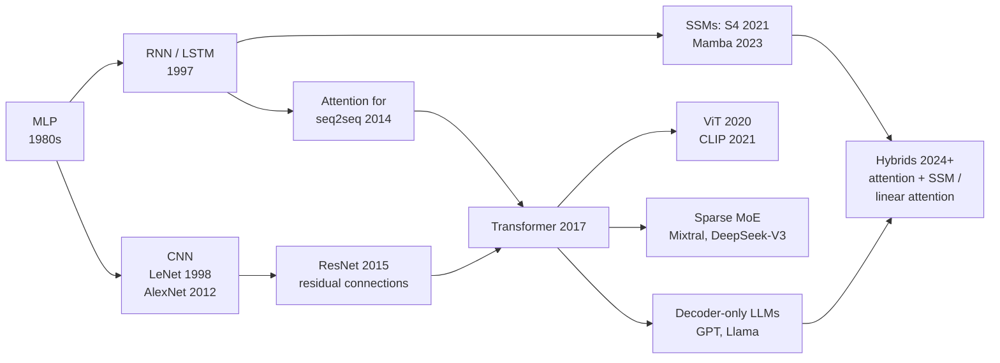
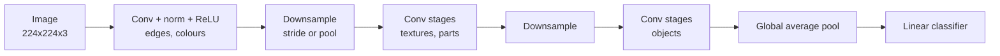
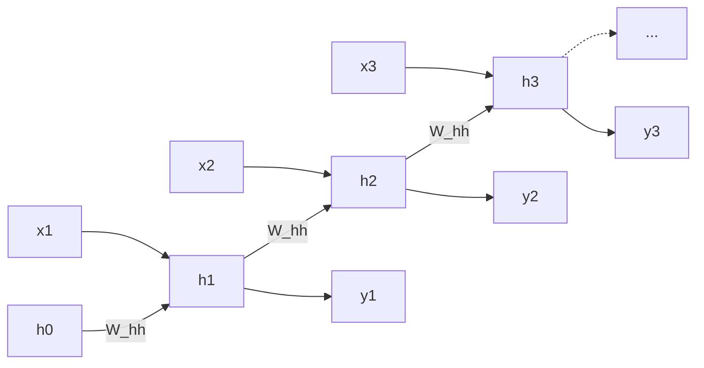
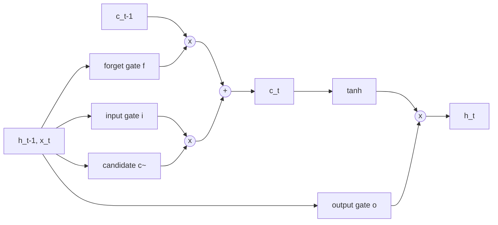
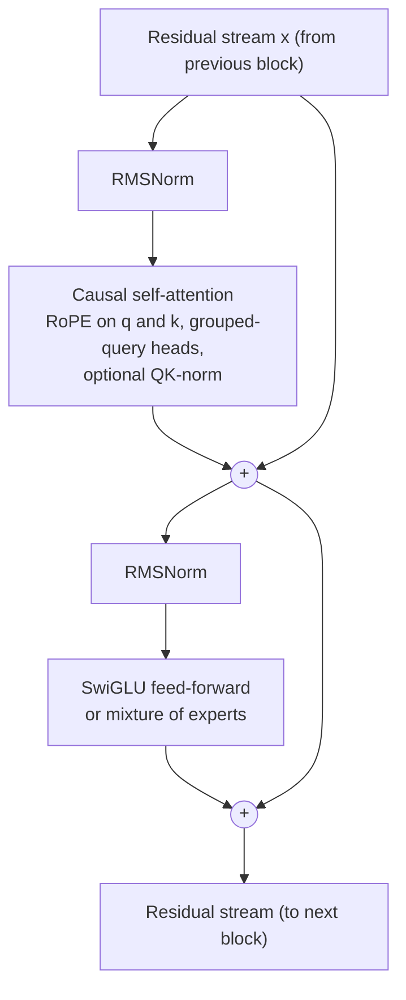
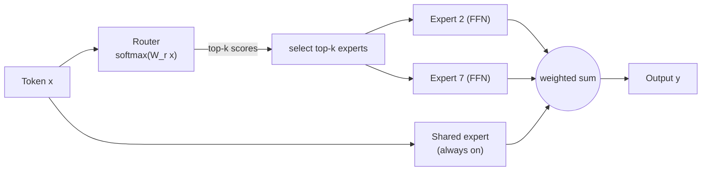
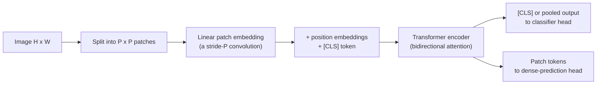
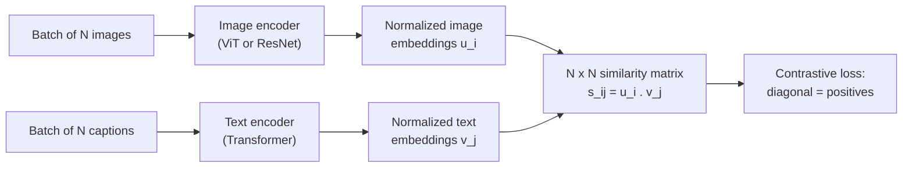
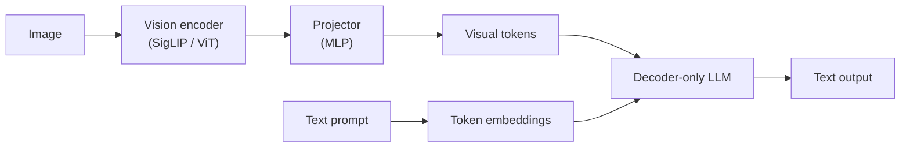
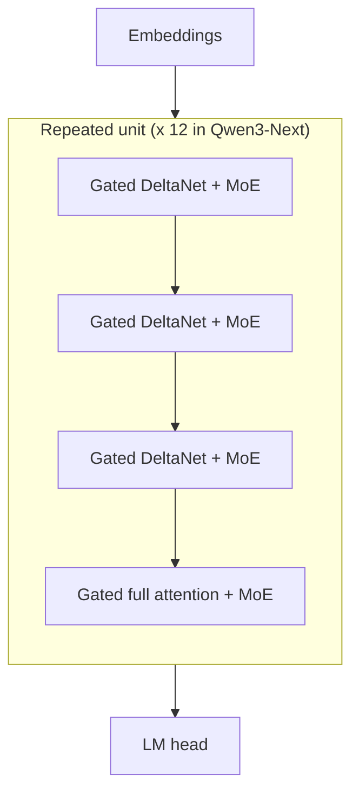

[AI & Machine Learning](./) › Deep Learning Architectures

This page is a reference to the main families of neural-network architecture: the multilayer perceptron, convolutional networks, recurrent networks, the attention-based Transformer (including the decoder block used by current large language models and the mixture-of-experts variant), Vision Transformers, contrastive image–text models such as CLIP and SigLIP, and the subquadratic sequence models (state-space models, linear attention, and hybrids) that emerged after 2023. Each section gives the defining equations, the structural assumption the architecture builds in, and its current status.

The companion page [Deep Learning Theory](deep-learning-theory.html) covers why these networks can be trained at all: backpropagation, initialization, normalization, and generalization. This page assumes that material and concentrates on the architectures themselves.

## Overview

Each architecture is defined by how it **mixes information across positions** (pixels, time steps, tokens) and what structural assumption, or *inductive bias*, that mixing encodes. Weaker biases need more data but scale further. The history of the field has largely been a move toward weaker biases as data and compute grew.



| Family | Mixing operation | Inductive bias | Training parallel over positions? | Inference state per sequence |
|--------|------------------|----------------|-----------------------------------|------------------------------|
| MLP | None (dense on a flat vector) | None | n/a | none |
| CNN | Local, weight-shared filters | Locality, translation equivariance | Yes | none |
| RNN / LSTM / GRU | Recurrent state update | Sequential order, fading memory | No | fixed-size hidden state |
| Transformer | Content-based attention over all positions | Almost none (order must be injected) | Yes | KV cache that grows with length |
| State-space / linear attention | Linear recurrence with input-dependent gates | Sequential order, compressive memory | Yes (scan or chunked form) | fixed-size state |

## The Multilayer Perceptron

The multilayer perceptron (MLP) is a stack of fully connected layers, each an affine map followed by a pointwise nonlinearity $\phi$:

$$\mathbf{h}^{(\ell)} = \phi\!\left(W_\ell\, \mathbf{h}^{(\ell-1)} + \mathbf{b}_\ell\right), \qquad \mathbf{h}^{(0)} = \mathbf{x}$$

Without $\phi$ the composition collapses to a single affine map and depth adds nothing. Common activations:

| Activation | Definition | Where it is used |
|------------|------------|------------------|
| ReLU | $\max(0, z)$ | CNNs and most pre-2020 networks |
| GELU | $z\,\Phi(z)$, where $\Phi$ is the standard normal CDF | BERT, GPT-2, ViT |
| SiLU / Swish | $z\,\sigma(z)$ | Inside SwiGLU; EfficientNet |
| SwiGLU | $\mathrm{SiLU}(W_1 \mathbf{x}) \odot W_3 \mathbf{x}$ | The feed-forward block of most current LLMs |
| sigmoid, tanh | $1/(1+e^{-z})$, $\tanh z$ | Gates in LSTMs, GRUs, and state-space models |

MLPs survive inside every architecture below. The position-wise feed-forward block of a Transformer, which holds about two thirds of its parameters, is an MLP applied to each token independently. On their own, MLPs scale badly to images and sequences. Flattening a $224 \times 224 \times 3$ image gives about 150,000 inputs, so each hidden unit needs 150,000 weights, and the flattening discards the fact that neighbouring pixels are related. The architectures below each add a structural assumption that the MLP lacks.

## Convolutional Neural Networks

Convolutional neural networks (CNNs) replace dense connections with small learnable filters that slide across the input and share their weights across positions. They were the dominant vision architecture from AlexNet (2012) until Vision Transformers matched them around 2021, and they remain the default for small datasets, edge devices, and many dense-prediction tasks.



### The convolution operation

A 2-D convolution layer (implemented as cross-correlation) computes each output channel $c'$ at position $(i, j)$ as a sum over a $k \times k$ window and all $C$ input channels:

$$Y_{c',i,j} = b_{c'} + \sum_{c=1}^{C}\sum_{m=0}^{k-1}\sum_{n=0}^{k-1} K_{c',c,m,n}\, X_{c,\,i+m,\,j+n}$$

For input width $W$, kernel size $k$, padding $p$, and stride $s$, the output width is

$$W_{\text{out}} = \left\lfloor \frac{W - k + 2p}{s} \right\rfloor + 1$$

The layer has $k^2 C C'$ weights regardless of image size. A stack of $L$ stride-1 $k \times k$ convolutions sees a **receptive field** of $1 + L(k-1)$ pixels on a side. Downsampling (strided convolution or pooling) multiplies the growth, which is how deep layers come to see whole objects.

### Why convolution suits images

- **Locality.** Low-level features such as edges and textures depend on a small neighbourhood, so small filters are enough.
- **Weight sharing and translation equivariance.** The same filter is applied at every position, so shifting the input shifts the feature map. A detector learned in one part of the image works everywhere, and the parameter count is independent of resolution.
- **Hierarchy.** Stacked convolution and downsampling produce edge detectors in early layers, motifs and parts in middle layers, and object-level features in deep layers.

Pooling (max or average over a window) adds a small amount of translation *invariance*. Most modern CNNs downsample with strided convolutions and use a single global average pool before the classifier.

### Efficient convolutions

A **depthwise-separable** convolution factors a standard convolution into a per-channel $k \times k$ depthwise filter followed by a $1 \times 1$ pointwise mix. This cuts the weight count from $k^2 C C'$ to $k^2 C + C C'$, about an 8 to 9 times reduction for $k = 3$. MobileNet, EfficientNet, and ConvNeXt are built on it.

### Residual connections

ResNet (He et al., 2015) introduced the residual block

$$\mathbf{y} = \mathbf{x} + \mathcal{F}(\mathbf{x})$$

in which each block learns a correction to the identity. The Jacobian of the block is $I + \partial\mathcal{F}/\partial\mathbf{x}$, so gradients have an identity path through every layer. This made networks with 100 or more layers trainable. Every architecture that followed, the Transformer included, uses residual connections.

### Landmark CNNs

| Model | Year | Contribution |
|-------|------|--------------|
| LeNet-5 | 1998 | Convolution, pooling, and a dense classifier for digit recognition |
| AlexNet | 2012 | ReLU, dropout, and GPU training; won ImageNet by a wide margin |
| VGG | 2014 | Depth built from uniform $3 \times 3$ filters |
| ResNet | 2015 | Residual connections; 152-layer networks |
| MobileNet / EfficientNet | 2017 / 2019 | Depthwise-separable convolutions; compound scaling of width, depth, and resolution |
| ConvNeXt / ConvNeXt V2 | 2022 / 2023 | A ResNet updated with Transformer-era design choices (large kernels, LayerNorm, GELU, fewer activations). Matches Swin Transformers at similar compute |

Typical uses: image classification, detection (the YOLO family), segmentation (U-Net), low-latency and on-device vision, and the backbone of the U-Nets used in earlier diffusion models.

## Recurrent Networks

Recurrent neural networks (RNNs) process a sequence one element at a time and carry a hidden state that summarizes everything seen so far. They were the standard for text, speech, and time series until about 2018. Their ideas returned in the linear-recurrent models described [below](#beyond-transformers-subquadratic-sequence-models).



### The vanilla RNN

$$\mathbf{h}_t = \tanh\!\left(W_{hh}\,\mathbf{h}_{t-1} + W_{xh}\,\mathbf{x}_t + \mathbf{b}_h\right), \qquad \mathbf{y}_t = W_{hy}\,\mathbf{h}_t + \mathbf{b}_y$$

The same weights are reused at every step. Training uses **backpropagation through time (BPTT)**: the recurrence is unrolled into a deep feed-forward graph and differentiated. The gradient that reaches step $t-k$ contains the product $\prod \partial\mathbf{h}_{s}/\partial\mathbf{h}_{s-1}$ of $k$ Jacobians, each involving $W_{hh}$. If the largest singular value of $W_{hh}$ is below 1 the product shrinks geometrically and long-range dependencies cannot be learned (vanishing gradients). If it is above 1 the product grows (exploding gradients), which is usually handled with gradient clipping.

### Long Short-Term Memory

The LSTM (Hochreiter & Schmidhuber, 1997) adds a **cell state** $\mathbf{c}_t$ that is updated additively, and three sigmoid gates that control what is forgotten, written, and read. With $[\cdot,\cdot]$ denoting concatenation:

$$\mathbf{f}_t = \sigma\!\left(W_f\,[\mathbf{h}_{t-1},\,\mathbf{x}_t] + \mathbf{b}_f\right), \quad \mathbf{i}_t = \sigma\!\left(W_i\,[\mathbf{h}_{t-1},\,\mathbf{x}_t] + \mathbf{b}_i\right), \quad \mathbf{o}_t = \sigma\!\left(W_o\,[\mathbf{h}_{t-1},\,\mathbf{x}_t] + \mathbf{b}_o\right)$$

$$\tilde{\mathbf{c}}_t = \tanh\!\left(W_c\,[\mathbf{h}_{t-1},\,\mathbf{x}_t] + \mathbf{b}_c\right)$$

$$\mathbf{c}_t = \mathbf{f}_t \odot \mathbf{c}_{t-1} + \mathbf{i}_t \odot \tilde{\mathbf{c}}_t, \qquad \mathbf{h}_t = \mathbf{o}_t \odot \tanh(\mathbf{c}_t)$$

The gradient path from $\mathbf{c}_t$ to $\mathbf{c}_{t-1}$ is multiplication by the forget gate $\mathbf{f}_t$, not by a weight matrix. When the network holds $\mathbf{f}_t$ near 1, error signals can travel back hundreds of steps.



### Gated Recurrent Unit

The GRU (Cho et al., 2014) has two gates and no separate cell state, and often matches the LSTM at lower cost. The update gate $\mathbf{z}_t$ interpolates between the old state and a candidate. The reset gate $\mathbf{r}_t$ controls how much of the old state the candidate may use:

$$\mathbf{z}_t = \sigma\!\left(W_z\,[\mathbf{h}_{t-1},\,\mathbf{x}_t]\right), \qquad \mathbf{r}_t = \sigma\!\left(W_r\,[\mathbf{h}_{t-1},\,\mathbf{x}_t]\right)$$

$$\tilde{\mathbf{h}}_t = \tanh\!\left(W_h\,[\mathbf{r}_t \odot \mathbf{h}_{t-1},\,\mathbf{x}_t]\right), \qquad \mathbf{h}_t = (1 - \mathbf{z}_t)\odot \mathbf{h}_{t-1} + \mathbf{z}_t \odot \tilde{\mathbf{h}}_t$$

### Limitations and current status

Gated RNNs still have two structural problems. Step $t$ cannot start until step $t-1$ is finished, so training cannot be parallelized across the sequence. Everything the model knows about the past must also fit into one fixed-size vector. Attention removes both problems, at the cost of quadratic compute. Classical LSTMs and GRUs remain in use for streaming and low-power sequence tasks and small time-series models. The 2024 **xLSTM** revisited the LSTM with exponential gating and a matrix-valued memory. The larger revival came from *linear* recurrences, whose state update can be computed in parallel. These are covered in the last section.

## Attention and the Transformer

The Transformer (Vaswani et al., 2017) removed recurrence and mixed positions only through **attention**, which lets every token read from every other token in a single parallel step. It is the basis of BERT, T5, the GPT series, and essentially every current large language model (LLM).

### Scaled dot-product attention

Each token embedding is projected into a **query**, a **key**, and a **value**. Stacking these for all $n$ tokens gives matrices $Q, K \in \mathbb{R}^{n \times d_k}$ and $V \in \mathbb{R}^{n \times d_v}$:

$$\mathrm{Attention}(Q, K, V) = \mathrm{softmax}\!\left(\frac{Q K^{\top}}{\sqrt{d_k}} + M\right) V$$

Row $i$ of the softmax is a probability distribution over positions that says how much token $i$ reads from each other token. The output for token $i$ is the matching weighted average of the values. Dividing by $\sqrt{d_k}$ keeps the logits at unit variance when queries and keys have unit-variance components; without it the softmax saturates and its gradients vanish. $M$ is a mask. For **causal** (autoregressive) models $M_{ij} = 0$ for $j \le i$ and $-\infty$ for $j > i$, so no token can see the future.

### Multi-head attention

Running $h$ attention functions in parallel, each on its own learned projection of dimension $d_k = d/h$, lets different heads track different relations (syntax, coreference, position):

$$\mathrm{head}_i = \mathrm{Attention}(X W_i^Q,\; X W_i^K,\; X W_i^V), \qquad \mathrm{MultiHead}(X) = \mathrm{Concat}(\mathrm{head}_1, \ldots, \mathrm{head}_h)\,W^O$$

### Positional information

Attention without a mask is permutation-equivariant: shuffling the input tokens only shuffles the outputs. Order therefore has to be injected. The original Transformer added fixed sinusoids to the embeddings:

$$\mathrm{PE}_{(\mathrm{pos},\,2i)} = \sin\!\left(\frac{\mathrm{pos}}{10000^{2i/d}}\right), \qquad \mathrm{PE}_{(\mathrm{pos},\,2i+1)} = \cos\!\left(\frac{\mathrm{pos}}{10000^{2i/d}}\right)$$

Most current LLMs use **rotary position embedding (RoPE)**. Instead of adding a vector, RoPE rotates each consecutive pair of query and key dimensions by an angle proportional to the token position $m$:

$$\begin{pmatrix} q'_{2i} \\ q'_{2i+1} \end{pmatrix} = \begin{pmatrix} \cos m\theta_i & -\sin m\theta_i \\ \sin m\theta_i & \cos m\theta_i \end{pmatrix} \begin{pmatrix} q_{2i} \\ q_{2i+1} \end{pmatrix}, \qquad \theta_i = 10000^{-2i/d}$$

Because rotations compose, the dot product between a query at position $m$ and a key at position $n$ depends only on the offset $m - n$. RoPE therefore encodes *relative* position. Context-extension methods such as position interpolation, NTK-aware scaling, and YaRN rescale the frequencies $\theta_i$ so that a model trained on short contexts can run on longer ones. ALiBi, an alternative, adds a fixed linear distance penalty to the attention logits.

### The Transformer block

The 2017 block applied LayerNorm *after* each residual addition (**post-norm**). Almost all current models apply the normalization to the *input* of each sublayer instead (**pre-norm**). This leaves an unmodified residual stream from input to output and makes deep stacks train stably without long learning-rate warm-up:

$$\mathbf{x} \leftarrow \mathbf{x} + \mathrm{Attn}\!\left(\mathrm{Norm}(\mathbf{x})\right), \qquad \mathbf{x} \leftarrow \mathbf{x} + \mathrm{FFN}\!\left(\mathrm{Norm}(\mathbf{x})\right)$$

The typical decoder block of 2024–2026 open-weight LLMs (the Llama, Qwen, Mistral, Gemma, and DeepSeek families) combines several refinements:



| Component | Original Transformer (2017) | Typical current LLM |
|-----------|-----------------------------|---------------------|
| Normalization | Post-norm LayerNorm | Pre-norm **RMSNorm** $\;\mathbf{x} / \sqrt{\mathrm{mean}(\mathbf{x}^2) + \epsilon} \odot \boldsymbol{\gamma}$ (no mean subtraction, no bias) |
| Positions | Additive sinusoidal | **RoPE**, sometimes absent in a fraction of layers |
| Feed-forward | $W_2\,\mathrm{ReLU}(W_1 \mathbf{x})$, hidden size $4d$ | **SwiGLU** $\;W_2\left(\mathrm{SiLU}(W_1\mathbf{x}) \odot W_3\mathbf{x}\right)$, hidden size about $\tfrac{8}{3}d$; or a mixture of experts |
| Attention heads | Full multi-head | **Grouped-query attention** (GQA), or multi-head latent attention (MLA) in DeepSeek models |
| Stability | None | QK-norm (normalizing queries and keys), no bias terms, logit soft-capping in some models |
| Attention span | Full | Full, or local sliding-window layers interleaved with global layers |

A minimal PyTorch version of this block (PyTorch 2.5 or later for `enable_gqa`):

```python
import torch.nn as nn
import torch.nn.functional as F

class CausalSelfAttention(nn.Module):
    def __init__(self, d_model: int, n_heads: int, n_kv_heads: int):
        super().__init__()
        self.n_heads, self.n_kv_heads = n_heads, n_kv_heads
        self.head_dim = d_model // n_heads
        self.q_proj = nn.Linear(d_model, n_heads * self.head_dim, bias=False)
        self.kv_proj = nn.Linear(d_model, 2 * n_kv_heads * self.head_dim, bias=False)
        self.o_proj = nn.Linear(n_heads * self.head_dim, d_model, bias=False)

    def forward(self, x):
        B, T, _ = x.shape
        q = self.q_proj(x).view(B, T, self.n_heads, self.head_dim).transpose(1, 2)
        k, v = self.kv_proj(x).view(B, T, 2, self.n_kv_heads, self.head_dim).unbind(2)
        k, v = k.transpose(1, 2), v.transpose(1, 2)
        # RoPE would be applied to q and k here.
        # Dispatches to a FlashAttention-style fused kernel when available.
        out = F.scaled_dot_product_attention(q, k, v, is_causal=True, enable_gqa=True)
        return self.o_proj(out.transpose(1, 2).reshape(B, T, -1))

class DecoderBlock(nn.Module):
    def __init__(self, d_model: int, n_heads: int, n_kv_heads: int, d_ff: int):
        super().__init__()
        self.attn_norm = nn.RMSNorm(d_model)
        self.attn = CausalSelfAttention(d_model, n_heads, n_kv_heads)
        self.ffn_norm = nn.RMSNorm(d_model)
        self.w_gate = nn.Linear(d_model, d_ff, bias=False)
        self.w_up = nn.Linear(d_model, d_ff, bias=False)
        self.w_down = nn.Linear(d_ff, d_model, bias=False)

    def forward(self, x):
        x = x + self.attn(self.attn_norm(x))                        # pre-norm residual
        h = self.ffn_norm(x)
        return x + self.w_down(F.silu(self.w_gate(h)) * self.w_up(h))  # SwiGLU
```

### The KV cache and head sharing

During autoregressive generation each new token attends to every earlier token. Recomputing their keys and values at every step would be wasteful, so they are stored in a **key–value (KV) cache**. For $L$ layers, $n_{kv}$ key/value heads of dimension $d_h$, a context of $n$ tokens, and $b$ bytes per element, the cache holds

$$\text{KV bytes} = 2 \cdot L \cdot n_{kv} \cdot d_h \cdot n \cdot b$$

At long context this, and not the weights, is often the memory bottleneck. The table lists the ways of shrinking it:

| Scheme | Key/value heads | Effect |
|--------|-----------------|--------|
| Multi-head attention (MHA) | One per query head | Baseline |
| Multi-query attention (MQA) | One, shared by all query heads | Smallest cache; some loss of quality |
| Grouped-query attention (GQA) | One per group of query heads (for example 8 KV heads for 64 query heads) | Close to MHA quality with a much smaller cache; the default in most open models |
| Multi-head latent attention (MLA) | Keys and values compressed into a shared low-rank latent vector per token | Very small cache (DeepSeek-V2 and V3, Kimi K2) |
| Sliding-window layers | Cache limited to the last $w$ tokens | Constant cache size in those layers |

### Encoder, decoder, and encoder–decoder models

| Variant | Attention pattern | Pretraining objective | Examples | Typical use |
|---------|-------------------|-----------------------|----------|-------------|
| Encoder-only | Bidirectional | Masked-token prediction | BERT, RoBERTa, ModernBERT | Classification, retrieval embeddings, reranking |
| Decoder-only | Causal | Next-token prediction | GPT series, Llama, Qwen, DeepSeek | Generation; nearly all current LLMs |
| Encoder–decoder | Bidirectional encoder; causal decoder with **cross-attention** to the encoder | Span corruption / sequence-to-sequence | T5, BART, Whisper | Translation, speech recognition, structured transduction |

Decoder-only models dominate because one objective, next-token prediction on raw text, scales without labelled data, and because any task can be written as text continuation.

<div class="code-reference">
<i class="fas fa-code"></i> Full implementations (multi-head attention, Transformer block, BERT- and GPT-2-style models): <a href="https://github.com/andrewaltimit/Documentation/blob/main/github-pages/code-examples/technology/ai/transformer_architectures.py">transformer_architectures.py</a>
</div>

The [AI Deep Dive](../ai-lecture-2023.html) covers LLM pretraining, inference, and serving in more depth.

## Mixture of Experts

A **mixture-of-experts (MoE)** layer replaces the single feed-forward network in a Transformer block with $E$ parallel expert FFNs and a learned **router**. Each token is sent to only $k$ of them (typically 1 to 8 out of 8 to several hundred). Total parameters, and with them capacity, can grow much faster than the compute spent per token.

For a token representation $\mathbf{x}$ with router weights $W_r$:

$$\mathbf{g}(\mathbf{x}) = \mathrm{softmax}(W_r \mathbf{x}), \qquad \mathbf{y} = \sum_{i \in \mathrm{TopK}(\mathbf{g}(\mathbf{x}),\, k)} g_i(\mathbf{x})\, E_i(\mathbf{x})$$



Routers tend to collapse onto a few favoured experts, which leaves the rest untrained. The Switch Transformer countered this with an auxiliary **load-balancing loss** $\alpha E \sum_i f_i P_i$, where $f_i$ is the fraction of tokens sent to expert $i$ and $P_i$ is its mean router probability. DeepSeek-V3 replaced the auxiliary loss with a per-expert bias that is adjusted during training. Many designs also add one or more **shared experts** that every token passes through, so that the routed experts can specialize.

| Model | Total parameters | Active per token | Experts |
|-------|------------------|------------------|---------|
| Mixtral 8x7B (2023) | 46.7B | 12.9B | 8, top-2 |
| DeepSeek-V3 (2024) | 671B | 37B | 256 routed + 1 shared, top-8 |
| Qwen3-Next-80B-A3B (2025) | 80B | 3B | 512 routed + 1 shared, top-10 |

The trade-off is memory and communication. Every expert must be resident somewhere, even though each token touches only a few, and expert-parallel serving has to route tokens between devices. MoE therefore lowers compute per token but not memory footprint.

## Vision Transformers

The **Vision Transformer (ViT)** (Dosovitskiy et al., 2020) applies a standard Transformer encoder to an image by treating it as a sequence of patches.



An $H \times W$ image cut into $P \times P$ patches gives

$$N = \frac{H W}{P^2}$$

tokens; a $224 \times 224$ image with $P = 16$ gives 196. Each patch is flattened and linearly projected, which is equivalent to a convolution with kernel size and stride $P$. Learned position embeddings keep the spatial layout. A learnable `[CLS]` token, or a mean pool over patch tokens, feeds the classification head.

**Compared with CNNs:**

- ViTs have no built-in locality or translation equivariance, so on small datasets they need heavy augmentation, distillation (DeiT), or a hybrid convolutional stem to match CNNs. With large pretraining sets they scale better.
- Self-attention has a global receptive field from the first layer. A CNN's receptive field grows only with depth.
- Cost grows quadratically with the number of patches, which is a problem for high-resolution and dense tasks. **Swin Transformer** attends within shifted local windows and builds a CNN-like multi-scale hierarchy.

**Self-supervised ViTs.** Most general-purpose vision backbones are now pretrained without labels. **MAE** (masked autoencoders) reconstructs randomly masked patches. The **DINO** line uses self-distillation between a student and a momentum teacher. DINOv2 (2023) produces strong frozen features, and **DINOv3** (Meta, August 2025) scales the recipe to a 7B-parameter ViT and adds "Gram anchoring" to stop dense patch features degrading over long training. Such frozen backbones are commonly used for segmentation, depth estimation, and retrieval with only a light task head on top.

Transformers on patch tokens also replaced the U-Net in image and video diffusion models: the **Diffusion Transformer (DiT)** and its multimodal variants underlie Stable Diffusion 3, FLUX, and most current video generators. See [Generative Models](generative-models.html).

<div class="code-reference">
<i class="fas fa-code"></i> Full implementation: <a href="https://github.com/andrewaltimit/Documentation/blob/main/github-pages/code-examples/technology/ai/transformer_architectures.py#L88">transformer_architectures.py#VisionTransformer</a>
</div>

```python
from transformer_architectures import VisionTransformer

# ViT-Base/16: 12 layers, 12 heads, width 768, about 86M parameters
model = VisionTransformer(img_size=224, patch_size=16, embed_dim=768,
                          depth=12, num_heads=12, num_classes=1000)
logits = model(images)  # images: [batch, 3, 224, 224] -> [batch, 1000]
```

## Contrastive Image–Text Models and Multimodal LLMs

### CLIP

**CLIP** (Radford et al., 2021) trains an image encoder and a text encoder to map matching image–caption pairs to nearby points in a shared embedding space. It was trained on 400 million web image–text pairs.



In a batch of $N$ pairs the diagonal of the similarity matrix $s_{ij} = \mathbf{u}_i^{\top}\mathbf{v}_j$ holds the $N$ positives, and the other $N^2 - N$ entries are negatives. With a learned temperature $\tau$, the symmetric InfoNCE loss is

$$\mathcal{L}_{i \to t} = -\frac{1}{N}\sum_{i=1}^{N} \log \frac{\exp(s_{ii}/\tau)}{\sum_{j=1}^{N}\exp(s_{ij}/\tau)}, \qquad \mathcal{L} = \tfrac{1}{2}\left(\mathcal{L}_{i \to t} + \mathcal{L}_{t \to i}\right)$$

where $\mathcal{L}_{t \to i}$ is the same loss with the roles of images and texts swapped.

**SigLIP** (Zhai et al., 2023) replaces the batch-wide softmax with an independent binary classification for every pair. With $z_{ij} = 1$ if $i = j$ and $-1$ otherwise, and learned scale $t$ and bias $b$:

$$\mathcal{L} = -\frac{1}{N}\sum_{i=1}^{N}\sum_{j=1}^{N} \log \sigma\!\left(z_{ij}\,(t\, s_{ij} + b)\right)$$

No normalization over the whole batch is needed, so the loss is cheaper to distribute and works well at both small and very large batch sizes. SigLIP and SigLIP 2 (2025) encoders are the vision towers of many open multimodal models.

Uses of contrastive encoders:

- **Zero-shot classification.** Embed each candidate label as a prompt such as "a photo of a {label}" and pick the label whose text embedding is closest to the image embedding.
- **Retrieval.** Text-to-image and image-to-text search over a shared vector index.
- **Conditioning for generation.** CLIP text encoders conditioned Stable Diffusion 1.x and 2.x and SDXL. Newer image generators increasingly condition on T5 or LLM text encoders.

### Multimodal LLMs

Current vision-language models (VLMs) put visual tokens directly into an LLM's context. The common open design, introduced by LLaVA (2023), is a pretrained vision encoder (usually CLIP- or SigLIP-based), a small projector (an MLP) that maps patch features to the LLM embedding space, and a decoder-only LLM that attends over image and text tokens together:



Flamingo (2022) instead injected image features through inserted cross-attention layers. Frontier proprietary models are trained natively multimodal, processing text, images, and audio (and in some cases generating them) within one model rather than attaching a separate encoder afterwards.

## Beyond Transformers: Subquadratic Sequence Models

Self-attention costs $O(n^2 d)$ compute in the sequence length $n$ during training and prefill. During generation, the KV cache grows linearly with context and each new token reads the whole cache. Work on long-context efficiency follows two lines: make exact attention cheaper to execute, or replace attention with a mixer whose state does not grow.

| Mixer | Training / prefill compute | Per generated token | Inference state |
|-------|---------------------------|---------------------|-----------------|
| Full softmax attention | $O(n^2 d)$ | $O(n d)$ | KV cache, $O(n)$ |
| Sliding-window attention (window $w$) | $O(n w d)$ | $O(w d)$ | $O(w)$ |
| Linear attention / SSM | $O(n d^2)$ or $O(n d N)$ | $O(d^2)$ | Constant, $O(d^2)$ or $O(dN)$ |
| Classical RNN | $O(n d^2)$, sequential | $O(d^2)$ | $O(d)$ |

### FlashAttention: exact attention, IO-aware

**FlashAttention** (Dao et al., 2022) computes exactly the same result as standard attention, but tiles $Q$, $K$, and $V$ into blocks that fit in on-chip SRAM. It computes the softmax incrementally (an "online softmax") and never writes the $n \times n$ score matrix to GPU high-bandwidth memory. Arithmetic is unchanged at $O(n^2 d)$, but extra memory falls from $O(n^2)$ to $O(n)$ and memory traffic drops enough for attention to run several times faster. **FlashAttention-2** (2023) improved parallelism on Ampere and Ada GPUs. **FlashAttention-3** (2024) used Hopper-specific asynchrony and FP8. **FlashAttention-4**, written in NVIDIA's CuTe DSL, targets Hopper and Blackwell GPUs. PyTorch's `F.scaled_dot_product_attention` dispatches to fused kernels of this kind automatically, and inference engines use related **paged** KV-cache attention (vLLM's PagedAttention) to avoid memory fragmentation.

### State-space models: S4 and Mamba

A linear **state-space model (SSM)** maps an input signal $u(t)$ to an output $y(t)$ through a hidden state $\mathbf{h}(t) \in \mathbb{R}^N$:

$$\mathbf{h}'(t) = A\,\mathbf{h}(t) + B\,u(t), \qquad y(t) = C\,\mathbf{h}(t)$$

Discretizing with step size $\Delta$ (zero-order hold gives $\bar{A} = \exp(\Delta A)$) turns this into a linear recurrence:

$$\mathbf{h}_t = \bar{A}\,\mathbf{h}_{t-1} + \bar{B}\,u_t, \qquad y_t = C\,\mathbf{h}_t$$

When $A$, $B$, and $C$ are fixed, unrolling the recurrence shows that $y$ is a convolution of $u$ with the kernel $(C\bar{B},\, C\bar{A}\bar{B},\, C\bar{A}^2\bar{B}, \ldots)$. The model can therefore be *trained* as one long parallel convolution and *run* as a constant-memory recurrence. **S4** (Gu et al., 2021) used a structured, HiPPO-initialized $A$ to capture very long-range dependencies.

A fixed kernel cannot choose what to remember based on content. **Mamba** (Gu & Dao, 2023) makes the SSM **selective**: $\Delta_t$, $B_t$, and $C_t$ are computed from the current input, so the model can hold or discard information token by token. This input dependence rules out the convolution form, so Mamba uses a hardware-aware parallel scan. **Mamba-2** (Dao & Gu, 2024) restricts $A$ to a scalar times the identity. Its *state-space duality* (SSD) result shows the layer is then equivalent to a form of masked linear attention, which lets most of the work run as matrix multiplications on tensor cores; the authors report a 2 to 8 times faster core layer than Mamba.

### Linear attention and the delta rule

**Linear attention** replaces $\exp(\mathbf{q}^{\top}\mathbf{k})$ with a feature-map product $\phi(\mathbf{q})^{\top}\phi(\mathbf{k})$. Matrix products can then be reassociated so that the $n \times n$ matrix is never formed:

$$\mathbf{o}_i = \frac{\phi(\mathbf{q}_i)^{\top}\sum_{j \le i}\phi(\mathbf{k}_j)\,\mathbf{v}_j^{\top}}{\phi(\mathbf{q}_i)^{\top}\sum_{j \le i}\phi(\mathbf{k}_j)}$$

The running sum is a matrix-valued state $S_t = S_{t-1} + \mathbf{v}_t \mathbf{k}_t^{\top}$, so causal linear attention is itself an RNN. Plain accumulation has two defects: the state never forgets, and new associations interfere with old ones. Later models add a data-dependent decay gate $\alpha_t$ (as in RetNet, GLA, Mamba-2, and RWKV-6/7) and the **delta rule**, which overwrites the value previously stored under key $\mathbf{k}_t$ rather than adding to it. **Gated DeltaNet** (Yang et al., 2024) combines both:

$$S_t = \alpha_t\, S_{t-1}\left(I - \beta_t\, \mathbf{k}_t \mathbf{k}_t^{\top}\right) + \beta_t\, \mathbf{v}_t \mathbf{k}_t^{\top}, \qquad \mathbf{o}_t = S_t\, \mathbf{q}_t$$

Chunkwise-parallel algorithms train these layers efficiently on GPUs. Related designs include **RWKV** (an RNN-style LLM family now in its seventh generation), **RetNet**, and **Hyena**, which uses long implicit convolutions.

### Hybrid architectures

Fixed-size states compress the past, so pure SSM and linear-attention models are weaker than attention at exact recall of arbitrary earlier tokens, for example copying a string or retrieving a fact from a long document. Since 2024 the most successful production designs have been **hybrids**: mostly linear-time layers, with full attention every few layers to retain precise retrieval.



Examples include **Jamba** (AI21, 2024: Mamba, attention, and MoE layers), NVIDIA's **Nemotron-H** (mostly Mamba-2 layers with a small fraction of attention), and **Qwen3-Next** (2025), which repeats three Gated DeltaNet layers followed by one gated-attention layer, all with MoE feed-forward blocks. These models cut KV-cache size and long-context cost substantially while staying competitive with pure Transformers.

### Sparse and local attention

Sparse attention keeps softmax attention but restricts which pairs interact. **Sliding-window** attention (Longformer, Mistral 7B) limits each token to the last $w$ tokens. Longformer and BigBird add a few global tokens (and, in BigBird, random links), which keeps the model a universal sequence approximator at $O(n)$ cost. Current LLMs commonly interleave local sliding-window layers with periodic global layers (the Gemma 2 and Gemma 3 families, for example). DeepSeek's native sparse-attention work uses learned, content-dependent selection of which blocks each query attends to.

## Choosing an Architecture

| Situation | Usual choice |
|-----------|--------------|
| Tabular data | Gradient-boosted trees first (see [Core ML Algorithms](core-ml-algorithms.html)); an MLP only if they are beaten |
| Images, small data or tight latency and power budget | CNN (ResNet, EfficientNet, ConvNeXt), or fine-tune a pretrained backbone |
| Images, large data or general-purpose features | ViT, usually a pretrained self-supervised (DINOv2/v3) or contrastive (SigLIP) backbone |
| Text generation, general-purpose reasoning | Decoder-only Transformer, dense or MoE |
| Text classification, embeddings, reranking | Encoder-only Transformer, or embeddings from a decoder LLM |
| Very long contexts, high-throughput generation | Hybrid attention + SSM / linear-attention model; GQA or MLA with sliding-window layers |
| Image–text retrieval, zero-shot labelling | CLIP / SigLIP dual encoder |
| Image understanding with language output | VLM (vision encoder + projector + LLM) |
| Streaming signals on tiny devices | GRU / LSTM or a small recurrent SSM |

## See Also

- [Deep Learning Theory](deep-learning-theory.html): backpropagation, initialization, normalization, and generalization for the architectures on this page
- [ML & Deep Learning hub](architectures.html): reading order for the core track
- [Loss Functions](loss-functions.html): the objectives these networks are trained with
- [Fine-Tuning & Transfer Learning](fine-tuning.html): adapting pretrained Transformers with LoRA, SFT, DPO, and RL
- [Generative Models](generative-models.html): diffusion models, DiTs, VAEs, and autoregressive generation
- [Frontier Research & Ethics](frontier-and-ethics.html): scaling laws and interpretability
- [AI Deep Dive](../ai-lecture-2023.html): LLM internals, inference, and serving
- [AI Mathematics](../../advanced/ai-mathematics/): formal treatment of the underlying theory
