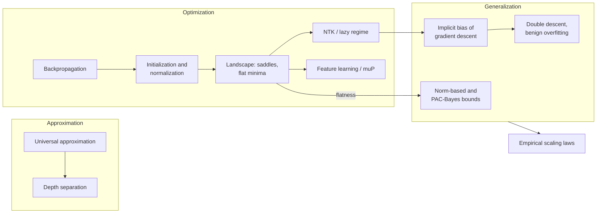
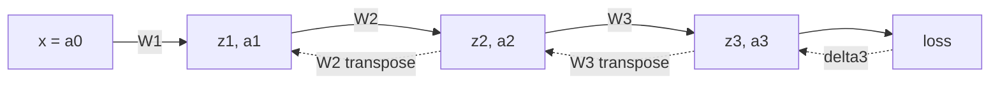

[AI & Machine Learning](./) › Deep Learning Theory

This page covers the main theoretical results about deep neural networks: what they can represent (**universal approximation** and **depth separation**), how they are trained (**backpropagation** and the **optimization landscape**), how signals are kept stable through many layers (**initialization, normalization, and parameterization**), the two tractable limits of training dynamics (the **neural tangent kernel** and the **feature-learning** regime), and why heavily overparameterized networks still generalize (**double descent**, **implicit regularization**, and modern generalization bounds). It ends with the empirical **scaling laws** that now guide how large models are built.

Read [Deep Learning Architectures](deep-learning-architectures.html) for the models these results apply to. The [Machine Learning Foundations](ml-foundations.html) page covers the classical learning theory and kernel methods referred to here.

## How the Results Fit Together

Deep learning theory has to answer three separate questions. Can a network represent the target function (approximation)? Can gradient descent find good weights (optimization)? Will those weights work on new data (generalization)? The results on this page each address one of these questions, and some address more than one.



The status of each area differs sharply. Approximation is well understood. Optimization is understood in idealized limits (infinite width, small learning rate) and partially in practice. Generalization of practical networks is the least settled of the three.

## Universal Approximation

### Single hidden layer

**Cybenko (1989)** proved that a network with one hidden layer of sigmoidal units is a *universal approximator*. Finite sums

$$f(x) = \sum_{j=1}^{N} \alpha_j\, \sigma\!\left(w_j^\top x + b_j\right)$$

are dense in $C(I_n)$, the continuous functions on the unit cube $I_n = [0,1]^n$. For any continuous $g$ and any $\varepsilon > 0$ there exist a width $N$ and parameters such that

$$\sup_{x \in I_n}\left| f(x) - g(x) \right| < \varepsilon.$$

**Hornik (1991)** showed that the property comes from the architecture rather than the particular squashing function: any bounded, non-constant activation works. **Leshno, Lin, Pinkus & Schocken (1993)** gave the sharp condition. A continuous activation yields a universal approximator if and only if it is **not a polynomial**, so ReLU qualifies.

These theorems only state that suitable weights exist. They do not bound the width $N$ required, which for generic functions can grow exponentially in the input dimension. They also do not say whether gradient descent can find those weights.

### Dimension-independent rates: Barron's theorem

**Barron (1993)** identified a function class that shallow networks approximate efficiently. Suppose $g$ has a Fourier transform $\hat{g}$ with a finite first moment:

$$C_g = \int_{\mathbb{R}^n} \lVert \omega \rVert \, |\hat{g}(\omega)| \, d\omega < \infty.$$

Then for any probability measure $\mu$ on a ball $B_r$ of radius $r$, a one-hidden-layer sigmoidal network $f_N$ with $N$ units achieves

$$\int_{B_r} \left( f_N(x) - g(x) \right)^2 \mu(dx) \;\le\; \frac{(2 C_g r)^2}{N}.$$

The $O(1/N)$ rate does not depend on the dimension $n$. By contrast, any linear combination of $N$ *fixed* basis functions has worst-case error of order $N^{-2/n}$ over the same class, which is the curse of dimensionality. The advantage comes from the network choosing its basis functions (the hidden units) to fit the target.

### Depth separation

Depth can be exponentially more efficient than width for some functions.

| Result | Statement |
|--------|-----------|
| **Montúfar et al. (2014)** | A ReLU network of depth $L$ and width $m \ge n$ on $n$ inputs can divide input space into at least $\Omega\!\left((m/n)^{(L-1)n}\, m^n\right)$ linear regions: exponential in depth, polynomial in width. |
| **Telgarsky (2016)** | For every $k$ there is a function computed by a ReLU network with $\Theta(k^3)$ layers and $\Theta(1)$ units per layer that any network with $O(k)$ layers cannot approximate unless it has $\Omega(2^k)$ units. |
| **Eldan & Shamir (2016)** | A radial function on $\mathbb{R}^n$ is expressible by a 3-layer network of polynomial width but needs width exponential in $n$ with 2 layers. |

The mechanism behind Telgarsky's result is folding. A two-unit ReLU layer can compute a "tent" map on $[0,1]$, and composing it $k$ times gives a sawtooth with $2^{k-1}$ teeth. A shallow network needs roughly one unit per linear piece to match it. Depth therefore suits compositional, hierarchical targets, which is the usual justification for deep rather than wide networks.

## Backpropagation

Universal approximation shows that good weights exist. **Backpropagation** is how gradient methods find them: it computes the gradient of a scalar loss with respect to every parameter in one backward pass.

### The four equations

For an $L$-layer network with

$$z^{(l)} = W^{(l)} a^{(l-1)} + b^{(l)}, \qquad a^{(l)} = \sigma\!\left(z^{(l)}\right), \qquad a^{(0)} = x,$$

and loss $\mathcal{L} = \ell\!\left(a^{(L)}, y\right)$, define the error signal $\delta^{(l)} = \partial \mathcal{L} / \partial z^{(l)}$. Then

$$\delta^{(L)} = \nabla_{a^{(L)}} \mathcal{L} \odot \sigma'\!\left(z^{(L)}\right), \qquad \delta^{(l)} = \left( W^{(l+1)\top} \delta^{(l+1)} \right) \odot \sigma'\!\left(z^{(l)}\right),$$

$$\frac{\partial \mathcal{L}}{\partial W^{(l)}} = \delta^{(l)} \, a^{(l-1)\top}, \qquad \frac{\partial \mathcal{L}}{\partial b^{(l)}} = \delta^{(l)}.$$

The first equation starts the recursion at the output. The second passes the error backward through the transpose of each weight matrix. The last two read the parameter gradients off the activations cached during the forward pass.



Solid arrows show the forward pass, which caches every $z^{(l)}$ and $a^{(l)}$. Dashed arrows show the backward pass, which reuses the cached values.

### Cost

Backpropagation is **reverse-mode automatic differentiation**. For a function from $p$ parameters to one scalar, reverse mode computes the full gradient at a small constant multiple (typically 2 to 3 times) of the cost of one forward evaluation, independent of $p$. Forward-mode differentiation would need $p$ passes. The price is memory: every intermediate activation has to be stored until the backward pass reaches it. **Activation checkpointing** trades this back by storing only some activations and recomputing the rest.

PyTorch, JAX, and TensorFlow all implement reverse mode by recording the operations of the forward pass and replaying them in reverse:

```python
import torch

x = torch.randn(8, 64)
W1 = torch.randn(64, 128, requires_grad=True)
W2 = torch.randn(128, 1, requires_grad=True)

loss = (torch.relu(x @ W1) @ W2).pow(2).mean()   # forward pass records the graph
loss.backward()                                  # one reverse sweep
print(W1.grad.shape, W2.grad.shape)              # dL/dW1, dL/dW2
```

### Vanishing and exploding gradients

Unrolling the recursion for $\delta^{(l)}$ gives the bound

$$\left\lVert \delta^{(1)} \right\rVert \;\le\; \left\lVert \delta^{(L)} \right\rVert \prod_{l=2}^{L} \left\lVert W^{(l)} \right\rVert \, \max_z \left| \sigma'(z) \right|.$$

When the per-layer factors are consistently below 1 the gradient shrinks exponentially with depth and early layers barely learn (**vanishing** gradients). When they are above 1 it grows (**exploding** gradients). The sigmoid makes vanishing likely, because $\sigma'(z) \le 1/4$ everywhere. The standard fixes are non-saturating activations such as ReLU, variance-preserving initialization, normalization layers, and residual connections. The next section covers them.

## Signal Propagation: Initialization, Normalization, and Residuals

A deep network trains well only if the scale of activations in the forward pass and of gradients in the backward pass stays roughly constant across layers.

### Variance-preserving initialization

For a layer with $n_{\text{in}}$ inputs and independent zero-mean weights, a linear activation gives

$$\mathrm{Var}\!\left(z^{(l)}\right) = n_{\text{in}}\, \mathrm{Var}\!\left(W^{(l)}\right) \mathrm{Var}\!\left(a^{(l-1)}\right),$$

so the forward variance is preserved when $\mathrm{Var}(W) = 1/n_{\text{in}}$. The backward pass requires $1/n_{\text{out}}$ instead.

| Scheme | $\mathrm{Var}(W)$ | Intended activation |
|--------|-------------------|---------------------|
| LeCun (1998) | $1/n_{\text{in}}$ | SELU, linear |
| Xavier / Glorot (2010) | $2/(n_{\text{in}} + n_{\text{out}})$, a compromise between the forward and backward conditions | tanh, sigmoid |
| He / Kaiming (2015) | $2/n_{\text{in}}$; the factor 2 compensates for ReLU zeroing half of its inputs | ReLU family |

Matching variances only controls the *average* gain. **Dynamical isometry** (Saxe et al. 2014; Pennington et al. 2017) requires the whole input–output Jacobian to have singular values concentrated near 1. Orthogonal initialization achieves this and allows networks thousands of layers deep to train without normalization or residual connections.

### Residual connections

A residual block $x \mapsto x + \mathcal{F}(x)$ has Jacobian $I + \partial \mathcal{F}/\partial x$, so the backward signal always has an identity path. A deep residual network behaves like an ensemble of many shallower paths. Very deep stacks also need the residual branches kept small. Common techniques are initializing the last layer of each branch to zero or near zero, and scaling branch outputs by a factor that shrinks with depth (for example $1/\sqrt{2L}$ in GPT-2's initialization).

### Normalization layers

Normalization layers rescale activations explicitly during training. They differ in which axes the statistics are computed over:

| Layer | Statistics over | Notes |
|-------|-----------------|-------|
| **BatchNorm** (Ioffe & Szegedy, 2015) | The batch (and spatial positions), per channel | Standard in CNNs. Uses running averages at test time, and degrades with small or non-i.i.d. batches |
| **LayerNorm** (Ba et al., 2016) | The features of one example | Independent of batch size. The standard in Transformers and RNNs |
| **RMSNorm** (Zhang & Sennrich, 2019) | The features of one example, without mean subtraction | Cheaper than LayerNorm with no loss of quality. Used in most current LLMs |
| **GroupNorm / InstanceNorm** | Groups of channels / one channel of one example | Detection and segmentation with small batches; style transfer |

BatchNorm normalizes each feature with the batch mean and variance and then applies a learned scale $\gamma$ and shift $\beta$:

$$\hat{x}_i = \frac{x_i - \mu_{\mathcal{B}}}{\sqrt{\sigma_{\mathcal{B}}^2 + \epsilon}}, \qquad y_i = \gamma\, \hat{x}_i + \beta.$$

RMSNorm divides each example's feature vector by its root mean square:

$$y = \frac{x}{\sqrt{\frac{1}{d}\sum_{i=1}^{d} x_i^2 + \epsilon}} \odot \gamma.$$

BatchNorm was introduced to reduce "internal covariate shift". **Santurkar et al. (2018)** found that its benefit is better explained by a smoother loss landscape, meaning smaller Lipschitz constants for the loss and its gradient. That smoothness allows larger learning rates. Normalization also makes a layer's output invariant to the scale of the weights feeding it. Combined with weight decay, this gives an *effective* learning rate that depends on the weight norm, which interacts with learning-rate schedules in ways that are still being studied.

## Training Dynamics: Lazy and Feature-Learning Regimes

As a network is made wider, its training dynamics approach one of two limits, depending on how initialization and learning rate scale with width. The difference matters both for theory and for the practical question of how to tune hyperparameters for very large models.

| | Lazy / NTK regime | Feature-learning / mean-field / muP regime |
|---|---|---|
| Parameterization | Standard or NTK scaling, width $\to \infty$ | Maximal-update parameterization (muP) or mean-field scaling |
| Weight movement | Vanishingly small relative to initialization | Order one in each layer's features |
| Internal representations | Fixed at initialization | Learned, task-specific |
| Model behaviour | Linear in the parameters; equivalent to kernel regression | Genuinely nonlinear |
| Tractability | Closed-form dynamics | Described by limiting equations that are usually solved numerically |
| Describes practical networks? | Partially: small learning rates, very wide networks | Closer to practice, especially pretraining |

### The neural tangent kernel

For a network $f(x;\theta)$, the **neural tangent kernel (NTK)** is the inner product of the parameter gradients at two inputs:

$$\Theta(x, x') = \nabla_\theta f(x;\theta)^\top \, \nabla_\theta f(x';\theta) = \sum_{p} \frac{\partial f(x)}{\partial \theta_p}\, \frac{\partial f(x')}{\partial \theta_p}.$$

Under gradient flow on a squared loss, the network's outputs on the training inputs $X$ evolve as $\dot{f}_t(X) = -\eta\, \Theta_t(X, X)\,(f_t(X) - y)$.

**Jacot, Gabriel & Hongler (2018)** proved that under NTK parameterization, as width goes to infinity, $\Theta$ converges at initialization to a deterministic kernel $\Theta_\infty$ that depends only on the architecture, and stays constant during training. Each weight moves by an amount that vanishes as width grows, so the network remains equal to its first-order Taylor expansion around initialization:

$$f(x;\theta_t) \approx f(x;\theta_0) + \nabla_\theta f(x;\theta_0)^\top (\theta_t - \theta_0).$$

The dynamics are then linear and can be solved exactly. The training residual decays as

$$f_t(X) - y = e^{-\eta\, \Theta_\infty t}\,\big(f_0(X) - y\big),$$

and after training the prediction at a test point is kernel regression with $\Theta_\infty$, offset by the network's output at initialization:

$$f_\infty(x) = f_0(x) + \Theta_\infty(x, X)\, \Theta_\infty(X, X)^{-1} \big(y - f_0(X)\big).$$

Each eigen-direction of $\Theta_\infty$ is fitted at a rate proportional to its eigenvalue. Because smooth, low-frequency functions have the largest eigenvalues, they are learned first (**spectral bias**).

A related but distinct kernel describes the network at initialization. A randomly initialized infinitely wide network is a **Gaussian process** whose covariance is the NNGP kernel (Neal 1996; Lee et al. 2018). Training only the last layer gives the GP posterior mean under that kernel. Training all layers in the NTK limit gives kernel regression with $\Theta_\infty$ instead. Convolutional versions (CNTK) give competitive, though not state-of-the-art, image-classification kernels.

**Scope.** The NTK explains why gradient descent reaches zero training loss in wide networks despite non-convexity: the linearized problem is convex. It cannot explain representation learning, because in the NTK limit the features never change. Finite networks trained with realistic learning rates consistently outperform their NTK kernels. That gap is the evidence that feature learning matters.

<div class="code-reference">
<i class="fas fa-code"></i> Full implementation: <a href="https://github.com/andrewaltimit/Documentation/blob/main/github-pages/code-examples/technology/ai/deep_learning_foundations.py#L246">deep_learning_foundations.py#NeuralTangentKernel</a>
</div>

```python
from deep_learning_foundations import NeuralTangentKernel

# Empirical NTK entry: inner product of parameter gradients at two inputs
theta_12 = NeuralTangentKernel.compute_ntk(model, x1, x2)

# Kernel-regression prediction, equivalent to training an infinitely wide network
preds = NeuralTangentKernel.infinite_width_prediction(X_train, y_train, X_test, kernel_func)
```

### Maximal update parameterization and hyperparameter transfer

**Yang & Hu (2021)** classified how initialization variances and per-layer learning rates can scale with width. They identified a unique scaling, the **maximal update parameterization (muP)**, under which every layer's features change by an order-one amount in the infinite-width limit. Under standard parameterization, the optimal learning rate shifts as width grows. Under muP it stays approximately constant. **Tensor Programs V (Yang et al., 2022)** used this for **muTransfer**: tune hyperparameters on a small proxy model and reuse them at full width. Variants of the idea, extended to depth scaling, are used to set hyperparameters in large-model pretraining without searching at full scale.

## The Optimization Landscape

Training minimizes a highly non-convex loss over billions of parameters, yet gradient descent reliably reaches low training loss. The explanation lies in the geometry of high-dimensional landscapes and in how gradient descent moves through them.

### Saddle points rather than bad local minima

At a critical point ($\nabla \mathcal{L} = 0$) the Hessian $H = \nabla^2 \mathcal{L}$ determines the local shape, and a local minimum requires all $d$ eigenvalues to be positive. In random high-dimensional models the fraction of critical points that are minima falls exponentially with $d$, and most high-loss critical points are saddles with many descending directions. **Dauphin et al. (2014)** and the spin-glass analysis of **Choromanska et al. (2015)** argue that the local minima that do exist lie in a narrow band near the global minimum. What slows training is plateaus near saddles rather than trapping in poor minima, and gradient noise from minibatches helps escape them.

### Overparameterization and mode connectivity

When a network has enough parameters to interpolate its training data, the global minima form high-dimensional connected sets rather than isolated points. **Garipov et al. (2018)** and **Draxler et al. (2018)** found that independently trained solutions are joined by simple low-loss curves. Later work found that, once the permutation symmetry of hidden units is accounted for, many are even joined by straight lines (*linear mode connectivity*). This underlies **model merging**: averaging the weights of models fine-tuned from the same pretrained checkpoint, as in model soups and task arithmetic, often produces a working model.

### Flat and sharp minima

Minima where the loss stays low over a wide neighbourhood (**flat**) tend to generalize better than **sharp** ones. Sharpness is usually measured by the largest Hessian eigenvalue $\lambda_{\max}(H)$. The PAC-Bayes explanation (see [below](#norm-based-and-pac-bayes-bounds)) is that a flat minimum tolerates perturbation of the weights and so needs fewer bits to specify. **Sharpness-Aware Minimization (SAM)** optimizes for flatness directly:

$$\min_{\theta} \; \max_{\lVert \epsilon \rVert_2 \le \rho} \; \mathcal{L}(\theta + \epsilon).$$

The link is not absolute: rescaling the weights of a ReLU network can make a minimum arbitrarily sharp without changing the function it computes (Dinh et al., 2017). Sharpness measures that are invariant to such rescaling are an active research topic.

### The edge of stability

Classical analysis says gradient descent with step size $\eta$ is stable on a quadratic only if $\lambda_{\max}(H) < 2/\eta$. **Cohen et al. (2021)** observed that full-batch training of neural networks behaves differently. Sharpness rises during training (*progressive sharpening*) until it reaches $2/\eta$ and then oscillates around that value (the **edge of stability**), while the loss keeps decreasing over the long run, though not monotonically. Gradient descent therefore partly *chooses* the curvature of the region it ends up in, and a larger learning rate implicitly selects flatter regions. Adaptive optimizers show an analogous effect on the preconditioned sharpness.

### Optimizers in practice

**AdamW** (Adam with decoupled weight decay) remains the default for Transformers. The **Muon** optimizer (2024) replaces each weight matrix's momentum update with an approximately orthogonalized version, computed by a few Newton–Schulz iterations. It has been adopted in some large-scale LLM pretraining, for example Moonshot AI's Kimi K2, which used a variant with an added stability mechanism. It is a recent example of optimizer design driven by the geometry of matrix-shaped parameters rather than by treating every parameter as an independent scalar.

<div class="code-reference">
<i class="fas fa-code"></i> Full implementation: <a href="https://github.com/andrewaltimit/Documentation/blob/main/github-pages/code-examples/technology/ai/deep_learning_foundations.py#L95">deep_learning_foundations.py#NeuralNetOptimization</a>
</div>

```python
import torch
from deep_learning_foundations import NeuralNetOptimization

# Largest Hessian eigenvalues measure sharpness at the current weights
top_eigs = NeuralNetOptimization.compute_hessian_eigenvalues(
    model, loss_fn, data, targets, top_k=10
)

# 2-D loss surface along two random directions (Li et al., 2018)
dir1 = [torch.randn_like(p) for p in model.parameters()]
dir2 = [torch.randn_like(p) for p in model.parameters()]
surface = NeuralNetOptimization.loss_landscape_analysis(model, dataloader, [dir1, dir2])
```

## Double Descent, Benign Overfitting, and Grokking

### Double descent

Classical statistics predicts a **U-shaped** test-error curve as model capacity increases: error falls while the model underfits and rises once it overfits. **Belkin et al. (2019)** documented a second descent. Test error peaks at the **interpolation threshold**, where the model has just enough capacity to fit the training set exactly. Past that point, adding capacity *reduces* test error again, often below the best value in the classical regime.

<figure style="margin: 1.5rem 0;">
<svg viewBox="0 0 480 230" role="img" aria-labelledby="dd-title dd-desc" style="width: 100%; max-width: 560px; height: auto; display: block; margin: 0 auto; color: inherit;">
  <title id="dd-title">Double descent risk curve</title>
  <desc id="dd-desc">Test error falls, rises to a peak at the interpolation threshold where training error reaches zero, then falls again in the overparameterized regime.</desc>
  <g fill="none" stroke="currentColor">
    <line x1="50" y1="190" x2="465" y2="190" stroke-width="1.5"/>
    <line x1="50" y1="190" x2="50" y2="15" stroke-width="1.5"/>
    <line x1="230" y1="20" x2="230" y2="190" stroke-width="1" stroke-dasharray="4 4" opacity="0.6"/>
    <path d="M60,70 C90,110 110,122 130,122 C160,122 200,60 230,32 C255,70 280,120 320,136 C370,150 420,154 460,156" stroke-width="2.5"/>
    <path d="M60,110 C120,150 180,176 230,186 L460,186" stroke-width="1.5" stroke-dasharray="6 4" opacity="0.8"/>
  </g>
  <g fill="currentColor" font-size="12" font-family="inherit">
    <text x="258" y="210" text-anchor="middle">model capacity (parameters, epochs)</text>
    <text x="20" y="105" text-anchor="middle" transform="rotate(-90 20 105)">error</text>
    <text x="230" y="14" text-anchor="middle" font-size="11">interpolation threshold</text>
    <text x="140" y="45" text-anchor="middle" font-size="11">classical regime</text>
    <text x="360" y="45" text-anchor="middle" font-size="11">overparameterized regime</text>
    <text x="400" y="148" text-anchor="middle" font-size="11">test error</text>
    <text x="400" y="180" text-anchor="middle" font-size="11">training error</text>
  </g>
</svg>
</figure>

**Nakkiran et al. (2019)** showed the same shape along other axes. It appears **model-wise** (more parameters), **epoch-wise** (longer training), and **sample-wise**: near the threshold, adding training data can temporarily *raise* test error. The peak is most pronounced with label noise and no regularization, and tuned regularization can remove it.

**Why it happens.** At the threshold only about one set of parameters fits the data exactly. That fit is fragile: the parameter norm becomes very large and the model amplifies noise, so variance spikes. Beyond the threshold many interpolating solutions exist, and gradient descent started near zero selects the one with the **minimum norm**. For linear models this is the pseudoinverse solution; for wide networks in the NTK limit it is the minimum-RKHS-norm kernel interpolant. That solution is smooth and generalizes well.

### Benign overfitting

**Bartlett, Long, Lugosi & Tsigler (2020)** characterized when interpolating noisy training data does no harm in linear regression. It is benign when the data covariance has many small directions in which the noise can be absorbed without affecting predictions. A model that fits its training data exactly is therefore not necessarily overfitting in the harmful sense. The outcome depends on how the fitted solution is spread across directions of the data.

### Grokking

**Power et al. (2022)** trained small Transformers on algorithmic tasks such as modular arithmetic. The networks reached perfect training accuracy early, while test accuracy stayed near chance for thousands more steps and then rose suddenly to near perfect. This delayed generalization is called **grokking**. It depends strongly on weight decay. Mechanistic analyses (for example Nanda et al., 2023) found that the network first memorizes, then gradually forms a compact generalizing circuit (for modular addition, one based on discrete Fourier features), and finally removes the memorized component. Grokking is one of the clearest demonstrations that the implicit and explicit regularization of the optimizer, not only the training loss, decides which solution a network settles on.

## Generalization

A modern network has far more parameters than training examples and can fit completely random labels to zero training error (**Zhang et al., 2017**). Any explanation of why it generalizes on real data must therefore involve the data and the training algorithm, not only the hypothesis class.

### Why classical bounds fail

Uniform-convergence bounds based on VC dimension or Rademacher complexity take the form

$$\text{test error} \;\le\; \text{train error} + O\!\left(\sqrt{\frac{\text{capacity}}{n}}\right).$$

When capacity is measured by parameter count, it greatly exceeds the sample size $n$ and the bound is vacuous. The random-label experiment shows that the architecture alone can memorize noise. The same network generalizes on structured data only because of what the data and the optimizer select.

### Implicit regularization

Gradient descent has an **implicit bias**. On linearly separable data, gradient descent on the logistic loss converges in direction to the **maximum-margin** separator, the SVM solution, without any explicit regularizer (**Soudry et al., 2018**). For underdetermined least squares started at zero, it converges to the **minimum-norm** solution. For deep homogeneous networks, gradient flow converges in direction to a KKT point of a margin-maximization problem (Lyu & Li, 2020). Minibatch noise and large learning rates add a further bias toward flat regions. Explicit regularizers such as weight decay, dropout, data augmentation, and early stopping act on top of these implicit effects.

### Norm-based and PAC-Bayes bounds

Modern bounds measure capacity by the **size** of the weights rather than their number. Margin-normalized bounds (Bartlett et al., 2017; Neyshabur et al., 2018) scale with products of layer norms divided by the classification margin achieved, so a very large network with small weights can still have a small bound.

**PAC-Bayes** bounds apply to a distribution $Q$ over weights, compared with a prior $P$ fixed before seeing the data. With probability at least $1 - \delta$ over a sample of size $n$ (one standard form):

$$\mathbb{E}_{Q}\!\left[\text{test error}\right] \;\le\; \mathbb{E}_{Q}\!\left[\text{train error}\right] + \sqrt{\frac{\mathrm{KL}(Q \,\Vert\, P) + \ln\frac{n}{\delta}}{2(n-1)}}.$$

A flat minimum allows a broad posterior $Q$ that keeps training error low while $\mathrm{KL}(Q \Vert P)$ stays small, which is the formal link between flatness and generalization. **Dziugaite & Roy (2017)** optimized such a bound directly and obtained the first **non-vacuous** generalization bound for a deep network trained on real data (MNIST). Later compression-based bounds have extended non-vacuous guarantees to much larger models, including LLMs. These bounds remain loose compared with measured test error, and none yet predicts generalization accurately across architectures.

A more formal treatment of PAC learning, Rademacher complexity, and margin bounds is on the [AI Mathematics](../../advanced/ai-mathematics/) page.

## Scaling Laws

The theory above does not predict how large a model should be or how much data it needs. The most useful guidance on those questions is empirical. **Kaplan et al. (2020)** found that the test loss of Transformer language models falls as a smooth power law in parameters $N$, data $D$, and compute, over many orders of magnitude. **Hoffmann et al. (2022)** (the "Chinchilla" paper) refitted this as

$$L(N, D) = E + \frac{A}{N^{\alpha}} + \frac{B}{D^{\beta}},$$

with fitted exponents $\alpha \approx 0.34$ and $\beta \approx 0.28$ and an irreducible term $E$. Training compute is about $C \approx 6ND$ FLOPs. Minimizing $L$ at fixed $C$ requires scaling $N$ and $D$ roughly in proportion, which works out to about **20 training tokens per parameter**. Models trained before 2022 had been substantially undertrained by this measure.

Current practice deliberately trains well past the compute-optimal point. The cost of serving a model depends on $N$ and not on $D$, so a smaller model trained on many more tokens, often hundreds or thousands per parameter, is cheaper to run over its lifetime. Scaling laws have since been extended to data repetition, mixture-of-experts sparsity, precision, and inference-time compute. The [Frontier Research & Ethics](frontier-and-ethics.html) page discusses them further, including emergent abilities.

## Summary

| Question | Main results | Status |
|----------|--------------|--------|
| Can networks represent the target? | Universal approximation; Barron rates; depth separation | Largely settled |
| Can gradients be computed efficiently? | Backpropagation (reverse-mode autodiff) | Settled |
| Can deep networks be trained stably? | Variance-preserving initialization, residual connections, normalization, muP | Well understood in practice, partly in theory |
| Why does gradient descent find good minima? | Saddle-dominated landscapes, overparameterization, NTK convergence proofs, edge of stability | Proved in limits; partly empirical |
| Why do overparameterized networks generalize? | Implicit bias, minimum-norm interpolation, benign overfitting, PAC-Bayes and compression bounds | Open for practical networks |
| How should models be scaled? | Kaplan and Chinchilla scaling laws | Empirical and reliable within range; not derived from first principles |

---

## Continue Reading

<div class="page-nav" style="display: flex; justify-content: space-between; gap: 1rem; flex-wrap: wrap;">
  <span>← <strong>Previous:</strong> <a href="core-ml-algorithms.html">Core ML Algorithms</a></span>
  <span><strong>Next:</strong> <a href="deep-learning-architectures.html">Deep Learning Architectures</a> →</span>
</div>

### See Also

- [ML & Deep Learning hub](architectures.html): reading order for the core track
- [Machine Learning Foundations](ml-foundations.html): bias–variance, SGD, kernels, and Gaussian processes
- [Deep Learning Architectures](deep-learning-architectures.html): the CNNs, RNNs, Transformers, and SSMs this theory applies to
- [Loss Functions](loss-functions.html): the objectives being optimized
- [Frontier Research & Ethics](frontier-and-ethics.html): scaling laws, emergent abilities, interpretability
- [AI Mathematics](../../advanced/ai-mathematics/): formal statements and proofs
