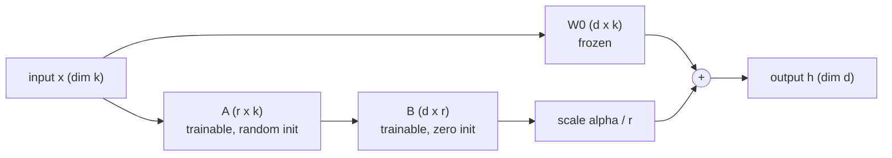
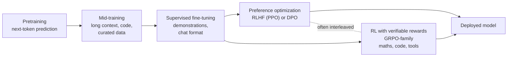
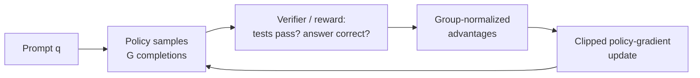

[AI & Machine Learning](./) › Fine-Tuning & Transfer Learning

**Fine-tuning** continues training a pretrained model on new data so that it performs a specific task, adopts a behaviour, or works in a new domain. This page covers the full range of methods: why transfer learning works, full and partial fine-tuning, parameter-efficient methods (LoRA, QLoRA, adapters, and soft prompts), and the LLM **post-training** stack of supervised fine-tuning, preference optimization (RLHF, DPO, and related methods), and reinforcement learning from verifiable rewards (GRPO and its variants). It also covers catastrophic forgetting, data, evaluation, and current tooling. The code examples use the Hugging Face PEFT and TRL libraries as of 2026.

For LoRA training on image-diffusion models (styles, characters, concepts), see [LoRA Training](../../ai-ml/lora-training.html). For the Transformer architecture that most of these methods adapt, see [Deep Learning Architectures](deep-learning-architectures.html).

## Transfer Learning

A network trained on a large, diverse corpus learns general-purpose features. Early layers capture generic structure (edges and textures in vision, syntax and morphology in language), and later layers capture more abstract and task-specific features. Starting from those weights rather than random ones means a new task needs far less data and compute.

Pretraining finds

$$\theta^{\ast} = \arg\min_{\theta}\ \mathbb{E}_{(x,y)\sim \mathcal{D}_{\text{pre}}}\big[\mathcal{L}_{\text{pre}}(f_\theta(x), y)\big]$$

on a large source distribution (for LLMs, next-token prediction over trillions of tokens). Fine-tuning then minimizes a task loss on a much smaller distribution $\mathcal{D}_{\text{task}}$, starting from $\theta^{\ast}$:

$$\theta_{\text{task}} = \arg\min_{\theta}\ \mathbb{E}_{(x,y)\sim \mathcal{D}_{\text{task}}}\big[\mathcal{L}_{\text{task}}(f_\theta(x), y)\big], \qquad \theta \;\text{initialized at}\; \theta^{\ast}.$$

Because $\theta^{\ast}$ already lies in a good region of the loss landscape, a few hundred to a few thousand high-quality examples are often enough.

| Regime | What is trained | When it fits |
|--------|-----------------|--------------|
| **Linear probe / feature extraction** | A new head on a frozen backbone | Little data; the task is close to what the backbone already represents |
| **Partial or parameter-efficient fine-tuning** | A subset of weights, or small added modules | Most adaptation tasks, especially for large models |
| **Full fine-tuning** | All weights | Large, high-quality datasets; large shifts in behaviour |
| **Continued pretraining** (domain-adaptive pretraining) | All weights, with the pretraining objective on unlabelled in-domain text | Large domain shift, such as legal, biomedical, a new language, or a codebase |

### Fine-tuning or not

For LLMs the first question is often whether to fine-tune at all. Prompting and retrieval are cheaper to change and should usually be tried first.

| Goal | Better first choice |
|------|---------------------|
| Answer questions from documents that change often | Retrieval-augmented generation (RAG) |
| Follow a specific output format or style, or behave consistently | Prompting with examples; then SFT (often with LoRA) |
| Match a smaller, cheaper model to a larger one on a narrow task | Distillation: SFT on the larger model's outputs |
| Master a skill with checkable answers (maths, code, tool use) | Reinforcement learning with verifiable rewards |
| Reflect human preferences about tone, helpfulness, or safety | Preference optimization (DPO or RLHF) |
| Teach large amounts of new factual knowledge | Continued pretraining, or RAG; SFT alone adds new facts poorly and can increase hallucination |

## Full and Partial Fine-Tuning

### Full fine-tuning

Full fine-tuning makes every parameter trainable. It is the most expressive option and usually gives the best results when data is plentiful, but the memory cost is large. In standard mixed-precision training with AdamW, each parameter needs:

| Item | Bytes per parameter |
|------|---------------------|
| bf16 weights | 2 |
| bf16 gradients | 2 |
| fp32 master copy of weights | 4 |
| Adam first moment (fp32) | 4 |
| Adam second moment (fp32) | 4 |
| **Total, before activations** | **about 16** |

An 8B-parameter model therefore needs about 128 GB for weights and optimizer state alone, before activations. That usually means several GPUs with sharded training (PyTorch FSDP or DeepSpeed ZeRO). Memory can be reduced with gradient (activation) checkpointing, 8-bit optimizers, and CPU offload. Every fine-tuned variant is also a full copy of the model to store and serve.

### Frozen and partial fine-tuning

In partial fine-tuning most weights are frozen (`requires_grad = False`) and only a subset is trained, typically the classifier head or the top few blocks plus the head. Frozen weights need no gradients or optimizer state, and freezing acts as a strong regularizer. **Gradual unfreezing** trains the head first and then progressively unfreezes deeper layers. It is usually combined with **discriminative learning rates**: smaller for early, more general layers and larger for later, more specialized ones.

```python
import torch
import torch.nn as nn

for p in model.backbone.parameters():          # freeze the pretrained backbone
    p.requires_grad = False

model.head = nn.Linear(model.config.hidden_size, num_classes)   # new task head

optimizer = torch.optim.AdamW(
    (p for p in model.parameters() if p.requires_grad), lr=1e-3
)
```

For large Transformers, parameter-efficient methods have largely replaced hand-chosen layer freezing.

## Parameter-Efficient Fine-Tuning (PEFT)

**Parameter-efficient fine-tuning** keeps the pretrained weights frozen and trains a small number of new or selected parameters, usually well under 1% of the total. The result is a small per-task artifact, from a few megabytes to a few hundred, that can be stored, swapped, and served on top of one shared base model.

### LoRA

**LoRA** (low-rank adaptation; Hu et al., 2021) rests on the observation that the weight *change* needed to adapt a pretrained matrix has low intrinsic rank. Instead of learning a full update $\Delta W \in \mathbb{R}^{d \times k}$, LoRA learns two thin factors:

$$\Delta W = B A, \qquad B \in \mathbb{R}^{d \times r},\quad A \in \mathbb{R}^{r \times k},\quad r \ll \min(d, k),$$

and the adapted layer computes

$$h = W_0 x + \frac{\alpha}{r}\, B A x.$$



$W_0$ is frozen. $A$ starts with small random values and $B$ starts at zero, so $\Delta W = 0$ at the start and the adapted model initially reproduces the base model exactly. A $4096 \times 4096$ projection has 16.8M weights; a rank-16 LoRA on it has $2 \times 4096 \times 16 = 131{,}072$, a 128-fold reduction. After training, $\frac{\alpha}{r}BA$ can be **merged** into $W_0$, so inference has no extra latency. Kept unmerged, many adapters can share one base model. Serving engines such as vLLM batch requests for different LoRA adapters together on the same GPU.

**Current practice.** The original paper adapted only the attention query and value projections. Later work changed that advice:

- **Target all linear layers, including the MLP.** A 2025 study by Thinking Machines Lab ("LoRA Without Regret") found that attention-only LoRA clearly underperforms, and that LoRA on all weight matrices, especially the MLP and MoE layers, matches full fine-tuning when the adapter has enough capacity for the dataset.
- **Use a much larger learning rate than full fine-tuning.** The same study found the optimal LoRA learning rate to be consistently about 10 times the full-fine-tuning optimum. Typical LoRA SFT learning rates are around $10^{-4}$.
- **Rank matters less than coverage.** Ranks of 8 to 64 suffice for most instruction and style tuning. Large SFT datasets that teach a lot of new information can exceed a small adapter's capacity, and then LoRA falls behind full fine-tuning. For policy-gradient RL, which extracts relatively little information per episode, the same study found even rank 1 matched full fine-tuning.
- **LoRA forgets less.** Biderman et al. (2024), "LoRA Learns Less and Forgets Less", found that LoRA learns less than full fine-tuning on large code and maths datasets but better preserves the base model's other capabilities.

**Variants.** The PEFT library implements dozens of LoRA variants. The most widely used are:

| Variant | Change | PEFT option |
|---------|--------|-------------|
| **rsLoRA** | Scales by $\alpha/\sqrt{r}$ instead of $\alpha/r$, so higher ranks keep learning effectively | `use_rslora=True` |
| **DoRA** | Splits each weight into a magnitude vector and a direction and applies LoRA to the direction; often closer to full fine-tuning at low rank | `use_dora=True` |
| **PiSSA** | Initializes $A$ and $B$ from the top singular components of $W_0$ rather than from zero, which speeds convergence | `init_lora_weights="pissa"` |
| **LoRA+** | Uses a larger learning rate for $B$ than for $A$ | Optimizer setting |

```python
from peft import LoraConfig, get_peft_model

config = LoraConfig(
    r=16,
    lora_alpha=32,
    target_modules="all-linear",   # attention and MLP projections
    lora_dropout=0.05,
    task_type="CAUSAL_LM",
)
model = get_peft_model(base_model, config)
model.print_trainable_parameters()
# e.g. "trainable params: 41.9M || all params: 8.07B || trainable%: 0.52"

# After training: fold the adapter into the base weights for deployment
merged = model.merge_and_unload()
```

### QLoRA

**QLoRA** (Dettmers et al., 2023) trains LoRA adapters on top of a base model whose frozen weights are stored in 4-bit precision. It made it possible to fine-tune a 65B-parameter model on a single 48 GB GPU. Its components are:

- **4-bit NormalFloat (NF4)**, a 4-bit data type whose quantization levels are placed for normally distributed weights.
- **Double quantization**, which also quantizes the per-block scaling constants, saving roughly another 0.4 bits per parameter.
- **Paged optimizers**, which use unified memory to absorb memory spikes during gradient checkpointing.

Weights are dequantized to bf16 when needed for each matrix multiplication. Gradients flow through the frozen 4-bit weights into the bf16 LoRA factors. Quality is typically close to 16-bit LoRA, at the cost of slower steps from the dequantization work. The table gives approximate memory for an 8B model, excluding activations:

| Method | Weights | Gradients and optimizer | Approximate total |
|--------|---------|-------------------------|-------------------|
| Full fine-tuning (bf16 + AdamW) | 16 GB | about 112 GB | about 128 GB |
| LoRA on a bf16 base | 16 GB | under 1 GB | about 17 GB |
| QLoRA on an NF4 base | about 5 GB | under 1 GB | about 6 GB |

Quantization formats for *inference* (GPTQ, AWQ, GGUF, FP8) are covered in [Model Compression](../../ai-ml/model-compression.html).

### Adapters

**Adapter modules** (Houlsby et al., 2019) insert small bottleneck MLPs inside each Transformer block of a frozen model:

$$h \leftarrow h + W_{\text{up}}\,\sigma\!\big(W_{\text{down}}\, h\big),\qquad W_{\text{down}} \in \mathbb{R}^{m \times d},\ W_{\text{up}} \in \mathbb{R}^{d \times m},\ m \ll d.$$

Adapters were the first widely used PEFT method. Because they add sequential layers, they add inference latency and cannot be merged away. **AdapterFusion** combines several task adapters. **(IA)³** trains only per-channel scaling vectors on keys, values, and FFN activations, and is even smaller.

### Prompt and prefix tuning

These methods leave all weights frozen and instead learn continuous vectors that condition the model through its attention layers:

- **Prompt tuning** (Lester et al., 2021) prepends a few dozen trainable "soft prompt" embeddings to the input. It uses the fewest parameters of any method here, and approaches full fine-tuning only for very large models.
- **Prefix tuning** (Li & Liang, 2021) prepends trainable key and value vectors at *every* layer, which is more expressive.
- **P-tuning v2** applies prefix-style deep prompts and is robust across model sizes and tasks.

For LLMs these methods have largely given way to LoRA, which is more stable to train and does not use up context length.

### Choosing a method

| Method | Trainable parameters | Inference overhead | Notes |
|--------|----------------------|--------------------|-------|
| Full fine-tuning | 100% | None | Highest capacity; largest memory and storage cost |
| LoRA (all linear layers) | about 0.1–2% | None if merged | The default for LLM and diffusion adaptation |
| QLoRA | about 0.1–2% | None if merged into a dequantized base | LoRA on a 4-bit base; the smallest GPU footprint |
| DoRA / rsLoRA / PiSSA | Same as LoRA | None if merged | Drop-in LoRA improvements |
| Adapters | about 0.5–4% | Small extra latency | Modular; older approach |
| Prefix / prompt tuning | under 0.1% | Longer effective context | Fewest parameters; weaker on small models |

## LLM Post-Training

A base LLM trained only on next-token prediction is a text-completion engine. It does not follow instructions, hold a conversation, or refuse harmful requests reliably. **Post-training** turns it into an assistant, and since 2024 also into a reasoning model. The stages below are usually applied in sequence, each starting from the previous checkpoint:



### Supervised fine-tuning

**Supervised fine-tuning (SFT)**, also called instruction tuning, trains on (prompt, desired response) pairs, usually formatted as multi-turn conversations with the model's **chat template**. The objective is next-token cross-entropy, masked so that only response tokens count:

$$\mathcal{L}_{\text{SFT}} = -\,\mathbb{E}_{(x,y)\sim\mathcal{D}}\sum_{t} \log \pi_\theta\big(y_t \mid x,\ y_{<t}\big).$$

Training on a diverse mixture of tasks, as in FLAN and InstructGPT, greatly improves zero-shot instruction following on tasks not in the training set. SFT mainly teaches format and behaviour, and it is also the standard way to **distill** a larger model into a smaller one: generate responses (including reasoning traces) with the large model and fine-tune the small one on them.

```python
from datasets import load_dataset
from peft import LoraConfig
from trl import SFTConfig, SFTTrainer

trainer = SFTTrainer(
    model="Qwen/Qwen3-0.6B",
    train_dataset=load_dataset("trl-lib/Capybara", split="train"),  # conversational
    args=SFTConfig(
        output_dir="qwen3-sft",
        learning_rate=1e-4,          # LoRA; full fine-tuning would use about 1e-5
        assistant_only_loss=True,    # loss on assistant turns only
        packing=True,
    ),
    peft_config=LoraConfig(r=16, lora_alpha=32, target_modules="all-linear"),
)
trainer.train()
```

### Reward models and RLHF

A demonstration shows one good answer, but open-ended prompts have many acceptable answers, and people find it easier to *compare* two responses than to write an ideal one. **Reinforcement learning from human feedback (RLHF)** turns such comparisons into a training signal:

1. **Collect preferences.** For a prompt $x$, annotators mark a preferred response $y_w$ over a rejected one $y_l$.
2. **Train a reward model** $r_\phi$ under the Bradley–Terry model, which gives the probability that $y_w$ is preferred as $\sigma\big(r(x,y_w) - r(x,y_l)\big)$:

$$\mathcal{L}_{\text{RM}} = -\,\mathbb{E}_{(x,\,y_w,\,y_l)}\Big[\log \sigma\big(r_\phi(x, y_w) - r_\phi(x, y_l)\big)\Big].$$

3. **Optimize the policy** to maximize reward while a KL penalty keeps it close to the SFT reference $\pi_{\text{ref}}$:

$$\max_{\pi_\theta}\ \mathbb{E}_{x,\ y\sim\pi_\theta}\big[r_\phi(x, y)\big] \;-\; \beta\, D_{\mathrm{KL}}\!\big(\pi_\theta(\cdot\mid x)\,\|\,\pi_{\text{ref}}(\cdot\mid x)\big).$$

This step was classically solved with **PPO**, which needs the policy, a reference model, the reward model, and a learned value (critic) model all in memory, with on-policy sampling in the loop. The KL term limits **reward hacking**: exploiting flaws in an imperfect reward model to produce text it scores highly but people do not prefer. RLHF made InstructGPT and ChatGPT much more helpful than their base models, but the pipeline is complex and sensitive to hyperparameters. **RLAIF** and Constitutional AI replace some or all of the human labels with judgements from an AI model guided by written principles.

### DPO: Direct Preference Optimization

**Direct Preference Optimization (DPO)** (Rafailov et al., 2023) removes the separate reward model and the RL loop. The KL-constrained objective above has a closed-form optimum,

$$\pi^{\ast}(y \mid x) = \frac{1}{Z(x)}\,\pi_{\text{ref}}(y \mid x)\,\exp\!\left(\frac{r(x,y)}{\beta}\right),$$

which can be solved for the reward: $r(x,y) = \beta \log \frac{\pi^{\ast}(y\mid x)}{\pi_{\text{ref}}(y\mid x)} + \beta \log Z(x)$. Substituting this into the Bradley–Terry loss cancels the intractable $Z(x)$ and leaves a classification-style loss on preference pairs:

$$\mathcal{L}_{\text{DPO}} = -\,\mathbb{E}_{(x,\,y_w,\,y_l)}\!\left[\log \sigma\!\left(\beta \log \frac{\pi_\theta(y_w\mid x)}{\pi_{\text{ref}}(y_w\mid x)} - \beta \log \frac{\pi_\theta(y_l\mid x)}{\pi_{\text{ref}}(y_l\mid x)}\right)\right].$$

DPO raises the likelihood of preferred responses relative to rejected ones, measured against the frozen reference; $\beta$ controls how far the policy may move. It is stable, needs only two models in memory (one if reference log-probabilities are precomputed), and often matches PPO-based RLHF on chat quality. As an offline method it learns only from a fixed dataset, so **online** or **iterative DPO**, which regenerates and relabels pairs with the current policy, usually works better.

| Method | Key idea | Needs |
|--------|----------|-------|
| **DPO** | Implicit reward from policy/reference log-ratio | Preference pairs, reference model |
| **IPO** | Squared-loss objective that does not overfit deterministic preferences | Preference pairs, reference model |
| **KTO** | Prospect-theory loss on individual responses labelled good or bad | Unpaired binary feedback |
| **ORPO** | Adds an odds-ratio preference term to the SFT loss in one stage | Preference pairs; no reference model |
| **SimPO** | Length-normalized log-likelihood as the reward, plus a margin | Preference pairs; no reference model |

SimPO's loss, with target margin $\gamma$, is

$$\mathcal{L}_{\text{SimPO}} = -\,\mathbb{E}\left[\log \sigma\!\left(\frac{\beta}{|y_w|}\log \pi_\theta(y_w \mid x) - \frac{\beta}{|y_l|}\log \pi_\theta(y_l \mid x) - \gamma\right)\right].$$

```python
from datasets import load_dataset
from peft import LoraConfig
from trl import DPOConfig, DPOTrainer

trainer = DPOTrainer(
    model="Qwen/Qwen3-0.6B",                       # usually an SFT checkpoint
    train_dataset=load_dataset("trl-lib/ultrafeedback_binarized", split="train"),
    args=DPOConfig(output_dir="qwen3-dpo", beta=0.1, learning_rate=1e-5),
    peft_config=LoraConfig(target_modules="all-linear"),  # reference = adapter disabled
)
trainer.train()
```

### Reinforcement learning with verifiable rewards

When correctness can be checked by a program (a maths answer compared with the reference, code run against unit tests, a tool call validated against a schema), the reward model can be replaced with a **verifier**. **Reinforcement learning with verifiable rewards (RLVR)** is the core technique behind reasoning models. DeepSeek-R1 (January 2025) showed that large-scale RL with rule-based rewards alone could produce long chain-of-thought reasoning, self-verification, and backtracking, and most open reasoning models since then have used some version of the recipe.

The dominant algorithm family is **Group Relative Policy Optimization (GRPO)** (Shao et al., 2024, introduced in DeepSeekMath). For each prompt $q$ it samples a group of $G$ completions, scores them, and uses each completion's reward relative to the group as its advantage. This removes PPO's separate critic model:

$$\hat{A}_i = \frac{r_i - \mathrm{mean}(r_1, \ldots, r_G)}{\mathrm{std}(r_1, \ldots, r_G)}$$

The policy is then updated with a PPO-style clipped objective. With $\rho_{i,t}$ the probability ratio between the current and sampling policies for token $t$ of completion $o_i$:

$$\mathcal{J}(\theta) = \mathbb{E}\left[\frac{1}{G}\sum_{i=1}^{G}\frac{1}{|o_i|}\sum_{t=1}^{|o_i|} \min\!\Big(\rho_{i,t}\,\hat{A}_i,\ \mathrm{clip}(\rho_{i,t},\,1-\epsilon,\,1+\epsilon)\,\hat{A}_i\Big)\right] - \beta\, D_{\mathrm{KL}}\!\left(\pi_\theta \,\|\, \pi_{\text{ref}}\right)$$



Later refinements address biases in the original formulation. **DAPO** (2025) normalizes the loss per token rather than per sequence, raises the upper clip bound, filters out groups in which every sample receives the same reward (they carry no signal), and drops the KL term. **Dr. GRPO** removes the length and standard-deviation normalizations, which bias the model toward longer wrong answers and toward easy or hard questions respectively. Current TRL `GRPOTrainer` defaults reflect this: the KL coefficient is 0 and the loss is token-level normalized. **RLOO** (REINFORCE leave-one-out) is a simpler baseline that often performs comparably.

The main practical risks in RLVR are **reward hacking** (for example, special-casing unit tests or producing output that fools the answer checker), entropy collapse, and mismatch between the numerics of the fast inference engine that generates samples and those of the trainer.

```python
from datasets import load_dataset
from trl import GRPOConfig, GRPOTrainer
from trl.rewards import accuracy_reward

trainer = GRPOTrainer(
    model="Qwen/Qwen2.5-0.5B-Instruct",
    reward_funcs=accuracy_reward,                  # compares final answer to reference
    train_dataset=load_dataset("trl-lib/DeepMath-103K", split="train"),
    args=GRPOConfig(output_dir="qwen-grpo", num_generations=8),
)
trainer.train()
```

### Comparing alignment methods

| Method | Reward model? | Online sampling? | Relative complexity | Typical use |
|--------|---------------|------------------|---------------------|-------------|
| SFT | No | No | Low | Format, behaviour, distillation |
| DPO / SimPO / KTO | No (implicit) | No (offline); optional iterative | Low to moderate | Chat quality and style preferences |
| RLHF with PPO | Yes, learned | Yes, plus a critic | High | Preference alignment at the largest labs |
| GRPO / RLOO (RLVR) | Verifier or rule-based | Yes, no critic | Moderate to high | Reasoning, maths, code, agentic tool use |

The [Reinforcement Learning](reinforcement-learning.html) page covers policy gradients and PPO in general, and [Frontier Research & Ethics](frontier-and-ethics.html) covers the wider alignment and safety picture.

## Catastrophic Forgetting

Fine-tuning on a narrow task can overwrite the weights that encode a model's general abilities. It improves on the new task and degrades on everything else. This is **catastrophic forgetting**. It happens because knowledge is stored in shared, distributed weights, and the new task's loss contains no term that preserves old behaviour.

Mitigations:

- **Train less.** Use lower learning rates and fewer epochs. Overtraining on a small dataset is the most common cause of forgetting.
- **Use parameter-efficient methods.** LoRA and adapters leave $\theta^{\ast}$ frozen, and empirically they forget less than full fine-tuning, though they do not prevent all behavioural drift.
- **Regularize toward the pretrained weights.** Add $\lambda\,\lVert\theta - \theta^{\ast}\rVert^2$, or weight the penalty per parameter by its estimated importance to earlier tasks (Elastic Weight Consolidation, which uses the Fisher information).
- **Rehearse.** Mix a fraction of general instruction or pretraining data into the fine-tuning set.
- **Anchor with KL.** The $\beta\,D_{\mathrm{KL}}(\pi_\theta \,\|\, \pi_{\text{ref}})$ term in RLHF and DPO partly guards against forgetting.
- **Prefer on-policy training.** RL and on-policy distillation train on the model's own samples and tend to shift its broader behaviour less than SFT on off-policy data.
- **Merge models.** Interpolate between the fine-tuned and base weights (WiSE-FT), or merge several task-specific fine-tunes of the same base (task arithmetic, TIES, DARE) to recover general ability.

## Data and Evaluation

A fine-tuned model can be no better than its data, and a claimed improvement is only as credible as the evaluation behind it.

### Data

- **Quality over quantity.** For SFT, a few thousand carefully curated, diverse examples often beat hundreds of thousands of noisy ones (the LIMA result). Every example teaches format and behaviour, including any mistakes it contains.
- **Coverage.** Include the range of inputs expected in production: edge cases, multi-turn exchanges, tool calls, and requests the model should decline.
- **Match the chat template.** Train and serve with the same template and special tokens, and mask the loss to assistant turns.
- **Synthetic data.** Most post-training data is now generated or filtered by stronger models. It needs decontamination, deduplication, and verification of correctness (for example, executing generated code).
- **Contamination control.** Make sure evaluation sets do not appear in the training data, directly or in paraphrase.
- **Held-out validation.** Keep a validation split from the target distribution to tune hyperparameters and detect overfitting.

### Evaluation

No single number captures what fine-tuning changed. Combine:

- **Task metrics.** Accuracy or F1 for classification, exact match or pass@k for maths and code. ROUGE and BLEU are only rough proxies for generation quality.
- **Regression suites.** Run general-capability benchmarks before and after fine-tuning to detect forgetting, for example knowledge (MMLU-Pro), reasoning (GPQA), and instruction following (IFEval). EleutherAI's lm-evaluation-harness runs many of these.
- **Pairwise preference.** Compare against a baseline with human raters or a strong **LLM-as-a-judge** and report win rates. Judge models are biased toward longer answers and toward their own style, so control for length and check them against human labels.
- **Safety and calibration.** Check refusal behaviour (both harmful compliance and over-refusal), hallucination rate, and whether expressed confidence tracks correctness. Fine-tuning, even on benign data, can weaken a model's safety training.

## Tooling

| Tool | Role |
|------|------|
| **Hugging Face PEFT** | LoRA and its variants, adapters, prompt tuning; loading, merging, and saving adapters |
| **Hugging Face TRL** | SFT, DPO, KTO, reward-model, GRPO, and RLOO trainers built on Transformers; version 1.0 was released in 2026 |
| **Unsloth** | Custom kernels for faster, lower-memory single-GPU LoRA, QLoRA, and GRPO |
| **Axolotl**, **LLaMA-Factory** | Configuration-driven fine-tuning of many model families |
| **verl**, **OpenRLHF** | Distributed RL post-training with fast inference engines (vLLM, SGLang) for sample generation |
| **torchtune** | PyTorch-native fine-tuning library; development wound down in 2025 and it is no longer actively maintained |

## See Also

- [Deep Learning Architectures](deep-learning-architectures.html): the Transformer blocks these methods adapt
- [Reinforcement Learning](reinforcement-learning.html): policy gradients, PPO, and RL fundamentals
- [Loss Functions](loss-functions.html): cross-entropy, contrastive, and preference losses
- [Generative Models](generative-models.html): autoregressive generation and diffusion
- [Frontier Research & Ethics](frontier-and-ethics.html): scaling laws, alignment, and AI safety
- [LoRA Training for diffusion models](../../ai-ml/lora-training.html): practical LoRA training for image models
- [Model Compression](../../ai-ml/model-compression.html): quantization and distillation for deployment
- [AI Mathematics](../../advanced/ai-mathematics/): the optimization and learning theory underneath
- [AI Documentation Hub](../../artificial-intelligence/index.html): index of AI resources on this site
