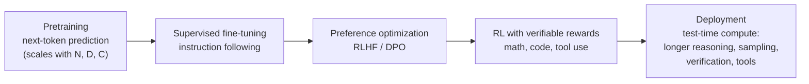
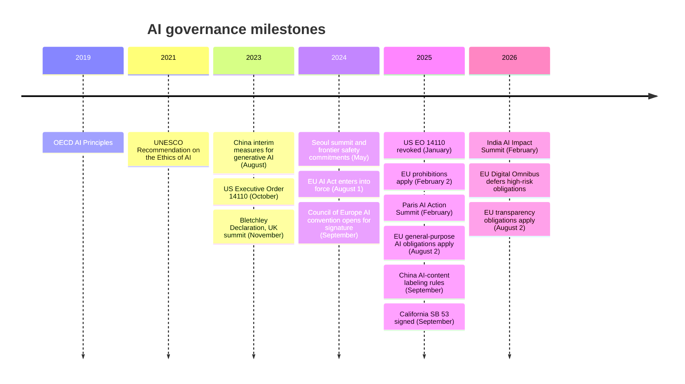

[AI & Machine Learning](./) › Frontier Research & Ethics

This page covers the research questions raised by large models and the responsibilities that come with deploying them: how capability scales with compute, data, and inference-time reasoning; how researchers measure and interpret what models have learned; what "alignment" and "safety" mean technically; the ethical problems of fairness, privacy, and accountability; and how governments and developers are regulating frontier systems. It is written as of late 2026 — a fast-moving area, so dated claims are marked with their dates. For a curated index of AI resources across the site, see the [Artificial Intelligence hub](../../artificial-intelligence/index.html).

## Scaling Laws

### Loss as a Function of Scale

Across many orders of magnitude, the pretraining loss of a language model falls as a smooth power law in the number of parameters $N$, the number of training tokens $D$, and the training compute $C$ (Kaplan et al., 2020). Hoffmann et al. (2022, "Chinchilla") fitted the parametric form

$$L(N, D) = E + \frac{A}{N^{\alpha}} + \frac{B}{D^{\beta}},$$

where $E$ is the irreducible loss (the entropy of text itself) and the two other terms are the penalties for finite model size and finite data. For a dense transformer, training compute is approximately

$$C \approx 6\,N\,D \ \text{FLOPs},$$

(two FLOPs per parameter per token for the forward pass, four for the backward pass). Minimizing $L$ subject to a fixed $C$ gives

$$N_{\text{opt}} \propto C^{\,\beta/(\alpha+\beta)}, \qquad D_{\text{opt}} \propto C^{\,\alpha/(\alpha+\beta)}.$$

Chinchilla found $\alpha \approx \beta$, so parameters and tokens should grow in roughly equal proportion — about **20 tokens per parameter**. That overturned the earlier practice (from Kaplan et al.) of scaling parameters much faster than data: the 280-billion-parameter Gopher was undertrained, and the 70-billion-parameter Chinchilla trained on 1.4 trillion tokens beat it with the same compute. Later replication work (Besiroglu et al., 2024) re-estimated the fitted constants but broadly confirmed the ratio.

### Beyond Compute-Optimal

Compute-optimal is not deployment-optimal. A model is trained once but served billions of times, so it pays to train a smaller model on far more data than Chinchilla prescribes and accept a higher training cost for cheaper inference. Meta's Llama 3 8B, for instance, was trained on about 15 trillion tokens — nearly 2,000 tokens per parameter — and loss was still falling. Other refinements:

- **Data quality and mixture** shift the curves: filtered, deduplicated, and domain-balanced data reach a given loss with fewer tokens, and data selection is now a major research area in its own right.
- **Data constraints.** High-quality public text is finite. Repeating data for up to about four epochs costs little relative to unique data (Muennighoff et al., 2023), beyond which returns diminish quickly; synthetic data generated or filtered by stronger models increasingly supplements web text.
- **Mixture-of-experts** models activate only a fraction of their parameters per token, so their scaling is expressed in terms of active parameters and total compute.
- **Downstream metrics** scale less predictably than loss: a smooth improvement in loss can appear as a sudden jump on a thresholded benchmark (see [Emergence](#emergent-abilities-and-the-metric-debate)).

<div class="code-reference">
<i class="fas fa-code"></i> Full implementation: <a href="https://github.com/andrewaltimit/Documentation/blob/main/github-pages/code-examples/technology/ai/advanced_ai_research.py#L15">advanced_ai_research.py#ScalingLaws</a>
</div>

```python
from advanced_ai_research import ScalingLaws

# Compute-optimal split of a 1e24-FLOP budget, given 1e12 available tokens
allocation = ScalingLaws.compute_optimal_model_size(compute_budget=1e24, dataset_tokens=1e12)

# Predicted pretraining loss for a 7B model trained on 300B tokens
loss = ScalingLaws.predict_loss(model_params=7e9, training_tokens=300e9)
```

### Test-Time Compute and Reasoning Models

Since 2024 a second scaling axis has become as important as pretraining: **inference-time (test-time) compute**. OpenAI's o1 (September 2024) showed that a model trained with reinforcement learning to produce a long chain of thought before answering improves steadily on mathematics, science, and coding problems as it is allowed to think longer, with accuracy rising roughly linearly in the logarithm of reasoning tokens. DeepSeek-R1 (January 2025) published an open-weight model and recipe: large-scale RL against **verifiable rewards** (answers that can be checked automatically, unit tests that pass or fail) using GRPO, a PPO variant that estimates advantages from a group of sampled answers instead of a learned value function. Long, self-correcting reasoning traces emerged from the RL without being demonstrated.



Test-time compute can be spent in several ways: longer single chains of thought, sampling many answers and taking a majority vote (self-consistency), best-of-$n$ selection with a verifier or reward model, tree search over partial solutions, and agentic loops that call tools and check intermediate results. Snell et al. (2024) showed that, for a fixed inference budget, allocating compute adaptively by problem difficulty can match a much larger model. By 2026 every major developer ships reasoning models, usually with a caller-controlled "thinking budget," and the frontier of capability is set by the combination of pretraining scale, RL post-training, and inference-time compute. Details of RL post-training are in [Reinforcement Learning](reinforcement-learning.html) and [Fine-Tuning](fine-tuning.html).

### Measuring Capability

Static benchmarks saturate quickly: MMLU, GSM8K, and HumanEval, standard in 2022–23, were near their ceilings within two years, and test-set contamination (benchmark items leaking into web-scale training data) inflates scores. Evaluation has shifted toward:

- **Harder, expert-written or held-out sets** (e.g. GPQA, Humanity's Last Exam, FrontierMath) and regularly refreshed problems (LiveCodeBench).
- **Realistic tasks** judged by execution: resolving real GitHub issues (SWE-bench Verified), multi-step terminal and browser tasks, and long-horizon agent benchmarks.
- **Time horizons.** METR (2025) measured the length of software tasks, in human-expert time, that models can complete with 50% reliability, and found it had doubled roughly every seven months since 2019 — a trend that, if it continues, is a useful single number for forecasting agent capability.
- **Human preference arenas** for open-ended quality, with known biases toward length and style.

## Emergent Abilities and the Metric Debate

Wei et al. (2022) catalogued **emergent abilities**: tasks on which performance stays near chance for smaller models and then rises sharply past some scale — multi-digit arithmetic, some word puzzles, and the benefit of chain-of-thought prompting itself. **In-context learning**, the ability to perform a new task from a few examples in the prompt with no weight updates, is the best-known example, and has been partly explained mechanistically by *induction heads* (below).

Schaeffer, Miranda & Koyejo (NeurIPS 2023) argued that many of these jumps are artifacts of the **metric**: exact-match accuracy on a multi-token answer is a steep nonlinear function of per-token accuracy, so smoothly improving per-token probabilities look like a sudden transition. Re-scored with continuous metrics (token edit distance, log-likelihood of the correct answer), most emergent curves become smooth and predictable. The current consensus is nuanced: underlying competence usually improves smoothly with scale, but the *usable* capability — the point at which a model is reliable enough to depend on — can still arrive abruptly, which matters for safety forecasting.

Related phenomena:

- **Grokking** (Power et al., 2022): on small algorithmic tasks, a network first memorizes the training set and then, long after training loss reaches zero, abruptly generalizes. Interpretability work traced this to a slowly forming general circuit that eventually outcompetes memorization, driven by weight decay.
- **Inverse scaling**: some tasks get *worse* with scale, typically where a larger model more faithfully imitates a misleading pattern in the prompt or in human text (for example, repeating common misconceptions).

<div class="code-reference">
<i class="fas fa-code"></i> Full implementation: <a href="https://github.com/andrewaltimit/Documentation/blob/main/github-pages/code-examples/technology/ai/advanced_ai_research.py#L303">advanced_ai_research.py#EmergentAbilities</a>
</div>

## Mechanistic Interpretability

**Mechanistic interpretability** tries to reverse-engineer the algorithms a trained network implements — to explain behavior in terms of internal features and the circuits that connect them, rather than only attributing outputs to inputs.

### Core Findings

- **Features as directions.** Concepts tend to be represented as directions in activation space (the *linear representation hypothesis*) rather than as individual neurons.
- **Superposition.** Networks represent more features than they have dimensions by packing them into nearly orthogonal directions, which is why individual neurons are **polysemantic** — responding to several unrelated concepts (Elhage et al., "Toy Models of Superposition," 2022).
- **Induction heads.** Pairs of attention heads that implement "find the previous occurrence of the current token and copy what followed it" form abruptly during training, coincident with a jump in in-context-learning ability (Olsson et al., 2022).
- **Circuits.** Specific behaviors — indirect-object identification, modular addition, factual recall — have been traced to small subgraphs of heads and MLP layers.

### Methods

| Method | Question it answers | Notes |
|--------|---------------------|-------|
| Probing classifiers | Is information $X$ linearly decodable from layer $\ell$? | Shows presence, not use |
| Logit lens / tuned lens | What would the model predict if it stopped at layer $\ell$? | Decodes the residual stream with the unembedding |
| Activation patching (causal tracing) | Which components are *causally* necessary for a behavior? | Swap activations between clean and corrupted runs |
| Sparse autoencoders (SAEs) | Which interpretable features make up an activation? | Learn an overcomplete sparse dictionary; addresses superposition |
| Transcoders and attribution graphs | How do features compute the output, step by step? | Replace MLPs with interpretable sparse layers and trace feature-to-feature influence |
| Steering vectors | Can a behavior be controlled by adding a direction? | Adds a feature direction to activations at inference |

**Sparse dictionary learning** became the field's dominant tool from 2023. An SAE is trained to reconstruct a layer's activations $\mathbf{h}$ as a sparse combination of learned feature directions:

$$\mathbf{f} = \mathrm{ReLU}\left(W_{\text{enc}}\,\mathbf{h} + \mathbf{b}_{\text{enc}}\right), \qquad \hat{\mathbf{h}} = W_{\text{dec}}\,\mathbf{f} + \mathbf{b}_{\text{dec}}, \qquad \mathcal{L} = \lVert \mathbf{h} - \hat{\mathbf{h}} \rVert^2 + \lambda \lVert \mathbf{f} \rVert_1.$$

Anthropic scaled SAEs to a production model in 2024 ("Scaling Monosemanticity," Claude 3 Sonnet), extracting millions of features — including abstract, multilingual, and multimodal ones such as a feature for deception or for a specific landmark — and showed that clamping features steers behavior. Google DeepMind released open SAE suites for Gemma (Gemma Scope, 2024). In 2025, Anthropic's *circuit tracing* work used cross-layer transcoders to build **attribution graphs** showing, for individual prompts, multi-step internal reasoning (for example, planning a rhyme before writing the line that ends in it).

Limitations are substantial. SAEs leave a meaningful fraction of activation variance unexplained, the features found depend on dictionary size and training choices, and on some practical downstream tasks SAE-based methods have not outperformed simple linear probes. Interpretability remains far from being able to verify that a frontier model is safe, but it already supports debugging, auditing for hidden objectives, and monitoring.

<div class="code-reference">
<i class="fas fa-code"></i> Full implementation: <a href="https://github.com/andrewaltimit/Documentation/blob/main/github-pages/code-examples/technology/ai/advanced_ai_research.py#L132">advanced_ai_research.py#MechanisticInterpretability</a>
</div>

```python
from advanced_ai_research import MechanisticInterpretability as MI

patterns = MI.compute_neuron_activation_patterns(model, dataloader, layer_name="transformer.h.10.mlp")
heads = MI.attention_pattern_analysis(attention_weights)   # [batch, heads, seq, seq]; includes induction scores
circuit = MI.circuit_discovery(model, input_data, target_behavior=lambda x: x[:, 0])
```

For production-grade work, the open-source libraries TransformerLens, nnsight, and SAELens provide hooks into model internals and pretrained SAEs.

## AI Safety and Alignment

**Alignment** is the problem of getting a system to pursue the goals its developers and users intend; **safety** is the broader problem of preventing harm from its deployment, whether through misalignment, misuse, or accident. The concerns grow with capability and autonomy: a chatbot's errors are visible to a human reader, whereas an agent acting over hours with tool access can take consequential actions no one reviews.

### Failure Modes

| Failure mode | Description | Example evidence |
|--------------|-------------|------------------|
| Specification gaming / reward hacking | Optimizing the literal objective rather than the intended one | RL agents exploiting simulator bugs; coding agents special-casing unit tests |
| Sycophancy | Telling users what they want to hear | Documented in RLHF-trained models; a 2025 model update rolled back for excessive flattery |
| Hallucination | Fluent, confident, false statements | Fabricated citations and legal cases |
| Jailbreaks | Prompts that bypass safety training | Role-play, many-shot, and encoding attacks |
| Prompt injection | Instructions hidden in untrusted content hijack an agent | Malicious web pages or documents read by browsing/coding agents |
| Deceptive or strategic behavior | Model behaves differently when it believes it is observed or trained | "Sleeper agents" backdoors surviving safety training (Hubinger et al., 2024); "alignment faking" in Claude 3 Opus (Greenblatt et al., 2024) |
| Dangerous capabilities | Uplift for biological, chemical, or cyber attacks | The focus of pre-deployment evaluations by developers and government institutes |

### Techniques

- **Learning from feedback.** RLHF and DPO (see [Fine-Tuning](fine-tuning.html)) remain the base layer. **Constitutional AI** (Bai et al., 2022) replaces much of the human harmlessness labeling with AI feedback guided by a written set of principles; published model specifications and constitutions now describe intended behavior explicitly.
- **Scalable oversight.** How can humans supervise models on tasks they cannot easily evaluate? Proposals include debate, recursive reward modeling, and using weaker models to supervise stronger ones ("weak-to-strong generalization," 2023).
- **Red teaming and adversarial training.** Human and automated attack generation, with classifiers screening inputs and outputs for high-risk domains.
- **Dangerous-capability evaluations.** Structured tests (biology, cyber-offense, autonomous replication, AI R&D) run before release, by developers and by government bodies such as the UK AI Security Institute and US CAISI.
- **AI control.** Designing deployments to be safe *even if* the model is misaligned: monitoring with trusted models, restricting permissions, sandboxing, and auditing actions (Greenblatt et al., 2023).
- **Chain-of-thought monitoring.** Reasoning models expose intermediate reasoning that can be read for signs of reward hacking or harmful intent. Researchers from several labs argued in 2025 that this monitorability is valuable but fragile, since optimizing directly against "bad thoughts" can teach models to hide them.
- **Interpretability-based auditing.** Using the tools above to look for hidden objectives or deceptive features, rather than relying on behavior alone.

### Frontier Safety Frameworks

The leading developers have published policies that tie model capabilities to required safeguards: Anthropic's Responsible Scaling Policy (2023, with AI Safety Levels), OpenAI's Preparedness Framework (2023, revised 2025), and Google DeepMind's Frontier Safety Framework (2024). At the May 2024 Seoul summit, sixteen companies committed to publish such frameworks. They share a structure: define capability thresholds, evaluate each new model against them, and require stronger security and deployment mitigations before a threshold-crossing model ships. Anthropic, for example, activated its ASL-3 protections for Claude Opus 4 in May 2025 on a precautionary basis. California's SB 53 (2025) and the EU's general-purpose-AI Code of Practice turned publication of such frameworks into a legal expectation for the largest developers.

## Ethics in Practice

### Fairness

Models trained on historical data reproduce its disparities, and there are several incompatible formal definitions of fairness for a classifier with prediction $\hat{Y}$, outcome $Y$, and protected attribute $A$:

| Criterion | Requirement | Intuition |
|-----------|-------------|-----------|
| Demographic parity | $P(\hat{Y}=1 \mid A=a)$ equal across groups | Equal selection rates |
| Equalized odds | Equal true-positive and false-positive rates across groups | Equal error rates |
| Equal opportunity | Equal true-positive rates across groups | Qualified people treated equally |
| Calibration (predictive parity) | $P(Y=1 \mid \hat{p}=s, A=a) = s$ for all groups | A score means the same thing for everyone |

When base rates differ between groups, calibration and equalized odds cannot both hold except for a perfect predictor (Kleinberg, Mullainathan & Raghavan, 2016; Chouldechova, 2017) — the formal core of the COMPAS recidivism-score controversy. Choosing a criterion is a value judgment about which errors matter, not a purely technical decision. Mitigations act on the data (reweighting, collecting better samples), the training objective (fairness constraints), or the outputs (group-specific thresholds), and must be paired with disaggregated evaluation. For generative models, fairness concerns shift to representational harms — stereotyped depictions, uneven quality across languages and dialects.

### Privacy

Large models memorize some training data and can be induced to reproduce it verbatim, including personal information (Carlini et al., 2021, 2023). Defenses:

- **Differential privacy** (DP-SGD): clip per-example gradients and add calibrated noise, giving a formal bound $\varepsilon$ on how much any one record can change the model. Utility costs remain significant at large scale.
- **Data governance**: deduplication (which sharply reduces memorization), PII filtering, and respecting opt-outs.
- **Federated learning**: train on-device and share only model updates, often combined with secure aggregation.
- **Machine unlearning**: removing the influence of specific data after training; exact unlearning generally requires retraining, and approximate methods are hard to verify.

See [Privacy Engineering](../cybersecurity/privacy-engineering.html) for the broader discipline.

### Transparency and Accountability

- **Documentation.** Model cards (Mitchell et al., 2019) and datasheets for datasets (Gebru et al., 2018) describe intended use, evaluation across groups, and limitations; system cards for frontier models add safety evaluation results.
- **Explainability.** Post-hoc attribution methods (SHAP, integrated gradients) explain individual predictions of conventional models; for LLMs, a model's stated reasoning is not guaranteed to be faithful to its actual computation.
- **Provenance.** C2PA content credentials and watermarking (such as Google's SynthID) mark AI-generated media, and disclosure of synthetic content is becoming a legal requirement in the EU and China.
- **Human oversight and redress.** High-stakes automated decisions need a meaningful human review path and a way for affected people to contest outcomes.

### Wider Impacts

- **Copyright and training data.** Whether training on copyrighted works is lawful remains contested. In the US, the 2025 *Bartz v. Anthropic* ruling held training on lawfully acquired books to be fair use but not the retention of pirated copies, and the case settled for 1.5 billion US dollars; other suits, such as *New York Times v. OpenAI and Microsoft*, were ongoing as of 2026. The EU requires general-purpose model providers to publish a summary of training content and respect text-and-data-mining opt-outs.
- **Energy and resources.** Frontier training runs and, increasingly, inference at scale consume large amounts of electricity and water for cooling; data-center power demand has become a planning issue for utilities.
- **Labor.** Effects include automation of routine cognitive tasks, productivity gains that vary widely by task and experience, and the working conditions of the data-labeling workforce behind post-training.
- **Misinformation and misuse.** Cheap generation of convincing text, voice clones, and video enables fraud, harassment (including non-consensual intimate imagery), and influence operations.
- **Concentration of power.** The cost of frontier training concentrates capability in a few companies and countries, which is one motive for open-weight models — themselves a trade-off between openness and misuse risk.

### Across the Lifecycle

| Phase | Practices |
|-------|-----------|
| Design | Define intended use and out-of-scope uses; impact assessment; consult affected groups |
| Data | Provenance and licensing records; deduplication and PII filtering; representativeness checks |
| Development | Disaggregated evaluation; red teaming; dangerous-capability and misuse testing; documentation |
| Deployment | Staged rollout; usage policies and monitoring; incident reporting; content provenance |
| Operation | Drift and abuse monitoring; audits; user feedback and redress; decommissioning plan |

Management-system standards such as the NIST AI Risk Management Framework (2023, with a generative-AI profile in 2024) and ISO/IEC 42001 (2023) codify these practices, and conformity with them is a common route to demonstrating regulatory compliance.

## Governance and Regulation



### European Union

The **AI Act** (Regulation (EU) 2024/1689) is the first comprehensive horizontal AI law. It classifies systems by risk:

| Tier | Examples | Obligations |
|------|----------|-------------|
| Unacceptable (prohibited) | Social scoring, manipulative techniques, untargeted facial-image scraping, most real-time remote biometric identification in public | Banned from 2 February 2025 |
| High risk | AI in hiring, credit, education, critical infrastructure, law enforcement, and safety components of regulated products | Risk management, data governance, logging, human oversight, conformity assessment |
| Limited risk (transparency) | Chatbots, deepfakes, emotion recognition | Disclose AI interaction and label synthetic content |
| General-purpose AI models | Foundation models; "systemic risk" tier above $10^{25}$ training FLOPs | Technical documentation, training-data summary, copyright policy; for systemic-risk models, evaluations, incident reporting, and cybersecurity |

General-purpose-model obligations applied from 2 August 2025, supported by a voluntary Code of Practice. The 2026 **Digital Omnibus** amendments deferred the high-risk obligations to 2 December 2027 for stand-alone (Annex III) systems and 2 August 2028 for AI embedded in regulated products (Annex I), and added prohibitions on AI generation of non-consensual intimate imagery and child sexual abuse material. Consult the official text for current dates, as the implementation schedule has already changed once.

### United States

There is no comprehensive federal AI statute. Executive Order 14110 (October 2023) required reporting on large training runs and created the US AI Safety Institute; it was revoked in January 2025, the institute was refocused as the Center for AI Standards and Innovation (CAISI), and federal policy shifted toward promoting development (*America's AI Action Plan*, July 2025) and toward limiting divergent state rules. Regulation has largely moved to the states: California's **SB 53** (Transparency in Frontier Artificial Intelligence Act, signed September 2025) requires the largest frontier developers to publish safety frameworks, report critical safety incidents to the state within 15 days, and protect whistleblowers; Colorado's AI Act addresses algorithmic discrimination in consequential decisions. Sector regulators (FDA for medical devices, FTC for deceptive practices, EEOC for hiring) apply existing law to AI.

### China

China regulates by technology and application: rules on recommendation algorithms (2022) and deep synthesis (2023), the **Interim Measures for Generative AI Services** (August 2023) requiring security assessments and algorithm filing for public-facing models, and mandatory explicit and implicit labeling of AI-generated content from September 2025.

### International

The UK-hosted Bletchley Park summit (November 2023) produced the first international declaration on frontier-AI risk and launched a series of summits (Seoul 2024, Paris 2025, New Delhi 2026) whose emphasis has shifted from safety toward adoption and development. The UK's AI Safety Institute, renamed the **AI Security Institute** in 2025, conducts pre-deployment testing, and a network of national institutes coordinates evaluation methods. The **International AI Safety Report** (first edition January 2025), led by Yoshua Bengio, synthesizes the scientific evidence on risks. The Council of Europe's **Framework Convention on AI** is the first legally binding international treaty on AI and human rights. Softer instruments include the OECD AI Principles (2019, updated 2024), the UNESCO Recommendation (2021), and the G7 Hiroshima process code of conduct (2023).

## Tools for Research and Practice

| Purpose | Tools |
|---------|-------|
| Training frameworks | PyTorch, JAX, Hugging Face Transformers, DeepSpeed, Megatron-LM |
| Inference and serving | vLLM, SGLang, TensorRT-LLM, llama.cpp |
| Evaluation | EleutherAI lm-evaluation-harness, Inspect (UK AI Security Institute), HELM |
| Interpretability | TransformerLens, nnsight, SAELens, Neuronpedia |
| Experiment tracking | Weights & Biases, MLflow |
| Fairness and explainability | Fairlearn, AIF360, SHAP, Captum |
| Privacy | Opacus (DP-SGD for PyTorch), Flower (federated learning) |

## Further Reading

**Textbooks**

- Goodfellow, Bengio & Courville (2016). *Deep Learning*. MIT Press.
- Bishop & Bishop (2024). *Deep Learning: Foundations and Concepts*. Springer.
- Murphy (2022, 2023). *Probabilistic Machine Learning: An Introduction* and *Advanced Topics*. MIT Press.
- Prince (2023). *Understanding Deep Learning*. MIT Press.
- Shalev-Shwartz & Ben-David (2014). *Understanding Machine Learning: From Theory to Algorithms*.
- Barocas, Hardt & Narayanan (2023). *Fairness and Machine Learning: Limitations and Opportunities*. MIT Press.

**Scaling, reasoning, and emergence**

- Kaplan et al. (2020). "Scaling Laws for Neural Language Models." arXiv.
- Hoffmann et al. (2022). "Training Compute-Optimal Large Language Models." *NeurIPS*.
- Wei et al. (2022). "Emergent Abilities of Large Language Models." *TMLR*.
- Schaeffer, Miranda & Koyejo (2023). "Are Emergent Abilities of Large Language Models a Mirage?" *NeurIPS*.
- Snell et al. (2024). "Scaling LLM Test-Time Compute Optimally Can Be More Effective than Scaling Model Parameters." arXiv.
- DeepSeek-AI (2025). "DeepSeek-R1: Incentivizing Reasoning Capability in LLMs via Reinforcement Learning." arXiv.

**Interpretability**

- Olsson et al. (2022). "In-context Learning and Induction Heads." *Transformer Circuits Thread*.
- Elhage et al. (2022). "Toy Models of Superposition." *Transformer Circuits Thread*.
- Templeton et al. (2024). "Scaling Monosemanticity." *Transformer Circuits Thread*.

**Safety and alignment**

- Amodei et al. (2016). "Concrete Problems in AI Safety." arXiv.
- Russell (2019). *Human Compatible*. Viking.
- Bai et al. (2022). "Constitutional AI: Harmlessness from AI Feedback." arXiv.
- Hubinger et al. (2024). "Sleeper Agents: Training Deceptive LLMs that Persist Through Safety Training." arXiv.
- Greenblatt et al. (2024). "Alignment Faking in Large Language Models." arXiv.
- Bengio et al. (2025). *International AI Safety Report*.

**Ongoing sources**

- [Transformer Circuits Thread](https://transformer-circuits.pub/) — interpretability research
- [Alignment Forum](https://www.alignmentforum.org/) — alignment research discussion
- [Epoch AI](https://epoch.ai/) — data on compute, scaling, and AI trends
- [Hugging Face Papers](https://huggingface.co/papers) — daily curated papers
- [distill.pub](https://distill.pub/) — interactive ML explanations (archival; inactive since 2021)

## Related Technologies

- [Quantum Computing](../quantumcomputing.html) — quantum machine learning
- [Cybersecurity](../cybersecurity/) — adversarial ML, prompt injection, and securing AI systems
- [Database Design](../database-design/) — vector search and retrieval infrastructure
- [Networking](../networking/) — interconnects for distributed training
- [AWS](../aws/) — cloud platforms for AI/ML workloads

---

## Continue Reading

<div class="page-nav" style="display: flex; justify-content: space-between; gap: 1rem; flex-wrap: wrap;">
  <span>← <strong>Previous:</strong> <a href="generative-models.html">Generative Models</a></span>
  <span><strong>Next:</strong> <a href="./">Back to the AI &amp; ML Hub</a></span>
</div>

### See Also

- [Artificial Intelligence Hub](../../artificial-intelligence/index.html) — index of all AI material on the site
- [AI Deep Dive](../ai-lecture-2023.html) — LLM internals, post-training, agents, and LLM security
- [Fine-Tuning & Transfer Learning](fine-tuning.html) — RLHF, DPO, and preference data
- [Reinforcement Learning](reinforcement-learning.html) — the RL behind RLHF and reasoning models
- [Generative Models](generative-models.html) — diffusion, flow matching, and autoregressive generation
