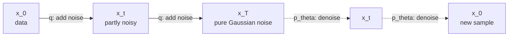
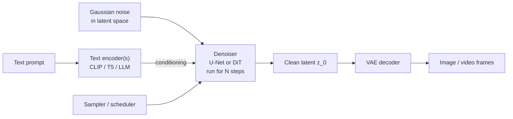
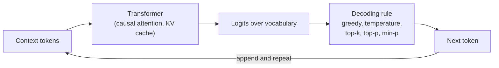
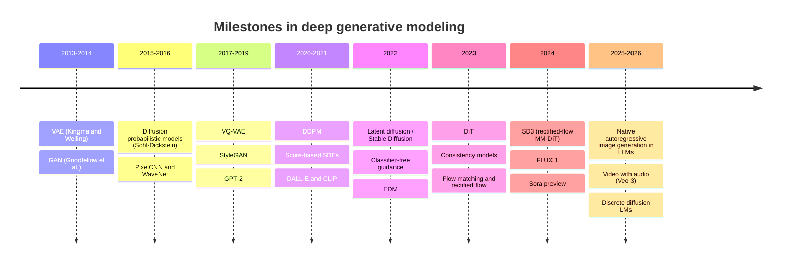

[AI & Machine Learning](./) › Generative Models

A **generative model** learns an approximation $p_\theta(\mathbf{x})$ of the distribution that produced its training data, so it can draw new samples from it and, in some cases, evaluate how likely a given sample is. This page covers the families that matter in practice: **diffusion and flow-matching models** (the dominant approach for images, video, and audio), **GANs**, **VAEs**, **autoregressive models** (the basis of large language models), and the newer **discrete diffusion** language models. It focuses on the objectives and sampling procedures; the loss functions themselves are derived in more depth on [Loss Functions & Objectives](loss-functions.html), and a hands-on pipeline walkthrough lives in [Stable Diffusion Fundamentals](../../ai-ml/stable-diffusion-fundamentals.html).

## The Families at a Glance

Every family answers the same question — how to turn simple randomness into structured data — with a different trade-off between sample quality, diversity (mode coverage), sampling speed, training stability, and whether the model gives you a likelihood.

| Family | How it generates | Sampling cost | Exact likelihood | Training | Typical use (2025–26) |
|--------|------------------|---------------|------------------|----------|------------------------|
| Diffusion / score-based | Iteratively denoise Gaussian noise | 20–50 network calls; 1–4 after distillation | Via ODE (expensive) | Stable (regression loss) | Images, video, audio, molecules |
| Flow matching / rectified flow | Integrate a learned velocity field from noise to data | Similar to diffusion, fewer steps | Via ODE | Stable (regression loss) | SD3, FLUX and most new image/video models |
| GAN | One generator pass from a latent vector | 1 call | No | Adversarial, unstable | Super-resolution, real-time, as a distillation loss |
| VAE | Decode a sample from a latent prior | 1 call | Lower bound (ELBO) | Stable | The compression stage of latent diffusion |
| Autoregressive | Predict one token at a time | One call per token | Yes | Stable (cross-entropy) | LLMs, speech, some image generators |
| Normalizing flow | Invertible transform of noise | 1 call | Yes | Stable, architecture-constrained | Density estimation, niche image models |
| Discrete (masked) diffusion | Iteratively unmask tokens in parallel | Few passes over the whole sequence | Bound | Stable (cross-entropy) | Emerging fast text and code generation |

## Diffusion Models

Diffusion models, introduced by Sohl-Dickstein et al. (2015) and made practical by **DDPM** (Ho, Jain & Abbeel, 2020), define a fixed *forward process* that gradually corrupts data into Gaussian noise and train a network to run that process *in reverse*. Generating an image then means starting from pure noise and repeatedly applying the learned denoiser.



*Solid arrows: the fixed forward (noising) process used to build training pairs. Dashed arrows: the learned reverse process used for generation.*

### DDPM: The Discrete-Time Formulation

With a variance schedule $\beta_1, \dots, \beta_T$ and $\bar\alpha_t = \prod_{s=1}^{t}(1-\beta_s)$, the forward process has a closed form at any step, so a noisy sample can be produced in one shot:

$$q(\mathbf{x}_t \mid \mathbf{x}_0) = \mathcal{N}\!\left(\mathbf{x}_t;\ \sqrt{\bar\alpha_t}\,\mathbf{x}_0,\ (1-\bar\alpha_t)\mathbf{I}\right), \qquad \mathbf{x}_t = \sqrt{\bar\alpha_t}\,\mathbf{x}_0 + \sqrt{1-\bar\alpha_t}\,\varepsilon, \quad \varepsilon \sim \mathcal{N}(\mathbf{0}, \mathbf{I}).$$

The reverse transitions $p_\theta(\mathbf{x}_{t-1} \mid \mathbf{x}_t)$ are Gaussians whose mean is computed from a network $\varepsilon_\theta$ that predicts the added noise. The variational bound on the likelihood simplifies, after reweighting, to a plain regression loss:

$$\mathcal{L}_{\text{simple}} = \mathbb{E}_{t,\,\mathbf{x}_0,\,\varepsilon}\left[\left\lVert \varepsilon - \varepsilon_\theta(\mathbf{x}_t, t)\right\rVert^2\right].$$

Training is therefore: sample an image, a timestep, and a noise vector; build $\mathbf{x}_t$; regress the noise. There is no adversary and no intractable integral, which is why diffusion training is far more stable than GAN training.

**Parameterizations.** Predicting the noise $\varepsilon$ is one of three equivalent targets. The network can instead predict the clean image $\mathbf{x}_0$, or the *velocity* $\mathbf{v} = \sqrt{\bar\alpha_t}\,\varepsilon - \sqrt{1-\bar\alpha_t}\,\mathbf{x}_0$ (Salimans & Ho, 2022). They differ in how the loss is weighted across noise levels; $\mathbf{v}$-prediction behaves better at very high noise and is used by several production models.

**Schedules.** The original linear $\beta_t$ schedule destroys information too quickly at low resolution; the cosine schedule (Nichol & Dhariwal, 2021) and later noise-level-aware formulations fixed this. Karras et al.'s **EDM** framework (2022) separated the design choices — noise schedule, network preconditioning, loss weighting, and sampler — and showed each can be tuned independently.

<div class="code-reference">
<i class="fas fa-code"></i> Full implementation: <a href="https://github.com/andrewaltimit/Documentation/blob/main/github-pages/code-examples/technology/ai/diffusion_models.py#L119">diffusion_models.py#DDPM</a>
</div>

```python
from diffusion_models import DDPM

ddpm = DDPM(noise_predictor, T=1000, beta_start=1e-4, beta_end=0.02)  # noise_predictor: a U-Net or DiT

loss = ddpm.loss(batch_images)                                  # noise-prediction MSE
samples = ddpm.sample(shape=(16, 3, 256, 256))                  # 1000 ancestral steps
fast = ddpm.ddim_sample(shape=(16, 3, 256, 256), ddim_timesteps=50)  # deterministic DDIM
```

### The Score-Based (SDE) View

Song et al. (2021) unified diffusion models with score matching by taking the number of steps to infinity. The forward process becomes a stochastic differential equation

$$d\mathbf{x} = f(\mathbf{x}, t)\,dt + g(t)\,d\mathbf{w},$$

and Anderson's time-reversal result gives the reverse-time SDE, which depends on the data only through the **score** $\nabla_{\mathbf{x}} \log p_t(\mathbf{x})$:

$$d\mathbf{x} = \left[f(\mathbf{x}, t) - g(t)^2\, \nabla_{\mathbf{x}} \log p_t(\mathbf{x})\right]dt + g(t)\,d\bar{\mathbf{w}}.$$

A network $s_\theta(\mathbf{x}, t)$ is trained to approximate the score by *denoising score matching*. Noise prediction and score estimation are the same thing up to scale: for the DDPM forward process, $s_\theta(\mathbf{x}_t, t) = -\varepsilon_\theta(\mathbf{x}_t, t)/\sqrt{1-\bar\alpha_t}$.

The same marginals $p_t$ are also produced by a deterministic **probability-flow ODE**,

$$\frac{d\mathbf{x}}{dt} = f(\mathbf{x}, t) - \tfrac{1}{2}\,g(t)^2\, \nabla_{\mathbf{x}} \log p_t(\mathbf{x}),$$

which is what makes fast deterministic samplers (DDIM is a discretization of it), exact likelihood computation, and latent-space interpolation possible. Common choices of $f$ and $g$ are the *variance-preserving* SDE (the continuous limit of DDPM) and the *variance-exploding* SDE with geometric noise levels $\sigma(t) = \sigma_{\min}\left(\sigma_{\max}/\sigma_{\min}\right)^{t}$.

<div class="code-reference">
<i class="fas fa-code"></i> Full implementation: <a href="https://github.com/andrewaltimit/Documentation/blob/main/github-pages/code-examples/technology/ai/diffusion_models.py#L16">diffusion_models.py#ScoreBasedDiffusion</a>
</div>

### Samplers

Because the reverse process is an SDE or ODE, sampling is numerical integration, and better integrators mean fewer network evaluations (NFEs) for the same quality.

| Sampler | Type | Typical steps | Notes |
|---------|------|---------------|-------|
| DDPM ancestral | Stochastic | 250–1000 | Original; slow |
| DDIM (Song, Meng & Ermon, 2021) | Deterministic ODE | 25–100 | Same trained model, far fewer steps; invertible |
| Euler / Heun (EDM) | ODE, 1st/2nd order | 20–40 | Simple, robust defaults |
| DPM-Solver++, UniPC | High-order ODE solvers | 10–25 | Exploit the semi-linear structure of the ODE |
| Euler ancestral, DPM++ SDE | Stochastic | 20–40 | Injected noise can correct accumulated error |

### Flow Matching and Rectified Flow

**Flow matching** (Lipman et al., 2023) and the closely related **rectified flow** (Liu et al., 2023) skip the SDE machinery and learn a velocity field that transports noise to data directly. The simplest version draws a straight line between a data point and a noise sample,

$$\mathbf{x}_t = (1-t)\,\mathbf{x}_0 + t\,\varepsilon, \qquad t \in [0, 1],$$

and trains a network $\mathbf{v}_\theta$ to predict the constant velocity along it:

$$\mathcal{L}_{\text{FM}} = \mathbb{E}_{t,\,\mathbf{x}_0,\,\varepsilon}\left[\left\lVert \mathbf{v}_\theta(\mathbf{x}_t, t) - (\varepsilon - \mathbf{x}_0)\right\rVert^2\right].$$

Sampling integrates $d\mathbf{x}/dt = \mathbf{v}_\theta$ from $t=1$ (noise) to $t=0$ (data). Gaussian diffusion is a special case with curved paths; straighter paths are easier to integrate in few steps. Stable Diffusion 3 (Esser et al., 2024) showed that rectified flow with a timestep distribution biased toward the middle noise levels outperformed the standard diffusion formulations at scale, and FLUX.1 and most image and video models released since 2024 are trained with flow-matching objectives. See [SD3 Guide](../../ai-ml/sd3-guide.html) and [FLUX Guide](../../ai-ml/flux-guide.html) for the practical consequences.

### Guidance and Conditioning

Conditional models (text-to-image, image-to-video) receive the condition $c$ — usually text-encoder embeddings — through cross-attention (U-Net era) or by concatenating text and image tokens into one joint attention sequence (MM-DiT in SD3 and FLUX).

**Classifier-free guidance** (Ho & Salimans, 2022) trains one network both with and without the condition (the condition is randomly dropped during training) and extrapolates between the two predictions at sampling time:

$$\tilde\varepsilon_\theta(\mathbf{x}_t, c) = \varepsilon_\theta(\mathbf{x}_t, \varnothing) + w\left(\varepsilon_\theta(\mathbf{x}_t, c) - \varepsilon_\theta(\mathbf{x}_t, \varnothing)\right).$$

A guidance scale $w > 1$ trades diversity for prompt adherence and apparent quality; too high a value oversaturates images. CFG doubles the cost per step, so some models (FLUX.1-dev, for example) are *guidance-distilled* to take $w$ as an input and run a single pass. Structural conditioning such as edges, depth, or pose is added with auxiliary networks like [ControlNet](../../ai-ml/controlnet.html).

### Latent Diffusion and the Backbone

Running diffusion on raw pixels is expensive at high resolution. **Latent diffusion** (Rombach et al., 2022) first trains an autoencoder that compresses an image by about 8x per side into a latent tensor, runs diffusion in that latent space, and decodes the result. This is the design behind every Stable Diffusion release and most commercial image and video generators.



The denoiser architecture has shifted from the convolutional **U-Net** (SD 1.x, SDXL) to the **Diffusion Transformer** (DiT; Peebles & Xie, 2023), which treats the latent as a sequence of patches and scales predictably with parameters and compute, just like language transformers. SD3's MM-DiT, FLUX, and current video models are transformer-based. For video, the latent is a spatio-temporal volume of patches, and the same machinery extends across time.

### Fast Sampling: Distillation

Twenty to fifty network calls per image is the main practical cost of diffusion. Several distillation methods reduce it to one to eight:

- **Progressive distillation** (Salimans & Ho, 2022) repeatedly trains a student to match two teacher steps with one.
- **Consistency models** (Song et al., 2023) learn a function that maps any point on an ODE trajectory directly to its endpoint, enabling one- or few-step generation; *latent consistency models* apply this to Stable Diffusion.
- **Adversarial diffusion distillation** (SDXL Turbo, 2023) and its latent successors combine a distillation loss with a GAN discriminator, producing sharp images in 1–4 steps.
- **Distribution-matching** and **rectified-flow reflow** approaches straighten trajectories so a few Euler steps suffice.

The cost of distillation is some loss of diversity and controllability (for example, reduced sensitivity to negative prompts and CFG).

### Applications Beyond Still Images

- **Video**: diffusion transformers over spatio-temporal latents. OpenAI's Sora (previewed February 2024) made the approach famous; Google's Veo 3 (2025) added natively generated synchronized audio, and open-weight video models (e.g. HunyuanVideo, Wan) followed.
- **Audio and music**: latent diffusion over spectrograms or codec latents (Stable Audio), alongside autoregressive codec-token models.
- **Science**: protein backbone design (RFdiffusion), biomolecular structure prediction (AlphaFold 3 uses a diffusion module to produce atomic coordinates), materials and small-molecule generation.
- **Robotics**: *diffusion policies* generate action trajectories conditioned on observations.
- **Editing**: inpainting, outpainting, and instruction-based image editing reuse the same denoiser with partial noising or extra conditioning; see [Inpainting & Editing](../../ai-ml/inpainting-editing.html).

### Strengths and Limitations

| Strengths | Limitations |
|-----------|-------------|
| State-of-the-art fidelity and diversity; good mode coverage | Iterative sampling; many network calls without distillation |
| Stable, simple regression objective | Large memory footprint at high resolution and for long video |
| Easy to condition and guide at inference time | Exact likelihood is expensive to compute |
| Same framework spans images, video, audio, and 3-D | Heavy guidance reduces diversity; artifacts in text, hands, and physics persist in weaker models |

## Generative Adversarial Networks (GANs)

A GAN (Goodfellow et al., 2014) trains a **generator** $G$ that maps noise $\mathbf{z}$ to samples and a **discriminator** $D$ that classifies samples as real or generated. They play a minimax game:

$$\min_G \max_D \; \mathbb{E}_{\mathbf{x}\sim p_{\text{data}}}\left[\log D(\mathbf{x})\right] + \mathbb{E}_{\mathbf{z}\sim p_{\mathbf{z}}}\left[\log\left(1 - D(G(\mathbf{z}))\right)\right].$$

At the optimal discriminator the generator minimizes the Jensen–Shannon divergence between the real and generated distributions. In practice the generator is trained with the *non-saturating* loss $-\log D(G(\mathbf{z}))$, and variants such as the Wasserstein GAN with gradient penalty and spectral normalization were developed to stabilize training (see [Loss Functions](loss-functions.html)).

- **Strengths**: a single forward pass per sample; very sharp outputs; the StyleGAN family produced photorealistic faces years before diffusion caught up.
- **Weaknesses**: unstable, hyperparameter-sensitive training; **mode collapse** (the generator covers only part of the distribution); no likelihood; hard to scale to diverse, text-conditioned data.
- **Where GANs live now**: as a component rather than the whole model — the perceptual/adversarial loss that makes VAE decoders sharp, adversarial distillation of diffusion models, super-resolution (Real-ESRGAN), and neural vocoders for speech.

## Variational Autoencoders (VAEs)

A VAE (Kingma & Welling, 2014) pairs an **encoder** $q_\phi(\mathbf{z} \mid \mathbf{x})$ that maps an input to a distribution over latent codes with a **decoder** $p_\theta(\mathbf{x} \mid \mathbf{z})$ that reconstructs it. The marginal likelihood is intractable, so training maximizes the **evidence lower bound (ELBO)**:

$$\mathcal{L}_{\text{ELBO}} = \mathbb{E}_{q_\phi(\mathbf{z}\mid\mathbf{x})}\left[\log p_\theta(\mathbf{x}\mid\mathbf{z})\right] - D_{\mathrm{KL}}\left(q_\phi(\mathbf{z}\mid\mathbf{x}) \,\|\, p(\mathbf{z})\right).$$

The first term rewards accurate reconstruction; the second keeps the approximate posterior close to a simple prior $p(\mathbf{z}) = \mathcal{N}(\mathbf{0}, \mathbf{I})$ so that sampling from the prior yields plausible outputs. The **reparameterization trick** $\mathbf{z} = \boldsymbol{\mu} + \boldsymbol{\sigma} \odot \boldsymbol{\epsilon}$ makes the expectation differentiable. The approximation machinery is covered under variational inference in [Machine Learning Foundations](ml-foundations.html).

- **Strengths**: stable training, a smooth latent space useful for interpolation and representation learning, a principled probabilistic objective.
- **Weaknesses**: samples from a pure VAE are blurry, because a factorized Gaussian decoder averages over plausible outputs.
- **Modern role**: the autoencoder in latent diffusion is a VAE trained with a small KL weight plus perceptual and adversarial losses, making it a high-quality compressor rather than a generator. Its latent channel count (4 in SD 1.x/SDXL, 16 in SD3 and FLUX) is a major factor in fine-detail quality. **VQ-VAE** replaces the continuous latent with a learned codebook of discrete tokens, which is what allows images and audio to be modeled by autoregressive transformers.

## Autoregressive Models

Autoregressive models factor the joint distribution with the chain rule and generate one element at a time, each conditioned on everything before it:

$$p(\mathbf{x}) = \prod_{i=1}^{n} p(x_i \mid x_1, \dots, x_{i-1}).$$

Training is cross-entropy on next-token prediction, parallelized across positions with a causal attention mask. At inference the model produces a distribution over the next token, one token is chosen, appended, and the process repeats:



This is how every large language model generates text. Decoding strategy matters: greedy decoding is repetitive, temperature scales the logits, top-$k$ and nucleus (top-$p$) sampling truncate the low-probability tail, and *speculative decoding* uses a small draft model to propose several tokens that the large model verifies in one pass, cutting latency without changing the output distribution. Transformer internals, inference, and serving are covered in the [AI Deep Dive](../ai-lecture-2023.html).

- **Strengths**: exact likelihoods; a single, extremely scalable objective; native fit for discrete, sequential data.
- **Weaknesses**: generation is inherently sequential (one forward pass per token), and errors cannot be revised once emitted.
- **Beyond text**: WaveNet and PixelCNN were early autoregressive audio and image models. Modern systems tokenize images or audio with a VQ-style codec and model the tokens with a transformer — the approach behind natively multimodal models, and behind GPT-4o's built-in image generation (March 2025). *Visual autoregressive modeling* (VAR, 2024) predicts coarse-to-fine token maps rather than raster order, and hybrid designs (e.g. MAR) replace the discrete codebook with a small per-token diffusion head.

## Normalizing Flows

A normalizing flow builds $p_\theta(\mathbf{x})$ from an invertible, differentiable map $\mathbf{x} = f_\theta(\mathbf{z})$ of a simple base density, and computes the exact likelihood with the change-of-variables formula:

$$\log p_\theta(\mathbf{x}) = \log p(\mathbf{z}) - \log\left|\det \frac{\partial f_\theta(\mathbf{z})}{\partial \mathbf{z}}\right|, \qquad \mathbf{z} = f_\theta^{-1}(\mathbf{x}).$$

Architectures (RealNVP, Glow) are designed so the Jacobian determinant is cheap, which restricts expressiveness; flows never matched diffusion on image quality, though transformer-based autoregressive flows have narrowed the gap. Their lasting influence is conceptual: continuous normalizing flows are the direct ancestors of flow matching.

## Discrete Diffusion for Language

Diffusion ideas have been carried back to discrete tokens. **Masked diffusion language models** start from a fully masked sequence and, over several steps, predict and commit tokens in parallel, remasking low-confidence positions — generalizing BERT-style masked modeling into a generative process. Research models such as LLaDA (2025) showed competitive quality with similarly sized autoregressive models, and commercial previews (Inception Labs' Mercury, Google's Gemini Diffusion) emphasized very high tokens-per-second for code and text. The appeal is parallel generation and the ability to revise earlier tokens; the open questions are quality at the largest scales, variable-length output, and efficient caching. As of 2026 autoregressive decoding still dominates production LLMs.

## Timeline



## Evaluation

Generative models are hard to evaluate because there is no single correct output.

| Metric | Measures | Caveats |
|--------|----------|---------|
| FID (Fréchet Inception Distance) | Distance between feature statistics of real and generated images | Biased by the Inception feature space and sample count; weak correlation with human preference at the top end |
| CLIP score | Text–image alignment | Saturates; blind to composition and counting errors |
| Precision / recall (for generative models) | Fidelity vs. coverage separately | Sensitive to the feature extractor |
| Negative log-likelihood / bits per dimension | Density-model quality | Poorly correlated with perceived quality |
| Human preference (pairwise arenas, reward models) | What users actually prefer | Costly, noisy, and gameable |

Current practice combines automated metrics with prompt suites that test specific skills (object counts, spatial relations, text rendering) and large-scale human preference rankings.

---

## Continue Reading

<div class="page-nav" style="display: flex; justify-content: space-between; gap: 1rem; flex-wrap: wrap;">
  <span>← <strong>Previous:</strong> <a href="reinforcement-learning.html">Reinforcement Learning</a></span>
  <span><strong>Next:</strong> <a href="frontier-and-ethics.html">Frontier Research &amp; Ethics</a> →</span>
</div>

### See Also

- [Loss Functions & Objectives](loss-functions.html) — the ELBO, adversarial, diffusion, and flow-matching objectives in detail
- [Stable Diffusion Fundamentals](../../ai-ml/stable-diffusion-fundamentals.html) — the latent-diffusion pipeline, hands-on
- [SD3 Guide](../../ai-ml/sd3-guide.html) and [FLUX Guide](../../ai-ml/flux-guide.html) — rectified-flow transformers in practice
- [Deep Learning Architectures](deep-learning-architectures.html) — the transformers and convolutional networks these models are built from
- [AI Deep Dive](../ai-lecture-2023.html) — how LLMs are trained and served
- [Frontier Research & Ethics](frontier-and-ethics.html) — scaling, safety, and the governance of generative AI
