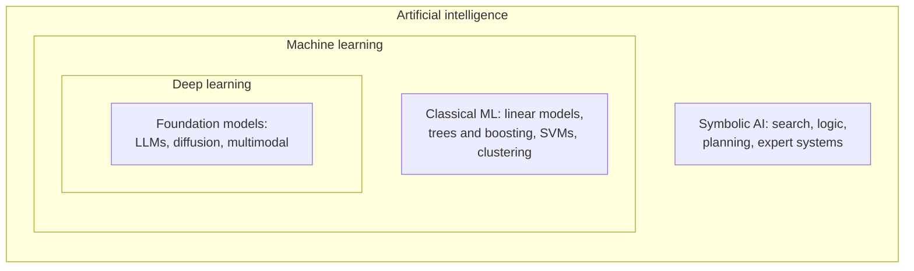

  <h1 style="color: white; margin: 0; font-size: 2.5rem;">AI &amp; Machine Learning</h1>
  
From the mathematics of learning to frontier research and ethics.

This is the technical reference for machine learning on this site. It covers the statistical foundations of learning, the classical algorithms that still dominate tabular data, the theory and architectures of deep learning, the objectives models are trained on, how pretrained models are adapted and aligned, reinforcement learning, generative models, and the research and governance questions raised by frontier systems. The pages assume comfort with linear algebra, calculus, and probability; new to the subject? Start with [AI Fundamentals (Simplified)](../ai-fundamentals-simple.html), which needs no math.

## What the Terms Mean

**Artificial intelligence** is the broad field of building systems that perform tasks associated with human intelligence: perception, language, planning, and decision-making. **Machine learning** is the subfield in which that behavior is learned from data rather than programmed by hand. **Deep learning** is machine learning with many-layered neural networks, and **foundation models** — large networks pretrained on broad data and adapted to many tasks, including large language models (LLMs) and image generators — are the dominant form of deep learning today.

Machine-learning problems are usually grouped by the kind of feedback the learner receives:

| Paradigm | Training signal | Typical tasks | Covered in |
|----------|-----------------|---------------|------------|
| Supervised | Labeled input–output pairs | Classification, regression, forecasting | [Core ML Algorithms](core-ml-algorithms.html), [Loss Functions](loss-functions.html) |
| Unsupervised | Unlabeled data only | Clustering, dimensionality reduction, density estimation | [Core ML Algorithms](core-ml-algorithms.html), [Generative Models](generative-models.html) |
| Self-supervised | Labels derived from the data itself (next token, masked patch, added noise) | LLM and diffusion pretraining, representation learning | [Loss Functions](loss-functions.html), [Generative Models](generative-models.html) |
| Reinforcement | Scalar reward from an environment or evaluator | Games, robotics, RLHF, reasoning-model training | [Reinforcement Learning](reinforcement-learning.html) |

Nearly all deployed systems are **narrow**: they perform well within the domain they were trained for. Modern foundation models are far more general than earlier systems — one model can write code, analyze images, and hold a conversation — but they remain unreliable outside their training distribution and on long, open-ended tasks. Whether and when systems will match humans across all cognitive work (*artificial general intelligence*, AGI) is contested; there is no agreed definition or test. The research and governance questions this raises are covered in [Frontier Research & Ethics](frontier-and-ethics.html).

## Pages in This Reference

| Page | Area | What it covers |
|------|------|----------------|
| [ML & Deep Learning Track](architectures.html) | Overview | Hub for the four core pages below, with guidance on how they fit together |
| [Machine Learning Foundations](ml-foundations.html) | Foundations | Statistical learning theory, bias–variance, optimization (SGD, Adam), kernels and SVMs, Gaussian processes, variational inference |
| [Core ML Algorithms](core-ml-algorithms.html) | Foundations | Linear and logistic regression, trees, random forests, gradient boosting, k-NN, clustering — the strongest baselines on tabular data |
| [Deep Learning Theory](deep-learning-theory.html) | Deep learning | Universal approximation, backpropagation, initialization and normalization, the neural tangent kernel, double descent, generalization |
| [Deep Learning Architectures](deep-learning-architectures.html) | Deep learning | MLPs, CNNs, RNNs and LSTMs, attention and the Transformer, vision transformers, and post-Transformer sequence models |
| [Loss Functions & Objectives](loss-functions.html) | Training | Regression, classification, contrastive, ranking, distillation, language-model, preference, and generative objectives |
| [Fine-Tuning & Transfer Learning](fine-tuning.html) | Training | Full and parameter-efficient fine-tuning (LoRA, QLoRA), instruction tuning, RLHF, DPO |
| [Reinforcement Learning](reinforcement-learning.html) | Training | MDPs, value and policy methods, deep RL (DQN, PPO), and RL for language models |
| [Generative Models](generative-models.html) | Generation | Diffusion and flow matching, GANs, VAEs, autoregressive models, discrete diffusion |
| [Frontier Research & Ethics](frontier-and-ethics.html) | Frontier | Scaling laws, reasoning models, interpretability, safety and alignment, fairness, privacy, regulation |

## Reading Order

The pages are self-contained, but each builds on the ones before it. The full path runs:

Shorter routes, depending on the goal:

- **Tabular data** (spreadsheets, databases): [ML Foundations](ml-foundations.html) → [Core ML Algorithms](core-ml-algorithms.html). Gradient-boosted trees remain the baseline to beat before reaching for a neural network.
- **Neural networks**: [Deep Learning Theory](deep-learning-theory.html) for why they work, [Deep Learning Architectures](deep-learning-architectures.html) for how they are built, [Loss Functions](loss-functions.html) for what they optimize.
- **Adapting a pretrained model**: [Fine-Tuning](fine-tuning.html), then [Loss Functions](loss-functions.html#language-model-and-preference-objectives) for the preference objectives.
- **Agents and reward-driven systems**: [Reinforcement Learning](reinforcement-learning.html).
- **Image, video, audio, or text generation**: [Generative Models](generative-models.html), then the hands-on [AI/ML guides](../../ai-ml/).
- **Scale, safety, and policy**: [Frontier Research & Ethics](frontier-and-ethics.html).

## Core Ideas

A handful of ideas recur on every page:

- **Learning is optimization.** Training minimizes an objective by gradient descent, $\theta_{t+1} = \theta_t - \eta\,\nabla_\theta\mathcal{L}$; the architecture determines what functions are reachable, and the loss determines which one is found.
- **The objective encodes assumptions.** Most losses are negative log-likelihoods under a noise model — MSE for Gaussian noise, cross-entropy for categorical labels — so choosing a loss is choosing what you believe about the data.
- **Generalization, not fit, is the goal.** Performance on held-out data is what matters. Overparameterized networks generalize far better than classical theory predicted, which is still only partly understood.
- **Self-supervision at scale.** Predicting the next token or the added noise turns unlabeled data into a training signal; pretraining on that signal, followed by fine-tuning and preference optimization, is how modern foundation models are built.
- **Scaling is predictable, with caveats.** Pretraining loss follows power laws in parameters, data, and compute, and since 2024 inference-time reasoning has become a second scaling axis. Downstream capabilities scale less smoothly than loss.
- **Capability and responsibility grow together.** Evaluation, interpretability, fairness, privacy, and security are engineering requirements, and increasingly legal ones.

## See Also

- [Artificial Intelligence Hub](../../artificial-intelligence/index.html) — index of every AI page on the site, with the current state of the field
- [AI Fundamentals (Simplified)](../ai-fundamentals-simple.html) — the no-math introduction
- [AI Deep Dive](../ai-lecture-2023.html) — transformers, LLM training and inference, retrieval, agents, and LLM security
- [AI/ML Guides](../../ai-ml/) — hands-on Stable Diffusion, FLUX, ComfyUI, LoRA training, and MLOps
- [AI Mathematics](../../advanced/ai-mathematics/) — theoretical foundations and proofs
- [Quantum Computing](../quantumcomputing.html) — quantum machine learning
- [AWS](../aws/) — cloud infrastructure for AI/ML workloads
