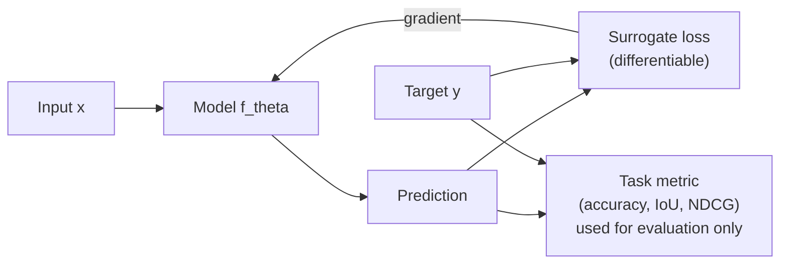
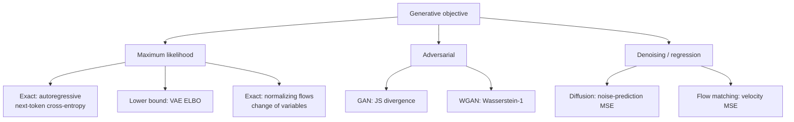

[AI & Machine Learning](./) › Loss Functions & Objectives

A **loss function** (or objective) is the scalar a model is trained to minimize. After the choice of architecture and data it is the most consequential design decision in a learning system: it defines what "good" means, determines the gradients that flow during backpropagation, and implicitly encodes assumptions about noise, label distribution, and the geometry of the output space. The same network trained with mean-squared error and with cross-entropy learns different things. This page covers the major families — regression, classification, metric and contrastive learning, ranking, knowledge distillation, language-model and preference objectives, and generative objectives — with the probabilistic reasoning behind each and guidance on choosing among them.

## Two Organizing Ideas

### Losses as Negative Log-Likelihoods

Most standard losses are not arbitrary distances: they are **negative log-likelihoods** under an assumed conditional distribution $p_\theta(y \mid x)$. Maximum-likelihood estimation minimizes

$$\mathcal{L}(\theta) = -\frac{1}{N}\sum_{i=1}^{N} \log p_\theta(y_i \mid x_i),$$

and each noise model yields a familiar loss:

| Assumed $p_\theta(y \mid x)$ | Resulting loss | Optimal prediction |
|------------------------------|----------------|--------------------|
| Gaussian, fixed variance | Mean squared error | Conditional mean |
| Laplace | Mean absolute error | Conditional median |
| Asymmetric Laplace | Quantile (pinball) loss | Conditional quantile |
| Bernoulli | Binary cross-entropy | Probability of the positive class |
| Categorical | Cross-entropy | Class-probability vector |
| Gaussian with predicted variance | Gaussian NLL, $\tfrac{1}{2}\log\sigma^2 + \tfrac{(y-\mu)^2}{2\sigma^2}$ | Mean and uncertainty |

Choosing a loss is choosing a noise model. MSE assumes symmetric, light-tailed errors; MAE assumes heavy tails and is therefore robust to outliers. The lens tells you *when* a loss is appropriate, not just how to compute it.

### Surrogate Loss vs. Task Metric

The quantity you care about — classification accuracy, intersection-over-union, NDCG, BLEU — is usually piecewise-constant in the parameters and has zero gradient almost everywhere. Training therefore minimizes a smooth **surrogate** (cross-entropy, hinge, Dice, pairwise logistic) that upper-bounds or correlates with the metric and provides usable gradients. A good surrogate is *calibrated* for the metric: minimizing it drives the metric toward its optimum. Keep the distinction in mind when training loss improves but the metric does not.



## Regression Losses

Regression predicts a continuous target; the loss determines how residuals — especially large ones — are penalized.

### Mean Squared Error (L2)

$$\mathcal{L}_{\text{MSE}} = \frac{1}{N}\sum_{i=1}^{N}\left(y_i - \hat{y}_i\right)^2$$

MSE is the negative log-likelihood of Gaussian noise with constant variance, and its minimizer is the conditional mean $\mathbb{E}[y \mid x]$. The gradient with respect to a prediction, $\partial \mathcal{L}/\partial \hat{y}_i = -\tfrac{2}{N}(y_i - \hat{y}_i)$, grows linearly with the residual, so the largest errors dominate the update. That makes MSE smooth, convex in the prediction, and well-behaved near the optimum — and highly sensitive to outliers, since a single mislabeled point with a large residual can drag the fit toward it.

### Mean Absolute Error (L1)

$$\mathcal{L}_{\text{MAE}} = \frac{1}{N}\sum_{i=1}^{N}\left|y_i - \hat{y}_i\right|$$

MAE is the negative log-likelihood of Laplace noise, and its minimizer is the conditional **median**. Its gradient has constant magnitude (the sign of the residual), so a distant outlier pulls no harder than a near miss — the source of its robustness. The costs are non-differentiability at zero (a subgradient is used) and a gradient that carries no information about how close the prediction is, which can slow late-stage convergence.

### Huber (Smooth L1)

Huber loss is quadratic for small residuals and linear for large ones. With threshold $\delta$ and residual $r = y - \hat{y}$:

$$\mathcal{L}_{\delta}(r) =
\begin{cases}
\tfrac{1}{2}\, r^2 & \text{if } |r| \le \delta, \\[4pt]
\delta\left(|r| - \tfrac{1}{2}\delta\right) & \text{if } |r| > \delta.
\end{cases}$$

Small $\delta$ behaves like MAE, large $\delta$ like MSE. *Smooth L1* is the same shape rescaled by $1/\delta$; with $\delta = 1$ the two coincide, and it is the standard bounding-box regression loss in detectors such as Faster R-CNN. Huber loss is also the usual choice for the temporal-difference error in deep Q-learning.

<div class="loss-plot" style="margin:1rem 0;text-align:center">
<svg viewBox="0 0 520 280" role="img" aria-labelledby="reg-title" style="max-width:520px;width:100%;height:auto;color:inherit" xmlns="http://www.w3.org/2000/svg">
<title id="reg-title">MSE, MAE and Huber loss as a function of the residual</title>
<g fill="none" stroke="currentColor" stroke-opacity="0.35" stroke-width="1"><line x1="50" y1="230" x2="410" y2="230"/><line x1="230" y1="30" x2="230" y2="230"/></g>
<text x="50" y="248" font-size="12" text-anchor="middle" fill="currentColor">-3</text>
<text x="110" y="248" font-size="12" text-anchor="middle" fill="currentColor">-2</text>
<text x="170" y="248" font-size="12" text-anchor="middle" fill="currentColor">-1</text>
<text x="230" y="248" font-size="12" text-anchor="middle" fill="currentColor">0</text>
<text x="290" y="248" font-size="12" text-anchor="middle" fill="currentColor">1</text>
<text x="350" y="248" font-size="12" text-anchor="middle" fill="currentColor">2</text>
<text x="410" y="248" font-size="12" text-anchor="middle" fill="currentColor">3</text>
<text x="222" y="174" font-size="12" text-anchor="end" fill="currentColor">1</text>
<text x="222" y="114" font-size="12" text-anchor="end" fill="currentColor">2</text>
<text x="222" y="54" font-size="12" text-anchor="end" fill="currentColor">3</text>
<text x="230" y="272" font-size="12" text-anchor="middle" fill="currentColor">residual r = y − ŷ</text>
<text x="236" y="26" font-size="12" fill="currentColor">loss</text>
<path d="M125.0,46.2 L128.0,56.6 L131.0,66.7 L134.0,76.4 L137.0,85.9 L140.0,95.0 L143.0,103.8 L146.0,112.4 L149.0,120.7 L152.0,128.6 L155.0,136.2 L158.0,143.6 L161.0,150.7 L164.0,157.4 L167.0,163.9 L170.0,170.0 L173.0,175.9 L176.0,181.4 L179.0,186.6 L182.0,191.6 L185.0,196.2 L188.0,200.6 L191.0,204.7 L194.0,208.4 L197.0,211.9 L200.0,215.0 L203.0,217.9 L206.0,220.4 L209.0,222.7 L212.0,224.6 L215.0,226.2 L218.0,227.6 L221.0,228.7 L224.0,229.4 L227.0,229.8 L230.0,230.0 L233.0,229.8 L236.0,229.4 L239.0,228.7 L242.0,227.6 L245.0,226.2 L248.0,224.6 L251.0,222.7 L254.0,220.4 L257.0,217.8 L260.0,215.0 L263.0,211.8 L266.0,208.4 L269.0,204.6 L272.0,200.6 L275.0,196.2 L278.0,191.6 L281.0,186.6 L284.0,181.4 L287.0,175.8 L290.0,170.0 L293.0,163.9 L296.0,157.4 L299.0,150.6 L302.0,143.6 L305.0,136.2 L308.0,128.6 L311.0,120.6 L314.0,112.4 L317.0,103.8 L320.0,95.0 L323.0,85.9 L326.0,76.4 L329.0,66.6 L332.0,56.6 L335.0,46.2" fill="none" stroke="currentColor" stroke-width="2.5"/>
<line x1="425" y1="60" x2="455" y2="60" stroke="currentColor" stroke-width="2.5"/>
<text x="460" y="64" font-size="12" fill="currentColor">MSE</text>
<path d="M50.0,50.0 L53.0,53.0 L56.0,56.0 L59.0,59.0 L62.0,62.0 L65.0,65.0 L68.0,68.0 L71.0,71.0 L74.0,74.0 L77.0,77.0 L80.0,80.0 L83.0,83.0 L86.0,86.0 L89.0,89.0 L92.0,92.0 L95.0,95.0 L98.0,98.0 L101.0,101.0 L104.0,104.0 L107.0,107.0 L110.0,110.0 L113.0,113.0 L116.0,116.0 L119.0,119.0 L122.0,122.0 L125.0,125.0 L128.0,128.0 L131.0,131.0 L134.0,134.0 L137.0,137.0 L140.0,140.0 L143.0,143.0 L146.0,146.0 L149.0,149.0 L152.0,152.0 L155.0,155.0 L158.0,158.0 L161.0,161.0 L164.0,164.0 L167.0,167.0 L170.0,170.0 L173.0,173.0 L176.0,176.0 L179.0,179.0 L182.0,182.0 L185.0,185.0 L188.0,188.0 L191.0,191.0 L194.0,194.0 L197.0,197.0 L200.0,200.0 L203.0,203.0 L206.0,206.0 L209.0,209.0 L212.0,212.0 L215.0,215.0 L218.0,218.0 L221.0,221.0 L224.0,224.0 L227.0,227.0 L230.0,230.0 L233.0,227.0 L236.0,224.0 L239.0,221.0 L242.0,218.0 L245.0,215.0 L248.0,212.0 L251.0,209.0 L254.0,206.0 L257.0,203.0 L260.0,200.0 L263.0,197.0 L266.0,194.0 L269.0,191.0 L272.0,188.0 L275.0,185.0 L278.0,182.0 L281.0,179.0 L284.0,176.0 L287.0,173.0 L290.0,170.0 L293.0,167.0 L296.0,164.0 L299.0,161.0 L302.0,158.0 L305.0,155.0 L308.0,152.0 L311.0,149.0 L314.0,146.0 L317.0,143.0 L320.0,140.0 L323.0,137.0 L326.0,134.0 L329.0,131.0 L332.0,128.0 L335.0,125.0 L338.0,122.0 L341.0,119.0 L344.0,116.0 L347.0,113.0 L350.0,110.0 L353.0,107.0 L356.0,104.0 L359.0,101.0 L362.0,98.0 L365.0,95.0 L368.0,92.0 L371.0,89.0 L374.0,86.0 L377.0,83.0 L380.0,80.0 L383.0,77.0 L386.0,74.0 L389.0,71.0 L392.0,68.0 L395.0,65.0 L398.0,62.0 L401.0,59.0 L404.0,56.0 L407.0,53.0 L410.0,50.0" fill="none" stroke="currentColor" stroke-width="2" stroke-dasharray="6 4"/>
<line x1="425" y1="82" x2="455" y2="82" stroke="currentColor" stroke-width="2" stroke-dasharray="6 4"/>
<text x="460" y="86" font-size="12" fill="currentColor">MAE</text>
<path d="M50.0,80.0 L53.0,83.0 L56.0,86.0 L59.0,89.0 L62.0,92.0 L65.0,95.0 L68.0,98.0 L71.0,101.0 L74.0,104.0 L77.0,107.0 L80.0,110.0 L83.0,113.0 L86.0,116.0 L89.0,119.0 L92.0,122.0 L95.0,125.0 L98.0,128.0 L101.0,131.0 L104.0,134.0 L107.0,137.0 L110.0,140.0 L113.0,143.0 L116.0,146.0 L119.0,149.0 L122.0,152.0 L125.0,155.0 L128.0,158.0 L131.0,161.0 L134.0,164.0 L137.0,167.0 L140.0,170.0 L143.0,173.0 L146.0,176.0 L149.0,179.0 L152.0,182.0 L155.0,185.0 L158.0,188.0 L161.0,191.0 L164.0,194.0 L167.0,197.0 L170.0,200.0 L173.0,202.9 L176.0,205.7 L179.0,208.3 L182.0,210.8 L185.0,213.1 L188.0,215.3 L191.0,217.3 L194.0,219.2 L197.0,220.9 L200.0,222.5 L203.0,223.9 L206.0,225.2 L209.0,226.3 L212.0,227.3 L215.0,228.1 L218.0,228.8 L221.0,229.3 L224.0,229.7 L227.0,229.9 L230.0,230.0 L233.0,229.9 L236.0,229.7 L239.0,229.3 L242.0,228.8 L245.0,228.1 L248.0,227.3 L251.0,226.3 L254.0,225.2 L257.0,223.9 L260.0,222.5 L263.0,220.9 L266.0,219.2 L269.0,217.3 L272.0,215.3 L275.0,213.1 L278.0,210.8 L281.0,208.3 L284.0,205.7 L287.0,202.9 L290.0,200.0 L293.0,197.0 L296.0,194.0 L299.0,191.0 L302.0,188.0 L305.0,185.0 L308.0,182.0 L311.0,179.0 L314.0,176.0 L317.0,173.0 L320.0,170.0 L323.0,167.0 L326.0,164.0 L329.0,161.0 L332.0,158.0 L335.0,155.0 L338.0,152.0 L341.0,149.0 L344.0,146.0 L347.0,143.0 L350.0,140.0 L353.0,137.0 L356.0,134.0 L359.0,131.0 L362.0,128.0 L365.0,125.0 L368.0,122.0 L371.0,119.0 L374.0,116.0 L377.0,113.0 L380.0,110.0 L383.0,107.0 L386.0,104.0 L389.0,101.0 L392.0,98.0 L395.0,95.0 L398.0,92.0 L401.0,89.0 L404.0,86.0 L407.0,83.0 L410.0,80.0" fill="none" stroke="currentColor" stroke-width="2.5" stroke-dasharray="2 3"/>
<line x1="425" y1="104" x2="455" y2="104" stroke="currentColor" stroke-width="2.5" stroke-dasharray="2 3"/>
<text x="460" y="108" font-size="12" fill="currentColor">Huber (δ=1)</text>
</svg>
</div>

*MSE grows quadratically and is dominated by large residuals; MAE grows linearly with a kink at zero; Huber is quadratic inside $\lvert r\rvert \le \delta$ and linear outside.*

### Log-Cosh and Quantile Loss

- **Log-cosh**, $\sum_i \log\cosh(\hat{y}_i - y_i)$, approximates $r^2/2$ for small residuals and $\lvert r\rvert - \log 2$ for large ones, and is twice differentiable everywhere — a thresholdless alternative to Huber, useful for second-order methods such as gradient boosting.
- **Quantile (pinball) loss** predicts a chosen quantile $\tau \in (0,1)$ and is the basis of prediction intervals and probabilistic forecasting:

$$\mathcal{L}_{\tau}(r) = \max\left(\tau\, r,\ (\tau - 1)\, r\right), \qquad r = y - \hat{y}.$$

With $\tau = 0.5$ it is half the MAE; with $\tau = 0.9$ under-prediction costs nine times as much as over-prediction, so the model learns an upper bound that the target falls below about 90% of the time. Training several quantiles jointly (e.g. 0.1, 0.5, 0.9) gives an interval forecast.

| Loss | Outlier sensitivity | Smooth at 0 | Estimates |
|------|--------------------|-------------|-----------|
| MSE (L2) | High | Yes | Conditional mean |
| MAE (L1) | Low | No | Conditional median |
| Huber / smooth L1 | Tunable via $\delta$ | Yes | Robustified mean |
| Log-cosh | Moderate | Yes (twice) | Robustified mean |
| Quantile | Asymmetric | No | Chosen quantile $\tau$ |
| Gaussian NLL | Adaptive (learned variance) | Yes | Mean and variance |

## Classification Losses

### Cross-Entropy

For $K$ classes the network outputs logits $\mathbf{z}$, converted by the **softmax** into probabilities $\hat{p}_k = e^{z_k}/\sum_j e^{z_j}$. With a one-hot target and true class $c$, the categorical cross-entropy is

$$\mathcal{L}_{\text{CE}} = -\sum_{k=1}^{K} y_k \log \hat{p}_k = -\log \hat{p}_{c}.$$

The binary case, with sigmoid output $\hat{p}$ and label $y \in \{0,1\}$, is

$$\mathcal{L}_{\text{BCE}} = -\left[\, y \log \hat{p} + (1-y)\log(1-\hat{p})\,\right].$$

Multi-label problems (several classes can be present at once) apply an independent BCE per class rather than a softmax.

Cross-entropy dominates classification because of its gradient. For softmax with cross-entropy, the gradient with respect to the logits is simply

$$\frac{\partial \mathcal{L}_{\text{CE}}}{\partial z_k} = \hat{p}_k - y_k,$$

"predicted minus true." It does not saturate when the model is confidently wrong, whereas softmax followed by MSE produces vanishing gradients in exactly that regime. Minimizing cross-entropy is equivalent to minimizing $D_{\mathrm{KL}}(p_{\text{data}} \,\|\, \hat{p})$, and it is a *proper scoring rule*: it is minimized only by reporting the true probabilities, which is why cross-entropy-trained models can be calibrated.

### Label Smoothing

One-hot targets push logits toward infinity and produce overconfident models. **Label smoothing** (Szegedy et al., 2016) mixes the target with a uniform distribution:

$$y_k^{\text{LS}} = (1-\epsilon)\, y_k + \frac{\epsilon}{K}.$$

This bounds the logit gap the model tries to reach, acts as a regularizer, and typically improves top-1 accuracy; $\epsilon \approx 0.1$ is standard in image classifiers and was used in the original Transformer. Its effect on calibration is mixed — it reduces overconfidence but can harm post-hoc temperature scaling — and it degrades the teacher signal when the model is later used for knowledge distillation (Müller et al., 2019).

### Focal Loss

In dense object detection the overwhelming majority of candidate boxes are easy background; even with small individual losses their number swamps the gradient. **Focal loss** (Lin et al., 2017) down-weights well-classified examples. With $p_t$ the predicted probability of the true class:

$$\mathcal{L}_{\text{focal}} = -\alpha_t\,(1 - p_t)^{\gamma}\,\log p_t.$$

With $\gamma = 2$, an easy example at $p_t = 0.99$ has its loss scaled by $10^{-4}$, while a hard example at $p_t = 0.3$ keeps about half of it. $\gamma = 0$ recovers ($\alpha$-weighted) cross-entropy. Focal loss is what allowed the single-stage RetinaNet to match two-stage detectors, and it is widely used for imbalanced dense prediction.

<div class="loss-plot" style="margin:1rem 0;text-align:center">
<svg viewBox="0 0 520 280" role="img" aria-labelledby="focal-title" style="max-width:520px;width:100%;height:auto;color:inherit" xmlns="http://www.w3.org/2000/svg">
<title id="focal-title">Focal loss versus cross-entropy as a function of the true-class probability</title>
<g fill="none" stroke="currentColor" stroke-opacity="0.35" stroke-width="1"><line x1="50" y1="230" x2="410" y2="230"/><line x1="50" y1="30" x2="50" y2="230"/></g>
<text x="50" y="248" font-size="12" text-anchor="middle" fill="currentColor">0</text>
<text x="122" y="248" font-size="12" text-anchor="middle" fill="currentColor">0.2</text>
<text x="194" y="248" font-size="12" text-anchor="middle" fill="currentColor">0.4</text>
<text x="266" y="248" font-size="12" text-anchor="middle" fill="currentColor">0.6</text>
<text x="338" y="248" font-size="12" text-anchor="middle" fill="currentColor">0.8</text>
<text x="410" y="248" font-size="12" text-anchor="middle" fill="currentColor">1</text>
<text x="44" y="184" font-size="12" text-anchor="end" fill="currentColor">1</text>
<text x="44" y="134" font-size="12" text-anchor="end" fill="currentColor">2</text>
<text x="44" y="84" font-size="12" text-anchor="end" fill="currentColor">3</text>
<text x="44" y="34" font-size="12" text-anchor="end" fill="currentColor">4</text>
<text x="230" y="272" font-size="12" text-anchor="middle" fill="currentColor">probability of the true class, p_t</text>
<text x="56" y="26" font-size="12" fill="currentColor">loss</text>
<path d="M57.2,34.4 L60.8,54.7 L64.4,69.1 L68.0,80.2 L71.6,89.3 L75.2,97.0 L78.8,103.7 L82.4,109.6 L86.0,114.9 L89.6,119.6 L93.2,124.0 L96.8,128.0 L100.4,131.7 L104.0,135.1 L107.6,138.4 L111.2,141.4 L114.8,144.3 L118.4,147.0 L122.0,149.5 L125.6,152.0 L129.2,154.3 L132.8,156.5 L136.4,158.6 L140.0,160.7 L143.6,162.6 L147.2,164.5 L150.8,166.4 L154.4,168.1 L158.0,169.8 L161.6,171.4 L165.2,173.0 L168.8,174.6 L172.4,176.1 L176.0,177.5 L179.6,178.9 L183.2,180.3 L186.8,181.6 L190.4,182.9 L194.0,184.2 L197.6,185.4 L201.2,186.6 L204.8,187.8 L208.4,189.0 L212.0,190.1 L215.6,191.2 L219.2,192.2 L222.8,193.3 L226.4,194.3 L230.0,195.3 L233.6,196.3 L237.2,197.3 L240.8,198.3 L244.4,199.2 L248.0,200.1 L251.6,201.0 L255.2,201.9 L258.8,202.8 L262.4,203.6 L266.0,204.5 L269.6,205.3 L273.2,206.1 L276.8,206.9 L280.4,207.7 L284.0,208.5 L287.6,209.2 L291.2,210.0 L294.8,210.7 L298.4,211.4 L302.0,212.2 L305.6,212.9 L309.2,213.6 L312.8,214.3 L316.4,214.9 L320.0,215.6 L323.6,216.3 L327.2,216.9 L330.8,217.6 L334.4,218.2 L338.0,218.8 L341.6,219.5 L345.2,220.1 L348.8,220.7 L352.4,221.3 L356.0,221.9 L359.6,222.5 L363.2,223.0 L366.8,223.6 L370.4,224.2 L374.0,224.7 L377.6,225.3 L381.2,225.8 L384.8,226.4 L388.4,226.9 L392.0,227.4 L395.6,228.0 L399.2,228.5 L402.8,229.0 L406.4,229.5" fill="none" stroke="currentColor" stroke-width="2.2"/>
<line x1="300" y1="60" x2="330" y2="60" stroke="currentColor" stroke-width="2.2"/>
<text x="336" y="64" font-size="12" fill="currentColor">γ = 0 (cross-entropy)</text>
<path d="M57.2,36.4 L60.8,57.3 L64.4,72.3 L68.0,84.0 L71.6,93.6 L75.2,101.8 L78.8,108.9 L82.4,115.1 L86.0,120.8 L89.6,125.9 L93.2,130.6 L96.8,134.9 L100.4,138.8 L104.0,142.5 L107.6,146.0 L111.2,149.3 L114.8,152.4 L118.4,155.3 L122.0,158.0 L125.6,160.6 L129.2,163.1 L132.8,165.5 L136.4,167.8 L140.0,170.0 L143.6,172.1 L147.2,174.1 L150.8,176.0 L154.4,177.8 L158.0,179.6 L161.6,181.4 L165.2,183.0 L168.8,184.6 L172.4,186.2 L176.0,187.7 L179.6,189.1 L183.2,190.5 L186.8,191.9 L190.4,193.2 L194.0,194.5 L197.6,195.8 L201.2,197.0 L204.8,198.1 L208.4,199.3 L212.0,200.4 L215.6,201.5 L219.2,202.5 L222.8,203.5 L226.4,204.5 L230.0,205.5 L233.6,206.4 L237.2,207.3 L240.8,208.2 L244.4,209.1 L248.0,209.9 L251.6,210.8 L255.2,211.6 L258.8,212.3 L262.4,213.1 L266.0,213.8 L269.6,214.6 L273.2,215.3 L276.8,215.9 L280.4,216.6 L284.0,217.3 L287.6,217.9 L291.2,218.5 L294.8,219.1 L298.4,219.7 L302.0,220.2 L305.6,220.8 L309.2,221.3 L312.8,221.8 L316.4,222.3 L320.0,222.8 L323.6,223.3 L327.2,223.7 L330.8,224.2 L334.4,224.6 L338.0,225.0 L341.6,225.4 L345.2,225.8 L348.8,226.2 L352.4,226.5 L356.0,226.9 L359.6,227.2 L363.2,227.5 L366.8,227.8 L370.4,228.1 L374.0,228.3 L377.6,228.6 L381.2,228.8 L384.8,229.0 L388.4,229.2 L392.0,229.4 L395.6,229.6 L399.2,229.7 L402.8,229.9 L406.4,229.9" fill="none" stroke="currentColor" stroke-width="2.2" stroke-dasharray="8 4"/>
<line x1="300" y1="82" x2="330" y2="82" stroke="currentColor" stroke-width="2.2" stroke-dasharray="8 4"/>
<text x="336" y="86" font-size="12" fill="currentColor">γ = 0.5</text>
<path d="M57.2,42.1 L60.8,65.0 L64.4,81.7 L68.0,94.8 L71.6,105.7 L75.2,115.0 L78.8,123.1 L82.4,130.3 L86.0,136.7 L89.6,142.6 L93.2,147.9 L96.8,152.8 L100.4,157.3 L104.0,161.5 L107.6,165.3 L111.2,169.0 L114.8,172.3 L118.4,175.5 L122.0,178.5 L125.6,181.3 L129.2,183.9 L132.8,186.4 L136.4,188.8 L140.0,191.0 L143.6,193.1 L147.2,195.1 L150.8,197.0 L154.4,198.8 L158.0,200.5 L161.6,202.1 L165.2,203.7 L168.8,205.1 L172.4,206.5 L176.0,207.8 L179.6,209.1 L183.2,210.3 L186.8,211.4 L190.4,212.5 L194.0,213.5 L197.6,214.5 L201.2,215.4 L204.8,216.3 L208.4,217.1 L212.0,217.9 L215.6,218.7 L219.2,219.4 L222.8,220.1 L226.4,220.7 L230.0,221.3 L233.6,221.9 L237.2,222.5 L240.8,223.0 L244.4,223.5 L248.0,223.9 L251.6,224.4 L255.2,224.8 L258.8,225.2 L262.4,225.6 L266.0,225.9 L269.6,226.2 L273.2,226.5 L276.8,226.8 L280.4,227.1 L284.0,227.4 L287.6,227.6 L291.2,227.8 L294.8,228.0 L298.4,228.2 L302.0,228.4 L305.6,228.6 L309.2,228.7 L312.8,228.9 L316.4,229.0 L320.0,229.1 L323.6,229.2 L327.2,229.3 L330.8,229.4 L334.4,229.5 L338.0,229.6 L341.6,229.6 L345.2,229.7 L348.8,229.7 L352.4,229.8 L356.0,229.8 L359.6,229.9 L363.2,229.9 L366.8,229.9 L370.4,229.9 L374.0,229.9 L377.6,230.0 L381.2,230.0 L384.8,230.0 L388.4,230.0 L392.0,230.0 L395.6,230.0 L399.2,230.0 L402.8,230.0 L406.4,230.0" fill="none" stroke="currentColor" stroke-width="2.2" stroke-dasharray="4 3"/>
<line x1="300" y1="104" x2="330" y2="104" stroke="currentColor" stroke-width="2.2" stroke-dasharray="4 3"/>
<text x="336" y="108" font-size="12" fill="currentColor">γ = 2</text>
<path d="M57.2,53.2 L60.8,79.4 L64.4,98.8 L68.0,114.1 L71.6,126.8 L75.2,137.5 L78.8,146.8 L82.4,154.9 L86.0,162.0 L89.6,168.4 L93.2,174.1 L96.8,179.2 L100.4,183.8 L104.0,187.9 L107.6,191.7 L111.2,195.1 L114.8,198.2 L118.4,201.0 L122.0,203.6 L125.6,206.0 L129.2,208.1 L132.8,210.1 L136.4,211.9 L140.0,213.6 L143.6,215.1 L147.2,216.4 L150.8,217.7 L154.4,218.8 L158.0,219.9 L161.6,220.8 L165.2,221.7 L168.8,222.5 L172.4,223.2 L176.0,223.9 L179.6,224.5 L183.2,225.1 L186.8,225.6 L190.4,226.0 L194.0,226.4 L197.6,226.8 L201.2,227.2 L204.8,227.5 L208.4,227.7 L212.0,228.0 L215.6,228.2 L219.2,228.4 L222.8,228.6 L226.4,228.8 L230.0,228.9 L233.6,229.0 L237.2,229.2 L240.8,229.3 L244.4,229.4 L248.0,229.4 L251.6,229.5 L255.2,229.6 L258.8,229.6 L262.4,229.7 L266.0,229.7 L269.6,229.8 L273.2,229.8 L276.8,229.8 L280.4,229.9 L284.0,229.9 L287.6,229.9 L291.2,229.9 L294.8,229.9 L298.4,229.9 L302.0,230.0 L305.6,230.0 L309.2,230.0 L312.8,230.0 L316.4,230.0 L320.0,230.0 L323.6,230.0 L327.2,230.0 L330.8,230.0 L334.4,230.0 L338.0,230.0 L341.6,230.0 L345.2,230.0 L348.8,230.0 L352.4,230.0 L356.0,230.0 L359.6,230.0 L363.2,230.0 L366.8,230.0 L370.4,230.0 L374.0,230.0 L377.6,230.0 L381.2,230.0 L384.8,230.0 L388.4,230.0 L392.0,230.0 L395.6,230.0 L399.2,230.0 L402.8,230.0 L406.4,230.0" fill="none" stroke="currentColor" stroke-width="2.2" stroke-dasharray="1.5 3"/>
<line x1="300" y1="126" x2="330" y2="126" stroke="currentColor" stroke-width="2.2" stroke-dasharray="1.5 3"/>
<text x="336" y="130" font-size="12" fill="currentColor">γ = 5</text>
</svg>
</div>

*Focal loss for several values of $\gamma$. Larger $\gamma$ suppresses the loss of confidently correct examples (right side) while leaving hard examples (left side) nearly untouched.*

### Hinge Loss

The hinge loss is the objective of support vector machines. For $y \in \{-1, +1\}$ and raw score $s$:

$$\mathcal{L}_{\text{hinge}} = \max\left(0,\ 1 - y\,s\right).$$

It is zero once a point is on the correct side with margin at least 1 and grows linearly inside the margin, so it ignores points that are already confidently correct. That yields a sparse set of support vectors and a max-margin boundary, but no calibrated probabilities. Its squared and multi-class variants appear occasionally in deep networks, and the hinge form survives in GAN discriminator losses.

### Segmentation Overlap Losses

Per-pixel cross-entropy on a segmentation mask is dominated by the majority (background) class. The **Dice loss** optimizes a soft version of the Dice coefficient, the overlap between predicted probabilities $p_i$ and ground truth $g_i$:

$$\mathcal{L}_{\text{Dice}} = 1 - \frac{2\sum_i p_i g_i + s}{\sum_i p_i + \sum_i g_i + s},$$

with a small smoothing constant $s$. Because it is a ratio over the whole region it is insensitive to class imbalance; the **soft Jaccard (IoU)** and **Lovász-softmax** losses are related surrogates. In medical imaging the common default is Dice plus cross-entropy, which combines Dice's imbalance robustness with cross-entropy's smooth per-pixel gradients.

## Metric Learning: Contrastive, Triplet, and InfoNCE

Metric-learning losses train an **embedding space** in which similar items are close and dissimilar items far apart. They act on relationships between embeddings rather than absolute predictions, and they underpin face recognition, retrieval, and self-supervised pretraining.

### Contrastive (Pairwise) Loss

For a pair of embeddings with label $Y$ (1 = similar, 0 = dissimilar) and distance $D = \lVert z_i - z_j \rVert_2$:

$$\mathcal{L}_{\text{contrastive}} = Y\, D^2 + (1 - Y)\,\max\left(0,\ m - D\right)^2.$$

Similar pairs are pulled together; dissimilar pairs are pushed apart only until they exceed the margin $m$, after which they contribute no gradient.

### Triplet Loss

For an **anchor** $a$, **positive** $p$, and **negative** $n$, triplet loss requires the anchor to be closer to the positive than to the negative by a margin $m$:

$$\mathcal{L}_{\text{triplet}} = \max\left(0,\ \lVert z_a - z_p \rVert^2 - \lVert z_a - z_n \rVert^2 + m\right).$$

Because it constrains relative rather than absolute distances it is more flexible than the pairwise loss, and it was central to FaceNet (2015). Its practical difficulty is **mining**: most random triplets already satisfy the margin and yield zero gradient, so training must select hard or semi-hard negatives.

### InfoNCE

**InfoNCE** (van den Oord et al., 2018) generalizes the triplet idea to many negatives and frames metric learning as classification: identify the one positive among a set of candidates. With cosine similarity and temperature $\tau$:

$$\mathcal{L}_{\text{InfoNCE}} = -\log \frac{\exp\left(\mathrm{sim}(z, z^{+})/\tau\right)}{\exp\left(\mathrm{sim}(z, z^{+})/\tau\right) + \sum_{k}\exp\left(\mathrm{sim}(z, z^{-}_k)/\tau\right)}.$$

It is a cross-entropy over similarities, and minimizing it maximizes a lower bound on the mutual information between the two views; the bound is at most $\log(1 + K)$ for $K$ negatives, which is one reason more negatives help (MoCo's momentum queue, CLIP's batches of tens of thousands). A small $\tau$ sharpens the distribution and concentrates the gradient on the hardest negatives. SimCLR, MoCo, and CLIP all use this loss; CLIP applies it symmetrically in both image-to-text and text-to-image directions.

**Sigmoid contrastive loss.** SigLIP (Zhai et al., 2023) replaces the batch-wide softmax with an independent binary classification for every image–text pair — matching pairs are positives, all others negatives — using a learned temperature and bias. Removing the global normalization makes the loss cheaper to distribute across devices and performs well at smaller batch sizes; SigLIP-family encoders are widely used as the vision tower in open multimodal models.

## Ranking Losses

Search, recommendation, and retrieval care about order, not isolated scores. Ranking losses act on pairs or whole lists.

- **Pairwise (RankNet).** For items $i$ ranked above $j$ with scores $s_i, s_j$, model $P(i \succ j) = \sigma(s_i - s_j)$ and minimize its cross-entropy, $\log\left(1 + \exp(-(s_i - s_j))\right)$. The **margin ranking loss** $\max(0,\ m - (s_i - s_j))$ enforces a fixed gap instead.
- **Metric-aware (LambdaRank, LambdaMART).** Pairwise losses treat all misordered pairs equally, but NDCG and MAP weight the top of the list most. LambdaRank scales each pair's gradient by the change in NDCG that swapping the pair would cause, optimizing the non-differentiable metric through a weighted pairwise surrogate. LambdaMART — the same idea with gradient-boosted trees — remains a strong learning-to-rank baseline.
- **Listwise (ListNet, ListMLE, softmax cross-entropy).** Define a distribution over items or permutations and minimize cross-entropy against the ideal ordering. The *sampled softmax* over one positive and many negatives — structurally identical to InfoNCE — is the standard objective for two-tower retrieval models and dense passage retrieval.

## Knowledge Distillation

Distillation (Hinton, Vinyals & Dean, 2015) trains a small **student** to match a large **teacher**'s output distribution rather than only the hard labels. Both logits are softened with a temperature $T$, and the student minimizes a mix of the ordinary loss and a KL term:

$$\mathcal{L}_{\text{KD}} = (1-\lambda)\,\mathcal{L}_{\text{CE}}\left(y,\ \sigma(\mathbf{z}_s)\right) + \lambda\, T^2\, D_{\mathrm{KL}}\left(\sigma(\mathbf{z}_t / T)\ \|\ \sigma(\mathbf{z}_s / T)\right),$$

where $\sigma$ is the softmax. The softened teacher distribution carries "dark knowledge" — which wrong classes are nearly right — and the $T^2$ factor keeps gradient magnitudes comparable as $T$ changes. For language models the same idea appears as token-level KL to the teacher's next-token distribution, or as *sequence-level* distillation (fine-tuning on teacher-generated text). Using the reverse KL $D_{\mathrm{KL}}(p_s \,\|\, p_t)$, evaluated on the student's own samples, is mode-seeking and often works better for generative students. See [Model Compression](../../ai-ml/model-compression.html) for practice.

## Language-Model and Preference Objectives

### Next-Token Cross-Entropy

Pretraining an autoregressive language model minimizes the cross-entropy of each token given its prefix, averaged over all positions:

$$\mathcal{L}_{\text{LM}} = -\frac{1}{T}\sum_{t=1}^{T} \log p_\theta(x_t \mid x_{<t}).$$

Its exponential, $\mathrm{PPL} = \exp(\mathcal{L}_{\text{LM}})$, is the **perplexity**. This single objective is what [scaling laws](frontier-and-ethics.html) describe. Common additions at scale are a small **z-loss**, $\lambda\,(\log Z)^2$ on the softmax normalizer $Z$ (used in PaLM with $\lambda = 10^{-4}$), which keeps logits from drifting and stabilizes low-precision training, and **load-balancing** auxiliary losses that keep mixture-of-experts routers from collapsing onto a few experts. During supervised fine-tuning the loss is usually masked so only the response tokens, not the prompt, contribute.

### Preference Objectives

Post-training aligns a model with human or AI preferences over pairs of responses $(y_w, y_l)$ to a prompt $x$. Most methods start from the **Bradley–Terry** model of pairwise preference:

$$\mathcal{L}_{\text{RM}} = -\log \sigma\left(r_\phi(x, y_w) - r_\phi(x, y_l)\right),$$

which trains a reward model $r_\phi$ for use with RL (PPO in classic RLHF). **Direct Preference Optimization** (Rafailov et al., 2023) substitutes the closed-form optimal policy into that loss, eliminating the separate reward model:

$$\mathcal{L}_{\text{DPO}} = -\log \sigma\left(\beta \log \frac{\pi_\theta(y_w\mid x)}{\pi_{\text{ref}}(y_w\mid x)} - \beta \log \frac{\pi_\theta(y_l\mid x)}{\pi_{\text{ref}}(y_l\mid x)}\right).$$

Structurally it is a binary cross-entropy on a margin between log-probability ratios, so the pairwise-ranking intuition above applies directly. For reasoning models trained with **verifiable rewards** (math answers, unit tests), policy-gradient objectives such as PPO and GRPO — which normalizes each sample's reward against a group of samples for the same prompt, avoiding a learned value function — have become standard. Details and variants (IPO, KTO, ORPO) are in [Fine-Tuning & Transfer Learning](fine-tuning.html) and [Reinforcement Learning](reinforcement-learning.html).

## Generative Objectives

A generative model learns a distribution rather than a mapping, and each family is defined as much by its objective as by its architecture. The architectures themselves are covered in [Generative Models](generative-models.html).



### Maximum Likelihood and the ELBO

The most direct objective is $\max_\theta \sum_i \log p_\theta(x_i)$. Autoregressive models optimize it exactly through the chain rule and next-token cross-entropy. For **latent-variable models** such as VAEs, $p_\theta(x) = \int p_\theta(x \mid z)\,p(z)\,dz$ is intractable, so an approximate posterior $q_\phi(z \mid x)$ is introduced and the **evidence lower bound** is maximized:

$$\mathcal{L}_{\text{ELBO}} = \mathbb{E}_{q_\phi(z \mid x)}\left[\log p_\theta(x \mid z)\right] - D_{\mathrm{KL}}\left(q_\phi(z \mid x)\ \|\ p(z)\right).$$

The first term rewards reconstruction; the second pulls the approximate posterior toward the prior. The gap to the true log-likelihood is exactly $D_{\mathrm{KL}}\left(q_\phi(z \mid x) \,\|\, p_\theta(z \mid x)\right)$. Weighting the KL term by $\beta$ trades reconstruction fidelity for a more regular, sometimes more disentangled latent space; the VAEs inside latent diffusion models use a very small $\beta$ plus perceptual and adversarial terms.

### Adversarial Objectives

GANs replace the likelihood with a learned discriminator:

$$\min_G \max_D\ \mathbb{E}_{x \sim p_{\text{data}}}\left[\log D(x)\right] + \mathbb{E}_{z \sim p_z}\left[\log\left(1 - D(G(z))\right)\right].$$

At the optimal discriminator the generator minimizes the **Jensen–Shannon divergence** between the data and model distributions. When the two barely overlap, that divergence saturates and generator gradients vanish; in practice the generator uses the *non-saturating* loss $-\log D(G(z))$ instead. The **Wasserstein GAN** uses the earth-mover distance, which gives useful gradients even for disjoint supports:

$$\mathcal{L}_{\text{WGAN}} = \mathbb{E}_{x \sim p_{\text{data}}}\left[D(x)\right] - \mathbb{E}_{z \sim p_z}\left[D(G(z))\right],$$

with the critic $D$ constrained to be 1-Lipschitz, via a gradient penalty (WGAN-GP) or spectral normalization. The *hinge* adversarial loss is another common, stable choice. Changes to the objective, not the architecture, did most to make GAN training reliable.

### Diffusion and Score Matching

Diffusion models corrupt data with a fixed Gaussian noising process and learn to reverse it. With $x_t = \sqrt{\bar\alpha_t}\,x_0 + \sqrt{1 - \bar\alpha_t}\,\varepsilon$, the variational bound reduces (after reweighting) to a regression on the added noise:

$$\mathcal{L}_{\text{simple}} = \mathbb{E}_{t,\,x_0,\,\varepsilon}\left[\left\lVert \varepsilon - \varepsilon_\theta(x_t, t)\right\rVert^2\right].$$

It is mean-squared error in disguise, which is why diffusion training is far more stable than adversarial training. Predicting the noise is equivalent, up to a scale factor $-1/\sqrt{1-\bar\alpha_t}$, to estimating the **score** $\nabla_x \log p_t(x)$ by denoising score matching. The choice of prediction target ($\varepsilon$, $x_0$, or velocity $v$) and of per-timestep weighting — e.g. *min-SNR* weighting, which caps the weight of low-noise steps — measurably affects convergence speed and sample quality.

### Flow Matching

Flow matching and rectified flow regress a velocity field along a path from data to noise. For the straight path $x_t = (1-t)\,x_0 + t\,\varepsilon$:

$$\mathcal{L}_{\text{FM}} = \mathbb{E}_{t,\,x_0,\,\varepsilon}\left[\left\lVert v_\theta(x_t, t) - (\varepsilon - x_0)\right\rVert^2\right].$$

It is again a simple MSE, but the straighter trajectories need fewer integration steps at sampling time. This objective, with a timestep distribution concentrated on intermediate noise levels, trains Stable Diffusion 3, FLUX, and most image and video models released since 2024.

### Masked and Contrastive Pretraining

Self-supervised pretraining manufactures labels from unlabeled data:

- **Masked modeling** hides part of the input and reconstructs it — cross-entropy over masked tokens (BERT) or MSE over masked image patches (MAE). *Joint-embedding predictive* methods (I-JEPA, V-JEPA) predict the representation of the masked region instead of its pixels.
- **Contrastive pretraining** (SimCLR, MoCo, CLIP, SigLIP) uses InfoNCE or its sigmoid variant to align views or modalities.
- **Self-distillation** (BYOL, DINO/DINOv2) trains a student to match a slowly updated teacher on different augmentations, with no explicit negatives; collapse is avoided by the momentum teacher, centering, and sharpening.

## Practical Considerations

- **Numerical stability.** Never apply softmax or sigmoid and then take a separate log. Use fused ops — `nn.CrossEntropyLoss` (which takes raw logits) and `nn.BCEWithLogitsLoss` — which use the log-sum-exp trick to avoid overflow and $\log 0$. Compute losses in float32 even under mixed-precision training.
- **Class imbalance.** Options include inverse-frequency class weights, resampling, focal loss, logit adjustment (subtracting $\tau \log$ of the class prior from the logits), and, for segmentation, Dice or IoU losses.
- **Label noise.** Symmetric or bounded losses (MAE-like, generalized cross-entropy) and label smoothing reduce the damage of mislabeled examples; cross-entropy fits noisy labels readily.
- **Reduction.** Summing versus averaging per-example losses interacts with the learning rate and batch size. Mean reduction keeps gradient scale roughly batch-size-independent; for sequence models, averaging per token rather than per sequence changes the effective weight of long examples.
- **Composite losses.** Real systems sum several terms — reconstruction, perceptual, adversarial, auxiliary, regularization — each weighted. The relative weights are hyperparameters and often matter more than the form of any single term; normalize each term's scale and monitor them separately.
- **Regularization is part of the objective.** Weight decay (applied decoupled from the gradient in AdamW) and other penalties change the optimum. When training loss and validation behavior diverge, remember the true objective includes these terms.

```python
import torch
import torch.nn as nn
import torch.nn.functional as F
from torchvision.ops import sigmoid_focal_loss

# Regression: robust to outliers, smooth near zero.
huber = nn.HuberLoss(delta=1.0)

# Multi-class: takes raw logits; fused log-softmax; optional label smoothing.
ce = nn.CrossEntropyLoss(label_smoothing=0.1)

# Binary / multi-label: fused sigmoid + BCE; pos_weight up-weights rare positives.
bce = nn.BCEWithLogitsLoss(pos_weight=torch.tensor([4.0]))

# Dense detection with extreme imbalance.
def focal(logits, targets):
    return sigmoid_focal_loss(logits, targets, alpha=0.25, gamma=2.0, reduction="mean")

# Contrastive (CLIP-style, symmetric InfoNCE); positives on the diagonal.
def clip_loss(img_emb, txt_emb, temperature=0.07):
    img = F.normalize(img_emb, dim=-1)
    txt = F.normalize(txt_emb, dim=-1)
    logits = img @ txt.T / temperature
    labels = torch.arange(logits.size(0), device=logits.device)
    return 0.5 * (F.cross_entropy(logits, labels) + F.cross_entropy(logits.T, labels))

# Knowledge distillation: soft-target KL plus hard-label CE.
def kd_loss(student_logits, teacher_logits, labels, T=2.0, lam=0.5):
    soft = F.kl_div(
        F.log_softmax(student_logits / T, dim=-1),
        F.log_softmax(teacher_logits / T, dim=-1),
        reduction="batchmean",
        log_target=True,
    ) * T * T
    return (1 - lam) * F.cross_entropy(student_logits, labels) + lam * soft
```

## Choosing a Loss

| Task | Default | Consider instead when… |
|------|---------|------------------------|
| Regression | MSE | Outliers → Huber or MAE; intervals → quantile; heteroscedastic noise → Gaussian NLL |
| Multi-class classification | Cross-entropy | Overconfidence → label smoothing; imbalance → focal, class weights, logit adjustment |
| Binary / multi-label | BCE with logits | Extreme negative imbalance → focal |
| Segmentation | Cross-entropy + Dice | Small structures → Dice/Tversky-weighted; boundary quality → Lovász |
| Embeddings / retrieval | InfoNCE (symmetric for two modalities) | Small batches or multi-device → sigmoid (SigLIP); few negatives → triplet |
| Ranking | Pairwise logistic | Top-of-list metrics → LambdaRank; retrieval → sampled softmax |
| Model compression | KD (CE + temperature-scaled KL) | Generative students → reverse KL / on-policy distillation |
| LM pretraining / SFT | Next-token cross-entropy | Stability at scale → add z-loss; MoE → add load balancing |
| Preference alignment | DPO | Verifiable rewards → PPO/GRPO; unpaired feedback → KTO |
| Image / video generation | Flow-matching or diffusion MSE | One-step generation → adversarial or distillation losses |

---

## See Also

- [Machine Learning Foundations](ml-foundations.html) — optimization, regularization, and maximum likelihood
- [Generative Models](generative-models.html) — the architectures behind the ELBO, adversarial, diffusion, and flow-matching objectives
- [Fine-Tuning & Transfer Learning](fine-tuning.html) — RLHF, DPO, and related preference methods
- [Reinforcement Learning](reinforcement-learning.html) — policy-gradient objectives, PPO, and RLHF
- [Frontier Research & Ethics](frontier-and-ethics.html) — how the training loss scales with model and data size
- [AI Mathematics](../../advanced/ai-mathematics/) — formal treatment of maximum likelihood, KL divergence, and variational bounds
