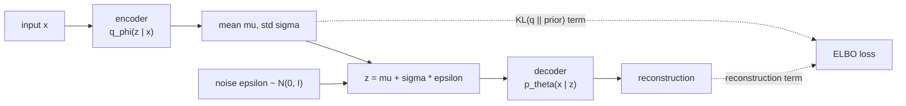

[AI & Machine Learning](./) › Machine Learning Foundations

This page covers the ideas that every later model depends on. It explains why a model fitted to finite data can generalize (statistical learning theory), how parameters are found in practice (optimization and regularization), and what three classical frameworks reveal about modern systems: kernel methods, Gaussian processes, and variational inference. The treatment is precise but proof-light. Formal statements and proofs are in [AI Mathematics](../../advanced/ai-mathematics/), and the standard algorithms (linear models, trees, boosting, SVMs, clustering) are on [Core ML Algorithms](core-ml-algorithms.html).

## The Learning Problem

### Risk and Empirical Risk Minimization

Supervised learning assumes that training pairs $(x_i, y_i)$ are drawn independently from a fixed but unknown distribution $\mathcal{D}$ over $\mathcal{X} \times \mathcal{Y}$. An algorithm chooses a hypothesis $h$ from a **hypothesis class** $\mathcal{H}$ and is judged by a loss $\ell(h(x), y)$. The goal is to minimize the **true (population) risk**

$$R(h) = \mathbb{E}_{(x,y) \sim \mathcal{D}}\big[\ell(h(x), y)\big],$$

but only the **empirical risk** on the $n$ observed samples can be computed:

$$\hat{R}_n(h) = \frac{1}{n}\sum_{i=1}^{n} \ell(h(x_i), y_i).$$

Choosing $\hat{h} = \arg\min_{h \in \mathcal{H}} \hat{R}_n(h)$ is **empirical risk minimization (ERM)**. ERM is justified only when the **generalization gap** $R(h) - \hat{R}_n(h)$ is small, and small uniformly over $\mathcal{H}$, since the minimizer is chosen after looking at the data.

### Where Error Comes From

The excess risk of a trained model over the best achievable (Bayes) risk $R^\star$ splits into three parts (Bottou and Bousquet, 2008). Each has its own remedy.


| Component | Cause | Reduced by |
|-----------|-------|------------|
| Approximation error | $\mathcal{H}$ cannot express the target | Richer model class, better features |
| Estimation error | Only $n$ samples observed | More data, regularization, smaller effective capacity |
| Optimization error | The optimizer does not find the ERM solution | More compute, better optimizers, better conditioning |

Classical theory concentrates on the first two, which trade off against each other. Large-scale deep learning is often limited by the third: a fixed compute budget means that training on more data for fewer passes can beat fitting a smaller dataset exactly.

### Bias–Variance Decomposition

For squared-error regression with $y = f(x) + \varepsilon$, $\mathbb{E}[\varepsilon] = 0$ and $\operatorname{Var}(\varepsilon) = \sigma^2$, the expected error of a learned predictor $\hat{f}$ at a point $x$ decomposes exactly. The expectation is over random draws of the training set and the noise:

$$\mathbb{E}\big[(y - \hat{f}(x))^2\big] = \underbrace{\big(f(x) - \mathbb{E}[\hat{f}(x)]\big)^2}_{\text{bias}^2} + \underbrace{\mathbb{E}\big[(\hat{f}(x) - \mathbb{E}[\hat{f}(x)])^2\big]}_{\text{variance}} + \underbrace{\sigma^2}_{\text{irreducible noise}}$$

- **Bias** is systematic error from a model too simple to represent $f$ (underfitting).
- **Variance** is sensitivity to the particular training sample (overfitting).
- **Irreducible noise** $\sigma^2$ is a floor that no model can go below.

In the classical picture, raising capacity lowers bias and raises variance, which gives a U-shaped test-error curve with an optimum in between.

### Double Descent and Benign Overfitting

Modern overparameterized models do not follow the U-curve. As capacity grows past the **interpolation threshold**, the point where the model can fit the training set exactly, test error peaks and then falls again, often below the classical optimum. This **double descent** was described by Belkin et al. (2019) and shown for deep networks, both as a function of model size and of training epochs, by Nakkiran et al. (2019).

<figure>
<svg viewBox="0 0 520 250" role="img" aria-labelledby="dd-title" style="max-width:100%;height:auto;background:transparent;color:currentColor">
  <title id="dd-title">Double descent: test error against model capacity, peaking at the interpolation threshold</title>
  <g fill="none" stroke="currentColor" stroke-width="1.5">
    <line x1="50" y1="210" x2="500" y2="210"/>
    <line x1="50" y1="210" x2="50" y2="20"/>
  </g>
  <line x1="250" y1="25" x2="250" y2="210" stroke="currentColor" stroke-width="1" stroke-dasharray="5 4" opacity="0.6"/>
  <path d="M60,190 C110,195 170,200 250,202 C320,204 420,205 495,206" fill="none" stroke="currentColor" stroke-width="1.5" stroke-dasharray="2 3" opacity="0.8"/>
  <path d="M60,120 C95,85 125,80 150,95 C190,118 225,40 250,40 C275,40 300,120 340,145 C390,172 440,178 495,180" fill="none" stroke="currentColor" stroke-width="2.5"/>
  <g font-size="12" fill="currentColor" font-family="sans-serif">
    <text x="275" y="235" text-anchor="middle">model capacity (parameters, or epochs)</text>
    <text x="18" y="115" transform="rotate(-90 18 115)" text-anchor="middle">error</text>
    <text x="256" y="32">interpolation threshold</text>
    <text x="85" y="72">classical regime</text>
    <text x="360" y="128">overparameterized regime</text>
    <text x="400" y="170">test error</text>
    <text x="400" y="200">training error</text>
  </g>
</svg>
<figcaption>Schematic double-descent curve. Test error (solid) follows the classical U-shape, spikes where the model can just interpolate the training data, then falls again as capacity keeps growing. Training error (dotted) goes to zero.</figcaption>
</figure>

The bias–variance identity still holds. What changes is that among the many interpolating solutions, gradient descent is implicitly biased toward low-norm, smooth ones, and extra parameters let it find smoother interpolants. When the noise is absorbed in many directions that barely affect predictions, fitting noisy labels exactly does little harm (**benign overfitting**). Regularization and early stopping reduce the peak. The theory is covered in [AI Mathematics: double descent](../../advanced/ai-mathematics/#double-descent-and-benign-overfitting) and [Deep Learning Theory](deep-learning-theory.html).

## Generalization Theory

Generalization bounds make "not too much capacity" precise. They all follow one pattern: with probability at least $1 - \delta$ over the draw of the sample, for every $h \in \mathcal{H}$,

$$R(h) \le \hat{R}_n(h) + \text{(capacity term shrinking with } n\text{)}.$$

This is **uniform convergence**. If it holds, minimizing training error is safe.

### PAC Learning

The *Probably Approximately Correct* framework defines learnability. A class $\mathcal{H}$ is PAC-learnable if some algorithm, for any $\varepsilon, \delta \in (0,1)$, returns with probability at least $1 - \delta$ a hypothesis with risk at most $\varepsilon$, using a number of samples polynomial in $1/\varepsilon$ and $1/\delta$. For a **finite** class in the realizable case, a union bound is enough. A hypothesis with true error above $\varepsilon$ survives $n$ independent samples with probability at most $(1-\varepsilon)^n \le e^{-\varepsilon n}$. Summing over $|\mathcal{H}|$ candidates shows that

$$n \ge \frac{1}{\varepsilon}\left(\ln|\mathcal{H}| + \ln\frac{1}{\delta}\right)$$

samples make it unlikely (probability below $\delta$) that any hypothesis that fits the training data perfectly still has error above $\varepsilon$.

### VC Dimension

For infinite binary classes, $\ln|\mathcal{H}|$ is replaced by the **VC dimension** $d_{VC}$, the size of the largest point set that $\mathcal{H}$ can **shatter** (label in all $2^{d_{VC}}$ ways). Linear classifiers in $\mathbb{R}^d$ have $d_{VC} = d + 1$. One standard form of the VC bound is

$$R(h) \le \hat{R}_n(h) + \sqrt{\frac{d_{VC}\big(\ln(2n/d_{VC}) + 1\big) + \ln(4/\delta)}{n}}.$$

The gap shrinks like $\sqrt{d_{VC}/n}$, so more capacity needs proportionally more data. The **fundamental theorem of statistical learning** says that a binary class is PAC-learnable if and only if its VC dimension is finite.

### Rademacher Complexity

**Rademacher complexity** is a sharper capacity measure that depends on the data. Given samples $x_1, \dots, x_n$ and independent random signs $\sigma_i \in \{-1, +1\}$, the empirical Rademacher complexity of a real-valued class $\mathcal{F}$ is

$$\hat{\mathfrak{R}}_n(\mathcal{F}) = \mathbb{E}_{\sigma}\left[\sup_{f \in \mathcal{F}} \frac{1}{n}\sum_{i=1}^{n} \sigma_i\, f(x_i)\right],$$

which measures how well the class can correlate with random noise. For losses bounded in $[0, 1]$, with probability at least $1 - \delta$,

$$R(h) \le \hat{R}_n(h) + 2\,\hat{\mathfrak{R}}_n(\mathcal{F}) + 3\sqrt{\frac{\ln(2/\delta)}{2n}}.$$

Here $\mathcal{F}$ is the loss class induced by $\mathcal{H}$. Because it adapts to the data distribution and handles real-valued outputs, Rademacher complexity gives the margin-based bounds used for SVMs and norm-based bounds for neural networks.

### Comparing Capacity Measures

| Measure | Depends on data? | Typical use | Limitation |
|---------|------------------|-------------|------------|
| $\ln\lvert\mathcal{H}\rvert$ | No | Finite classes, rule learning | Useless for continuous parameters |
| VC dimension | No | Binary classifiers, PAC theory | Worst-case; vacuous for large networks |
| Rademacher complexity | Yes | Margin bounds, kernel methods | Hard to compute exactly for deep nets |
| PAC-Bayes | Yes (via a posterior) | Stochastic or flat-minimum networks | Needs a prior and posterior over weights |

Parameter-counting bounds are **vacuous** for modern networks: a network with more parameters than training points can fit random labels (Zhang et al., 2017), yet it generalizes on real labels. Explaining this requires norm-based, compression, or PAC-Bayes arguments, covered in [AI Mathematics](../../advanced/ai-mathematics/#statistical-learning-theory).

## Model Selection and Validation

Bounds say what is possible. Held-out evaluation measures what is happening on a given dataset.

| Protocol | How it works | When to use |
|----------|--------------|-------------|
| Train / validation / test split | Fit on train, tune on validation, report once on test | Large datasets, deep learning |
| $k$-fold cross-validation | Rotate each of $k$ folds as the validation set and average | Small and medium tabular data; $k = 5$ or $10$ is standard |
| Leave-one-out | $k = n$ | Very small data; nearly unbiased but high variance and expensive |
| Stratified $k$-fold | Folds keep class proportions | Imbalanced classification |
| Grouped $k$-fold | All samples from one group (patient, user) stay in the same fold | Correlated samples |
| Time-series split | Train on the past, validate on the future, in expanding windows | Temporal data; random shuffling leaks the future |
| Nested cross-validation | Inner loop tunes hyperparameters, outer loop estimates error | Unbiased error estimate when tuning on small data |

**Data leakage** is the most common way validation goes wrong. It happens whenever information from validation or test data reaches training, for example by fitting a scaler or feature selector on the full dataset, putting near-duplicate samples in different folds, or tuning repeatedly against the test set. Fitting all preprocessing inside the cross-validation loop, for instance with a scikit-learn `Pipeline`, prevents the first case:

```python
from sklearn.datasets import load_breast_cancer
from sklearn.linear_model import LogisticRegression
from sklearn.model_selection import GridSearchCV, StratifiedKFold, cross_val_score
from sklearn.pipeline import make_pipeline
from sklearn.preprocessing import StandardScaler

X, y = load_breast_cancer(return_X_y=True)

# The scaler is refit on each training fold, so no statistics leak from validation folds.
pipe = make_pipeline(StandardScaler(), LogisticRegression(max_iter=1000))
param_grid = {"logisticregression__C": [0.01, 0.1, 1, 10]}

inner = StratifiedKFold(n_splits=5, shuffle=True, random_state=0)
outer = StratifiedKFold(n_splits=5, shuffle=True, random_state=1)

# Nested CV: GridSearchCV tunes C on inner folds; cross_val_score estimates error on outer folds.
search = GridSearchCV(pipe, param_grid, cv=inner)
scores = cross_val_score(search, X, y, cv=outer)
print(f"accuracy: {scores.mean():.3f} +/- {scores.std():.3f}")
```

## Optimization

Learning theory says a good hypothesis exists in the class. Optimization finds it by minimizing the (regularized) empirical risk $\mathcal{L}(\theta)$.

### Gradient Descent and Convexity

The basic update moves the parameters against the gradient with learning rate $\eta$:

$$\theta_{t+1} = \theta_t - \eta\,\nabla_\theta \mathcal{L}(\theta_t).$$

A function is **convex** if its graph lies below every chord:

$$f\big(\lambda x + (1-\lambda) y\big) \le \lambda f(x) + (1-\lambda) f(y), \qquad \lambda \in [0,1].$$

For convex functions every local minimum is global, and a zero gradient proves optimality. A twice-differentiable $f$ is convex if and only if its Hessian is positive semidefinite, $\nabla^2 f \succeq 0$. Least squares, logistic regression, and the SVM hinge loss are convex, which is why those methods train reliably. Deep networks are non-convex and full of saddle points, yet gradient methods still work well on them. [Deep Learning Theory](deep-learning-theory.html#the-optimization-landscape) discusses why.

Convergence rates depend on the problem class. Here $L$ is the smoothness constant (Lipschitz constant of the gradient) and $\mu$ is the strong-convexity constant:

| Setting | Method | Rate on $f(\theta_t) - f^\star$ |
|---------|--------|----------------------------------|
| Convex, $L$-smooth | Gradient descent, $\eta = 1/L$ | $O(1/t)$ |
| Convex, $L$-smooth | Nesterov accelerated gradient | $O(1/t^2)$, optimal for first-order methods |
| $\mu$-strongly convex, $L$-smooth | Gradient descent | $O\big((1 - \mu/L)^t\big)$, linear |
| Convex, stochastic gradients | SGD with decaying $\eta_t$ | $O(1/\sqrt{t})$ |

The ratio $\kappa = L/\mu$ is the **condition number**. Ill-conditioned problems, with long narrow valleys, converge slowly, and much of optimizer design (momentum, adaptive scaling, normalization layers, preconditioning) is about working around poor conditioning.

### Stochastic Gradient Descent and Momentum

Computing the full gradient over millions of examples at every step is wasteful. **SGD** uses an unbiased estimate from a mini-batch $B_t$:

$$\theta_{t+1} = \theta_t - \eta_t\, \nabla_\theta \mathcal{L}_{B_t}(\theta_t), \qquad \mathbb{E}\big[\nabla \mathcal{L}_{B}\big] = \nabla \mathcal{L}.$$

Gradient noise slows asymptotic convergence, but it also helps escape saddle points and biases training toward flatter minima, which tend to generalize better. The noise scale grows with $\eta / |B|$. This is why the learning rate is usually scaled up with batch size, roughly linearly for SGD, up to a critical batch size beyond which larger batches stop helping.

**Momentum** keeps an exponentially decaying average of past gradients. It damps oscillation across steep directions and speeds progress along consistent ones:

$$v_{t+1} = \beta\, v_t + \nabla_\theta \mathcal{L}(\theta_t), \qquad \theta_{t+1} = \theta_t - \eta\, v_{t+1}.$$

**Nesterov momentum** evaluates the gradient at the look-ahead point $\theta_t - \eta\beta v_t$, which gives the accelerated rate in the table above.

### Adam and AdamW

**Adam** keeps running estimates of the first moment $m_t$ and the uncentered second moment $v_t$ of the gradient $g_t$, both computed element-wise:

$$m_t = \beta_1 m_{t-1} + (1 - \beta_1)\, g_t, \qquad v_t = \beta_2 v_{t-1} + (1 - \beta_2)\, g_t^2.$$

Both start at zero, so early estimates are biased toward zero. Adam corrects them with $\hat{m}_t = m_t / (1 - \beta_1^t)$ and $\hat{v}_t = v_t / (1 - \beta_2^t)$. Dividing by $\sqrt{\hat{v}_t}$ gives each parameter its own step size: large where gradients are consistent and small where they are noisy.

**AdamW** (Loshchilov and Hutter, 2019) applies weight decay directly to the weights instead of adding an L2 term to the gradient. With plain Adam, an L2 penalty is rescaled by $\sqrt{\hat{v}_t}$ and no longer acts as uniform shrinkage:

$$\theta_{t+1} = \theta_t - \eta\left(\frac{\hat{m}_t}{\sqrt{\hat{v}_t} + \epsilon} + \lambda\,\theta_t\right).$$

AdamW with $\beta_1 = 0.9$, $\beta_2$ between $0.95$ and $0.999$, and gradient clipping is the default optimizer for transformers. Its main drawback is memory: it stores two extra values per parameter.

### Learning-Rate Schedules

The learning rate is the most important hyperparameter, and in modern training it changes over time.

- **Warmup** raises $\eta$ linearly over the first few hundred to few thousand steps. This avoids instability while Adam's second-moment estimates are still unreliable.
- **Cosine decay** then lowers $\eta$ along a half cosine to a small final value. Warmup followed by cosine decay has long been the default for transformer pretraining.
- **Warmup–stable–decay (WSD)**, also called trapezoidal, keeps $\eta$ constant for most of training and decays quickly at the end. Because training does not need a fixed end point, a run can be continued, or branched into several decay phases from one checkpoint, which is useful for scaling-law studies and continued pretraining.
- **Step decay** and **one-cycle** schedules remain common for CNNs trained with SGD.

### Newer Optimizers

Since 2023 several alternatives to AdamW have been adopted in large-scale training.

| Optimizer | Idea | Notes |
|-----------|------|-------|
| **Lion** (Chen et al., 2023) | Updates with the *sign* of an interpolated momentum | Found by program search; stores one state instead of two; needs a smaller learning rate than AdamW |
| **Shampoo / SOAP** | Kronecker-factored preconditioning, an approximation to full-matrix AdaGrad | Stronger per-step progress at higher compute and memory cost; SOAP runs Adam in Shampoo's eigenbasis |
| **Muon** (Jordan et al., 2024) | Orthogonalizes the momentum of each 2-D weight matrix with a few Newton–Schulz iterations, so the update has uniform singular values | Used for hidden-layer matrices, with AdamW for embeddings, output head, and scalar parameters. Moonshot AI's "Muon is Scalable for LLM Training" (2025) reported about 2x compute efficiency over AdamW in compute-optimal training |
| **Schedule-Free** (Defazio et al., 2024) | Replaces the decay schedule with iterate averaging | No need to set the training length in advance |

None of these has replaced AdamW everywhere. Reported gains depend heavily on how carefully the AdamW baseline was tuned. The theory behind these methods is covered in [AI Mathematics: adaptive and modern optimizers](../../advanced/ai-mathematics/#adaptive-and-modern-optimizers).

## Regularization

Regularization reduces the variance term by limiting effective capacity, which tightens the generalization bounds above.

| Technique | Mechanism | Effect |
|-----------|-----------|--------|
| **L2 / ridge / weight decay** | Adds $\frac{\lambda}{2}\lVert\theta\rVert_2^2$ | Shrinks weights smoothly. For least squares, $\hat{\theta} = (X^\top X + \lambda I)^{-1} X^\top y$, and the $\lambda I$ term also fixes ill-conditioning |
| **L1 / lasso** | Adds $\lambda \lVert\theta\rVert_1$ | The corners of the L1 ball push many weights to exactly zero, giving sparse models that select features |
| **Elastic net** | Mix of L1 and L2 | Sparsity with stability when features are correlated |
| **Early stopping** | Stops training when validation loss is lowest | For linear models trained by gradient descent, roughly equivalent to L2 |
| **Dropout** | Randomly zeroes activations during training | Acts like an average over many subnetworks and discourages co-adaptation |
| **Data augmentation** | Trains on label-preserving transformations | Encodes known invariances; often the strongest regularizer for vision and audio |
| **Label smoothing** | Replaces one-hot targets with $1 - \epsilon$ on the true class | Discourages overconfident logits and improves calibration |

From a Bayesian point of view, L2 regularization is MAP estimation with a Gaussian prior on the weights, and L1 corresponds to a Laplace prior. The strength $\lambda$ encodes how confident the prior is, and it is chosen by validation like any other hyperparameter.

<div class="code-reference">
<i class="fas fa-code"></i> Generalization bounds and convex optimizers (proximal gradient, accelerated gradient, ADMM): <a href="https://github.com/andrewaltimit/Documentation/blob/main/github-pages/code-examples/technology/ai/machine_learning_foundations.py">machine_learning_foundations.py</a>
</div>

## Kernel Methods {#the-kernel-trick-making-linear-methods-powerful}

Linear models are convex, fast, and well understood, but they can only draw linear boundaries. Kernel methods keep the linear algorithm and change the feature space. For example, two classes arranged as concentric circles in $\mathbb{R}^2$ cannot be separated by a line, but adding the feature $\lVert x \rVert^2$ makes them separable by a plane.

### The Kernel Trick

Many algorithms, including the SVM, ridge regression, PCA, and $k$-means, can be written so they use the data only through inner products $\langle x_i, x_j \rangle$. If the inputs are mapped through a feature map $\phi: \mathcal{X} \to \mathcal{F}$ into a high- or even infinite-dimensional space, the same algorithm can run there without ever computing $\phi(x)$. It only needs a **kernel function**

$$k(x, x') = \langle \phi(x), \phi(x') \rangle.$$

A symmetric function $k$ is a valid kernel if and only if every **Gram matrix** $K_{ij} = k(x_i, x_j)$ is positive semidefinite (**Mercer's condition**). In that case $k$ is the inner product of some feature map, whose feature space is a **reproducing kernel Hilbert space (RKHS)**. By the **representer theorem**, the minimizer of a regularized risk in the RKHS has the form $f(x) = \sum_i \alpha_i\, k(x_i, x)$, a weighted sum of kernels centered on the training points.

| Kernel | Formula | Feature space | Notes |
|--------|---------|---------------|-------|
| Linear | $\langle x, x' \rangle$ | The input space | Baseline; best when $d$ is large and $n$ is small |
| Polynomial | $(\langle x, x' \rangle + c)^p$ | All monomials up to degree $p$ | Models feature interactions |
| RBF (Gaussian) | $\exp\!\big(-\lVert x - x' \rVert^2 / 2\sigma^2\big)$ | Infinite-dimensional | Common default; bandwidth $\sigma$ sets how far each point's influence reaches |
| Matérn | Depends on smoothness $\nu$ | Infinite-dimensional | Controls how smooth functions are; standard for Gaussian processes |

Kernel methods need the $n \times n$ Gram matrix, so exact solvers cost $O(n^2)$ memory and up to $O(n^3)$ time. **Random Fourier features** and the **Nyström** method approximate the kernel with an explicit low-dimensional feature map, which brings kernel methods back to linear-time training.

### Support Vector Machines

The SVM is the standard kernel method. For separable data it finds the hyperplane with the largest **margin**, the distance to the nearest points of either class. A large margin is the low-capacity choice that Rademacher margin bounds favor. The soft-margin primal problem is

$$\min_{w, b, \xi}\; \frac{1}{2}\lVert w \rVert^2 + C \sum_{i=1}^{n} \xi_i \quad \text{s.t.}\quad y_i\big(\langle w, \phi(x_i)\rangle + b\big) \ge 1 - \xi_i,\; \xi_i \ge 0,$$

where the slack variables $\xi_i$ allow margin violations and $C$ trades margin width against training errors. The Lagrangian dual uses the data only through inner products, which is where the kernel enters:

$$\max_{\alpha}\; \sum_{i=1}^{n}\alpha_i - \frac{1}{2}\sum_{i,j} \alpha_i \alpha_j\, y_i y_j\, k(x_i, x_j) \quad \text{s.t.}\quad 0 \le \alpha_i \le C,\; \sum_i \alpha_i y_i = 0.$$

The solution is sparse. Only the **support vectors**, the points on or inside the margin, have $\alpha_i > 0$, and the decision function $f(x) = \sum_i \alpha_i y_i\, k(x_i, x) + b$ sums over those points only. The problem is convex (equivalently, hinge loss $\max(0, 1 - y f(x))$ plus an L2 penalty), so its global optimum can be found reliably. Practical usage is covered on [Core ML Algorithms](core-ml-algorithms.html#support-vector-machines).

Kernels also connect to deep learning. In the infinite-width limit, gradient-descent training of a neural network is kernel regression with the **neural tangent kernel**. See [Deep Learning Theory](deep-learning-theory.html#the-neural-tangent-kernel) and [AI Mathematics: kernel methods and RKHS](../../advanced/ai-mathematics/#kernel-methods-and-rkhs).

<div class="code-reference">
<i class="fas fa-code"></i> Kernel ridge regression, kernel PCA, and MMD: <a href="https://github.com/andrewaltimit/Documentation/blob/main/github-pages/code-examples/technology/ai/machine_learning_foundations.py#L162">machine_learning_foundations.py#KernelTheory</a>
</div>

## Gaussian Processes

A **Gaussian process (GP)** is a probability distribution over functions in which any finite set of function values is jointly Gaussian. A GP regressor predicts both a value and its uncertainty, needs no architecture choices, and works well with little data. That makes GPs the standard surrogate model in **Bayesian optimization**, which is used for hyperparameter tuning and experimental design, and they are also used in geostatistics (as kriging), time series, and robotics.

### Prior and Posterior

A GP is specified by a mean function $m(x)$, usually $0$, and a covariance function $k(x, x')$. The covariance can be any of the positive-semidefinite kernels above:

$$f(x) \sim \mathcal{GP}\big(m(x),\, k(x, x')\big).$$

GP regression is the Bayesian, function-space form of kernel ridge regression. With noisy observations $y = f(X) + \varepsilon$, $\varepsilon \sim \mathcal{N}(0, \sigma_n^2 I)$, the posterior at test inputs $X_\star$ is Gaussian with closed-form moments:

$$\boldsymbol{\mu}_\star = K_{\star X}\big(K_{XX} + \sigma_n^2 I\big)^{-1} y,$$

$$\boldsymbol{\Sigma}_\star = K_{\star\star} - K_{\star X}\big(K_{XX} + \sigma_n^2 I\big)^{-1} K_{X\star}.$$

The posterior mean equals the kernel ridge regression prediction with $\lambda = \sigma_n^2$. The diagonal of $\boldsymbol{\Sigma}_\star$ gives error bars that are narrow near the training data and grow back to the prior variance away from it.

### Hyperparameters and Scaling

Kernel hyperparameters (length scale, signal variance, noise level) are fitted by maximizing the **log marginal likelihood**:

$$\log p(y \mid X) = -\tfrac{1}{2}\, y^\top \big(K_{XX} + \sigma_n^2 I\big)^{-1} y - \tfrac{1}{2}\log\big|K_{XX} + \sigma_n^2 I\big| - \tfrac{n}{2}\log 2\pi.$$

The first term rewards fitting the data. The log-determinant term penalizes flexible models, which gives a built-in Occam's razor without a validation set. An exact GP needs a Cholesky factorization that costs $O(n^3)$ time and $O(n^2)$ memory, which in practice limits exact GPs to tens of thousands of points. Larger problems use **sparse or inducing-point approximations** (for example SVGP), structured kernels, or GPU conjugate-gradient solvers such as GPyTorch.

```python
import numpy as np
from sklearn.gaussian_process import GaussianProcessRegressor
from sklearn.gaussian_process.kernels import RBF, ConstantKernel, WhiteKernel

rng = np.random.default_rng(0)
X_train = rng.uniform(0, 10, size=(25, 1))
y_train = np.sin(X_train).ravel() + 0.1 * rng.standard_normal(25)

# Signal variance * RBF(length scale) + learned observation noise.
kernel = ConstantKernel(1.0) * RBF(length_scale=1.0) + WhiteKernel(noise_level=0.1)
gp = GaussianProcessRegressor(kernel=kernel, normalize_y=True, n_restarts_optimizer=5)
gp.fit(X_train, y_train)          # maximizes the log marginal likelihood

X_test = np.linspace(0, 12, 200).reshape(-1, 1)
mean, std = gp.predict(X_test, return_std=True)   # std grows beyond x = 10
print(gp.kernel_)                 # fitted hyperparameters
```

An infinitely wide neural network with random weights is exactly a GP (the NNGP correspondence), which is another link between kernels and deep learning.

<div class="code-reference">
<i class="fas fa-code"></i> From-scratch GP and Bayesian optimization (EI, UCB, PI acquisition functions): <a href="https://github.com/andrewaltimit/Documentation/blob/main/github-pages/code-examples/technology/ai/advanced_ml_algorithms.py#L14">advanced_ml_algorithms.py#GaussianProcess</a>
</div>

## Variational Inference

Bayesian inference needs the posterior $p(z \mid x) = p(x, z) / p(x)$ over latent variables $z$. The evidence $p(x) = \int p(x, z)\, dz$ is usually an intractable integral. **Markov chain Monte Carlo** approximates the posterior by sampling, which is asymptotically exact but slow. **Variational inference (VI)** turns inference into optimization. It picks a tractable family $q_\phi(z)$ and finds the member closest to the posterior in KL divergence:

$$\phi^\star = \arg\min_\phi\; \mathrm{KL}\big(q_\phi(z) \,\|\, p(z \mid x)\big).$$

### The Evidence Lower Bound

The KL above contains the unknown $p(x)$, but the log-evidence can be rewritten as

$$\log p(x) = \underbrace{\mathbb{E}_{q_\phi}\big[\log p(x, z) - \log q_\phi(z)\big]}_{\text{ELBO } \mathcal{L}(\phi)} + \mathrm{KL}\big(q_\phi(z)\,\|\,p(z\mid x)\big).$$

The KL term is non-negative, so the first term is a lower bound on $\log p(x)$: the **evidence lower bound (ELBO)**. The left side does not depend on $\phi$, so maximizing the ELBO is the same as minimizing the KL to the true posterior. The ELBO can also be written as a reconstruction term minus a regularizer:

$$\mathcal{L}(\phi) = \mathbb{E}_{q_\phi(z)}\big[\log p(x \mid z)\big] - \mathrm{KL}\big(q_\phi(z) \,\|\, p(z)\big).$$

The first term rewards latent codes that explain the data, and the second keeps $q$ close to the prior. Because it minimizes the **reverse** KL $\mathrm{KL}(q \,\|\, p)$, VI is *mode-seeking*: it tends to fit one mode of a multimodal posterior and to underestimate posterior variance.

### Mean-Field, Amortization, and Reparameterization

- **Mean-field VI** assumes the latent variables are independent, $q_\phi(z) = \prod_j q_j(z_j)$. For conjugate exponential-family models this gives closed-form coordinate-ascent updates, as in LDA topic models.
- **Stochastic VI** optimizes the ELBO with mini-batch gradients, which scales to large datasets.
- **Amortized VI** trains an encoder network to output $q_\phi(z \mid x)$ for any $x$, instead of fitting separate parameters for each data point.
- The **reparameterization trick** makes sampling differentiable by writing a sample as a deterministic function of $\phi$ plus independent noise, for example $z = \mu_\phi + \sigma_\phi \odot \epsilon$ with $\epsilon \sim \mathcal{N}(0, I)$, which gives low-variance gradients.

Together, amortization and reparameterization make up the **variational autoencoder (VAE)**:



VI is also used in Bayesian neural networks, probabilistic programming (Pyro, NumPyro), and the latent space of latent diffusion models, which is produced by a VAE. For VAEs and diffusion in practice see [Generative Models](generative-models.html).

<div class="code-reference">
<i class="fas fa-code"></i> ELBO estimation and gradient-based VI: <a href="https://github.com/andrewaltimit/Documentation/blob/main/github-pages/code-examples/technology/ai/advanced_ml_algorithms.py#L94">advanced_ml_algorithms.py#VariationalInference</a>
</div>

## From Foundations to Algorithms

The ideas on this page show up in each of the standard model families:

| Family | Foundation it illustrates | Covered in |
|--------|---------------------------|------------|
| Linear and logistic regression | Convex ERM; L1/L2 regularization; MAP estimation | [Core ML Algorithms](core-ml-algorithms.html#linear-regression) |
| Decision trees, random forests, boosting | Low-bias nonparametric models; variance reduction by ensembling | [Core ML Algorithms](core-ml-algorithms.html#ensemble-methods-the-big-idea) |
| SVMs and kernel machines | Margin bounds; kernel trick; convex duality | [Kernel Methods](#the-kernel-trick-making-linear-methods-powerful) above |
| Gaussian processes | Bayesian nonparametrics; marginal-likelihood model selection | [Gaussian Processes](#gaussian-processes) above |
| Neural networks | Non-convex SGD; implicit regularization; double descent | [Deep Learning Theory](deep-learning-theory.html), [Architectures](architectures.html) |
| VAEs and diffusion models | Variational inference; ELBO | [Generative Models](generative-models.html) |

## See Also

- [Core ML Algorithms](core-ml-algorithms.html): linear models, trees, boosting, SVMs, and clustering in practice
- [Loss Functions](loss-functions.html): the $\ell$ in the risk, for regression, classification, and ranking
- [Deep Learning Theory](deep-learning-theory.html): backpropagation, optimization landscapes, and the neural tangent kernel
- [Neural Network Architectures](architectures.html): CNNs, RNNs, transformers, and multimodal models
- [Generative Models](generative-models.html): VAEs, diffusion models, and GANs
- [Reinforcement Learning](reinforcement-learning.html): learning from reward instead of labels
- [AI Mathematics](../../advanced/ai-mathematics/): formal proofs for PAC learning, RKHS theory, PAC-Bayes, and scaling laws
