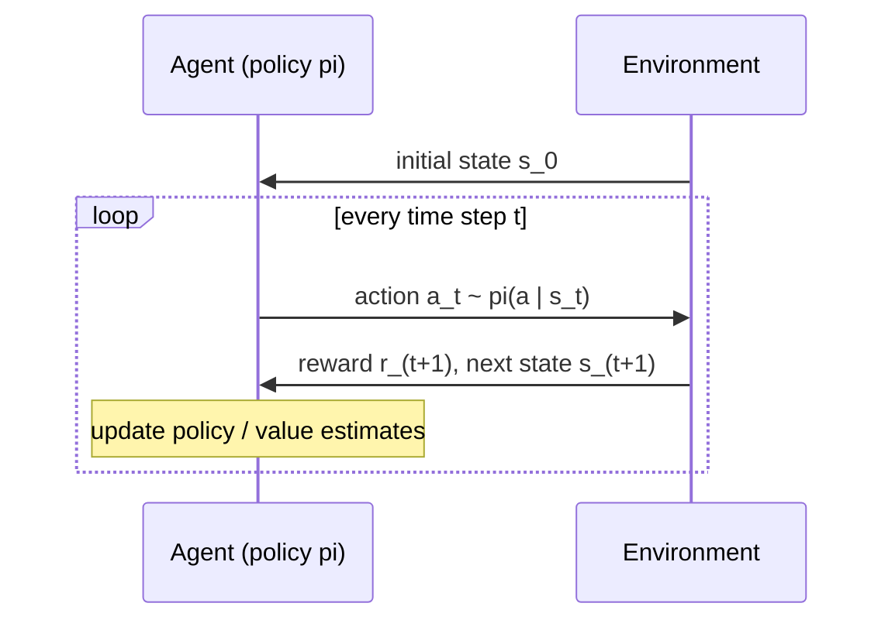
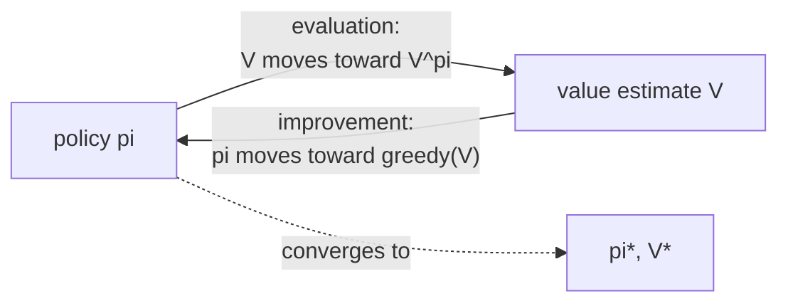
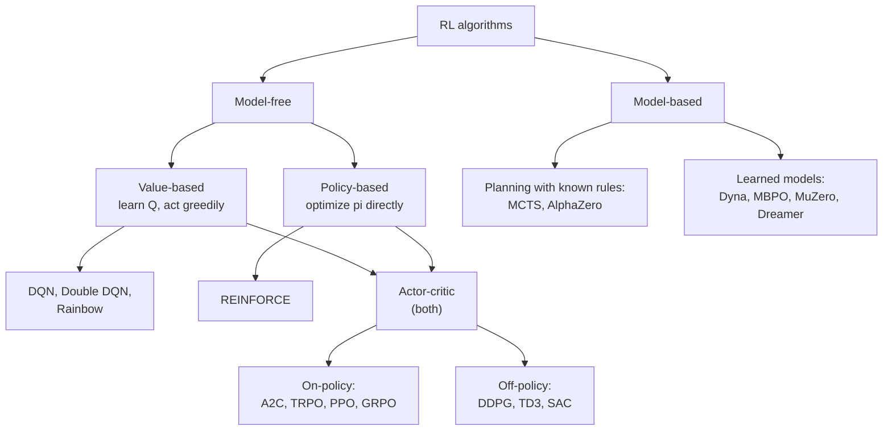
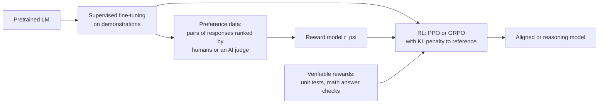
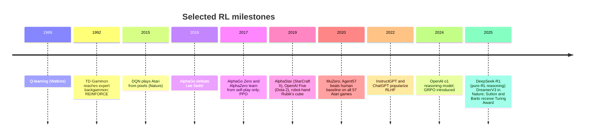

[AI & Machine Learning](./) › Reinforcement Learning

**Reinforcement learning (RL)** is the part of machine learning that learns *behavior* from interaction. An **agent** acts in an **environment**, observes the resulting states, and receives scalar **rewards**. It is never told the correct action, and rewards may be sparse, delayed, and noisy. The goal is a **policy** that maximizes cumulative reward. This page covers the formalism (Markov decision processes and the Bellman equations), planning with a known model (dynamic programming), learning without one (temporal-difference learning and Q-learning), deep RL (DQN, policy gradients, actor-critic, PPO, SAC), model-based and offline RL, and RL for large language models, where RLHF and RL from verifiable rewards (RLVR) now train assistants and reasoning models. The standard textbook is Sutton and Barto, *Reinforcement Learning: An Introduction* (2nd ed., 2018). Its authors received the 2024 ACM Turing Award for founding the field.

## The Reinforcement Learning Problem

At each time step $t$, the agent observes state $s_t$ and chooses action $a_t \sim \pi(\cdot \mid s_t)$. The environment then returns reward $r_{t+1}$ and next state $s_{t+1}$. The agent does not see the environment's internals and learns only from this stream of experience.



Three difficulties set RL apart from supervised learning:

- **Credit assignment.** A reward may arrive long after the actions that caused it. A chess move can decide the game twenty moves later, and the agent has to work out which earlier actions deserve the credit.
- **Exploration versus exploitation.** To find better behavior the agent must try actions whose value it does not yet know. To collect reward it must use what it already knows. Exploiting too much locks in a mediocre strategy, and exploring too much wastes reward.
- **Non-stationary data.** The agent's own policy determines which states it visits, so every policy update changes the data distribution it trains on.

## Markov Decision Processes

The standard formal model is the **Markov decision process (MDP)**, a tuple $(\mathcal{S}, \mathcal{A}, P, R, \gamma)$:

| Symbol | Meaning |
|--------|---------|
| $\mathcal{S}$ | State space |
| $\mathcal{A}$ | Action space, either discrete or continuous |
| $P(s' \mid s, a)$ | Transition probability of reaching $s'$ after taking action $a$ in state $s$ |
| $R(s, a)$ | Expected immediate reward |
| $\gamma \in [0, 1)$ | Discount factor ($\gamma = 1$ is allowed in episodic tasks) |

The **Markov property** requires the future to depend only on the current state and action, not on the full history:

$$P(s_{t+1} \mid s_t, a_t, s_{t-1}, a_{t-1}, \dots) = P(s_{t+1} \mid s_t, a_t).$$

When the agent sees only a partial or noisy observation of the state, the problem is a **partially observable MDP (POMDP)**. It is usually handled by keeping a belief state, or in deep RL by feeding a history of observations into a recurrent network or transformer. Frame stacking in Atari agents is a crude form of this.

### Returns and Discounting

The agent maximizes the **return**, the discounted sum of future rewards:

$$G_t = \sum_{k=0}^{\infty} \gamma^k \, r_{t+k+1} = r_{t+1} + \gamma\, G_{t+1}.$$

With $\gamma < 1$ and bounded rewards, $|G_t| \le r_{\max}/(1-\gamma)$, so the return stays finite. The discount also sets an effective horizon of about $1/(1-\gamma)$ steps. $\gamma = 0.99$ looks roughly 100 steps ahead, and values between 0.9 and 0.999 are typical. The recursive form $G_t = r_{t+1} + \gamma G_{t+1}$ underlies everything that follows.

### Policies, Value Functions, and Advantage

A **policy** $\pi(a \mid s)$ maps states to distributions over actions. It is the agent's behavior. Policies are compared using **value functions**:

$$V^\pi(s) = \mathbb{E}_\pi\!\left[ G_t \mid s_t = s \right], \qquad Q^\pi(s, a) = \mathbb{E}_\pi\!\left[ G_t \mid s_t = s, \, a_t = a \right].$$

$V^\pi$ scores a state, and $Q^\pi$ scores taking action $a$ first and following $\pi$ afterwards. Their difference is the **advantage**,

$$A^\pi(s, a) = Q^\pi(s, a) - V^\pi(s),$$

which measures how much better $a$ is than the policy's average action in $s$. Most modern policy-gradient methods are built around estimating it.

### The Bellman Equations

Splitting the return into the immediate reward plus the discounted value of the next state gives the **Bellman expectation equations**:

$$V^\pi(s) = \sum_{a} \pi(a \mid s) \sum_{s'} P(s' \mid s, a)\left[ R(s, a) + \gamma \, V^\pi(s') \right],$$

$$Q^\pi(s, a) = \sum_{s'} P(s' \mid s, a)\left[ R(s, a) + \gamma \sum_{a'} \pi(a' \mid s')\, Q^\pi(s', a') \right].$$

Every finite MDP has at least one deterministic **optimal policy** $\pi^*$ that is best in every state simultaneously. Its value functions satisfy the **Bellman optimality equations**, which replace the average over actions with a max:

$$V^*(s) = \max_{a} \sum_{s'} P(s' \mid s, a)\left[ R(s, a) + \gamma \, V^*(s') \right],$$

$$Q^*(s, a) = \sum_{s'} P(s' \mid s, a)\left[ R(s, a) + \gamma \max_{a'} Q^*(s', a') \right].$$

Once $Q^*$ is known, the optimal policy is greedy: $\pi^*(s) = \arg\max_a Q^*(s, a)$. The algorithms below differ in how they approximate these equations: with or without a model, with exact expectations or samples, and with tables or neural networks.

## Dynamic Programming

When $P$ and $R$ are known, the Bellman equations can be solved by **dynamic programming (DP)**. DP needs a full model and sweeps the entire state space, so it only applies to small problems. It is still the conceptual basis of every other method here.

**Policy evaluation** computes $V^\pi$ by applying the Bellman expectation equation as an update until it converges:

$$V_{k+1}(s) \leftarrow \sum_{a} \pi(a \mid s) \sum_{s'} P(s' \mid s, a)\left[ R(s, a) + \gamma \, V_k(s') \right].$$

The Bellman operator is a $\gamma$-contraction in the max-norm, so the iteration converges to its unique fixed point $V^\pi$ from any starting point.

**Policy iteration** alternates evaluation with **greedy improvement**, $\pi'(s) = \arg\max_a \sum_{s'} P(s' \mid s, a)\left[R(s,a) + \gamma V^\pi(s')\right]$. The **policy improvement theorem** guarantees $V^{\pi'} \ge V^\pi$ in every state. Since there are finitely many deterministic policies, the process reaches $\pi^*$ after a finite number of rounds.

**Value iteration** combines the two steps. Each sweep applies the optimality operator once, without waiting for evaluation to converge:

$$V_{k+1}(s) \leftarrow \max_{a} \sum_{s'} P(s' \mid s, a)\left[ R(s, a) + \gamma \, V_k(s') \right].$$

Sutton and Barto call this interplay **generalized policy iteration (GPI)**. The value estimate is moved toward the current policy's true value, and the policy is moved toward being greedy with respect to the value estimate. Nearly every RL algorithm, including actor-critic methods and PPO, is a version of GPI.



```python
import numpy as np

def value_iteration(P, R, gamma=0.99, tol=1e-8):
    """P[s, a, s'] = transition probabilities, R[s, a] = expected reward.
    Returns the optimal state values and a greedy (optimal) policy."""
    V = np.zeros(P.shape[0])
    while True:
        Q = R + gamma * P @ V          # (S, A, S) @ (S,) -> (S, A)
        V_new = Q.max(axis=1)
        if np.max(np.abs(V_new - V)) < tol:
            return V_new, Q.argmax(axis=1)
        V = V_new
```

The rest of RL removes DP's two requirements. It learns from **sampled experience** instead of a known model, and it uses **function approximation** so that learning generalizes across states instead of storing one table entry per state.

## Model-Free Prediction and Control

### Monte Carlo and Temporal-Difference Learning

**Monte Carlo (MC)** methods estimate values by averaging the returns actually observed at the end of complete episodes. **Temporal-difference (TD)** learning, the central idea of RL, updates an estimate from *other* estimates (bootstrapping) without waiting for the episode to end. TD(0) moves $V(s_t)$ toward a one-step target:

$$V(s_t) \leftarrow V(s_t) + \alpha\big[ \underbrace{r_{t+1} + \gamma\, V(s_{t+1})}_{\text{TD target}} - V(s_t) \big].$$

The bracketed term is the **TD error** $\delta_t$, the gap between the prediction and the bootstrapped target. (Dopamine neurons in the brain respond in a way that closely resembles a TD error.)

| | Monte Carlo | TD(0) | $n$-step TD / TD($\lambda$) |
|---|---|---|---|
| Target | Full return $G_t$ | $r_{t+1} + \gamma V(s_{t+1})$ | $n$ real rewards, then bootstrap; or a $\lambda$-weighted mix |
| Bias | Unbiased | Biased by the current estimate | Tunable |
| Variance | High | Low | Tunable |
| Needs episode end | Yes | No; learns online | After $n$ steps |

Eligibility traces and TD($\lambda$) interpolate between the two extremes. The same trade-off appears again in deep RL as $n$-step returns and generalized advantage estimation.

### Q-Learning and SARSA

**Q-learning** (Watkins, 1989) is an *off-policy* TD control algorithm. It bootstraps on the best next action, so it learns $Q^*$ whatever policy generated the data:

$$Q(s_t, a_t) \leftarrow Q(s_t, a_t) + \alpha\left[ r_{t+1} + \gamma \max_{a'} Q(s_{t+1}, a') - Q(s_t, a_t) \right].$$

**SARSA** is the *on-policy* counterpart. It bootstraps on the action $a_{t+1}$ it actually takes next, so it learns the value of the exploring policy it follows. In the classic cliff-walking gridworld, SARSA learns a safer path away from the cliff edge, while Q-learning learns the optimal edge-hugging path and falls off more often while exploring.

The example below uses the current [Gymnasium](https://gymnasium.farama.org/) API (the maintained successor to OpenAI Gym; 1.x series). Gymnasium separates `terminated` (the episode really ended, so the future value is zero) from `truncated` (a time limit cut the episode off, so the agent should still bootstrap). Treating the two the same is a common bug.

```python
import gymnasium as gym
import numpy as np

env = gym.make("FrozenLake-v1", is_slippery=True)
Q = np.zeros((env.observation_space.n, env.action_space.n))
alpha, gamma, epsilon = 0.1, 0.99, 0.1
rng = np.random.default_rng(0)

for episode in range(20_000):
    s, _ = env.reset(seed=episode)
    done = False
    while not done:
        # epsilon-greedy behavior policy
        a = env.action_space.sample() if rng.random() < epsilon else int(np.argmax(Q[s]))
        s_next, r, terminated, truncated, _ = env.step(a)
        # Off-policy target: bootstrap on the greedy next action unless the episode truly ended.
        target = r + gamma * np.max(Q[s_next]) * (not terminated)
        Q[s, a] += alpha * (target - Q[s, a])
        s, done = s_next, terminated or truncated
```

A table has one entry for every state–action pair, which is impossible for large or continuous state spaces such as images or joint angles. The solution is a parameterized approximator $Q_\theta(s, a)$, usually a neural network.

## A Map of Deep RL Algorithms



**On-policy** methods (A2C, PPO) learn only from data collected by the current policy and throw it away after an update. They are simple and stable but use samples inefficiently. **Off-policy** methods (DQN, SAC) learn from a replay buffer of older experience. They reuse data more but are harder to stabilize.

## Deep Q-Networks

The **Deep Q-Network** (Mnih et al., *Nature*, 2015) started the deep RL era. One architecture and one set of hyperparameters learned 49 Atari games from raw pixels, reaching human-level play on many of them. A convolutional network $Q_\theta$ is trained to minimize the squared TD error against a **target network** $Q_{\theta^-}$:

$$\mathcal{L}(\theta) = \mathbb{E}_{(s, a, r, s') \sim \mathcal{B}}\!\left[\left( r + \gamma \max_{a'} Q_{\theta^-}(s', a') - Q_\theta(s, a) \right)^2 \right].$$

Combining bootstrapping, off-policy learning, and function approximation can make value estimates diverge. Sutton and Barto call this combination the **deadly triad**. DQN added two stabilizers that are now standard:

- **Experience replay.** Transitions are stored in a buffer $\mathcal{B}$ and sampled in random mini-batches. This breaks the correlation between consecutive samples and lets each transition be reused many times.
- **Target network.** The bootstrap target uses a copy $\theta^-$ of the weights that is updated only every few thousand steps, or slowly averaged by Polyak averaging, $\theta^- \leftarrow \tau\theta + (1-\tau)\theta^-$. Otherwise the network would be chasing a target that moves with every update.

| Extension | Problem addressed | Idea |
|-----------|-------------------|------|
| **Double DQN** | The max operator overestimates values | The online network selects $a'$ and the target network evaluates it |
| **Dueling DQN** | Many states have similar value for every action | Separate streams for $V(s)$ and $A(s,a)$, combined as $Q = V + A - \operatorname{mean}_a A$ |
| **Prioritized replay** | Uniform sampling wastes updates | Sample transitions in proportion to their TD error |
| **$n$-step returns** | One-step targets propagate reward slowly | Bootstrap after $n$ real rewards |
| **Distributional RL (C51, QR-DQN)** | The mean hides risk and multimodality | Learn the full distribution of returns |
| **Noisy Nets** | $\varepsilon$-greedy explores poorly | Learned parametric noise in the weights |
| **Rainbow** (2017) | — | Combines all of the above |

Later Atari agents built on replay-based value learning: R2D2 added recurrence, and Agent57 (2020) was the first to beat the human baseline on all 57 games. DQN-style methods still need the $\max_{a'}$, which cannot be computed directly for continuous actions such as joint torques. That limitation motivates policy-gradient methods.

## Policy Gradient Methods

**Policy-gradient methods** parameterize the policy $\pi_\theta(a \mid s)$ directly, typically with a softmax output for discrete actions or a Gaussian for continuous ones, and do gradient ascent on $J(\theta) = \mathbb{E}_{\pi_\theta}[G_0]$. They handle continuous actions naturally and can represent stochastic policies, which are optimal in some partially observed and adversarial settings.

### The Policy Gradient Theorem and REINFORCE

The **policy gradient theorem** gives the gradient of expected return without requiring the transition dynamics:

$$\nabla_\theta J(\theta) = \mathbb{E}_{\pi_\theta}\!\left[ \sum_{t=0}^{T} \nabla_\theta \log \pi_\theta(a_t \mid s_t) \, G_t \right].$$

The log-probability of each action is increased in proportion to the return that followed it, so actions from good trajectories become more likely and actions from bad ones less likely. The Monte Carlo estimate of this gradient is **REINFORCE** (Williams, 1992). It is unbiased but has high variance. Subtracting a state-dependent **baseline** $b(s_t)$ keeps the estimate unbiased, because $\mathbb{E}_{a \sim \pi}[\nabla_\theta \log \pi_\theta(a \mid s)\, b(s)] = 0$, and it can reduce variance a great deal:

$$\nabla_\theta J(\theta) = \mathbb{E}_{\pi_\theta}\!\left[ \sum_t \nabla_\theta \log \pi_\theta(a_t \mid s_t)\,\big(G_t - b(s_t)\big) \right].$$

The usual baseline is the learned state value $V(s_t)$, which leads to actor-critic methods.

### Actor-Critic and Advantage Estimation

In an **actor-critic** method, an **actor** $\pi_\theta$ chooses actions and a **critic** $V_\phi$ estimates their value. With the critic as the baseline, $G_t - V_\phi(s_t)$ estimates the advantage. The critic's one-step TD error is the lowest-variance (and most biased) estimate:

$$\hat{A}_t^{(1)} = \delta_t = r_{t+1} + \gamma V_\phi(s_{t+1}) - V_\phi(s_t).$$

**Generalized advantage estimation** (GAE; Schulman et al., 2015) takes an exponentially weighted sum of TD errors, and $\lambda$ trades bias against variance:

$$\hat{A}_t^{\text{GAE}(\gamma, \lambda)} = \sum_{l=0}^{\infty} (\gamma\lambda)^l\, \delta_{t+l}.$$

$\lambda = 0$ gives the one-step TD error, and $\lambda = 1$ gives the Monte Carlo advantage. $\lambda \approx 0.95$ is the usual default. **A3C** (2016) ran many asynchronous actor-learners that updated shared weights. Its synchronous version **A2C** batches transitions from parallel environments and usually performs as well on GPUs.

### TRPO and PPO

A policy-gradient step that is too large can wreck performance, and the policy then collects bad data from which it may not recover. **TRPO** (2015) constrains each update to a KL-divergence trust region, which requires second-order optimization. **PPO** (Schulman et al., 2017) gets similar stability with a clipped first-order objective. With the probability ratio $\rho_t(\theta) = \pi_\theta(a_t \mid s_t) / \pi_{\theta_{\text{old}}}(a_t \mid s_t)$:

$$\mathcal{L}^{\text{CLIP}}(\theta) = \mathbb{E}_t\!\left[ \min\!\Big( \rho_t(\theta)\,\hat{A}_t,\; \operatorname{clip}\big(\rho_t(\theta),\, 1 - \epsilon,\, 1 + \epsilon\big)\,\hat{A}_t \Big) \right].$$

Once the ratio for an advantageous action rises above $1 + \epsilon$ (typically $\epsilon = 0.2$), or the ratio for a disadvantageous one falls below $1 - \epsilon$, the objective stops rewarding further change. Because of this, PPO can safely run several epochs of mini-batch updates on each batch of rollouts. The full loss adds a value-function regression term and an entropy bonus:

```python
import torch

def ppo_loss(logp_new, logp_old, adv, values, returns, entropy,
             clip_eps=0.2, vf_coef=0.5, ent_coef=0.01):
    adv = (adv - adv.mean()) / (adv.std() + 1e-8)       # per-batch advantage normalization
    ratio = torch.exp(logp_new - logp_old)                # pi_new / pi_old
    policy_loss = -torch.min(ratio * adv,
                             torch.clamp(ratio, 1 - clip_eps, 1 + clip_eps) * adv).mean()
    value_loss = (values - returns).pow(2).mean()
    return policy_loss + vf_coef * value_loss - ent_coef * entropy.mean()
```

PPO's results depend heavily on implementation details: advantage normalization, observation and reward normalization, orthogonal initialization, learning-rate annealing, and gradient clipping. Reference implementations such as CleanRL document these choices explicitly. PPO remains the default for on-policy control and was the original optimizer in RLHF.

### Off-Policy Actor-Critic for Continuous Control

| Algorithm | Year | Policy | Key ideas |
|-----------|------|--------|-----------|
| **DDPG** | 2015 | Deterministic | Deterministic policy gradient through a learned $Q$; replay and target networks as in DQN |
| **TD3** | 2018 | Deterministic | Two critics with the minimum used as target (clipped double-Q), delayed actor updates, and target-policy smoothing to reduce overestimation |
| **SAC** | 2018 | Stochastic | Maximizes $\mathbb{E}\big[\sum_t r_t + \alpha\,\mathcal{H}(\pi(\cdot \mid s_t))\big]$, trading reward against policy entropy; temperature $\alpha$ tuned automatically |

SAC's entropy term keeps exploring without hand-tuned noise, and SAC is a strong default for continuous control from state vectors. Massively parallel on-policy PPO in GPU simulators is the other common recipe, especially for locomotion.

## Exploration

| Strategy | Mechanism | Typical use |
|----------|-----------|-------------|
| $\varepsilon$-greedy | Random action with probability $\varepsilon$, usually annealed | DQN family |
| Boltzmann / softmax | Sample $a \propto \exp(Q(s,a)/\tau)$ | Discrete actions |
| Gaussian or OU action noise | Add noise to a deterministic action | DDPG, TD3 |
| Entropy regularization | Bonus $\beta\,\mathcal{H}(\pi(\cdot \mid s))$ in the objective | A2C, PPO, SAC |
| Optimism / UCB | Bonus for rarely tried actions ("optimism in the face of uncertainty") | Bandits, MCTS (PUCT) |
| Thompson sampling | Act greedily on a sample from the posterior over values | Bandits, bootstrapped DQN |
| Intrinsic motivation | Bonus for novelty: count-based, curiosity from prediction error, or random network distillation (RND) | Sparse-reward games such as Montezuma's Revenge |

Undirected noise works when reward is dense. When reward is sparse and a random policy almost never reaches it, the agent needs **directed** exploration toward states it has not seen, from intrinsic bonuses or from a model.

## Model-Based Reinforcement Learning

**Model-based RL** learns a model $\hat{P}(s' \mid s, a)$, $\hat{R}(s, a)$ (or is given one) and uses it to plan or to generate simulated experience. It can need far fewer real interactions than model-free RL. The main risk is that the policy exploits errors in the model: plans that look good only because the model is wrong.

| Approach | How the model is used | Examples |
|----------|-----------------------|----------|
| Dyna-style | Imagined transitions supplement real ones in a model-free learner | Dyna-Q, MBPO |
| Receding-horizon planning | Plan a short trajectory at each step, execute the first action, then replan | MPC, PETS, TD-MPC2 |
| Tree search | Search over futures, balancing exploration with a UCB-style rule | MCTS in AlphaGo and AlphaZero |
| Value-equivalent models | Learn a latent model that predicts only reward, value, and policy, never raw observations | MuZero (2020) |
| World models / imagination | Learn latent dynamics and train the actor-critic entirely on imagined rollouts | Dreamer family |

**MuZero** matched AlphaZero at Go, chess, and shogi and set new results on Atari without being given the rules. **DreamerV3** (Hafner et al., published in *Nature* in 2025) used one set of hyperparameters across more than 150 tasks and was the first algorithm to collect diamonds in Minecraft from scratch, without human data or curricula. Large video-based "world models" trained on internet-scale data are now a separate research direction that uses these ideas for robotics and agents.

## Offline Reinforcement Learning

**Offline** (batch) RL learns a policy from a fixed dataset of logged interactions, with no further environment access. This matters where exploration is expensive or unsafe, as in healthcare, recommendation, and robotics from teleoperation logs. The main problem is **distribution shift**. For actions that do not appear in the data, $\max_{a'} Q(s', a')$ picks up overestimated values that the agent can never correct by trying them.

- **Policy constraints** keep the learned policy close to the behavior policy that collected the data (BCQ, TD3+BC).
- **Conservative value estimates** push down Q-values for out-of-distribution actions (CQL, 2020).
- **In-sample learning** avoids querying unseen actions at all, for example with expectile regression (IQL, 2021).
- **Sequence modeling** treats RL as conditional generation. The **Decision Transformer** (2021) predicts actions conditioned on a desired return-to-go.

Offline pretraining followed by online fine-tuning is common in robotics, and the constraint idea is closely related to the KL penalty used in RL for language models.

## Reinforcement Learning for Language Models

Since 2022 the largest-scale use of RL has been post-training language models. The LM is the policy, a prompt is the state, a generated response is the action (or each token is an action), and a reward model or programmatic checker gives the reward.



### RLHF

**Reinforcement learning from human feedback** was used for InstructGPT (2022) and early ChatGPT. It turns a next-token predictor into an assistant in three stages:

1. **Supervised fine-tuning (SFT)** on demonstrations of the desired behavior.
2. **Reward modeling.** Train $r_\psi$ on human comparisons using the Bradley–Terry model. For a preferred response $y_w$ and a rejected response $y_l$ to prompt $x$:

$$\mathcal{L}(\psi) = -\,\mathbb{E}_{(x,\, y_w,\, y_l)}\Big[ \log \sigma\big( r_\psi(x, y_w) - r_\psi(x, y_l) \big) \Big].$$

3. **RL fine-tuning** with PPO against the reward model. A KL penalty keeps the policy near the reference (SFT) model:

$$\max_\theta \; \mathbb{E}_{x \sim \mathcal{D},\, y \sim \pi_\theta(\cdot \mid x)}\Big[ r_\psi(x, y) \Big] - \beta\, \mathbb{E}_{x \sim \mathcal{D}}\Big[\mathrm{KL}\big( \pi_\theta(\cdot \mid x) \,\|\, \pi_{\text{ref}}(\cdot \mid x) \big)\Big].$$

The KL term plays the same role as PPO's clip. It limits how far the policy can move from a trusted reference, which limits **reward hacking**: exploiting flaws in the learned reward model, for example through verbosity, sycophancy, or confident-sounding errors. **RLAIF** and Constitutional AI replace some or all of the human comparisons with AI-generated judgments guided by written principles. **DPO** and related methods (IPO, KTO, ORPO) optimize on preference pairs directly, with no reward model or sampling loop. They are covered in [Fine-Tuning: DPO](fine-tuning.html#dpo-direct-preference-optimization).

### RL from Verifiable Rewards and GRPO

For tasks whose answers can be checked automatically, such as math with a known final answer or code with unit tests, the learned reward model can be replaced by a programmatic **verifier**. This is **RL from verifiable rewards (RLVR)**. A verifier is much harder to game than a learned preference model, so training can run far longer. Long RL training with verifiable rewards is how **reasoning models** are trained. These models produce a long chain of thought before answering, starting with OpenAI's o1 (2024) and DeepSeek-R1 (2025). DeepSeek-R1-Zero was trained with pure RL from a base model, with no supervised reasoning traces. Self-verification and backtracking emerged during training, and response length grew on its own. The R1 paper was published in *Nature* in 2025.

**GRPO** (Group Relative Policy Optimization; introduced with DeepSeekMath, 2024) is the algorithm behind R1 and many open reproductions. It drops PPO's learned critic, which for an LLM is a second model of similar size. For each prompt $q$, GRPO samples a **group** of $G$ responses $o_1, \dots, o_G$, scores them with rewards $r_1, \dots, r_G$, and uses the normalized reward within the group as the advantage for every token of response $i$:

$$\hat{A}_i = \frac{r_i - \operatorname{mean}(r_1, \dots, r_G)}{\operatorname{std}(r_1, \dots, r_G)}.$$

The policy is then updated with PPO's clipped ratio objective, plus a KL penalty to the reference model. The group mean acts as a Monte Carlo baseline, the same idea as the REINFORCE baseline above, so no value network is needed. If every response in a group gets the same reward, all advantages are zero and the prompt teaches nothing. Practical recipes therefore filter for prompts of intermediate difficulty. Follow-up work has examined GRPO's normalization choices: Dr. GRPO removes the length and standard-deviation normalizations, which it identifies as biases, and DAPO uses an asymmetric "clip-higher" range and dynamic sampling. Open-source trainers such as Hugging Face TRL (`GRPOTrainer`) and verl implement these methods.

Open problems include reward hacking of imperfect verifiers (for example, code that special-cases the tests), exploration collapse as policy entropy falls, and the question of whether RLVR teaches new reasoning abilities or mainly brings out abilities already present in the base model.

## Applications



### Games

Games give clear rewards, unlimited simulated data, and human experts to compare against. **AlphaGo** (2016) combined supervised learning from human games, self-play policy gradients, and MCTS to beat Lee Sedol. **AlphaGo Zero** learned from self-play alone, and **AlphaZero** used the same algorithm for chess and shogi. **OpenAI Five** (Dota 2) and **AlphaStar** (StarCraft II) scaled self-play to long-horizon, partially observed, multi-agent games. AlphaStar used a league of agents that trained against each other to avoid strategy cycles. Techniques for imperfect-information games (counterfactual regret minimization plus search) produced superhuman poker agents such as Libratus and Pluribus.

### Robotics and Control

RL handles high-dimensional continuous control where hand-designed controllers struggle, including dexterous manipulation, legged locomotion, and drone racing. The central difficulty is the **sim-to-real gap**. **Domain randomization** varies physics, visuals, and sensor noise in simulation so that the real world looks like one more variation. Combined with GPU-parallel simulators that run thousands of environments at once, it is the standard recipe for quadruped and humanoid locomotion. Imitation learning and offline RL from teleoperation data increasingly complement it.

### Science and Systems

RL has also been used to discover algorithms and to control physical and computational systems. Examples include AlphaTensor (faster matrix-multiplication algorithms, 2022), AlphaDev (sorting routines merged into LLVM's libc++, 2023), tokamak plasma magnetic control (2022), and data-center cooling. **Contextual bandits**, the one-step special case of RL, are widely deployed in recommendation, advertising, and A/B testing.

## Practice and Tooling

| Tool | Role |
|------|------|
| [Gymnasium](https://gymnasium.farama.org/) | Standard environment API (`reset`, `step` returning `terminated` and `truncated`); maintained by the Farama Foundation |
| Stable-Baselines3 | Reliable PyTorch implementations of PPO, SAC, TD3, DQN, and others |
| CleanRL | Single-file reference implementations, useful for research and for learning implementation details |
| RLlib (Ray) | Distributed, multi-agent RL at cluster scale |
| MuJoCo, Isaac Lab, MJX / Brax | Physics simulators, including GPU-accelerated ones for massively parallel training |
| PettingZoo | Multi-agent environment API |
| TRL, verl, OpenRLHF | RL post-training for language models (PPO, GRPO, DPO) |

Deep RL results are notoriously variable. They can depend strongly on random seeds, implementation details, and reward scaling. Standard practice is to report results over multiple seeds (often 5–10) with confidence intervals or interquartile means rather than single best runs, to tune baselines as carefully as the proposed method, and to check reward functions for unintended shortcuts before long training runs.

## See Also

- [ML Foundations](ml-foundations.html): optimization, generalization, and variational inference used throughout RL
- [Neural Network Architectures](architectures.html): the CNNs and transformers used as policies and critics
- [Fine-Tuning](fine-tuning.html): SFT, RLHF, and DPO from the model-training side
- [Generative Models](generative-models.html): the autoregressive LLMs that RL post-training shapes
- [Frontier Research & Ethics](frontier-and-ethics.html): scaling, alignment, and AI safety
- [Game AI](../../ai-ml/game-ai.html): search, planning, and learning agents in games
- [AI Mathematics](../../advanced/ai-mathematics/): formal optimization theory
- [AI Documentation Hub](../../artificial-intelligence/index.html): index of all AI resources
