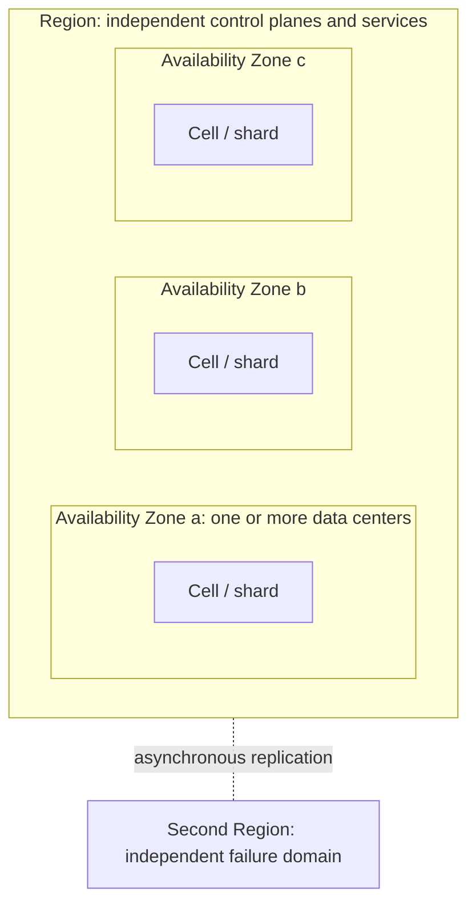
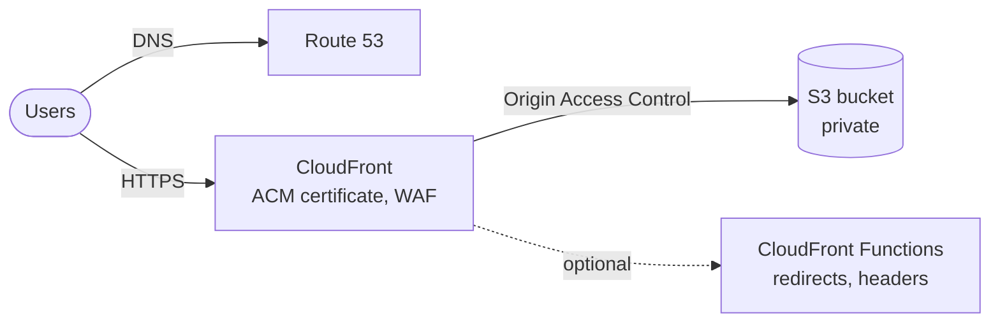
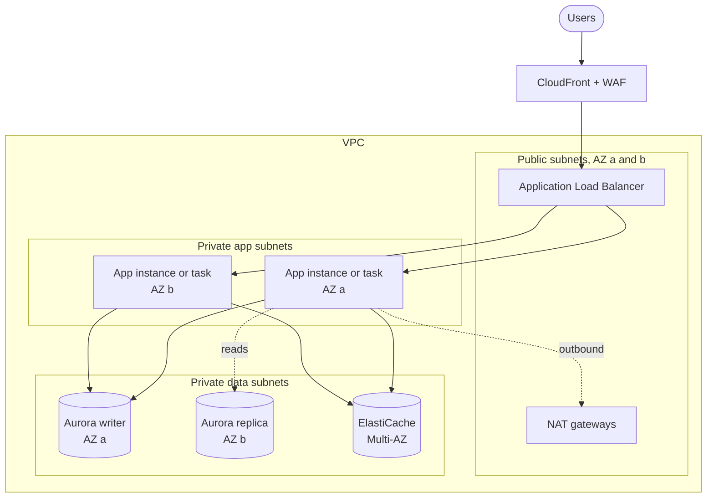
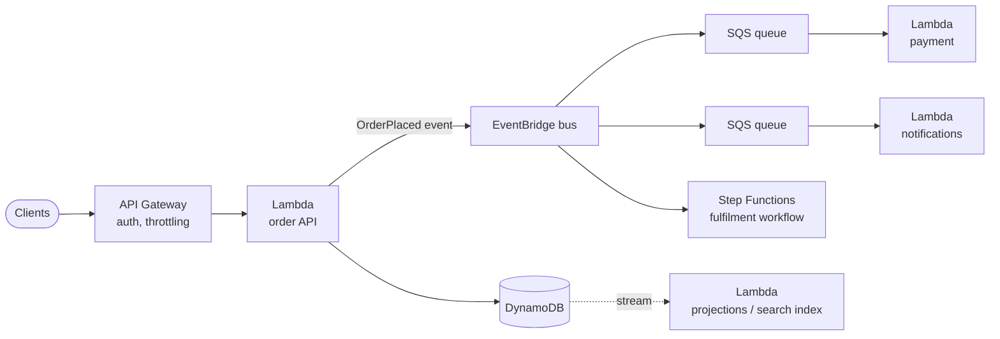
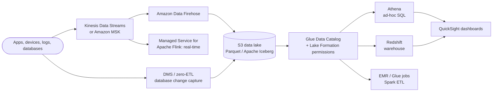
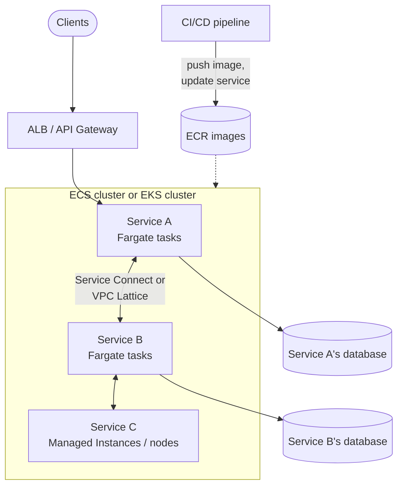
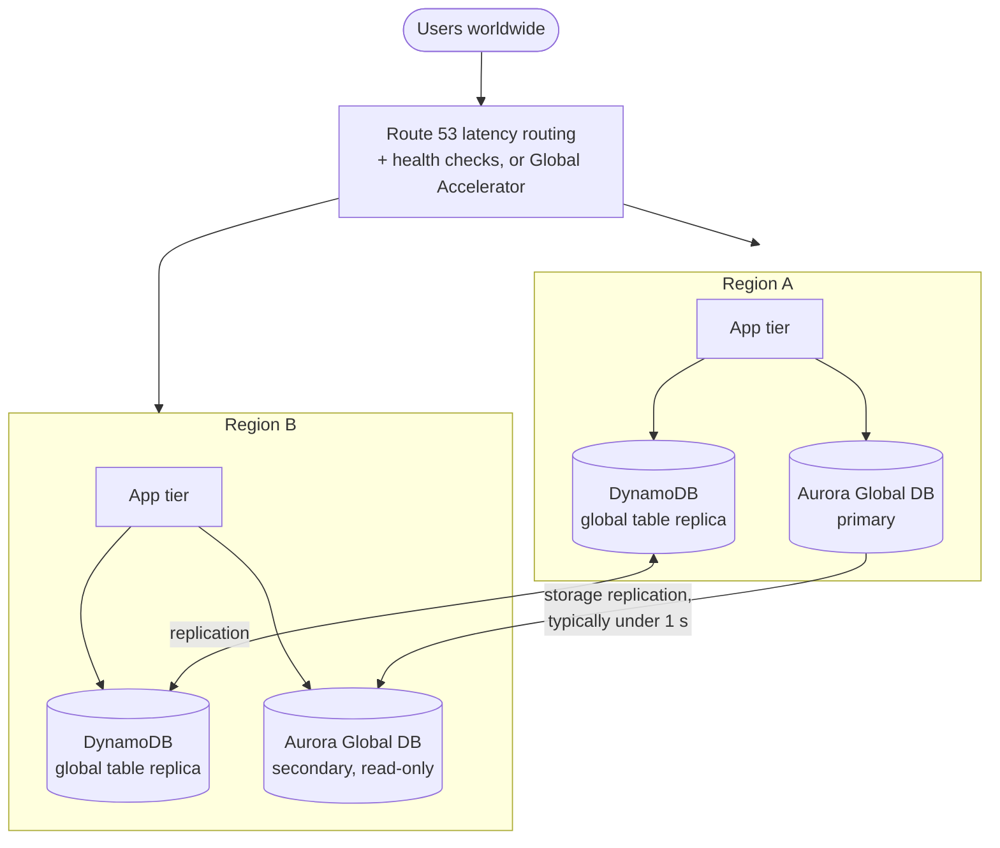
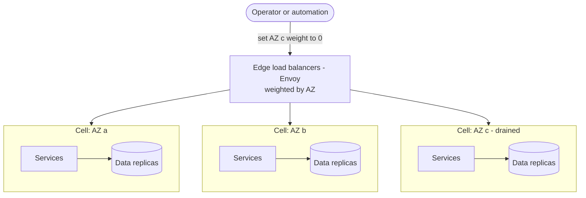

Individual AWS services are building blocks; reliability, cost, and operability come from how they are assembled. This page starts with the principles AWS and its large customers design against, then walks through six reference architectures in rough order of complexity, and closes with publicly documented case studies whose lessons generalize. Service details are on the [Compute](compute.html), [Database](databases.html), [Networking](networking.html), and [Storage](storage.html) pages; general theory is in [Resilience Patterns](../../distributed-systems/resilience-patterns.html).

---

## Design Principles

### The Well-Architected Framework

AWS's **Well-Architected Framework** organizes design review around six pillars. It is less a checklist than a set of questions to ask of every workload; the free **Well-Architected Tool** in the console records the answers and tracks remediation.

| Pillar | Central question | Typical practices |
|--------|------------------|-------------------|
| **Operational excellence** | Can we run, observe, and change this safely? | Infrastructure as code, small reversible deployments, runbooks, post-incident reviews |
| **Security** | Is every layer protected and every action attributable? | Least-privilege IAM, encryption everywhere, centralized logging, multi-account isolation |
| **Reliability** | Does it recover from failure and scale with demand? | Multi-AZ by default, health checks and automatic replacement, backups tested by restore, quotas monitored |
| **Performance efficiency** | Are we using the right resource types, and do we re-evaluate them? | Managed and serverless services, caching, current instance generations, load testing |
| **Cost optimization** | Do we pay only for the value we get? | Right-sizing, commitments for steady load, Spot, scaling to zero, cost attribution (see [Cost Optimization](cost.html)) |
| **Sustainability** | Are we minimizing the resources needed per unit of work? | High utilization, efficient instance types (such as Graviton), data lifecycle policies |

### Fault isolation boundaries

AWS infrastructure is built in nested failure domains, and architectures inherit their resilience from which boundaries they span:

- **Availability Zones** have independent power, cooling, and networking, and are close enough for synchronous replication. Running across **at least two AZs, preferably three**, is the baseline for production.
- **Regions** are fully independent. Spanning Regions protects against Regional events but brings asynchronous replication, higher latency between copies, and much more operational complexity; it is justified by explicit recovery objectives, not by default.
- **Cells** are copies of a whole stack that each serve a subset of customers or traffic. A bad deployment or poison request then affects one cell rather than everyone. AWS uses cell-based designs extensively in its own services.
- **Static stability** means a system keeps working during a failure *without* needing to make changes, for example by pre-provisioning enough capacity in the surviving AZs instead of relying on launching new instances during an incident (control-plane APIs are often the first thing to degrade).

---

## Reference Architectures

### Pattern 1: Static website

A static site (documentation, marketing, a single-page application) needs no servers at all.

| Component | Role |
|-----------|------|
| **S3** | Stores the built files; the bucket stays private |
| **CloudFront** | Serves content from edge locations, terminates TLS with an **ACM** certificate (issued in us-east-1 for CloudFront), caches aggressively |
| **Origin Access Control (OAC)** | Lets only CloudFront read the bucket; replaces the older Origin Access Identity |
| **Route 53** | Alias records pointing the domain at the distribution |

Use the S3 REST endpoint with OAC rather than the S3 *website* endpoint, which supports only HTTP and requires a public bucket. Cost is typically a few dollars a month or less for modest traffic. **Evolution:** add API Gateway and Lambda (Pattern 3) for dynamic features.

### Pattern 2: Three-tier web application

The classic presentation / application / data split, deployed across AZs.

| Tier | Services | Notes |
|------|----------|-------|
| Edge | CloudFront, AWS WAF | Caches static assets; filters common attacks before they reach the VPC |
| Load balancing | Application Load Balancer | Spans public subnets in each AZ; health checks drive replacement |
| Application | EC2 Auto Scaling group, or ECS/EKS services | Stateless; sessions in ElastiCache or DynamoDB so any instance can serve any user |
| Data | RDS Multi-AZ or Aurora; ElastiCache | Private subnets only; security groups allow traffic from the app tier alone |

Keep the application tier stateless so scaling and replacement are routine. Add VPC gateway endpoints for S3 and DynamoDB so that traffic avoids NAT charges. **Evolution:** move the app tier to containers on Fargate, or split hot paths into serverless functions.

### Pattern 3: Serverless API and event-driven processing

| Component | Role |
|-----------|------|
| **API Gateway** (or Lambda function URLs, or an ALB) | HTTP front door with authentication (Cognito, JWT, IAM) and throttling |
| **Lambda** | One function per bounded piece of logic |
| **DynamoDB** | Storage that scales with Lambda without connection limits |
| **EventBridge** | Routes domain events to consumers by rule, decoupling producers from consumers |
| **SQS** | Buffers work between services, absorbs bursts, and retries with a dead-letter queue |
| **Step Functions** / Lambda durable functions | Multi-step workflows with retries, timeouts, and compensation |

Each part scales independently and costs nothing when idle. The engineering burden moves to the seams: **make every consumer idempotent** (events can be delivered more than once), set dead-letter queues and alarms on them, propagate trace context (X-Ray or OpenTelemetry), and watch for downstream systems that cannot scale as fast as Lambda. Very fine-grained decomposition has real overhead; see the [Prime Video case](#prime-video-when-serverless-granularity-costs-too-much) below.

### Pattern 4: Data and analytics pipeline

The design separates **ingestion**, **storage**, **cataloguing**, and **compute**, so each scales and is paid for independently, and the lake in S3 remains the durable source of truth. Current practice stores analytical tables in an open table format, usually **Apache Iceberg** (managed natively by **S3 Tables**), which adds transactions, schema evolution, and time travel on top of Parquet files and lets Athena, Redshift, EMR, and non-AWS engines share the same data. Kinesis Data Firehose was renamed **Amazon Data Firehose** in 2024, and Kinesis Data Analytics became **Managed Service for Apache Flink**.

### Pattern 5: Container microservices

| Concern | AWS option |
|---------|------------|
| Orchestration | **ECS** for simplicity and deep AWS integration; **EKS** for the Kubernetes API and ecosystem |
| Capacity | **Fargate** by default; ECS Managed Instances, EKS Auto Mode, or Karpenter-managed nodes for specialised hardware or density |
| Images | **ECR** with image scanning and immutable tags |
| Service-to-service traffic | **ECS Service Connect** (ECS), **VPC Lattice** (across VPCs, accounts, and compute types), or Istio/Linkerd on EKS |
| Discovery | **AWS Cloud Map** (used by Service Connect) or Kubernetes DNS |
| Deployment | Rolling or blue/green with automatic rollback on alarms |

**AWS App Mesh**, previously the standard answer for a managed service mesh, reaches end of support on 30 September 2026; new designs should not use it. Give each service its own datastore so teams can deploy independently, and resist splitting services more finely than team boundaries require.

### Pattern 6: Multi-Region

Multi-Region designs are chosen from a spectrum defined by the **recovery point objective (RPO)**, how much data loss is acceptable, and the **recovery time objective (RTO)**, how long recovery may take:

| Strategy | Secondary Region runs | Typical RPO / RTO | Relative cost |
|----------|-----------------------|-------------------|---------------|
| **Backup and restore** | Nothing; backups are copied there | Hours / hours to a day | Lowest |
| **Pilot light** | Data replication only; compute is off or at zero | Minutes / tens of minutes | Low |
| **Warm standby** | A scaled-down but working copy of the full stack | Seconds to minutes / minutes | Medium |
| **Multi-site active/active** | Full stacks serving live traffic in every Region | Near zero (zero with synchronous stores) / near zero | Highest |

Data is the hard part. DynamoDB global tables accept writes in every Region (last-writer-wins by default, or multi-Region strong consistency across three Regions); Aurora Global Database has one writer Region and promotes a secondary on failover; Aurora DSQL offers active-active strongly consistent SQL across peered Regions. Whatever the store, the application must tolerate replication lag or pay the latency of synchronous replication.

Operational rules that separate multi-Region designs that work from those that do not:

- **Fail over with data-plane actions** (health-check-driven DNS, Application Recovery Controller routing controls) rather than by creating resources during the incident.
- **Exercise the failover regularly**, including failing back. An untested secondary Region is a hope, not a plan.
- **Audit hidden dependencies** on a single Region: identity providers, CI/CD, secrets, DNS management, and global services whose control planes live in one Region.

---

## Case Studies

The following are drawn from the companies' own engineering publications and AWS's public post-event summaries. Figures are as published at the time.

### Netflix: cloud-native from the ground up

**Background.** After a major database corruption in 2008 halted DVD shipping for three days, Netflix decided to move off its own data centers. The migration to AWS took until January 2016 and was deliberately *not* a lift-and-shift: Netflix rebuilt nearly all of its technology as hundreds of microservices, moved from a monolithic relational database to distributed NoSQL stores, and adopted continuous delivery.

**What runs where.** AWS hosts the control plane: sign-up, browsing, personalization, recommendations, playback authorization, and the data platform. The video bytes themselves do **not** come from AWS; they are served by **Open Connect**, Netflix's own CDN of appliances placed inside ISP networks and at interconnection points. This split, a cloud control plane with a purpose-built delivery network, is common at very large media scale.

**Resilience practices.**

- **Chaos engineering.** Chaos Monkey (introduced in 2011, open-sourced in 2012) randomly terminates production instances so that every service is built to survive instance loss. Later tools extended this to larger failures, up to evacuating an entire AWS Region (Chaos Kong).
- **Multi-Region active-active.** Netflix runs its services in several AWS Regions, each able to take over another's traffic, with data replicated between Regions by its Cassandra and EVCache tiers.
- **Open-source tooling** such as Spinnaker (continuous delivery), Eureka (discovery), and Zuul (edge gateway) came out of this work.

**Lesson.** Resilience came from assuming failure is constant and testing that assumption continuously in production, not from any single AWS feature.

Source: [Completing the Netflix Cloud Migration](https://about.netflix.com/en/news/completing-the-netflix-cloud-migration) (Netflix, 2016).

### Slack: sharding and cellular architecture

**Data tier.** Slack originally sharded MySQL by workspace. As large enterprise customers grew beyond what one shard could hold, and products such as shared channels between organizations broke the one-workspace-per-shard assumption, Slack migrated to **Vitess**, which shards MySQL flexibly (for example by channel) behind a single query interface. The migration ran from 2017 to the end of 2020; at the time Vitess served about 2.3 million queries per second at peak.

**Gray AZ failure.** On 30 June 2021 a network problem in a single AZ caused user-visible errors even though Slack ran across several AZs: the failure was partial, so health checks did not remove the bad AZ, and services kept sending it traffic. Slack's response was to restructure into **AZ-aligned cells**:

Services talk only to other services in the same AZ, so an AZ can be removed from service by changing edge weights. Drains propagate in seconds, against a goal of removing traffic from an impaired AZ in under five minutes.

**Lesson.** Multi-AZ deployment is not the same as AZ fault isolation. Being able to *drain* a failure domain quickly, without diagnosing it first, handles partial failures that health checks miss.

Sources: [Scaling Datastores at Slack with Vitess](https://slack.engineering/scaling-datastores-at-slack-with-vitess/) (2020); [Slack's Migration to a Cellular Architecture](https://slack.engineering/slacks-migration-to-a-cellular-architecture/) (2023).

### Prime Video: when serverless granularity costs too much

In 2023 Amazon's Prime Video team described a stream-quality monitoring tool originally built as distributed components orchestrated by **Step Functions**, with **Lambda** functions exchanging video frames through **S3**. At scale, the per-state-transition orchestration charges and the S3 traffic between steps dominated cost, and the system hit scaling limits well below its target load. The team consolidated the components into a single process running on **ECS**, passing data in memory, and reported infrastructure cost reductions of over 90% while scaling further.

**Lesson.** The right granularity depends on the data flow. Serverless orchestration is cheap for coarse-grained, event-driven steps, and expensive when high-volume data has to cross a network boundary between every step. Reassess the decomposition when the workload's shape changes.

### AWS us-east-1, October 2025: Regional dependencies

On 19 and 20 October 2025, a latent race condition in DynamoDB's automated DNS management removed all IP addresses from the DynamoDB regional endpoint in US East (N. Virginia). DynamoDB was unreachable for several hours, and because many AWS services depend on it internally, EC2 instance launches, Network Load Balancer health checks, Lambda, ECS/EKS/Fargate, STS, and console sign-in were impaired for up to about 15 hours in total. AWS disabled the automation worldwide pending a fix.

**Lessons.**

- A single-Region architecture inherits the availability of that Region's shared dependencies, however many AZs it spans.
- Recovery plans that need to **launch** capacity or **change** configuration during an incident are exposed to the same control-plane impairments; static stability (pre-provisioned capacity, data-plane failover) is what kept well-prepared workloads running.
- Identity and authentication paths (STS, SSO) are dependencies too; check that failover procedures can run when they are degraded.

Source: [Summary of the Amazon DynamoDB Service Disruption in the Northern Virginia (US-EAST-1) Region](https://aws.amazon.com/message/101925/) (AWS, 2025).

---

## Recurring Lessons

Across these patterns and cases, a small set of principles recurs:

1. **Start with the simplest architecture that meets the requirements**, and add complexity (more services, more Regions) only for a measured need. Every case above evolved incrementally.
2. **Design for failure at every boundary**: instance, AZ, dependency, and Region. Decide in advance how each failure is detected and what happens automatically.
3. **Isolate failure domains** with cells, per-service datastores, and bulkheads, so a problem affects a fraction of users rather than all of them.
4. **Prefer static stability**: pre-provision headroom and use data-plane mechanisms for failover.
5. **Test recovery, not just deployment**: game days, chaos experiments (AWS Fault Injection Service), and restore drills.
6. **Treat cost as an architectural property**, measured per request or per customer, and revisit decomposition when it drifts.

---

## See Also

- [AWS Hub](./) - Overview of all AWS documentation
- [Compute Services](compute.html) - EC2, Lambda, ECS, Fargate, and EKS building blocks
- [Database Services](databases.html) - RDS, Aurora, DynamoDB global tables
- [Networking & Content Delivery](networking.html) - VPC, load balancers, and CloudFront
- [Cost Optimization](cost.html) - Commitments, Spot, and data transfer costs
- [Infrastructure as Code](iac.html) - Build these patterns with CloudFormation, CDK, or Terraform
- [Resilience Patterns](../../distributed-systems/resilience-patterns.html) - Bulkheads, retries, and circuit breakers in general
- [Kubernetes](../kubernetes/) - Container orchestration concepts behind EKS
