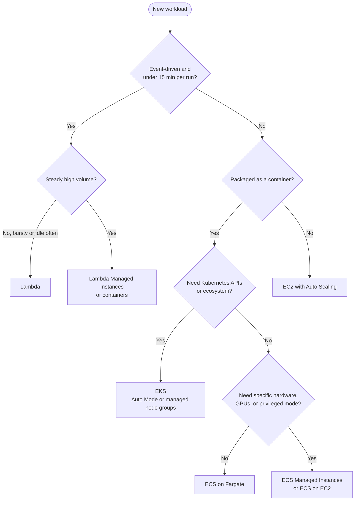
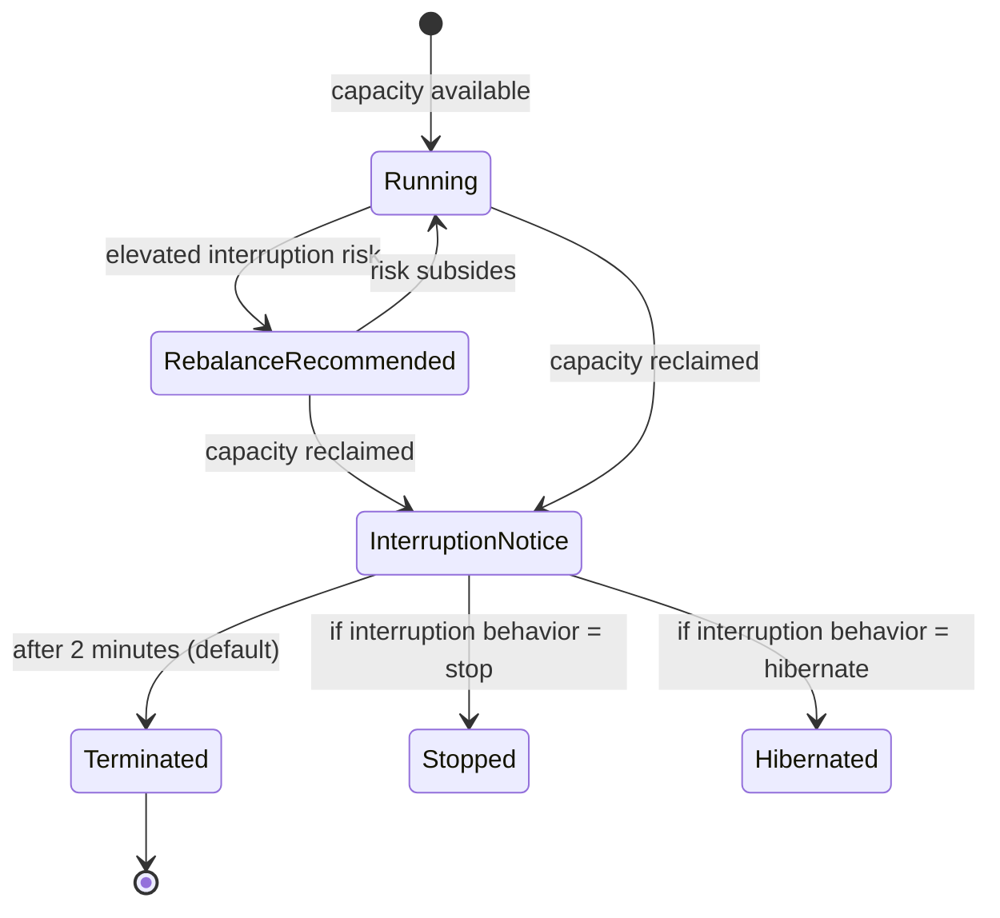
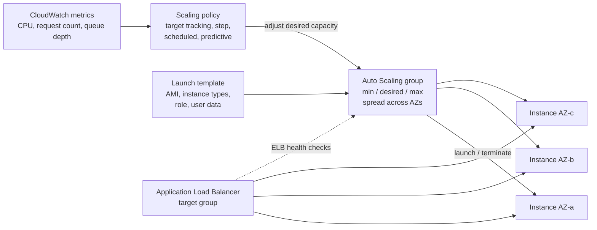

AWS offers several ways to run code, and they differ mainly in **how much of the stack you manage**: with EC2 you run whole virtual machines; with ECS and EKS you run containers on capacity that you or AWS manage; with Lambda you upload a function and AWS handles everything below it. This page covers each model, how it works, its limits and pricing levers, and how to choose between them. Pricing strategy across services is covered in [Cost Optimization](cost.html); network placement (VPCs, subnets, load balancers) in [Networking](networking.html).

---

## Choosing a Compute Option

Moving down the table below, you give up control of the host in exchange for less operational work.

| Option | Unit you deploy | You manage | Billing | Typical fit |
|--------|-----------------|------------|---------|-------------|
| **EC2** | Virtual machine | OS, patching, scaling, runtime | Per second while running | Lift-and-shift, stateful servers, custom kernels/drivers, GPU hosts |
| **ECS or EKS on EC2** | Container | Cluster hosts (AMI, patching, capacity) | EC2 instance price | Container fleets needing specific hardware or high utilization |
| **ECS Managed Instances / EKS Auto Mode** | Container | Instance *requirements* only | EC2 price plus a management fee | Containers on EC2 economics without host operations |
| **Fargate** | Container (task/pod) | Nothing below the container | vCPU and GB per second | Services and jobs with no host requirements |
| **Lambda** | Function | Code and configuration | Per request plus GB-seconds | Event-driven, bursty, short-lived work; scales to zero |



A rough rule: start as far down the stack as the workload allows (Lambda or Fargate), and move to EC2 only when a concrete requirement (hardware, licensing, long-lived connections, sustained utilization that makes per-second serverless pricing expensive) forces it.

---

## Amazon EC2

**Amazon Elastic Compute Cloud (EC2)** provides virtual machines ("instances") launched from an **Amazon Machine Image (AMI)** into a subnet of a VPC. Almost all current instance types run on the **AWS Nitro System**, which offloads networking, storage, and security to dedicated hardware so that close to all of the host's CPU and memory goes to the guest. Instances are billed per second (60-second minimum) for Linux while running; attached EBS volumes are billed whether or not the instance is running.

### Instance types

An instance type name encodes its family, generation, processor, and extras:

```text
  m  8  g  d . 2xlarge
  │  │  │  │   └── size: vCPU/memory scale (large = 2 vCPU, each step up doubles)
  │  │  │  └────── option: d = local NVMe instance store, n = enhanced networking, e = extra memory/storage
  │  │  └───────── processor: g = AWS Graviton (Arm), i = Intel, a = AMD
  │  └──────────── generation: higher is newer and usually better price-performance
  └─────────────── family: m = general purpose, c = compute, r = memory, ...
```

| Family | Optimized for | Current-generation examples | Typical workloads |
|--------|---------------|-----------------------------|-------------------|
| **T** (burstable) | Low baseline CPU with burst credits | T4g, T3, T8i | Dev/test, small sites, low-traffic services |
| **M** (general purpose) | Balanced CPU:memory (1:4) | M8g, M7i, M8i, M7a, M9g | Application servers, mid-size databases |
| **C** (compute) | High CPU:memory (1:2) | C8g, C7i, C8i, C9g | Batch, encoding, high-throughput web tiers, HPC |
| **R / X** (memory) | High memory per vCPU (1:8 and above) | R8g, R7i, R8i, R9g, X2 | In-memory caches, large relational databases, analytics |
| **I / D** (storage) | Dense local NVMe or HDD | I4i, I8g, D3 | NoSQL stores, search indexes, data warehousing |
| **P / G / Trn / Inf** (accelerated) | GPUs or AWS ML chips | P5, P6, G6, G6e, G7, Trn2, Inf2 | Model training and inference, rendering, video |

Notes on choosing:

- **Graviton (Arm) instances** usually give the best price-performance for software that runs on arm64 (most Linux distributions, JVM/Go/Python/Node runtimes, containers built multi-arch). Graviton4 powers the 8g families; the Graviton5-based 9g families (M9g, C9g, R9g) are the newest, and AWS quotes up to 25% better compute performance for M9g than M8g.
- **Burstable T instances** accrue CPU credits below their baseline and spend them above it. T3/T4g default to *unlimited* mode, which bills for surplus credits: a T instance pinned at high CPU can cost more than an M instance of the same size.
- Instance type availability varies by Region and Availability Zone. Specifying several interchangeable types (see [attribute-based selection](#spot-instances)) avoids capacity errors.

### Purchasing options

The same instance can be bought several ways. The discount comes from commitment (Savings Plans, Reserved Instances) or from accepting interruption (Spot).

| Option | Discount vs On-Demand | Commitment | Notes |
|--------|----------------------|------------|-------|
| **On-Demand** | None | None | Per-second billing; the baseline |
| **Compute Savings Plans** | Up to 66% | Hourly spend for 1 or 3 years | Applies across instance family, size, Region, OS, and to Fargate and Lambda |
| **EC2 Instance Savings Plans** | Up to 72% | Hourly spend for 1 or 3 years, one family in one Region | Size, OS, and tenancy can change |
| **Reserved Instances** | Up to 72% | Specific instance attributes, 1 or 3 years | Largely superseded by Savings Plans for EC2; still the mechanism for RDS, ElastiCache, OpenSearch, Redshift |
| **Spot Instances** | Up to 90% | None | Can be reclaimed with a 2-minute warning |
| **On-Demand Capacity Reservations / Capacity Blocks for ML** | None (billed On-Demand) | Duration of the reservation | Guarantees capacity in an AZ; Capacity Blocks reserve GPU instances for fixed windows |

Savings Plans and Reserved Instances are billing constructs: they do not change how an instance runs, and they apply automatically to matching usage. See [Cost Optimization](cost.html#commitment-discounts) for how to size a commitment.

### Spot Instances

Spot Instances use spare EC2 capacity at a steep discount. The trade-off is that EC2 can reclaim the instance when it needs the capacity back. The price itself changes slowly and is rarely the reason for interruption; capacity is.



Both the **rebalance recommendation** and the **two-minute interruption notice** are published to instance metadata and as EventBridge events, so an application or an Auto Scaling group can drain work before the instance disappears.

Practices that make Spot reliable:

- **Diversify.** Allow many instance types across all AZs. The more capacity pools a workload can use, the less likely it is to be interrupted or unable to launch. **Attribute-based instance type selection** (specify vCPU and memory ranges instead of type names) does this automatically and picks up new generations.
- **Use the `price-capacity-optimized` allocation strategy**, which favors the pools with the most spare capacity and then the lowest price.
- **Do not set a maximum price** unless you have a specific reason; the default cap is the On-Demand price, and a low cap mostly increases interruptions.
- **Launch through Auto Scaling groups, EC2 Fleet, or `run-instances`.** AWS describes the `RequestSpotInstances` API and Spot Fleet as legacy APIs with no planned investment.
- **Make work interruptible:** checkpoint long jobs, keep state off the instance, and handle `SIGTERM` in containers.

```bash
# One-off Spot instance through the standard RunInstances API
aws ec2 run-instances \
  --launch-template LaunchTemplateName=batch-worker,Version='$Latest' \
  --instance-market-options 'MarketType=spot,SpotOptions={SpotInstanceType=one-time,InstanceInterruptionBehavior=terminate}'
```

Good Spot workloads: CI runners, batch and data processing, rendering, stateless web tiers behind a load balancer (mixed with an On-Demand base), and Kubernetes worker nodes managed by Karpenter or EKS Auto Mode.

### Operating EC2 instances

| Concern | Current practice |
|---------|------------------|
| **Operating system** | Amazon Linux 2023 (uses `dnf`; the older Amazon Linux 2 was scheduled to reach end of support on 30 June 2026), or a vendor distribution. Bottlerocket for container hosts. |
| **Shell access** | AWS Systems Manager **Session Manager** (`aws ssm start-session --target i-...`) instead of SSH keys and open port 22. Access is controlled by IAM and logged. EC2 Instance Connect is an alternative for short-lived SSH keys. |
| **Credentials** | Attach an **IAM role** through an instance profile; never store access keys on an instance. |
| **Instance metadata** | Require **IMDSv2** (session-token metadata). It blocks the SSRF-style credential theft that IMDSv1 allowed and is the default for new AMIs such as AL2023. |
| **Recovery** | Supported instance types have **simplified automatic recovery** on by default: an instance that fails a system status check (host problem) is moved to healthy hardware, keeping its ID, private IP, and EBS volumes. For stateless fleets, rely on Auto Scaling health checks instead. |
| **Addressing** | Public IPv4 addresses, including Elastic IPs, are billed hourly (since February 2024), whether attached or not. Put instances in private subnets behind a load balancer and use Elastic IPs only where a fixed address is required. |
| **Right-sizing** | **AWS Compute Optimizer** analyses CloudWatch utilization and recommends smaller, larger, or Graviton instance types. Install the CloudWatch agent to include memory metrics in its analysis. |
| **Storage** | EBS volumes persist independently; instance store (the `d` variants) is erased when the instance stops. Use gp3 rather than gp2 for general-purpose volumes. See [Storage](storage.html). |

```bash
# Launch an AL2023 instance with IMDSv2 required and an instance profile, no SSH key
aws ec2 run-instances \
  --image-id resolve:ssm:/aws/service/ami-amazon-linux-latest/al2023-ami-kernel-default-arm64 \
  --instance-type t4g.small \
  --subnet-id subnet-0abc1234 \
  --security-group-ids sg-0abc1234 \
  --iam-instance-profile Name=ssm-managed-instance \
  --metadata-options HttpTokens=required,HttpEndpoint=enabled \
  --tag-specifications 'ResourceType=instance,Tags=[{Key=Name,Value=web-01},{Key=Owner,Value=platform}]'
```

The `resolve:ssm:` prefix looks up the latest AMI ID from a public SSM parameter, so scripts do not hard-code Region-specific AMI IDs.

### Common EC2 problems

| Problem | Symptom | Remedy |
|---------|---------|--------|
| Idle or forgotten instances | Spend with no traffic | Mandatory `Owner` tags, Compute Optimizer idle findings, scheduled stop for non-production |
| Lost SSH key | Cannot log in | Session Manager (requires the SSM agent and an instance role) |
| Public IP changed | DNS or allow-lists break after stop/start | Use a load balancer or DNS name; Elastic IP only if a fixed IP is truly required |
| T instance slow or costly | CPU throttled (standard mode) or surplus-credit charges (unlimited mode) | Move sustained workloads to M or C families |
| `InsufficientInstanceCapacity` | Launch fails in one AZ | Allow multiple instance types and AZs; use Capacity Reservations for must-launch capacity |

---

## EC2 Auto Scaling

A single instance forces a choice between paying for peak capacity all day or failing at peak. An **Auto Scaling group (ASG)** removes that choice by keeping a *desired capacity* of instances across several AZs and changing it in response to demand.



| Component | Role |
|-----------|------|
| **Launch template** | Versioned blueprint for new instances: AMI, instance type(s), security groups, instance profile, user data, metadata options |
| **Auto Scaling group** | Holds min, max, and desired capacity; balances instances across AZs; replaces instances that fail health checks |
| **Scaling policy** | Changes desired capacity based on metrics or a schedule |
| **Load balancer target group** | Routes traffic to healthy instances; with ELB health checks enabled, the ASG also replaces instances the load balancer marks unhealthy |

### Scaling policies

| Policy | How it decides | Use for |
|--------|----------------|---------|
| **Target tracking** | Holds a metric near a target (for example 50% average CPU, or 1,000 requests per target) | The default for most services |
| **Step scaling** | Adds or removes capacity in tiers as an alarm breaches thresholds | Very bursty load where the size of the response should grow with the breach |
| **Scheduled** | Sets capacity at fixed times | Known patterns: business hours, batch windows, launches |
| **Predictive** | Forecasts load from recent history (up to 14 days) and scales ahead of it | Regular daily/weekly cycles with slow instance start-up |

```bash
# Keep average CPU near 50% (the group's min/max still bound the result)
aws autoscaling put-scaling-policy \
  --auto-scaling-group-name web-asg \
  --policy-name cpu50 \
  --policy-type TargetTrackingScaling \
  --target-tracking-configuration '{
    "PredefinedMetricSpecification": {"PredefinedMetricType": "ASGAverageCPUUtilization"},
    "TargetValue": 50.0
  }'
```

Other features worth knowing:

- **Mixed instances policy** combines an On-Demand base (for example two instances) with Spot above it, across several instance types, in one group.
- **Capacity Rebalancing** launches a replacement when a Spot instance receives a rebalance recommendation, before the interruption arrives.
- **Warm pools** keep pre-initialized, stopped instances ready, cutting scale-out time for applications with long boot or warm-up.
- **Instance refresh** rolls a new launch template version (for example a patched AMI) through the group in batches, with checkpoints and automatic rollback.
- **Lifecycle hooks** pause instances on launch or termination so scripts can register, drain connections, or ship logs.

---

## AWS Lambda

**AWS Lambda** runs a function in response to an event (an HTTP request through API Gateway or a function URL, an S3 upload, a message on SQS, a DynamoDB stream record, a schedule) and bills for the requests and the compute time used. There are no instances to manage, and a function with no traffic costs nothing.

### Execution model

Each concurrent request is served by an **execution environment**: a Firecracker microVM with the configured memory, the runtime, and the function code. An environment handles one request at a time and is reused for later requests, so anything created outside the handler (SDK clients, database connections, loaded models) is reused too.

```mermaid
sequenceDiagram
    participant S as Event source
    participant L as Lambda service
    participant E as Execution environment
    S->>L: Invoke
    alt No idle environment (cold start)
        L->>E: Create microVM, download code
        E->>E: INIT: start runtime, run code outside handler
    end
    L->>E: INVOKE: run handler(event, context)
    E-->>L: Response
    L-->>S: Response (sync) or ack (async)
    Note over E: Environment stays warm for reuse;<br/>idle environments are eventually shut down
```

A **cold start** is the INIT phase: creating the environment and running initialization code. It typically adds from under 100 ms (small Node.js or Python functions) to several seconds (large Java or .NET applications, heavy dependencies). Since August 2025, time spent in INIT is billed for all on-demand functions, which makes lean initialization a cost concern as well as a latency one.

Concurrency is the number of environments serving requests at once. The default Regional quota is 1,000 concurrent executions (lower on new accounts, raised automatically with usage), and each function can scale by 1,000 environments every 10 seconds. **Reserved concurrency** caps a function (and guarantees it that share); **provisioned concurrency** keeps a number of environments initialized ahead of time.

### Invocation models

| Model | Sources | Error handling |
|-------|---------|----------------|
| **Synchronous** | API Gateway, function URLs, ALB, SDK `Invoke` | The caller receives the error and decides whether to retry |
| **Asynchronous** | S3, SNS, EventBridge, SDK with `InvocationType=Event` | Lambda queues the event and retries twice; failures go to an on-failure destination or dead-letter queue |
| **Event source mapping (polling)** | SQS, Kinesis, DynamoDB Streams, Kafka (MSK or self-managed), Amazon MQ | Lambda polls and invokes in batches; use partial batch responses so one bad record does not force the whole batch to retry |

### Quotas and limits

| Limit | Value |
|-------|-------|
| Maximum timeout | 900 seconds (15 minutes) |
| Memory | 128 MB to 10,240 MB; CPU scales with memory (about 1 vCPU at 1,769 MB, up to 6 vCPUs) |
| Ephemeral storage (`/tmp`) | 512 MB to 10,240 MB |
| Deployment package | 50 MB zipped for direct upload; 250 MB unzipped including layers; container images up to 10 GB |
| Payload | 6 MB request and response (synchronous); 200 MB for streamed responses; 1 MB for asynchronous events |
| Environment variables | 4 KB total |
| Layers | 5 per function |

### Pricing

Lambda charges per request and per GB-second of duration (memory size times execution time, rounded up to the millisecond). **arm64 (Graviton)** functions are priced about 20% lower per GB-second than x86_64 and usually run as fast or faster. Because CPU is proportional to memory, raising memory often *reduces* cost for CPU-bound functions by shortening duration; the open-source **AWS Lambda Power Tuning** tool measures this empirically. Compute Savings Plans apply to Lambda duration.

### Reducing cold starts

| Technique | Effect | Trade-off |
|-----------|--------|-----------|
| Keep packages and initialization small | Shorter INIT for every cold start | Engineering effort; avoid importing large libraries you do not need |
| **SnapStart** (Java 11+, Python 3.12+, .NET 8+) | Restores environments from a cached snapshot taken after INIT; sub-second starts for heavy runtimes | Code must tolerate snapshot reuse (regenerate unique IDs and randomness, re-establish connections); caching and restore charges for Python and .NET |
| **Provisioned concurrency** | Environments pre-initialized; double-digit-millisecond starts | Billed while provisioned, used or not; cannot be combined with SnapStart |
| Choose a lighter runtime | Node.js, Python, Go, and Rust start faster than JVM or .NET without SnapStart | May not match the team's stack |

Scheduled "keep-warm" pings are a legacy workaround: they keep only one environment warm and do nothing for concurrent bursts.

### Handler examples

An S3 upload handler. Object keys in S3 events are URL-encoded, so decode them before use:

```python
import urllib.parse
import boto3

s3 = boto3.client("s3")  # created once per environment, reused across invocations

def lambda_handler(event, context):
    for record in event["Records"]:
        bucket = record["s3"]["bucket"]["name"]
        key = urllib.parse.unquote_plus(record["s3"]["object"]["key"])
        body = s3.get_object(Bucket=bucket, Key=key)["Body"]
        for line in body.iter_lines():  # stream; do not read large objects into memory
            process(line)
```

An HTTP handler behind API Gateway (REST API proxy integration, payload format 1.0):

```python
import json

def lambda_handler(event, context):
    method = event["httpMethod"]
    if method == "GET":
        return {"statusCode": 200, "body": json.dumps({"message": "hello"})}
    if method == "POST":
        data = json.loads(event.get("body") or "{}")
        return {"statusCode": 201, "body": json.dumps({"created": True, "id": data.get("id")})}
    return {"statusCode": 405, "body": ""}
```

HTTP APIs and function URLs default to payload format 2.0, where the method is at `event["requestContext"]["http"]["method"]`.

### Long-running and stateful work

The 15-minute limit and one-request-per-environment model shape how larger jobs are built:

| Need | Option |
|------|--------|
| Multi-step workflow across AWS services, visual definition, native service integrations | **AWS Step Functions** (Standard workflows run up to one year; Express workflows for high-volume, short runs). A `Map` state fans out over large datasets. |
| Multi-step workflow written as ordinary code inside Lambda | **Lambda durable functions** (launched late 2025): an SDK for JavaScript/TypeScript, Python, and Java that checkpoints each step and replays on resume. Executions can last up to a year and are not billed while waiting. |
| Steady high-volume traffic, EC2 pricing, specialised instance types | **Lambda Managed Instances**: functions run on EC2 instances in your account that Lambda provisions, patches, and scales. One environment serves multiple concurrent requests, Savings Plans and RIs apply, and AWS adds a 15% management fee. There are no cold starts, but it does not scale to zero. |
| Work longer than 15 minutes in a container | ECS on Fargate, or AWS Batch |

### Common Lambda problems

| Problem | Symptom | Remedy |
|---------|---------|--------|
| Cold-start latency | Slow first requests or bursts | Trim dependencies; SnapStart; provisioned concurrency for strict latency targets |
| Timeout | `Task timed out after N seconds` | Split work into Step Functions or durable function steps; check for slow downstream calls with X-Ray |
| Out of memory | `Runtime exited with error: signal: killed` | Stream data; increase memory (which also adds CPU) |
| Package too large | Upload rejected | Move dependencies to layers or package as a container image |
| Throttling | `Rate Exceeded` / `TooManyRequestsException` | Request a concurrency quota increase; reserve concurrency for critical functions; buffer with SQS |
| Database connection exhaustion | RDS `too many connections` under load | **RDS Proxy** to pool connections, or a database with an HTTP/serverless interface (DynamoDB, Aurora DSQL) |
| Recursive loops | Runaway invocations and cost | Lambda detects and stops common SQS/SNS/S3 loops, but design triggers so a function never writes to its own source |

---

## Containers: ECS, Fargate, and EKS

Many teams package applications as containers (see [Docker](../docker/)) and hand them to an orchestrator. AWS has two:

- **Amazon ECS (Elastic Container Service)**, AWS's own orchestrator. Simpler API, deep integration with IAM, ALB, CloudWatch, and Service Connect; no control-plane fee.
- **Amazon EKS (Elastic Kubernetes Service)**, managed Kubernetes. Use it when you want the Kubernetes API, its tooling (Helm, operators, Argo CD), or portability across clouds. EKS charges per cluster-hour for the control plane. See the [Kubernetes guide](../kubernetes/).

### ECS concepts

| Concept | Meaning |
|---------|---------|
| **Task definition** | Versioned JSON blueprint: container images, CPU and memory, ports, IAM roles, log configuration |
| **Task** | A running instance of a task definition (one or more containers that share a network namespace) |
| **Service** | Keeps N tasks running, replaces failed ones, registers them with a load balancer, and performs rolling or blue/green deployments |
| **Cluster** | Logical grouping of services and tasks and the capacity they run on |
| **Capacity provider** | Links a cluster to capacity (Fargate, Fargate Spot, an Auto Scaling group, or Managed Instances) with a weighting strategy |

### Where containers run

| Capacity | Who manages hosts | Choose when |
|----------|-------------------|-------------|
| **Fargate** | AWS; each task gets its own isolated micro-VM | Default choice; variable or modest workloads; no host access needed. **Fargate Spot** cuts cost up to 70% for interruptible tasks. |
| **ECS Managed Instances** | AWS provisions, patches, and scales EC2 instances in your account | You want EC2 pricing, instance choice (including GPUs), and denser packing without running hosts |
| **EC2 (self-managed)** | You manage the ASG, AMI, and ECS agent | Custom AMIs, privileged containers, special kernel settings, or existing Capacity Reservations |
| **EKS Auto Mode** | AWS runs Karpenter-based node provisioning, load balancer and storage controllers, and patches nodes (21-day maximum node lifetime) | Kubernetes with minimal node operations |
| **EKS managed node groups / Karpenter** | You own node configuration and upgrades | Full control of Kubernetes data plane |

A minimal Fargate task definition. The **execution role** lets ECS pull the image and write logs; the **task role** is what the application itself uses to call AWS APIs:

```json
{
  "family": "web-app",
  "networkMode": "awsvpc",
  "requiresCompatibilities": ["FARGATE"],
  "runtimePlatform": { "cpuArchitecture": "ARM64", "operatingSystemFamily": "LINUX" },
  "cpu": "256",
  "memory": "512",
  "executionRoleArn": "arn:aws:iam::123456789012:role/ecsTaskExecutionRole",
  "taskRoleArn": "arn:aws:iam::123456789012:role/web-app-task",
  "containerDefinitions": [{
    "name": "web",
    "image": "123456789012.dkr.ecr.us-east-1.amazonaws.com/web-app:1.4.2",
    "essential": true,
    "portMappings": [{ "containerPort": 8080 }],
    "logConfiguration": {
      "logDriver": "awslogs",
      "options": {
        "awslogs-group": "/ecs/web-app",
        "awslogs-region": "us-east-1",
        "awslogs-stream-prefix": "web"
      }
    }
  }]
}
```

Pin images to an immutable tag or digest rather than `latest`, so a redeploy or task replacement cannot silently pick up a different image.

### Service-to-service networking

- **ECS Service Connect** gives ECS services short names, client-side load balancing, retries, and per-service metrics through a managed Envoy proxy.
- **Amazon VPC Lattice** connects services across VPCs and accounts, and across compute types (EC2, ECS, EKS, Lambda), with IAM-based auth policies.
- **AWS App Mesh** reaches end of support on **30 September 2026**, after which its console and resources are no longer accessible. AWS directs ECS users to Service Connect, and EKS users to VPC Lattice or an open-source mesh such as Istio.

---

## Other Compute Services

| Service | What it is | When it fits |
|---------|-----------|--------------|
| **AWS Batch** | Job queues and schedulers on top of EC2, Spot, Fargate, or EKS | Large batch and HPC jobs, array jobs, GPU training runs |
| **Elastic Beanstalk** | Platform that deploys an application onto EC2, ASG, and a load balancer it manages | Traditional web apps where the team wants a PaaS with EC2 underneath |
| **Amazon Lightsail** | Fixed-price virtual servers, databases, and containers with bundled transfer | Small sites and prototypes with predictable needs |
| **AWS Outposts / Local Zones** | AWS infrastructure on premises, or in metro areas near users | Data residency, single-digit-millisecond latency to a location |

---

## Getting Started Safely

A new account needs a few guardrails before the first instance is launched:

1. **Protect the root user.** Enable MFA on it, delete any root access keys, and use it only for the handful of tasks that require it.
2. **Use federated or short-lived access.** Configure **IAM Identity Center** for human users and sign in to the CLI with `aws configure sso` / `aws sso login`, instead of creating IAM users with long-lived access keys. Workloads use IAM roles.
3. **Set a budget** with email alerts at a low amount (see [Cost Optimization](cost.html#budgets-and-alerts)).
4. **Know the free tier.** Accounts created since 15 July 2025 choose a *free plan* (up to 200 USD in credits over six months, after which the account closes unless upgraded) or a paid plan; some services such as Lambda also have always-free monthly allowances.
5. **Launch into private subnets** where possible, use Session Manager instead of SSH, and tag every resource with an owner.
6. **Clean up.** Terminate instances, delete unattached EBS volumes and snapshots, release Elastic IPs, and delete NAT gateways and load balancers when an experiment ends; these keep billing when idle.

---

## See Also

- [AWS Hub](./) - Overview of all AWS documentation
- [Cost Optimization](cost.html) - Savings Plans, Spot strategy, and budgets
- [Storage Services](storage.html) - EBS volumes and S3
- [Database Services](databases.html) - RDS, Aurora, and DynamoDB
- [Networking & Content Delivery](networking.html) - VPC, load balancers, and CloudFront
- [Security](security.html) - IAM roles and instance hardening
- [Architecture Patterns](architecture.html) - How compute fits into complete designs
- [Kubernetes](../kubernetes/) - Orchestration concepts behind EKS
- [Docker](../docker/) - Container fundamentals
