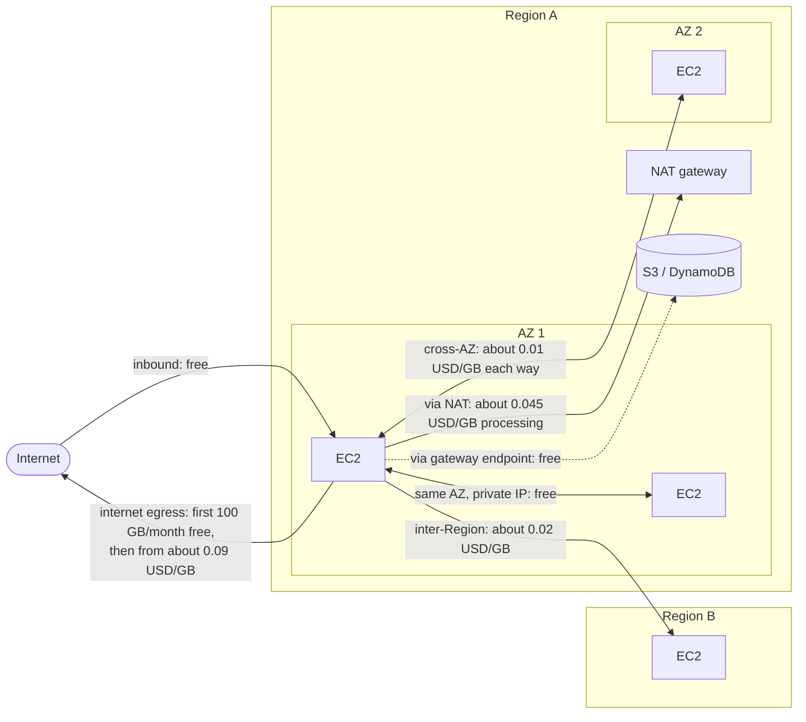
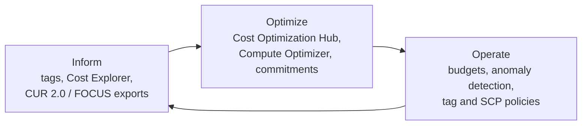

AWS bills for what you provision and what you move, not for what you meant to use. Controlling spend therefore comes down to three things: **seeing** where money goes (tags, Cost Explorer, billing exports), **acting** on the biggest levers (commitment discounts, Spot, right-sizing, storage tiering, network design), and **automating guardrails** (budgets, anomaly detection, policies) so cost regressions are caught without someone watching a dashboard. This page covers each in turn. Service-level pricing details live on the [Compute](compute.html#purchasing-options), [Storage](storage.html), and [Database](databases.html) pages.

---

## Where the Money Goes

Most AWS bills are dominated by a few categories:

| Cost driver | What is billed | Frequent sources of waste |
|-------------|----------------|---------------------------|
| **Compute** | Instance-seconds (EC2, RDS, ElastiCache, OpenSearch), vCPU/GB-seconds (Fargate, Lambda) | Over-sized instances, idle non-production environments, no commitment coverage for steady load |
| **Storage** | GB-months by storage class, plus requests and retrievals | Everything in S3 Standard, unattached EBS volumes, old snapshots, logs kept forever |
| **Data transfer** | GB leaving AWS, crossing Regions, or crossing AZs; NAT gateway processing | Chatty cross-AZ traffic, S3/DynamoDB traffic routed through NAT, uncached internet egress |
| **Idle managed resources** | Hourly charges regardless of use | NAT gateways, load balancers, public IPv4 addresses, provisioned databases in test accounts |
| **Licensing and support** | Per-hour licence-included instances, support plan percentage | Windows/SQL Server licence-included instances where BYOL or Linux would do |

### Data transfer

Data transfer is the line item teams most often fail to predict, because it depends on architecture rather than on any single resource. Representative us-east-1 list prices:



Consequences for design:

- **Gateway VPC endpoints for S3 and DynamoDB are free** and remove NAT processing charges for that traffic. Interface endpoints (PrivateLink) for other services cost an hourly fee plus a small per-GB charge, which is usually still cheaper than NAT for heavy traffic.
- **Cross-AZ traffic** is the price of high availability. Keep chatty service-to-service calls AZ-local where possible (topology-aware routing in Kubernetes, AZ-affinity in service discovery) while still deploying across AZs.
- **CloudFront** absorbs egress: transfer from AWS origins to CloudFront is free, and CloudFront's own egress is cheaper than EC2 egress and includes a monthly free allowance.
- **Public IPv4 addresses** cost 0.005 USD per hour each (about 3.60 USD a month), including idle Elastic IPs.

---

## The Cost Management Loop

Cost optimization is continuous. The FinOps Foundation describes it as three repeating phases; AWS tools map onto each.



| Tool | Purpose |
|------|---------|
| **Cost Explorer** | Interactive charts and a query API over the last 13 months (up to 38 months at monthly granularity when enabled); forecasts; Savings Plans and RI recommendations |
| **AWS Budgets** | Thresholds on cost, usage, or commitment coverage/utilization, with email/SNS alerts and optional **budget actions** (apply an IAM policy or SCP, stop EC2/RDS instances) |
| **Cost Anomaly Detection** | Machine-learning monitors per service, account, cost category, or tag; alerts when spend deviates from the learned pattern |
| **Data Exports** | Scheduled billing data in S3: **CUR 2.0**, **FOCUS 1.2** (the vendor-neutral FinOps Open Cost and Usage Specification), cost optimization recommendations, and carbon emissions. Query with Athena or load into a BI tool |
| **Cost Optimization Hub** | Consolidates and de-duplicates savings opportunities (right-sizing, idle resources, Graviton migration, Savings Plans, RIs) across accounts and Regions, priced with your actual discounts |
| **AWS Compute Optimizer** | The engine behind rightsizing and idle recommendations for EC2, ASGs, EBS, Lambda, Fargate, RDS, and more |
| **Cost allocation tags and Cost Categories** | Attribute spend to teams, products, and environments |

Legacy Cost and Usage Reports (CUR) still work, but new setups should use CUR 2.0 through Data Exports, which has a fixed schema, supports SQL column selection, and can be delivered as Parquet.

### Querying costs

The Cost Explorer API answers most questions without an export:

```bash
# Last month's cost by service
aws ce get-cost-and-usage \
  --time-period Start=2026-08-01,End=2026-09-01 \
  --granularity MONTHLY \
  --metrics UnblendedCost \
  --group-by Type=DIMENSION,Key=SERVICE \
  --query 'ResultsByTime[0].Groups[].[Keys[0],Metrics.UnblendedCost.Amount]' \
  --output text | sort -t$'\t' -k2 -rn | head -15
```

For resource-level or tag-level analysis over long periods, query a CUR 2.0 export with Athena:

```sql
-- Top resources by cost for one team tag in August 2026 (CUR 2.0 schema)
SELECT line_item_product_code          AS service,
       line_item_resource_id           AS resource,
       SUM(line_item_unblended_cost)   AS cost
FROM   cur2
WHERE  line_item_usage_start_date >= TIMESTAMP '2026-08-01 00:00:00'
  AND  line_item_usage_start_date <  TIMESTAMP '2026-09-01 00:00:00'
  AND  resource_tags['user_team'] = 'payments'
GROUP  BY 1, 2
ORDER  BY cost DESC
LIMIT  20;
```

---

## Budgets and Alerts

Every account, including sandboxes, should have a budget and an anomaly monitor from day one. They cost little or nothing (Cost Anomaly Detection has no charge) and they are the only thing standing between a misconfigured loop and a five-figure invoice.

```hcl
# Monthly budget with a forecast warning and an actual-spend alert
resource "aws_budgets_budget" "monthly" {
  name         = "${var.environment}-monthly"
  budget_type  = "COST"
  limit_amount = var.monthly_budget_usd
  limit_unit   = "USD"
  time_unit    = "MONTHLY"

  notification {
    comparison_operator        = "GREATER_THAN"
    threshold                  = 80
    threshold_type             = "PERCENTAGE"
    notification_type          = "FORECASTED"
    subscriber_email_addresses = [var.cost_alert_email]
  }

  notification {
    comparison_operator       = "GREATER_THAN"
    threshold                 = 100
    threshold_type            = "PERCENTAGE"
    notification_type         = "ACTUAL"
    subscriber_sns_topic_arns = [aws_sns_topic.cost_alerts.arn]
  }
}

# Per-service budget, e.g. to catch a runaway Lambda or data-transfer bill
resource "aws_budgets_budget" "per_service" {
  for_each     = var.service_budgets # { "AWS Lambda" = 200, "Amazon Elastic Compute Cloud - Compute" = 3000 }
  name         = "${var.environment}-${each.key}"
  budget_type  = "COST"
  limit_amount = each.value
  limit_unit   = "USD"
  time_unit    = "MONTHLY"

  cost_filter {
    name   = "Service"
    values = [each.key]
  }

  notification {
    comparison_operator        = "GREATER_THAN"
    threshold                  = 90
    threshold_type             = "PERCENTAGE"
    notification_type          = "ACTUAL"
    subscriber_email_addresses = [var.cost_alert_email]
  }
}

# Anomaly detection across all services, alerting on anomalies of 100 USD or more
resource "aws_ce_anomaly_monitor" "services" {
  name              = "${var.environment}-services"
  monitor_type      = "DIMENSIONAL"
  monitor_dimension = "SERVICE"
}

resource "aws_ce_anomaly_subscription" "services" {
  name             = "${var.environment}-anomalies"
  frequency        = "IMMEDIATE" # IMMEDIATE requires an SNS subscriber
  monitor_arn_list = [aws_ce_anomaly_monitor.services.arn]

  subscriber {
    type    = "SNS"
    address = aws_sns_topic.cost_alerts.arn
  }

  threshold_expression {
    dimension {
      key           = "ANOMALY_TOTAL_IMPACT_ABSOLUTE"
      match_options = ["GREATER_THAN_OR_EQUAL"]
      values        = ["100"]
    }
  }
}
```

The SNS topic needs a resource policy allowing `budgets.amazonaws.com` and `costalerts.amazonaws.com` to publish. Budgets also track **Savings Plans and RI utilization and coverage**, which is how to be alerted when a commitment is going unused.

---

## Commitment Discounts

Commitments trade flexibility for price: you agree to spend a fixed amount per hour (Savings Plans) or to run specific resources (Reserved Instances) for one or three years. Longer terms and more upfront payment give larger discounts.

| Commitment | Maximum discount | Applies to | Flexibility |
|------------|------------------|-----------|-------------|
| **Compute Savings Plans** | 66% | EC2, Fargate, Lambda | Any instance family, size, Region, OS, or tenancy |
| **EC2 Instance Savings Plans** | 72% | EC2 | One instance family in one Region; any size, OS, tenancy |
| **Database Savings Plans** | 35% | Aurora, RDS, DynamoDB, ElastiCache, DocumentDB, Neptune, Keyspaces, Timestream, DMS, OpenSearch Service | Latest-generation instances across engines, families, sizes, and Regions; also serverless usage |
| **SageMaker AI Savings Plans** | 64% | SageMaker AI instances | Any instance family, size, Region, or component |
| **Reserved Instances / reserved nodes** | Up to about 72% | EC2, RDS, ElastiCache, OpenSearch, Redshift, MemoryDB, DynamoDB reserved capacity | Tied to instance attributes; Convertible EC2 RIs can be exchanged |

### Sizing a commitment

Commit to the **floor** of usage, not the average. Anything above the commitment is billed at On-Demand (or covered by Spot); anything below it is paid for and wasted.

<figure style="margin: 1.5rem 0;">
<svg viewBox="0 0 640 260" role="img" aria-labelledby="cost-layer-title" style="width:100%; max-width:640px; height:auto; color: currentColor;">
  <title id="cost-layer-title">Layering Savings Plans, On-Demand, and Spot under a daily usage curve</title>
  <g fill="none" stroke="currentColor" stroke-width="1" opacity="0.6">
    <line x1="50" y1="220" x2="620" y2="220"/>
    <line x1="50" y1="20" x2="50" y2="220"/>
  </g>
  <rect x="50" y="160" width="570" height="60" fill="currentColor" opacity="0.28"/>
  <path d="M50 160 L50 140 C110 130 150 90 210 80 C260 72 300 110 350 100 C400 90 430 50 480 45 C530 40 570 110 620 130 L620 160 Z" fill="currentColor" opacity="0.12"/>
  <path d="M50 140 C110 130 150 90 210 80 C260 72 300 110 350 100 C400 90 430 50 480 45 C530 40 570 110 620 130" fill="none" stroke="currentColor" stroke-width="2.5"/>
  <line x1="50" y1="160" x2="620" y2="160" stroke="currentColor" stroke-width="1.5" stroke-dasharray="6 4"/>
  <g font-family="inherit" font-size="13" fill="currentColor">
    <text x="335" y="196" text-anchor="middle">Savings Plans / RIs: steady floor, committed spend per hour</text>
    <text x="330" y="140" text-anchor="middle">On-Demand or Spot: variable load above the floor</text>
    <text x="480" y="34" text-anchor="middle">total usage</text>
    <text x="625" y="164" font-size="11">commitment</text>
    <text x="335" y="242" text-anchor="middle" font-size="12" opacity="0.8">time (hours of a typical week)</text>
    <text x="20" y="120" font-size="12" opacity="0.8" transform="rotate(-90 20 120)" text-anchor="middle">cost per hour</text>
  </g>
</svg>
<figcaption style="font-size:0.9em; opacity:0.8;">Cover the baseline with commitments; leave peaks to On-Demand, Spot, or scaling.</figcaption>
</figure>

Practical guidance:

- **Right-size first, then commit.** A commitment locks in the current footprint; shrinking afterwards leaves the commitment underused.
- **Buy in tranches.** Purchase part of the recommended commitment every month or quarter instead of all at once, so commitments expire at staggered dates and track changing usage.
- **Prefer Compute Savings Plans** unless usage is certain to stay on one EC2 family in one Region; the extra discount of EC2 Instance Savings Plans rarely justifies the lock-in for evolving workloads.
- **Purchase from the management (payer) account** in AWS Organizations so discounts float to wherever matching usage occurs.
- **Watch utilization.** Target close to 100% utilization and a coverage level that matches the steady floor (often 60 to 80% of compute spend).

---

## Optimization Levers by Area

### Compute

| Lever | Typical effect | Notes |
|-------|----------------|-------|
| **Right-size** | 10 to 40% on over-provisioned instances | Use Compute Optimizer with memory metrics from the CloudWatch agent; downsize one step at a time |
| **Move to Graviton** | Often 20% or more better price-performance | Needs arm64 builds; managed services (RDS, ElastiCache, OpenSearch, Lambda, Fargate) usually switch with a configuration change |
| **Spot** | Up to 90% off | For interruptible, diversified workloads; see [Spot Instances](compute.html#spot-instances) |
| **Schedule non-production** | About 65 to 70% off for business-hours-only environments | Stop dev/test EC2 and RDS nights and weekends (the *Instance Scheduler on AWS* solution, EventBridge Scheduler, or ASG scheduled actions) |
| **Scale to zero** | Idle cost near zero | Lambda, Fargate tasks scaled to zero, Aurora Serverless v2 (can pause at 0 ACUs) |
| **Tune Lambda memory** | Varies | More memory adds CPU and can lower cost for CPU-bound functions; measure with AWS Lambda Power Tuning |

### Storage

- **S3 storage classes.** Use **S3 Intelligent-Tiering** for data with unknown or changing access patterns: it moves objects between tiers automatically for a small per-object monitoring fee. Use lifecycle rules where access patterns are known.
- **Minimum durations and sizes.** Standard-IA and One Zone-IA bill at least 30 days and 128 KB per object; Glacier Flexible Retrieval at least 90 days; Glacier Deep Archive at least 180 days. Transitioning many small or short-lived objects can *increase* cost.
- **Clean up incomplete multipart uploads and old versions**, which are billed but invisible in normal listings.
- **EBS:** migrate gp2 to **gp3** (about 20% cheaper per GB, with IOPS and throughput provisioned independently), delete unattached volumes, and apply retention to snapshots with Amazon Data Lifecycle Manager or AWS Backup.
- **CloudWatch Logs:** set retention on every log group; the default is to keep logs forever. Use the Infrequent Access log class for logs that are rarely queried.

```hcl
resource "aws_s3_bucket_lifecycle_configuration" "logs" {
  bucket = aws_s3_bucket.logs.id

  rule {
    id     = "tier-and-expire-logs"
    status = "Enabled"
    filter {} # applies to the whole bucket

    transition {
      days          = 30
      storage_class = "STANDARD_IA"
    }
    transition {
      days          = 90
      storage_class = "GLACIER" # Glacier Flexible Retrieval
    }
    expiration {
      days = 365
    }
    noncurrent_version_expiration {
      noncurrent_days = 30
    }
  }

  rule {
    id     = "abort-incomplete-uploads"
    status = "Enabled"
    filter {}

    abort_incomplete_multipart_upload {
      days_after_initiation = 7
    }
  }
}
```

### Databases

- **Database Savings Plans** (up to 35%) cover steady database spend across engines and Regions; RDS and ElastiCache reserved instances remain an alternative for fixed footprints.
- **Aurora I/O-Optimized** removes per-request I/O charges for a higher instance and storage price; AWS suggests it when I/O is more than about 25% of an Aurora cluster's spend.
- **RDS Extended Support** adds a per-vCPU-hour charge when a database stays on a major engine version past its end of standard support. Upgrading on schedule avoids it.
- **DynamoDB:** on-demand capacity (its price was halved in November 2024) is the right default; switch to provisioned with auto scaling for steady, predictable traffic. The **Standard-IA table class** lowers storage cost for tables where storage dominates.
- **ElastiCache for Valkey** is priced 20% lower (node-based) and 33% lower (serverless) than Redis OSS for the same node types, and existing Redis OSS reserved nodes carry over.

### Networking

- Add **gateway endpoints** for S3 and DynamoDB in every VPC that uses them.
- Use **one NAT gateway per AZ** only where resilience requires it; in development VPCs a single NAT gateway (or none, with endpoints) is often enough.
- Put **CloudFront** in front of public content and APIs to reduce origin egress.
- Release unused **Elastic IPs** and prefer IPv6 or private addressing where clients support it.

---

## Governance and Attribution

Costs that cannot be attributed to an owner do not get fixed.

1. **Define a small tag schema** (for example `Owner`, `Environment`, `CostCenter`, `Project`) and **activate the tags as cost allocation tags** in the Billing console; tags do not appear in cost data until activated, and are not applied retroactively.
2. **Enforce it** with tag policies in AWS Organizations (standardising keys and allowed values), SCPs or IaC checks that deny untagged resource creation, and AWS Config rules to find drift.
3. **Group spend with Cost Categories** (rules over accounts, tags, and services) to produce team- or product-level views, including for shared costs such as support or networking.
4. **Use an account per workload and environment.** Account boundaries give clean attribution for resources that cannot be tagged and limit the blast radius of mistakes.

```json
{
  "tags": {
    "Environment": {
      "tag_key":   { "@@assign": "Environment" },
      "tag_value": { "@@assign": ["Production", "Staging", "Development"] },
      "enforced_for": { "@@assign": ["ec2:instance", "rds:db", "s3:bucket"] }
    },
    "CostCenter": {
      "tag_key": { "@@assign": "CostCenter" }
    }
  }
}
```

A tag policy's `enforced_for` only blocks *non-compliant* values on the listed resource types; it does not require the tag to be present. Requiring tags needs an SCP with an `aws:RequestTag` condition, or checks in the deployment pipeline.

---

## Common Cost Surprises

| Surprise | Cause | Prevention |
|----------|-------|------------|
| Large NAT gateway bill | S3, DynamoDB, or ECR traffic from private subnets routed through NAT | Gateway endpoints for S3 and DynamoDB; interface endpoints for ECR |
| Cross-AZ transfer charges | Replication, chatty microservices, or load balancer cross-zone traffic | AZ-local routing; review `DataTransfer-Regional-Bytes` usage types |
| Bill continues after "deleting" a project | Snapshots, unattached EBS volumes, Elastic IPs, idle load balancers, log groups | Account-level cleanup, tags on everything, AWS Resource Explorer to search by tag |
| Runaway Lambda or Step Functions cost | Recursive triggers or retry storms | Per-service budgets, anomaly detection, reserved concurrency caps |
| Old engine versions cost more | RDS or EKS Extended Support fees on versions past standard support | Track engine and Kubernetes version end-of-support dates |
| Unused commitments | Workload migrated or shrank after purchasing RIs/Savings Plans | Right-size first, buy in tranches, alert on utilization |

---

## See Also

- [AWS Hub](./) - Overview of all AWS documentation
- [Compute Services](compute.html) - Purchasing options, Spot, and Lambda pricing
- [Storage Services](storage.html) - S3 storage classes and EBS volume types
- [Database Services](databases.html) - Choosing capacity modes and engines
- [Networking & Content Delivery](networking.html) - VPC endpoints, NAT, and CloudFront
- [Monitoring & Messaging](monitoring.html) - CloudWatch alarms and SNS notifications
- [Infrastructure as Code](iac.html) - Codifying budgets and policies
- [Terraform](../terraform/) - The HCL used in the examples above
