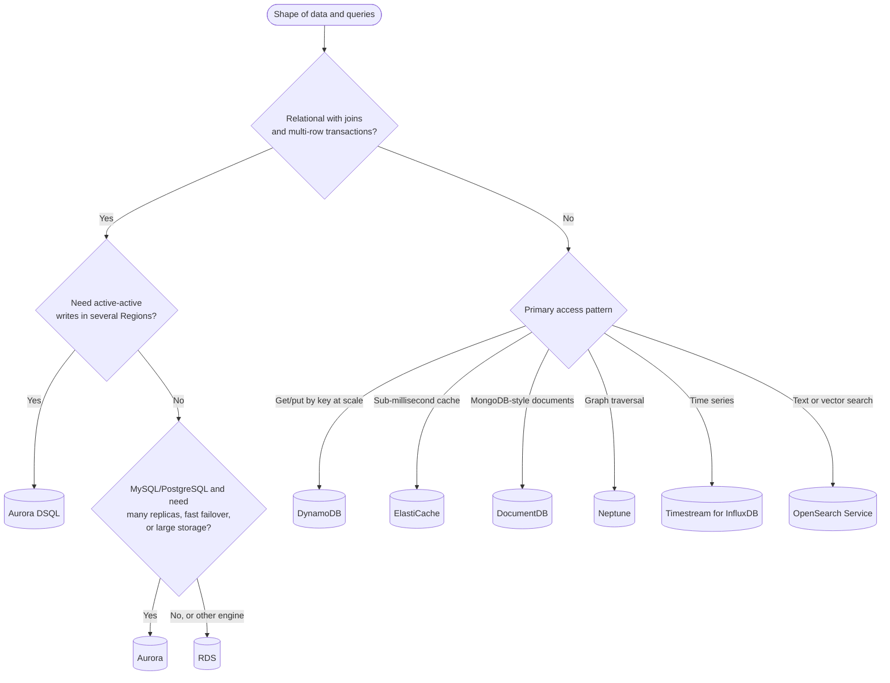
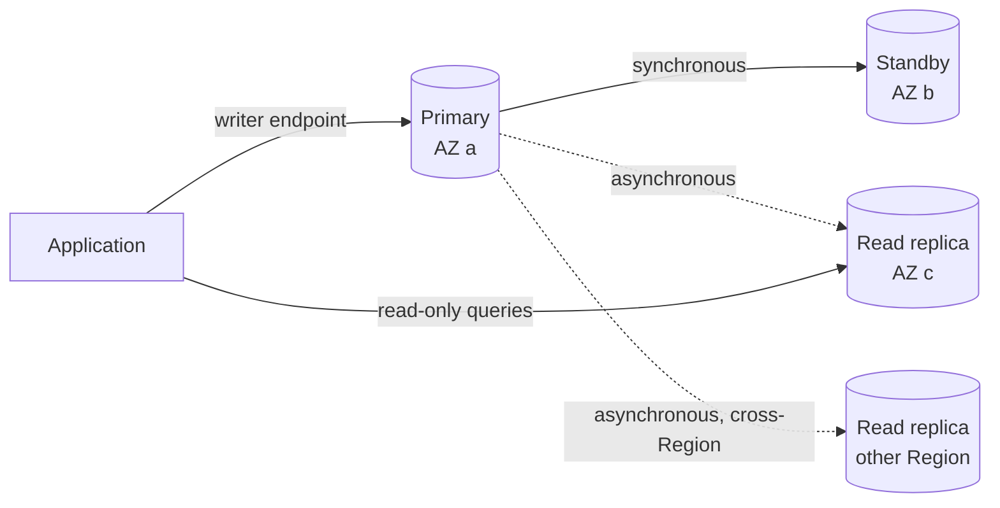
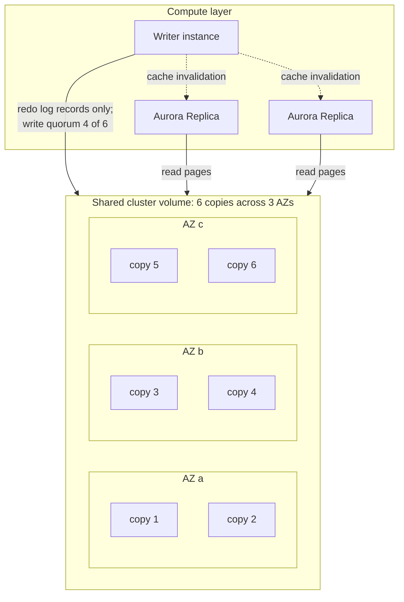
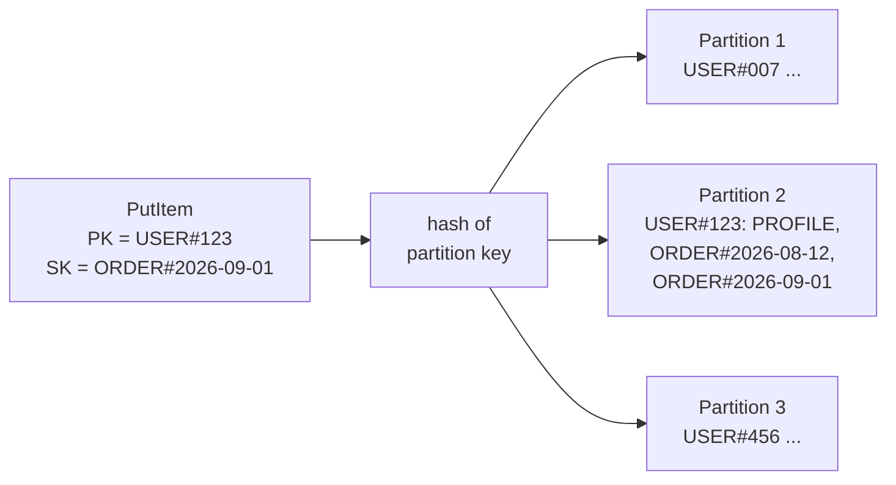

AWS runs managed versions of most database families: relational (RDS, Aurora, Aurora DSQL), key-value and document (DynamoDB, DocumentDB), in-memory (ElastiCache, MemoryDB), graph (Neptune), wide-column (Keyspaces), time series (Timestream), and search (OpenSearch Service). "Managed" means AWS handles provisioning, patching, backups, replication, and failover; you still own schema design, query performance, capacity choices, and access control. This page explains how the main services work internally, how they achieve high availability, and how to choose between them. General data-modelling concepts are in the [Database Design guide](../database-design/).

---

## Choosing a Database

Start from the data model and access pattern, not from the service list.

| Data model / need | Service | Typical workloads |
|-------------------|---------|-------------------|
| Relational, moderate scale, standard engines | **RDS** (PostgreSQL, MySQL, MariaDB, Oracle, SQL Server, Db2) | Line-of-business apps, SaaS backends, packaged software |
| Relational, high throughput or fast failover, MySQL/PostgreSQL | **Aurora** | Large OLTP systems, read-heavy apps with many replicas |
| Relational, serverless, active-active across Regions | **Aurora DSQL** | Globally available transactional apps, serverless and event-driven services |
| Key-value or document at any scale, predictable latency | **DynamoDB** | User profiles, carts, sessions, gaming state, IoT metadata |
| In-memory cache | **ElastiCache** (Valkey, Redis OSS, Memcached) | Caching, sessions, leaderboards, rate limits |
| In-memory *durable* primary database | **MemoryDB** (Valkey and Redis OSS compatible) | Low-latency primary store where a cache's data loss is unacceptable |
| JSON documents with MongoDB API | **DocumentDB** | Content and catalogue data, apps built on MongoDB drivers |
| Highly connected data | **Neptune** / **Neptune Analytics** | Fraud rings, knowledge graphs, identity graphs, recommendations |
| Wide-column with Cassandra API | **Keyspaces** | Cassandra workloads without running clusters |
| Time series | **Timestream for InfluxDB** | Metrics, telemetry, IoT sensor data |
| Full-text and vector search, log analytics | **OpenSearch Service** | Site search, log search, retrieval for generative AI |
| Analytical SQL over large datasets | **Redshift** (see also Athena on S3) | Data warehousing, BI dashboards |



Two common mistakes: choosing DynamoDB for a workload that needs ad-hoc queries and reporting (it can do it, but only through exports or secondary indexes you design up front), and choosing a relational database for a very high-volume key-value workload that will eventually need sharding.

---

## Amazon RDS

**Amazon Relational Database Service (RDS)** runs standard database engines on instances that AWS manages. You choose an engine version, an instance class, and storage; RDS handles installation, minor-version patching in a maintenance window, automated backups, and replication.

### High availability and read scaling

RDS offers three replication features, which are often combined:

| Feature | Topology | Readable? | Failover | Purpose |
|---------|----------|-----------|----------|---------|
| **Multi-AZ DB instance** | Primary plus one synchronous standby in another AZ | No | Automatic, typically 60 to 120 seconds (DNS endpoint flips) | Availability |
| **Multi-AZ DB cluster** (MySQL, PostgreSQL) | Writer plus two readable standbys in different AZs, semi-synchronous replication | Yes, via reader endpoint | Automatic, typically under 35 seconds | Availability and some read scaling |
| **Read replicas** | Asynchronous copies, same or different Region; up to 15 for MySQL, MariaDB, and PostgreSQL | Yes | Manual promotion | Read scaling, cross-Region disaster recovery |



A Multi-AZ standby protects against instance, storage, and AZ failure but does nothing for bad writes or dropped tables. That is what backups are for.

### Storage, backups, and maintenance

- **Storage:** gp3 for general use (IOPS and throughput provisioned separately from size), io2 Block Express for latency-sensitive, high-IOPS databases. Enable **storage autoscaling** to avoid outages when disks fill.
- **Automated backups** take a daily snapshot and keep transaction logs, allowing **point-in-time restore** to any second within the retention period (up to 35 days). A restore always creates a *new* instance. Manual snapshots and AWS Backup plans cover longer retention.
- **Blue/Green Deployments** create a synchronized copy of the database for major-version upgrades or schema changes, then switch over in typically under a minute.
- **RDS Extended Support** keeps a major version running past its standard end of support for an extra per-vCPU-hour charge; plan major upgrades to avoid it.

### Instance classes

| Class | Profile | Use |
|-------|---------|-----|
| **db.t4g / db.t3** | Burstable | Development, test, small or spiky workloads |
| **db.m7g, db.m8g / db.m7i** | General purpose (Graviton / Intel) | Most production databases |
| **db.r7g, db.r8g / db.r7i**, **db.x2g** | Memory optimized | Large working sets, high connection counts |

Graviton classes usually give the best price-performance and support all open-source engines. The instance class determines CPU, memory, and network bandwidth; EBS bandwidth limits can bottleneck I/O-heavy workloads on small classes.

### Connections and access

- Put databases in **private subnets** with security groups that allow only the application tier; never enable public accessibility for production.
- Use **RDS Proxy** to pool connections from Lambda functions or large container fleets, which otherwise exhaust `max_connections`. It also shortens failover for clients.
- Prefer **IAM database authentication** or credentials managed in **Secrets Manager** (RDS can manage and rotate the master password itself) over passwords in configuration.
- Enable **encryption at rest** with KMS at creation time; an unencrypted instance can only be encrypted by restoring a snapshot copy.

---

## Amazon Aurora

**Amazon Aurora** is AWS's cloud-native relational database, compatible with MySQL and PostgreSQL. It keeps the engines' query layers but replaces their storage with a distributed, log-structured storage service shared by all instances in a cluster.



How this differs from RDS:

- **Only redo log records are shipped to storage**, which applies them to data pages itself. This removes most of the write amplification of a traditional engine, which is the source of AWS's "up to 5x MySQL and 3x PostgreSQL throughput" claim; real gains depend heavily on workload.
- **Six copies across three AZs** with a write quorum of 4 and a read quorum of 3: the volume survives the loss of an entire AZ plus one more copy without losing data, and keeps accepting writes after losing an AZ.
- **Replicas share the volume**, so adding one copies no data. A cluster can have up to 15 Aurora Replicas with replica lag typically in the tens of milliseconds, and failover to a replica typically completes in about 30 seconds.
- **Storage grows automatically** in 10 GiB increments up to 128 TiB, or 256 TiB on recent engine versions (Aurora PostgreSQL 17.5, 16.9, 15.13 and later; Aurora MySQL 3.10 and later). You pay for storage used.
- **Backups are continuous** to S3, with no performance impact, and **cloning** creates a copy-on-write copy of a cluster in minutes.

### Aurora features and variants

| Feature | What it does |
|---------|--------------|
| **Aurora Serverless v2** | Instances scale in fine-grained capacity units (ACUs) in seconds, and can scale down to 0 ACUs (pausing) when idle. Can be mixed with provisioned instances in one cluster. |
| **I/O-Optimized storage** | No per-I/O charges in exchange for higher instance and storage prices; worthwhile when I/O is roughly a quarter or more of cluster cost |
| **Global Database** | Storage-level replication to secondary Regions with typical lag under a second; managed switchover and failover for disaster recovery |
| **Limitless Database** (PostgreSQL) | Horizontal sharding across many instances behind one endpoint, for write throughput beyond a single writer |
| **Zero-ETL integrations** | Continuous replication into Redshift (and other targets) for analytics without building pipelines |

### Aurora DSQL

**Aurora DSQL** (generally available since 2025) is a separate, serverless, distributed SQL database with a PostgreSQL-compatible interface (currently PostgreSQL 16). It has no instances to size; compute, transaction log, and storage scale independently. Single-Region clusters are active across three AZs (99.99% availability SLA); **multi-Region peered clusters** give two Regional endpoints that both accept reads and writes with strong consistency (99.999%). Peered Regions must come from the same Region set (for example North America or Europe).

DSQL uses optimistic concurrency control with snapshot isolation: transactions do not take locks, and a conflicting transaction fails at commit and must be retried. Not every PostgreSQL feature is supported, so check the compatibility list before migrating an existing application. It fits new applications that want relational semantics without managing failover.

### RDS or Aurora?

| Factor | RDS | Aurora |
|--------|-----|--------|
| Engines | Six, including commercial engines | MySQL- and PostgreSQL-compatible |
| Storage | EBS volume per instance, provisioned size | Shared distributed volume, grows automatically |
| Read replicas | Up to 15, each with its own copy | Up to 15 sharing storage, millisecond lag |
| Failover | 60 to 120 s (Multi-AZ instance), under 35 s (Multi-AZ cluster) | About 30 s to a replica |
| Cost at small scale | Lower | Higher minimum (storage and I/O model) |
| Serverless option | No | Serverless v2 |

Choose RDS for commercial engines, small or cost-sensitive databases, and when standard community-engine behaviour matters. Choose Aurora when read scaling, fast failover, cross-Region DR, or storage growth are the pressing concerns.

---

## Amazon DynamoDB

**DynamoDB** is a serverless key-value and document database. There are no instances; tables scale by partitioning data across storage nodes, and latency stays in single-digit milliseconds regardless of table size, provided the key design spreads traffic evenly.

### Data model

- A **table** holds **items** (up to 400 KB each), which are sets of attributes. Only the key attributes are required.
- The **primary key** is either a **partition key** alone, or a partition key plus **sort key**. The partition key is hashed to choose the physical partition; items with the same partition key are stored together, ordered by sort key.
- **Global secondary indexes (GSIs)** provide alternate keys with their own partitioning; **local secondary indexes (LSIs)** provide an alternate sort key within the same partition and must be defined at table creation.



Each partition supports up to 3,000 read capacity units and 1,000 write capacity units per second. **Adaptive capacity** shifts throughput to busy partitions and splits hot ones, but a single partition key value that receives most of the traffic will still throttle. High-cardinality partition keys (user ID, order ID) avoid this; low-cardinality or monotonically increasing ones (status, date) cause it.

### Designing for access patterns

Relational design normalizes data and relies on the query planner. DynamoDB inverts this: list the queries first, then choose keys so that each query is a single `GetItem` or `Query` against a table or index.

**Single-table design** stores several entity types in one table with generic key names, so related items share a partition and can be fetched together:

| Entity | PK | SK | Attributes |
|--------|----|----|-----------|
| User profile | `USER#123` | `PROFILE` | name, email |
| User's order | `USER#123` | `ORDER#2026-09-01#789` | total, status |
| Order line | `ORDER#789` | `ITEM#1` | sku, qty |
| Order by status (GSI) | `GSI1PK = STATUS#SHIPPED` | `GSI1SK = 2026-09-01` | (projected) |

`Query PK = USER#123` returns the profile and orders in one request; `begins_with(SK, "ORDER#2026")` narrows it to a year. Single-table design pays off for high-scale services with stable access patterns; for smaller or fast-changing applications, one table per entity is easier to evolve and query.

```bash
# Table with composite key and on-demand capacity
aws dynamodb create-table --table-name app \
  --attribute-definitions AttributeName=PK,AttributeType=S AttributeName=SK,AttributeType=S \
  --key-schema AttributeName=PK,KeyType=HASH AttributeName=SK,KeyType=RANGE \
  --billing-mode PAY_PER_REQUEST

# All orders for a user in 2026, newest first
aws dynamodb query --table-name app \
  --key-condition-expression "PK = :pk AND begins_with(SK, :prefix)" \
  --expression-attribute-values '{":pk":{"S":"USER#123"},":prefix":{"S":"ORDER#2026"}}' \
  --no-scan-index-forward
```

### Capacity, consistency, and features

| Topic | Details |
|-------|---------|
| **Capacity modes** | **On-demand** bills per request and scales automatically; the default for new and variable workloads (its price was cut by half in November 2024). **Provisioned** with auto scaling is cheaper for steady, predictable traffic. |
| **Read consistency** | Eventually consistent reads by default (half the cost); strongly consistent reads available on the table and LSIs, not GSIs |
| **Transactions** | `TransactWriteItems` / `TransactGetItems`: ACID across up to 100 items in one Region, at twice the capacity cost |
| **Streams** | Ordered per-item change log, consumed by Lambda or Kinesis for event-driven processing |
| **TTL** | Deletes expired items automatically at no write cost |
| **Backups** | On-demand backups and point-in-time recovery (continuous backups for up to 35 days) |
| **DAX** | In-memory, write-through cache with microsecond reads for eventually consistent read-heavy workloads |
| **Table classes** | Standard, or Standard-Infrequent Access for tables where storage dominates cost |

### Global tables

**Global tables** replicate a table across Regions, with every replica accepting writes. Two consistency modes exist, chosen at creation:

| Mode | Replication | Conflict handling | Constraints |
|------|-------------|-------------------|-------------|
| **Multi-Region eventual consistency (MREC)** (default) | Asynchronous, typically under a second | Last writer wins per item | Any number of Regions; RPO equals replication delay |
| **Multi-Region strong consistency (MRSC)** | Synchronous to at least one other Region before acknowledging | Concurrent writes to the same item fail with `ReplicatedWriteConflictException` and can be retried | Exactly three Regions (or two replicas plus a witness) within one Region set; RPO of zero; no transactions, TTL, or LSIs |

---

## ElastiCache and MemoryDB

**ElastiCache** provides managed in-memory data stores running **Valkey** (the open-source fork of Redis, which AWS recommends for new deployments), **Redis OSS**, or **Memcached**. It is available as **serverless** (no nodes to size; scales automatically) or as **node-based clusters** (you choose node types and shard count). Valkey is priced 20% lower than Redis OSS on node-based clusters and 33% lower on serverless.

| Pattern | How it works | Watch for |
|---------|--------------|-----------|
| **Cache-aside (lazy loading)** | Read from cache; on a miss, read the database and populate the cache with a TTL | Stale data until TTL expires; stampedes on popular keys (use request coalescing or jittered TTLs) |
| **Write-through** | Application writes to the database and the cache together | Caches data that may never be read |
| **Session store** | Session data keyed by session ID with a TTL | Size sessions modestly; enable replication so a node loss does not log users out |
| **Rate limiting / counters** | Atomic `INCR` with expiry per key or sliding-window sorted sets | Clock skew across clients; use server-side time |
| **Leaderboards** | Sorted sets ranked by score | Memory growth; trim old entries |

Set an eviction policy (`maxmemory-policy`, for example `allkeys-lru`) on caches so that a full cache evicts rather than rejects writes, and enable Multi-AZ with automatic failover for anything user-facing.

**MemoryDB** is a Valkey- and Redis OSS-compatible *database*, not a cache: writes are committed to a distributed, Multi-AZ transaction log before being acknowledged, so data survives node failures. Use it when an in-memory data structure store is the system of record.

---

## Other Purpose-Built Databases

| Service | Summary |
|---------|---------|
| **DocumentDB** | Document database with MongoDB API compatibility, using an Aurora-like shared storage architecture. Compatibility covers most, but not all, MongoDB features. |
| **Neptune** | Graph database supporting property graphs (Gremlin, openCypher) and RDF (SPARQL). **Neptune Analytics** is an in-memory engine for graph algorithms and vector search over large graphs. |
| **Keyspaces** | Serverless, Cassandra Query Language (CQL)-compatible wide-column store. |
| **Timestream** | **Timestream for InfluxDB** runs managed InfluxDB and is the option for new time-series workloads; the original **Timestream for LiveAnalytics** engine is no longer open to new customers. |
| **OpenSearch Service** | Managed OpenSearch for full-text search, log analytics, and vector (k-NN) search; also available as OpenSearch Serverless. |
| **Redshift** | Columnar data warehouse (provisioned or Serverless) for analytical SQL; pairs with Aurora and DynamoDB zero-ETL integrations. |

---

## Common Pitfalls

| Pitfall | Consequence | Remedy |
|---------|-------------|--------|
| Single-AZ production database | Hours of downtime when an instance or AZ fails | Multi-AZ (RDS), replicas in other AZs (Aurora) |
| Publicly accessible database | Exposed to internet scanning and credential stuffing | Private subnets; access via application tier, Session Manager port forwarding, or a VPN |
| No tested restore | Backups exist but cannot meet the recovery time objective | Rehearse point-in-time restores; measure how long they take |
| Connection storms from Lambda | `too many connections`, failed requests | RDS Proxy, or a connectionless data API (DynamoDB, Aurora DSQL, RDS Data API) |
| DynamoDB hot partition | Throttling despite spare table capacity | High-cardinality partition keys; write sharding with a random suffix for hot keys |
| Scans in DynamoDB request paths | Latency and cost grow with table size | Model the query with a key or GSI; export to S3 for analytics |
| Cache with no eviction policy or TTLs | Full cache rejects writes; stale data | `maxmemory-policy`, TTLs on every key |
| Running past end of standard support | Extended Support charges; forced upgrades | Track engine lifecycles; use Blue/Green Deployments for major upgrades |

---

## See Also

- [AWS Hub](./) - Overview of all AWS documentation
- [Compute Services](compute.html) - Lambda, containers, and connection management
- [Storage Services](storage.html) - S3 for exports, backups, and data lakes
- [Security](security.html) - Encryption, IAM authentication, and network isolation
- [Cost Optimization](cost.html) - Database Savings Plans and capacity choices
- [Architecture Patterns](architecture.html) - Databases in complete designs, including multi-Region
- [Database Design Guide](../database-design/) - Modelling, indexing, and transactions in general
- [NoSQL Data Models](../database-design/nosql-data-models.html) - Key-value, document, and wide-column design
