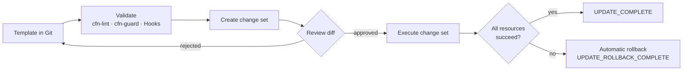
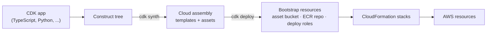
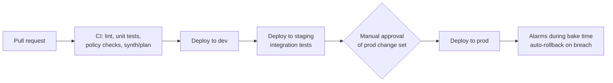

**Infrastructure as code (IaC)** is the practice of declaring cloud resources in version-controlled files and letting a tool reconcile the real account with that declaration. On AWS the native engine is **CloudFormation**; the **AWS Cloud Development Kit (CDK)** is a programming-language front end that compiles to CloudFormation. This page covers the CloudFormation model (templates, stacks, change sets, drift, refactoring), the CDK, how both compare with third-party tools such as Terraform, and the operational practices that make IaC safe in production.

---

## Why infrastructure as code

Resources created by hand in the console have no reviewable history, cannot be reproduced reliably in another account or Region, and drift silently as people make one-off fixes. Declaring them in code turns infrastructure changes into ordinary software changes:

| Concern | Console ("ClickOps") | Infrastructure as code |
|---|---|---|
| Source of truth | The live account, plus whatever someone wrote down | Files in version control |
| Reproducibility | Manual, error-prone | Same template deploys dev, staging, prod, and DR Regions |
| Change review | None | Pull request with a diff and a planned change set |
| Audit trail | CloudTrail events only | Commit history plus CloudTrail |
| Recovery | Rebuild from memory | Redeploy the stack |

The practical payoff is disaster recovery and environment parity: an account that is fully codified can be rebuilt from its repository, and staging differs from production only in parameters.

---

## CloudFormation

CloudFormation is a managed service that takes a **template** (JSON or YAML) describing resources and creates, updates, or deletes them as a single unit called a **stack**. It computes dependency order from references between resources, runs independent operations in parallel, and rolls back the whole stack if any resource fails.

### Core concepts

| Concept | Meaning |
|---|---|
| **Template** | Declarative document with `Parameters`, `Mappings`, `Conditions`, `Resources` (the only required section), and `Outputs` |
| **Stack** | A deployed instance of a template; the unit of create, update, rollback, and delete |
| **Logical ID** | The resource's name inside the template (`AppQueue`); CloudFormation uses it to track identity across updates |
| **Physical ID** | The real resource name or ARN in the account |
| **Change set** | A preview of what an update will add, modify, or replace, reviewed before execution |
| **Intrinsic functions** | `!Ref`, `!GetAtt`, `!Sub`, `!If`, `!ImportValue`, and others that wire resources together |
| **Nested stack / cross-stack reference** | Ways to compose large systems: a parent stack embeds children, or one stack exports outputs another imports |
| **StackSets** | Deploy one template to many accounts and Regions, typically across an AWS Organization |

### Template anatomy

The template below is complete and deployable. It creates an encrypted, versioned S3 bucket and a work queue with a dead-letter queue, toggles behaviour per environment with a condition, and protects stateful resources from accidental deletion.

```yaml
AWSTemplateFormatVersion: "2010-09-09"
Description: Upload bucket and processing queue

Parameters:
  Environment:
    Type: String
    AllowedValues: [dev, prod]
    Default: dev

Conditions:
  IsProd: !Equals [!Ref Environment, prod]

Resources:
  UploadBucket:
    Type: AWS::S3::Bucket
    DeletionPolicy: Retain          # keep data if the stack is deleted
    UpdateReplacePolicy: Retain     # ...or if an update forces replacement
    Properties:
      BucketEncryption:
        ServerSideEncryptionConfiguration:
          - ServerSideEncryptionByDefault:
              SSEAlgorithm: aws:kms
      VersioningConfiguration:
        Status: !If [IsProd, Enabled, Suspended]
      PublicAccessBlockConfiguration:
        BlockPublicAcls: true
        BlockPublicPolicy: true
        IgnorePublicAcls: true
        RestrictPublicBuckets: true

  DeadLetterQueue:
    Type: AWS::SQS::Queue
    Properties:
      MessageRetentionPeriod: 1209600   # 14 days, the maximum

  WorkQueue:
    Type: AWS::SQS::Queue
    Properties:
      VisibilityTimeout: 120
      RedrivePolicy:
        deadLetterTargetArn: !GetAtt DeadLetterQueue.Arn
        maxReceiveCount: 5

Outputs:
  BucketName:
    Value: !Ref UploadBucket
  WorkQueueUrl:
    Value: !Ref WorkQueue
    Export:
      Name: !Sub "${AWS::StackName}-WorkQueueUrl"
```

`!Ref` on a bucket returns its name and on a queue returns its URL; `!GetAtt` retrieves other attributes such as an ARN. Because `WorkQueue` references `DeadLetterQueue`, CloudFormation creates the dead-letter queue first.

### Deploying with change sets

Every production update should go through a **change set** so reviewers see exactly which resources will be modified and, critically, which will be **replaced** (deleted and recreated, which destroys data for stateful resources). `aws cloudformation deploy` creates and executes a change set in one step; the explicit form separates review from execution:

```bash
# Create a change set (stack is created if it does not exist)
aws cloudformation create-change-set \
  --stack-name uploads-prod \
  --change-set-name release-42 \
  --change-set-type UPDATE \
  --template-body file://template.yml \
  --parameters ParameterKey=Environment,ParameterValue=prod

# Review: look for "Replacement": "True" on stateful resources
aws cloudformation describe-change-set \
  --stack-name uploads-prod --change-set-name release-42 \
  --query 'Changes[].ResourceChange.[Action,LogicalResourceId,Replacement]' \
  --output table

# Apply
aws cloudformation execute-change-set \
  --stack-name uploads-prod --change-set-name release-42
```



If an update fails, CloudFormation rolls every resource back to its previous state. Rollback can be disabled for debugging (`--disable-rollback`), after which a failed stack can be retried from the failure point rather than reverted. Rollback triggers can also tie an update to CloudWatch alarms so a deployment that trips an alarm during a monitoring window is reverted automatically.

### Drift

**Drift** is any difference between a stack's template and the real resource configuration, usually caused by someone changing a resource outside CloudFormation. Drift detection (`detect-stack-drift`) reports it; it does not fix it.

**Drift-aware change sets** go further. Created with `--deployment-mode REVERT_DRIFT`, they perform a three-way comparison of the *actual* resource state, the *previous deployment*, and the *new template*. The change set shows which out-of-band edits a deployment would overwrite, and executing it brings drifted resources back in line with the template. If the deployment fails, resources roll back to their actual pre-deployment state rather than to the last template. Properties that AWS manages on your behalf, such as an Auto Scaling group's desired capacity under a scaling policy, are recognised and left alone.

```bash
aws cloudformation create-change-set \
  --stack-name uploads-prod \
  --change-set-name reconcile-drift \
  --template-body file://template.yml \
  --deployment-mode REVERT_DRIFT
```

### Refactoring stacks

CloudFormation tracks resources by logical ID, so historically moving a resource to another stack or renaming it meant deleting and recreating it. **Stack refactoring** removes that constraint: you submit revised templates for up to five stacks (`create-stack-refactor`), CloudFormation validates cross-stack dependencies and previews the moves, and `execute-stack-refactor` reassigns the existing physical resources without touching them. A refactor may only move or rename resources; property changes, new resources, and deletions must be deployed separately, and some resource types are not supported.

### Bringing existing resources under management

| Situation | Tool |
|---|---|
| A handful of existing resources should join a stack | **Resource import** (`create-change-set --change-set-type IMPORT`), with `DeletionPolicy: Retain` set on each |
| A whole hand-built environment needs a template | **IaC generator**: scans the Region, then generates a template from selected resources (up to 500 per template) that can be imported as a stack or converted to a CDK app with `cdk migrate` |
| Templates should deploy from Git automatically | **Git sync**: CloudFormation watches a repository branch and updates the stack when the template or its deployment file changes |

### Guardrails

- **cfn-lint** checks templates against the resource specification before deployment.
- **CloudFormation Guard (cfn-guard)** evaluates policy-as-code rules, for example "every bucket must block public access".
- **CloudFormation Hooks** run those checks inside the service, before a resource is provisioned, and can warn or fail the operation. Hooks can be written as Guard rules or Lambda functions and apply to stacks, change sets, and Cloud Control API calls.
- **Stack policies** and **termination protection** prevent specific resources, or the whole stack, from being updated or deleted by mistake.

---

## AWS CDK

The **AWS Cloud Development Kit** defines infrastructure in TypeScript, Python, Java, C#, or Go. A CDK app is a tree of **constructs**; running `cdk synth` executes the program and emits CloudFormation templates plus assets (Lambda bundles, Docker images) that `cdk deploy` uploads and deploys. CloudFormation remains the deployment engine, so stack semantics, rollback, and drift behave exactly as above.



### Construct levels

| Level | What it is | Example |
|---|---|---|
| **L1** (`Cfn*`) | One-to-one mapping of a CloudFormation resource type, generated from the resource specification | `s3.CfnBucket` |
| **L2** | Curated resource with sensible defaults, helper methods, and grant APIs | `s3.Bucket(...).grant_read(role)` |
| **L3 / patterns** | Multi-resource architectures | `ecs_patterns.ApplicationLoadBalancedFargateService` |

L2 constructs encode AWS best practice (encryption on, least-privilege grants, correct security-group rules), which is most of the CDK's value; L1 is the escape hatch for properties an L2 does not expose.

### Example: containerised service with a database

The stack below is written against CDK v2 (`aws-cdk-lib`). It creates a three-tier VPC, an Aurora PostgreSQL Serverless v2 cluster in isolated subnets, and a load-balanced Fargate service that mixes on-demand and Spot capacity, rolls back failed deployments automatically, and receives database credentials from Secrets Manager.

```python
from aws_cdk import (
    App, Stack, CfnOutput, RemovalPolicy,
    aws_ec2 as ec2,
    aws_ecs as ecs,
    aws_ecs_patterns as ecs_patterns,
    aws_rds as rds,
)
from constructs import Construct


class WebServiceStack(Stack):
    def __init__(self, scope: Construct, construct_id: str, **kwargs) -> None:
        super().__init__(scope, construct_id, **kwargs)

        vpc = ec2.Vpc(
            self, "Vpc",
            max_azs=2,
            nat_gateways=1,  # one per AZ in production
            subnet_configuration=[
                ec2.SubnetConfiguration(name="public", cidr_mask=24,
                                        subnet_type=ec2.SubnetType.PUBLIC),
                ec2.SubnetConfiguration(name="app", cidr_mask=22,
                                        subnet_type=ec2.SubnetType.PRIVATE_WITH_EGRESS),
                ec2.SubnetConfiguration(name="data", cidr_mask=24,
                                        subnet_type=ec2.SubnetType.PRIVATE_ISOLATED),
            ],
        )

        db = rds.DatabaseCluster(
            self, "Db",
            # Pin to an engine version available in your Region.
            engine=rds.DatabaseClusterEngine.aurora_postgres(
                version=rds.AuroraPostgresEngineVersion.VER_16_4),
            writer=rds.ClusterInstance.serverless_v2("writer"),
            serverless_v2_min_capacity=0.5,
            serverless_v2_max_capacity=4,
            vpc=vpc,
            vpc_subnets=ec2.SubnetSelection(subnet_type=ec2.SubnetType.PRIVATE_ISOLATED),
            credentials=rds.Credentials.from_generated_secret("app"),
            storage_encrypted=True,
            deletion_protection=True,
            removal_policy=RemovalPolicy.SNAPSHOT,
        )

        cluster = ecs.Cluster(self, "Cluster", vpc=vpc,
                              enable_fargate_capacity_providers=True)

        web = ecs_patterns.ApplicationLoadBalancedFargateService(
            self, "Web",
            cluster=cluster,
            cpu=512,
            memory_limit_mib=1024,
            desired_count=2,
            task_image_options=ecs_patterns.ApplicationLoadBalancedTaskImageOptions(
                image=ecs.ContainerImage.from_asset("./app"),  # built and pushed by cdk deploy
                container_port=8080,
                secrets={"DB_CREDENTIALS": ecs.Secret.from_secrets_manager(db.secret)},
            ),
            capacity_provider_strategies=[
                ecs.CapacityProviderStrategy(capacity_provider="FARGATE", base=1, weight=1),
                ecs.CapacityProviderStrategy(capacity_provider="FARGATE_SPOT", weight=2),
            ],
            circuit_breaker=ecs.DeploymentCircuitBreaker(rollback=True),
        )
        web.target_group.configure_health_check(path="/health")

        # Security-group rule from the service to the database port
        db.connections.allow_default_port_from(web.service)

        scaling = web.service.auto_scale_task_count(min_capacity=2, max_capacity=10)
        scaling.scale_on_cpu_utilization("Cpu", target_utilization_percent=60)

        CfnOutput(self, "Url", value="http://" + web.load_balancer.load_balancer_dns_name)


app = App()
WebServiceStack(app, "WebService")
app.synth()
```

Roughly sixty lines of Python synthesise several hundred lines of CloudFormation, including IAM roles, security groups, route tables, the ALB listener and target group, log groups, and the secret. `db.connections.allow_default_port_from(...)` and `ecs.Secret.from_secrets_manager(...)` also generate the least-privilege security-group rule and IAM grant that would otherwise be written by hand.

### CDK workflow

```bash
npm install -g aws-cdk          # CLI (Node.js), independent of the app's language
cdk bootstrap aws://123456789012/us-east-1   # once per account/Region
cdk synth                       # render templates into cdk.out/
cdk diff                        # compare against deployed stacks
cdk deploy WebService           # create change set and execute
```

Points that trip people up:

- **CDK v1 is end-of-life** (support ended 1 June 2023). Imports of the form `from aws_cdk import core` or per-service packages such as `aws_cdk.aws_s3` are v1; v2 ships everything in `aws-cdk-lib` and uses `constructs` for the base class.
- **The CLI and the library are versioned separately.** Since early 2025 the CLI (`aws-cdk`) releases on its own `2.1xxx.0` line while `aws-cdk-lib` stays on `2.x`. A current CLI can deploy apps built with any v2 library, so keep the CLI up to date.
- **Logical IDs come from the construct path.** Renaming a construct or moving it to another stack changes its logical ID, which CloudFormation treats as delete-and-create. `cdk refactor` (in preview, enabled with `--unstable=refactor`) detects such moves and uses CloudFormation stack refactoring to preserve the resources.
- **Deprecated subnet types.** `SubnetType.PRIVATE` and `SubnetType.ISOLATED` were replaced by `PRIVATE_WITH_EGRESS` and `PRIVATE_ISOLATED`.
- **Policy checks.** `cdk-nag` applies rule packs (AWS Solutions, NIST, HIPAA) to the construct tree at synth time; CloudFormation Hooks enforce rules server-side regardless of which tool produced the template.

The **CDK Toolkit Library** exposes synth, deploy, diff, and refactor as a programmatic API, for teams that want to drive CDK from their own tooling instead of the CLI.

---

## Choosing a tool

| Tool | Language | State | Scope | Strengths | Trade-offs |
|---|---|---|---|---|---|
| **CloudFormation** | YAML / JSON | Managed by AWS | AWS | No state to manage; day-one support for many new services; rollback, drift-aware change sets, StackSets, Hooks | Verbose; limited abstraction; AWS only |
| **AWS CDK** | TS, Python, Java, C#, Go | CloudFormation | AWS | Real languages, loops, types, testing; high-level L2/L3 constructs; generated least-privilege IAM | Adds a synth step and Node.js CLI; inherits CloudFormation limits (500 resources per stack) |
| **AWS SAM** | YAML (CloudFormation transform) | CloudFormation | Serverless on AWS | Concise syntax for Lambda, API Gateway, Step Functions; local invoke and testing | Narrow focus |
| **Terraform** | HCL | State file (S3 backend with locking, or HCP Terraform) | Multi-cloud and SaaS | Largest provider ecosystem; `plan` before `apply`; mature module registry | State must be secured and locked; Business Source License since August 2023 |
| **OpenTofu** | HCL | State file | Multi-cloud | Open-source (MPL 2.0) fork of Terraform under the Linux Foundation; largely compatible with Terraform configurations | Features diverge from Terraform over time |
| **Pulumi** | TS, Python, Go, C#, Java, YAML | Pulumi Cloud or self-managed backend | Multi-cloud | General-purpose languages across providers | Smaller community than Terraform |

Rules of thumb:

- AWS-only teams comfortable with a general-purpose language get the most leverage from the **CDK**.
- Organisations that manage several clouds or many SaaS providers (DNS, monitoring, identity) usually standardise on **Terraform or OpenTofu**; see the [Terraform guide](../terraform/).
- Plain **CloudFormation** remains the right output format for things that must be consumed by others: Service Catalog products, StackSets rolled out across an Organization, and Marketplace templates.
- Mixing tools is common but each resource should have exactly one owner.

---

## Operating IaC in production



- **Separate accounts per environment.** Use AWS Organizations with one account per environment (or per workload and environment); the same template is promoted from account to account. See [Security](security.html) for account structure.
- **Deploy from pipelines, not laptops.** CI assumes a deployment role through OIDC federation rather than long-lived access keys. Humans get read-only production access by default.
- **Size stacks by lifecycle.** Put resources that change together in the same stack, and keep long-lived stateful resources (VPCs, databases, buckets) in separate stacks from frequently deployed application code. This limits blast radius and keeps each stack under the 500-resource quota.
- **Protect state.** Set `DeletionPolicy`/`UpdateReplacePolicy: Retain` (CDK `RemovalPolicy.RETAIN` or `SNAPSHOT`) on anything holding data, enable termination protection on production stacks, and read every change set for `Replacement: True`.
- **Avoid hard-coded names.** Let CloudFormation generate physical names where possible; named resources cannot be replaced without a conflict, which blocks updates that require replacement.
- **Treat drift as an incident.** Out-of-band console fixes made during an outage should be codified afterwards; drift-aware change sets show which ones a deployment would otherwise overwrite.
- **Parameterise environments, not code paths.** Differences between environments belong in parameters or CDK context, not in divergent templates.

---

## See Also

- [AWS Hub](./) - Overview of all AWS documentation
- [Terraform](../terraform/) - Multi-cloud IaC with HCL, state, and modules
- [CI/CD: Deployment](../ci-cd/deployment.html) - Pipeline patterns for promoting changes
- [Architecture Patterns & Case Studies](architecture.html) - Where these stacks fit
- [Monitoring & Messaging](monitoring.html) - Alarms that can gate and roll back deployments
- [Security](security.html) - IAM, account structure, and guardrails
- [Cost Optimization](cost.html) - Tagging and budgets driven from IaC
