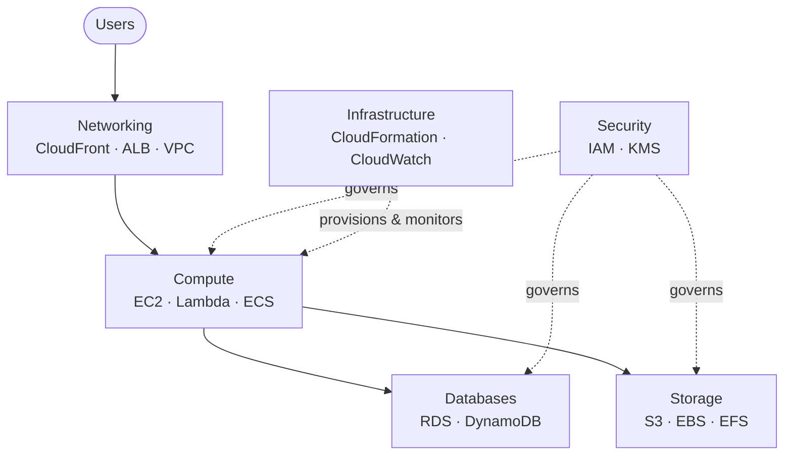

  <h1 style="color: white; margin: 0; font-size: 2.5rem;">AWS Cloud Services Hub</h1>
  
Your complete guide to Amazon Web Services, from first deployment to multi-region architectures.

## Why AWS?

Before diving into specific services, consider why millions of organizations choose cloud computing over traditional on-premises infrastructure:

- **Speed**: Launch new servers in minutes instead of weeks of procurement
- **Cost efficiency**: Pay only for what you use, scale down when demand drops
- **Global reach**: Deploy to data centers worldwide with a few clicks
- **Reliability**: Built-in redundancy and disaster recovery options
- **Innovation**: Access cutting-edge services (AI/ML, IoT, analytics) without building expertise from scratch

Think of AWS as a massive technology toolkit in the cloud. Instead of buying and maintaining your own servers, you rent computing power, storage, and dozens of other services from Amazon's data centers around the world.

  
Whether you're deploying your first EC2 instance or architecting multi-region systems, you'll find detailed guides, practical patterns, and real-world examples to help you build on AWS.

---

## Quick Navigation

### [Compute Services](compute.html)
EC2 instances, Lambda functions, Auto Scaling, and serverless patterns.
- Virtual server setup and optimization
- Serverless computing with Lambda
- Spot instances and cost savings
- Container basics with ECS/Fargate

### [Storage Services](storage.html)
S3 buckets, EBS volumes, and file systems for every use case.
- Object storage with S3
- Block storage with EBS
- File systems with EFS
- Storage classes and lifecycle policies

### [Database Services](databases.html)
RDS, DynamoDB, and managed database solutions.
- Relational databases with RDS/Aurora
- NoSQL with DynamoDB
- Caching with ElastiCache
- Database performance optimization

### [Networking & Content Delivery](networking.html)
VPC, CloudFront, API Gateway, and load balancing.
- Virtual private clouds (VPC)
- Content delivery with CloudFront
- API Gateway patterns
- Load balancer configuration

### [Security & Identity](security.html)
IAM, Security Hub, KMS, and compliance.
- Identity and access management
- Encryption with KMS
- Security Hub and compliance
- WAF and network protection

### Infrastructure & Operations
The former single Infrastructure guide is now five focused pages:
- [Infrastructure as Code](iac.html) — CloudFormation and CDK
- [Monitoring & Messaging](monitoring.html) — CloudWatch, SNS, and SQS
- [Cost Optimization](cost.html) — Spot, savings plans, and tagging
- [Architecture & Case Studies](architecture.html) — patterns and real-world designs
- [Troubleshooting](troubleshooting.html) — diagnostics and the emergency playbook

---

## How the Services Fit Together

A typical AWS workload draws on services from several of these guides at once. The diagram shows how a standard web application maps onto the hub sections:

---

## Getting Started

Consider where you are in your AWS journey:

| If you want to... | Start here |
|-------------------|------------|
| Deploy your first application | [Compute Services](compute.html) - includes a 30-minute crash course |
| Understand security fundamentals | [Security](security.html) - IAM best practices and account setup |
| Design scalable architecture | [Architecture & Case Studies](architecture.html) - patterns and real-world designs |
| Store files or data | [Storage Services](storage.html) - S3, EBS, and when to use each |
| Set up a database | [Database Services](databases.html) - RDS vs DynamoDB decision guide |

---

## Core Concepts

Understanding these foundational concepts will help you make better decisions throughout your AWS journey.

### Regions and Availability Zones

AWS operates in multiple geographic regions worldwide (US, Europe, Asia-Pacific, etc.). Each region contains multiple Availability Zones (AZs), which are essentially separate data centers with independent power, cooling, and networking.

**Why this matters**: Deploy resources in multiple AZs to survive hardware failures. Deploy in multiple regions to survive regional outages and serve users with lower latency.

### The Pay-as-You-Go Model

Unlike traditional IT where you pay upfront for capacity you might not use, AWS charges based on actual consumption. Launch 100 servers for an hour? You pay for 100 server-hours. Turn them off and stop paying.

**Why this matters**: You can experiment freely, scale up for peak demand, and scale down during quiet periods. No more guessing capacity months in advance.

### Shared Responsibility Model

AWS secures the infrastructure ("security of the cloud"), while you secure your data and applications ("security in the cloud").

**Why this matters**: AWS handles physical security, hardware maintenance, and network infrastructure. You handle access control, encryption decisions, and application security. Understanding this division prevents both over-engineering and security gaps.

## Learning Path

| Level | Focus | Key Services |
|-------|-------|--------------|
| **Beginner** | Core services, basic deployments | EC2, S3, RDS, IAM |
| **Intermediate** | Scaling, automation, security | Auto Scaling, Lambda, VPC, CloudWatch |
| **Advanced** | Architecture, optimization, IaC | CloudFormation, Step Functions, Cost Explorer |
| **Expert** | Multi-region, enterprise patterns | Organizations, Transit Gateway, Control Tower |

## Quick Reference

- **AWS CLI and developer tools**: See [Monitoring & Messaging](monitoring.html)
- **IAM and security best practices**: See [Security](security.html)
- **Cost optimization strategies**: See [Cost Optimization](cost.html)
- **Troubleshooting guide**: See [Troubleshooting](troubleshooting.html)

## See Also

- [Terraform for AWS](../terraform/) - Infrastructure as Code alternative
- [Kubernetes on AWS](../kubernetes/) - Container orchestration with EKS
- [Docker on AWS](../docker/) - Containerization fundamentals
- [Distributed Systems](../../distributed-systems/) - Architecture patterns
