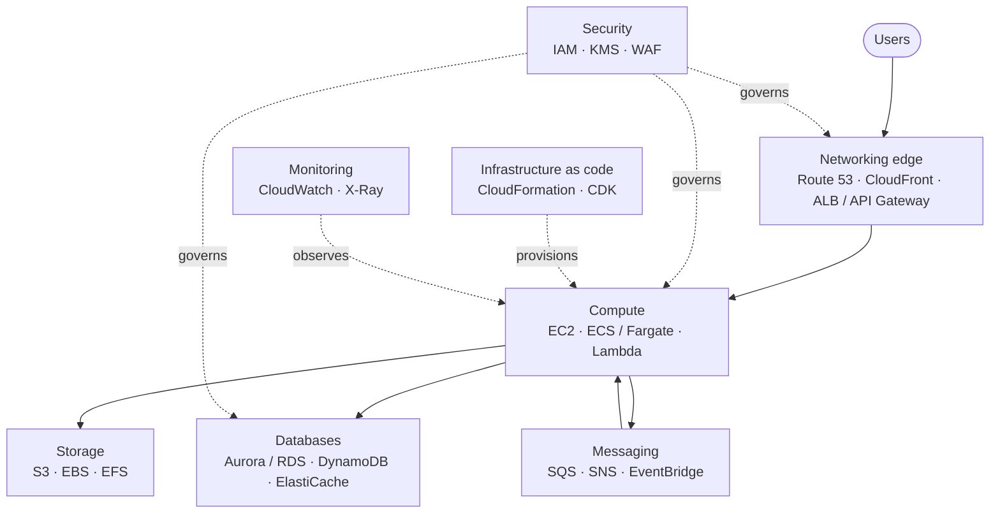
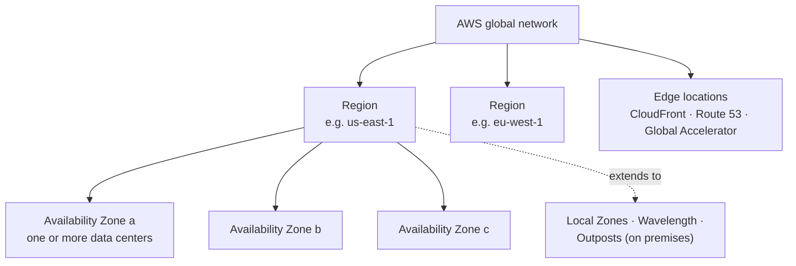

  <h1 style="color: white; margin: 0; font-size: 2rem;">AWS Cloud Services Hub</h1>
  
Amazon Web Services, from first deployment to multi-region architectures.

**Amazon Web Services (AWS)** is Amazon's public cloud: several hundred managed services, from virtual machines and object storage to databases, analytics, and machine learning, rented on demand through APIs and billed by usage. This hub introduces the concepts every AWS design depends on (global infrastructure, accounts, shared responsibility, and pricing) and links to focused guides for each service area.

---

## Guides

| Guide | Covers |
|---|---|
| [Compute](compute.html) | EC2 instance families and purchase options, Lambda, Auto Scaling, ECS and Fargate, choosing among them |
| [Storage](storage.html) | S3 and its storage classes, EBS volume types, EFS, lifecycle policies |
| [Databases](databases.html) | RDS and Aurora, DynamoDB data modelling, ElastiCache, choosing a database |
| [Networking & Content Delivery](networking.html) | VPC design, NAT and endpoints, Transit Gateway and VPC Lattice, load balancers, CloudFront, API Gateway, Route 53 |
| [Security & Identity](security.html) | IAM and least privilege, KMS encryption, GuardDuty and Security Hub, WAF and Shield |
| [Infrastructure as Code](iac.html) | CloudFormation (change sets, drift, refactoring), the AWS CDK, comparison with Terraform/OpenTofu |
| [Monitoring & Messaging](monitoring.html) | CloudWatch metrics, alarms, logs, and tracing; SNS, SQS, and EventBridge |
| [Cost Optimization](cost.html) | Reading the bill, Savings Plans and Spot, tagging, budgets |
| [Architecture & Case Studies](architecture.html) | Reference architectures from static sites to multi-Region systems |
| [Troubleshooting](troubleshooting.html) | Diagnosing common failures and an incident playbook |

---

## How the services fit together

A typical web workload draws on every guide at once. Requests enter through the networking edge, run on compute in private subnets, and persist state in managed databases and storage; security controls govern every layer, and infrastructure-as-code and monitoring wrap the whole system.

---

## Core concepts

### Global infrastructure

| Unit | What it is | Design implication |
|---|---|---|
| **Region** | A geographic area (`us-east-1`, `eu-central-1`) containing multiple Availability Zones (three or more in almost all Regions); Regions are isolated from each other | Choose for latency to users, data-residency law, service availability, and price. Most services and data stay within a Region unless you replicate them |
| **Availability Zone (AZ)** | One or more data centers with independent power, cooling, and networking, physically separated from the other AZs in the Region but within about 100 km of them, linked by low-latency private fibre | The unit of fault isolation. Run production across at least two AZs (load balancers, Auto Scaling groups, Multi-AZ databases) |
| **Local Zone / Wavelength / Outposts** | Compute and storage placed in metro areas, 5G carrier networks, or your own data center, attached to a parent Region | Single-digit-millisecond latency to specific users or on-premises systems |
| **Edge location** | Point of presence for CloudFront, Route 53, and Global Accelerator | Content and DNS served close to users worldwide |

AZ names such as `us-east-1a` are mapped to physical zones differently in each account; use **AZ IDs** (`use1-az1`) when coordinating placement across accounts.

Some services are **global** rather than regional (IAM, Route 53, CloudFront, Organizations), and their control planes are hosted in `us-east-1`. That is why CloudFront certificates must be issued in ACM in `us-east-1`, and why billing metrics appear only there.

### Accounts and organizations

An **AWS account** is the fundamental boundary for resources, permissions, quotas, and billing. Production environments use many accounts rather than one:

- **AWS Organizations** groups accounts into organizational units (OUs), consolidates billing, and applies **service control policies (SCPs)** and **resource control policies (RCPs)** that cap what any identity or resource in those accounts can do.
- **AWS Control Tower** sets up a multi-account landing zone with log-archive and audit accounts, guardrails, and account vending.
- **IAM Identity Center** provides single sign-on for people across all accounts, issuing short-lived credentials instead of long-lived IAM users and access keys.

A common layout separates security tooling, logging, shared networking, and each workload's dev, staging, and production environments into their own accounts. Account boundaries limit blast radius far more reliably than IAM policies within one account. See [Security](security.html).

### Shared responsibility

AWS is responsible for **security *of* the cloud**: physical facilities, hardware, the hypervisor, and the managed-service software. The customer is responsible for **security *in* the cloud**: identities and permissions, network exposure, encryption choices, patching of anything the customer operates, and application code. The line moves with the service: on EC2 you patch the operating system; on Lambda, Fargate, or DynamoDB, AWS does. Most real-world AWS breaches trace back to the customer side of the line: overly broad IAM permissions, leaked access keys, and publicly exposed storage.

### Pricing model

- **On-demand, usage-based billing** per second, hour, request, or GB, with no upfront commitment.
- **Commitment discounts**: Savings Plans and Reserved Instances trade a one- or three-year spend commitment for substantially lower rates on steady workloads.
- **Spot capacity**: spare EC2 and Fargate capacity at a steep discount, reclaimable with a two-minute warning; suited to fault-tolerant and batch work.
- **Data transfer**: inbound traffic is free; outbound to the internet, cross-Region, and cross-AZ traffic is billed, and NAT gateway processing is a frequent surprise. Architecture decisions often matter more to the bill than instance choices.
- **Free Tier** offers limited usage and credits for new accounts.

Cost visibility needs deliberate setup: cost allocation tags, AWS Budgets alerts, and Cost Explorer. See [Cost Optimization](cost.html).

### Well-Architected Framework

The **AWS Well-Architected Framework** is AWS's review methodology, organised into six pillars: operational excellence, security, reliability, performance efficiency, cost optimization, and sustainability. The Well-Architected Tool in the console walks a workload through the questions for each pillar and records improvement items; specialised **lenses** extend it to serverless, SaaS, machine learning, and other domains.

---

## Learning path

| Stage | Focus | Services and guides |
|---|---|---|
| **Foundations** | Secure account setup, one working application | IAM Identity Center, EC2 or Lambda, S3, RDS, CloudWatch basics: [Compute](compute.html), [Security](security.html) |
| **Production-ready** | Multi-AZ networking, automation, observability | VPC design, ALB, Auto Scaling, CloudFormation/CDK, alarms: [Networking](networking.html), [IaC](iac.html), [Monitoring](monitoring.html) |
| **Scale and efficiency** | Decoupling, data modelling, cost control | SQS/SNS/EventBridge, DynamoDB, CloudFront, Savings Plans: [Databases](databases.html), [Cost](cost.html) |
| **Organization-wide** | Multi-account governance and multi-Region resilience | Organizations, Control Tower, Transit Gateway, cross-Region replication: [Architecture](architecture.html) |

---

## See Also

- [Terraform](../terraform/) - Multi-cloud infrastructure as code
- [Kubernetes](../kubernetes/) - Container orchestration, including EKS
- [Docker](../docker/) - Container fundamentals
- [Networking Fundamentals](../networking/) - Protocols and concepts underneath VPC design
- [Observability](../../observability/) - Metrics, logs, and traces in general
- [Distributed Systems](../../distributed-systems/) - Consistency, replication, and failure handling behind cloud architectures
