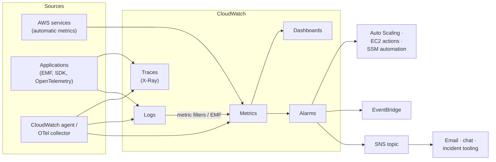
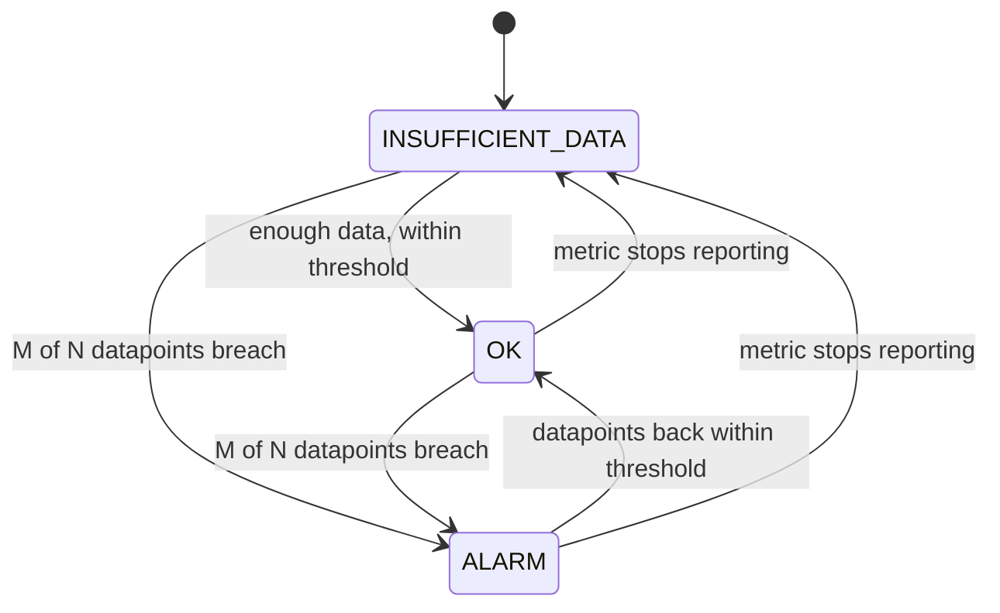
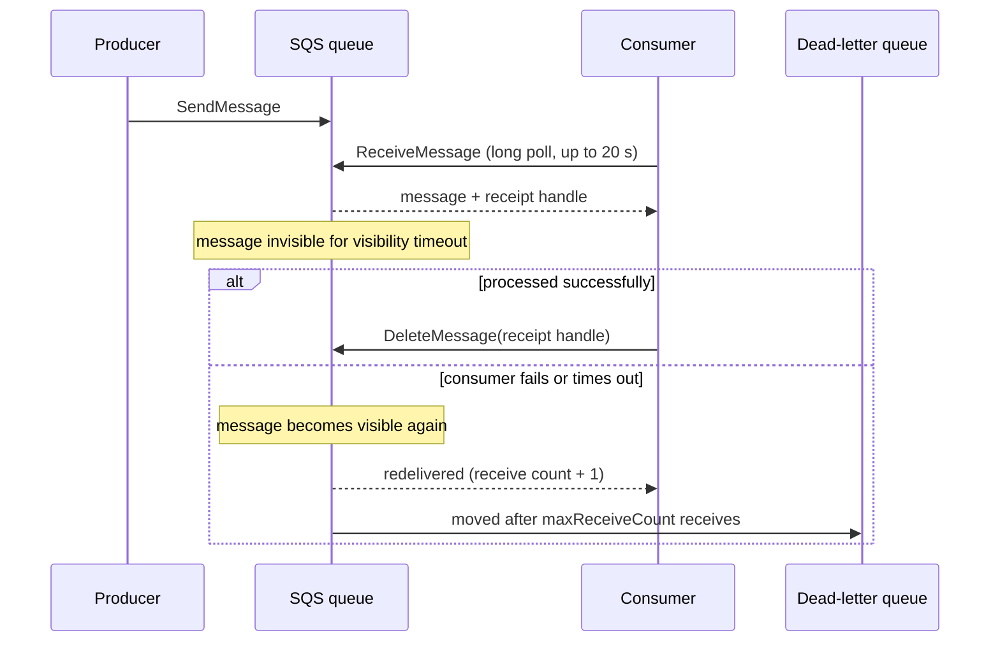
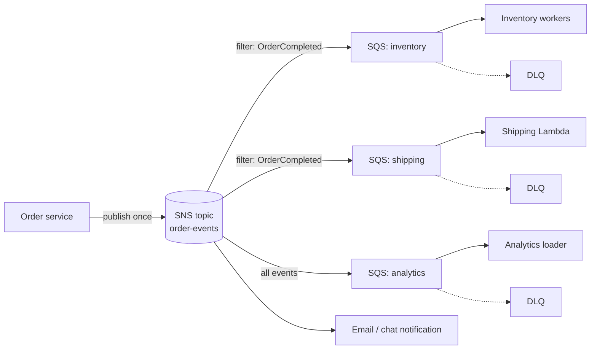

This page covers two complementary parts of running workloads on AWS. **Amazon CloudWatch** collects metrics, logs, and traces and turns them into alarms and dashboards. **Amazon SNS, Amazon SQS, and Amazon EventBridge** let components communicate asynchronously, so a slow or failed consumer does not take its producers down with it. The two meet in practice: alarms publish to SNS, queues are the first place a backlog becomes visible, and queue depth is one of the most useful scaling signals. For vendor-neutral background on the three telemetry signals, see [Observability](../../observability/).

---

## Observability on AWS



| Signal | CloudWatch feature | Answers |
|---|---|---|
| Metrics | CloudWatch Metrics, alarms, anomaly detection | *Is something wrong, and since when?* |
| Logs | CloudWatch Logs, Logs Insights, Live Tail | *What exactly happened in this component?* |
| Traces | X-Ray (via OpenTelemetry), Application Signals | *Where in the request path did time or errors go?* |
| Audit | AWS CloudTrail | *Who changed what, through which API call?* |
| Platform health | AWS Health Dashboard | *Is AWS itself having a problem that affects my resources?* |

---

## CloudWatch metrics

A **metric** is a time series identified by a **namespace** (`AWS/EC2`, `AWS/ApplicationELB`, or your own such as `Checkout`), a **name** (`CPUUtilization`), and up to 30 **dimensions** (name/value pairs such as `InstanceId=i-0abc...`). Each unique combination of dimensions is a separate metric and is billed separately, so dimensions must have bounded cardinality: `Environment` or `Endpoint` is fine, `UserId` or `RequestId` is not.

Most AWS services publish metrics automatically at 1-minute or 5-minute granularity (EC2 basic monitoring is 5-minute; detailed monitoring is 1-minute at extra cost). Custom metrics can be standard (1-minute) or **high resolution** (down to 1 second). CloudWatch keeps metric data for 15 months, rolling it up as it ages:

| Data point period | Retained for |
|---|---|
| Under 60 s (high resolution) | 3 hours |
| 60 s | 15 days |
| 5 minutes | 63 days |
| 1 hour | 455 days (15 months) |

Statistics include `Sum`, `Average`, `Minimum`, `Maximum`, `SampleCount`, and percentiles (`p50`, `p99`, `p99.9`). Latency should almost always be alarmed on a high percentile, not the average, which hides the tail that users actually notice.

### Publishing custom metrics

There are two main ways to emit application metrics:

- **Embedded Metric Format (EMF)**: write a structured JSON log line; CloudWatch Logs extracts the metrics asynchronously. There is no extra API call on the request path, and the full log line (with high-cardinality fields such as `orderId`) stays queryable in Logs Insights. This is the preferred approach for Lambda and containers.
- **`PutMetricData`**: a synchronous API call. Batch values into as few calls as possible; calling it once per request adds latency and cost.

An EMF log line, printed to stdout from a Lambda function or container:

```json
{
  "_aws": {
    "Timestamp": 1790000000000,
    "CloudWatchMetrics": [{
      "Namespace": "Checkout",
      "Dimensions": [["Service", "Environment"]],
      "Metrics": [
        {"Name": "OrderLatency", "Unit": "Milliseconds"},
        {"Name": "OrdersPlaced", "Unit": "Count"}
      ]
    }]
  },
  "Service": "checkout-api",
  "Environment": "prod",
  "OrderLatency": 184,
  "OrdersPlaced": 1,
  "orderId": "o-81723"
}
```

Libraries such as Powertools for AWS Lambda (Python, TypeScript, Java, .NET) and the `aws-embedded-metrics` packages generate this format. The equivalent direct API call with boto3:

```python
from datetime import datetime, timezone
import boto3

cloudwatch = boto3.client("cloudwatch")

cloudwatch.put_metric_data(
    Namespace="Checkout",
    MetricData=[{
        "MetricName": "OrdersPlaced",
        "Dimensions": [{"Name": "Environment", "Value": "prod"}],
        "Timestamp": datetime.now(timezone.utc),
        "Value": 1,
        "Unit": "Count",
    }],
)
```

---

## CloudWatch alarms

An **alarm** watches one metric or metric-math expression and moves between three states. State changes, not the state itself, trigger actions: publishing to SNS, scaling an Auto Scaling group, stopping or recovering an EC2 instance, or starting a Systems Manager automation.



Settings that decide whether an alarm is useful or noisy:

| Setting | Meaning | Guidance |
|---|---|---|
| `Period` | Aggregation window for each datapoint | 60 s for user-facing signals |
| `EvaluationPeriods` (N) and `DatapointsToAlarm` (M) | Alarm when M of the last N datapoints breach | "3 of 5" tolerates a single spike without waiting long |
| `TreatMissingData` | How gaps are treated: `missing`, `notBreaching`, `breaching`, `ignore` | `notBreaching` for sparse error counts; `breaching` for heartbeats |
| Threshold type | Static value, or an **anomaly detection** band learned from history | Use anomaly detection for seasonal traffic |
| Composite alarm | Boolean rule over other alarms (`ALARM(a) AND ALARM(b)`) | Page on the composite; keep component alarms silent to reduce alert fatigue |

### Alarming on a rate with metric math

Absolute error counts scale with traffic; an error *rate* does not. Metric math computes the rate from two metrics, and the alarm evaluates the expression:

```json
[
  {"Id": "errors", "ReturnData": false,
   "MetricStat": {"Period": 60, "Stat": "Sum",
     "Metric": {"Namespace": "AWS/ApplicationELB", "MetricName": "HTTPCode_Target_5XX_Count",
       "Dimensions": [{"Name": "LoadBalancer", "Value": "app/web-alb/0123456789abcdef"}]}}},
  {"Id": "requests", "ReturnData": false,
   "MetricStat": {"Period": 60, "Stat": "Sum",
     "Metric": {"Namespace": "AWS/ApplicationELB", "MetricName": "RequestCount",
       "Dimensions": [{"Name": "LoadBalancer", "Value": "app/web-alb/0123456789abcdef"}]}}},
  {"Id": "rate", "Expression": "100 * FILL(errors, 0) / requests",
   "Label": "5xx rate (%)", "ReturnData": true}
]
```

```bash
aws cloudwatch put-metric-alarm \
  --alarm-name web-5xx-rate \
  --alarm-description "Target 5xx rate above 1% for 3 of 5 minutes" \
  --metrics file://5xx-rate.json \
  --comparison-operator GreaterThanThreshold \
  --threshold 1 \
  --evaluation-periods 5 \
  --datapoints-to-alarm 3 \
  --treat-missing-data notBreaching \
  --alarm-actions arn:aws:sns:us-east-1:123456789012:oncall
```

### Billing alarm

Billing metrics exist only in **us-east-1** and only after *Receive CloudWatch billing alerts* is enabled in the Billing console. `EstimatedCharges` is updated several times a day, so a 6-hour period is appropriate. AWS Budgets is the more capable tool for forecasts and per-service budgets; see [Cost Optimization](cost.html).

```bash
aws cloudwatch put-metric-alarm --region us-east-1 \
  --alarm-name monthly-spend-over-100 \
  --namespace AWS/Billing --metric-name EstimatedCharges \
  --dimensions Name=Currency,Value=USD \
  --statistic Maximum --period 21600 \
  --evaluation-periods 1 --threshold 100 \
  --comparison-operator GreaterThanThreshold \
  --alarm-actions arn:aws:sns:us-east-1:123456789012:billing
```

---

## CloudWatch Logs

Logs are organised into **log groups** (usually one per application or function, such as `/aws/lambda/checkout`) containing **log streams** (one per instance, container, or Lambda execution environment). Log groups **never expire by default**, and log ingestion is typically the largest line item on a CloudWatch bill, so set a retention period on every group, ideally in IaC:

```bash
aws logs put-retention-policy \
  --log-group-name /aws/lambda/checkout \
  --retention-in-days 30
```

**Log classes** are chosen when a group is created and cannot be changed afterwards:

| Class | Use | Notable limitations |
|---|---|---|
| **Standard** | Operational logs that feed alarms, dashboards, or real-time processing | None |
| **Infrequent Access** | Logs kept for forensics or compliance and queried rarely; lower ingestion price | No metric filters, subscription filters, Live Tail, field indexes, anomaly detection, or EMF extraction; read through Logs Insights only |

Beyond storage, CloudWatch Logs provides:

- **Metric filters** that turn matching log lines into metrics (for example, count lines containing `"level":"ERROR"`).
- **Subscription filters** that stream log events in near real time to Lambda, Kinesis Data Streams, Amazon Data Firehose, or OpenSearch.
- **Live Tail** for streaming new events to the console or CLI during an incident.
- **Anomaly detection** and **pattern analysis**, which cluster similar log lines and flag unusual ones.
- **Data protection policies** that mask sensitive data such as credentials or personal information at ingestion.

### Logs Insights

Logs Insights queries one or many log groups (including across accounts with cross-account observability) and bills by data scanned. It supports three query languages: the purpose-built **Logs Insights QL**, **OpenSearch PPL**, and **OpenSearch SQL**, which allows joins and sub-queries across log groups. **Field indexes** on commonly filtered fields (such as `requestId` or `userId`) let a query skip events that cannot match, reducing both latency and cost. Queries time out after 60 minutes.

```sql
-- Logs Insights QL: slowest requests in the last hour (JSON logs)
fields @timestamp, path, duration_ms, status
| filter duration_ms > 1000
| sort duration_ms desc
| limit 20
```

```sql
-- Error count per 5-minute bucket, by error type
fields @timestamp, error_type
| filter level = "ERROR"
| stats count(*) as errors by error_type, bin(5m)
```

```sql
-- Lambda cold starts and their init duration (Lambda REPORT lines)
filter @type = "REPORT" and ispresent(@initDuration)
| stats count(*) as coldStarts, avg(@initDuration) as avgInitMs,
        pct(@duration, 99) as p99DurationMs by bin(1h)
```

Structured JSON logging makes all of this cheaper and simpler: fields are discovered automatically and filters operate on typed values instead of regular expressions. See [Logging](../../observability/logging.html) for general practice.

---

## Tracing and application monitoring

**AWS X-Ray** stores distributed traces and renders the service map; API Gateway, Lambda, and other services can emit segments natively. AWS has standardised instrumentation on **OpenTelemetry**: the X-Ray SDKs and X-Ray daemon entered maintenance mode (security fixes only) on 25 February 2026, and new work should use the OpenTelemetry SDKs or the **AWS Distro for OpenTelemetry (ADOT)**, with the CloudWatch agent or an OpenTelemetry Collector replacing the daemon. Traces still appear in the same CloudWatch trace views; OpenTelemetry span attributes map to X-Ray metadata by default. See [Tracing](../../observability/tracing.html) for the underlying concepts.

Higher-level CloudWatch features build on these signals:

| Feature | What it provides |
|---|---|
| **Application Signals** | Automatic RED metrics (requests, errors, duration) per service and operation from OpenTelemetry auto-instrumentation, a service map, and **service level objectives (SLOs)** with error-budget tracking |
| **Container Insights** | Cluster, node, pod, and task metrics for ECS and EKS, with an enhanced-observability mode for per-container detail |
| **Lambda Insights** | Per-invocation memory, CPU, and cold-start metrics through a Lambda extension |
| **Synthetics** | Scripted canaries that exercise endpoints and user flows on a schedule |
| **RUM** | Real-user monitoring from browsers: page loads, JavaScript errors, Web Vitals |
| **Internet Monitor** | Availability and latency between your users' networks and your AWS resources |
| **Investigations** | A generative-AI assistant that, starting from an alarm, metric, or Logs Insights query, gathers related metrics, logs, deployments, CloudTrail changes, and traces and proposes root-cause hypotheses; every action it takes is logged in CloudTrail |

For multi-account environments, **CloudWatch cross-account observability** links source accounts to a central monitoring account so dashboards, Logs Insights queries, alarms, and traces can span the whole Organization.

### A baseline alarm set

| Component | Metric | Typical alarm |
|---|---|---|
| ALB | `HTTPCode_Target_5XX_Count / RequestCount`, `TargetResponseTime` p99 | 5xx rate > 1%; p99 above the latency SLO |
| ALB target group | `UnHealthyHostCount` | > 0 for 3 of 5 minutes |
| Lambda | `Errors / Invocations`, `Throttles`, `Duration` p99 | Error rate > 1%; any sustained throttling |
| SQS | `ApproximateAgeOfOldestMessage` | Older than the processing SLO; this catches stuck consumers that depth alone misses |
| SQS dead-letter queue | `ApproximateNumberOfMessagesVisible` | > 0 |
| RDS / Aurora | `CPUUtilization`, `FreeableMemory`, `FreeStorageSpace`, `DatabaseConnections` | Sustained CPU > 80%; storage below 10% |
| DynamoDB | `ThrottledRequests`, `SystemErrors` | > 0 sustained |
| Account | `EstimatedCharges` (us-east-1) | Monthly budget threshold |

---

## Messaging and integration

Asynchronous messaging decouples producers from consumers in time and in failure: the producer hands a message to a durable service and moves on, and consumers process it at their own pace, retrying on failure. AWS offers three core services with different delivery models.

| | **SNS** | **SQS** | **EventBridge** |
|---|---|---|---|
| Model | Publish/subscribe (push) | Queue (consumers poll) | Event bus with content-based routing (push) |
| Consumers per message | Every matching subscriber | One consumer | Every matching rule target |
| Persistence | None beyond delivery retries | Up to 14 days | Retries up to 24 hours; optional archive and replay |
| Filtering | Subscription filter policies on attributes or body | None | Rich event patterns on any JSON field |
| Ordering | FIFO topics | FIFO queues | Not guaranteed |
| Typical targets | SQS, Lambda, HTTP(S), email, mobile push | Worker fleets, Lambda | Over 20 AWS services, API destinations (SaaS webhooks) |
| Choose when | Broadcasting one event to many independent consumers at high throughput | Buffering and load-levelling work for one consumer group | Routing events by content, integrating AWS service and SaaS events, schedules |

EventBridge also includes **Pipes** (point-to-point source-to-target integration with optional filtering, enrichment, and transformation) and **Scheduler** (one-time and recurring invocations at scale, replacing cron-on-an-instance). For protocol-level background on event-driven design, see [Async APIs and Events](../../api-design/async-and-events.html).

### Amazon SQS

SQS stores messages until a consumer receives and explicitly deletes them. A received message is not removed; it becomes invisible for the **visibility timeout** and reappears if not deleted in time, which is how SQS provides at-least-once delivery without the consumer holding a connection.



| Property | Standard queue | FIFO queue |
|---|---|---|
| Ordering | Best effort | Strict within a **message group** (`MessageGroupId`) |
| Delivery | At least once; occasional duplicates | Exactly-once processing within a 5-minute deduplication window |
| Throughput | Nearly unlimited | 300 API calls/s per action (3,000 messages/s with batches of 10); high-throughput mode reaches up to 70,000 calls/s in the largest Regions |
| Name | Any | Must end in `.fifo` |

Limits worth knowing: messages up to **1 MiB** (larger payloads go to S3 via the extended client libraries), retention from 60 seconds to **14 days** (default 4 days), visibility timeout up to **12 hours**, long-poll wait up to **20 seconds**, batches of up to **10** messages.

A worker that handles failures correctly:

```python
import json
import boto3

sqs = boto3.client("sqs")
QUEUE_URL = "https://sqs.us-east-1.amazonaws.com/123456789012/orders"

def poll_forever(handle):
    while True:
        resp = sqs.receive_message(
            QueueUrl=QUEUE_URL,
            MaxNumberOfMessages=10,
            WaitTimeSeconds=20,        # long polling: fewer empty responses
            VisibilityTimeout=60,      # longer than worst-case processing time
        )
        done = []
        for msg in resp.get("Messages", []):
            try:
                handle(json.loads(msg["Body"]))
                done.append({"Id": msg["MessageId"],
                             "ReceiptHandle": msg["ReceiptHandle"]})
            except Exception:
                # Do not delete: the message reappears after the visibility
                # timeout and moves to the DLQ after maxReceiveCount attempts.
                pass
        if done:
            sqs.delete_message_batch(QueueUrl=QUEUE_URL, Entries=done)
```

Operational practices:

- **Always attach a dead-letter queue** with a `maxReceiveCount` (3 to 5 is common) and alarm when it is non-empty. After fixing the bug, use **DLQ redrive** to move messages back to the source queue.
- **Make consumers idempotent.** Standard queues can deliver twice, and any consumer can crash after doing the work but before deleting the message. Deduplicate on a business key.
- **Set the visibility timeout above the worst-case processing time**, or extend it with `ChangeMessageVisibility` for long jobs. For Lambda consumers, AWS recommends a queue visibility timeout of at least six times the function timeout.
- **With Lambda, report partial batch failures.** Enable `ReportBatchItemFailures` on the event source mapping and return the IDs of failed messages, so one bad message does not force the whole batch to be retried.
- **Scale on backlog per worker**, `ApproximateNumberOfMessagesVisible` divided by the number of consumers, rather than on CPU.

**Fair queues** address the noisy-neighbour problem in multi-tenant standard queues. When producers set `MessageGroupId` to a tenant identifier on a standard queue, SQS detects a tenant with a disproportionate share of in-flight messages and prioritises delivery of other tenants' messages, keeping their dwell time low. No consumer changes are needed, and unlike on FIFO queues the group ID does not impose ordering.

FIFO example, ordering payments per customer while processing different customers in parallel:

```python
sqs.send_message(
    QueueUrl="https://sqs.us-east-1.amazonaws.com/123456789012/payments.fifo",
    MessageBody=json.dumps(payment),
    MessageGroupId=payment["customer_id"],        # ordering scope
    MessageDeduplicationId=payment["payment_id"],  # or enable content-based dedup
)
```

Throughput on a FIFO queue scales with the number of distinct message groups; a single hot group is processed strictly one message at a time.

### Amazon SNS

SNS pushes each published message to every subscription on a **topic**. Subscribers can be SQS queues, Lambda functions, HTTP(S) endpoints, Amazon Data Firehose, email, SMS, and mobile push. **Subscription filter policies** let each subscriber receive only the messages it cares about, so producers do not need to know who is listening.

```python
import json
import boto3

sns = boto3.client("sns")
TOPIC_ARN = "arn:aws:sns:us-east-1:123456789012:order-events"

sns.publish(
    TopicArn=TOPIC_ARN,
    Message=json.dumps({"orderId": "o-81723", "total": 99.99}),
    MessageAttributes={
        "eventType": {"DataType": "String", "StringValue": "OrderCompleted"},
    },
)

# The shipping queue only receives completed orders
sns.subscribe(
    TopicArn=TOPIC_ARN,
    Protocol="sqs",
    Endpoint="arn:aws:sqs:us-east-1:123456789012:shipping",
    Attributes={
        "FilterPolicy": json.dumps({"eventType": ["OrderCompleted"]}),
        "RawMessageDelivery": "true",
    },
)
```

SNS retries failed deliveries according to a per-protocol policy; attach a **dead-letter queue to each subscription** so undeliverable messages are kept rather than dropped. **FIFO topics** preserve ordering and deduplicate, and can deliver to FIFO or standard SQS queues.

### Fan-out: SNS to SQS

The most common composition publishes once to SNS and gives each consumer its own SQS queue. Each consumer gets durable buffering, independent retries, and its own dead-letter queue, and a slow or failing consumer cannot affect the others.



The queue policy on each SQS queue must allow the topic to send to it (`sqs:SendMessage` with an `aws:SourceArn` condition naming the topic); the CDK `SqsSubscription` construct and SNS console add this automatically. When routing rules become content-heavy or events come from many AWS services, EventBridge with SQS targets is the equivalent pattern.

---

## Operational tooling

- **AWS CLI `--query`** filters output with JMESPath on the client side:

  ```bash
  aws ec2 describe-instances \
    --filters Name=instance-state-name,Values=running \
    --query 'Reservations[].Instances[].[InstanceId, Tags[?Key==`Name`]|[0].Value]' \
    --output table
  ```

- **Systems Manager Session Manager** opens a shell on an instance through the SSM agent, with no open inbound ports, SSH keys, or bastion hosts, and records sessions to CloudWatch Logs or S3: `aws ssm start-session --target i-0123456789abcdef0`.
- **AWS Health Dashboard** (formerly the Personal Health Dashboard) lists AWS service events and scheduled maintenance that affect your specific resources; Health events can be routed through EventBridge to the same notification channels as alarms.
- **CloudTrail Lake** or CloudTrail event history answers "who changed this?" during an incident; see [Security](security.html).

For step-by-step incident response, see [Troubleshooting](troubleshooting.html).

---

## See Also

- [AWS Hub](./) - Overview of all AWS documentation
- [Observability](../../observability/) - Metrics, logs, and traces beyond AWS
- [Troubleshooting & Emergency Response](troubleshooting.html) - Diagnosing production issues
- [Infrastructure as Code](iac.html) - Define alarms, queues, and topics in CloudFormation or CDK
- [Compute Services](compute.html) - EC2, Lambda, and Auto Scaling
- [Cost Optimization](cost.html) - Budgets and controlling CloudWatch spend
- [Distributed Systems](../../distributed-systems/) - Delivery semantics and idempotency in depth
