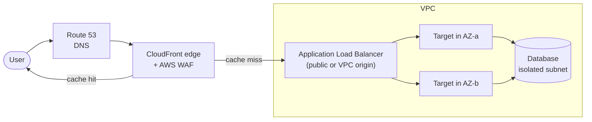
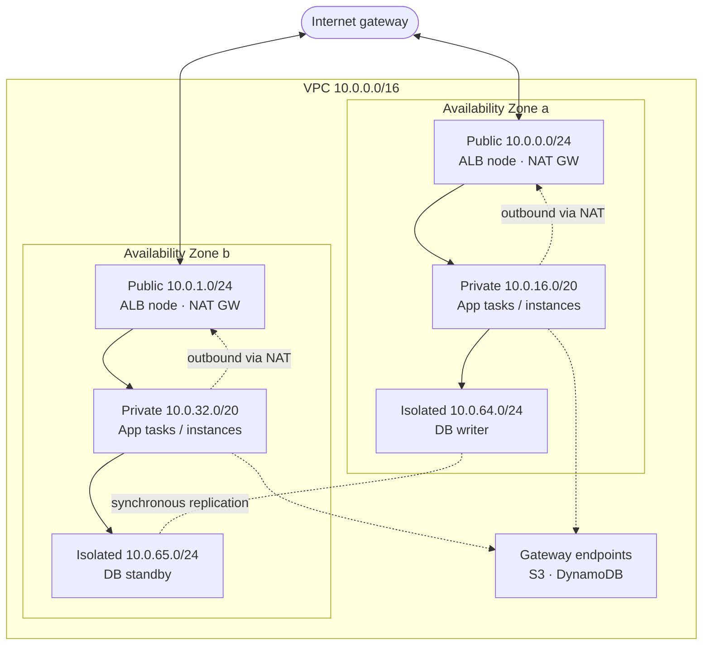
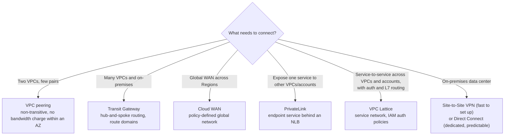

AWS networking has two halves. Inside a Region, **Amazon VPC** provides isolated IP networks in which subnets, route tables, gateways, and firewalls determine what can reach what. At the edge, **Elastic Load Balancing, Amazon CloudFront, Amazon API Gateway, and Amazon Route 53** accept traffic from users and deliver it to those private networks. This page covers VPC design and connectivity, the load balancer family, CloudFront, API Gateway, and DNS, and ends with the most common and costly mistakes. For protocol-level background, see [Networking Fundamentals](../networking/) and [Cloud Networking](../networking/cloud-networking.html).

---

## How a request reaches an application



DNS resolves the hostname to the nearest CloudFront edge. Cached responses return from the edge; cache misses travel over the AWS backbone to the origin, usually an Application Load Balancer, which spreads requests across healthy targets in several Availability Zones. Security groups at each hop admit only the traffic expected from the previous hop.

---

## Amazon VPC

A **VPC** is a logically isolated network in one Region with one or more IPv4 CIDR blocks (between /16 and /28) and optionally IPv6. It spans every Availability Zone in the Region; each **subnet** lives in exactly one AZ. AWS reserves five addresses in every subnet (network address, VPC router, DNS, one for future use, and broadcast), so a /24 provides 251 usable addresses.

### Building blocks

| Component | Scope | Purpose |
|---|---|---|
| **Subnet** | One AZ | Address range whose route table determines whether it is public, private, or isolated |
| **Route table** | Subnet association | Longest-prefix-match routing to local, gateway, endpoint, peering, or Transit Gateway targets |
| **Internet gateway (IGW)** | VPC | Two-way internet access for resources with public IPs; horizontally scaled, no bandwidth limit, no charge |
| **Egress-only internet gateway** | VPC | Outbound-only internet access for IPv6 |
| **NAT gateway** | AZ, or Regional | Outbound-only IPv4 internet access for private resources |
| **Security group** | Network interface | Stateful allow-list firewall; can reference other security groups |
| **Network ACL** | Subnet | Stateless, ordered allow/deny rules; a coarse second layer |
| **VPC endpoint** | VPC | Private access to AWS services or PrivateLink services without traversing the internet |
| **VPC Flow Logs** | VPC, subnet, or ENI | Records of accepted and rejected flows, delivered to CloudWatch Logs, S3, or Firehose |

A subnet is **public** if its route table sends `0.0.0.0/0` to an internet gateway, **private** if it sends it to a NAT gateway, and **isolated** if it has no default route at all.

### Security groups and network ACLs

| | Security group | Network ACL |
|---|---|---|
| Attached to | Elastic network interface (instance, task, Lambda ENI, load balancer) | Subnet |
| State | **Stateful**: return traffic is allowed automatically | **Stateless**: return traffic (ephemeral ports 1024-65535) needs an explicit rule |
| Rules | Allow only | Allow and deny, evaluated in rule-number order |
| Sources | CIDRs, prefix lists, **other security groups** | CIDRs only |
| Default | Deny all inbound, allow all outbound | Default NACL allows all |

Security groups are the primary control. Referencing security groups instead of IP ranges ("the database accepts port 5432 from the app tier's security group") keeps rules correct as instances scale in and out. Network ACLs are best reserved for broad subnet-level denies, such as blocking a known-bad range.

### Reference design: three tiers across AZs



- **Public subnets** hold only things that must accept internet traffic or provide egress: load balancer nodes and NAT gateways. They can be small.
- **Private subnets** hold application compute. Size them generously; containers (with `awsvpc` networking), Lambda functions in a VPC, and EKS pods each consume an IP address.
- **Isolated subnets** hold databases and caches with no route to the internet.
- **Gateway endpoints** for S3 and DynamoDB are free and keep that traffic off the NAT gateway.

Plan the VPC CIDR so it does not overlap with on-premises networks or other VPCs you may connect later; overlapping ranges cannot be routed between. **Amazon VPC IP Address Manager (IPAM)** allocates non-overlapping ranges across an Organization.

### Egress: NAT gateways, endpoints, and IPv6

NAT gateways are convenient but are often the largest networking charge: an hourly fee **plus a per-GB processing fee** on every byte, on top of normal data transfer (in US East, USD 0.045 per hour and USD 0.045 per GB). Three decisions control that cost and the availability of egress:

1. **Availability mode.** A classic **zonal** NAT gateway lives in one public subnet and one AZ; highly available designs need one per AZ, each with its own route table entries. A **regional** NAT gateway is a single resource that expands automatically into every AZ where the VPC has workloads (it can take up to an hour to expand into a newly used AZ). It needs no public subnet, supports up to 32 IP addresses per AZ instead of 8, and can be routed to from every private subnet with one route table. Regional mode does not support private NAT; use zonal NAT gateways for private (VPC-to-VPC) address translation.
2. **VPC endpoints.** Traffic to AWS services does not need the internet. **Gateway endpoints** (S3, DynamoDB) are route-table entries and have no charge. **Interface endpoints** (AWS PrivateLink) place an ENI in your subnets for most other services (ECR, CloudWatch Logs, Secrets Manager, STS, SQS, and so on) and are billed per hour per AZ and per GB, usually far less than NAT processing for high-volume traffic.
3. **IPv6.** Dual-stack subnets with an egress-only internet gateway give outbound internet access with no NAT charge. AWS charges **USD 0.005 per hour for every public IPv4 address** (in use or idle) since February 2024, which also makes IPv6 and private subnets more attractive.

**VPC Block Public Access** is an account- and Region-wide switch that authoritatively blocks internet gateway traffic, either in both directions or ingress only (NAT and egress-only gateways still work), regardless of route tables and security groups. Specific VPCs or subnets can be excluded. It is a strong guardrail for accounts that should never be internet-facing.

### Connecting networks



| Option | Layer | Transitive | Overlapping CIDRs | Best for |
|---|---|---|---|---|
| VPC peering | 3 | No | Not allowed | A small number of VPC pairs |
| Transit Gateway | 3 | Yes, via route tables | Not allowed | Tens to thousands of VPCs plus VPN/Direct Connect |
| Cloud WAN | 3 | Yes | Not allowed | Multi-Region networks managed by policy |
| PrivateLink | 4 (TCP) | N/A, one-way | **Allowed** | Publishing a service to consumers you do not want to route to |
| VPC Lattice | 7 (HTTP, gRPC) and TCP | N/A | **Allowed** | Service-to-service connectivity with IAM-based authorization, without managing routes |

---

## Elastic Load Balancing

Load balancers spread traffic across targets (instances, IP addresses, containers, Lambda functions) in multiple AZs, remove unhealthy targets using health checks, and terminate TLS.

| Load balancer | Layer | Protocols | Distinguishing features | Use for |
|---|---|---|---|---|
| **Application (ALB)** | 7 | HTTP/1.1, HTTP/2, gRPC, WebSocket | Host, path, header, query-string, and method routing; weighted target groups; OIDC/Cognito authentication; AWS WAF; Lambda targets | Web applications and HTTP APIs |
| **Network (NLB)** | 4 | TCP, UDP, TLS | Static IP (or Elastic IP) per AZ; millions of requests per second; preserves client IP; security groups; PrivateLink endpoint services | Non-HTTP protocols, very high throughput, static IP requirements |
| **Gateway (GWLB)** | 3 | IP (GENEVE encapsulation) | Transparent insertion of third-party firewalls and inspection appliances | Centralised network inspection |
| **Classic (CLB)** | 4/7 | HTTP, TCP | Previous generation | Migrate to ALB or NLB |

Behaviour that matters in practice:

- **Health checks** should hit a lightweight endpoint that verifies the process can serve requests, not deep dependencies; a database blip that fails every target's health check takes the whole service offline.
- **Deregistration delay** (connection draining, default 300 seconds) holds a target in rotation for in-flight requests during deployments. Lower it for short requests to speed up deploys.
- **Cross-zone load balancing** is on by default for ALBs and off by default for NLBs; with it off, each AZ's node only uses targets in its own AZ.
- **Slow start** and **least outstanding requests** routing on ALB avoid overwhelming newly registered or slower targets.

```bash
aws elbv2 create-target-group --name web-tg \
  --protocol HTTP --port 8080 --target-type ip --vpc-id vpc-0abc123 \
  --health-check-path /health --health-check-interval-seconds 15 \
  --healthy-threshold-count 2 --unhealthy-threshold-count 3
```

---

## Amazon CloudFront

CloudFront is AWS's content delivery network. It terminates TLS and HTTP/2 or HTTP/3 connections at edge locations close to users, serves cached responses from there, and forwards cache misses to the origin over the AWS backbone through regional edge caches. Even uncacheable dynamic traffic benefits from shorter TLS handshakes and a better network path.

### Origins

| Origin | Securing it |
|---|---|
| **S3 bucket** | **Origin Access Control (OAC)**: the bucket stays private and its policy allows only the CloudFront distribution. OAC replaces the legacy Origin Access Identity and supports SSE-KMS |
| **VPC origin** (ALB, NLB, or EC2 instance in a private subnet) | CloudFront reaches the resource through a service-managed ENI; the origin has no public address, and its security group allows only the CloudFront prefix list or the service-managed security group |
| **Public ALB or custom HTTP origin** | Restrict inbound traffic to the CloudFront managed prefix list and require a secret custom header, or move to a VPC origin |
| **API Gateway, Lambda function URL** | Service-specific access controls (for example, OAC for Lambda function URLs) |

**Origin groups** provide failover to a secondary origin on specified error codes, and **Origin Shield** adds a central caching layer in front of the origin to raise the cache hit ratio.

### Caching

Caching behaviour is configured per path pattern (**cache behavior**) with reusable policies:

- A **cache policy** defines the cache key (which headers, cookies, and query strings vary the response) and TTLs. Every value added to the cache key lowers the hit ratio, so include only what changes the response.
- An **origin request policy** controls what is forwarded to the origin *without* becoming part of the cache key.
- A **response headers policy** adds security headers (HSTS, CSP), CORS headers, and `Server-Timing`.

Use long TTLs with content-hashed filenames (`app.3f9c2a.js`) for static assets so deployments never need invalidation; invalidations beyond the free monthly allowance are billed per path. Keep short or zero TTLs for HTML and personalised responses.

### Edge compute

| | **CloudFront Functions** | **Lambda@Edge** |
|---|---|---|
| Runtime | JavaScript (lightweight runtime) | Node.js, Python |
| Runs at | Every edge location | Regional edge caches |
| Triggers | Viewer request / viewer response | Viewer and origin request/response |
| Execution time | Sub-millisecond | Up to 5 s (viewer) or 30 s (origin) |
| Network and body access | No | Yes |
| Typical use | URL rewrites, redirects, header normalisation, simple token checks | Auth against external services, origin selection, body manipulation |

**CloudFront KeyValueStore** gives CloudFront Functions a low-latency key-value lookup (for redirects or feature flags) without redeploying the function.

AWS WAF web ACLs attach to CloudFront distributions (as well as ALBs and API Gateway) to filter requests before they reach the origin; AWS Shield Standard DDoS protection applies to all CloudFront distributions at no charge. See [Security](security.html).

---

## Amazon API Gateway

API Gateway is a managed front door for APIs backed by Lambda, HTTP services, or direct AWS service integrations. It offers three API types:

| Feature | **REST API** | **HTTP API** | **WebSocket API** |
|---|---|---|---|
| Relative cost | Higher | Lower | Per message and connection-minute |
| Endpoint types | Edge-optimized, Regional, Private | Regional | Regional |
| Authorization | IAM, Cognito, Lambda authorizers, resource policies | IAM, **native JWT authorizers** (Cognito or any OIDC issuer), Lambda authorizers | IAM, Lambda authorizers |
| API keys and usage plans (per-client throttling and quotas) | Yes | No | No |
| Request validation and body transformation | Yes | Parameter mapping only | Route selection and templates |
| Caching | Yes | No | No |
| AWS WAF | Yes | No | No |
| Response streaming | Yes | No | Not applicable |
| X-Ray tracing | Yes | No | No |
| Private integrations (ALB, NLB) | Yes | Yes, plus Cloud Map | No |

Choose **HTTP APIs** for straightforward Lambda or HTTP proxies with JWT authentication; choose **REST APIs** when you need usage plans, WAF, caching, request validation, private endpoints, or response streaming. REST API integrations time out after 29 seconds by default (HTTP APIs allow up to 30); for longer operations, return `202 Accepted` and complete the work asynchronously, or use response streaming.

```bash
# REST API: throttle and meter a client tier
aws apigateway create-usage-plan --name basic \
  --api-stages apiId=a1b2c3d4e5,stage=prod \
  --throttle burstLimit=100,rateLimit=50 \
  --quota limit=100000,period=MONTH

# HTTP API: JWT authorizer against a Cognito user pool
aws apigatewayv2 create-authorizer --api-id a1b2c3d4e5 \
  --name cognito-jwt --authorizer-type JWT \
  --identity-source '$request.header.Authorization' \
  --jwt-configuration Audience=my-app-client-id,Issuer=https://cognito-idp.us-east-1.amazonaws.com/us-east-1_EXAMPLE
```

**API Gateway or ALB?** An ALB is priced per hour and per load balancer capacity unit rather than per request, which is cheaper at sustained high request rates and supports long-lived connections, gRPC, and WebSockets. API Gateway adds API management (keys, quotas, validation, per-client throttling) and scales to zero cost at zero traffic. Many architectures use API Gateway for public, partner-facing APIs and an ALB for high-volume first-party traffic.

For API design itself (resource modelling, versioning, pagination, error formats), see [API Design](../../api-design/).

---

## Amazon Route 53

Route 53 provides public and private DNS, domain registration, and health checks. **Alias records** point a name (including the zone apex, `example.com`) at AWS resources such as CloudFront, ALBs, and API Gateway without a CNAME and without query charges.

| Routing policy | Behaviour | Use |
|---|---|---|
| Simple | One record set | Single endpoint |
| Weighted | Split by weight | Canary and blue/green cut-overs |
| Latency-based | Lowest-latency Region for the resolver | Active-active multi-Region |
| Failover | Primary/secondary driven by health checks | Active-passive disaster recovery |
| Geolocation / geoproximity | By user location, with optional bias | Data residency, regional content |
| IP-based | By client CIDR | Routing specific networks to specific endpoints |
| Multivalue answer | Up to eight healthy records | Simple client-side load spreading |

**Route 53 Resolver** handles DNS inside VPCs; inbound and outbound Resolver endpoints connect it with on-premises DNS, and **Resolver DNS Firewall** blocks lookups of malicious or unapproved domains. **AWS Global Accelerator** is the alternative to DNS-based steering when clients need two static anycast IP addresses and sub-minute failover independent of DNS caching.

---

## Common pitfalls

| Pitfall | Consequence | Fix |
|---|---|---|
| One zonal NAT gateway for all AZs | Egress fails when that AZ fails; cross-AZ data charges | One zonal NAT gateway per AZ, or a regional NAT gateway |
| All AWS API traffic through NAT | Large per-GB NAT processing charges (ECR image pulls and S3 are common culprits) | Gateway endpoints for S3/DynamoDB; interface endpoints for high-volume services |
| `0.0.0.0/0` on SSH or RDP | Instances exposed to internet-wide scanning | Session Manager instead of SSH; no inbound admin ports |
| IP-based security group rules between tiers | Rules break as instances and tasks scale | Reference security groups |
| Overlapping CIDRs | VPCs cannot be peered or routed through Transit Gateway | Plan with IPAM; PrivateLink or VPC Lattice when overlap is unavoidable |
| Undersized private subnets | IP exhaustion blocks scaling of ECS tasks, Lambda ENIs, EKS pods | Use /20 or larger for compute subnets; add secondary CIDRs or IPv6 |
| Public S3 origin behind CloudFront | Users bypass the CDN, WAF, and access controls | Origin Access Control with a private bucket |
| Frequent `/*` invalidations | Invalidation charges and cold caches | Content-hashed filenames, long TTLs |
| Unused Elastic IPs and public IPv4 addresses | USD 0.005 per hour each, in use or idle | Release them; prefer private subnets and IPv6 |

---

## See Also

- [AWS Hub](./) - Overview of all AWS documentation
- [Networking Fundamentals](../networking/) - TCP/IP, DNS, routing, and load balancing concepts
- [Cloud Networking](../networking/cloud-networking.html) - Cross-provider cloud network design
- [Security](security.html) - IAM, WAF, Shield, and network security controls
- [Compute Services](compute.html) - EC2, Lambda, and containers inside a VPC
- [Infrastructure as Code](iac.html) - Defining VPCs and load balancers in CloudFormation and CDK
- [Cost Optimization](cost.html) - Data transfer and NAT cost control
- [Kubernetes](../kubernetes/) - EKS networking builds on these VPC primitives
