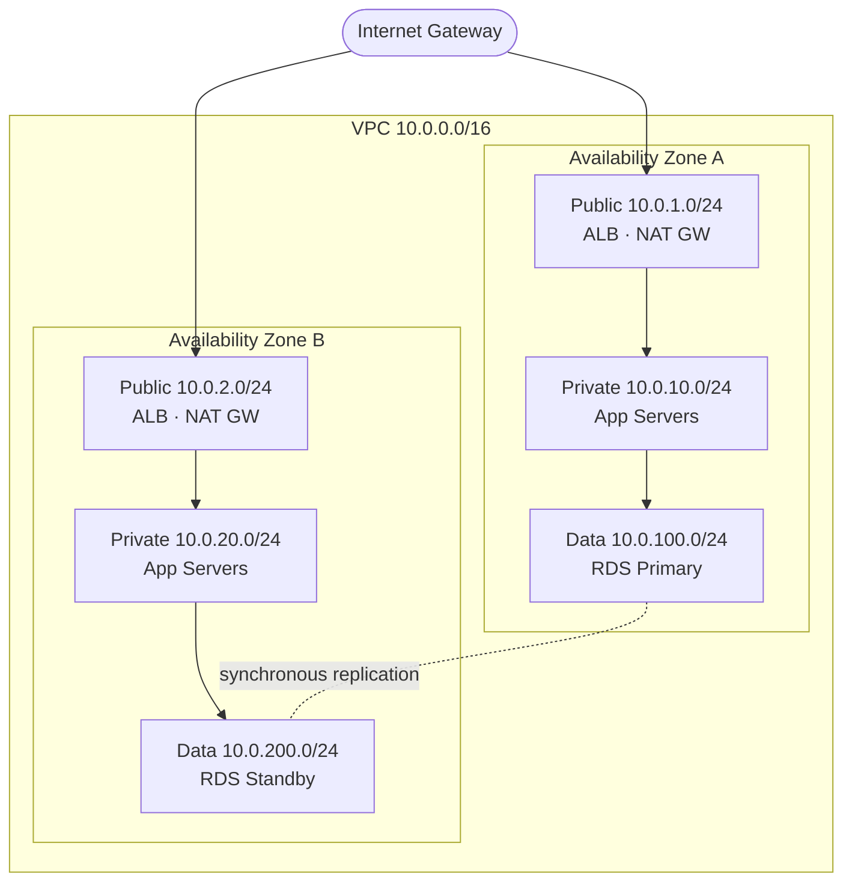
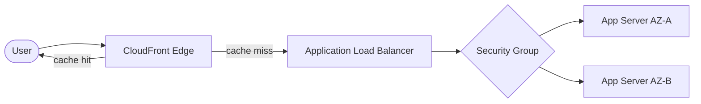

VPC private networks, CloudFront CDN, API Gateway, and load balancing are the building blocks of secure, fast, and resilient cloud architecture. This page covers each and how they fit together.

## Why Networking Matters

Networking is the foundation of every cloud architecture. Get it right, and your applications are secure, fast, and resilient. Get it wrong, and you face security vulnerabilities, performance bottlenecks, or unexpected costs.

This guide covers:
- **VPC (Virtual Private Cloud)**: Your private network in AWS
- **Load Balancing**: Distributing traffic across servers
- **CloudFront**: Delivering content globally with low latency
- **API Gateway**: Managing and securing your APIs

Consider the following before designing your network: Where will users access your application from? What needs to be public vs. private? How will services communicate with each other?

---

## VPC - Your Private Cloud Network

VPC (Virtual Private Cloud) lets you create isolated networks in AWS. Think of it as your own private data center in the cloud, complete with subnets, routing rules, and security controls.

**Why VPCs matter**: Without a VPC, your resources would be exposed directly to the internet. VPCs provide network isolation, allowing you to control exactly what can communicate with what.

### Key VPC Concepts

Before diving in, familiarize yourself with these building blocks:

| Component | What It Does | When to Use |
|-----------|-------------|-------------|
| **Subnets** | Subdivide your VPC into segments | Separate public/private resources |
| **Internet Gateway** | Connects VPC to the internet | Required for public-facing resources |
| **NAT Gateway** | Lets private resources access internet (outbound only) | Private servers needing updates/APIs |
| **Security Groups** | Instance-level firewalls (stateful) | Control traffic to/from each resource |
| **Network ACLs** | Subnet-level firewalls (stateless) | Additional layer of defense |
| **Route Tables** | Control traffic routing | Direct traffic between subnets/internet |

### Multi-AZ Architecture

For production workloads, spread resources across multiple Availability Zones. If one AZ fails, your application continues running in another. The diagram below shows a canonical three-tier VPC spanning two AZs, with traffic flowing inward from the internet to public, then private, then data subnets.



The public subnets hold internet-facing resources (load balancers, NAT gateways). Private subnets hold application servers that reach the internet only outbound via NAT. Data subnets isolate databases with no internet route at all.

**Real-world example**: An e-commerce application runs web servers in public subnets (accessible from the internet) and databases in private subnets (only accessible from web servers). If AZ-A experiences an outage, traffic automatically routes to AZ-B.

### VPC Best Practices

- **Use private subnets by default**: Only place resources in public subnets if they must be directly accessible from the internet
- **Deploy NAT Gateways in each AZ**: Prevents cross-AZ traffic charges and provides resilience
- **Use Security Groups as primary firewall**: They are stateful and easier to manage than NACLs
- **Plan your CIDR blocks**: Choose ranges that do not overlap with on-premises networks if you plan to connect them later

---

## API Gateway - Managing Your APIs

API Gateway provides a managed service for creating, deploying, and securing APIs. It handles authentication, rate limiting, caching, and monitoring so you can focus on your backend logic.

### When to Use API Gateway

- **REST APIs**: Traditional request/response APIs for web and mobile
- **WebSocket APIs**: Real-time two-way communication (chat, gaming)
- **HTTP APIs**: Simpler, cheaper alternative to REST APIs

### API Gateway vs Application Load Balancer

| Feature | API Gateway | Application Load Balancer |
|---------|-------------|---------------------------|
| API management | Full (throttling, keys, usage plans) | Basic |
| Cost model | Per request | Per hour + data |
| WebSocket support | Yes | No |
| Request transformation | Yes | No |
| Best for | APIs needing management features | Simple HTTP routing |

### Key API Gateway Features

**Request Validation**: Validate request bodies and parameters before they reach your backend:

```bash
# Create a request validator
aws apigateway create-request-validator --rest-api-id xxx \
  --name "ValidateBody" --validate-request-body
```

**Usage Plans and API Keys**: Control who can access your API and how much:

```bash
# Create a usage plan with rate limiting
aws apigateway create-usage-plan --name "BasicPlan" \
  --throttle burstLimit=100,rateLimit=50 \
  --quota limit=1000,period=DAY
```

**Custom Authorizers**: Use Lambda functions to implement custom authentication:

```bash
# Create a Lambda authorizer
aws apigateway create-authorizer --rest-api-id xxx \
  --name "JWTAuthorizer" --type TOKEN \
  --authorizer-uri "arn:aws:lambda:region:account:function:authorizer"
```

---

## CloudFront - Content Delivery Network

CloudFront is AWS's content delivery network (CDN). Instead of users fetching data from your servers in one region, CloudFront caches content at 600+ edge locations worldwide. Users get data from the nearest location, reducing latency from seconds to milliseconds.

### When to Use CloudFront

- **Static assets** (images, CSS, JavaScript): Immediate 10x performance boost
- **API responses** that do not change frequently: Reduce origin load
- **Video streaming**: Adaptive bitrate based on user connection
- **Global applications**: Consistent performance worldwide

**Real-world impact**: A news website serving images from S3 in US-East to users in Australia saw 2-second load times. After adding CloudFront, Australian users get 200ms load times from the Sydney edge location.

### CloudFront Origin Types

| Origin Type | Use Case | Configuration |
|-------------|----------|---------------|
| **S3 bucket** | Static websites, media files | Use Origin Access Control for security |
| **Application Load Balancer** | Dynamic content from EC2/ECS | Forward headers for personalization |
| **Custom origin** | Any HTTP server | Your on-premises or other cloud servers |
| **Lambda@Edge** | Serverless at the edge | Customize requests/responses globally |

### Setting Up CloudFront

**Basic setup for S3 static website**:

```bash
# Create a CloudFront distribution with S3 origin
aws cloudfront create-distribution \
  --origin-domain-name my-bucket.s3.amazonaws.com \
  --default-root-object index.html
```

**Cache settings to consider**:
- **Static assets** (images, CSS, JS): Cache for 7+ days
- **Dynamic content**: Cache for minutes or disable caching
- **API responses**: Usually no caching, or short TTL

### CloudFront Best Practices

- **Use Origin Access Control**: Prevent direct S3 access; force all traffic through CloudFront
- **Enable compression**: Reduces file sizes by 60-80% for text-based content
- **Use custom error pages**: Provide friendly 404 and 500 error pages
- **Set up logging**: Track usage patterns and troubleshoot issues
- **Invalidate wisely**: Invalidations cost money; use versioned filenames instead

---

## Load Balancing

Load balancers distribute incoming traffic across multiple targets (EC2 instances, containers, IP addresses). They improve availability by routing around failures and enable horizontal scaling.

### Choosing the Right Load Balancer

| Load Balancer | Best For | Key Features | Cost |
|---------------|----------|--------------|------|
| **Application (ALB)** | Web applications, APIs | Path/host routing, WebSocket, HTTP/2 | Moderate |
| **Network (NLB)** | High-performance, TCP/UDP | Ultra-low latency, static IPs | Lower |
| **Gateway (GWLB)** | Security appliances | Third-party firewall/IDS integration | Varies |
| **Classic** | Legacy applications | Avoid for new projects | Legacy; avoid for new projects |

**Recommendation**: Use ALB for most web applications. Use NLB only when you need ultra-low latency or static IP addresses.

### Common Load Balancer Patterns

**Path-based routing** (ALB): Route `/api/*` to API servers, `/static/*` to static content servers

**Host-based routing** (ALB): Route `api.example.com` to API, `www.example.com` to web servers

**Health checks**: Configure targets to be removed from rotation when unhealthy:

```bash
# Create a target group with health checks
aws elbv2 create-target-group --name my-targets \
  --protocol HTTP --port 80 --vpc-id vpc-xxx \
  --health-check-path /health --health-check-interval-seconds 30
```

### End-to-End Request Flow

A typical request for a global web application touches several networking layers before reaching your servers:



Cached responses return directly from the nearest edge location. Cache misses route to the origin load balancer, which checks the security group and distributes traffic to healthy targets across AZs.

<div class="notice--warning">
  <h4>Common Pitfalls</h4>
  <ul>
    <li><strong>Single NAT Gateway:</strong> Placing one NAT Gateway for all AZs creates a single point of failure and incurs cross-AZ data transfer charges. Deploy one per AZ.</li>
    <li><strong>Overly broad security groups:</strong> <code>0.0.0.0/0</code> on port 22 (SSH) exposes instances to the entire internet. Scope inbound rules to known CIDRs or use Session Manager instead.</li>
    <li><strong>Overlapping CIDR blocks:</strong> VPCs you intend to peer (or connect to on-premises) must not overlap. Plan address space before creation.</li>
    <li><strong>Forgetting CloudFront invalidation costs:</strong> Frequent <code>/*</code> invalidations add up. Use versioned object names (<code>app.v2.js</code>) so the CDN caches forever.</li>
  </ul>
</div>

## Key Takeaways

- **VPC means network isolation.** Public subnets for internet-facing resources, private for app tiers, data subnets with no internet route for databases.
- **Multi-AZ by default.** Spread subnets and NAT gateways across at least two AZs so a single data center failure does not take you offline.
- **ALB for HTTP, NLB for speed.** Use Application Load Balancers for path/host routing; reach for Network Load Balancers only when you need ultra-low latency or static IPs.
- **CloudFront cuts latency.** Serve static assets from edge locations and force origin access through Origin Access Control to keep S3 buckets private.

---

## See Also

- [AWS Hub](./) - Overview of all AWS documentation
- [Compute Services](compute.html) - EC2 and Lambda in VPC
- [Security](security.html) - Network security and WAF
- [Infrastructure as Code](iac.html) - VPC IaC templates
- [Networking Fundamentals](../networking/) - General networking concepts
- [Kubernetes on AWS](../kubernetes/) - EKS networking
