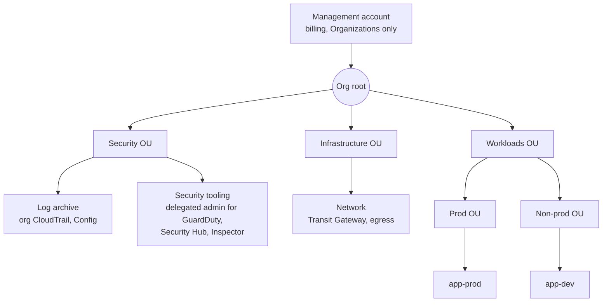
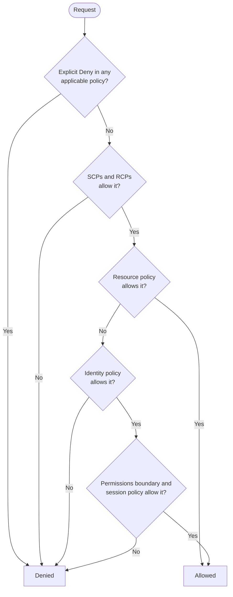
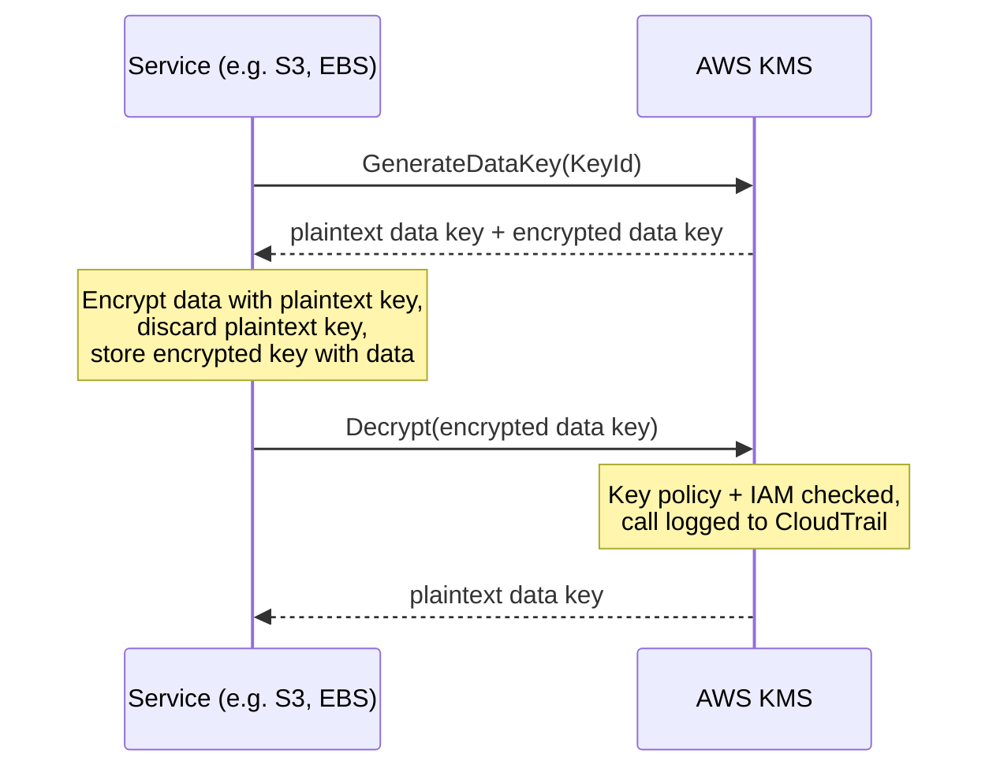
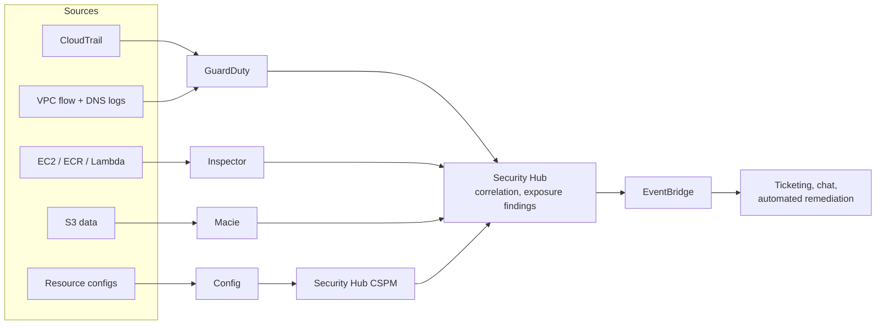
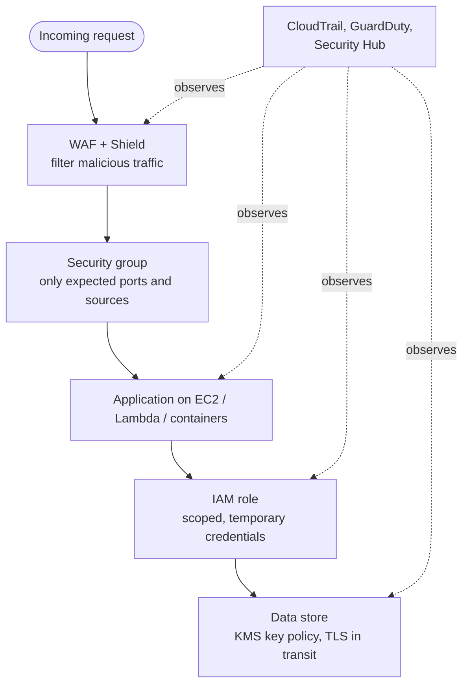

AWS security is mostly about controlling *who can call which API on which resource*, then proving that control holds over time. This page covers the layers in the order a request meets them: account boundaries and organization policies, IAM identities and policy evaluation, credentials for workloads, encryption with KMS, threat detection and posture management, and edge protection. A reference Terraform baseline closes the page.

## Shared responsibility

AWS secures the infrastructure that runs the cloud: data centers, hardware, hypervisors and the global network. The customer secures everything configured *in* the cloud: identities, permissions, network rules, data classification, encryption settings, and application code. For managed services the line moves (AWS patches the RDS engine; you still own the database users and security groups), but identity and data are always on the customer side. Nearly every public AWS breach traces back to that side: a public bucket, a leaked access key, an `0.0.0.0/0` rule on an admin port, or an over-broad role.

The controls on this page map onto four questions:

| Question | Main risk | Primary services |
|----------|-----------|------------------|
| Who can act, and on what? | Stolen credentials, privilege escalation | Organizations, IAM Identity Center, IAM, Access Analyzer |
| Is the data unreadable if it leaks? | Exfiltration, lost snapshots | KMS, service default encryption, Secrets Manager |
| Is something bad happening now? | Intrusion, drift, vulnerable software | CloudTrail, GuardDuty, Inspector, Macie, Config, Security Hub |
| Can hostile traffic reach the workload? | DDoS, injection, scraping | WAF, Shield, security groups, Network Firewall |

## Account structure and organization guardrails

The AWS account is the strongest isolation boundary AWS offers: IAM permissions, quotas and most resources do not cross accounts unless explicitly shared. Mature environments therefore use many accounts (per workload and per environment) grouped under **AWS Organizations**, usually set up through **AWS Control Tower** or an equivalent landing-zone tool.



Keep the management account empty of workloads: service control policies do not apply to it, so anything running there is outside your guardrails. Delegate security services to a dedicated security-tooling account and send org-wide CloudTrail and Config data to a separate log-archive account that application teams cannot modify.

### Organization policy types

Organization policies never grant permissions; they set the maximum that identity and resource policies can grant.

| Policy | Restricts | Typical use |
|--------|-----------|-------------|
| **Service control policy (SCP)** | What principals *in* member accounts can do | Deny leaving the org, disabling CloudTrail/GuardDuty, using unapproved Regions |
| **Resource control policy (RCP)** | What *any* principal, including external ones, can do to resources in member accounts | Enforce a data perimeter: S3, KMS, SQS, Secrets Manager and STS resources reachable only by org identities |
| **Declarative policies** | Service configuration baselines (e.g. EC2 settings) | Block public AMI sharing, require IMDSv2 across the org |

RCPs (introduced November 2024) close a gap SCPs could not: an SCP cannot stop a principal from *another* organization using a permissive bucket policy, but an RCP attached to your OU can. Neither SCPs nor RCPs affect the management account or service-linked roles.

### Root user

Every account has a root user that bypasses IAM. Use it only for the handful of tasks that require it (closing a standalone account, restoring a locked-out administrator, a few billing tasks). AWS now enforces MFA for root sign-in, and in an organization you can enable **centralized root access management**: the management account (or a delegated IAM administrator) can delete root passwords, access keys and MFA devices from member accounts, and perform the few root-only actions, such as unlocking an S3 bucket whose policy denies everyone, as short-lived privileged sessions. New accounts created in the organization then have no root credentials at all.

## IAM: identities and permissions

### Identity types

| Identity | Credential | Use for |
|----------|-----------|---------|
| **IAM Identity Center user** | SSO sign-in, short-lived role sessions per account | All human access, federated from Okta, Entra ID, Google, or the built-in directory |
| **IAM role** | Temporary STS credentials (15 min to 12 h) | Workloads, cross-account access, CI/CD, humans via Identity Center permission sets |
| **IAM user** | Long-lived password and/or access keys | Only where nothing else works (some third-party tools); avoid for people |
| **Root user** | Account owner credentials | Root-only tasks; otherwise removed or locked away |

The rule that prevents most incidents: **no long-lived access keys**. A role hands out credentials that expire and rotate automatically; an access key sits in a file, environment variable, or git history until someone finds it.

### Policy types

| Type | Attached to | Grants? | Notes |
|------|-------------|---------|-------|
| Identity-based policy | User, group, role | Yes | AWS-managed, customer-managed, or inline |
| Resource-based policy | Bucket, key, queue, role trust policy, etc. | Yes | Names a `Principal`; the only way to grant cross-account access without assuming a role |
| Permissions boundary | User or role | No (caps) | Lets teams create roles without escalating beyond the boundary |
| Session policy | An `AssumeRole` session | No (caps) | Narrows a single session |
| SCP / RCP | Org root, OU, account | No (caps) | See above |

### Policy evaluation

Every request starts denied. It is allowed only if some applicable policy allows it and nothing denies it; any explicit `Deny` anywhere wins. For a request within one account, the logic is:



Cross-account requests are stricter: both the caller's identity policy **and** the target's resource policy must allow the action. (Within one account, a resource policy that names an IAM role or user as principal can grant access on its own; KMS key policies and role trust policies are exceptions that must always allow the principal explicitly.)

### Anatomy of a policy

A bucket policy that lets one role read objects, and refuses any request not sent over TLS:

```json
{
  "Version": "2012-10-17",
  "Statement": [
    {
      "Sid": "AppRoleRead",
      "Effect": "Allow",
      "Principal": { "AWS": "arn:aws:iam::111122223333:role/app-reader" },
      "Action": "s3:GetObject",
      "Resource": "arn:aws:s3:::my-app-bucket/*"
    },
    {
      "Sid": "DenyInsecureTransport",
      "Effect": "Deny",
      "Principal": "*",
      "Action": "s3:*",
      "Resource": ["arn:aws:s3:::my-app-bucket", "arn:aws:s3:::my-app-bucket/*"],
      "Condition": { "Bool": { "aws:SecureTransport": "false" } }
    }
  ]
}
```

- **Effect**: `Allow` or `Deny`; explicit `Deny` always wins.
- **Principal**: who the statement applies to (resource policies only).
- **Action**: API operations as `service:Operation`. Avoid `s3:*` in allows.
- **Resource**: exact ARNs. Note the bucket ARN and object ARN (`/*`) are different resources.
- **Condition**: context checks such as `aws:SecureTransport`, `aws:PrincipalOrgID`, `aws:SourceVpce`, `aws:MultiFactorAuthPresent`, or tag keys for attribute-based access control (ABAC).

### Least privilege with IAM Access Analyzer

Guessing permissions produces either broken deploys or `AdministratorAccess`. IAM Access Analyzer turns it into a data-driven loop:

| Capability | What it does |
|------------|--------------|
| External access findings | Flags resources (buckets, keys, roles, queues, etc.) shared outside your account or organization |
| Internal access findings | Shows which principals inside the organization can reach critical resources |
| Unused access findings | Reports unused roles, access keys, passwords, and unused services/actions in attached policies |
| Policy generation | Builds a policy from a role's actual CloudTrail activity |
| Policy validation and custom checks | Lints policies and, in CI, fails a change that grants new access or public access |

A practical sequence: grant a broad but bounded policy in development, generate a policy from observed activity, review it, deploy that to production, then watch unused-access findings to trim further.

### Common IAM mistakes

- **Daily use of root or long-lived admin users.** Use Identity Center with short sessions; keep break-glass access audited.
- **Access keys in code, AMIs, or CI variables.** Use roles and OIDC federation; scan repositories with a secret scanner and enable GitHub or GitLab push protection.
- **Wildcards on both action and resource.** `"Action": "*"` on `"Resource": "*"` is administrator access regardless of the policy's name.
- **`iam:PassRole` on `*`.** Lets a principal hand any role, including admin roles, to a service it controls. Scope it to specific role ARNs and use the `iam:PassedToService` condition.
- **Trust policies that trust a whole account** (`arn:aws:iam::<id>:root`) when a single role was intended, or third-party trust without an `sts:ExternalId` condition (the confused-deputy problem).

## Credentials for workloads

Workloads should obtain temporary credentials from the platform, never from a stored key.

| Workload | Mechanism |
|----------|-----------|
| EC2 | Instance profile, delivered through the instance metadata service. Require **IMDSv2** (session-token based), which blocks the SSRF-to-metadata attacks that affected IMDSv1 |
| Lambda, ECS/Fargate | Execution role / task role |
| EKS pods | **EKS Pod Identity** (simpler, no OIDC provider per cluster) or IAM Roles for Service Accounts (IRSA) |
| CI/CD (GitHub Actions, GitLab) | OIDC federation: the pipeline's signed token is exchanged for a role session via `sts:AssumeRoleWithWebIdentity` |
| On-premises servers | IAM Roles Anywhere, using X.509 certificates from your CA |

The trust policy is where OIDC federation is secured. This one allows only the `main` branch of one GitHub repository to assume the role:

```json
{
  "Version": "2012-10-17",
  "Statement": [{
    "Effect": "Allow",
    "Principal": {
      "Federated": "arn:aws:iam::111122223333:oidc-provider/token.actions.githubusercontent.com"
    },
    "Action": "sts:AssumeRoleWithWebIdentity",
    "Condition": {
      "StringEquals": {
        "token.actions.githubusercontent.com:aud": "sts.amazonaws.com",
        "token.actions.githubusercontent.com:sub": "repo:example-org/example-repo:ref:refs/heads/main"
      }
    }
  }]
}
```

Omitting or wildcarding the `sub` condition lets *any* repository on GitHub assume the role.

Application secrets that cannot be replaced by roles (database passwords, third-party API keys) belong in **Secrets Manager**, which supports automatic rotation, or in SSM Parameter Store `SecureString` parameters for simpler cases.

## Data protection and KMS

### Encryption defaults

| Layer | Current state | What to do |
|-------|---------------|------------|
| S3 at rest | All new objects encrypted with SSE-S3 by default since January 2023 | Use SSE-KMS where you need key-policy control or per-request audit; enable S3 Bucket Keys to cut KMS request costs |
| EBS at rest | Opt-in per account and Region | Turn on EBS encryption by default in every Region you use |
| RDS, DynamoDB, EFS | Encryption chosen at creation (DynamoDB always encrypts) | Enable at creation; an unencrypted RDS instance must be re-created from an encrypted snapshot copy |
| In transit | TLS on all AWS API endpoints | Deny non-TLS access in resource policies; use ACM certificates on load balancers and CloudFront |

### KMS keys

KMS stores keys in FIPS 140-validated HSMs; plaintext key material never leaves the service. There are three ownership models:

| Key type | Who controls the key policy | Rotation | Visible in CloudTrail |
|----------|----------------------------|----------|------------------------|
| AWS owned | The AWS service | Service-defined | No |
| AWS managed (`aws/s3`, `aws/ebs`, ...) | AWS; you can view it | Yearly, automatic | Yes |
| Customer managed | You | Optional automatic (default 365 days, custom period configurable) and on-demand rotation | Yes |

Use customer managed keys when you need to control who can decrypt independently of who can read the storage, share encrypted data across accounts, or revoke access by disabling the key. Rotation replaces only the current key material; KMS keeps old material to decrypt existing ciphertext, so rotation needs no re-encryption and no code change.

Services use **envelope encryption**: KMS generates a data key, the service encrypts data locally with the plaintext data key and stores only the KMS-encrypted copy beside the data.



Because every decrypt is an authorized, logged KMS call, the key policy becomes a second, independent access control on the data: a principal with `s3:GetObject` but without `kms:Decrypt` on the key gets `AccessDenied`.

## Detection and posture management

Prevention eventually fails, so the second half of AWS security is visibility. The services divide the work as follows:

| Service | Answers | Inputs |
|---------|---------|--------|
| **CloudTrail** | Who called which API, when, from where | Management events (always), data events (opt-in, e.g. S3 object reads, Lambda invokes) |
| **Config** | What did this resource look like, and does it comply? | Resource configuration history evaluated against rules |
| **GuardDuty** | Is something malicious happening? | CloudTrail, VPC flow logs, DNS logs, plus optional protection plans |
| **Inspector** | Which workloads have known vulnerabilities? | Continuous CVE and network-reachability scanning of EC2, ECR images, Lambda |
| **Macie** | Where is sensitive data stored? | Automated discovery and classification of S3 objects (PII, credentials) |
| **Security Hub CSPM** | Do we meet a benchmark? | Config-based controls for AWS FSBP, CIS AWS Foundations (v5.0.0 is current), NIST SP 800-53/800-171, PCI DSS |
| **Security Hub** | What should we fix first? | Correlates GuardDuty, Inspector, Macie and CSPM findings into exposure findings and attack paths (OCSF format) |
| **Detective** | What is the scope of this incident? | Graph of CloudTrail, flow logs and findings for investigation |

In 2025 AWS relaunched **Security Hub** as a unified security operations service that correlates signals across GuardDuty, Inspector, Macie and posture checks, surfacing *exposure findings* (a vulnerable, internet-reachable instance with an over-privileged role is one prioritized issue rather than three unrelated alerts) and visual attack paths. The original compliance-checking service continues as **Security Hub CSPM**, which still produces ASFF control findings and a per-standard security score.

GuardDuty's foundational analysis of CloudTrail, VPC flow logs and DNS logs needs no agents. Additional **protection plans** extend it: S3 Protection (data events), EKS audit-log monitoring, Runtime Monitoring (agent-based, for EKS, ECS/Fargate and EC2), Malware Protection for EC2 and for S3 uploads, RDS login-activity monitoring, and Lambda network activity. **Extended Threat Detection** correlates individual signals into multi-stage attack sequence findings.



Operational practices that matter more than any individual service:

- Enable an **organization trail** covering all Regions, delivered to the log-archive account with S3 Object Lock or restrictive bucket policies so an attacker cannot erase their tracks.
- Enable GuardDuty, Security Hub and Inspector **organization-wide in every Region**, including Regions you do not use; attackers favor them. An SCP that denies unused Regions complements this.
- Use delegated administration so findings aggregate in the security account, and enable cross-Region aggregation.
- Route high-severity findings through EventBridge to a human queue first; automate remediation only for well-understood, low-blast-radius fixes (revoking a public ACL, isolating an instance's security group).

## Edge and network protection

| Control | Protects against | Where it sits |
|---------|------------------|---------------|
| **AWS WAF** | Injection, XSS, bots, credential stuffing, request floods | CloudFront, ALB, API Gateway, AppSync, Cognito, App Runner, Verified Access |
| **Shield Standard** | Common layer 3/4 DDoS | All AWS edge and Regional endpoints, free and automatic |
| **Shield Advanced** | Large or targeted DDoS; includes a response team and cost protection for scaling during attacks | Paid subscription per organization |
| **Security groups** | Unwanted connections to an ENI | Stateful, allow-only, per network interface |
| **Network ACLs** | Coarse subnet-level blocks | Stateless, ordered allow/deny rules |
| **Network Firewall** | Egress filtering, IDS/IPS, domain allow-lists | Dedicated firewall endpoints in the VPC |
| **Firewall Manager** | Drift in WAF, Shield, SG and firewall policy across accounts | Organization-wide policy enforcement |

Start WAF with AWS managed rule groups (Core rule set, Known bad inputs, IP reputation, and the language-specific sets such as SQL database) plus a rate-based rule, and run new rules in **Count** mode before switching them to **Block**. Rate-based rules count requests per aggregation key (IP, forwarded IP, header, or custom keys) over a 1, 2, 5 or 10 minute evaluation window, with a minimum limit of 10 requests. Bot Control and Fraud Control (account-takeover and account-creation prevention) are paid managed rule groups for automated-traffic problems.

## Defense in depth

A request must clear every layer, and a failure in one is contained by the next:



If WAF misses an exploit, the security group still limits what the compromised process can reach. If a credential leaks, IAM scoping limits the blast radius and organization policies cap it further. If data is copied out, it is encrypted under a key the attacker cannot use. Detection services watch every layer throughout.

## Reference Terraform baseline

The following Terraform (AWS provider v5 or later) enables the core detection services in a single account with current APIs. In an organization, run the equivalent from the delegated administrator account and use the organization-configuration resources (`aws_guardduty_organization_configuration`, `aws_securityhub_organization_configuration`) instead of per-account enablement.

```hcl
data "aws_caller_identity" "current" {}
data "aws_region" "current" {}

locals {
  region = data.aws_region.current.name
}

# --- Security Hub CSPM: subscribe to chosen standards explicitly ---
resource "aws_securityhub_account" "this" {
  enable_default_standards  = false
  control_finding_generator = "SECURITY_CONTROL" # consolidated control findings
}

resource "aws_securityhub_standards_subscription" "fsbp" {
  standards_arn = "arn:aws:securityhub:${local.region}::standards/aws-foundational-security-best-practices/v/1.0.0"
  depends_on    = [aws_securityhub_account.this]
}

resource "aws_securityhub_standards_subscription" "cis" {
  standards_arn = "arn:aws:securityhub:${local.region}::standards/cis-aws-foundations-benchmark/v/5.0.0"
  depends_on    = [aws_securityhub_account.this]
}

# --- GuardDuty: detector plus protection plans as "features" ---
# (the older `datasources` block is deprecated; newer plans exist only as features)
resource "aws_guardduty_detector" "this" {
  enable                       = true
  finding_publishing_frequency = "FIFTEEN_MINUTES"
}

resource "aws_guardduty_detector_feature" "plans" {
  for_each    = toset(["S3_DATA_EVENTS", "EKS_AUDIT_LOGS", "EBS_MALWARE_PROTECTION", "RDS_LOGIN_EVENTS", "LAMBDA_NETWORK_LOGS"])
  detector_id = aws_guardduty_detector.this.id
  name        = each.value
  status      = "ENABLED"
}

resource "aws_guardduty_detector_feature" "runtime" {
  detector_id = aws_guardduty_detector.this.id
  name        = "RUNTIME_MONITORING"
  status      = "ENABLED"

  additional_configuration {
    name   = "EKS_ADDON_MANAGEMENT"
    status = "ENABLED"
  }
  additional_configuration {
    name   = "ECS_FARGATE_AGENT_MANAGEMENT"
    status = "ENABLED"
  }
}

# --- Inspector and Access Analyzer ---
resource "aws_inspector2_enabler" "this" {
  account_ids    = [data.aws_caller_identity.current.account_id]
  resource_types = ["EC2", "ECR", "LAMBDA", "LAMBDA_CODE"]
}

resource "aws_accessanalyzer_analyzer" "external" {
  analyzer_name = "external-access"
  type          = "ACCOUNT" # ORGANIZATION from the delegated admin account
}

resource "aws_accessanalyzer_analyzer" "unused" {
  analyzer_name = "unused-access"
  type          = "ACCOUNT_UNUSED_ACCESS"

  configuration {
    unused_access {
      unused_access_age = 90
    }
  }
}

# --- Encryption defaults and a customer managed key ---
resource "aws_ebs_encryption_by_default" "this" {
  enabled = true
}

resource "aws_kms_key" "data" {
  description             = "Application data key"
  enable_key_rotation     = true
  rotation_period_in_days = 180
  deletion_window_in_days = 30
  # Supply an explicit key policy in production; the default grants the
  # account's IAM administrators control of the key.
}

# --- Route high-severity findings to a responder ---
resource "aws_cloudwatch_event_rule" "high_findings" {
  name = "securityhub-high-findings"
  event_pattern = jsonencode({
    source        = ["aws.securityhub"]
    "detail-type" = ["Security Hub Findings - Imported"]
    detail = {
      findings = {
        Severity = { Label = ["CRITICAL", "HIGH"] }
        Workflow = { Status = ["NEW"] }
      }
    }
  })
}

resource "aws_cloudwatch_event_target" "notify" {
  rule = aws_cloudwatch_event_rule.high_findings.name
  arn  = var.security_alerts_sns_topic_arn
}

# --- WAF web ACL with managed rules and a rate limit ---
resource "aws_wafv2_web_acl" "app" {
  name  = "app-web-acl"
  scope = "REGIONAL" # "CLOUDFRONT" must be created in us-east-1

  default_action {
    allow {}
  }

  rule {
    name     = "aws-common"
    priority = 1
    override_action {
      none {}
    }
    statement {
      managed_rule_group_statement {
        vendor_name = "AWS"
        name        = "AWSManagedRulesCommonRuleSet"
      }
    }
    visibility_config {
      cloudwatch_metrics_enabled = true
      metric_name                = "aws-common"
      sampled_requests_enabled   = true
    }
  }

  rule {
    name     = "rate-limit-per-ip"
    priority = 2
    action {
      block {}
    }
    statement {
      rate_based_statement {
        limit                 = 1000
        evaluation_window_sec = 300
        aggregate_key_type    = "IP"
      }
    }
    visibility_config {
      cloudwatch_metrics_enabled = true
      metric_name                = "rate-limit-per-ip"
      sampled_requests_enabled   = true
    }
  }

  visibility_config {
    cloudwatch_metrics_enabled = true
    metric_name                = "app-web-acl"
    sampled_requests_enabled   = true
  }
}
```

Protection plans and Inspector scan types vary by Region, and each carries its own charges after the free trial. Check which ones your workloads need rather than enabling every feature by default.

## See also

- [AWS Hub](./) - overview of all AWS documentation
- [Networking & Content Delivery](networking.html) - VPC design, security groups, CloudFront
- [Compute Services](compute.html) - instance profiles, Lambda execution roles
- [Monitoring & Messaging](monitoring.html) - CloudWatch and CloudTrail operations
- [Troubleshooting](troubleshooting.html) - diagnosing `AccessDenied` and connectivity failures
- [Infrastructure as Code](iac.html) - managing security configuration as code
- [Cloud and Container Security](../cybersecurity/cloud-and-container-security.html) - provider-neutral cloud security concepts
- [Cybersecurity](../cybersecurity/) - general security fundamentals
