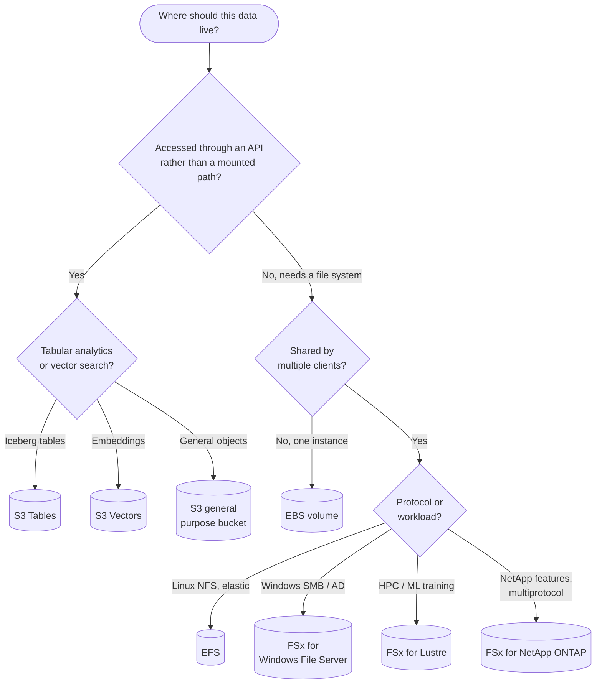
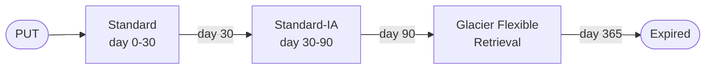
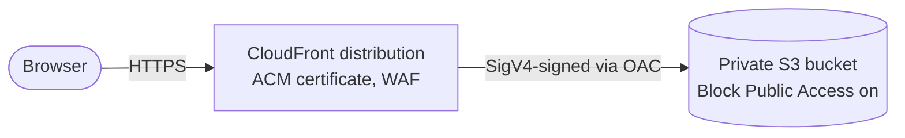

AWS storage comes in three access models: **object** storage reached over an HTTP API (Amazon S3), **block** volumes attached to a single instance (Amazon EBS), and **file** systems mounted by many clients at once (Amazon EFS and the Amazon FSx family). This page describes each model, the storage classes and volume types within it, how to protect and cost-optimize the data, and how to choose between them. Figures are as of 2026 and quoted for US East (N. Virginia) where prices appear; check the service pricing pages before relying on them.

## Storage models at a glance

| | Object (S3) | Block (EBS) | File (EFS / FSx) |
|---|---|---|---|
| **Access** | HTTPS API (`GetObject`, `PutObject`) | Raw device; you create the file system | NFS or SMB mount (FSx Lustre: Lustre client) |
| **Attached to** | Nothing; any authorized client anywhere | One EC2 instance (io2 Multi-Attach excepted) in one AZ | Many instances, containers, and on-premises hosts |
| **Scope** | Regional (most classes span 3+ AZs) | Single Availability Zone | Regional (Multi-AZ) or One Zone |
| **Capacity** | Unlimited; objects up to 50 TB | Provisioned per volume, up to 64 TiB | Elastic (EFS) or provisioned (FSx) |
| **Latency** | Tens of ms first byte (single-digit ms for Express One Zone) | Sub-ms (io2) to single-digit ms | About 1 ms reads on EFS Standard |
| **Billing** | GB-month stored + requests + retrieval + egress | GB-month provisioned (+ provisioned IOPS/throughput) | GB-month used (EFS) or provisioned (FSx) + throughput |
| **Typical use** | Data lakes, media, backups, static assets, ML datasets | Boot volumes, databases, single-node applications | Shared content, home directories, HPC scratch, lift-and-shift apps |



## Amazon S3

S3 stores **objects** (data plus metadata) under **keys** in **buckets**. There is no directory hierarchy; the `/` in `logs/2026/09/app.log` is just part of the key, which the console presents as folders. S3 is designed for 99.999999999% (eleven nines) durability by storing data redundantly across at least three Availability Zones for most storage classes.

### Core behavior

| Property | Current behavior |
|----------|------------------|
| Consistency | Strong read-after-write consistency for all PUT, DELETE and LIST operations (since December 2020) |
| Object size | Up to 50 TB via multipart upload; 5 GB maximum for a single `PUT` |
| Request rate | At least 3,500 writes and 5,500 reads per second **per prefix**; spread hot keys over prefixes to scale further |
| Default encryption | Every new object encrypted with SSE-S3 (since January 2023) |
| Default access | New buckets have Block Public Access on and ACLs disabled (Object Ownership = bucket owner enforced) since April 2023 |
| Conditional writes | `If-None-Match: *` (create only if absent) and `If-Match: <etag>` (compare-and-swap) on `PutObject` and `CompleteMultipartUpload` |

Conditional writes let S3 act as a coordination point: several writers can race to create a lock or manifest object and exactly one succeeds, without a separate database.

### Bucket types

| Bucket type | Purpose |
|-------------|---------|
| **General purpose** | The standard S3 bucket; all storage classes except Express One Zone |
| **Directory bucket** | Holds S3 Express One Zone data in a single AZ (or Local Zone) you choose; hierarchical namespace, session-based auth, single-digit-ms latency |
| **Table bucket (S3 Tables)** | Apache Iceberg tables with automatic compaction, snapshot expiry and unreferenced-file cleanup; queried by Athena, Redshift, EMR, Spark |
| **Vector bucket (S3 Vectors)** | Stores vector embeddings in indexes with similarity queries (sub-second, down to ~100 ms for frequent queries); backs Bedrock Knowledge Bases and can offload OpenSearch vector storage |

Table and vector buckets use their own IAM namespaces (`s3tables`, `s3vectors`) and always have Block Public Access enabled.

### Storage classes

Pick a class by how often data is read and how quickly it must be available.

| Class | Access pattern | First-byte latency | Min. duration | Approx. storage USD per GB-month |
|-------|----------------|--------------------|---------------|----------------------------|
| **Standard** | Frequent | Milliseconds | None | 0.023 |
| **Express One Zone** | Very frequent, latency-sensitive, single AZ | Single-digit ms | None | Higher than Standard; much cheaper requests |
| **Intelligent-Tiering** | Unknown or changing | Milliseconds (optional archive tiers: minutes to hours) | None | 0.023 down to archive rates, plus per-object monitoring fee |
| **Standard-IA** | About monthly | Milliseconds | 30 days | 0.0125 + retrieval fee |
| **One Zone-IA** | About monthly, re-creatable data | Milliseconds | 30 days | 0.01 + retrieval fee |
| **Glacier Instant Retrieval** | About quarterly | Milliseconds | 90 days | 0.004 + retrieval fee |
| **Glacier Flexible Retrieval** | About yearly | Minutes (expedited) to 12 hours (bulk) after restore | 90 days | 0.0036 |
| **Glacier Deep Archive** | Less than yearly | Within 12 hours (standard) or 48 hours (bulk) after restore | 180 days | 0.00099 |

Points that change the arithmetic:

- The IA and Glacier Instant Retrieval classes bill a **minimum 128 KB** per object and charge **per-GB retrieval**; small or frequently read objects can cost more there than in Standard.
- **Intelligent-Tiering** moves each object between Frequent, Infrequent (after 30 days without access) and Archive Instant (after 90 days) tiers with no retrieval fees. Objects under 128 KB are not monitored and stay in the Frequent tier. It is the safe default when access patterns are unknown.
- Glacier Flexible Retrieval and Deep Archive objects must be **restored** (`RestoreObject`) before they can be read, and each archived object carries about 40 KB of billable metadata, so archive large objects or bundles, not millions of tiny files.
- One Zone-IA and Express One Zone keep data in a single AZ and do not survive the loss of that AZ. Use them only for data you can re-create or that is replicated elsewhere.
- Reduced Redundancy Storage is deprecated in practice; AWS recommends against it and Standard is cheaper.

### Lifecycle rules

Lifecycle configuration transitions or expires objects automatically. A common pattern for logs, plus two rules every versioned bucket should have:

```json
{
  "Rules": [
    {
      "ID": "logs-tiering",
      "Filter": { "Prefix": "logs/" },
      "Status": "Enabled",
      "Transitions": [
        { "Days": 30, "StorageClass": "STANDARD_IA" },
        { "Days": 90, "StorageClass": "GLACIER" }
      ],
      "Expiration": { "Days": 365 }
    },
    {
      "ID": "expire-old-versions",
      "Filter": {},
      "Status": "Enabled",
      "NoncurrentVersionExpiration": { "NoncurrentDays": 30, "NewerNoncurrentVersions": 3 }
    },
    {
      "ID": "abort-incomplete-mpu",
      "Filter": {},
      "Status": "Enabled",
      "AbortIncompleteMultipartUpload": { "DaysAfterInitiation": 7 }
    }
  ]
}
```

```bash
aws s3api put-bucket-lifecycle-configuration \
  --bucket my-bucket --lifecycle-configuration file://lifecycle.json
```



Transitions only move data "down" the waterfall toward colder classes, and objects smaller than 128 KB are by default not transitioned, because the per-object overhead would exceed the savings. Use **S3 Storage Lens** and **Storage Class Analysis** to find prefixes worth tiering.

### Data protection

| Mechanism | Protects against | Notes |
|-----------|------------------|-------|
| **Versioning** | Overwrites and deletes | A delete adds a delete marker; prior versions remain and are billed until expired |
| **Object Lock** | Deletion or overwrite by anyone, including admins (ransomware, insider) | WORM retention in *governance* or *compliance* mode, plus legal holds; requires versioning |
| **Replication (CRR / SRR)** | Regional outage, account compromise | Replicate to another Region or account; S3 Replication Time Control adds a 15-minute SLA |
| **AWS Backup for S3** | Logical corruption; centralized retention | Point-in-time restores, backup vaults with Vault Lock |
| **MFA Delete** | Version deletion with stolen credentials | Root-only to enable; Object Lock is usually the more practical control |

### Access control and encryption

Since 2023 a new bucket is private by default. Keep it that way:

```bash
# Account-wide guardrail: no bucket in this account can become public
aws s3control put-public-access-block --account-id 111122223333 \
  --public-access-block-configuration \
  BlockPublicAcls=true,IgnorePublicAcls=true,BlockPublicPolicy=true,RestrictPublicBuckets=true

# Use SSE-KMS with an S3 Bucket Key instead of the SSE-S3 default
aws s3api put-bucket-encryption --bucket my-bucket \
  --server-side-encryption-configuration '{
    "Rules": [{
      "ApplyServerSideEncryptionByDefault": {
        "SSEAlgorithm": "aws:kms",
        "KMSMasterKeyID": "arn:aws:kms:us-east-1:111122223333:key/EXAMPLE-KEY-ID"
      },
      "BucketKeyEnabled": true
    }]
  }'
```

Grant access with IAM and bucket policies, not ACLs. For many consumers of one bucket, **S3 Access Points** give each application its own policy and optional VPC-only restriction. **VPC gateway endpoints** for S3 are free and keep traffic from private subnets off NAT gateways, which otherwise charge per GB processed. See [Security & Identity](security.html) for policy evaluation and KMS.

### Serving static websites

The S3 *website endpoint* (`aws s3 website`) serves only HTTP and requires a publicly readable bucket. The current pattern keeps the bucket private and serves it through **CloudFront with Origin Access Control (OAC)**, which adds HTTPS, custom domains via ACM, caching, and WAF:



```bash
# Build output is uploaded with sync; --delete removes files no longer in the build
aws s3 sync ./dist s3://my-site-bucket --delete
aws cloudfront create-invalidation --distribution-id E123EXAMPLE --paths "/index.html"
```

The bucket policy allows `s3:GetObject` only to the `cloudfront.amazonaws.com` service principal with an `aws:SourceArn` condition naming the distribution. The older Origin Access Identity (OAI) mechanism is legacy; use OAC for new distributions.

### Performance

- Use **multipart upload** for objects over roughly 100 MB and parallelize parts; the AWS CLI and SDK transfer managers (built on the AWS Common Runtime) do this automatically.
- Use **byte-range GETs** to read large objects in parallel.
- **Transfer Acceleration** routes long-distance uploads through CloudFront edge locations.
- For request-heavy analytics, ML training data loaders, and checkpointing, **Express One Zone** in the same AZ as compute reduces both latency and request cost. **Mountpoint for Amazon S3** exposes a bucket as a read-heavy local file system for such workloads (it is not fully POSIX-compliant; for example, existing files cannot be modified in place).

## Amazon EBS

EBS provides network-attached block volumes for EC2. A volume lives in one Availability Zone, attaches to an instance in that AZ, and persists independently of the instance. Instance store (local NVMe on some instance types) is faster but ephemeral: its data is lost when the instance stops or terminates.

### Volume types

| Type | Media | Max IOPS | Max throughput | Size | Use for |
|------|-------|----------|----------------|------|---------|
| **gp3** | SSD | 80,000 (3,000 baseline included) | 2,000 MiB/s (125 baseline included) | 1 GiB - 64 TiB | Default for boot volumes and most workloads |
| **gp2** | SSD | 16,000 (3 IOPS/GiB, burst to 3,000 below 1 TiB) | 250 MiB/s | 1 GiB - 16 TiB | Legacy; migrate to gp3 |
| **io2 Block Express** | SSD | 256,000 (1,000 IOPS/GiB) | 4,000 MiB/s | 4 GiB - 64 TiB | Latency-critical databases; 99.999% durability; sub-500 µs average latency |
| **io1** | SSD | 64,000 (50 IOPS/GiB) | 1,000 MiB/s | 4 GiB - 16 TiB | Legacy; io2 is more durable at similar cost |
| **st1** | HDD | 500 | 500 MiB/s | 125 GiB - 16 TiB | Large sequential reads/writes: log processing, data warehouses |
| **sc1** | HDD | 250 | 250 MiB/s | 125 GiB - 16 TiB | Cold, rarely read sequential data |

gp3 decouples performance from size: you provision IOPS (up to 500 per GiB) and throughput (up to 0.25 MiB/s per provisioned IOPS) independently, and it is about 20% cheaper per GB than gp2. The top limits need a 160 GiB volume for 80,000 IOPS and 8,000 IOPS for 2,000 MiB/s. Every existing io2 volume became io2 Block Express as of April 2025. The highest io2 figures require a Nitro-based instance, and every instance type also has its own **EBS bandwidth and IOPS cap**, which is often the real bottleneck.

### Changing volumes

Elastic Volumes lets you increase size, change type, or adjust IOPS and throughput while the volume is in use:

```bash
aws ec2 modify-volume --volume-id vol-0abc123 --volume-type gp3 --size 200 --iops 6000 --throughput 250
aws ec2 describe-volumes-modifications --volume-ids vol-0abc123   # wait for "optimizing" or "completed"
```

Two constraints catch people out: after a modification you must wait **six hours** before modifying the same volume again, and growing a volume does not grow the file system. Extend the partition and file system inside the guest:

```bash
sudo growpart /dev/nvme0n1 1        # if the file system sits on a partition
sudo xfs_growfs -d /                # XFS
sudo resize2fs /dev/nvme0n1p1       # ext4
```

Volumes cannot be shrunk; to reduce size, copy the data to a new, smaller volume.

### Snapshots and encryption

Snapshots are incremental, block-level backups stored in S3 (managed by AWS, not visible in your buckets). Only changed blocks are stored after the first snapshot, yet each snapshot can restore a complete volume.

| Feature | Purpose |
|---------|---------|
| **Data Lifecycle Manager / AWS Backup** | Scheduled snapshots with retention; AWS Backup adds cross-account and cross-Region copies and vault locking |
| **Multi-volume snapshots** | Crash-consistent snapshots of all volumes on an instance at one point in time |
| **Snapshot Archive tier** | About 75% cheaper storage for snapshots kept 90+ days; restores take up to 72 hours |
| **Recycle Bin** | Retention rules that let you recover accidentally deleted snapshots and AMIs |
| **Fast Snapshot Restore** | Volumes created from the snapshot deliver full performance immediately, avoiding lazy-loading latency |
| **Snapshot Lock** | WORM protection for snapshots against deletion |

Volumes restored from a snapshot load blocks lazily from S3 on first read; without Fast Snapshot Restore, a database on a freshly restored volume can be slow until the data is read once (or pre-warmed with `fio` or `dd`).

Turn on **EBS encryption by default** in every Region you use so every new volume and snapshot copy is encrypted with KMS; encryption has no measurable performance cost on Nitro instances.

```bash
aws ec2 enable-ebs-encryption-by-default --region us-east-1
aws ec2 create-snapshot --volume-id vol-0abc123 --description "pre-upgrade" \
  --tag-specifications 'ResourceType=snapshot,Tags=[{Key=purpose,Value=pre-upgrade}]'
```

## Amazon EFS

EFS is a managed NFSv4.1 file system that grows and shrinks automatically. Thousands of EC2 instances, ECS tasks, EKS pods, Lambda functions and on-premises hosts (over VPN or Direct Connect) can mount it concurrently.

| Setting | Options | Guidance |
|---------|---------|----------|
| File system type | **Regional** (data in multiple AZs) or **One Zone** | Regional for production; One Zone is cheaper for dev or re-creatable data |
| Throughput mode | **Elastic** (default), Provisioned, Bursting | Elastic scales automatically and bills per GB transferred; Provisioned suits steady high throughput |
| Performance mode | **General Purpose**, Max I/O | Always General Purpose; Max I/O is previous generation, has higher latency, and does not work with Elastic throughput |
| Storage classes | **Standard**, **Infrequent Access**, **Archive** | Lifecycle policies move files not accessed for N days to IA and then Archive, and back on access if configured |

Regional file systems with Elastic throughput reach roughly 1 ms read and 2.7 ms write latency, up to tens of GiB/s aggregate read throughput, and 1,500 MiB/s per client when mounted with a recent `amazon-efs-utils` (2.0 or later) or the EFS CSI driver; other clients are limited to 500 MiB/s. Because every operation crosses the network, EFS is slow for workloads dominated by small-file metadata operations (such as `npm install` or large Git checkouts) compared with a local EBS volume.

```bash
# Mount with the EFS mount helper: TLS in transit and IAM authorization
sudo mount -t efs -o tls,iam fs-0123456789abcdef0:/ /mnt/efs

# /etc/fstab entry
# fs-0123456789abcdef0:/ /mnt/efs efs _netdev,tls,iam 0 0
```

**Access points** give each application a fixed POSIX user and root directory within a shared file system, which is how containers and Lambda functions should mount EFS.

## Amazon FSx

FSx runs full-featured third-party file systems as a managed service when EFS's NFS semantics are not the right fit.

| Service | Protocols | Strengths | Typical workloads |
|---------|-----------|-----------|-------------------|
| **FSx for Windows File Server** | SMB | Active Directory integration, NTFS ACLs, DFS namespaces, shadow copies | Windows applications, user shares, SQL Server on SMB |
| **FSx for Lustre** | Lustre (POSIX) | Hundreds of GB/s, millions of IOPS, sub-ms latency; links to an S3 bucket as a data repository | HPC, ML training, media rendering |
| **FSx for NetApp ONTAP** | NFS, SMB, iSCSI, NVMe/TCP | Snapshots, clones, SnapMirror replication, deduplication and compression, automatic tiering | Migrating NetApp estates, multiprotocol shares, VMware Cloud on AWS |
| **FSx for OpenZFS** | NFS | ZFS snapshots and clones, very low latency, Intelligent-Tiering storage option | Linux workloads moving from ZFS or NAS appliances |

## Moving and bridging data

| Need | Service |
|------|---------|
| One-time or scheduled online transfer between on-premises storage, other clouds, and S3/EFS/FSx | **DataSync** |
| On-premises applications reading and writing cloud storage through a local cache | **Storage Gateway** (S3 File Gateway, FSx File Gateway, Volume Gateway, Tape Gateway) |
| SFTP/FTPS/AS2 endpoints in front of S3 or EFS | **Transfer Family** |
| Petabyte-scale offline transfer | **Snowball Edge** devices (availability has been narrowed; check current offerings) |
| Centralized backup policies across services and accounts | **AWS Backup** |

## Use case reference

| Use case | Recommended | Why |
|----------|-------------|-----|
| Static website or SPA | S3 + CloudFront (OAC) | Private bucket, HTTPS, global caching, no servers |
| Relational database on EC2 | EBS gp3, or io2 Block Express for strict latency | Low-latency block I/O; consider RDS/Aurora instead of self-managing |
| Application logs | S3 with lifecycle rules | Cheap, durable, queryable with Athena |
| Shared web or CMS content | EFS with access points | Many writers, elastic capacity |
| Kubernetes persistent volumes | EBS CSI for single-pod volumes; EFS CSI for `ReadWriteMany` | Matches single-writer vs shared semantics |
| Analytics data lake | S3 (Parquet/Iceberg), or S3 Tables for managed Iceberg | Decouples storage from Athena, EMR, Redshift, Spark |
| ML training data | S3, fronted by FSx for Lustre or Express One Zone for throughput | Keeps GPUs fed without copying to local disk |
| RAG embeddings at low query volume | S3 Vectors | Far cheaper than an always-on vector database for infrequent queries |
| Long-term compliance archive | S3 Glacier Deep Archive with Object Lock | Lowest cost per GB, WORM retention |
| Windows file shares | FSx for Windows File Server | Native SMB and Active Directory |

## Common pitfalls

- **Public buckets.** Keep account-level Block Public Access on and serve public content through CloudFront. Treat any request to disable Block Public Access as a design smell.
- **Unbounded versioning costs.** Every overwrite keeps the old version. Pair versioning with `NoncurrentVersionExpiration`.
- **Incomplete multipart uploads.** Abandoned parts are billed indefinitely and invisible in normal listings; add an `AbortIncompleteMultipartUpload` rule.
- **Lifecycle transitions of tiny objects.** Transition and minimum-size charges can exceed the savings for objects under 128 KB.
- **One Zone classes for irreplaceable data.** An AZ loss destroys it.
- **Root volumes deleted with the instance.** Root volumes default to `DeleteOnTermination=true`; other volumes default to `false`. Know which you have, and snapshot before terminating.
- **Staying on gp2.** gp3 is cheaper and faster for almost every volume; migrate in place with `modify-volume`.
- **Instance limits hiding behind volume limits.** A 64,000 IOPS volume on an instance capped at 20,000 EBS IOPS delivers 20,000.
- **NAT gateway charges for S3 traffic.** Add a free S3 gateway endpoint to VPCs with private subnets.

## See also

- [AWS Hub](./) - overview of all AWS documentation
- [Compute Services](compute.html) - EC2 instance storage, Lambda with S3 and EFS
- [Databases](databases.html) - managed alternatives to databases on EBS
- [Security & Identity](security.html) - bucket policies, KMS, and data perimeters
- [Cost Optimization](cost.html) - storage cost analysis
- [Infrastructure as Code](iac.html) - defining storage resources as code
