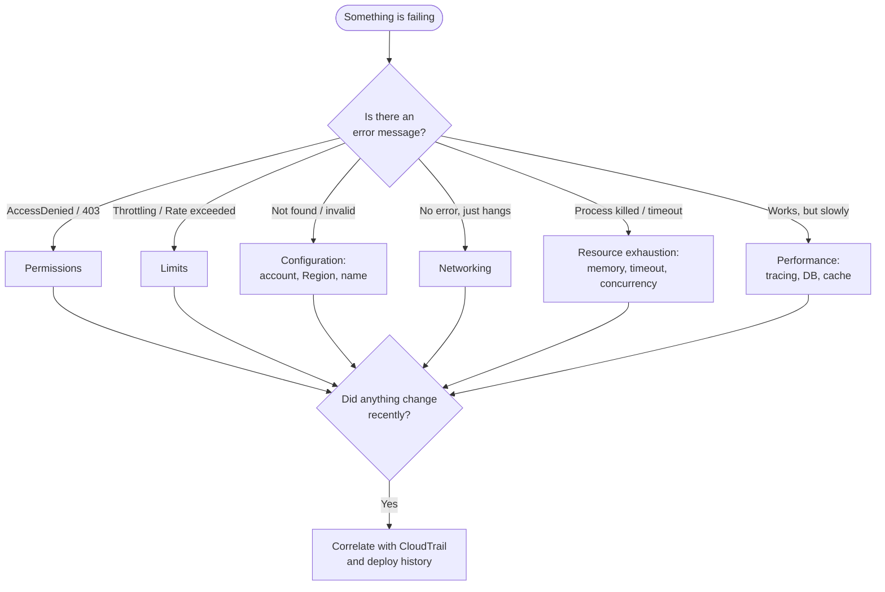
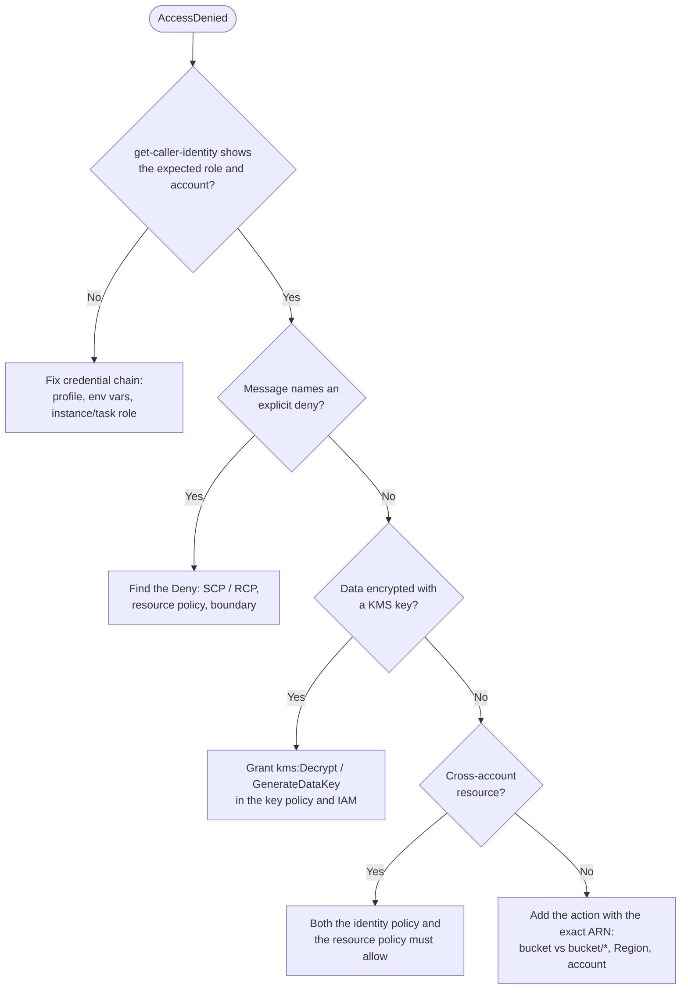
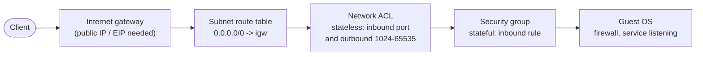
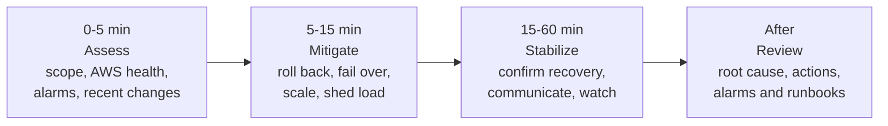

This page is a diagnostic reference for the failures that account for most AWS support tickets: permission errors, network reachability, API throttling, resource exhaustion in Lambda and containers, and slow applications. Each section lists the symptoms, the commands that narrow the cause, and the usual fixes. The page ends with an ordered checklist for the first hour of a production incident, including a suspected credential compromise.

Commands use AWS CLI v2. Replace the example IDs, and run them with the same profile and Region as the failing workload; many "mysterious" failures turn out to be a different identity or Region from the one you assumed.

## Triage method

Most AWS failures fall into four categories. Classify the symptom first, then open the matching section.

| Category | Typical symptom | First check |
|----------|-----------------|-------------|
| **Permissions** | `AccessDenied`, `UnauthorizedOperation`, `403`, `KMS.AccessDeniedException` | `aws sts get-caller-identity`; read the full error message |
| **Networking** | Timeouts, `Connection refused`, target unhealthy | Security groups, route tables, VPC Reachability Analyzer |
| **Limits** | `Throttling`, `Rate exceeded`, `LimitExceeded`, `InsufficientInstanceCapacity` | Service Quotas, CloudWatch usage metrics |
| **Configuration** | Resource "not found", wrong behavior after a deploy | Region and account, recent CloudTrail write events, IaC drift |



Two questions resolve a surprising share of incidents before any deep diagnosis: *who am I, and where am I?* and *what changed?*

```bash
# Identity, account and Region actually in use (env vars override the profile)
aws sts get-caller-identity
aws configure list            # shows where each setting came from

# Any command: print the signed request, endpoint and retries
aws s3 ls s3://my-bucket --debug 2>&1 | grep -Ei 'endpoint|retry|error'
```

## AccessDenied and permission errors

### Read the message

AWS error messages for most services now state *which policy type* caused the denial. The wording points directly at where to look:

| Message fragment | Meaning | Where to fix |
|------------------|---------|--------------|
| `because no identity-based policy allows` | Nothing grants the action | Add the action and correct resource ARN to the role or user policy |
| `with an explicit deny in an identity-based policy` | A `Deny` in the caller's own policies | Find the deny statement or its condition |
| `with an explicit deny in a resource-based policy` | Bucket, key, queue or other resource policy denies | The resource's policy (often a TLS or VPC-endpoint condition) |
| `... in a service control policy` / `resource control policy` | An organization guardrail | Management or delegated-admin account; not fixable locally |
| `... in a permissions boundary` / `session policy` | The caller's ceiling | The boundary attached to the role, or the `AssumeRole` call |
| `Encoded authorization failure message` (EC2 and some others) | Details are encoded | `aws sts decode-authorization-message` |

```bash
# Decode EC2-style failures (the caller needs sts:DecodeAuthorizationMessage)
aws sts decode-authorization-message --encoded-message "<blob>" \
  --query DecodedMessage --output text | jq .
```

### Narrow the cause



Test a hypothesis with the IAM policy simulator. It needs the **role** ARN, not the assumed-role session ARN that `get-caller-identity` returns:

```bash
# arn:aws:sts::111122223333:assumed-role/app-role/session -> arn:aws:iam::111122223333:role/app-role
aws iam simulate-principal-policy \
  --policy-source-arn arn:aws:iam::111122223333:role/app-role \
  --action-names s3:GetObject \
  --resource-arns 'arn:aws:s3:::my-bucket/data/report.csv' \
  --query 'EvaluationResults[].[EvalActionName,EvalDecision]' --output table
```

The simulator does not reproduce every factor (resource policies in other accounts, some condition keys), so confirm against the real call in CloudTrail, where denied requests carry an `errorCode`:

```bash
aws cloudtrail lookup-events --max-results 50 \
  --lookup-attributes AttributeKey=Username,AttributeValue=app-role-session \
  --query 'Events[].CloudTrailEvent' --output text \
  | jq -c 'select(.errorCode != null) | {eventName, errorCode, errorMessage}'
```

### Frequent root causes

- **Wrong resource ARN shape.** `s3:ListBucket` applies to `arn:aws:s3:::bucket`; `s3:GetObject` applies to `arn:aws:s3:::bucket/*`. A policy with only one of them fails the other.
- **KMS.** Reading an SSE-KMS object or an encrypted EBS snapshot needs `kms:Decrypt` on the key, and the key policy must allow it; S3 then reports `AccessDenied` even though the S3 permissions are correct.
- **Cross-account access** needs an allow on both sides; KMS keys used cross-account need the key policy *and* the caller's IAM policy.
- **Missing `iam:PassRole`** when creating a Lambda function, ECS task, or EC2 instance with a role.
- **Lambda in a VPC** failing to create network interfaces: the execution role needs the `AWSLambdaVPCAccessExecutionRole` managed policy (or equivalent `ec2:CreateNetworkInterface` permissions). A service-linked role is not the fix.
- **Wrong credentials picked up.** Environment variables (`AWS_ACCESS_KEY_ID`, `AWS_PROFILE`) take precedence over config files and instance roles; a stale variable in a CI job or shell is a classic cause.
- **Expired session.** `ExpiredToken` or `InvalidClientTokenId` after an SSO session lapses: run `aws sso login --profile <name>`.

## Cannot reach an instance

### Prefer connecting without SSH

Before debugging port 22, consider not using it. **Systems Manager Session Manager** gives a shell over an outbound HTTPS connection from the SSM Agent, needing no inbound rule, key pair or public IP, and every session is logged. **EC2 Instance Connect Endpoint** provides SSH or RDP to instances in private subnets without a bastion host.

```bash
aws ssm start-session --target i-0abc123def456
aws ec2-instance-connect ssh --instance-id i-0abc123def456 --connection-type eice
```

If Session Manager itself cannot connect, the instance lacks the `AmazonSSMManagedInstanceCore` permissions in its instance profile, the agent is not running, or the subnet has no route to the SSM endpoints (NAT gateway or `ssm`, `ssmmessages` and `ec2messages` interface endpoints).

### Walk the network path

A packet to the instance must pass every hop below; a timeout means one of them silently dropped it, whereas `Connection refused` means the packet arrived and nothing is listening.



| Check | Command or place | What to look for |
|-------|------------------|------------------|
| Instance health | `aws ec2 describe-instance-status --instance-ids i-...` | Both system and instance status checks `ok`; a failed system check means move the instance (stop/start) |
| Public address | `aws ec2 describe-instances --instance-ids i-... --query 'Reservations[].Instances[].PublicIpAddress'` | A public IPv4 or Elastic IP, if reaching it from the internet |
| Route table | `aws ec2 describe-route-tables --filters Name=association.subnet-id,Values=subnet-...` | `0.0.0.0/0` to an `igw-` for public subnets (a subnet with no explicit association uses the main route table) |
| Network ACL | `aws ec2 describe-network-acls --filters Name=association.subnet-id,Values=subnet-...` | Inbound allow for the port **and** outbound allow for ephemeral ports 1024-65535 |
| Security group | `aws ec2 describe-security-groups --group-ids sg-...` | Inbound rule for the port from your source CIDR or security group |
| Guest OS | EC2 serial console or `aws ec2 get-console-output --instance-id i-...` | Boot errors, `sshd` not running, full disk, host firewall |

**VPC Reachability Analyzer** automates the walk: it analyzes the configuration between a source and destination and names the blocking component.

```bash
PATH_ID=$(aws ec2 create-network-insights-path \
  --source igw-0abc123 --destination i-0abc123def456 \
  --protocol tcp --destination-port 22 \
  --query NetworkInsightsPath.NetworkInsightsPathId --output text)
ANALYSIS_ID=$(aws ec2 start-network-insights-analysis \
  --network-insights-path-id "$PATH_ID" \
  --query NetworkInsightsAnalysis.NetworkInsightsAnalysisId --output text)
aws ec2 describe-network-insights-analyses \
  --network-insights-analysis-ids "$ANALYSIS_ID" \
  --query 'NetworkInsightsAnalyses[0].[Status,NetworkPathFound,Explanations[0].ExplanationCode]'
```

If SSH genuinely must be opened, allow only your current address, never `0.0.0.0/0`:

```bash
MY_IP=$(curl -s https://checkip.amazonaws.com)
aws ec2 authorize-security-group-ingress --group-id sg-0abc123 \
  --ip-permissions "IpProtocol=tcp,FromPort=22,ToPort=22,IpRanges=[{CidrIp=${MY_IP}/32,Description=temp-admin}]"
```

For load-balanced services, check target health first: `aws elbv2 describe-target-health --target-group-arn ...` reports the reason (`Target.Timeout`, `Target.ResponseCodeMismatch`, `Target.FailedHealthChecks`), which usually points at the security group between the load balancer and targets or a wrong health-check path.

## Throttling and quotas

AWS APIs enforce request-rate limits per account and Region, and services enforce resource quotas. The error codes differ by service:

| Code | Typical source |
|------|----------------|
| `Throttling`, `ThrottlingException` | Most control-plane APIs (CloudFormation, IAM, CloudWatch) |
| `RequestLimitExceeded` | EC2 API |
| `TooManyRequestsException` | Lambda, API Gateway |
| `SlowDown` (HTTP 503) | S3, when a prefix exceeds its request rate |
| `ProvisionedThroughputExceededException` | DynamoDB provisioned tables, Kinesis shards |
| `LimitExceededException`, `ServiceQuotaExceededException` | A resource quota, not a rate: retrying will not help |

### Retry correctly

All AWS SDKs already retry throttling errors. Configure the retry mode rather than wrapping calls in your own loop:

```python
import boto3
from botocore.config import Config

# "standard": exponential backoff with jitter; "adaptive" also rate-limits the client
cfg = Config(retries={"mode": "adaptive", "max_attempts": 10})
ec2 = boto3.client("ec2", config=cfg)
```

The same settings are available as `AWS_RETRY_MODE` and `AWS_MAX_ATTEMPTS` environment variables or `retry_mode` / `max_attempts` in `~/.aws/config`, which also apply to the CLI. When you do need a manual loop (for example around a batch of calls), use capped exponential backoff with full jitter so many clients do not retry in lockstep:

```python
import random, time

def backoff_delays(base=0.5, cap=20.0, attempts=8):
    for n in range(attempts):
        yield random.uniform(0, min(cap, base * 2 ** n))   # "full jitter"
```

Beyond retries: batch operations (`SendMessageBatch`, `BatchWriteItem`), cache describe/list results instead of polling, and replace polling with EventBridge events or waiters.

### Check and raise quotas

```bash
# EC2 On-Demand Standard instances quota, measured in vCPUs (not instance count)
aws service-quotas get-service-quota --service-code ec2 --quota-code L-1216C47A

# Request an increase; track it with list-requested-service-quota-change-history
aws service-quotas request-service-quota-increase \
  --service-code ec2 --quota-code L-1216C47A --desired-value 256
```

Many quotas publish usage to CloudWatch (namespace `AWS/Usage`), so you can alarm at 80% of a quota before it becomes an outage. `InsufficientInstanceCapacity` is different: AWS lacks capacity for that instance type in that AZ right now. Retry in another AZ, allow several instance types (Auto Scaling mixed-instances policies, EC2 Fleet), or reserve capacity ahead with On-Demand Capacity Reservations.

## Lambda and container failures

### Memory

| Platform | Signature of running out of memory |
|----------|------------------------------------|
| Lambda | `Runtime exited with error: signal: killed` or `Runtime.OutOfMemory`; `Max Memory Used` equals `Memory Size` in the `REPORT` line |
| ECS | Stopped reason `OutOfMemoryError: Container killed due to memory usage`; exit code `137` |
| EKS | Pod status `OOMKilled`; `kubectl describe pod` shows `Last State: Terminated, Reason: OOMKilled` |

Every Lambda invocation ends with a `REPORT` log line. CloudWatch Logs Insights summarizes it:

```
filter @type = "REPORT"
| stats max(@maxMemoryUsed / 1000 / 1000) as maxMemMB,
        max(@memorySize / 1000 / 1000) as configuredMB,
        pct(@duration, 99) as p99ms,
        count(@initDuration) as coldStarts
  by bin(1h)
```

Lambda allocates CPU in proportion to memory (a full vCPU at 1,769 MB), so raising memory often shortens duration enough to cost the same or less. **AWS Lambda Power Tuning** measures this trade-off for a specific function.

```bash
aws lambda update-function-configuration --function-name my-function --memory-size 1024
```

### Timeouts and concurrency

- **Lambda timeout** (maximum 900 seconds): the log shows `Task timed out after N seconds`. Common causes are a downstream call without its own timeout, a VPC function trying to reach the internet without a NAT gateway or VPC endpoint, or a database connection pool exhausted by many concurrent invocations (use RDS Proxy).
- **API Gateway 504**: the REST API integration timeout defaults to 29 seconds (Regional and private REST APIs can request a higher limit); HTTP APIs allow up to 30 seconds. Long work belongs in an asynchronous pattern (queue plus status endpoint).
- **Lambda throttling (`429`, `TooManyRequestsException`)**: the account's Regional concurrency quota or a function's reserved concurrency is exhausted. Check the `Throttles` and `ConcurrentExecutions` metrics.

## Slow applications

### Trace first

Distributed tracing shows where the time goes across services. **AWS X-Ray SDKs and the X-Ray daemon entered maintenance mode on 25 February 2026** (security fixes only); new instrumentation should use **OpenTelemetry**, through the AWS Distro for OpenTelemetry (ADOT) or the CloudWatch agent, which still send traces to X-Ray and CloudWatch Application Signals.

```bash
# Python: zero-code OpenTelemetry instrumentation of boto3, requests, Flask/Django, DB drivers
pip install opentelemetry-distro opentelemetry-exporter-otlp
opentelemetry-bootstrap -a install
OTEL_SERVICE_NAME=orders opentelemetry-instrument python app.py
```

For Lambda, enable active tracing and add the ADOT Lambda layer, or use Application Signals for Lambda. See [Distributed Tracing](../../observability/tracing.html) for concepts.

### Common bottlenecks

| Layer | Evidence | Typical fix |
|-------|----------|-------------|
| Database | High `DBLoad`, top SQL in Performance Insights / CloudWatch Database Insights | Index the top queries, add read replicas, cache |
| Connections | Many short Lambda invocations, `too many connections` | RDS Proxy or a connection pool |
| EBS | `VolumeQueueLength` high; `BurstBalance` falling on gp2 | Move to gp3 and provision IOPS/throughput; check the instance's EBS bandwidth limit |
| CPU credits | `CPUCreditBalance` at zero on T-family instances | Unlimited mode or a non-burstable instance type |
| CDN | Low `CacheHitRate` on CloudFront | Tighten the cache key (fewer headers, cookies, query strings); set `Cache-Control` |
| Cross-AZ / NAT | High latency and data-processing charges | VPC endpoints, keep chatty services in the same AZ |

For PostgreSQL on RDS or Aurora, `pg_stat_statements` ranks queries by cost. The timing columns are `total_exec_time` and `mean_exec_time` in PostgreSQL 13 and later (they were `total_time` and `mean_time` before):

```sql
SELECT query,
       calls,
       round(total_exec_time::numeric, 1) AS total_ms,
       round(mean_exec_time::numeric, 2)  AS mean_ms,
       rows
FROM pg_stat_statements
ORDER BY total_exec_time DESC
LIMIT 10;
```

CloudFront metrics live in `us-east-1` with the dimension `Region=Global`; `CacheHitRate` requires the distribution's additional metrics to be enabled.

```bash
aws cloudwatch get-metric-statistics --region us-east-1 \
  --namespace AWS/CloudFront --metric-name CacheHitRate \
  --dimensions Name=DistributionId,Value=E123EXAMPLE Name=Region,Value=Global \
  --statistics Average --period 3600 \
  --start-time "$(date -u -d '-24 hours' +%FT%TZ)" --end-time "$(date -u +%FT%TZ)"
```

## Emergency response playbook

When production is down, work the phases in order. Assign an incident lead and a scribe before touching anything, and keep a timestamped log; it becomes the post-incident review.



### Assess (first 5 minutes)

```bash
# Is it AWS? Account-specific events (the Health API needs a Business,
# Enterprise On-Ramp or Enterprise support plan; the console dashboard is free)
aws health describe-events --region us-east-1 \
  --filter eventStatusCodes=open,eventTypeCategories=issue

# What is alarming?
aws cloudwatch describe-alarms --state-value ALARM \
  --query 'MetricAlarms[].[AlarmName,StateReason]' --output table

# What changed? Write (non-read-only) API calls in the last hour
aws cloudtrail lookup-events --max-results 50 \
  --lookup-attributes AttributeKey=ReadOnly,AttributeValue=false \
  --start-time "$(date -u -d '-1 hour' +%FT%TZ)" \
  --query 'Events[].[EventTime,EventName,Username]' --output table
```

Also check the deployment pipeline history. A deploy, configuration change, or certificate expiry within the last hour is the most likely cause, and rolling it back is usually the fastest mitigation.

### Mitigate by symptom

| Symptom | Check | Common mitigation |
|---------|-------|-------------------|
| Everything returns 5xx | Load balancer target health, Auto Scaling activity, recent deploy | Roll back; restore desired capacity; fail over via Route 53 health checks |
| Database connection errors | `DatabaseConnections` vs `max_connections`, failover events, security groups | RDS Proxy, kill runaway sessions, scale instance, trigger failover |
| API Gateway 5xx | Lambda `Errors`, `Throttles`, integration latency | Raise reserved concurrency, roll back function version via alias |
| Queue backlog growing | SQS `ApproximateAgeOfOldestMessage`, consumer errors | Scale consumers; move poison messages to a DLQ |
| Single-AZ impairment | AWS Health, per-AZ metrics | Zonal shift with Application Recovery Controller to move load balancer traffic away from the AZ |

### Suspected credential compromise

Treat unexplained resource creation (often GPU instances in unused Regions), IAM changes, or a GuardDuty finding such as `UnauthorizedAccess:IAMUser/InstanceCredentialExfiltration` as a security incident:

1. **Contain.** Deactivate the exposed access key (`aws iam update-access-key --status Inactive`). For a role, use **Revoke active sessions** in the IAM console, which attaches a policy denying all sessions issued before now (`aws:TokenIssueTime`).
2. **Scope.** Search CloudTrail across all Regions for the key or session. Look for new IAM users, keys, roles, trust-policy changes, and launched resources.
3. **Eradicate.** Delete attacker-created resources and identities; rotate any secrets the principal could read.
4. **Recover and learn.** Replace long-lived keys with roles, and add SCPs that deny unused Regions.

AWS Security Incident Response and the AWS Customer Incident Response Team (via AWS Support) can assist. See [Incident Response](../cybersecurity/incident-response.html) for the general process.

### After the incident

Write a blameless review covering timeline, impact, root cause, and why detection took as long as it did. Every incident should produce at least one new alarm, runbook entry, or guardrail; otherwise the same failure will recur.

## See also

- [AWS Hub](./) - overview of all AWS documentation
- [Monitoring & Messaging](monitoring.html) - CloudWatch metrics, logs, alarms, and dashboards
- [Security & Identity](security.html) - IAM policy evaluation, GuardDuty, and Security Hub
- [Networking & Content Delivery](networking.html) - VPC routing, security groups, and NACLs
- [Compute Services](compute.html) - EC2 and Lambda limits and configuration
- [Storage Services](storage.html) - EBS performance and S3 request rates
