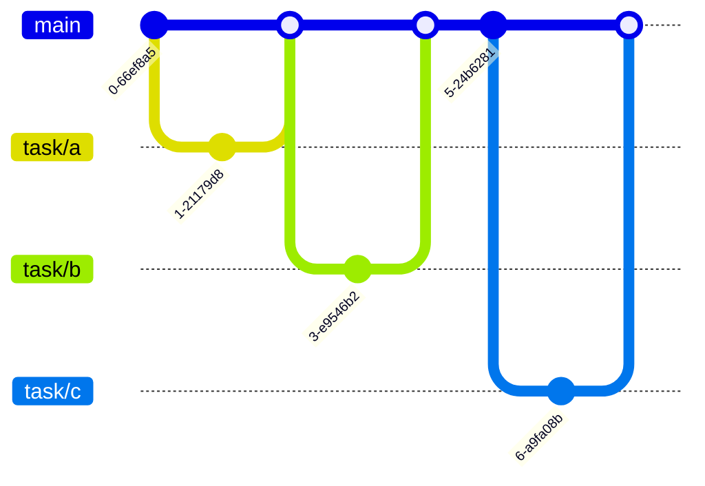
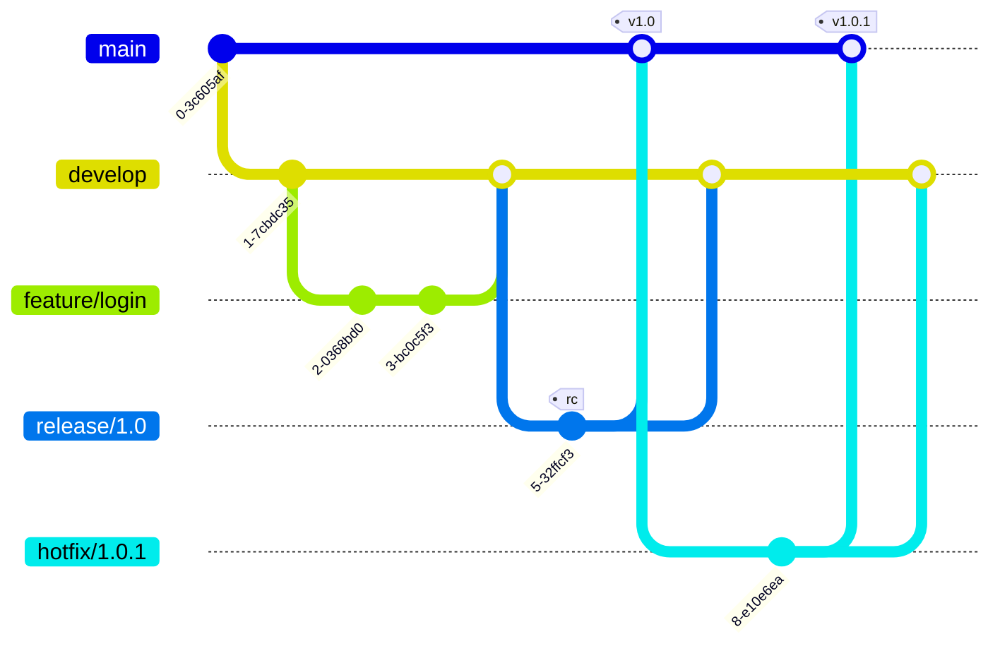
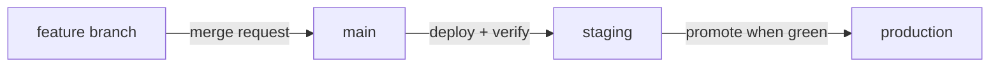
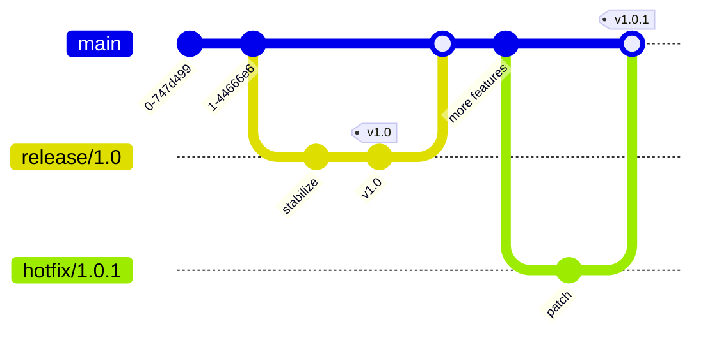

<div class="hero-section" style="background: linear-gradient(135deg, #4facfe 0%, #00f2fe 100%); color: white; padding: 3rem 2rem; margin: -2rem -3rem 2rem -3rem; text-align: center;">
  <h1 style="color: white; margin: 0; font-size: 2.5rem;">Git Branching Strategies</h1>
  <p style="font-size: 1.25rem; margin-top: 1rem; opacity: 0.9;">Git Flow, GitHub Flow, and team workflow patterns</p>
</div>

<div class="intro-card">
  <p class="lead-text">A branching strategy answers a deceptively simple question: where does work-in-progress live before it ships, and how does it get to production safely? Pick the wrong one and you get merge hell, "it works on my branch" surprises, and release-day panic; pick well and integration becomes routine. This guide compares the widely adopted approaches, shows each as a commit graph, and ends with a decision matrix for choosing one.</p>
</div>

<div class="tip-card">
  <h4>Where this fits among the Git pages</h4>
  <p>This page is about <strong>team workflow</strong> — how a group structures branches and releases. For the <em>mechanics</em> of branching commands, see the <a href="git-reference.html">Git Command Reference</a>; for a first walkthrough, the <a href="git-crash-course.html">Git Crash Course</a>; for how branches work internally, <a href="git.html">Git Version Control</a>.</p>
</div>

### At a glance

| Strategy | Long-lived branches | Release model | Complexity | Best fit |
|----------|--------------------|--------------|------------|----------|
| Trunk-based | `main` only | Continuous | Low | High-velocity teams, strong CI |
| GitHub Flow | `main` only | Continuous / frequent | Low | Web apps, SaaS, small–mid teams |
| GitLab Flow | `main` + env branches | Per-environment | Medium | Teams needing staging/prod gates |
| Git Flow | `main` + `develop` | Scheduled, versioned | High | Versioned/enterprise software |

A good branching strategy minimizes the complexity of managing multiple long-lived branches. It promotes collaboration and continuous integration by encouraging developers to merge changes into the mainline frequently — which means fewer merge conflicts and faster feedback on new features and bug fixes. The four strategies below trade simplicity for control in different ways; the rest of this page works through each, then offers a decision matrix.

## Trunk-Based Development

In trunk-based development, everyone integrates into a single shared branch — the *trunk* (usually `main`) — at least once a day. Work still happens on branches, but they live for hours, not weeks: a developer cuts a tiny branch from the latest `main`, opens a pull request, and merges back the same day. The bet is that many small, frequent integrations are far cheaper than a few large, painful ones.



<div class="tip-card">
  <h4>Why it works</h4>
  <p>The single biggest source of merge pain is <em>divergence over time</em>. By keeping branches short-lived and merging into one trunk continuously, you keep every developer working against nearly the same code — so conflicts are small and frequent rather than large and rare. It is the default model at Google, Meta, and most high-velocity CI teams.</p>
</div>

### The Workflow

1. **Sync** — pull the latest `main` before starting (`git pull --rebase origin main`).
2. **Branch small** — cut a short-lived branch for one task: `git switch -c task/cart-totals`.
3. **Build and commit** — make focused commits with clear messages.
4. **Re-sync often** — rebase onto `main` regularly so you never drift far.
5. **Review** — open a pull request; let CI run the test suite automatically.
6. **Merge and delete** — once green and approved, merge into `main` and delete the branch the same day.

<div class="pros-cons-grid">
  <div class="pros-section">
    <h4>What it buys you</h4>
    <div class="pro-item">Tiny, low-risk merges — conflicts stay small</div>
    <div class="pro-item">A continuously releasable mainline</div>
    <div class="pro-item">Fast feedback; less code drift and technical debt</div>
    <div class="pro-item">A simple model with no long-lived branches to track</div>
  </div>
  <div class="cons-section">
    <h4>What it demands</h4>
    <div class="con-item">A strong, fast automated test suite — the trunk must stay green</div>
    <div class="con-item">Discipline: commit often, branches measured in hours</div>
    <div class="con-item">Feature flags to hide work-in-progress behind a switch</div>
    <div class="con-item">Good communication so parallel work does not collide</div>
  </div>
</div>

<div class="notice--warning">
  <p><strong>The failure mode is the long-lived branch.</strong> The moment a branch lives for weeks, you forfeit every benefit above and re-create merge hell. If a feature is too big to land in a day, hide the unfinished parts behind a <a href="#feature-flags-with-branching">feature flag</a> and keep merging the pieces.</p>
</div>

## Git Flow

Git Flow, designed by Vincent Driessen in 2010, sits at the opposite end of the spectrum from trunk-based development. Instead of one mainline, it maintains two permanent branches and three kinds of temporary ones, each with strict rules for where it branches from and merges back to. That structure buys explicit control over versioned releases — at the cost of significant overhead.

<div class="notice--info">
  <p><strong>Read this before adopting Git Flow.</strong> Even its author now recommends a simpler model for teams shipping continuously: "if your team is doing continuous delivery of software, I suggest to adopt a much simpler workflow." Git Flow earns its complexity only when you genuinely ship discrete, versioned releases (think installable products, firmware, or multiple supported versions in the field) — not for a web app or SaaS that deploys many times a day.</p>
</div>

### Branch Types in Git Flow



| Branch | Lifetime | Branches from | Merges into | Purpose |
|--------|----------|---------------|-------------|---------|
| `main` | Permanent | — | — | Tagged, production-ready releases only |
| `develop` | Permanent | `main` | — | Integration line for completed features |
| `feature/*` | Temporary | `develop` | `develop` | One new feature each |
| `release/*` | Temporary | `develop` | `main` + `develop` | Stabilize and version a release |
| `hotfix/*` | Temporary | `main` | `main` + `develop` | Emergency fix to production |

### Git Flow Commands

The [`git-flow`](https://github.com/nvie/gitflow) helper wraps the underlying branch/merge/tag steps into higher-level commands (install it separately; it is not part of core Git):

```bash
# Initialize Git Flow
git flow init

# Start a new feature
git flow feature start feature-name

# Finish a feature
git flow feature finish feature-name

# Start a release
git flow release start 1.0.0

# Finish a release
git flow release finish 1.0.0

# Start a hotfix
git flow hotfix start fix-critical-bug

# Finish a hotfix
git flow hotfix finish fix-critical-bug
```

### When to Use Git Flow

**Best for:**
- Large teams with scheduled releases
- Projects requiring multiple versions in production
- Enterprise software with strict release cycles

**Not ideal for:**
- Continuous deployment environments
- Small teams or projects
- Web applications that need rapid updates

## GitHub Flow

GitHub Flow is the popular middle ground: simpler than Git Flow, slightly more structured than pure trunk-based. There is exactly one permanent branch — `main`, which is always deployable — and every change goes through a short-lived feature branch and a pull request. It is the default for most web apps, SaaS products, and small-to-medium teams that deploy frequently.

The one rule that matters: **`main` is always deployable.** Anything merged should be safe to ship immediately.

### GitHub Flow Workflow


### Steps in GitHub Flow

1. **Create a branch from main**
   ```bash
   git checkout -b feature/add-user-authentication
   ```

2. **Make changes and commit**
   ```bash
   git add .
   git commit -m "Add user authentication"
   ```

3. **Push to remote**
   ```bash
   git push origin feature/add-user-authentication
   ```

4. **Open a Pull Request**
   - Triggers discussion and code review
   - Runs automated tests

5. **Deploy for testing**
   - Many teams deploy the branch to a staging environment

6. **Merge to main**
   - After approval and successful tests
   - Automatically deploys to production

### Best Practices for GitHub Flow

- **Descriptive branch names**: Use prefixes like `feature/`, `fix/`, `chore/`
- **Small, focused PRs**: Easier to review and less likely to cause conflicts
- **Automated testing**: Essential for maintaining main branch stability
- **Deploy immediately**: After merging, deploy to production

## GitLab Flow

GitLab Flow combines aspects of Git Flow and GitHub Flow with the concept of environment branches. This approach has gained popularity as organizations adopt GitOps practices.

### Environment Branches

Changes flow in one direction ("upstream first") — merged into `main`, then promoted into each environment branch as it passes its gate:



### GitLab Flow Principles

1. **Upstream first**: Changes flow in one direction
2. **Feature branches**: All changes start in feature branches
3. **Merge requests**: Code review before merging
4. **Environment branches**: Represent deployment environments

### Implementation Example

```bash
# Create feature branch
git checkout -b feature/payment-integration

# Work on feature
git add .
git commit -m "Add payment integration"

# Push and create merge request
git push origin feature/payment-integration

# After approval, merge to main
git checkout main
git merge --no-ff feature/payment-integration

# Deploy to staging
git checkout staging
git merge --no-ff main

# After testing, deploy to production
git checkout production
git merge --no-ff staging
```

## Feature Branch Workflow

The Feature Branch Workflow is the foundation that other workflows build upon. Every feature is developed in a dedicated branch.

### Basic Workflow

```bash
# Start from main
git checkout main
git pull origin main

# Create feature branch
git checkout -b feature/shopping-cart

# Make changes
git add .
git commit -m "Add shopping cart functionality"

# Push to remote
git push -u origin feature/shopping-cart

# Create pull request and merge after review
```

### Naming Conventions

Common prefixes for branch names:
- `feature/` - New features
- `bugfix/` - Bug fixes
- `hotfix/` - Urgent production fixes
- `chore/` - Maintenance tasks
- `docs/` - Documentation updates
- `test/` - Test additions or modifications
- `refactor/` - Code refactoring

Example: `feature/JIRA-123-user-authentication`

## Release Branching Strategy

For projects with scheduled releases, a dedicated release branching strategy helps manage versions.

### Release Branch Workflow

A release branch is cut from the mainline, stabilized with only fixes (no new features), tagged at release, then merged back so those fixes are not lost:



### Managing Releases

```bash
# Create release branch
git checkout -b release/2.0 develop

# Make release-specific changes
git commit -m "Bump version to 2.0"
git commit -m "Update changelog"

# Merge to main
git checkout main
git merge --no-ff release/2.0
git tag -a v2.0 -m "Version 2.0"

# Merge back to develop
git checkout develop
git merge --no-ff release/2.0
```

## Choosing the Right Strategy

### Decision Matrix

| Factor | Trunk-Based | Git Flow | GitHub Flow | GitLab Flow |
|--------|-------------|----------|-------------|-------------|
| Team Size | Small | Large | Any | Any |
| Release Frequency | Continuous | Scheduled | Frequent | Variable |
| Complexity | Low | High | Low | Medium |
| Environment Count | 1-2 | Multiple | 1-2 | Multiple |
| Rollback Ease | Moderate | Easy | Moderate | Easy |

### Key Considerations

1. **Deployment frequency**: How often do you release?
2. **Team size**: Larger teams may need more structure
3. **Project complexity**: Complex projects benefit from structured flows
4. **Regulatory requirements**: Some industries need strict version control
5. **Customer expectations**: Enterprise vs. consumer software

## Advanced Techniques

### Feature Flags with Branching

Combine branching strategies with feature flags for more control:

```javascript
if (featureFlags.isEnabled('new-checkout-flow')) {
    // New implementation
} else {
    // Existing implementation
}
```

This allows:
- Deploying incomplete features safely
- A/B testing in production
- Gradual rollouts
- Quick rollbacks without redeployment

**Popular Feature Flag Services:**
- **LaunchDarkly**: Enterprise-grade feature management
- **Unleash**: Open-source feature toggle service
- **Split.io**: Feature flags with built-in experimentation
- **Flipper**: Simple, open-source feature flipping
- **AWS AppConfig**: Native AWS feature flag service

### Branch Protection Rules

Configure branch protection in your Git platform:

```yaml
# Example GitHub branch protection
main:
  required_reviews: 2
  dismiss_stale_reviews: true
  require_code_owner_reviews: true
  required_status_checks:
    - continuous-integration/travis-ci
    - security/snyk
  enforce_admins: true
  restrictions:
    users: []
    teams: ["release-managers"]
```

### Semantic Versioning with Branches

Align your branching strategy with semantic versioning:

```bash
# Major version (breaking changes)
release/2.0.0

# Minor version (new features)
release/1.1.0

# Patch version (bug fixes)
hotfix/1.0.1
```

## Common Pitfalls and Solutions

### Merge Conflicts

**Problem**: Frequent conflicts when merging long-lived branches

**Solutions**:
- Keep branches short-lived
- Regularly sync with the base branch
- Use smaller, focused commits

```bash
# Regularly update feature branch
git checkout feature/my-feature
git fetch origin
git rebase origin/main
```

### Branch Proliferation

**Problem**: Too many stale branches cluttering the repository

**Solutions**:
- Automated branch deletion after merge
- Regular branch cleanup scripts
- Clear branch lifecycle policies

```bash
# Delete merged branches
git branch --merged | grep -v "\*\|main\|develop" | xargs -n 1 git branch -d

# Delete remote tracking branches
git remote prune origin
```

### Inconsistent Practices

**Problem**: Team members using different workflows

**Solutions**:
- Document your chosen strategy
- Provide team training
- Use automation to enforce practices
- Regular team reviews

## Tools and Automation

### Git Hooks

Enforce branching rules with Git hooks:

```bash
#!/bin/bash
# .git/hooks/pre-push
# Prevent direct pushes to main

protected_branch='main'
current_branch=$(git symbolic-ref HEAD | sed -e 's,.*/\(.*\),\1,')

if [ $protected_branch = $current_branch ]; then
    echo "Direct push to $protected_branch branch is not allowed"
    exit 1
fi
```

**Modern Alternative - Using pre-commit framework:**
```yaml
# .pre-commit-config.yaml
repos:
  - repo: https://github.com/pre-commit/pre-commit-hooks
    rev: v4.5.0
    hooks:
      - id: no-commit-to-branch
        args: ['--branch', 'main', '--branch', 'production']
```

### CI/CD Integration

Example GitHub Actions workflow:


```yaml
name: Branch Protection
on:
  pull_request:
    branches: [main, develop]

jobs:
  validate:
    runs-on: ubuntu-latest
    steps:
      - uses: actions/checkout@v2
      - name: Validate branch name
        run: |
          if [[ ! "${{ github.head_ref }}" =~ ^(feature|bugfix|hotfix|chore)/.+ ]]; then
            echo "Branch name must start with feature/, bugfix/, hotfix/, or chore/"
            exit 1
          fi
```


## Conclusion

Choosing the right branching strategy depends on your team's needs, project requirements, and deployment practices. Start simple and add complexity only when needed. Remember that the best strategy is one that your team can follow consistently.

## Key Takeaways

<div class="takeaway-card">
  <ul>
    <li><strong>Default to simple:</strong> trunk-based or GitHub Flow with one long-lived branch suits most teams; add structure only when a real need appears.</li>
    <li><strong>Git Flow adds power and overhead:</strong> reserve its <code>develop</code>/<code>release</code>/<code>hotfix</code> branches for versioned or enterprise software with scheduled releases.</li>
    <li><strong>Short-lived branches</strong> and frequent integration are the single biggest lever against merge conflicts.</li>
    <li><strong>Enforce the workflow with automation</strong> — branch protection rules, naming checks, and required CI status checks beat documentation alone.</li>
    <li><strong>Feature flags decouple deploy from release,</strong> enabling continuous delivery even with incomplete features.</li>
  </ul>
</div>

## References

### Essential Documentation
- [Git Documentation](https://git-scm.com/doc)
- [Atlassian Git Tutorials](https://www.atlassian.com/git/tutorials/comparing-workflows)
- [GitHub Flow Guide](https://guides.github.com/introduction/flow/)
- [GitLab Flow Documentation](https://about.gitlab.com/topics/version-control/what-is-gitlab-flow/)
- [A Successful Git Branching Model](https://nvie.com/posts/a-successful-git-branching-model/) (Original Git Flow article)
- [Trunk Based Development](https://trunkbaseddevelopment.com/)

### Recent Developments
- [GitHub's Merge Queue](https://docs.github.com/en/repositories/configuring-branches-and-merges-in-your-repository/configuring-pull-request-merges/managing-a-merge-queue) - Automated merging at scale
- [Stacked Diffs/PRs](https://graphite.dev/blog/stacked-prs) - Managing dependent changes
- [Ship/Show/Ask](https://martinfowler.com/articles/ship-show-ask.html) - Branching strategy for continuous delivery
- [GitOps with ArgoCD](https://argo-cd.readthedocs.io/en/stable/) - Git as single source of truth

---

<div class="see-also-card">
  <h4>See Also</h4>
  <ul>
    <li><a href="git-crash-course.html">Git Crash Course</a> — branching basics if you are new to Git</li>
    <li><a href="git.html">Git Version Control</a> — internals, architecture, and distributed VCS fundamentals</li>
    <li><a href="git-reference.html">Git Command Reference</a> — command syntax for branch operations</li>
    <li><a href="ci-cd.html">CI/CD</a> — wiring branching strategies into continuous integration pipelines</li>
  </ul>
</div>
