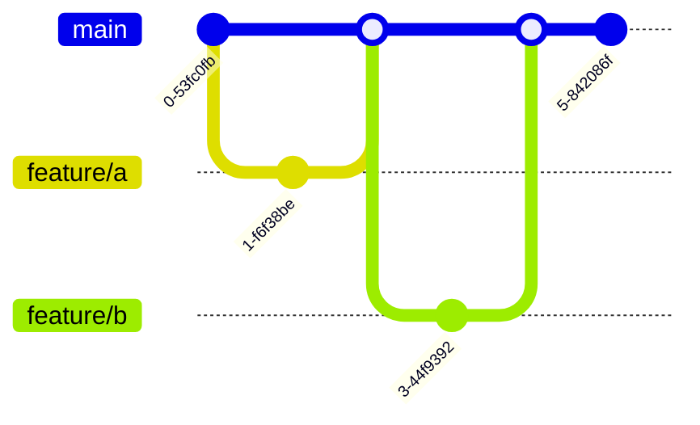
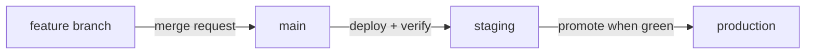

[Technology](./) &raquo; Git Branching Strategies

A branching strategy answers a deceptively simple question: where does work-in-progress live before it ships, and how does it get to production safely? Pick the wrong one and you get merge hell, "it works on my branch" surprises, and release-day panic; pick well and integration becomes routine. This guide compares the four widely adopted approaches, shows each as a commit graph, and gives you a decision matrix for choosing one.

This page is about **team workflow** — how a group structures branches and releases. For the *mechanics* of branching commands, see the [Git Command Reference](git-reference.html); for a first walkthrough, the [Git Crash Course](git-crash-course.html); for how branches work internally, [Git Version Control](git/). For feature flags, branch protection, release branching, and other production patterns, see [Advanced Branching Techniques](advanced-branching-techniques.html).

### At a glance

| Strategy | Long-lived branches | Release model | Complexity | Best fit |
|----------|--------------------|--------------|------------|----------|
| GitHub Flow | `main` only | Continuous / frequent | Low | Web apps, SaaS, small–mid teams |
| GitLab Flow | `main` + env branches | Per-environment | Medium | Teams needing staging/prod gates |
| Git Flow | `main` + `develop` | Scheduled, versioned | High | Versioned/enterprise software |
| Trunk-based | `main` only | Continuous | Low | High-velocity teams, strong CI |

A good branching strategy minimizes the complexity of managing multiple long-lived branches. It promotes collaboration and continuous integration by encouraging developers to merge changes into the mainline frequently — which means fewer merge conflicts and faster feedback on new features and bug fixes. The four strategies below trade simplicity for control in different ways; they are ordered by increasing ceremony, from the lightweight GitHub Flow to the highly structured Git Flow and the discipline-heavy trunk-based model.

## Choosing the Right Strategy

Before working through the four workflows, here is the decision you are actually making. The matrix below maps team and project characteristics onto the strategies; the considerations after it explain which factors should weigh most.

### Decision Matrix

| Factor | GitHub Flow | GitLab Flow | Git Flow | Trunk-Based |
|--------|-------------|-------------|----------|-------------|
| Team Size | Any | Any | Large | Small |
| Release Frequency | Frequent | Variable | Scheduled | Continuous |
| Complexity | Low | Medium | High | Low |
| Environment Count | 1-2 | Multiple | Multiple | 1-2 |
| Rollback Ease | Moderate | Easy | Easy | Moderate |

### Key Considerations

1. **Deployment frequency**: How often do you release? Continuous deployment pushes you toward GitHub Flow or trunk-based; discrete, scheduled releases favor Git Flow.
2. **Team size**: Larger teams may need more structure (and the explicit `develop`/`release` lanes Git Flow provides) to coordinate.
3. **Project complexity**: Complex projects with several environments benefit from the environment branches of GitLab Flow.
4. **Regulatory requirements**: Some industries need strict, auditable version control and supported back-versions — a strong argument for Git Flow.
5. **Customer expectations**: Enterprise software with installable, versioned releases differs sharply from a consumer web app that deploys many times a day.

**The short version:** Default to **GitHub Flow** — one always-deployable `main` and short-lived feature branches covers most teams. Add **environment branches (GitLab Flow)** when you need explicit staging/prod gates, reach for **Git Flow** only when you genuinely ship discrete versioned releases, and adopt **trunk-based** when you have the CI and discipline to integrate many times a day.

## GitHub Flow

GitHub Flow is the lightweight default: one permanent branch — `main`, which is always deployable — and every change goes through a short-lived feature branch and a pull request. It is the default for most web apps, SaaS products, and small-to-medium teams that deploy frequently.

The one rule that matters: **`main` is always deployable.** Anything merged should be safe to ship immediately.



### Steps in GitHub Flow

1. **Create a branch from main**
   ```bash
   git checkout -b feature/add-user-authentication
   ```

2. **Make changes and commit**
   ```bash
   git add .
   git commit -m "Add user authentication"
   ```

3. **Push to remote**
   ```bash
   git push origin feature/add-user-authentication
   ```

4. **Open a Pull Request** — triggers discussion, code review, and automated tests.

5. **Deploy for testing** — many teams deploy the branch to a staging environment.

6. **Merge to main** — after approval and successful tests, merge and (often) auto-deploy to production.

### Best Practices for GitHub Flow

- **Descriptive branch names**: Use prefixes like `feature/`, `fix/`, `chore/`.
- **Small, focused PRs**: Easier to review and less likely to cause conflicts.
- **Automated testing**: Essential for maintaining main branch stability.
- **Deploy immediately**: After merging, deploy to production.

## GitLab Flow

GitLab Flow combines aspects of GitHub Flow and Git Flow with the concept of **environment branches**. This approach has gained popularity as organizations adopt GitOps practices, because each long-lived branch maps to a deployed environment and code is promoted, not re-built, as it passes each gate.

### Environment Branches

Changes flow in one direction ("upstream first") — merged into `main`, then promoted into each environment branch as it passes its gate:



### GitLab Flow Principles

1. **Upstream first**: Changes flow in one direction — fixes land in `main` before being promoted downstream.
2. **Feature branches**: All changes start in feature branches.
3. **Merge requests**: Code review before merging.
4. **Environment branches**: Long-lived branches represent deployment environments.

### Implementation Example

```bash
# Create feature branch
git checkout -b feature/payment-integration

# Work on feature
git add .
git commit -m "Add payment integration"

# Push and create merge request
git push origin feature/payment-integration

# After approval, merge to main
git checkout main
git merge --no-ff feature/payment-integration

# Promote to staging
git checkout staging
git merge --no-ff main

# After testing, promote to production
git checkout production
git merge --no-ff staging
```

## Git Flow

Git Flow, designed by Vincent Driessen in 2010, sits at the structured end of the spectrum. Instead of one mainline, it maintains two permanent branches and three kinds of temporary ones, each with strict rules for where it branches from and merges back to. That structure buys explicit control over versioned releases — at the cost of significant overhead.

<div class="notice--info">
  <p><strong>Read this before adopting Git Flow.</strong> Even its author now recommends a simpler model for teams shipping continuously: "if your team is doing continuous delivery of software, I suggest to adopt a much simpler workflow." Git Flow earns its complexity only when you genuinely ship discrete, versioned releases (think installable products, firmware, or multiple supported versions in the field) — not for a web app or SaaS that deploys many times a day.</p>
</div>

### Branch Types in Git Flow


| Branch | Lifetime | Branches from | Merges into | Purpose |
|--------|----------|---------------|-------------|---------|
| `main` | Permanent | — | — | Tagged, production-ready releases only |
| `develop` | Permanent | `main` | — | Integration line for completed features |
| `feature/*` | Temporary | `develop` | `develop` | One new feature each |
| `release/*` | Temporary | `develop` | `main` + `develop` | Stabilize and version a release |
| `hotfix/*` | Temporary | `main` | `main` + `develop` | Emergency fix to production |

### Git Flow Commands

The [`git-flow`](https://github.com/nvie/gitflow) helper wraps the underlying branch/merge/tag steps into higher-level commands (install it separately; it is not part of core Git):

```bash
# Initialize Git Flow
git flow init

# Start / finish a feature
git flow feature start feature-name
git flow feature finish feature-name

# Start / finish a release
git flow release start 1.0.0
git flow release finish 1.0.0

# Start / finish a hotfix
git flow hotfix start fix-critical-bug
git flow hotfix finish fix-critical-bug
```

### When to Use Git Flow

**Best for:** large teams with scheduled releases; projects requiring multiple versions in production; enterprise software with strict release cycles.

**Not ideal for:** continuous deployment environments; small teams or projects; web applications that need rapid updates.

## Trunk-Based Development

In trunk-based development, everyone integrates into a single shared branch — the *trunk* (usually `main`) — at least once a day. Work still happens on branches, but they live for hours, not weeks: a developer cuts a tiny branch from the latest `main`, opens a pull request, and merges back the same day. The bet is that many small, frequent integrations are far cheaper than a few large, painful ones. It looks simple, but it demands the most discipline of the four.


**Why it works:** the single biggest source of merge pain is *divergence over time*. By keeping branches short-lived and merging into one trunk continuously, you keep every developer working against nearly the same code — so conflicts are small and frequent rather than large and rare. It is the default model at Google, Meta, and most high-velocity CI teams.

### The Workflow

1. **Sync** — pull the latest `main` before starting (`git pull --rebase origin main`).
2. **Branch small** — cut a short-lived branch for one task: `git switch -c task/cart-totals`.
3. **Build and commit** — make focused commits with clear messages.
4. **Re-sync often** — rebase onto `main` regularly so you never drift far.
5. **Review** — open a pull request; let CI run the test suite automatically.
6. **Merge and delete** — once green and approved, merge into `main` and delete the branch the same day.

| What it buys you | What it demands |
|------------------|-----------------|
| Tiny, low-risk merges — conflicts stay small | A strong, fast automated test suite — the trunk must stay green |
| A continuously releasable mainline | Discipline: commit often, branches measured in hours |
| Fast feedback; less code drift and technical debt | Feature flags to hide work-in-progress behind a switch |
| A simple model with no long-lived branches to track | Good communication so parallel work does not collide |

<div class="notice--warning">
  <p><strong>The failure mode is the long-lived branch.</strong> The moment a branch lives for weeks, you forfeit every benefit above and re-create merge hell. If a feature is too big to land in a day, hide the unfinished parts behind a <a href="advanced-branching-techniques.html#feature-flags-with-branching">feature flag</a> and keep merging the pieces.</p>
</div>

## Integrating: Merge vs. Rebase

Whichever strategy you pick, you eventually have to fold one branch into another, and Git offers two very different ways to do it. The difference is concrete: **rebase rewrites commits, giving them new hashes; merge preserves them and adds a merge commit.** Picture a `feature` branch with two commits that started from `main` at commit `a1b1c1`, while `main` has since gained a commit `d4e5f6`:

```
main:     a1b1c1 ── d4e5f6
                \
feature:         9f8e7d ── 1c2b3a
```

**Merge** (`git checkout main && git merge feature`) keeps the original commits untouched and joins the histories with a new merge commit `M`:

```
main:  a1b1c1 ── d4e5f6 ─────────── M
                \                  /
feature:         9f8e7d ── 1c2b3a
```

The hashes `9f8e7d` and `1c2b3a` are exactly the same as before — history is additive, and the branch's true shape is preserved.

**Rebase** (`git checkout feature && git rebase main`) instead replays your two commits on top of `d4e5f6`, producing brand-new commits with **different hashes**:

```
feature (before):  9f8e7d ── 1c2b3a   (parent a1b1c1)
feature (after):   7a6b5c ── 0d9e8f   (parent d4e5f6)
```

Same diffs, same messages, new identities — `9f8e7d` became `7a6b5c` and `1c2b3a` became `0d9e8f`. The result is a clean, linear history with no merge commit, which is why trunk-based and GitHub Flow teams often rebase feature branches before merging. The trade-off: because rebasing *rewrites* commits, you must never rebase commits that other people have already pulled.

<div class="notice--danger">
  <h4>The golden rule of rebasing</h4>
  <p><strong>Never rebase (or force-push) a branch that other people have based work on.</strong> The reason: rebasing replaces commits with new ones that have different hashes, so anyone who already pulled the old commits now has history that no longer exists on the remote. Their next pull either conflicts violently or, worse, silently re-introduces the commits you just rewrote.</p>
</div>

### A force-push that overwrites a teammate

Force-pushing is how a rewritten history gets onto the remote, and it is where the golden rule is most often violated. Suppose Alice and Bob are both working on `feature/checkout`:

1. Alice rebases her copy of `feature/checkout` to tidy up history, turning commits `1c2b3a` into a new commit `0d9e8f`, then runs `git push --force`. The remote branch now points at `0d9e8f`; the old `1c2b3a` is gone.
2. Meanwhile Bob had pulled the old `1c2b3a` and added his own commit `e1f2a3` on top of it. His local branch still references `1c2b3a` as its parent.
3. Bob finishes his work and runs `git push`. Git rejects it (his branch is "behind"), so — frustrated — Bob also runs `git push --force`. The remote now points at *his* line of history, and **Alice's `0d9e8f` is silently overwritten and lost.**

Each force-push clobbered the other person's work. The fix is twofold: prefer `git push --force-with-lease` (which refuses to overwrite commits you have not seen, so step 3 would fail safely instead of destroying Alice's work), and **only rewrite history on branches that are exclusively yours.** Shared branches should be integrated with merge, not rebase.

## See Also

- [Advanced Branching Techniques](advanced-branching-techniques.html) — feature flags, branch protection, release branching, semantic versioning, and automation
- [Git Crash Course](git-crash-course.html) — branching basics if you are new to Git
- [Git Version Control](git/) — internals, architecture, and distributed VCS fundamentals
- [Git Command Reference](git-reference.html) — command syntax for branch operations
- [CI/CD](ci-cd/) — wiring branching strategies into continuous integration pipelines

## References

- [Git Documentation](https://git-scm.com/doc)
- [Atlassian Git Tutorials — Comparing Workflows](https://www.atlassian.com/git/tutorials/comparing-workflows)
- [GitHub Flow Guide](https://guides.github.com/introduction/flow/)
- [GitLab Flow Documentation](https://about.gitlab.com/topics/version-control/what-is-gitlab-flow/)
- [A Successful Git Branching Model](https://nvie.com/posts/a-successful-git-branching-model/) (Original Git Flow article)
- [Trunk Based Development](https://trunkbaseddevelopment.com/)
