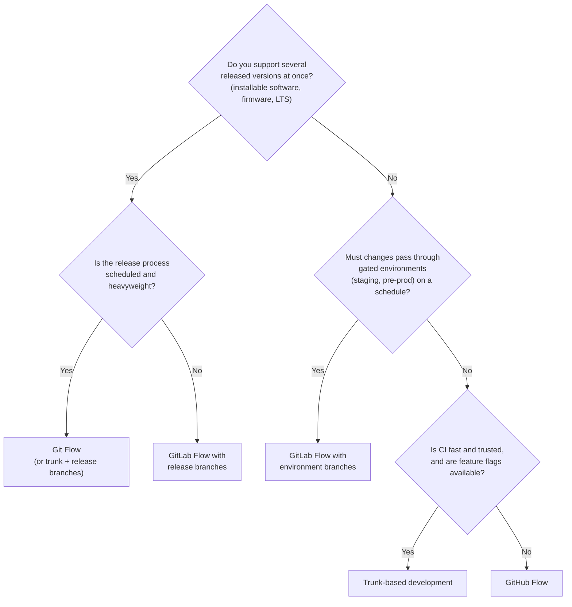
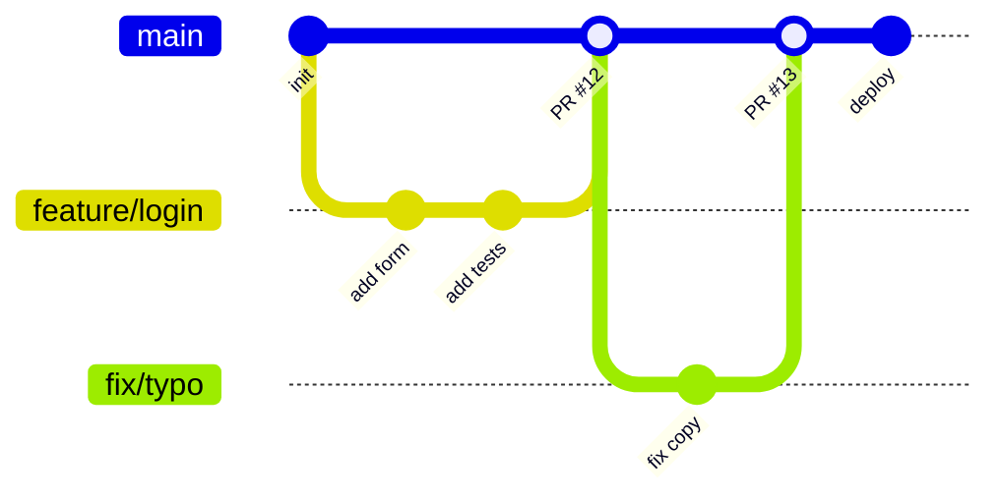
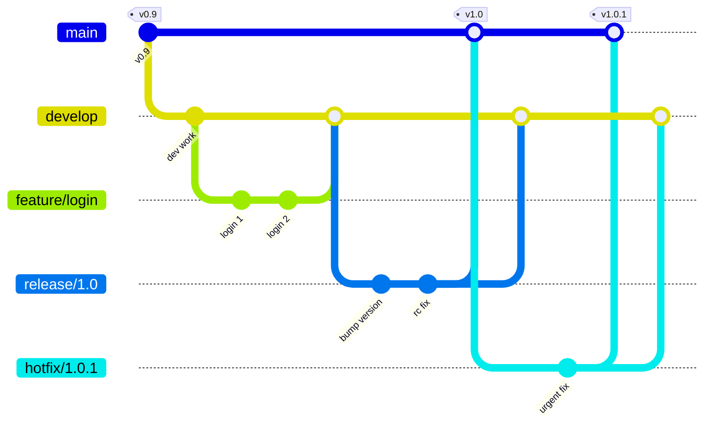
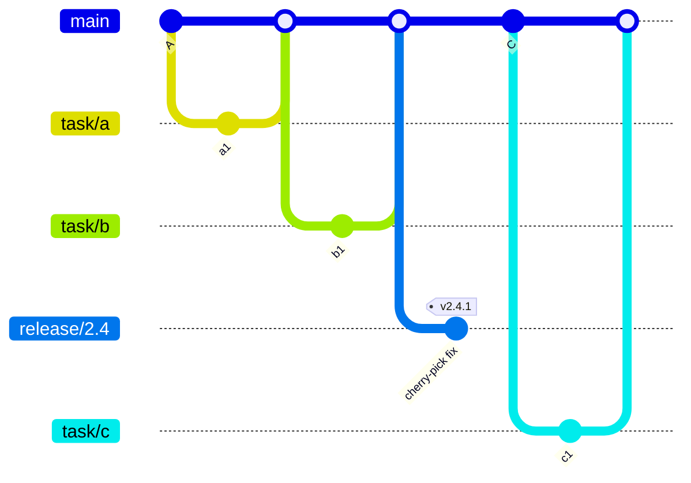
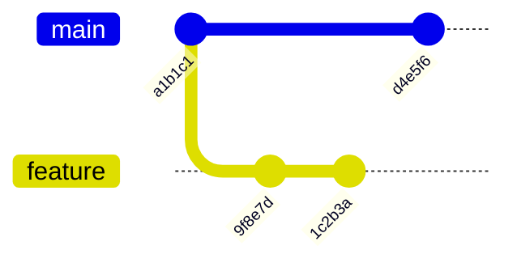
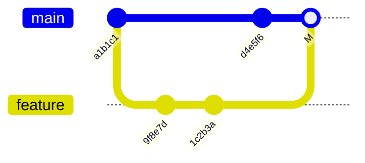
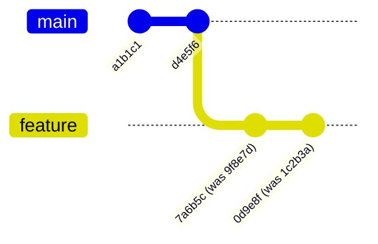

[Technology](./) &raquo; Git Branching Strategies

A **branching strategy** is a team's convention for where unfinished work lives and how it reaches production. It determines how often code is integrated, how releases are cut, and how fixes reach versions already shipped. This page compares the four widely used strategies (GitHub Flow, GitLab Flow, Git Flow and trunk-based development), shows each as a commit graph, and covers the integration choices they share: merge, squash or rebase, and how to rewrite history safely.

This page is about team workflow. For command syntax see the [Git Command Reference](git-reference.html); for a first walkthrough, the [Git Crash Course](git-crash-course.html); for how branches work internally, [Git Version Control](git/). Feature flags, branch protection, release branches and semantic versioning are covered in [Advanced Branching Techniques](advanced-branching-techniques.html).

## Overview

Every strategy is a trade-off between two costs. **Integration cost** grows with the time a branch lives apart from the mainline: the longer two lines of work diverge, the larger and riskier the eventual merge. **Release control** is the ability to stabilize, version and patch specific releases independently of ongoing development. Long-lived branches buy release control and pay for it in integration cost.

| | GitHub Flow | GitLab Flow | Git Flow | Trunk-based |
|---|---|---|---|---|
| Long-lived branches | `main` | `main` plus environment or release branches | `main` and `develop` | `main` (plus short-lived release branches, optionally) |
| Typical branch lifetime | Hours to days | Hours to days | Days to weeks | Hours; at most a day or two |
| Release model | Deploy on merge | Promote through environments, or maintain versioned branches | Scheduled, versioned releases | Continuous, from the trunk |
| Supports multiple versions in production | No | Yes (release branches) | Yes | Via release branches cut from trunk |
| Ceremony | Low | Medium | High | Low process, high engineering discipline |
| Prerequisites | CI on pull requests | CI plus deployment pipeline per environment | Release management | Fast, reliable CI; feature flags; often a merge queue |
| Typical fit | Web apps and SaaS | Staged deployments, regulated environments, on-premises products | Installable or embedded software with supported versions | High-velocity teams, monorepos |

## Choosing a strategy

The deciding questions are how you release and how many versions you support, not team size alone.



Further considerations:

- **Deployment frequency.** Continuous deployment favors GitHub Flow or trunk-based development. Discrete, scheduled releases favor Git Flow or GitLab Flow with release branches.
- **Audit and compliance.** Environment or release branches give a direct record of what was deployed where. The same record can come from signed tags and deployment logs, so regulation does not by itself require Git Flow.
- **Test confidence.** Trunk-based development depends on CI catching regressions before merge. Without that, merging many times a day to a shared branch spreads breakage quickly.
- **Team size.** Large teams on one trunk need automation (merge queues, code owners, fast builds) more than they need extra branches. Google and Meta run some of the largest trunk-based monorepos.

**Default recommendation:** start with GitHub Flow. Move toward trunk-based development as CI and feature flagging mature; add environment or release branches (GitLab Flow) when you need staged promotion or supported versions; use Git Flow only when you genuinely ship versioned releases on a schedule.

## GitHub Flow

GitHub Flow has one long-lived branch, `main`, which is always deployable. Every change is made on a short-lived branch and merged through a pull request after review and CI.



The steps, as GitHub documents them:

1. **Create a branch** from `main` with a short, descriptive name.
2. **Make changes**, committing and pushing to the branch.
3. **Open a pull request** to request review; CI runs on every push.
4. **Address review comments** with further commits.
5. **Merge** the pull request once approved and green. Many teams deploy automatically on merge; some deploy the branch to a staging or preview environment first.
6. **Delete the branch.**

```bash
git switch main && git pull
git switch -c feature/add-user-authentication
# ...edit, then:
git add -p
git commit -m "Add user authentication"
git push -u origin feature/add-user-authentication
# open the pull request, e.g. with the GitHub CLI:
gh pr create --fill
```

**Practices that make it work:**

- Keep pull requests small and focused; review quality drops sharply with size.
- Protect `main` with required reviews and required status checks, so nothing merges without CI passing (see [branch protection](advanced-branching-techniques.html#branch-protection-and-rulesets)).
- Use prefixes such as `feature/`, `fix/` and `chore/` so branch lists stay readable.
- Deploy soon after merging, so the change that broke production is easy to identify.

## GitLab Flow

GitLab Flow adds long-lived **downstream branches** to GitHub Flow for teams that cannot deploy every merge straight to production. It has two forms, and teams use whichever matches their release model.

### Environment branches

Each long-lived branch represents a deployment environment. Changes are merged to `main` first, then promoted by merging `main` into `staging`, and `staging` into `production`, each merge triggering that environment's deployment.

```mermaid
gitGraph
    commit id: "A"
    branch staging
    branch production
    checkout main
    commit id: "B"
    commit id: "C"
    checkout staging
    merge main id: "promote B,C"
    checkout main
    commit id: "D"
    checkout production
    merge staging id: "release B,C"
    checkout staging
    merge main id: "promote D"
```

```bash
# Feature work goes through a merge request into main, as in GitHub Flow.
# Promotion is a merge in one direction only:
git switch staging    && git merge --no-ff main    && git push
git switch production && git merge --no-ff staging && git push
```

A caution on this form: merging into an environment branch usually triggers a *new build* from that branch, so the artifact tested in staging is not byte-for-byte the one deployed to production. Many teams practicing GitOps therefore keep a single `main` branch, build each commit once, and promote the resulting image tag or release through environments by updating deployment configuration (see [CI/CD](ci-cd/)). Environment branches remain useful where each environment genuinely has its own deployment trigger and audit trail.

### Release branches

For software shipped to customers, long-lived branches represent released versions (`2-3-stable`, `2-4-stable`). A release branch is cut from `main` when a version is ready; after that it receives only bug fixes.

### Upstream first

In both forms, changes flow in one direction. A bug fix is merged to `main` first and then cherry-picked or merged into the downstream branches. Fixing only the release or production branch risks the bug reappearing in the next release.

```bash
# The fix was merged to main as commit abc1234; backport it to a release branch
git switch 2-4-stable
git cherry-pick -x abc1234   # -x records the original commit hash in the message
```

## Git Flow

Git Flow, described by Vincent Driessen in 2010, uses two permanent branches (`main` for released code and `develop` for integration) and three kinds of supporting branches, each with fixed rules for where it starts and where it merges.



| Branch | Lifetime | Branches from | Merges into | Purpose |
|--------|----------|---------------|-------------|---------|
| `main` | Permanent | (root) | (none) | Released code only; every commit is a tagged release |
| `develop` | Permanent | `main` | (none) | Integration line for completed features |
| `feature/*` | Temporary | `develop` | `develop` | One feature each |
| `release/*` | Temporary | `develop` | `main` and `develop` | Stabilize a release: version bump, fixes, no new features |
| `hotfix/*` | Temporary | `main` | `main` and `develop` (or the open release branch) | Urgent fix to the released version |

Driessen added a note to the original article in 2020 recommending a simpler workflow such as GitHub Flow for teams doing continuous delivery of web software, and reserving Git Flow for software that is explicitly versioned or must support multiple versions in the wild. Its costs are real: features wait in `develop` until the next release, `develop` and `main` can drift, and every hotfix must be merged twice.

### Tooling

The `git flow` commands are provided by an extension, not by Git itself. The original `nvie/gitflow` scripts and the widely used `git-flow-avh` fork are no longer maintained. **git-flow-next**, a Go reimplementation maintained by the makers of the Tower Git client, keeps the same command set.

```bash
git flow init                          # choose branch names and prefixes
git flow feature start login           # branch feature/login from develop
git flow feature finish login          # merge into develop, delete branch
git flow release start 1.0.0           # branch release/1.0.0 from develop
git flow release finish 1.0.0          # merge into main and develop, tag v1.0.0
git flow hotfix start 1.0.1            # branch hotfix/1.0.1 from main
git flow hotfix finish 1.0.1           # merge into main and develop, tag
```

The extension is a convenience. `release finish`, for example, is equivalent to:

```bash
git switch main    && git merge --no-ff release/1.0.0
git tag -a v1.0.0 -m "Release 1.0.0"
git switch develop && git merge --no-ff release/1.0.0
git branch -d release/1.0.0
```

## Trunk-based development

In trunk-based development, all developers integrate into one shared branch, the **trunk** (usually `main`), at least daily. Small teams may commit to the trunk directly; most teams use short-lived branches and pull requests that merge within hours. The premise is that many small integrations are cheaper than a few large ones: when nobody's work diverges far from the trunk, conflicts stay small.



Releases are either made continuously from the trunk, or cut as **release branches** that receive only cherry-picked fixes (fixed on the trunk first) and are never merged back. That is how trunk-based teams support a released version without a `develop` branch.

### Workflow

1. Update from the trunk: `git switch main && git pull --rebase`.
2. Branch for one small task: `git switch -c task/cart-totals`.
3. Commit in small steps, rebasing onto `main` if the branch lives more than a few hours.
4. Open a pull request; CI runs the full test suite.
5. Merge when green and approved, the same day if possible, and delete the branch.

### Requirements

| Practice | Why it is needed |
|----------|------------------|
| Fast, reliable automated tests | The trunk must stay releasable; a flaky or slow suite either blocks everyone or gets ignored |
| Feature flags | Unfinished features merge behind a disabled flag instead of waiting on a branch (see [feature flags](advanced-branching-techniques.html#feature-flags-with-branching)) |
| Branch by abstraction | Large refactors proceed incrementally behind an interface, keeping the trunk working at each step |
| Merge queue | On a busy trunk, two individually green pull requests can break the build together; a queue tests each change against the latest trunk plus the changes ahead of it before merging |
| Small changes | Reviews stay fast enough to merge the same day |

GitHub's merge queue and GitLab's merge trains are built-in implementations of the merge-queue pattern. On GitHub, workflows must also trigger on the `merge_group` event to run for queued changes.

<div class="notice--warning">
  <p><strong>The failure mode is the long-lived branch.</strong> A branch that lives for weeks reintroduces the large, risky merges that trunk-based development exists to avoid. If a feature cannot land in a day or two, split it and hide the incomplete parts behind a feature flag.</p>
</div>

### Stacked changes

A common complement to trunk-based development is to split a large change into a **stack** of small, dependent pull requests, each branched from the one below it, so reviewers see small diffs while the author keeps working. Gerrit and Meta's Sapling are built around this model, and tools such as Graphite and ghstack add it on top of GitHub. Plain Git supports it with `git rebase --update-refs` (Git 2.38 and later), which moves every branch in the stack when the bottom one is rebased.

## Integrating: Merge vs. Rebase

Whichever strategy you choose, branches are eventually combined, and there are three ways to do it. The key difference: **merge preserves existing commits and adds a merge commit; rebase and squash create new commits with new hashes.**

Start with a `feature` branch of two commits that began at `a1b1c1`, while `main` has since gained `d4e5f6`:



**Merge** (`git switch main && git merge feature`) leaves both commits untouched and joins the histories with a merge commit that has two parents:



**Rebase** (`git switch feature && git rebase main`) replays the branch's changes on top of `d4e5f6`. The diffs and messages are the same, but because each commit's parent changed, each gets a new hash:



After a rebase, `main` can be fast-forwarded to the tip of `feature`, giving a linear history with no merge commit.

**Squash merge** combines all the branch's changes into one new commit on `main`. The individual branch commits do not appear on `main` at all.

| Method | History on `main` | Preserves original commits | Good for |
|--------|-------------------|----------------------------|----------|
| Merge commit | Non-linear; shows where branches joined | Yes | Long-running or shared branches; Git Flow release and hotfix merges |
| Rebase, then fast-forward | Linear; every branch commit kept | No (new hashes) | Branches with a clean, meaningful commit series |
| Squash | Linear; one commit per pull request | No | Pull requests whose intermediate commits are noise ("fix typo", "address review") |

GitHub, GitLab and Bitbucket let repository owners enable or disable each method per repository. A consistent choice matters more than which one is chosen.

<div class="notice--danger">
  <h4>The golden rule of rebasing</h4>
  <p><strong>Do not rebase or force-push commits that other people have already based work on.</strong> Rebasing replaces commits with new ones, so anyone who pulled the old commits now has history that no longer exists on the remote. Their next pull produces conflicts or reintroduces the commits you rewrote. Rewriting history is safe on branches only you use.</p>
</div>

### A force-push that overwrites a teammate

Force-pushing is how rewritten history reaches the remote, and it is where the golden rule is usually broken. Suppose Alice and Bob both work on `feature/checkout`:

1. Alice rebases her copy to tidy the history, turning commit `1c2b3a` into `0d9e8f`, and runs `git push --force`. The remote branch now points at `0d9e8f`.
2. Bob had already pulled `1c2b3a` and committed `e1f2a3` on top of it.
3. Bob's `git push` is rejected because his branch no longer contains the remote tip. He runs `git push --force`. The remote now points at his history, and Alice's `0d9e8f` is gone from the remote.

Two habits prevent this:

- Use `git push --force-with-lease` instead of `--force`. It refuses to overwrite the remote branch unless it still points where your remote-tracking ref says it does, so Bob's push in step 3 fails instead of discarding Alice's work. Adding `--force-if-includes` (Git 2.30 and later) closes the remaining gap where a background `git fetch` updated the remote-tracking ref without you integrating the new commits.
- Integrate shared branches with merge, not rebase. Reserve rebasing for branches that only you push to.

```bash
git config --global alias.pushf "push --force-with-lease --force-if-includes"
```

## A note on branch names

Git's built-in default for the first branch of a new repository is still `master`, although GitHub, GitLab and Bitbucket create new repositories with `main`, and Git prints a hint suggesting a name be configured. Git's documented plan for its future 3.0 release changes the default to `main`; no release date has been set. To choose explicitly:

```bash
git config --global init.defaultBranch main
```

## See also

- [Advanced Branching Techniques](advanced-branching-techniques.html): feature flags, branch protection, release branches, semantic versioning and automation
- [Git Crash Course](git-crash-course.html): branching basics for newcomers
- [Git Version Control](git/): internals, architecture and distributed version control
- [Git Command Reference](git-reference.html): command syntax for branch operations
- [CI/CD](ci-cd/): connecting branching strategies to pipelines and deployments

## References

- [GitHub flow](https://docs.github.com/en/get-started/using-github/github-flow), GitHub Docs
- [Managing a merge queue](https://docs.github.com/en/repositories/configuring-branches-and-merges-in-your-repository/configuring-pull-request-merges/managing-a-merge-queue), GitHub Docs
- [What is GitLab Flow?](https://about.gitlab.com/topics/version-control/what-is-gitlab-flow/), GitLab
- Vincent Driessen, [A successful Git branching model](https://nvie.com/posts/a-successful-git-branching-model/) (2010, with 2020 note of reflection)
- [git-flow-next](https://github.com/gittower/git-flow-next)
- Paul Hammant et al., [Trunk Based Development](https://trunkbaseddevelopment.com/)
- Atlassian, [Comparing Git workflows](https://www.atlassian.com/git/tutorials/comparing-workflows)
- [Git: Breaking changes planned for Git 3.0](https://git-scm.com/docs/BreakingChanges)
