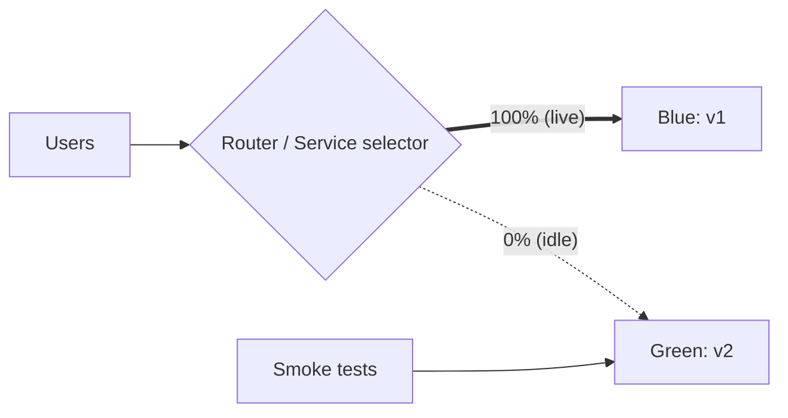
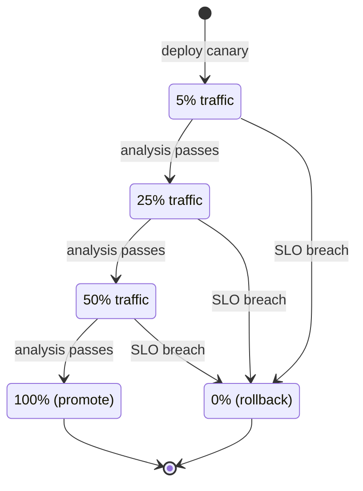
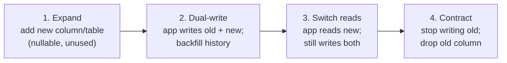

[CI/CD](./) ›

A **deployment strategy** determines how a new version replaces the old one in a running system: whether both versions ever run at once, how much traffic the new version sees before it is trusted, and how quickly a bad release can be reversed. This page compares the standard strategies, shows how each is implemented on Kubernetes, covers **progressive delivery** (automated, metric-driven promotion), and deals with the part that most often breaks rollbacks: database schema changes.

Two terms are worth separating first. **Deploying** puts new code on production infrastructure. **Releasing** exposes its behavior to users. Rolling and blue-green strategies couple the two. Canaries and feature flags deliberately decouple them, which is where most of the risk reduction comes from.

## Strategy Comparison

| Strategy | Mechanism | Downtime | Extra capacity | Mixed versions live? | Rollback speed | Blast radius of a bad release |
|----------|-----------|----------|----------------|----------------------|----------------|-------------------------------|
| **Recreate** | Stop all old instances, start new ones | Yes | None | No | Redeploy (minutes) | All users, until fixed |
| **Rolling** | Replace instances in batches | No | Small (`maxSurge`) | Yes, during rollout | Roll back through batches (minutes) | Grows as the rollout proceeds |
| **Blue-green** | Stand up full new environment, switch traffic at once | No | 2× during switch | No (atomic cutover) | Switch back (seconds) | All users, but briefly |
| **Canary** | Route a small, growing share of traffic to the new version, gated on metrics | No | Small | Yes, deliberately | Shift weight to 0 (seconds) | The canary percentage |
| **Feature flag** | Ship code dark; enable per user or cohort at runtime | No | None | Yes (by flag) | Toggle off (seconds, no deploy) | The targeted cohort |
| **Shadow (dark launch)** | Mirror real traffic to the new version and discard its responses | No | Up to 2× | Yes, invisible to users | Not needed | None (read paths only) |

These strategies combine. A common production setup is a **canary rollout** of every build, with **feature flags** controlling risky new behavior inside it, and the whole thing driven by **GitOps**.

## Recreate

The simplest strategy: terminate the old version, then start the new one (`strategy.type: Recreate` on a Kubernetes Deployment). There is an outage between the two, but the versions never overlap. That matters for workloads that cannot tolerate two versions writing to the same resource, such as singleton consumers, some stateful apps, and GPU jobs pinned to scarce hardware. It is acceptable for dev environments and batch systems, and rarely right for user-facing services.

## Rolling Update

The default for Kubernetes Deployments. The controller creates new pods and removes old ones in increments bounded by two parameters:

- `maxSurge`: how many pods *above* the desired count may exist during the rollout (extra capacity).
- `maxUnavailable`: how many pods *below* the desired count are tolerated (reduced capacity).

`maxSurge: 25%, maxUnavailable: 0` never drops capacity. `maxSurge: 0, maxUnavailable: 1` needs no extra capacity but runs one pod short. A rolling update is only as safe as its **readiness probe**. Traffic shifts to a new pod as soon as the probe passes, so a probe that returns 200 before the app can actually serve requests turns a rolling update into a rolling outage.

```yaml
apiVersion: apps/v1
kind: Deployment
metadata:
  name: web
spec:
  replicas: 6
  progressDeadlineSeconds: 600     # mark the rollout failed if stuck this long
  strategy:
    type: RollingUpdate
    rollingUpdate:
      maxSurge: 25%
      maxUnavailable: 0
  selector:
    matchLabels: { app: web }
  template:
    metadata:
      labels: { app: web }
    spec:
      containers:
        - name: web
          image: ghcr.io/example/web@sha256:3f1c...   # deploy by digest
          readinessProbe:
            httpGet: { path: /healthz/ready, port: 8080 }
            periodSeconds: 5
```

```bash
# In the pipeline: apply, wait for success, and roll back automatically if it fails
kubectl apply -f web-deployment.yaml
if ! kubectl rollout status deployment/web --timeout=10m; then
  kubectl rollout undo deployment/web
  exit 1
fi
```

`kubectl rollout status` only tells you that pods became *ready*. It does not tell you whether the new version is *correct*. That gap is what canary analysis fills.

## Blue-Green

Two complete environments exist side by side. **Blue** serves production while **green** receives the new version. Green is verified out of band (smoke tests, synthetic traffic), and then the router is switched so all traffic moves at once. Blue stays up, untouched, as an instant rollback target until the release is trusted.



On Kubernetes the "router" can be as simple as a Service whose selector names the active slot:

```bash
# 1. Deploy v2 to the idle (green) slot and wait for it to become ready
kubectl set image deployment/web-green web=ghcr.io/example/web@"$DIGEST"
kubectl rollout status deployment/web-green --timeout=5m

# 2. Verify green through its own internal Service before it gets real traffic
./smoke-test.sh http://web-green.internal

# 3. Cut over: point the public Service at the green pods
kubectl patch service web -p '{"spec":{"selector":{"app":"web","slot":"green"}}}'

# Rollback is the same patch with slot=blue. It takes seconds because blue never stopped.
```

Trade-offs:

- **Cost.** You pay for 2× capacity during the release window. With autoscaling, the idle slot can be kept small and scaled up just before cutover.
- **State.** Both slots usually share one database, so the schema must work for both versions at once (see [Database Migrations](#database-migrations)). Long-lived connections (WebSockets, gRPC streams) do not follow a selector change and must be drained.
- **All-or-nothing.** A bug that smoke tests miss hits 100% of users at cutover. Blue-green reduces *time to recover*, not *exposure*.

## Canary Releases

A canary sends a small fraction of real production traffic to the new version, compares its health against the stable version, and increases the fraction in steps only while the metrics stay healthy. A bad release reaches, say, 5% of requests for a few minutes instead of everyone.



Canarying needs two capabilities: **weighted traffic splitting** and **automated analysis**.

**Traffic splitting.** Simply running 1 canary pod next to 19 stable pods behind one Service gives roughly 5% of connections, but the ratio is coarse and depends on the replica count. Precise weights come from the routing layer: a service mesh (Istio, Linkerd), an ingress controller, or the Kubernetes **Gateway API**, whose `HTTPRoute` supports weighted `backendRefs` in a vendor-neutral way:

```yaml
apiVersion: gateway.networking.k8s.io/v1
kind: HTTPRoute
metadata:
  name: web
spec:
  parentRefs:
    - name: public-gateway
  rules:
    - backendRefs:
        - name: web-stable
          port: 80
          weight: 95
        - name: web-canary
          port: 80
          weight: 5
```

**Analysis.** A shell loop that polls an error rate works as an illustration but does not hold up in production. It ignores latency, has no statistical baseline, and leaves partial state behind when it fails. Use a progressive-delivery controller instead.

### Progressive Delivery with Argo Rollouts

**Argo Rollouts** (and the similar **Flagger**) replaces the Deployment with a controller that runs the canary steps, adjusts the traffic router's weights, queries a metrics provider at each step, and aborts and reverts automatically on failure. The pipeline's only job is to update the image. Promotion and rollback happen in the cluster.

```yaml
apiVersion: argoproj.io/v1alpha1
kind: Rollout
metadata:
  name: web
spec:
  replicas: 10
  selector:
    matchLabels: { app: web }
  template:
    metadata:
      labels: { app: web }
    spec:
      containers:
        - name: web
          image: ghcr.io/example/web@sha256:3f1c...
  strategy:
    canary:
      stableService: web-stable
      canaryService: web-canary
      trafficRouting:
        plugins:
          argoproj-labs/gatewayAPI:      # Gateway API traffic-router plugin
            httpRoute: web
            namespace: default
      analysis:                          # background analysis for the whole rollout
        templates:
          - templateName: success-rate
        startingStep: 1
      steps:
        - setWeight: 5
        - pause: { duration: 10m }
        - setWeight: 25
        - pause: { duration: 10m }
        - setWeight: 50
        - pause: { duration: 10m }
---
apiVersion: argoproj.io/v1alpha1
kind: AnalysisTemplate
metadata:
  name: success-rate
spec:
  metrics:
    - name: success-rate
      interval: 1m
      failureLimit: 2                    # abort after 2 failed measurements
      successCondition: result[0] >= 0.99
      provider:
        prometheus:
          address: http://prometheus.monitoring:9090
          query: |
            sum(rate(http_requests_total{service="web-canary",code!~"5.."}[2m]))
            /
            sum(rate(http_requests_total{service="web-canary"}[2m]))
```

Good canary metrics are the service's **SLIs** (error rate, p95/p99 latency, saturation), compared against the stable version over the same window rather than against a fixed number, so that a traffic spike affecting both versions does not abort the release. Low-traffic services may not produce enough requests at 5% for a meaningful signal. Such services need longer steps, synthetic load, or a switch to blue-green.

## Feature Flags

Feature flags decouple **deploy** from **release**. New code ships to production turned off, and a runtime flag service decides per request whether each user sees it. Flags allow percentage rollouts, targeting (internal staff first, then a region, then everyone), and a kill switch that works in seconds without a deployment. They are also what makes trunk-based development workable, because unfinished features can merge to `main` behind a flag.

**OpenFeature** (a CNCF project) standardizes the flag-evaluation API so application code is not tied to a vendor. The provider (LaunchDarkly, Flagsmith, Unleash, flagd, a cloud provider's service, and others) is chosen at startup:

```javascript
import { OpenFeature } from '@openfeature/server-sdk';

// At startup: OpenFeature.setProvider(new SomeVendorProvider(...));
const flags = OpenFeature.getClient();

export async function checkoutHandler(req, res) {
  const useNewFlow = await flags.getBooleanValue(
    'new-checkout-flow',            // flag key
    false,                          // default if the provider is unavailable
    { targetingKey: req.user.id },  // consistent bucketing per user
  );
  return useNewFlow ? renderNewCheckout(req, res) : renderOldCheckout(req, res);
}
```

The rollout then happens in the flag service (1% → 10% → 50% → 100%) and not in the pipeline. Two cautions:

- **Flags are debt.** Every flag doubles the code paths to test. Give each release flag an owner and an expiry date, and delete it once it reaches 100%. Long-lived *operational* flags (kill switches, load shedding) are a separate, deliberate category.
- **Safe defaults.** The default value is what users get when the flag service is unreachable, so it should almost always be the old, known-good behavior.

## Database Migrations

Most rollback failures come from the schema, not the code. During any zero-downtime strategy, old and new application versions run against **the same database** at the same time, and after a rollback the old version must still work against whatever schema the new version left behind. The standard technique is **expand/contract** (also called *parallel change*): every schema change is split into backward-compatible steps shipped in separate releases.



Each arrow is a separate deployment, and each intermediate state is compatible with the release before it, so any single step can be rolled back. Only the final **contract** step is destructive, and it ships after the new code has proven itself. Practical rules:

- Migrations run as their own pipeline step (or a pre-deploy job) *before* the new code rolls out, never lazily at application startup across many replicas.
- Avoid locking DDL on large tables. Use online schema-change tooling (`gh-ost`/`pt-online-schema-change` for MySQL, `CREATE INDEX CONCURRENTLY` in PostgreSQL).
- Renaming a column is not one migration but four (add, dual-write, switch reads, drop).

## Rollback and Roll-Forward

| Approach | How | When |
|----------|-----|------|
| **Automated rollback** | Controller aborts (Argo Rollouts, `rollout undo`, blue-green switch-back) when health checks or SLOs fail | Default for any detectable regression |
| **Git revert (GitOps)** | Revert the commit that bumped the image; the GitOps operator reconciles the cluster back | Keeps Git as the source of truth; see [GitOps](security-and-operations.html#gitops) |
| **Flag off** | Disable the feature flag | Behavioral bugs in flagged code; fastest option |
| **Roll forward** | Ship a fix through the normal pipeline | When rollback is impossible (irreversible migration, external side effects) or the fix is trivial |

A rollback path that has never been exercised should be assumed broken. Rehearse it in staging, keep previous artifacts available (never garbage-collect the last *N* released digests), and track **failed deployment recovery time** as a first-class metric (see [DORA metrics](security-and-operations.html#measuring-delivery-dora-metrics)).

---

<nav class="page-nav">
  <a href="platforms-and-pipelines.html">⬅ Platforms & Pipeline Design</a>
  <a href="security-and-operations.html">Security, GitOps & Operations ➡</a>
</nav>

## See Also

- [Platforms & Pipeline Design](platforms-and-pipelines.html) — building the artifact these strategies deploy
- [Security, GitOps & Operations](security-and-operations.html) — GitOps, observability, and DORA metrics
- [Kubernetes](../kubernetes/) — Deployments, Services, and probes behind these rollout patterns
- [Kubernetes Workloads](../kubernetes/workloads.html) — health probes and autoscaling
- [Database Design](../database-design/) — schema design and migrations
