<div class="hero-section" style="background: linear-gradient(135deg, #4facfe 0%, #00f2fe 100%); color: white; padding: 2rem; margin: -2rem -3rem 2rem -3rem; text-align: center;">
  <h1 style="color: white; margin: 0; font-size: 2.25rem;">CI/CD</h1>
  <p style="font-size: 1.1rem; margin-top: 0.5rem; opacity: 0.9;">Continuous integration and deployment: from code to production</p>
</div>

**CI/CD** is the practice of building, testing, and releasing software through an automated pipeline that runs on every change. Instead of batching weeks of work into a risky manual release, each commit is integrated into the main line, verified by machines within minutes, and promoted toward production by the same repeatable process. This hub defines the terms, shows the shape of a modern pipeline, and links to the detailed pages on platforms, deployment strategies, and pipeline security.

## Terminology

The three terms are frequently conflated. They describe successively longer stretches of the path from commit to user.

| Practice | What is automated | Where it stops |
|----------|------------------|----------------|
| **Continuous Integration (CI)** | Every change is merged to a shared main line at least daily, and each merge triggers a build plus automated tests. | A verified build artifact. |
| **Continuous Delivery** | Every verified artifact is automatically deployed to production-like environments and kept *releasable* at all times. | A human decides *when* to push to production. |
| **Continuous Deployment** | Every change that passes the pipeline goes to production with no manual gate. | Production. |

CI is a prerequisite for either form of CD, and it delivers most of its value on its own: a team can run strong CI for years before automating production releases. The distinction between delivery and deployment is purely the final promotion step. Many teams practice continuous deployment for stateless services and continuous delivery for anything touching schemas, billing, or regulated data.

A related idea is **trunk-based development**: short-lived branches (hours to a day or two) merged frequently into `main`, with unfinished work hidden behind [feature flags](deployment.html#feature-flags) instead of long-running branches. CI only works as intended when integration is actually continuous. See [Branching Strategies](../branching.html) for how branch models interact with pipelines.

## Anatomy of a Pipeline

A pipeline is a sequence of **stages**, each acting as a gate: if a stage fails, later stages do not run. Fast, cheap checks run first so most failures surface within a few minutes.

```mermaid
flowchart LR
    COMMIT["Commit / PR"] --> BUILD["Build<br/>compile, package"]
    BUILD --> TEST["Test<br/>unit, lint, types"]
    TEST --> SCAN["Security<br/>SCA, SAST, secrets"]
    SCAN --> ART[("Artifact registry<br/>signed + SBOM")]
    ART --> STAGE["Deploy to staging<br/>integration / E2E"]
    STAGE --> GATE{"Promote?"}
    GATE -->|"human approval<br/>(Continuous Delivery)"| PROD["Progressive rollout<br/>to production"]
    GATE -->|"automatic<br/>(Continuous Deployment)"| PROD
    PROD --> OBS["Observe<br/>metrics, SLOs"]
    OBS -.->|"regression"| RB["Automated rollback"]
```



Several principles apply regardless of platform:

- **Build once, promote everywhere.** The artifact that passed tests (a container image digest, a signed binary) is the exact artifact deployed to staging and production. Rebuilding per environment silently invalidates earlier test results.
- **Everything as code.** Pipeline definitions, infrastructure, and deployment manifests live in version control and are reviewed like application code.
- **Fast feedback.** A PR pipeline that takes longer than roughly 10 minutes starts to be ignored or batched around. Caching, parallelism, and test selection are how you keep it short (see [Platforms & Pipeline Design](platforms-and-pipelines.html#keeping-pipelines-fast)).
- **Least privilege.** Pipelines hold production credentials and publish artifacts that everyone downstream trusts, which makes them a high-value target. Short-lived OIDC credentials and pinned dependencies are the baseline (see [Security, GitOps & Operations](security-and-operations.html)).
- **Reversibility.** Every deployment strategy should have an automated path back to the previous version.

## A Minimal Pipeline

A small but realistic GitHub Actions workflow for a Node.js service. It runs CI on every pull request and push, cancels superseded runs, and deploys from `main` into a protected `production` environment. That environment can require reviewers, which is what turns this from continuous deployment into continuous delivery.


```yaml
# .github/workflows/ci.yml
name: CI

on:
  push:
    branches: [main]
  pull_request:

# Default the GITHUB_TOKEN to read-only; widen per job only where needed.
permissions:
  contents: read

# A new push to the same branch cancels the run already in progress.
concurrency:
  group: ${{ github.workflow }}-${{ github.ref }}
  cancel-in-progress: true

jobs:
  test:
    runs-on: ubuntu-latest
    steps:
      - uses: actions/checkout@v6
      - uses: actions/setup-node@v6
        with:
          node-version: 24        # current Active LTS
          cache: npm
      - run: npm ci
      - run: npm run lint
      - run: npm test
      - run: npm run build

  deploy:
    needs: test                   # only runs if every test step passed
    if: github.ref == 'refs/heads/main' && github.event_name == 'push'
    runs-on: ubuntu-latest
    environment: production       # protection rules / required reviewers apply here
    permissions:
      contents: read
      id-token: write             # mint an OIDC token for keyless cloud auth
    steps:
      - uses: actions/checkout@v6
      - run: ./scripts/deploy.sh
```


For a supply-chain-hardened version of this workflow, pin each `uses:` reference to a full commit SHA rather than a tag. The [security page](security-and-operations.html#hardening-github-actions) explains why.

## Maturity Path

Pipelines are usually built up incrementally. A common progression:

| Stage | Capabilities | Signals it is working |
|-------|-------------|------------------------|
| **1. Automated build and test** | Pipeline on every PR; unit tests and lint; branch protection requiring green checks | Broken builds on `main` become rare and are fixed within an hour |
| **2. Quality and security gates** | Dependency and secret scanning; integration tests; automatic deploy to a staging environment | Vulnerable dependencies and leaked keys are caught before merge |
| **3. Fast and reliable** | Caching, parallel/sharded tests, flaky-test quarantine, merge queue | PR feedback under ~10 minutes; reruns are the exception |
| **4. Safe production release** | Immutable signed artifacts, progressive delivery (canary or blue-green), automated rollback, OIDC credentials | Deploys are routine, several per day, with low change-fail rate |
| **5. Measured and self-service** | DORA metrics, GitOps, reusable pipeline templates or an internal platform | Teams onboard new services without bespoke pipeline work |

## Guides in This Section

| Page | Covers |
|------|--------|
| [Platforms & Pipeline Design](platforms-and-pipelines.html) | GitHub Actions, GitLab CI/CD, Jenkins, CircleCI and others compared; pipeline topologies (linear, DAG, matrix); caching and speed; testing strategy |
| [Deployment Strategies](deployment.html) | Recreate, rolling, blue-green, canary, and feature flags; progressive delivery with Argo Rollouts and the Gateway API; database migrations; rollback |
| [Security, GitOps & Operations](security-and-operations.html) | Pipeline threat model, secrets and OIDC, hardening GitHub Actions, SLSA provenance, signing and SBOMs, GitOps, IaC pipelines, DORA metrics, troubleshooting |

## See Also

- [Git Version Control](../git/) — the commits that trigger every pipeline
- [Branching Strategies](../branching.html) — branch models and how they shape pipelines
- [Docker](../docker/) — reproducible build environments and container artifacts
- [Kubernetes](../kubernetes/) — the platform most rollout strategies target
- [Terraform](../terraform/) — infrastructure as code in the pipeline
- [Monorepo Architecture](../../advanced/monorepo/) — affected-target builds and CI at scale
- [Cybersecurity](../cybersecurity/) — broader context for pipeline and supply-chain security
