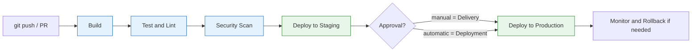

<div class="hero-section" style="background: linear-gradient(135deg, #4facfe 0%, #00f2fe 100%); color: white; padding: 2rem; margin: -2rem -3rem 2rem -3rem; text-align: center;">
  <h1 style="color: white; margin: 0; font-size: 2.25rem;">CI/CD</h1>
  <p style="font-size: 1.1rem; margin-top: 0.5rem; opacity: 0.9;">Continuous integration and deployment: from code to production</p>
</div>

CI/CD turns software delivery from a risky, manual process into an automated, reliable pipeline. Automatically building, testing, and deploying every change lets teams release faster, catch bugs in minutes instead of weeks, and free developers from manual deployment toil — a safety net that makes it safe to ship many times a day.

## What is CI/CD?

The three terms are often conflated:

- **Continuous Integration (CI)** — developers merge changes frequently (often several times a day), and each merge triggers an automated build and test run.
- **Continuous Deployment (CD)** — every change that passes all tests is deployed to production automatically, with no manual gate.
- **Continuous Delivery** — the same, except the final promotion to production requires a manual approval.

### The Restaurant Kitchen Analogy

A traditional release is one chef cooking an entire meal alone, with no one tasting it until it reaches the customer — if anything is wrong, the whole meal is remade. CI/CD is a kitchen where many chefs work in parallel, each dish is tasted the moment it's ready (CI), approved dishes go straight out (CD), and the kitchen runs continuously, serving many orders at once.

### The Pipeline at a Glance

A commit flows through automated stages, each a gate that must pass before the next runs. The split between Delivery and Deployment is simply whether the final promotion to production is manual or automatic.



---

## Getting Started

You can stand up a working pipeline in well under an hour, then deepen it over the following weeks.

### Your First Pipeline (30 Minutes)

Build a simple CI/CD pipeline for a Node.js application using GitHub Actions:

```yaml
# .github/workflows/ci-cd.yml
name: CI/CD Pipeline

on:
  push:
    branches: [ main, develop ]
  pull_request:
    branches: [ main ]

jobs:
  # Job 1: Continuous Integration
  test:
    runs-on: ubuntu-latest

    steps:
    - uses: actions/checkout@v4

    - name: Setup Node.js
      uses: actions/setup-node@v3
      with:
        node-version: '18'
        cache: 'npm'

    - name: Install dependencies
      run: npm ci

    - name: Run linter
      run: npm run lint

    - name: Run tests
      run: npm test

    - name: Build application
      run: npm run build

  # Job 2: Continuous Deployment
  deploy:
    needs: test  # Only run if tests pass
    runs-on: ubuntu-latest
    if: github.ref == 'refs/heads/main'

    steps:
    - uses: actions/checkout@v4

    - name: Deploy to production
      run: |
        # Your deployment commands here
        echo "Deploying to production..."
```

**Understanding the pipeline flow:**

1. **Trigger**: Code pushed to main/develop or PR opened
2. **Checkout**: Pipeline gets latest code
3. **Setup**: Install required tools (Node.js)
4. **Dependencies**: Install project dependencies
5. **Quality Checks**: Run linter for code standards
6. **Tests**: Execute automated tests
7. **Build**: Compile/bundle the application
8. **Deploy**: If on main branch and tests pass, deploy

**Quick-start checklist:**

- [ ] Create `.github/workflows/` directory
- [ ] Add workflow YAML file
- [ ] Define trigger events (push, PR, schedule)
- [ ] Set up build environment
- [ ] Add test commands
- [ ] Configure deployment (if ready)
- [ ] Commit and push to see it run

### A Four-Week Path to Production

Once the first pipeline runs, expand it incrementally:

| Week | Focus | Tasks |
|------|-------|-------|
| **1 — Foundation** | Get a pipeline running | Choose a platform, create a "Hello World" pipeline, add basic tests, set up notifications |
| **2 — Expansion** | Add quality gates | Add linting, enable branch protection, create a staging deployment, add security scanning |
| **3 — Optimization** | Make it fast and safe | Implement caching, parallelize tests, add performance tests, build deployment rollback |
| **4 — Production Ready** | Operate with confidence | Set up monitoring, implement blue-green deployment, add compliance checks, document runbooks |

---

## Explore the Guides

<div class="command-grid">
  <div class="nav-card">
    <h4><i class="fas fa-sitemap"></i> <a href="platforms-and-pipelines.html">Platforms & Pipeline Design</a></h4>
    <p>Popular CI/CD platforms compared, pipeline design patterns, and testing strategies.</p>
  </div>
  <div class="nav-card">
    <h4><i class="fas fa-exchange-alt"></i> <a href="deployment.html">Deployment Strategies</a></h4>
    <p>Blue-green, canary, rolling deployments, and feature flags for releasing safely.</p>
  </div>
  <div class="nav-card">
    <h4><i class="fas fa-shield-alt"></i> <a href="security-and-operations.html">Security, GitOps & Operations</a></h4>
    <p>Securing pipelines, monitoring and observability, GitOps, IaC integration, and advanced topics.</p>
  </div>
</div>

---

## Key Takeaways

- **CI and CD are distinct.** CI integrates and tests every change automatically; CD takes passing builds the rest of the way to staging or production. You can adopt CI long before full CD.
- **Fast feedback is the point.** The value is catching problems in minutes, not days. Parallelize tests, fail fast, and keep pipelines quick enough that developers trust them.
- **Deploy strategies manage risk.** Blue-green, canary, and rolling deployments trade speed for safety in different ways; pair them with automated rollback so a bad release is reversible.
- **Secure the supply chain.** Pipelines hold secrets and ship artifacts. Scan dependencies, sign artifacts, generate SBOMs, and grant least-privilege credentials to runners.

---

## See Also

- [Git Version Control](../git/) — the commits that trigger every pipeline
- [Branching Strategies](../branching.html) — workflow patterns that shape your pipeline
- [Docker](../docker/) — containerization for consistent build environments
- [Kubernetes](../kubernetes/) — orchestration and automated deployments
- [Terraform](../terraform/) — infrastructure as code for automated provisioning
- [Cybersecurity](../cybersecurity/) — securing the pipeline and its secrets
